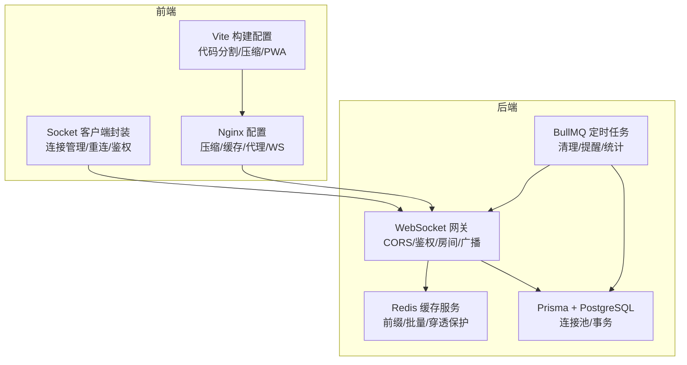
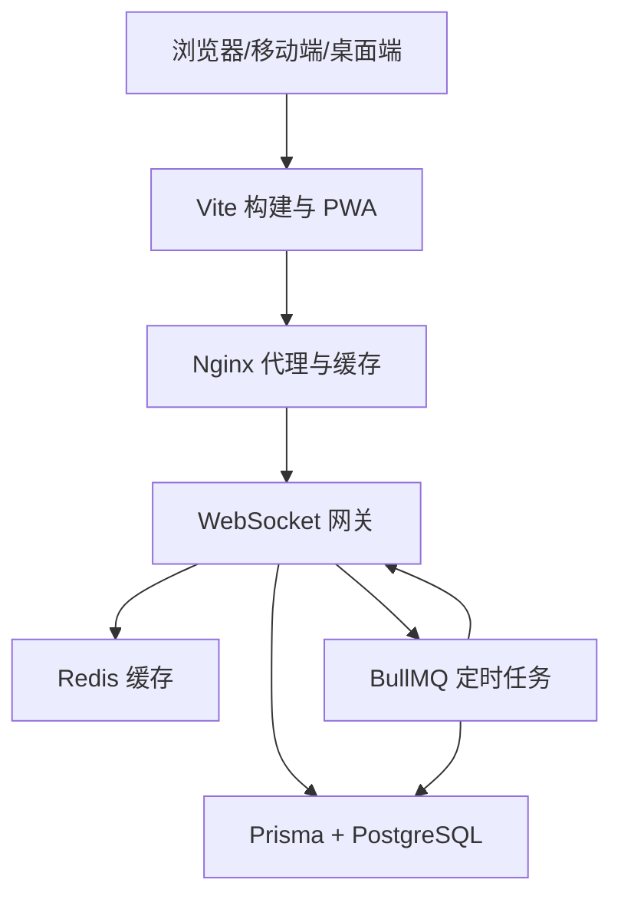
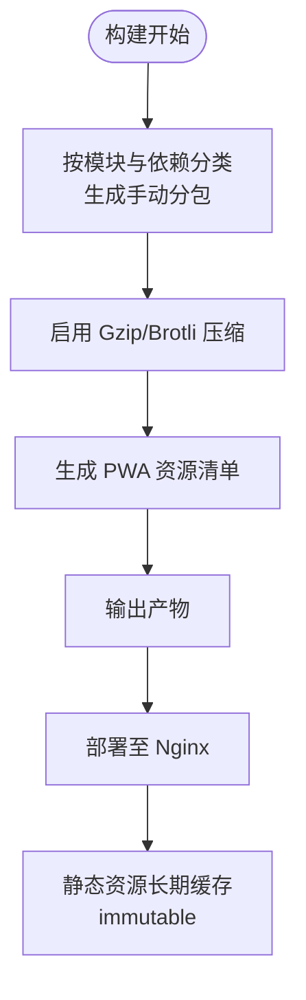
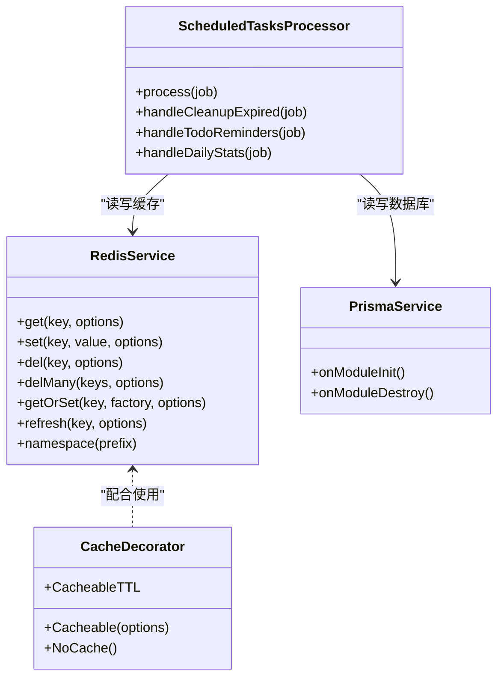
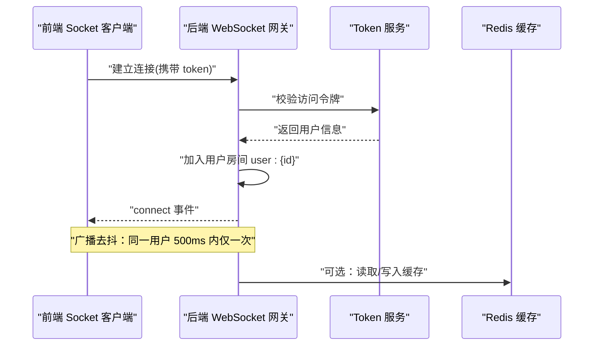
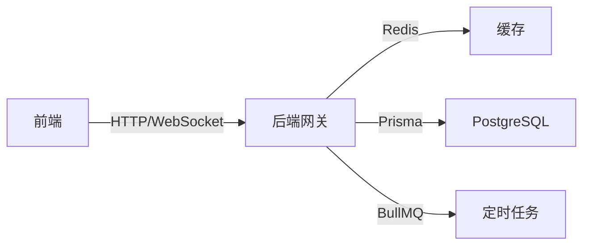

# 性能优化

<cite>
**本文引用的文件**
- [apps/frontend/vite.config.mts](file://apps/frontend/vite.config.mts)
- [apps/frontend/package.json](file://apps/frontend/package.json)
- [apps/backend/package.json](file://apps/backend/package.json)
- [apps/frontend/src/composables/useSocket.ts](file://apps/frontend/src/composables/useSocket.ts)
- [apps/backend/src/events/events.gateway.ts](file://apps/backend/src/events/events.gateway.ts)
- [apps/frontend/nginx.conf](file://apps/frontend/nginx.conf)
- [apps/frontend/nginx.main.conf](file://apps/frontend/nginx.main.conf)
- [apps/backend/src/redis/redis.service.ts](file://apps/backend/src/redis/redis.service.ts)
- [apps/backend/src/redis/cache.decorator.ts](file://apps/backend/src/redis/cache.decorator.ts)
- [apps/backend/src/prisma/prisma.service.ts](file://apps/backend/src/prisma/prisma.service.ts)
- [apps/backend/src/scheduled-tasks/scheduled-tasks.processor.ts](file://apps/backend/src/scheduled-tasks/scheduled-tasks.processor.ts)
- [apps/frontend/src/composables/useRequest.ts](file://apps/frontend/src/composables/useRequest.ts)
- [apps/backend/src/todos/todos.service.ts](file://apps/backend/src/todos/todos.service.ts)
</cite>

## 目录
1. [简介](#简介)
2. [项目结构](#项目结构)
3. [核心组件](#核心组件)
4. [架构总览](#架构总览)
5. [详细组件分析](#详细组件分析)
6. [依赖分析](#依赖分析)
7. [性能考量](#性能考量)
8. [故障排查指南](#故障排查指南)
9. [结论](#结论)
10. [附录](#附录)

## 简介
本指南面向 Lumina Todo 的前端、后端、实时通信、移动端与桌面端（Wails）、CDN 与静态资源、性能监控与指标、以及性能测试与瓶颈定位，提供系统化的优化策略与实操建议。内容基于仓库中现有实现进行提炼，并补充最佳实践与可视化图示，帮助团队在不同平台与环境下稳定提升性能与用户体验。

## 项目结构
Lumina Todo 采用多包工作区结构，包含前端（Vue + Vite）、后端（NestJS + Fastify）、移动端（Capacitor）、桌面端（Wails）与共享包。前端构建配置、实时通信、缓存与数据库连接、定时任务与 Nginx 代理均已在代码中落地，是性能优化的重要抓手。

图表来源
- [apps/frontend/vite.config.mts:80-184](file://apps/frontend/vite.config.mts#L80-L184)
- [apps/frontend/src/composables/useSocket.ts:22-175](file://apps/frontend/src/composables/useSocket.ts#L22-L175)
- [apps/frontend/nginx.conf:102-181](file://apps/frontend/nginx.conf#L102-L181)
- [apps/backend/src/events/events.gateway.ts:20-56](file://apps/backend/src/events/events.gateway.ts#L20-L56)
- [apps/backend/src/redis/redis.service.ts:52-202](file://apps/backend/src/redis/redis.service.ts#L52-L202)
- [apps/backend/src/prisma/prisma.service.ts:7-33](file://apps/backend/src/prisma/prisma.service.ts#L7-L33)
- [apps/backend/src/scheduled-tasks/scheduled-tasks.processor.ts:36-68](file://apps/backend/src/scheduled-tasks/scheduled-tasks.processor.ts#L36-L68)

章节来源
- [apps/frontend/vite.config.mts:1-185](file://apps/frontend/vite.config.mts#L1-L185)
- [apps/frontend/nginx.conf:1-203](file://apps/frontend/nginx.conf#L1-L203)
- [apps/frontend/nginx.main.conf:1-51](file://apps/frontend/nginx.main.conf#L1-L51)
- [apps/backend/src/events/events.gateway.ts:1-266](file://apps/backend/src/events/events.gateway.ts#L1-L266)
- [apps/backend/src/redis/redis.service.ts:1-233](file://apps/backend/src/redis/redis.service.ts#L1-L233)
- [apps/backend/src/prisma/prisma.service.ts:1-34](file://apps/backend/src/prisma/prisma.service.ts#L1-L34)
- [apps/backend/src/scheduled-tasks/scheduled-tasks.processor.ts:1-290](file://apps/backend/src/scheduled-tasks/scheduled-tasks.processor.ts#L1-L290)

## 核心组件
- 前端构建与打包：通过 Vite 的手动分包策略、Gzip/Brotli 压缩、PWA 与代理配置，降低首屏体积与提升缓存命中率。
- 实时通信：Socket 客户端封装与 WebSocket 网关结合，支持鉴权、房间隔离、广播去抖与连接重试。
- 缓存体系：Redis 服务与 @Cacheable 装饰器，提供键前缀、批量删除、穿透保护与 TTL 管理。
- 数据库与连接池：Prisma 使用 PostgreSQL 连接池，事务化清理与批量更新保障一致性与性能。
- 定时任务：BullMQ 处理健康检查、过期数据清理、待办提醒与每日统计，避免主线程阻塞。
- 反向代理：Nginx 配置开启压缩、缓存、禁用缓冲与长超时，确保实时通信稳定性。

章节来源
- [apps/frontend/vite.config.mts:80-184](file://apps/frontend/vite.config.mts#L80-L184)
- [apps/frontend/src/composables/useSocket.ts:22-175](file://apps/frontend/src/composables/useSocket.ts#L22-L175)
- [apps/backend/src/events/events.gateway.ts:86-145](file://apps/backend/src/events/events.gateway.ts#L86-L145)
- [apps/backend/src/redis/redis.service.ts:52-202](file://apps/backend/src/redis/redis.service.ts#L52-L202)
- [apps/backend/src/redis/cache.decorator.ts:42-58](file://apps/backend/src/redis/cache.decorator.ts#L42-L58)
- [apps/backend/src/prisma/prisma.service.ts:7-33](file://apps/backend/src/prisma/prisma.service.ts#L7-L33)
- [apps/backend/src/scheduled-tasks/scheduled-tasks.processor.ts:36-68](file://apps/backend/src/scheduled-tasks/scheduled-tasks.processor.ts#L36-L68)
- [apps/frontend/nginx.conf:11-187](file://apps/frontend/nginx.conf#L11-L187)

## 架构总览
下图展示从前端到后端再到数据库与缓存的整体链路，以及实时通信与定时任务的交互。

图表来源
- [apps/frontend/vite.config.mts:80-184](file://apps/frontend/vite.config.mts#L80-L184)
- [apps/frontend/nginx.conf:127-181](file://apps/frontend/nginx.conf#L127-L181)
- [apps/backend/src/events/events.gateway.ts:20-56](file://apps/backend/src/events/events.gateway.ts#L20-L56)
- [apps/backend/src/redis/redis.service.ts:52-202](file://apps/backend/src/redis/redis.service.ts#L52-L202)
- [apps/backend/src/prisma/prisma.service.ts:7-33](file://apps/backend/src/prisma/prisma.service.ts#L7-L33)
- [apps/backend/src/scheduled-tasks/scheduled-tasks.processor.ts:36-68](file://apps/backend/src/scheduled-tasks/scheduled-tasks.processor.ts#L36-L68)

## 详细组件分析

### 前端性能优化（代码分割、懒加载与缓存）
- 代码分割与手动分包
  - 通过 Vite 的 manualChunks 将大型依赖按功能域拆分为独立 chunk，降低首屏 JS 体积与重复下载。
  - 关键分包类别：vue-vendor、ui-vendor、chart-vendor、mermaid-vendor、markdown-vendor、utils-vendor、cytoscape-vendor。
- 压缩与缓存
  - 同时启用 Gzip 与 Brotli 压缩，显著降低传输体积；静态资源长期缓存（1 年），immutable 提升命中率。
  - PWA Manifest 与图标资源内联，提升离线可用性与首屏渲染体验。
- 代理与开发体验
  - 本地开发代理到后端，WebSocket 通道开启并设置较长超时，避免长连接断开。
- 懒加载与按需加载
  - 建议在路由与重型组件处采用动态导入，配合骨架屏与虚拟滚动，进一步缩短首屏阻塞时间。

图表来源
- [apps/frontend/vite.config.mts:23-78](file://apps/frontend/vite.config.mts#L23-L78)
- [apps/frontend/vite.config.mts:88-103](file://apps/frontend/vite.config.mts#L88-L103)
- [apps/frontend/vite.config.mts:104-146](file://apps/frontend/vite.config.mts#L104-L146)
- [apps/frontend/nginx.conf:183-187](file://apps/frontend/nginx.conf#L183-L187)

章节来源
- [apps/frontend/vite.config.mts:23-78](file://apps/frontend/vite.config.mts#L23-L78)
- [apps/frontend/vite.config.mts:88-103](file://apps/frontend/vite.config.mts#L88-L103)
- [apps/frontend/vite.config.mts:104-146](file://apps/frontend/vite.config.mts#L104-L146)
- [apps/frontend/nginx.conf:11-187](file://apps/frontend/nginx.conf#L11-L187)

### 后端性能调优（数据库、缓存与并发）
- 数据库查询优化与连接池
  - Prisma 使用 PostgreSQL 连接池，模块销毁时正确释放连接，避免连接泄漏。
  - 服务中仅选择必要字段，减少序列化与网络传输开销。
- 缓存策略
  - RedisService 提供统一键前缀、批量删除、穿透保护 getOrSet、TTL 刷新等能力。
  - @Cacheable 装饰器简化缓存声明，支持自定义 key 与 TTL。
- 并发与异步
  - 定时任务使用 BullMQ Worker 处理，避免阻塞主请求线程；任务间并行统计与提醒。
- 安全与可观测
  - Nginx 层开启安全头与 CSP，减少攻击面；后端网关启用 CORS 白名单与鉴权中间件。

图表来源
- [apps/backend/src/redis/redis.service.ts:52-202](file://apps/backend/src/redis/redis.service.ts#L52-L202)
- [apps/backend/src/redis/cache.decorator.ts:42-58](file://apps/backend/src/redis/cache.decorator.ts#L42-L58)
- [apps/backend/src/prisma/prisma.service.ts:7-33](file://apps/backend/src/prisma/prisma.service.ts#L7-L33)
- [apps/backend/src/scheduled-tasks/scheduled-tasks.processor.ts:36-68](file://apps/backend/src/scheduled-tasks/scheduled-tasks.processor.ts#L36-L68)

章节来源
- [apps/backend/src/redis/redis.service.ts:52-202](file://apps/backend/src/redis/redis.service.ts#L52-L202)
- [apps/backend/src/redis/cache.decorator.ts:42-58](file://apps/backend/src/redis/cache.decorator.ts#L42-L58)
- [apps/backend/src/prisma/prisma.service.ts:7-33](file://apps/backend/src/prisma/prisma.service.ts#L7-L33)
- [apps/backend/src/scheduled-tasks/scheduled-tasks.processor.ts:36-68](file://apps/backend/src/scheduled-tasks/scheduled-tasks.processor.ts#L36-L68)

### 实时通信性能优化（WebSocket 连接管理与消息广播）
- 连接与重试
  - 客户端优先使用 WebSocket，自动降级到轮询；设置指数退避与最大重试间隔，避免风暴重连。
  - 支持鉴权失败时自动刷新令牌并重连，减少人工干预。
- 服务器端控制
  - 网关启用 CORS 白名单与鉴权中间件，确保仅授权用户进入房间。
  - 广播去抖：同一用户在 500ms 内仅广播一次，降低广播风暴与带宽浪费。
- 房间与权限
  - 自动加入用户房间，禁止越权加入；离开房间时清理订阅。

图表来源
- [apps/frontend/src/composables/useSocket.ts:25-96](file://apps/frontend/src/composables/useSocket.ts#L25-L96)
- [apps/backend/src/events/events.gateway.ts:86-145](file://apps/backend/src/events/events.gateway.ts#L86-L145)
- [apps/backend/src/redis/redis.service.ts:52-202](file://apps/backend/src/redis/redis.service.ts#L52-L202)

章节来源
- [apps/frontend/src/composables/useSocket.ts:22-175](file://apps/frontend/src/composables/useSocket.ts#L22-L175)
- [apps/backend/src/events/events.gateway.ts:86-202](file://apps/backend/src/events/events.gateway.ts#L86-L202)

### 移动端与桌面端性能优化（Capacitor/Wails）
- Capacitor（Android/iOS）
  - 使用原生震动、相机与文件系统能力时，注意异步调用与权限申请，避免阻塞主线程。
  - 图片与多媒体处理建议在后台线程或专用模块中执行，完成后通过事件回调回传 UI。
- Wails（桌面端）
  - 通过 useSocket 与后端保持低延迟通信；注意窗口最小化/休眠时的连接保活策略。
  - 静态资源与 PWA 缓存策略同样适用于桌面端，提升冷启动速度。

章节来源
- [apps/frontend/src/composables/useSocket.ts:22-175](file://apps/frontend/src/composables/useSocket.ts#L22-L175)
- [apps/frontend/package.json:28-28](file://apps/frontend/package.json#L28-L28)

### CDN 与静态资源优化策略
- Nginx 层配置
  - 启用 Gzip 静态优先与多种 MIME 类型压缩；开启 sendfile、tcp_nopush/tcp_nodelay 提升文件传输效率。
  - 对静态资源设置一年有效期与 immutable，显著降低带宽与 TTFB。
  - 禁用敏感文件访问，隐藏 .env 与 git 目录，强化安全。
- 代理与实时通信
  - API 与 WebSocket 代理开启 HTTP/1.1、转发真实 IP 与协议，关闭代理缓冲以保证实时性。
  - 设置长超时，避免长连接在高延迟网络中断。

章节来源
- [apps/frontend/nginx.conf:11-187](file://apps/frontend/nginx.conf#L11-L187)
- [apps/frontend/nginx.main.conf:37-47](file://apps/frontend/nginx.main.conf#L37-L47)

### 性能监控与指标分析
- 前端
  - 使用浏览器开发者工具的性能面板与 Lighthouse，关注首次内容绘制（FCP）、最大内容绘制（LCP）、交互时间（FID）、累积布局偏移（CLS）等。
  - 结合 useRequest 的加载与错误状态，记录关键接口耗时与失败率。
- 后端
  - Nginx access_log 与 error_log 记录异常与慢请求；结合后端日志（pino）追踪慢查询与慢任务。
  - Redis 与数据库慢查询日志开启，定位热点键与慢 SQL。
- 实时通信
  - 监控 WebSocket 连接数、广播频率与去抖效果；观察连接错误与重连次数。

章节来源
- [apps/frontend/src/composables/useRequest.ts:17-44](file://apps/frontend/src/composables/useRequest.ts#L17-L44)
- [apps/frontend/nginx.conf:31-33](file://apps/frontend/nginx.conf#L31-L33)
- [apps/backend/src/redis/redis.service.ts:52-202](file://apps/backend/src/redis/redis.service.ts#L52-L202)

### 性能测试与基准测试实施
- 前端
  - 使用 Vite 的预览模式与 Lighthouse 进行页面性能评估；对关键路由与重型组件做基准测试。
- 后端
  - 使用压测工具（如 wrk 或 k6）对 /api 与 /socket.io 进行并发与长连接测试，观察吞吐与延迟。
  - 对定时任务进行回归测试，确保清理与提醒逻辑在高负载下稳定。
- 实时通信
  - 模拟多设备同时在线与频繁变更，验证广播去抖与房间权限控制是否有效。

章节来源
- [apps/backend/src/scheduled-tasks/scheduled-tasks.processor.ts:147-190](file://apps/backend/src/scheduled-tasks/scheduled-tasks.processor.ts#L147-L190)
- [apps/frontend/nginx.conf:144-181](file://apps/frontend/nginx.conf#L144-L181)

### 性能瓶颈识别与解决方案
- 前端
  - 瓶颈：首屏 JS 过大、第三方库未分包、未启用压缩或缓存。
  - 解决：启用 manualChunks、Gzip/Brotli、长期缓存；对重型依赖进行动态导入。
- 后端
  - 瓶颈：数据库慢查询、缓存未命中、定时任务阻塞。
  - 解决：Prisma 仅选择必要字段；使用 @Cacheable 与 RedisService；拆分任务到队列。
- 实时通信
  - 瓶颈：广播风暴、鉴权失败导致频繁重连、代理缓冲影响实时性。
  - 解决：广播去抖、鉴权中间件白名单、关闭代理缓冲、合理超时。

章节来源
- [apps/frontend/vite.config.mts:23-78](file://apps/frontend/vite.config.mts#L23-L78)
- [apps/backend/src/redis/cache.decorator.ts:42-58](file://apps/backend/src/redis/cache.decorator.ts#L42-L58)
- [apps/backend/src/events/events.gateway.ts:180-202](file://apps/backend/src/events/events.gateway.ts#L180-L202)
- [apps/frontend/nginx.conf:169-177](file://apps/frontend/nginx.conf#L169-L177)

## 依赖分析
- 前端依赖
  - Vue 3、Pinia、Socket.IO 客户端、PWA 插件、压缩插件等，构成现代前端性能基石。
- 后端依赖
  - NestJS + Fastify、Socket.IO、BullMQ、Prisma、Redis、缓存管理器等，支撑高性能与可扩展性。
- 关键耦合
  - 前端 Socket 客户端与后端网关强耦合；网关与 Redis/数据库弱耦合，通过服务注入解耦。

图表来源
- [apps/frontend/src/composables/useSocket.ts:22-175](file://apps/frontend/src/composables/useSocket.ts#L22-L175)
- [apps/backend/src/events/events.gateway.ts:20-56](file://apps/backend/src/events/events.gateway.ts#L20-L56)
- [apps/backend/src/redis/redis.service.ts:52-202](file://apps/backend/src/redis/redis.service.ts#L52-L202)
- [apps/backend/src/prisma/prisma.service.ts:7-33](file://apps/backend/src/prisma/prisma.service.ts#L7-L33)
- [apps/backend/src/scheduled-tasks/scheduled-tasks.processor.ts:36-68](file://apps/backend/src/scheduled-tasks/scheduled-tasks.processor.ts#L36-L68)

章节来源
- [apps/frontend/package.json:30-69](file://apps/frontend/package.json#L30-L69)
- [apps/backend/package.json:30-85](file://apps/backend/package.json#L30-L85)

## 性能考量
- 内存与 GC
  - 前端构建脚本增加内存上限，避免大项目编译失败；运行时避免大对象常驻，及时清理事件监听与定时器。
- I/O 与网络
  - Nginx 关闭代理缓冲，确保实时通信低延迟；后端对高频接口启用缓存与批量处理。
- 并发与限流
  - 后端可引入限流中间件（如 @nestjs/throttler）保护 API；WebSocket 连接数与广播频率需受控。

## 故障排查指南
- WebSocket 连接失败
  - 检查 CORS 白名单与鉴权中间件；确认 Nginx 代理升级头与缓冲关闭；客户端重试策略是否合理。
- 缓存未命中或穿透
  - 校验键前缀与 TTL；确认 getOrSet 的工厂函数是否返回有效值；必要时手动刷新 TTL。
- 数据库慢查询
  - 使用 Prisma 日志与 EXPLAIN 分析；仅选择必要字段；对热点表建立索引。
- 定时任务堆积
  - 检查 Worker 并发度与队列深度；拆分任务粒度；监控失败重试次数。

章节来源
- [apps/frontend/src/composables/useSocket.ts:60-93](file://apps/frontend/src/composables/useSocket.ts#L60-L93)
- [apps/backend/src/events/events.gateway.ts:86-116](file://apps/backend/src/events/events.gateway.ts#L86-L116)
- [apps/backend/src/redis/redis.service.ts:147-161](file://apps/backend/src/redis/redis.service.ts#L147-L161)
- [apps/backend/src/prisma/prisma.service.ts:7-33](file://apps/backend/src/prisma/prisma.service.ts#L7-L33)
- [apps/backend/src/scheduled-tasks/scheduled-tasks.processor.ts:280-289](file://apps/backend/src/scheduled-tasks/scheduled-tasks.processor.ts#L280-L289)

## 结论
通过前端代码分割与压缩、后端缓存与数据库优化、实时通信的去抖与鉴权、反向代理的低延迟配置以及定时任务的异步化，Lumina Todo 已具备良好的性能基础。建议持续以监控指标驱动优化，针对热点路径迭代分包、缓存与并发策略，确保在多端与高负载场景下的稳定表现。

## 附录
- 前端构建与代理参考
  - [apps/frontend/vite.config.mts:80-184](file://apps/frontend/vite.config.mts#L80-L184)
  - [apps/frontend/nginx.conf:127-181](file://apps/frontend/nginx.conf#L127-L181)
- 后端缓存与数据库
  - [apps/backend/src/redis/redis.service.ts:52-202](file://apps/backend/src/redis/redis.service.ts#L52-L202)
  - [apps/backend/src/redis/cache.decorator.ts:42-58](file://apps/backend/src/redis/cache.decorator.ts#L42-L58)
  - [apps/backend/src/prisma/prisma.service.ts:7-33](file://apps/backend/src/prisma/prisma.service.ts#L7-L33)
- 实时通信与定时任务
  - [apps/frontend/src/composables/useSocket.ts:22-175](file://apps/frontend/src/composables/useSocket.ts#L22-L175)
  - [apps/backend/src/events/events.gateway.ts:86-202](file://apps/backend/src/events/events.gateway.ts#L86-L202)
  - [apps/backend/src/scheduled-tasks/scheduled-tasks.processor.ts:147-190](file://apps/backend/src/scheduled-tasks/scheduled-tasks.processor.ts#L147-L190)
- 请求状态与错误处理
  - [apps/frontend/src/composables/useRequest.ts:17-44](file://apps/frontend/src/composables/useRequest.ts#L17-L44)
- 待办服务与广播
  - [apps/backend/src/todos/todos.service.ts:64-110](file://apps/backend/src/todos/todos.service.ts#L64-L110)