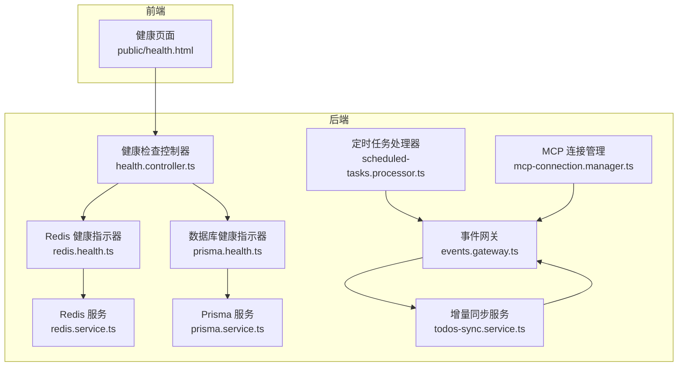
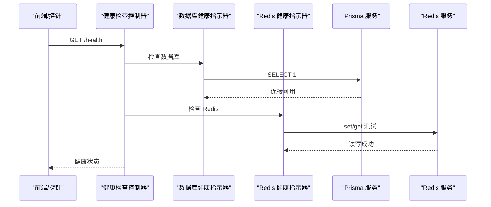
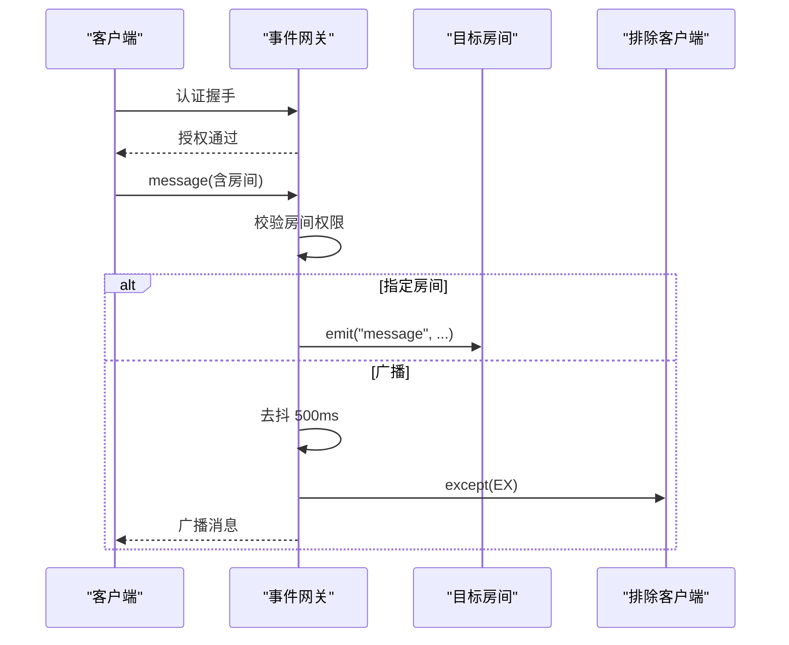
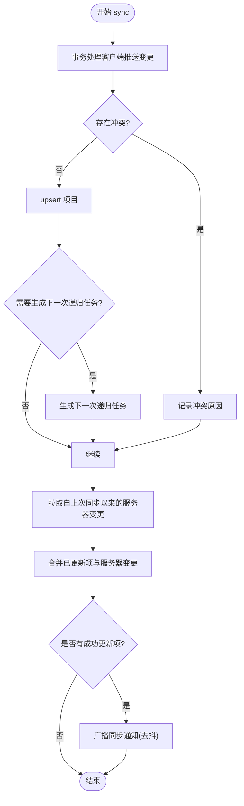
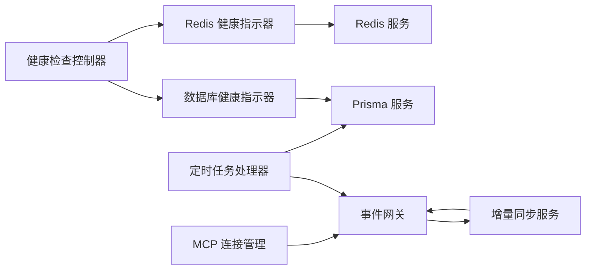

# 性能监控与分析

<cite>
**本文引用的文件**
- [apps/backend/src/health/health.controller.ts](file://apps/backend/src/health/health.controller.ts)
- [apps/backend/src/health/prisma.health.ts](file://apps/backend/src/health/prisma.health.ts)
- [apps/backend/src/redis/redis.health.ts](file://apps/backend/src/redis/redis.health.ts)
- [apps/backend/src/redis/redis.service.ts](file://apps/backend/src/redis/redis.service.ts)
- [apps/backend/src/prisma/prisma.service.ts](file://apps/backend/src/prisma/prisma.service.ts)
- [apps/backend/src/events/events.gateway.ts](file://apps/backend/src/events/events.gateway.ts)
- [apps/backend/src/todos/todos-sync.service.ts](file://apps/backend/src/todos/todos-sync.service.ts)
- [apps/backend/src/scheduled-tasks/scheduled-tasks.processor.ts](file://apps/backend/src/scheduled-tasks/scheduled-tasks.processor.ts)
- [apps/backend/src/mcp/core/mcp-connection.manager.ts](file://apps/backend/src/mcp/core/mcp-connection.manager.ts)
- [apps/frontend/public/health.html](file://apps/frontend/public/health.html)
</cite>

## 目录
1. [简介](#简介)
2. [项目结构](#项目结构)
3. [核心组件](#核心组件)
4. [架构总览](#架构总览)
5. [详细组件分析](#详细组件分析)
6. [依赖关系分析](#依赖关系分析)
7. [性能考量](#性能考量)
8. [故障排查指南](#故障排查指南)
9. [结论](#结论)
10. [附录](#附录)

## 简介
本指南面向应用的性能监控与分析，覆盖后端健康检查与指标、前端性能与用户行为、数据库与缓存性能、实时通信性能、移动端性能与崩溃上报、基准与压力测试、数据分析与瓶颈定位、以及优化效果评估与持续改进策略。文档基于仓库现有实现进行说明，并提供可落地的实践建议。

## 项目结构
本项目采用多应用工作区（apps/backend、apps/frontend、apps/wails），后端使用 NestJS + Prisma + Redis + Socket.IO，前端使用 Capacitor/Vue 生态，移动端通过 Capacitor 集成到原生平台。性能监控涉及：
- 健康检查与存活/就绪探针
- 数据库与缓存健康指示器
- 实时通信网关与广播去抖
- 定时任务与每日统计
- 前端健康页面与增量同步

图表来源
- [apps/backend/src/health/health.controller.ts:1-77](file://apps/backend/src/health/health.controller.ts#L1-L77)
- [apps/backend/src/health/prisma.health.ts:1-32](file://apps/backend/src/health/prisma.health.ts#L1-L32)
- [apps/backend/src/redis/redis.health.ts:1-43](file://apps/backend/src/redis/redis.health.ts#L1-L43)
- [apps/backend/src/redis/redis.service.ts:1-233](file://apps/backend/src/redis/redis.service.ts#L1-L233)
- [apps/backend/src/prisma/prisma.service.ts:1-34](file://apps/backend/src/prisma/prisma.service.ts#L1-L34)
- [apps/backend/src/events/events.gateway.ts:1-266](file://apps/backend/src/events/events.gateway.ts#L1-L266)
- [apps/backend/src/todos/todos-sync.service.ts:1-221](file://apps/backend/src/todos/todos-sync.service.ts#L1-L221)
- [apps/backend/src/scheduled-tasks/scheduled-tasks.processor.ts:1-290](file://apps/backend/src/scheduled-tasks/scheduled-tasks.processor.ts#L1-L290)
- [apps/backend/src/mcp/core/mcp-connection.manager.ts:1-101](file://apps/backend/src/mcp/core/mcp-connection.manager.ts#L1-L101)
- [apps/frontend/public/health.html:1-11](file://apps/frontend/public/health.html#L1-L11)

章节来源
- [apps/backend/src/health/health.controller.ts:1-77](file://apps/backend/src/health/health.controller.ts#L1-L77)
- [apps/frontend/public/health.html:1-11](file://apps/frontend/public/health.html#L1-L11)

## 核心组件
- 健康检查控制器：提供综合健康检查、存活探针与就绪探针，集成数据库与缓存健康指示器。
- 健康指示器：数据库与 Redis 健康检查，分别通过查询与读写测试验证可用性。
- 实时网关：基于 Socket.IO 的事件网关，支持认证中间件、房间权限校验、广播去抖与模块销毁清理。
- 增量同步服务：实现客户端与服务端的增量合并、冲突检测与广播通知。
- 定时任务处理器：处理健康检查、过期清理、提醒推送与每日统计等后台任务。
- 缓存服务：统一的缓存封装，支持前缀、批量操作、TTL 管理与命名空间。
- Prisma 服务：基于 PgPool 的 Prisma 客户端，负责连接生命周期管理。
- MCP 连接管理：管理与 MCP 服务器的连接与日志输出。

章节来源
- [apps/backend/src/health/health.controller.ts:1-77](file://apps/backend/src/health/health.controller.ts#L1-L77)
- [apps/backend/src/health/prisma.health.ts:1-32](file://apps/backend/src/health/prisma.health.ts#L1-L32)
- [apps/backend/src/redis/redis.health.ts:1-43](file://apps/backend/src/redis/redis.health.ts#L1-L43)
- [apps/backend/src/events/events.gateway.ts:1-266](file://apps/backend/src/events/events.gateway.ts#L1-L266)
- [apps/backend/src/todos/todos-sync.service.ts:1-221](file://apps/backend/src/todos/todos-sync.service.ts#L1-L221)
- [apps/backend/src/scheduled-tasks/scheduled-tasks.processor.ts:1-290](file://apps/backend/src/scheduled-tasks/scheduled-tasks.processor.ts#L1-L290)
- [apps/backend/src/redis/redis.service.ts:1-233](file://apps/backend/src/redis/redis.service.ts#L1-L233)
- [apps/backend/src/prisma/prisma.service.ts:1-34](file://apps/backend/src/prisma/prisma.service.ts#L1-L34)
- [apps/backend/src/mcp/core/mcp-connection.manager.ts:1-101](file://apps/backend/src/mcp/core/mcp-connection.manager.ts#L1-L101)

## 架构总览
后端通过健康检查控制器聚合数据库、缓存与系统资源健康状态；实时通信由事件网关承载，结合增量同步服务实现高效的数据一致性与低延迟广播；定时任务处理器在后台维护数据与统计；前端通过健康页面与后端健康端点联动，移动端通过 Capacitor 与后端交互。

图表来源
- [apps/backend/src/health/health.controller.ts:31-51](file://apps/backend/src/health/health.controller.ts#L31-L51)
- [apps/backend/src/health/prisma.health.ts:19-30](file://apps/backend/src/health/prisma.health.ts#L19-L30)
- [apps/backend/src/redis/redis.health.ts:20-41](file://apps/backend/src/redis/redis.health.ts#L20-L41)
- [apps/backend/src/prisma/prisma.service.ts:1-34](file://apps/backend/src/prisma/prisma.service.ts#L1-L34)
- [apps/backend/src/redis/redis.service.ts:1-233](file://apps/backend/src/redis/redis.service.ts#L1-L233)

## 详细组件分析

### 健康检查机制与指标定义
- 综合健康检查：包含数据库连接、Redis 连接、堆内存与 RSS、磁盘使用率阈值检查。
- 存活探针：返回简单 OK 与时间戳，适合容器编排的存活探测。
- 就绪探针：仅检查数据库与 Redis，确保服务对外提供能力。
- 指标建议：
  - 数据库：连接数、查询耗时、慢查询数、连接池命中率
  - 缓存：命中率、过期/淘汰数、命令耗时分布
  - 系统：CPU 使用率、内存占用、GC 次数与暂停时间、文件句柄数
  - 应用：请求 QPS、P95/P99 延迟、错误率、并发连接数

章节来源
- [apps/backend/src/health/health.controller.ts:31-75](file://apps/backend/src/health/health.controller.ts#L31-L75)
- [apps/backend/src/health/prisma.health.ts:19-30](file://apps/backend/src/health/prisma.health.ts#L19-L30)
- [apps/backend/src/redis/redis.health.ts:20-41](file://apps/backend/src/redis/redis.health.ts#L20-L41)
- [apps/frontend/public/health.html:1-11](file://apps/frontend/public/health.html#L1-L11)

### 前端性能监控与用户行为分析
- 健康页面：静态健康页可用于前端可用性探测与 CDN/反向代理健康检查。
- 用户行为：可通过埋点收集页面停留时长、点击热力、功能使用频次等（建议接入前端埋点 SDK）。
- 性能指标：首屏渲染、交互延迟、资源加载时间、FPS、卡顿次数、白屏时间等。
- 建议实践：在路由切换、关键交互节点打点，结合 APM 工具进行聚合分析。

章节来源
- [apps/frontend/public/health.html:1-11](file://apps/frontend/public/health.html#L1-L11)

### 后端性能指标监控与告警配置
- 指标采集：数据库查询耗时、缓存命中率、请求延迟与错误率、队列积压、任务执行时长与失败率。
- 告警策略：针对延迟突增、错误率上升、连接池耗尽、慢查询占比超阈、任务堆积等触发告警。
- 建议工具：Prometheus + Grafana 或云厂商监控平台。

章节来源
- [apps/backend/src/scheduled-tasks/scheduled-tasks.processor.ts:280-289](file://apps/backend/src/scheduled-tasks/scheduled-tasks.processor.ts#L280-L289)

### 数据库性能监控与慢查询分析
- 连接管理：基于 PgPool 的 Prisma 客户端，注意连接池大小与超时配置。
- 慢查询：开启慢查询日志，结合数据库性能视图与 EXPLAIN 分析热点 SQL。
- 优化手段：索引优化、查询重写、分页与限制返回、批量写入、读写分离。

章节来源
- [apps/backend/src/prisma/prisma.service.ts:1-34](file://apps/backend/src/prisma/prisma.service.ts#L1-L34)

### 实时通信性能监控与连接状态跟踪
- 认证与权限：握手阶段校验令牌与会话有效性，拒绝未授权访问。
- 房间与广播：按用户房间广播，支持排除特定客户端；后端 500ms 去抖减少重复广播。
- 资源清理：模块销毁时清理定时器，避免内存泄漏。
- 监控要点：在线用户数、房间数量、消息吞吐、广播延迟、异常断线率。

图表来源
- [apps/backend/src/events/events.gateway.ts:86-202](file://apps/backend/src/events/events.gateway.ts#L86-L202)

章节来源
- [apps/backend/src/events/events.gateway.ts:86-202](file://apps/backend/src/events/events.gateway.ts#L86-L202)

### 增量同步与冲突检测
- 合并策略：严格版本匹配，避免客户端时钟漂移导致的冲突；支持递归任务的下次生成。
- 广播通知：当有成功更新项时，触发用户房间的同步通知，后端去抖。
- 监控关注：同步耗时、冲突比例、广播延迟、事务回滚率。

图表来源
- [apps/backend/src/todos/todos-sync.service.ts:66-219](file://apps/backend/src/todos/todos-sync.service.ts#L66-L219)

章节来源
- [apps/backend/src/todos/todos-sync.service.ts:66-219](file://apps/backend/src/todos/todos-sync.service.ts#L66-L219)

### 缓存性能与 TTL 管理
- 统一前缀与命名空间：便于隔离与批量清理。
- 批量操作与穿透保护：getOrSet 提供缓存穿透保护。
- TTL 管理：默认与可配置 TTL，刷新 TTL 与批量删除。
- 监控关注：命中率、过期/淘汰数、命令耗时分布、内存占用。

章节来源
- [apps/backend/src/redis/redis.service.ts:52-202](file://apps/backend/src/redis/redis.service.ts#L52-L202)
- [apps/backend/src/redis/redis.health.ts:20-41](file://apps/backend/src/redis/redis.health.ts#L20-L41)

### 定时任务与每日统计
- 任务类型：健康检查、过期清理、提醒推送、每日统计。
- 统计维度：活跃/完成/创建/今日完成/删除总数与按用户统计。
- 监控关注：任务执行时长、失败率、队列积压、统计结果完整性。

章节来源
- [apps/backend/src/scheduled-tasks/scheduled-tasks.processor.ts:49-278](file://apps/backend/src/scheduled-tasks/scheduled-tasks.processor.ts#L49-L278)

### MCP 连接管理
- 连接生命周期：建立、复用、关闭，stderr 日志与错误处理。
- 监控关注：连接数、断线率、请求超时、进程退出。

章节来源
- [apps/backend/src/mcp/core/mcp-connection.manager.ts:23-87](file://apps/backend/src/mcp/core/mcp-connection.manager.ts#L23-L87)

## 依赖关系分析
后端健康检查依赖数据库与缓存健康指示器；事件网关与增量同步服务耦合度较高，前者负责连接与广播，后者负责数据一致性；定时任务处理器依赖数据库与事件网关；缓存服务为上层模块提供统一抽象；Prisma 服务负责数据库连接；MCP 连接管理独立于业务逻辑但需稳定。

图表来源
- [apps/backend/src/health/health.controller.ts:19-25](file://apps/backend/src/health/health.controller.ts#L19-L25)
- [apps/backend/src/health/prisma.health.ts:10-13](file://apps/backend/src/health/prisma.health.ts#L10-L13)
- [apps/backend/src/redis/redis.health.ts:11-14](file://apps/backend/src/redis/redis.health.ts#L11-L14)
- [apps/backend/src/prisma/prisma.service.ts:6-21](file://apps/backend/src/prisma/prisma.service.ts#L6-L21)
- [apps/backend/src/redis/redis.service.ts:51-56](file://apps/backend/src/redis/redis.service.ts#L51-L56)
- [apps/backend/src/events/events.gateway.ts:57-66](file://apps/backend/src/events/events.gateway.ts#L57-L66)
- [apps/backend/src/todos/todos-sync.service.ts:42-46](file://apps/backend/src/todos/todos-sync.service.ts#L42-L46)
- [apps/backend/src/scheduled-tasks/scheduled-tasks.processor.ts:40-47](file://apps/backend/src/scheduled-tasks/scheduled-tasks.processor.ts#L40-L47)
- [apps/backend/src/mcp/core/mcp-connection.manager.ts:12-15](file://apps/backend/src/mcp/core/mcp-connection.manager.ts#L12-L15)

## 性能考量
- 连接池与超时：合理设置数据库连接池大小与超时，避免阻塞与资源耗尽。
- 缓存策略：热点数据高命中、短 TTL、批量写入与预热。
- 广播去抖：在高频变更场景下降低网络与 CPU 开销。
- 事务边界：将多次写入放入事务，减少锁竞争与不一致。
- 监控与告警：建立端到端链路监控，覆盖数据库、缓存、网络与应用层。

## 故障排查指南
- 健康检查失败
  - 数据库：确认连接字符串、网络连通、实例状态。
  - Redis：确认服务可用、鉴权配置、键空间与内存上限。
- 实时通信异常
  - 认证失败：检查令牌格式与有效期、会话失效。
  - 房间权限：核对房间命名规则与用户 ID。
  - 广播无响应：检查去抖定时器与广播目标房间。
- 增量同步冲突
  - 版本不一致：客户端重试或回退策略。
  - 递归任务：确认规则与时区配置。
- 定时任务堆积
  - 任务执行时间过长：拆分任务、异步化、限流。
  - 外部依赖不可用：增加重试与熔断。

章节来源
- [apps/backend/src/health/health.controller.ts:31-75](file://apps/backend/src/health/health.controller.ts#L31-L75)
- [apps/backend/src/health/prisma.health.ts:19-30](file://apps/backend/src/health/prisma.health.ts#L19-L30)
- [apps/backend/src/redis/redis.health.ts:20-41](file://apps/backend/src/redis/redis.health.ts#L20-L41)
- [apps/backend/src/events/events.gateway.ts:86-202](file://apps/backend/src/events/events.gateway.ts#L86-L202)
- [apps/backend/src/todos/todos-sync.service.ts:66-219](file://apps/backend/src/todos/todos-sync.service.ts#L66-L219)
- [apps/backend/src/scheduled-tasks/scheduled-tasks.processor.ts:280-289](file://apps/backend/src/scheduled-tasks/scheduled-tasks.processor.ts#L280-L289)

## 结论
本项目已具备完善的健康检查与实时通信基础，建议在此基础上补充数据库慢查询分析、缓存命中率与延迟监控、前端埋点与 APM 集成、移动端崩溃上报与性能指标采集，并建立自动化告警与回归基线，形成闭环的性能保障体系。

## 附录
- 基准与压力测试
  - 后端：使用 wrk/Artillery/JMeter 对健康检查、同步接口、任务处理器进行 QPS 与延迟压测，记录 P95/P99。
  - 前端：Lighthouse、WebPageTest、Chrome DevTools Performance 面板。
  - 移动端：Xcode Instruments、Android Studio Profiler、Crashlytics。
- 数据分析与瓶颈识别
  - 关键路径：请求-数据库-缓存-广播-响应，逐段采样与关联追踪。
  - 瓶颈定位：CPU 占用、GC 暂停、锁等待、网络往返、I/O 等待。
- 优化效果评估与持续改进
  - 建立性能基线与回归测试，定期对比优化前后指标，沉淀最佳实践。