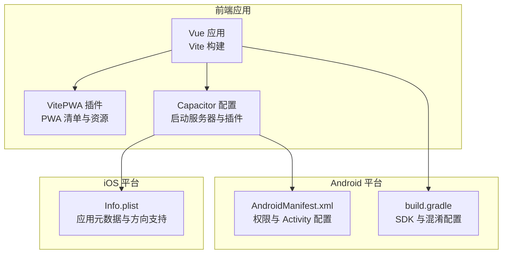
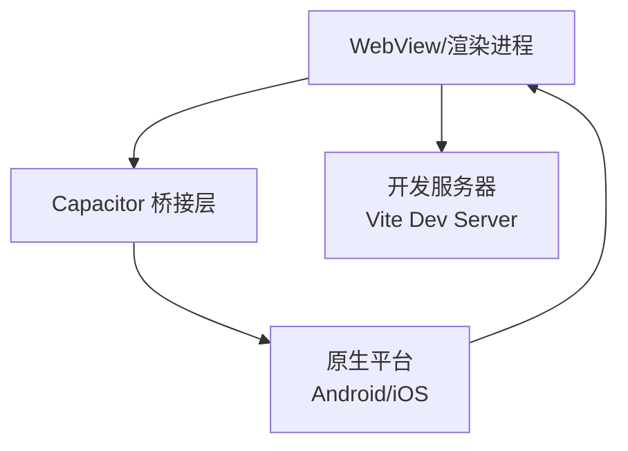
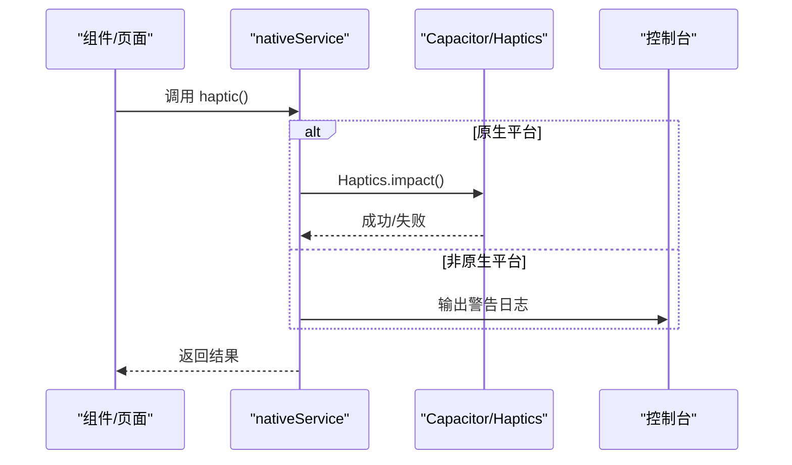
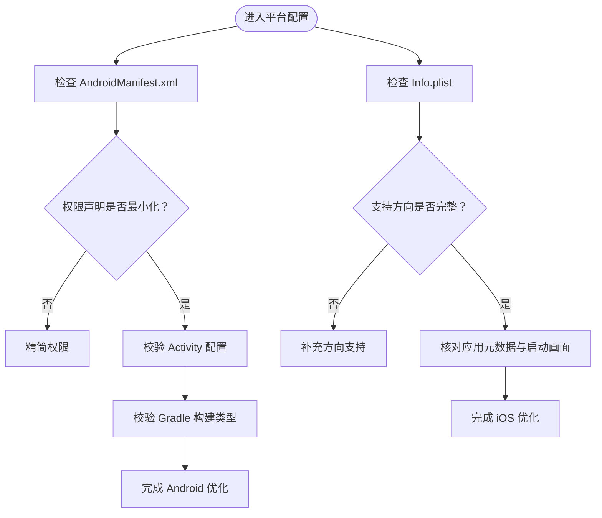
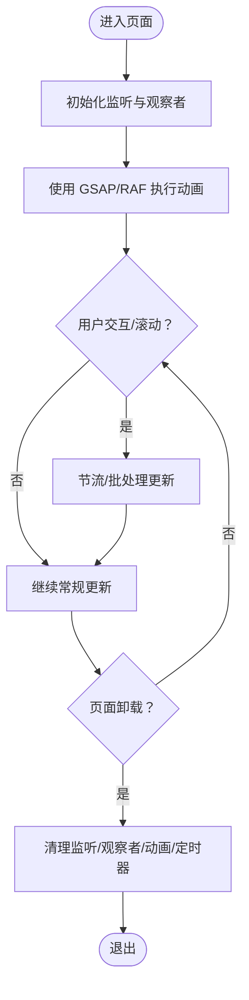
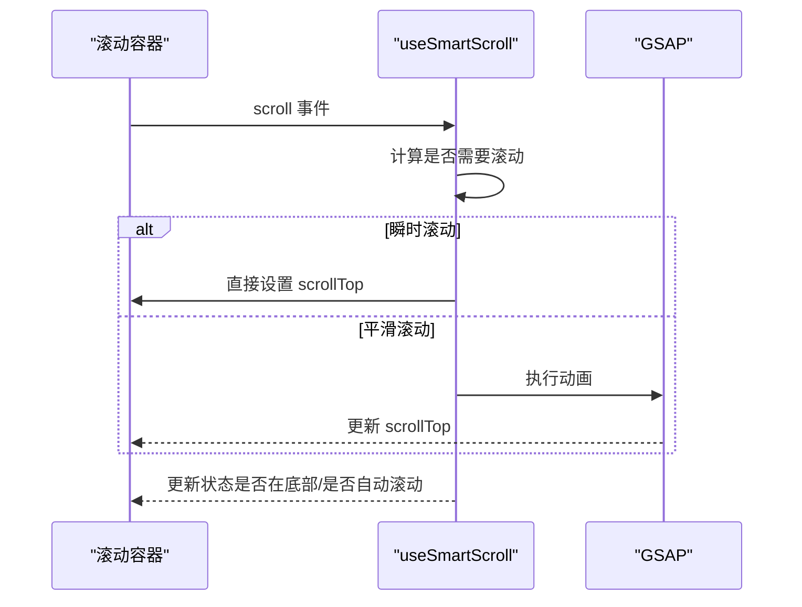
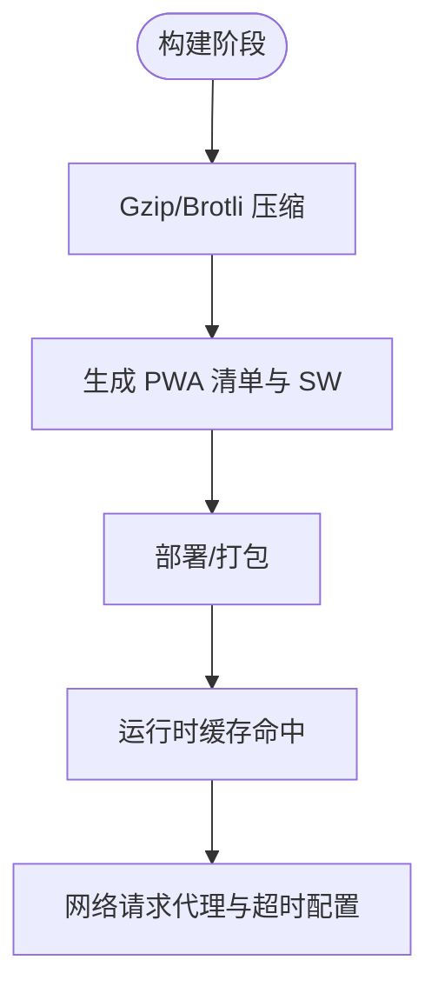
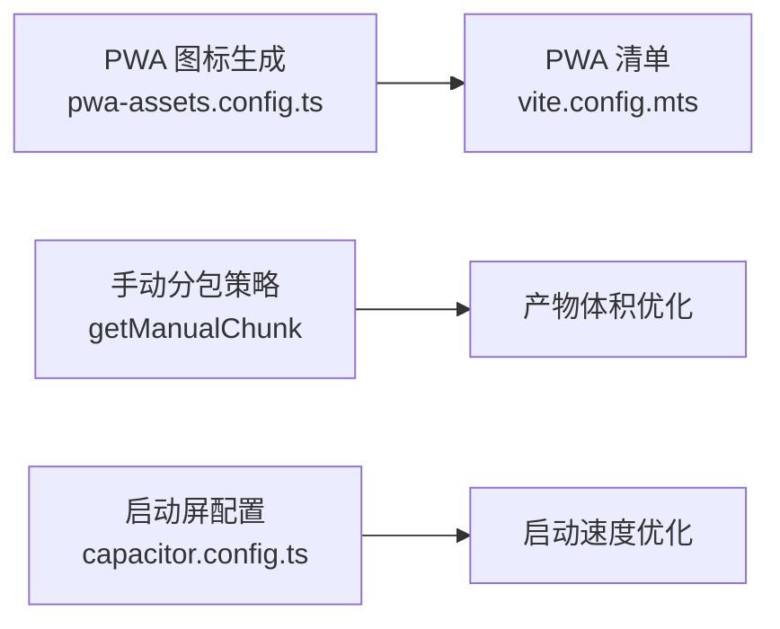
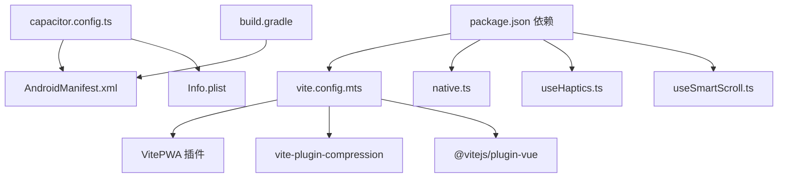

# 移动端性能优化

<cite>
**本文档引用的文件**
- [apps/frontend/capacitor.config.ts](file://apps/frontend/capacitor.config.ts)
- [apps/frontend/package.json](file://apps/frontend/package.json)
- [apps/frontend/android/app/src/main/AndroidManifest.xml](file://apps/frontend/android/app/src/main/AndroidManifest.xml)
- [apps/frontend/ios/App/App/Info.plist](file://apps/frontend/ios/App/App/Info.plist)
- [apps/frontend/android/app/src/main/assets/capacitor.config.json](file://apps/frontend/android/app/src/main/assets/capacitor.config.json)
- [apps/frontend/ios/App/App/capacitor.config.json](file://apps/frontend/ios/App/App/capacitor.config.json)
- [apps/frontend/vite.config.mts](file://apps/frontend/vite.config.mts)
- [apps/frontend/pwa-assets.config.ts](file://apps/frontend/pwa-assets.config.ts)
- [apps/frontend/android/app/build.gradle](file://apps/frontend/android/app/build.gradle)
- [apps/frontend/src/services/native.ts](file://apps/frontend/src/services/native.ts)
- [apps/frontend/src/composables/useHaptics.ts](file://apps/frontend/src/composables/useHaptics.ts)
- [apps/frontend/src/composables/useSmartScroll.ts](file://apps/frontend/src/composables/useSmartScroll.ts)
- [apps/frontend/src/composables/useGsap.ts](file://apps/frontend/src/composables/useGsap.ts)
</cite>

## 目录
1. [简介](#简介)
2. [项目结构](#项目结构)
3. [核心组件](#核心组件)
4. [架构总览](#架构总览)
5. [详细组件分析](#详细组件分析)
6. [依赖关系分析](#依赖关系分析)
7. [性能考量](#性能考量)
8. [故障排查指南](#故障排查指南)
9. [结论](#结论)
10. [附录](#附录)

## 简介
本指南聚焦于基于 Capacitor 的移动端应用性能优化，涵盖以下方面：
- Capacitor 配置与原生能力调用优化
- Android 与 iOS 平台特定优化策略
- 移动端内存管理与电池优化
- 动画与手势响应性能优化
- 离线缓存与网络请求优化
- PWA 功能与应用启动速度优化
- 移动端调试与性能分析方法
- 用户体验与加载速度提升策略

## 项目结构
前端工程采用 Vite + Vue 3 技术栈，结合 Capacitor 构建跨平台移动应用；同时通过 VitePWA 插件实现 PWA 能力。关键配置集中在 Capacitor 配置文件、Vite 配置以及 Android/iOS 平台清单中。

**图表来源**
- [apps/frontend/capacitor.config.ts:1-23](file://apps/frontend/capacitor.config.ts#L1-L23)
- [apps/frontend/vite.config.mts:1-185](file://apps/frontend/vite.config.mts#L1-L185)
- [apps/frontend/android/app/src/main/AndroidManifest.xml:1-42](file://apps/frontend/android/app/src/main/AndroidManifest.xml#L1-L42)
- [apps/frontend/ios/App/App/Info.plist:1-52](file://apps/frontend/ios/App/App/Info.plist#L1-L52)
- [apps/frontend/android/app/build.gradle:1-55](file://apps/frontend/android/app/build.gradle#L1-L55)

**章节来源**
- [apps/frontend/capacitor.config.ts:1-23](file://apps/frontend/capacitor.config.ts#L1-L23)
- [apps/frontend/vite.config.mts:1-185](file://apps/frontend/vite.config.mts#L1-L185)
- [apps/frontend/android/app/src/main/AndroidManifest.xml:1-42](file://apps/frontend/android/app/src/main/AndroidManifest.xml#L1-L42)
- [apps/frontend/ios/App/App/Info.plist:1-52](file://apps/frontend/ios/App/App/Info.plist#L1-L52)
- [apps/frontend/android/app/build.gradle:1-55](file://apps/frontend/android/app/build.gradle#L1-L55)

## 核心组件
- Capacitor 配置与启动服务器：控制应用 ID、应用名、Web 目录、开发服务器地址与协议、启动屏插件参数等。
- Vite 构建与 PWA：多格式压缩、手动分包策略、PWA 清单与图标生成、代理与权限策略头。
- 原生能力适配层：统一 Web、Capacitor、Wails 三端调用，封装通知、触觉反馈、浏览器打开等能力。
- 动画与滚动优化：基于 GSAP 的高性能动画与滚动智能策略，降低主线程压力。
- 平台清单：Android 权限与 Activity 配置，iOS 方向与元数据配置。

**章节来源**
- [apps/frontend/capacitor.config.ts:3-20](file://apps/frontend/capacitor.config.ts#L3-L20)
- [apps/frontend/vite.config.mts:80-147](file://apps/frontend/vite.config.mts#L80-L147)
- [apps/frontend/src/services/native.ts:9-115](file://apps/frontend/src/services/native.ts#L9-L115)
- [apps/frontend/src/composables/useSmartScroll.ts:33-441](file://apps/frontend/src/composables/useSmartScroll.ts#L33-L441)

## 架构总览
移动端运行时由前端应用、Capacitor 桥接层与原生平台组成。前端通过 Capacitor 插件访问原生能力，VitePWA 提供离线与安装能力，构建阶段进行资源压缩与分包优化。

**图表来源**
- [apps/frontend/capacitor.config.ts:7-12](file://apps/frontend/capacitor.config.ts#L7-L12)
- [apps/frontend/vite.config.mts:154-174](file://apps/frontend/vite.config.mts#L154-L174)

## 详细组件分析

### Capacitor 配置与原生能力调用优化
- 启动屏插件：自动隐藏、显示时长、背景色，减少白屏与闪烁。
- 开发服务器：支持明文通信与 HTTPS 协议切换，便于本地联调。
- 原生能力适配层：统一平台差异，避免重复判断逻辑，降低分支开销。
- 触觉反馈：按需调用，失败兜底至控制台日志，避免阻塞主线程。

**图表来源**
- [apps/frontend/src/services/native.ts:63-76](file://apps/frontend/src/services/native.ts#L63-L76)
- [apps/frontend/src/composables/useHaptics.ts:9-16](file://apps/frontend/src/composables/useHaptics.ts#L9-L16)

**章节来源**
- [apps/frontend/capacitor.config.ts:13-19](file://apps/frontend/capacitor.config.ts#L13-L19)
- [apps/frontend/src/services/native.ts:9-115](file://apps/frontend/src/services/native.ts#L9-L115)
- [apps/frontend/src/composables/useHaptics.ts:6-61](file://apps/frontend/src/composables/useHaptics.ts#L6-L61)

### Android 与 iOS 平台特定优化策略
- Android
  - Activity 配置：多配置变更项以适配旋转与键盘；单任务启动模式减少重复实例。
  - 权限声明：仅声明必要权限，避免过度授权导致的权限弹窗与性能影响。
  - Gradle 配置：关闭混淆与 ProGuard 规则，便于调试；生产构建可开启混淆与代码压缩。
- iOS
  - Info.plist：声明支持的方向、启动画面、主 Storyboard、设备能力等，确保启动流程稳定。
  - 调试开关：通过环境变量控制调试模式，便于在真机上快速定位问题。

**图表来源**
- [apps/frontend/android/app/src/main/AndroidManifest.xml:12-35](file://apps/frontend/android/app/src/main/AndroidManifest.xml#L12-L35)
- [apps/frontend/android/app/build.gradle:19-25](file://apps/frontend/android/app/build.gradle#L19-L25)
- [apps/frontend/ios/App/App/Info.plist:25-47](file://apps/frontend/ios/App/App/Info.plist#L25-L47)

**章节来源**
- [apps/frontend/android/app/src/main/AndroidManifest.xml:1-42](file://apps/frontend/android/app/src/main/AndroidManifest.xml#L1-L42)
- [apps/frontend/android/app/build.gradle:1-55](file://apps/frontend/android/app/build.gradle#L1-L55)
- [apps/frontend/ios/App/App/Info.plist:1-52](file://apps/frontend/ios/App/App/Info.plist#L1-L52)

### 移动端内存管理与电池优化技巧
- 动画与滚动优化：使用 GSAP 与 RAF 节流/批处理，避免频繁布局抖动与重绘。
- 触觉反馈：按需触发，异常捕获并降级输出，避免阻塞主线程。
- 生命周期清理：组件卸载时释放监听器、取消动画、清理定时器与观察者。
- 网络与代理：设置长连接超时与代理超时，减少无效连接占用。

**图表来源**
- [apps/frontend/src/composables/useSmartScroll.ts:304-370](file://apps/frontend/src/composables/useSmartScroll.ts#L304-L370)
- [apps/frontend/src/composables/useGsap.ts:7-19](file://apps/frontend/src/composables/useGsap.ts#L7-L19)

**章节来源**
- [apps/frontend/src/composables/useSmartScroll.ts:304-370](file://apps/frontend/src/composables/useSmartScroll.ts#L304-L370)
- [apps/frontend/src/composables/useGsap.ts:7-19](file://apps/frontend/src/composables/useGsap.ts#L7-L19)

### 移动端动画性能优化与手势响应优化
- 智能滚动：根据“是否在底部”“是否自动滚动”“是否流式更新”等条件决定瞬时或平滑滚动，并使用 GSAP 控制动画时长与缓动。
- 手势与滚动解耦：区分用户滚动与程序化滚动，避免用户向上滚动时被自动滚动打断。
- 批处理与节流：对高频滚动事件进行批处理与帧节流，降低主线程压力。

**图表来源**
- [apps/frontend/src/composables/useSmartScroll.ts:100-160](file://apps/frontend/src/composables/useSmartScroll.ts#L100-L160)
- [apps/frontend/src/composables/useSmartScroll.ts:209-240](file://apps/frontend/src/composables/useSmartScroll.ts#L209-L240)

**章节来源**
- [apps/frontend/src/composables/useSmartScroll.ts:33-441](file://apps/frontend/src/composables/useSmartScroll.ts#L33-L441)

### 离线缓存策略与网络请求优化
- PWA 缓存：通过 VitePWA 生成静态资源清单，支持 Service Worker 自动更新与离线访问。
- 多格式压缩：Gzip/Brotli 双通道压缩，减小传输体积。
- 代理与超时：开发代理指向后端服务，设置长连接与代理超时，避免空闲连接断开。
- 权限策略头：限制摄像头/麦克风/地理定位等权限，降低安全风险与资源消耗。

**图表来源**
- [apps/frontend/vite.config.mts:88-103](file://apps/frontend/vite.config.mts#L88-L103)
- [apps/frontend/vite.config.mts:104-146](file://apps/frontend/vite.config.mts#L104-L146)
- [apps/frontend/vite.config.mts:154-174](file://apps/frontend/vite.config.mts#L154-L174)

**章节来源**
- [apps/frontend/vite.config.mts:80-185](file://apps/frontend/vite.config.mts#L80-L185)

### 移动端 PWA 功能优化与应用启动速度提升
- PWA 图标与清单：使用预设主题生成多尺寸图标，完善主题色与名称，提升安装体验。
- 分包策略：按功能域拆分 vendor 包，减少首屏依赖体积。
- 启动屏：缩短启动时间，避免白屏与长时间加载。

**图表来源**
- [apps/frontend/pwa-assets.config.ts:1-7](file://apps/frontend/pwa-assets.config.ts#L1-L7)
- [apps/frontend/vite.config.mts:23-78](file://apps/frontend/vite.config.mts#L23-L78)
- [apps/frontend/capacitor.config.ts:13-19](file://apps/frontend/capacitor.config.ts#L13-L19)

**章节来源**
- [apps/frontend/pwa-assets.config.ts:1-7](file://apps/frontend/pwa-assets.config.ts#L1-L7)
- [apps/frontend/vite.config.mts:23-78](file://apps/frontend/vite.config.mts#L23-L78)
- [apps/frontend/capacitor.config.ts:13-19](file://apps/frontend/capacitor.config.ts#L13-L19)

### 移动端调试工具与性能分析方法
- 安卓调试：使用 Chrome DevTools 远程调试 WebView；结合 Android Studio 查看内存与 CPU 使用。
- iOS 调试：使用 Safari Web Inspector；结合 Xcode Allocations/Leaks 工具分析内存。
- Capacitor 日志：通过 Capacitor CLI 与平台日志查看原生侧错误与警告。
- 性能指标：FPS、帧耗时、内存占用、网络往返时间、首次内容绘制（FCP）与最大内容绘制（LCP）。

[本节为通用指导，不直接分析具体文件]

## 依赖关系分析

**图表来源**
- [apps/frontend/vite.config.mts:80-147](file://apps/frontend/vite.config.mts#L80-L147)
- [apps/frontend/package.json:30-102](file://apps/frontend/package.json#L30-L102)
- [apps/frontend/capacitor.config.ts:3-20](file://apps/frontend/capacitor.config.ts#L3-L20)
- [apps/frontend/android/app/src/main/AndroidManifest.xml:1-42](file://apps/frontend/android/app/src/main/AndroidManifest.xml#L1-L42)
- [apps/frontend/ios/App/App/Info.plist:1-52](file://apps/frontend/ios/App/App/Info.plist#L1-L52)
- [apps/frontend/android/app/build.gradle:1-55](file://apps/frontend/android/app/build.gradle#L1-L55)
- [apps/frontend/src/services/native.ts:1-116](file://apps/frontend/src/services/native.ts#L1-L116)
- [apps/frontend/src/composables/useHaptics.ts:1-62](file://apps/frontend/src/composables/useHaptics.ts#L1-L62)
- [apps/frontend/src/composables/useSmartScroll.ts:1-442](file://apps/frontend/src/composables/useSmartScroll.ts#L1-L442)

**章节来源**
- [apps/frontend/package.json:30-102](file://apps/frontend/package.json#L30-L102)
- [apps/frontend/vite.config.mts:80-147](file://apps/frontend/vite.config.mts#L80-L147)

## 性能考量
- 构建体积与加载速度
  - 使用多格式压缩与分包策略，减少首屏脚本大小。
  - 启动屏配置与 PWA 清单提升感知速度。
- 主线程与渲染性能
  - 使用 GSAP 与 RAF 节流/批处理，避免频繁布局与重绘。
  - 滚动与手势分离，减少不必要的状态更新。
- 网络与缓存
  - 代理与超时配置保障长连接稳定性；PWA 缓存提升离线可用性。
- 平台差异
  - Android 权限最小化与 Activity 配置优化；iOS 方向与元数据完善。

[本节提供通用指导，不直接分析具体文件]

## 故障排查指南
- 启动屏不消失或白屏
  - 检查启动屏插件配置与显示时长。
  - 确认 Capacitor 配置与平台 JSON 一致。
- 触觉反馈无效
  - 确认平台为原生；捕获异常并降级输出日志。
- 滚动卡顿或跳动
  - 检查是否频繁触发滚动事件；确认节流/批处理生效。
  - 确认未在动画期间进行大量 DOM 操作。
- PWA 缓存未生效
  - 核对 PWA 清单与 Service Worker 注册；检查压缩与分包策略。
- Android 权限问题
  - 精简权限声明；确认清单中已声明所需权限。
- iOS 启动方向异常
  - 校验 Info.plist 中方向支持列表与主 Storyboard 配置。

**章节来源**
- [apps/frontend/capacitor.config.ts:13-19](file://apps/frontend/capacitor.config.ts#L13-L19)
- [apps/frontend/src/services/native.ts:63-76](file://apps/frontend/src/services/native.ts#L63-L76)
- [apps/frontend/src/composables/useSmartScroll.ts:256-259](file://apps/frontend/src/composables/useSmartScroll.ts#L256-L259)
- [apps/frontend/vite.config.mts:104-146](file://apps/frontend/vite.config.mts#L104-L146)
- [apps/frontend/android/app/src/main/AndroidManifest.xml:38-41](file://apps/frontend/android/app/src/main/AndroidManifest.xml#L38-L41)
- [apps/frontend/ios/App/App/Info.plist:35-47](file://apps/frontend/ios/App/App/Info.plist#L35-L47)

## 结论
通过合理的 Capacitor 配置、Vite 构建优化、PWA 能力与原生能力适配，配合 Android/iOS 平台特定优化策略，可在保证功能完整性的同时显著提升移动端应用的启动速度、渲染性能与用户体验。建议持续关注构建产物体积、主线程负载与网络请求质量，并结合平台调试工具进行针对性优化。

## 附录
- 关键配置参考路径
  - [Capacitor 配置:1-23](file://apps/frontend/capacitor.config.ts#L1-L23)
  - [Vite 构建与 PWA:1-185](file://apps/frontend/vite.config.mts#L1-L185)
  - [Android 清单:1-42](file://apps/frontend/android/app/src/main/AndroidManifest.xml#L1-L42)
  - [iOS 清单:1-52](file://apps/frontend/ios/App/App/Info.plist#L1-L52)
  - [Android Gradle:1-55](file://apps/frontend/android/app/build.gradle#L1-L55)
  - [原生能力适配层:1-116](file://apps/frontend/src/services/native.ts#L1-L116)
  - [触觉反馈组合式函数:1-62](file://apps/frontend/src/composables/useHaptics.ts#L1-L62)
  - [智能滚动组合式函数:1-442](file://apps/frontend/src/composables/useSmartScroll.ts#L1-L442)
  - [动画上下文组合式函数:1-20](file://apps/frontend/src/composables/useGsap.ts#L1-L20)
  - [PWA 图标生成配置:1-7](file://apps/frontend/pwa-assets.config.ts#L1-L7)