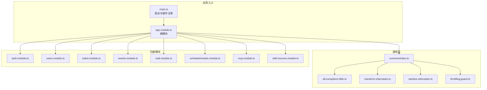
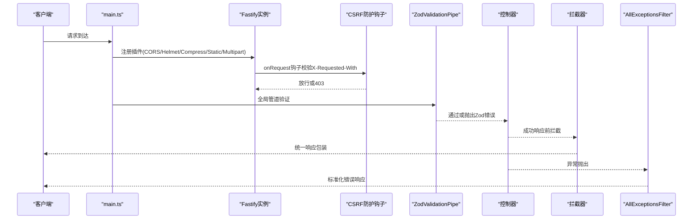
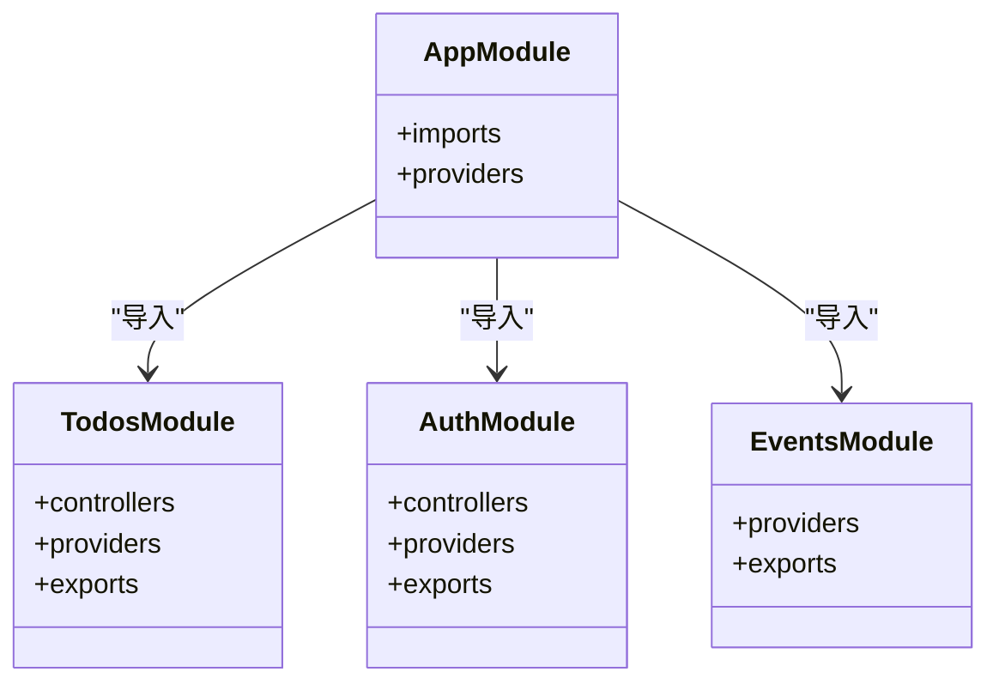
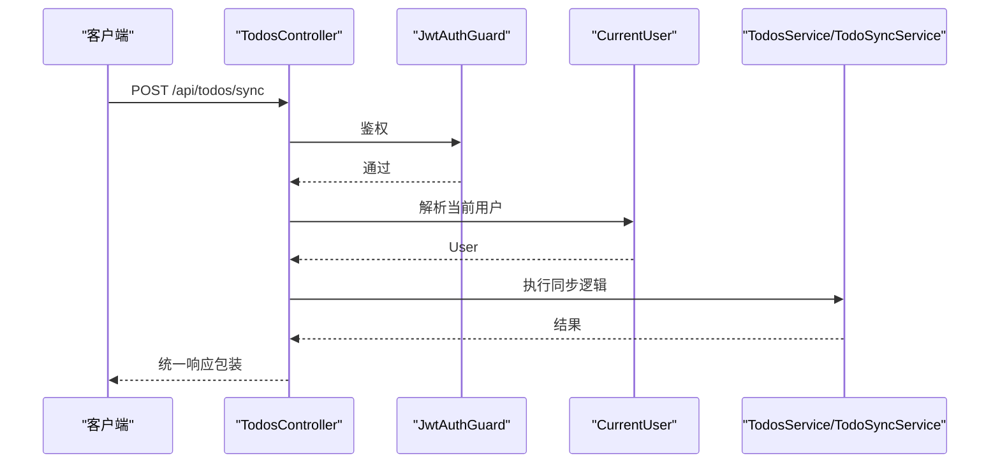
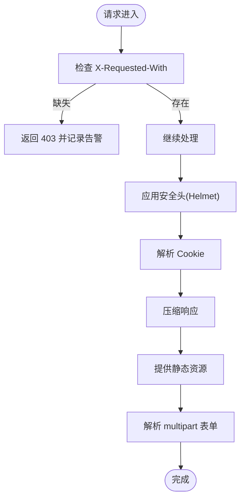
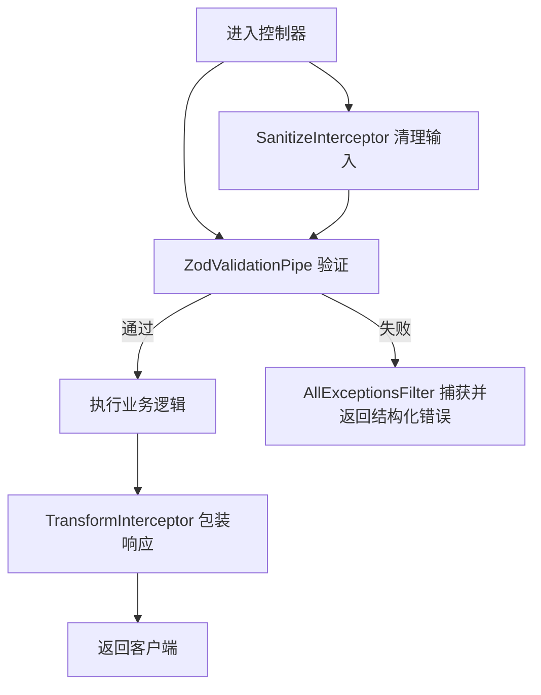
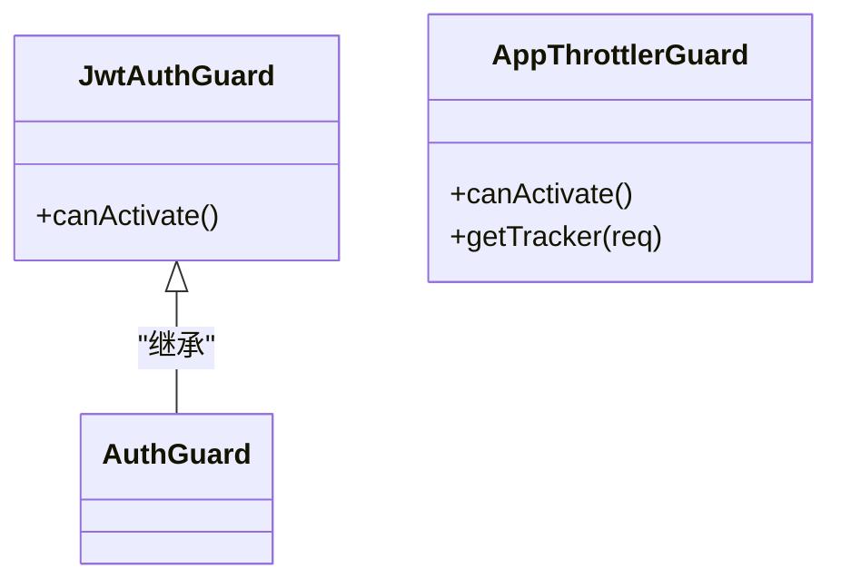
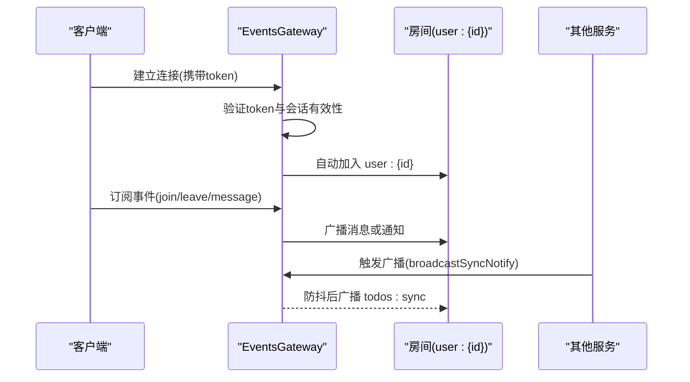
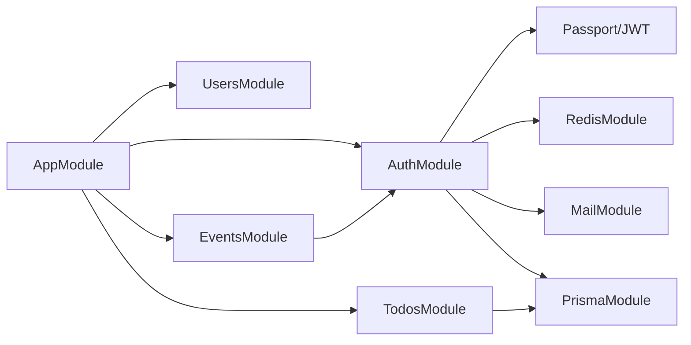

# API扩展

<cite>
**本文引用的文件**
- [apps/backend/src/app.module.ts](file://apps/backend/src/app.module.ts)
- [apps/backend/src/main.ts](file://apps/backend/src/main.ts)
- [apps/backend/src/todos/todos.module.ts](file://apps/backend/src/todos/todos.module.ts)
- [apps/backend/src/todos/todos.controller.ts](file://apps/backend/src/todos/todos.controller.ts)
- [apps/backend/src/auth/auth.module.ts](file://apps/backend/src/auth/auth.module.ts)
- [apps/backend/src/auth/jwt-auth.guard.ts](file://apps/backend/src/auth/jwt-auth.guard.ts)
- [apps/backend/src/auth/current-user.decorator.ts](file://apps/backend/src/auth/current-user.decorator.ts)
- [apps/backend/src/events/events.module.ts](file://apps/backend/src/events/events.module.ts)
- [apps/backend/src/events/events.gateway.ts](file://apps/backend/src/events/events.gateway.ts)
- [apps/backend/src/common/index.ts](file://apps/backend/src/common/index.ts)
- [apps/backend/src/common/filters/all-exceptions.filter.ts](file://apps/backend/src/common/filters/all-exceptions.filter.ts)
- [apps/backend/src/common/interceptors/transform.interceptor.ts](file://apps/backend/src/common/interceptors/transform.interceptor.ts)
- [apps/backend/src/common/interceptors/sanitize.interceptor.ts](file://apps/backend/src/common/interceptors/sanitize.interceptor.ts)
- [apps/backend/src/common/throttling/throttling.guard.ts](file://apps/backend/src/common/throttling/throttling.guard.ts)
</cite>

## 目录
1. [简介](#简介)
2. [项目结构](#项目结构)
3. [核心组件](#核心组件)
4. [架构总览](#架构总览)
5. [详细组件分析](#详细组件分析)
6. [依赖分析](#依赖分析)
7. [性能考虑](#性能考虑)
8. [故障排除指南](#故障排除指南)
9. [结论](#结论)
10. [附录](#附录)

## 简介
本指南面向Lumina Todo API扩展开发，系统讲解NestJS模块扩展机制、控制器装饰器与中间件开发；详解DTO验证、拦截器与守卫的扩展方法；提供自定义管道、过滤器与拦截器的实现模式；解释WebSocket事件与实时通信接口；涵盖API版本管理、文档生成与测试策略；并给出API安全扩展、权限控制与审计日志的实现建议。

## 项目结构
后端采用多模块架构，根模块集中导入各功能模块，并通过全局中间件、全局管道、全局过滤器与全局拦截器统一治理。核心模块包括认证、用户、待办、事件、邮件、定时任务、技能源、MCP等；公共层提供统一的异常过滤器、响应拦截器、XSS清理拦截器与限流守卫。

图表来源
- [apps/backend/src/main.ts:34-211](file://apps/backend/src/main.ts#L34-L211)
- [apps/backend/src/app.module.ts:28-159](file://apps/backend/src/app.module.ts#L28-L159)
- [apps/backend/src/common/index.ts:1-15](file://apps/backend/src/common/index.ts#L1-L15)

章节来源
- [apps/backend/src/app.module.ts:28-159](file://apps/backend/src/app.module.ts#L28-L159)
- [apps/backend/src/main.ts:34-211](file://apps/backend/src/main.ts#L34-L211)

## 核心组件
- 模块扩展机制：通过@Module装饰器声明模块，按需导入Prisma、Redis、BullMQ、I18n、事件发射器等基础设施模块；在根模块集中导入业务模块，形成清晰的边界与依赖关系。
- 控制器装饰器：使用@Controller、@UseGuards、@ApiBearerAuth、@ApiTags等装饰器标注路由与安全策略；结合Swagger生成API文档。
- 中间件开发：在main.ts中通过Fastify插件注册CORS、Helmet、压缩、静态资源、CSRF防护钩子等，形成统一的安全与性能治理。
- DTO验证：全局启用ZodValidationPipe，替代class-validator，结合nestjs-zod的cleanupOpenApiDoc生成更准确的OpenAPI文档。
- 拦截器与过滤器：全局注册AllExceptionsFilter、TransformInterceptor、SanitizeInterceptor，统一异常处理、响应格式与XSS清理。
- 守卫：全局限流守卫AppThrottlerGuard与JWT认证守卫JwtAuthGuard配合，实现速率限制与认证授权。
- WebSocket事件：EventsGateway提供基于Socket.IO的实时通信，支持房间、广播、鉴权与防抖广播。

章节来源
- [apps/backend/src/app.module.ts:28-159](file://apps/backend/src/app.module.ts#L28-L159)
- [apps/backend/src/main.ts:34-211](file://apps/backend/src/main.ts#L34-L211)
- [apps/backend/src/common/filters/all-exceptions.filter.ts:16-137](file://apps/backend/src/common/filters/all-exceptions.filter.ts#L16-L137)
- [apps/backend/src/common/interceptors/transform.interceptor.ts:18-30](file://apps/backend/src/common/interceptors/transform.interceptor.ts#L18-L30)
- [apps/backend/src/common/interceptors/sanitize.interceptor.ts:9-64](file://apps/backend/src/common/interceptors/sanitize.interceptor.ts#L9-L64)
- [apps/backend/src/common/throttling/throttling.guard.ts:28-34](file://apps/backend/src/common/throttling/throttling.guard.ts#L28-L34)
- [apps/backend/src/auth/jwt-auth.guard.ts:8-10](file://apps/backend/src/auth/jwt-auth.guard.ts#L8-L10)

## 架构总览
下图展示Lumina Todo API的启动流程、中间件链路与全局治理组件如何协同工作：

图表来源
- [apps/backend/src/main.ts:65-167](file://apps/backend/src/main.ts#L65-L167)
- [apps/backend/src/common/filters/all-exceptions.filter.ts:27-137](file://apps/backend/src/common/filters/all-exceptions.filter.ts#L27-L137)
- [apps/backend/src/common/interceptors/transform.interceptor.ts:20-29](file://apps/backend/src/common/interceptors/transform.interceptor.ts#L20-L29)

## 详细组件分析

### 模块扩展机制与依赖注入
- 根模块AppModule集中导入配置、日志、事件、队列、速率限制、国际化、数据库、缓存、健康检查、认证、用户、邮件、事件、上传、技能源、待办、定时任务、MCP等模块。
- 全局提供APP_GUARD绑定到AppThrottlerGuard，实现统一速率限制。
- 子模块如TodosModule、AuthModule、EventsModule通过@Modules声明并导出所需服务与控制器，便于跨模块复用。

图表来源
- [apps/backend/src/app.module.ts:28-159](file://apps/backend/src/app.module.ts#L28-L159)
- [apps/backend/src/todos/todos.module.ts:8-15](file://apps/backend/src/todos/todos.module.ts#L8-L15)
- [apps/backend/src/auth/auth.module.ts:19-41](file://apps/backend/src/auth/auth.module.ts#L19-L41)
- [apps/backend/src/events/events.module.ts:9-15](file://apps/backend/src/events/events.module.ts#L9-L15)

章节来源
- [apps/backend/src/app.module.ts:28-159](file://apps/backend/src/app.module.ts#L28-L159)
- [apps/backend/src/todos/todos.module.ts:8-15](file://apps/backend/src/todos/todos.module.ts#L8-L15)
- [apps/backend/src/auth/auth.module.ts:19-41](file://apps/backend/src/auth/auth.module.ts#L19-L41)
- [apps/backend/src/events/events.module.ts:9-15](file://apps/backend/src/events/events.module.ts#L9-L15)

### 控制器装饰器与Swagger文档
- TodosController示例展示了：
  - 路由保护：@UseGuards(JwtAuthGuard)确保JWT认证。
  - 文档标注：@ApiTags、@ApiOperation、@ApiBearerAuth提升可读性。
  - 参数解析：@CurrentUser装饰器从请求上下文提取当前用户。
  - 请求头：@Headers('X-Socket-ID')用于实时同步场景。
- Swagger文档通过DocumentBuilder构建，使用cleanupOpenApiDoc处理Zod Schema生成的文档。

图表来源
- [apps/backend/src/todos/todos.controller.ts:24-70](file://apps/backend/src/todos/todos.controller.ts#L24-L70)
- [apps/backend/src/auth/jwt-auth.guard.ts:8-10](file://apps/backend/src/auth/jwt-auth.guard.ts#L8-L10)
- [apps/backend/src/auth/current-user.decorator.ts:8-19](file://apps/backend/src/auth/current-user.decorator.ts#L8-L19)

章节来源
- [apps/backend/src/todos/todos.controller.ts:24-70](file://apps/backend/src/todos/todos.controller.ts#L24-L70)
- [apps/backend/src/auth/jwt-auth.guard.ts:8-10](file://apps/backend/src/auth/jwt-auth.guard.ts#L8-L10)
- [apps/backend/src/auth/current-user.decorator.ts:8-19](file://apps/backend/src/auth/current-user.decorator.ts#L8-L19)

### 中间件开发与安全治理
- CORS：显式配置允许的origin、methods、headers与credentials。
- Helmet：设置CSP、跨源策略等安全头。
- Cookie、压缩、静态资源、multipart：分别满足会话、传输优化、静态文件与文件上传需求。
- CSRF防护：onRequest钩子强制要求X-Requested-With头，缺失则返回403并记录告警。
- 速率限制：全局ThrottlerModule与Redis存储，AppThrottlerGuard基于真实IP或转发IP计算追踪器。

图表来源
- [apps/backend/src/main.ts:48-167](file://apps/backend/src/main.ts#L48-L167)
- [apps/backend/src/common/throttling/throttling.guard.ts:28-34](file://apps/backend/src/common/throttling/throttling.guard.ts#L28-L34)

章节来源
- [apps/backend/src/main.ts:48-167](file://apps/backend/src/main.ts#L48-L167)
- [apps/backend/src/common/throttling/throttling.guard.ts:28-34](file://apps/backend/src/common/throttling/throttling.guard.ts#L28-L34)

### DTO验证、拦截器与过滤器
- DTO验证：全局启用ZodValidationPipe，自动将Zod错误映射为结构化错误对象，结合I18n进行字段级与消息级国际化。
- 响应拦截器：TransformInterceptor统一包装success、data、timestamp字段，简化前端消费。
- XSS清理拦截器：SanitizeInterceptor对请求体、查询参数、路径参数进行原地递归清理，禁止HTML标签。
- 异常过滤器：AllExceptionsFilter统一捕获异常，输出标准化错误响应，支持Zod错误、HttpException与业务错误映射。

图表来源
- [apps/backend/src/main.ts:169-180](file://apps/backend/src/main.ts#L169-L180)
- [apps/backend/src/common/filters/all-exceptions.filter.ts:27-137](file://apps/backend/src/common/filters/all-exceptions.filter.ts#L27-L137)
- [apps/backend/src/common/interceptors/transform.interceptor.ts:18-30](file://apps/backend/src/common/interceptors/transform.interceptor.ts#L18-L30)
- [apps/backend/src/common/interceptors/sanitize.interceptor.ts:9-64](file://apps/backend/src/common/interceptors/sanitize.interceptor.ts#L9-L64)

章节来源
- [apps/backend/src/main.ts:169-180](file://apps/backend/src/main.ts#L169-L180)
- [apps/backend/src/common/filters/all-exceptions.filter.ts:27-137](file://apps/backend/src/common/filters/all-exceptions.filter.ts#L27-L137)
- [apps/backend/src/common/interceptors/transform.interceptor.ts:18-30](file://apps/backend/src/common/interceptors/transform.interceptor.ts#L18-L30)
- [apps/backend/src/common/interceptors/sanitize.interceptor.ts:9-64](file://apps/backend/src/common/interceptors/sanitize.interceptor.ts#L9-L64)

### 守卫扩展与权限控制
- 认证守卫JwtAuthGuard基于Passport的jwt策略，保护受控路由。
- 全局限流守卫AppThrottlerGuard继承ThrottlerGuard，支持代理场景下的IP追踪（优先使用真实IP，其次使用X-Forwarded-For最后的非空地址）。
- 可在控制器或方法上叠加@UseGuards实现细粒度权限控制。

图表来源
- [apps/backend/src/auth/jwt-auth.guard.ts:8-10](file://apps/backend/src/auth/jwt-auth.guard.ts#L8-L10)
- [apps/backend/src/common/throttling/throttling.guard.ts:28-34](file://apps/backend/src/common/throttling/throttling.guard.ts#L28-L34)

章节来源
- [apps/backend/src/auth/jwt-auth.guard.ts:8-10](file://apps/backend/src/auth/jwt-auth.guard.ts#L8-L10)
- [apps/backend/src/common/throttling/throttling.guard.ts:28-34](file://apps/backend/src/common/throttling/throttling.guard.ts#L28-L34)

### WebSocket事件与实时通信
- EventsGateway基于Socket.IO，支持CORS白名单、认证中间件、房间与广播。
- 鉴权：握手阶段从auth或Authorization头解析token，验证后写入socket.data.user。
- 房间与权限：自动加入user:{id}房间，订阅消息时校验房间归属，防止越权访问。
- 广播：提供todos:sync事件的防抖广播，避免频繁通知导致的性能问题；支持向房间或全体广播。

图表来源
- [apps/backend/src/events/events.gateway.ts:57-266](file://apps/backend/src/events/events.gateway.ts#L57-L266)

章节来源
- [apps/backend/src/events/events.gateway.ts:57-266](file://apps/backend/src/events/events.gateway.ts#L57-L266)

### GraphQL扩展、WebSocket事件与实时通信接口
- GraphQL扩展：本仓库未包含GraphQL相关实现。若需引入，可在现有模块基础上新增GraphQL模块与Schema定义，并复用现有DTO、服务与守卫体系。
- WebSocket事件：EventsGateway已提供完整的实时通信能力，包括鉴权、房间、广播与防抖策略，可直接用于待办同步等场景。

章节来源
- [apps/backend/src/events/events.gateway.ts:57-266](file://apps/backend/src/events/events.gateway.ts#L57-L266)

### API版本管理、文档生成与测试策略
- 版本管理：在main.ts中通过DocumentBuilder设置版本号，Swagger文档随版本更新；可通过路由前缀/api/v1、/api/v2等方式实现多版本并行。
- 文档生成：使用SwaggerModule创建文档并经cleanupOpenApiDoc处理Zod Schema，确保字段类型与约束准确呈现。
- 测试策略：单元测试覆盖服务与过滤器，E2E测试覆盖认证与核心流程；建议补充GraphQL与WebSocket的集成测试。

章节来源
- [apps/backend/src/main.ts:181-191](file://apps/backend/src/main.ts#L181-L191)

### API安全扩展、权限控制与审计日志
- 安全扩展：Helmet、CORS、CSRF防护钩子、压缩、XSS清理拦截器共同构成安全基线；可进一步引入CSP升级、HSTS、X-Content-Type-Options等。
- 权限控制：JwtAuthGuard与房间权限校验相结合，确保用户仅能访问自身房间；可扩展角色/资源授权模型。
- 审计日志：AllExceptionsFilter已记录错误日志；建议在关键操作处增加审计日志（如登录、修改、删除），并统一格式化输出。

章节来源
- [apps/backend/src/main.ts:94-167](file://apps/backend/src/main.ts#L94-L167)
- [apps/backend/src/common/filters/all-exceptions.filter.ts:37-45](file://apps/backend/src/common/filters/all-exceptions.filter.ts#L37-L45)
- [apps/backend/src/events/events.gateway.ts:68-84](file://apps/backend/src/events/events.gateway.ts#L68-L84)

## 依赖分析
- 模块耦合：根模块聚合导入，子模块通过exports暴露服务；控制器依赖服务，服务依赖Prisma/Redis等基础设施。
- 外部依赖：Fastify生态（cookie、helmet、compress、multipart、static）、Pino日志、Swagger、BullMQ队列、I18n国际化、Passport/JWT认证、Socket.IO实时通信。
- 潜在循环依赖：通过forwardRef在AuthModule中引用UsersModule，避免循环导入。

图表来源
- [apps/backend/src/app.module.ts:13-146](file://apps/backend/src/app.module.ts#L13-L146)
- [apps/backend/src/auth/auth.module.ts:19-41](file://apps/backend/src/auth/auth.module.ts#L19-L41)
- [apps/backend/src/todos/todos.module.ts:8-15](file://apps/backend/src/todos/todos.module.ts#L8-L15)
- [apps/backend/src/events/events.module.ts:9-15](file://apps/backend/src/events/events.module.ts#L9-L15)

章节来源
- [apps/backend/src/app.module.ts:13-146](file://apps/backend/src/app.module.ts#L13-L146)
- [apps/backend/src/auth/auth.module.ts:19-41](file://apps/backend/src/auth/auth.module.ts#L19-L41)
- [apps/backend/src/todos/todos.module.ts:8-15](file://apps/backend/src/todos/todos.module.ts#L8-L15)
- [apps/backend/src/events/events.module.ts:9-15](file://apps/backend/src/events/events.module.ts#L9-L15)

## 性能考虑
- 传输优化：启用gzip压缩与合理的阈值设置，减少带宽占用。
- 缓存与限流：Redis存储的限流策略结合全局守卫，避免热点接口被刷。
- 实时广播：EventsGateway对同一用户的广播进行500ms防抖，降低网络与CPU压力。
- 队列与异步：BullMQ后台任务处理耗时操作，避免阻塞请求线程。

## 故障排除指南
- CSRF告警：确认客户端请求携带X-Requested-With头；检查onRequest钩子日志定位缺失来源。
- 认证失败：检查Authorization头格式与Token有效性；确认Socket.IO握手是否正确传递token。
- 速率限制：查看限流规则与Redis存储状态；必要时调整窗口与配额。
- 异常响应：AllExceptionsFilter统一输出结构化错误，结合I18n键定位具体问题。

章节来源
- [apps/backend/src/main.ts:152-167](file://apps/backend/src/main.ts#L152-L167)
- [apps/backend/src/events/events.gateway.ts:89-116](file://apps/backend/src/events/events.gateway.ts#L89-L116)
- [apps/backend/src/common/filters/all-exceptions.filter.ts:127-135](file://apps/backend/src/common/filters/all-exceptions.filter.ts#L127-L135)

## 结论
通过模块化设计与全局治理，Lumina Todo API在安全性、可维护性与可观测性方面建立了坚实基础。扩展新功能时，遵循现有装饰器、拦截器、过滤器与守卫的模式，即可快速实现认证、权限、实时通信与文档生成等能力。

## 附录
- 自定义管道：可参考ZodValidationPipe的注册方式，在main.ts中添加自定义管道。
- 自定义过滤器：可仿照AllExceptionsFilter的Catch装饰器与上下文处理，实现领域特定的异常映射。
- 自定义拦截器：可仿照TransformInterceptor与SanitizeInterceptor的NestInterceptor实现，扩展响应包装或输入清理逻辑。
- WebSocket扩展：可复用EventsGateway的鉴权与房间机制，新增事件以满足业务需求。