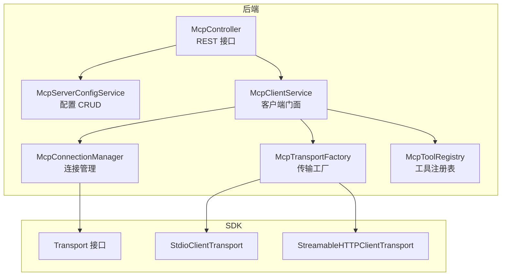
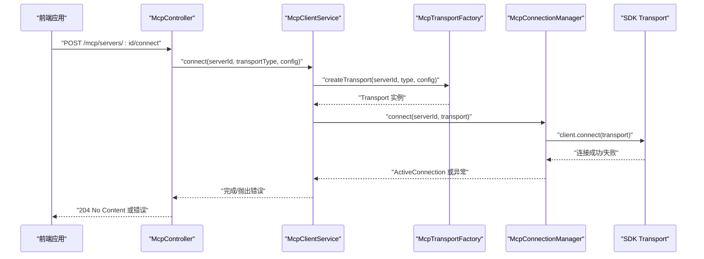
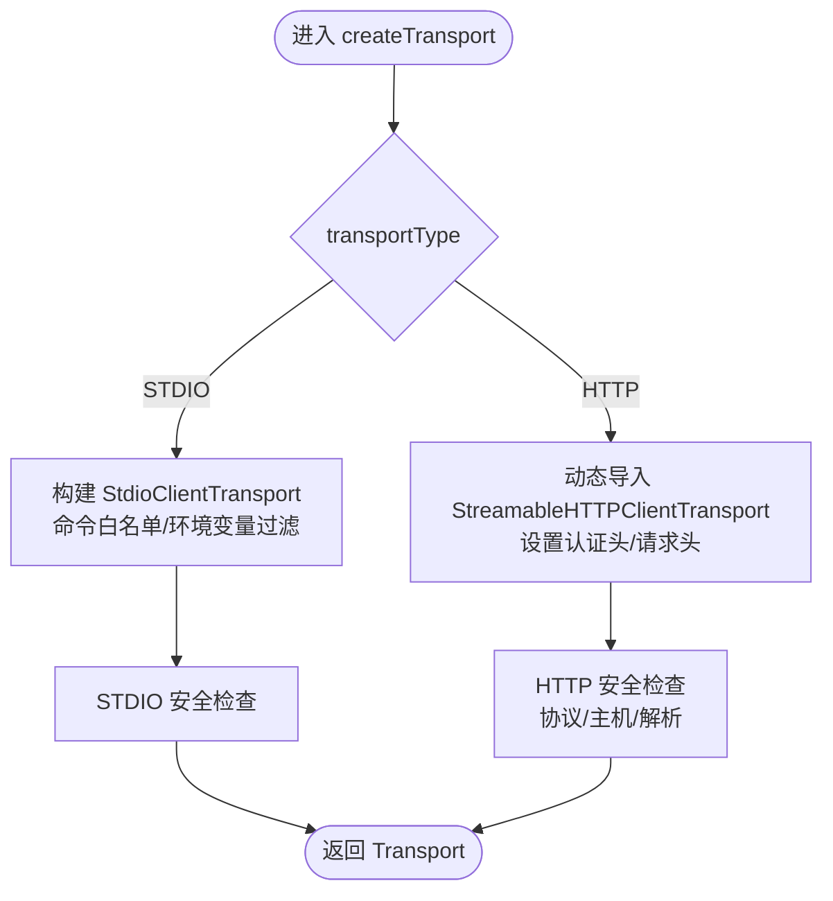
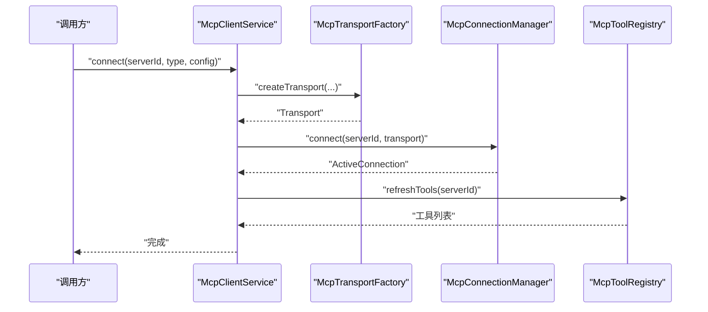
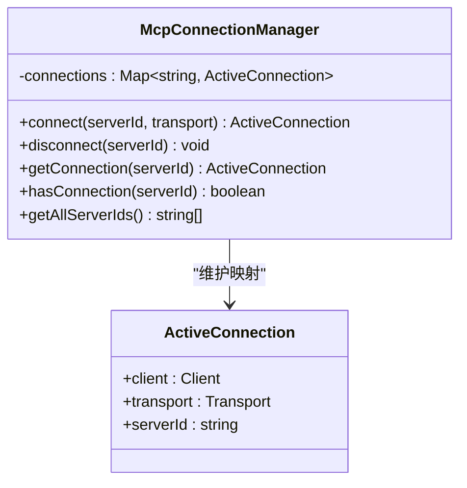
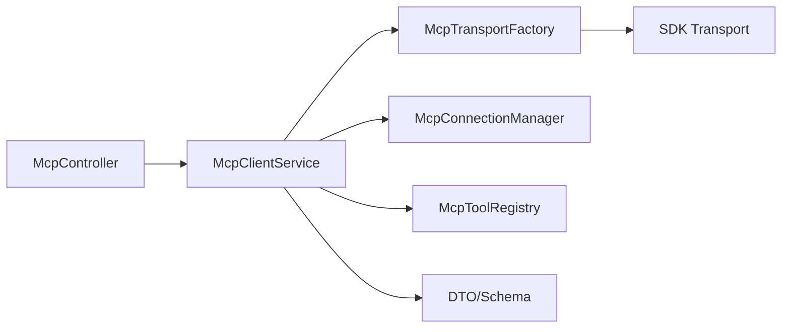

# MCP 传输工厂

<cite>
**本文引用的文件**
- [apps/backend/src/mcp/core/mcp-transport.factory.ts](file://apps/backend/src/mcp/core/mcp-transport.factory.ts)
- [apps/backend/src/mcp/core/mcp-connection.manager.ts](file://apps/backend/src/mcp/core/mcp-connection.manager.ts)
- [apps/backend/src/mcp/core/mcp-tool.registry.ts](file://apps/backend/src/mcp/core/mcp-tool.registry.ts)
- [apps/backend/src/mcp/mcp-client.service.ts](file://apps/backend/src/mcp/mcp-client.service.ts)
- [apps/backend/src/mcp/mcp-server-config.service.ts](file://apps/backend/src/mcp/mcp-server-config.service.ts)
- [apps/backend/src/mcp/mcp.dto.ts](file://apps/backend/src/mcp/mcp.dto.ts)
- [apps/backend/src/mcp/mcp.controller.ts](file://apps/backend/src/mcp/mcp.controller.ts)
- [apps/backend/src/mcp/mcp.module.ts](file://apps/backend/src/mcp/mcp.module.ts)
- [packages/shared/src/schemas/mcp.schema.ts](file://packages/shared/src/schemas/mcp.schema.ts)
- [apps/backend/tests/mcp/mcp-transport.factory.spec.ts](file://apps/backend/tests/mcp/mcp-transport.factory.spec.ts)
- [apps/frontend/src/features/mcp/components/McpServerStdioConfig.vue](file://apps/frontend/src/features/mcp/components/McpServerStdioConfig.vue)
- [apps/frontend/src/features/mcp/components/McpServerHttpConfig.vue](file://apps/frontend/src/features/mcp/components/McpServerHttpConfig.vue)
- [apps/frontend/src/features/mcp/components/McpSettingsManager.vue](file://apps/frontend/src/features/mcp/components/McpSettingsManager.vue)
- [apps/frontend/src/features/mcp/stores/mcp.ts](file://apps/frontend/src/features/mcp/stores/mcp.ts)
- [apps/frontend/src/features/mcp/api/mcp.ts](file://apps/frontend/src/features/mcp/api/mcp.ts)
</cite>

## 目录
1. [简介](#简介)
2. [项目结构](#项目结构)
3. [核心组件](#核心组件)
4. [架构总览](#架构总览)
5. [详细组件分析](#详细组件分析)
6. [依赖关系分析](#依赖关系分析)
7. [性能考量](#性能考量)
8. [故障排查指南](#故障排查指南)
9. [结论](#结论)
10. [附录](#附录)

## 简介
本文件系统性阐述 MCP（Model Context Protocol）传输工厂的设计与实现，重点覆盖：
- 传输工厂的设计模式与工厂方法实现
- 支持的传输协议类型（HTTP、STDIO）与配置项
- 传输层抽象、协议适配与连接参数管理
- 传输安全机制、加密通信与身份验证
- 自定义传输协议的开发指南与集成方法
- 传输性能优化、连接池管理与资源回收策略
- 传输故障检测、自动重连与优雅降级
- 传输调试工具、监控指标与故障排除方法

## 项目结构
后端采用 NestJS 模块化组织，MCP 子系统由以下关键模块组成：
- 控制器：对外暴露 REST 接口，负责鉴权与路由转发
- 配置服务：持久化与校验用户 MCP 服务器配置
- 客户端服务：统一门面，协调传输工厂、连接管理与工具注册表
- 传输工厂：根据配置创建并返回具体传输实例
- 连接管理器：封装 Client 连接生命周期与事件处理
- 工具注册表：缓存与刷新远端工具清单
- DTO 与共享 Schema：前后端一致的数据契约与校验

**图表来源**
- [apps/backend/src/mcp/mcp.controller.ts:34-198](file://apps/backend/src/mcp/mcp.controller.ts#L34-L198)
- [apps/backend/src/mcp/mcp-server-config.service.ts:10-156](file://apps/backend/src/mcp/mcp-server-config.service.ts#L10-L156)
- [apps/backend/src/mcp/mcp-client.service.ts:17-124](file://apps/backend/src/mcp/mcp-client.service.ts#L17-L124)
- [apps/backend/src/mcp/core/mcp-transport.factory.ts:10-220](file://apps/backend/src/mcp/core/mcp-transport.factory.ts#L10-L220)
- [apps/backend/src/mcp/core/mcp-connection.manager.ts:12-101](file://apps/backend/src/mcp/core/mcp-connection.manager.ts#L12-L101)
- [apps/backend/src/mcp/core/mcp-tool.registry.ts:5-48](file://apps/backend/src/mcp/core/mcp-tool.registry.ts#L5-L48)

**章节来源**
- [apps/backend/src/mcp/mcp.module.ts:1-25](file://apps/backend/src/mcp/mcp.module.ts#L1-L25)
- [apps/backend/src/mcp/mcp.controller.ts:34-198](file://apps/backend/src/mcp/mcp.controller.ts#L34-L198)
- [apps/backend/src/mcp/mcp-server-config.service.ts:10-156](file://apps/backend/src/mcp/mcp-server-config.service.ts#L10-L156)
- [apps/backend/src/mcp/mcp-client.service.ts:17-124](file://apps/backend/src/mcp/mcp-client.service.ts#L17-L124)
- [apps/backend/src/mcp/core/mcp-transport.factory.ts:10-220](file://apps/backend/src/mcp/core/mcp-transport.factory.ts#L10-L220)
- [apps/backend/src/mcp/core/mcp-connection.manager.ts:12-101](file://apps/backend/src/mcp/core/mcp-connection.manager.ts#L12-L101)
- [apps/backend/src/mcp/core/mcp-tool.registry.ts:5-48](file://apps/backend/src/mcp/core/mcp-tool.registry.ts#L5-L48)

## 核心组件
- 传输工厂（McpTransportFactory）
  - 负责解析配置、执行安全检查、动态导入并构造具体传输实例
  - 支持 STDIO 与 HTTP 两种传输类型
- 客户端服务（McpClientService）
  - 统一门面：创建传输、建立连接、管理工具注册表、执行工具调用
- 连接管理器（McpConnectionManager）
  - 封装 Client 生命周期、错误处理、关闭清理与事件监听
- 工具注册表（McpToolRegistry）
  - 缓存远端工具清单，按需刷新，失败时回退缓存
- 配置服务（McpServerConfigService）
  - 用户 MCP 服务器配置的增删改查与权限校验
- 控制器（McpController）
  - 对外提供 REST 接口：创建/查询/更新/删除配置；连接/断开；获取工具；调用工具

**章节来源**
- [apps/backend/src/mcp/core/mcp-transport.factory.ts:10-220](file://apps/backend/src/mcp/core/mcp-transport.factory.ts#L10-L220)
- [apps/backend/src/mcp/mcp-client.service.ts:17-124](file://apps/backend/src/mcp/mcp-client.service.ts#L17-L124)
- [apps/backend/src/mcp/core/mcp-connection.manager.ts:12-101](file://apps/backend/src/mcp/core/mcp-connection.manager.ts#L12-L101)
- [apps/backend/src/mcp/core/mcp-tool.registry.ts:5-48](file://apps/backend/src/mcp/core/mcp-tool.registry.ts#L5-L48)
- [apps/backend/src/mcp/mcp-server-config.service.ts:10-156](file://apps/backend/src/mcp/mcp-server-config.service.ts#L10-L156)
- [apps/backend/src/mcp/mcp.controller.ts:34-198](file://apps/backend/src/mcp/mcp.controller.ts#L34-L198)

## 架构总览
下图展示从控制器到传输工厂、SDK 传输实现以及连接管理的整体流程。

**图表来源**
- [apps/backend/src/mcp/mcp.controller.ts:134-140](file://apps/backend/src/mcp/mcp.controller.ts#L134-L140)
- [apps/backend/src/mcp/mcp-client.service.ts:33-47](file://apps/backend/src/mcp/mcp-client.service.ts#L33-L47)
- [apps/backend/src/mcp/core/mcp-transport.factory.ts:112-126](file://apps/backend/src/mcp/core/mcp-transport.factory.ts#L112-L126)
- [apps/backend/src/mcp/core/mcp-connection.manager.ts:23-73](file://apps/backend/src/mcp/core/mcp-connection.manager.ts#L23-L73)

## 详细组件分析

### 传输工厂（McpTransportFactory）
- 设计模式
  - 工厂方法：根据传入的传输类型与配置，返回对应 Transport 实例
  - 安全前置：在创建前进行协议、主机、IP 地址与命令白名单检查
- 协议支持
  - STDIO：子进程启动外部 MCP 服务器，支持环境变量白名单注入与命令纠正
  - HTTP：基于流式 HTTP 传输，支持 Bearer/OAuth 与 API Key 认证头
- 配置与参数
  - STDIO：command、args、cwd、env（白名单过滤）、stderr 管道
  - HTTP：url、headers、auth（type、token、apiKey、apiKeyHeader）
- 安全机制
  - 阻止 localhost、.local、私网与链路本地地址
  - DNS 解析后再次阻断解析结果为私网/环回地址
  - STDIO 命令白名单与生产环境开关
- 动态导入
  - HTTP 传输通过动态 import 按需加载，降低启动成本

**图表来源**
- [apps/backend/src/mcp/core/mcp-transport.factory.ts:112-218](file://apps/backend/src/mcp/core/mcp-transport.factory.ts#L112-L218)

**章节来源**
- [apps/backend/src/mcp/core/mcp-transport.factory.ts:10-220](file://apps/backend/src/mcp/core/mcp-transport.factory.ts#L10-L220)
- [packages/shared/src/schemas/mcp.schema.ts:6-118](file://packages/shared/src/schemas/mcp.schema.ts#L6-L118)

### 客户端服务（McpClientService）
- 角色定位：统一门面，协调传输工厂、连接管理与工具注册表
- 关键流程
  - connect：创建传输 → 建立连接 → 刷新工具注册表
  - disconnect：清理工具缓存 → 断开连接
  - listTools：若无连接则抛错，否则返回注册表缓存/刷新结果
  - callTool：校验工具存在 → 发起工具调用 → 返回标准化结果
- 错误处理：捕获并记录错误，向上抛出

**图表来源**
- [apps/backend/src/mcp/mcp-client.service.ts:33-47](file://apps/backend/src/mcp/mcp-client.service.ts#L33-L47)
- [apps/backend/src/mcp/core/mcp-transport.factory.ts:112-126](file://apps/backend/src/mcp/core/mcp-transport.factory.ts#L112-L126)
- [apps/backend/src/mcp/core/mcp-connection.manager.ts:23-73](file://apps/backend/src/mcp/core/mcp-connection.manager.ts#L23-L73)
- [apps/backend/src/mcp/core/mcp-tool.registry.ts:20-42](file://apps/backend/src/mcp/core/mcp-tool.registry.ts#L20-L42)

**章节来源**
- [apps/backend/src/mcp/mcp-client.service.ts:17-124](file://apps/backend/src/mcp/mcp-client.service.ts#L17-L124)

### 连接管理器（McpConnectionManager）
- 职责
  - 维护 serverId 到 ActiveConnection 的映射
  - 管理 Client 生命周期：connect、close
  - 处理 STDIO 传输的 stderr、onclose、onerror 事件
  - 模块销毁时自动断开所有连接
- 超时与稳定性
  - SDK 客户端初始化时可配置 requestTimeout
  - 连接失败时记录错误并抛出

**图表来源**
- [apps/backend/src/mcp/core/mcp-connection.manager.ts:6-101](file://apps/backend/src/mcp/core/mcp-connection.manager.ts#L6-L101)

**章节来源**
- [apps/backend/src/mcp/core/mcp-connection.manager.ts:12-101](file://apps/backend/src/mcp/core/mcp-connection.manager.ts#L12-L101)

### 工具注册表（McpToolRegistry）
- 职责
  - 缓存每个 serverId 的工具清单
  - 若无连接则清缓存并返回空列表
  - 成功刷新后写入缓存，失败时回退至旧缓存
- 与连接管理器耦合：通过 getConnection 获取当前连接

**章节来源**
- [apps/backend/src/mcp/core/mcp-tool.registry.ts:5-48](file://apps/backend/src/mcp/core/mcp-tool.registry.ts#L5-L48)

### 配置服务（McpServerConfigService）
- 职责
  - 用户 MCP 服务器配置的创建、查询、更新、删除
  - 权限校验：所有权验证与禁止访问保护
  - 查询启用的服务器集合，供工具发现使用
- 数据模型
  - 字段：id、name、description、transport、config、enabled、userId、createdAt、updatedAt
  - config 与 transport 必须匹配（Schema 校验）

**章节来源**
- [apps/backend/src/mcp/mcp-server-config.service.ts:10-156](file://apps/backend/src/mcp/mcp-server-config.service.ts#L10-L156)
- [packages/shared/src/schemas/mcp.schema.ts:123-172](file://packages/shared/src/schemas/mcp.schema.ts#L123-L172)

### 控制器（McpController）
- 职责
  - JWT 鉴权保护
  - 提供配置 CRUD、连接/断开、工具列表与调用接口
  - 工具发现：对启用服务器懒连接并聚合工具列表
- 关键点
  - 删除服务器前先断开连接
  - 工具调用前确保已连接

**章节来源**
- [apps/backend/src/mcp/mcp.controller.ts:34-198](file://apps/backend/src/mcp/mcp.controller.ts#L34-L198)

### 前端集成与配置
- 配置组件
  - STDIO 配置：命令、参数、环境变量输入与校正
  - HTTP 配置：URL、认证方式（Bearer/API Key/OAuth）与头部
- 设置管理器
  - 展示服务器列表、编辑、连接/断开、查看工具
  - 状态管理：连接状态、正在连接、错误信息
- API 服务
  - 统一封装 REST 请求，设置超时与错误处理

**章节来源**
- [apps/frontend/src/features/mcp/components/McpServerStdioConfig.vue:1-215](file://apps/frontend/src/features/mcp/components/McpServerStdioConfig.vue#L1-L215)
- [apps/frontend/src/features/mcp/components/McpServerHttpConfig.vue:1-180](file://apps/frontend/src/features/mcp/components/McpServerHttpConfig.vue#L1-L180)
- [apps/frontend/src/features/mcp/components/McpSettingsManager.vue:1-286](file://apps/frontend/src/features/mcp/components/McpSettingsManager.vue#L1-L286)
- [apps/frontend/src/features/mcp/stores/mcp.ts:15-246](file://apps/frontend/src/features/mcp/stores/mcp.ts#L15-L246)
- [apps/frontend/src/features/mcp/api/mcp.ts:16-108](file://apps/frontend/src/features/mcp/api/mcp.ts#L16-L108)

## 依赖关系分析
- 模块内聚与解耦
  - 控制器仅负责路由与鉴权，业务逻辑委托给服务层
  - 客户端服务作为门面，隔离上层调用与底层实现细节
  - 传输工厂与连接管理器职责清晰，便于替换与扩展
- 外部依赖
  - SDK Transport：StdioClientTransport、StreamableHTTPClientTransport
  - Zod Schema：前后端一致的配置校验
- 测试覆盖
  - 传输工厂单元测试覆盖安全检查、认证头设置、环境变量白名单等关键路径

**图表来源**
- [apps/backend/src/mcp/mcp.controller.ts:34-198](file://apps/backend/src/mcp/mcp.controller.ts#L34-L198)
- [apps/backend/src/mcp/mcp-client.service.ts:17-124](file://apps/backend/src/mcp/mcp-client.service.ts#L17-L124)
- [apps/backend/src/mcp/core/mcp-transport.factory.ts:10-220](file://apps/backend/src/mcp/core/mcp-transport.factory.ts#L10-L220)
- [apps/backend/src/mcp/core/mcp-connection.manager.ts:12-101](file://apps/backend/src/mcp/core/mcp-connection.manager.ts#L12-L101)
- [apps/backend/src/mcp/core/mcp-tool.registry.ts:5-48](file://apps/backend/src/mcp/core/mcp-tool.registry.ts#L5-L48)
- [apps/backend/src/mcp/mcp.dto.ts:1-59](file://apps/backend/src/mcp/mcp.dto.ts#L1-L59)
- [packages/shared/src/schemas/mcp.schema.ts:1-220](file://packages/shared/src/schemas/mcp.schema.ts#L1-L220)

**章节来源**
- [apps/backend/src/mcp/mcp.module.ts:1-25](file://apps/backend/src/mcp/mcp.module.ts#L1-L25)
- [apps/backend/src/mcp/mcp.dto.ts:1-59](file://apps/backend/src/mcp/mcp.dto.ts#L1-L59)

## 性能考量
- 传输选择
  - HTTP：适合跨网络、可水平扩展、便于日志与监控
  - STDIO：低延迟、本地进程，适合高吞吐与本地工具
- 连接管理
  - 连接复用：同一 serverId 复用已有连接，避免重复握手
  - 懒连接：工具发现时按需连接，减少不必要的开销
- 资源回收
  - 模块销毁时自动断开所有连接，防止资源泄漏
  - 工具缓存：减少频繁 listTools 调用带来的网络与 CPU 开销
- 超时与稳定性
  - SDK 客户端 requestTimeout 默认较长，适配冷启动与大包场景
  - 前端 API 调整超时：连接 5 分钟、工具 60 秒、工具列表 30 秒

**章节来源**
- [apps/backend/src/mcp/core/mcp-connection.manager.ts:29-39](file://apps/backend/src/mcp/core/mcp-connection.manager.ts#L29-L39)
- [apps/frontend/src/features/mcp/api/mcp.ts:89-106](file://apps/frontend/src/features/mcp/api/mcp.ts#L89-L106)

## 故障排查指南
- 常见问题与定位
  - HTTP 主机被阻断：检查协议、主机名、DNS 解析结果是否为私网/环回
  - STDIO 命令未允许：确认 NODE_ENV 与 MCP_ENABLE_STDIO、MCP_STDIO_ALLOWED_COMMANDS 配置
  - 连接失败：查看连接管理器日志与 stderr 输出
  - 工具不存在：确认已连接且工具注册表已刷新
- 调试建议
  - 启用详细日志：观察传输工厂与连接管理器的日志输出
  - 使用前端设置面板：查看连接状态、错误信息与服务器列表
  - 单元测试参考：基于现有测试用例定位边界条件（如环境变量白名单、OAuth Bearer 头）

**章节来源**
- [apps/backend/src/mcp/core/mcp-transport.factory.ts:91-110](file://apps/backend/src/mcp/core/mcp-transport.factory.ts#L91-L110)
- [apps/backend/src/mcp/core/mcp-connection.manager.ts:44-58](file://apps/backend/src/mcp/core/mcp-connection.manager.ts#L44-L58)
- [apps/backend/tests/mcp/mcp-transport.factory.spec.ts:108-126](file://apps/backend/tests/mcp/mcp-transport.factory.spec.ts#L108-L126)

## 结论
MCP 传输工厂通过清晰的职责划分与安全前置检查，提供了稳定、可扩展的传输能力。结合连接管理与工具注册表，实现了从配置到工具调用的完整闭环。建议在生产环境中严格配置 STDIO 白名单与 HTTP 安全策略，并利用缓存与懒连接提升性能与可靠性。

## 附录

### 支持的传输协议与配置项
- STDIO
  - 关键字段：command、args、cwd、env（白名单）
  - 安全：命令不允许含空格（需拆分到 args），仅允许特定环境变量透传
- HTTP
  - 关键字段：url、headers、auth（type、token、apiKey、apiKeyHeader）
  - 安全：仅允许 http(s)、禁止 localhost/.local/私网/环回，DNS 解析后二次校验

**章节来源**
- [packages/shared/src/schemas/mcp.schema.ts:79-118](file://packages/shared/src/schemas/mcp.schema.ts#L79-L118)
- [apps/backend/src/mcp/core/mcp-transport.factory.ts:128-188](file://apps/backend/src/mcp/core/mcp-transport.factory.ts#L128-L188)
- [apps/backend/src/mcp/core/mcp-transport.factory.ts:190-218](file://apps/backend/src/mcp/core/mcp-transport.factory.ts#L190-L218)

### 自定义传输协议开发指南
- 新增步骤
  - 在共享 Schema 中定义新传输类型与配置 Schema
  - 在传输工厂中新增分支，构造对应 SDK Transport
  - 在客户端服务与控制器中补充相应接口与参数
  - 补充安全检查与环境变量白名单策略
  - 编写单元测试覆盖关键路径
- 集成要点
  - 保持与现有门面与连接管理器的解耦
  - 明确超时与错误处理策略
  - 提供前端配置组件与状态反馈

**章节来源**
- [packages/shared/src/schemas/mcp.schema.ts:6-11](file://packages/shared/src/schemas/mcp.schema.ts#L6-L11)
- [apps/backend/src/mcp/core/mcp-transport.factory.ts:112-126](file://apps/backend/src/mcp/core/mcp-transport.factory.ts#L112-L126)
- [apps/backend/src/mcp/mcp-client.service.ts:33-47](file://apps/backend/src/mcp/mcp-client.service.ts#L33-L47)