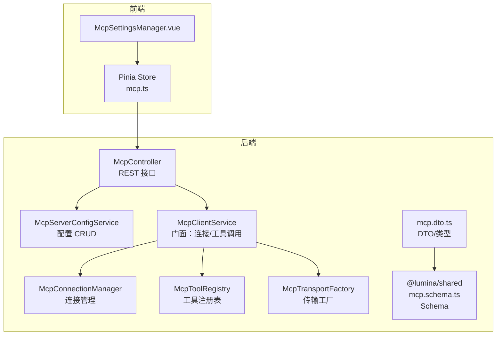
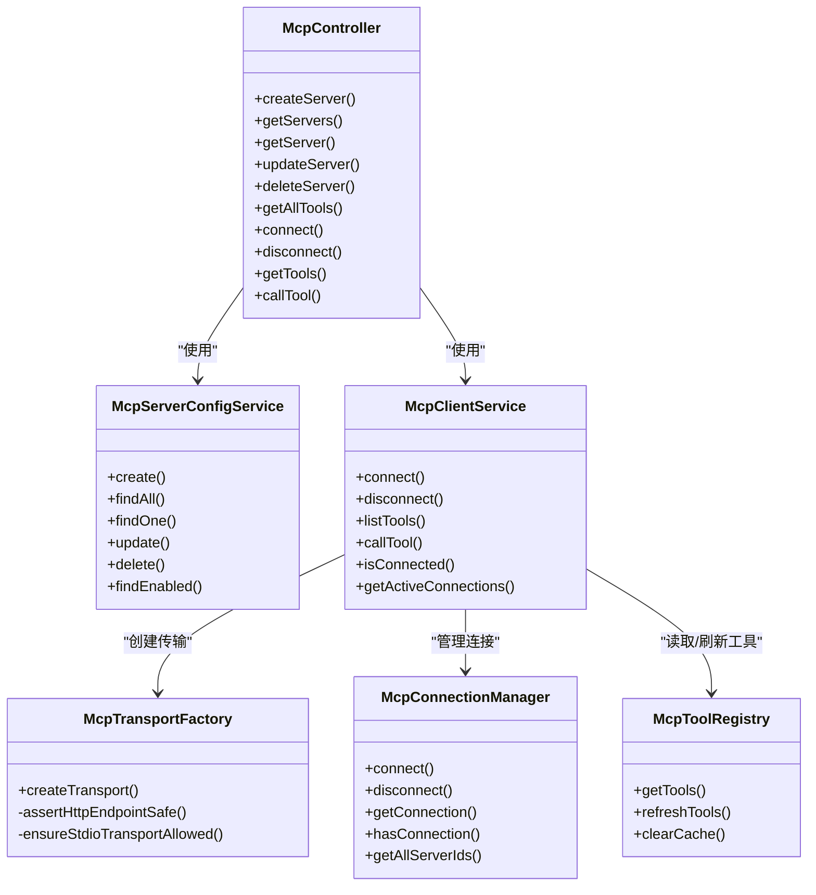
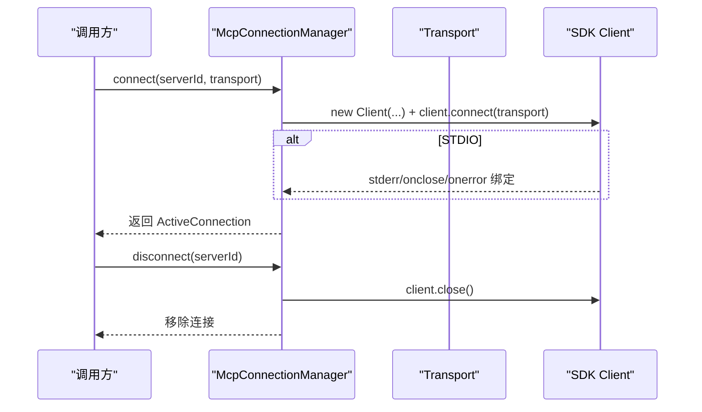
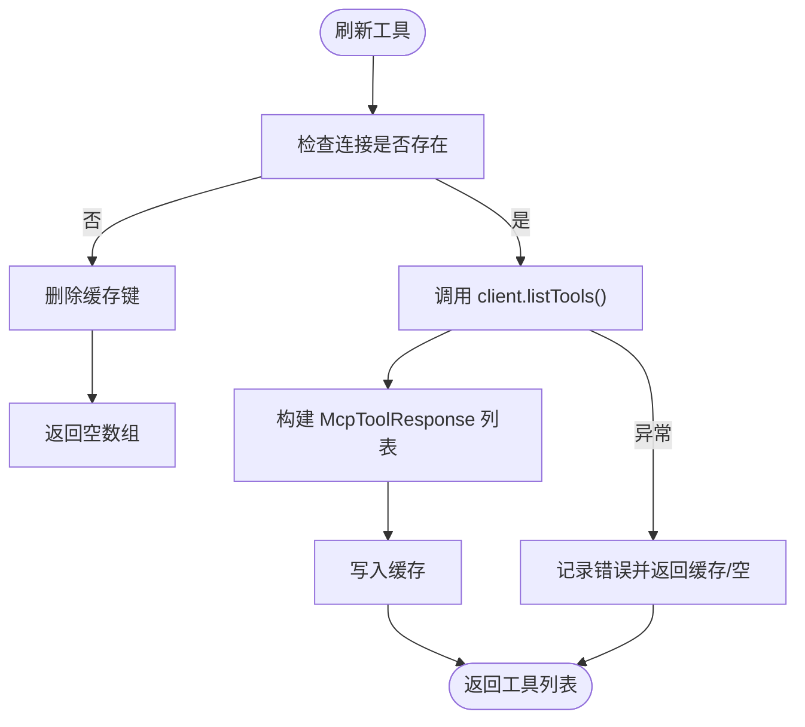
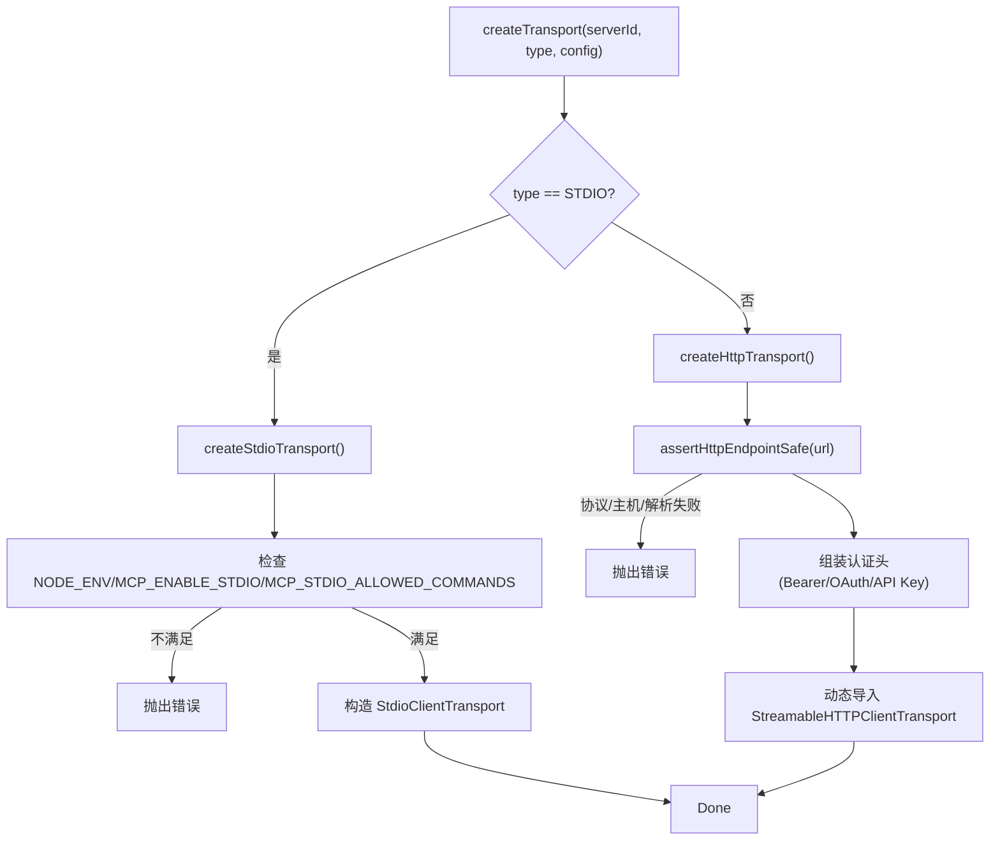
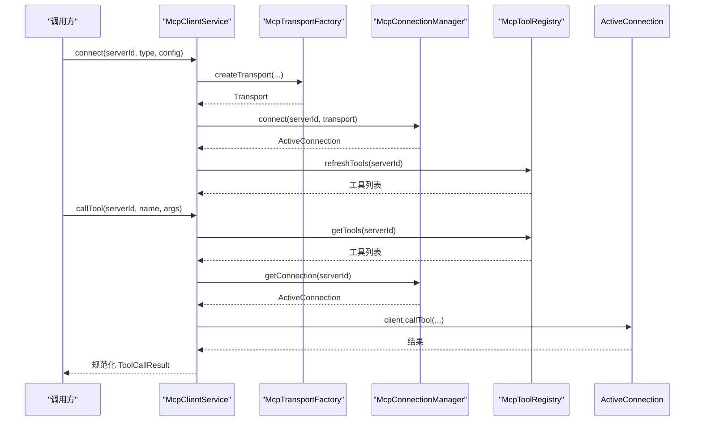
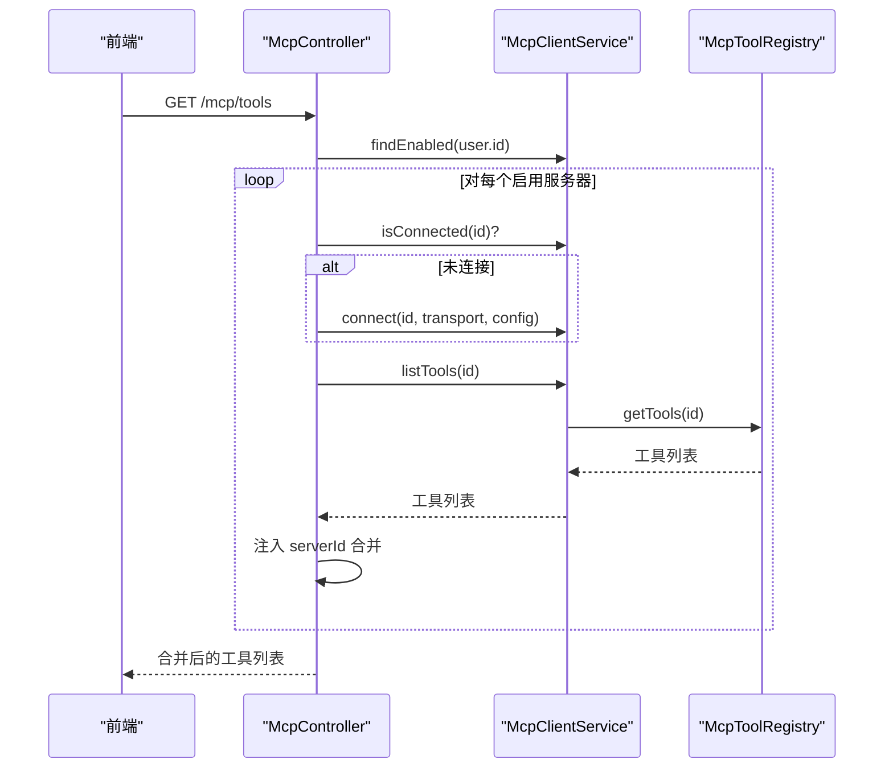
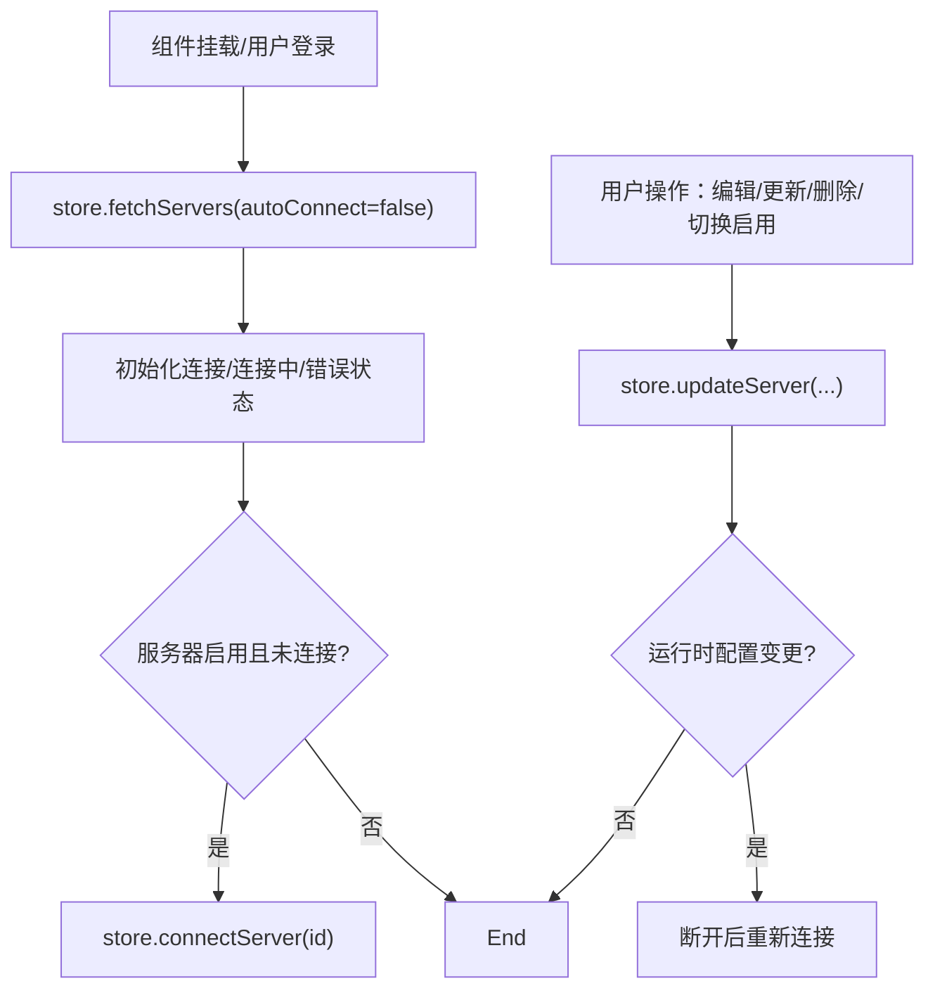
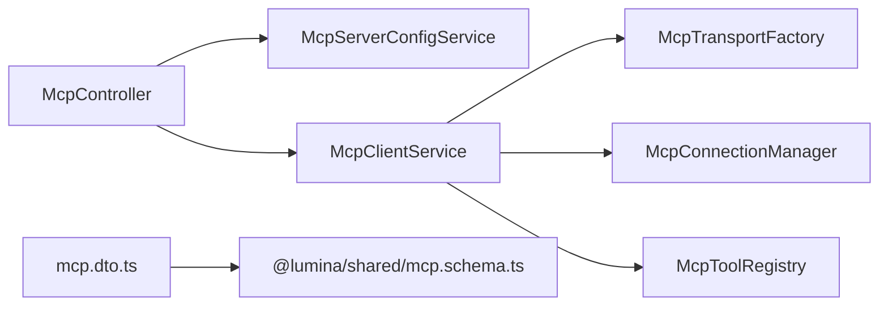

# MCP 协议扩展

<cite>
**本文引用的文件**
- [apps/backend/src/mcp/core/mcp-connection.manager.ts](file://apps/backend/src/mcp/core/mcp-connection.manager.ts)
- [apps/backend/src/mcp/core/mcp-tool.registry.ts](file://apps/backend/src/mcp/core/mcp-tool.registry.ts)
- [apps/backend/src/mcp/core/mcp-transport.factory.ts](file://apps/backend/src/mcp/core/mcp-transport.factory.ts)
- [apps/backend/src/mcp/mcp-client.service.ts](file://apps/backend/src/mcp/mcp-client.service.ts)
- [apps/backend/src/mcp/mcp-server-config.service.ts](file://apps/backend/src/mcp/mcp-server-config.service.ts)
- [apps/backend/src/mcp/mcp.dto.ts](file://apps/backend/src/mcp/mcp.dto.ts)
- [apps/backend/src/mcp/mcp.controller.ts](file://apps/backend/src/mcp/mcp.controller.ts)
- [apps/backend/src/mcp/mcp.module.ts](file://apps/backend/src/mcp/mcp.module.ts)
- [packages/shared/src/schemas/mcp.schema.ts](file://packages/shared/src/schemas/mcp.schema.ts)
- [apps/backend/tests/mcp/mcp-client.service.spec.ts](file://apps/backend/tests/mcp/mcp-client.service.spec.ts)
- [apps/backend/tests/mcp/mcp-transport.factory.spec.ts](file://apps/backend/tests/mcp/mcp-transport.factory.spec.ts)
- [apps/frontend/src/features/mcp/stores/mcp.ts](file://apps/frontend/src/features/mcp/stores/mcp.ts)
- [apps/frontend/src/features/mcp/components/McpSettingsManager.vue](file://apps/frontend/src/features/mcp/components/McpSettingsManager.vue)
</cite>

## 目录
1. [引言](#引言)
2. [项目结构](#项目结构)
3. [核心组件](#核心组件)
4. [架构总览](#架构总览)
5. [详细组件分析](#详细组件分析)
6. [依赖关系分析](#依赖关系分析)
7. [性能考量](#性能考量)
8. [故障排查指南](#故障排查指南)
9. [结论](#结论)
10. [附录](#附录)

## 引言
本指南面向希望基于 Model Context Protocol（MCP）协议扩展能力的开发者，系统讲解后端 MCP 客户端模块的设计与实现、连接管理机制、工具注册表、传输工厂、服务器配置与客户端连接流程、工具调用生命周期与错误处理、安全与认证、以及前端集成与调试监控方法。文档以仓库中的实际代码为依据，辅以可视化图示帮助快速理解。

## 项目结构
MCP 扩展位于后端 NestJS 应用的 mcp 子模块中，采用分层职责划分：
- 控制器层：提供 REST 接口，负责鉴权、参数校验与业务编排
- 服务层：封装配置管理、客户端门面、连接管理、工具注册表
- 核心层：传输工厂、连接管理器、工具注册表
- 数据传输对象：前后端共享的 Zod Schema 与 DTO
- 前端 Pinia Store 与组件：负责 MCP 服务器配置、连接状态与工具展示

图表来源
- [apps/backend/src/mcp/mcp.controller.ts:1-198](file://apps/backend/src/mcp/mcp.controller.ts#L1-198)
- [apps/backend/src/mcp/mcp-server-config.service.ts:1-156](file://apps/backend/src/mcp/mcp-server-config.service.ts#L1-156)
- [apps/backend/src/mcp/mcp-client.service.ts:1-124](file://apps/backend/src/mcp/mcp-client.service.ts#L1-124)
- [apps/backend/src/mcp/core/mcp-connection.manager.ts:1-101](file://apps/backend/src/mcp/core/mcp-connection.manager.ts#L1-101)
- [apps/backend/src/mcp/core/mcp-tool.registry.ts:1-48](file://apps/backend/src/mcp/core/mcp-tool.registry.ts#L1-48)
- [apps/backend/src/mcp/core/mcp-transport.factory.ts:1-220](file://apps/backend/src/mcp/core/mcp-transport.factory.ts#L1-220)
- [apps/backend/src/mcp/mcp.dto.ts:1-59](file://apps/backend/src/mcp/mcp.dto.ts#L1-59)
- [packages/shared/src/schemas/mcp.schema.ts:1-220](file://packages/shared/src/schemas/mcp.schema.ts#L1-220)
- [apps/frontend/src/features/mcp/stores/mcp.ts:1-246](file://apps/frontend/src/features/mcp/stores/mcp.ts#L1-246)
- [apps/frontend/src/features/mcp/components/McpSettingsManager.vue:1-286](file://apps/frontend/src/features/mcp/components/McpSettingsManager.vue#L1-286)

章节来源
- [apps/backend/src/mcp/mcp.module.ts:1-25](file://apps/backend/src/mcp/mcp.module.ts#L1-25)
- [apps/backend/src/mcp/mcp.controller.ts:1-198](file://apps/backend/src/mcp/mcp.controller.ts#L1-198)
- [apps/backend/src/mcp/mcp.dto.ts:1-59](file://apps/backend/src/mcp/mcp.dto.ts#L1-59)

## 核心组件
- 连接管理器：维护 serverId 到 ActiveConnection 的映射，负责连接建立、断开、事件监听与清理
- 工具注册表：缓存每个服务器的工具清单，支持刷新与清理
- 传输工厂：根据传输类型（STDIO/HTTP）创建安全可控的传输通道，内置主机与地址白名单/黑名单检查
- 客户端门面：统一暴露 connect/listTools/callTool/disconnect 等接口，协调传输、连接与工具注册表
- 服务器配置服务：用户维度的 MCP 服务器配置 CRUD，支持启用/禁用与运行时变更检测
- 控制器：鉴权守卫、参数校验、懒连接策略、工具聚合查询
- 前端 Store/组件：管理服务器列表、连接状态、错误信息与工具弹窗展示

章节来源
- [apps/backend/src/mcp/core/mcp-connection.manager.ts:1-101](file://apps/backend/src/mcp/core/mcp-connection.manager.ts#L1-101)
- [apps/backend/src/mcp/core/mcp-tool.registry.ts:1-48](file://apps/backend/src/mcp/core/mcp-tool.registry.ts#L1-48)
- [apps/backend/src/mcp/core/mcp-transport.factory.ts:1-220](file://apps/backend/src/mcp/core/mcp-transport.factory.ts#L1-220)
- [apps/backend/src/mcp/mcp-client.service.ts:1-124](file://apps/backend/src/mcp/mcp-client.service.ts#L1-124)
- [apps/backend/src/mcp/mcp-server-config.service.ts:1-156](file://apps/backend/src/mcp/mcp-server-config.service.ts#L1-156)
- [apps/backend/src/mcp/mcp.controller.ts:1-198](file://apps/backend/src/mcp/mcp.controller.ts#L1-198)
- [apps/frontend/src/features/mcp/stores/mcp.ts:1-246](file://apps/frontend/src/features/mcp/stores/mcp.ts#L1-246)

## 架构总览
MCP 客户端模块遵循“控制器-服务-核心”三层结构，前端通过 Pinia Store 与后端 API 交互，后端通过传输工厂选择合适的传输协议，连接管理器负责生命周期，工具注册表提供工具清单缓存。

图表来源
- [apps/backend/src/mcp/mcp.controller.ts:1-198](file://apps/backend/src/mcp/mcp.controller.ts#L1-198)
- [apps/backend/src/mcp/mcp-server-config.service.ts:1-156](file://apps/backend/src/mcp/mcp-server-config.service.ts#L1-156)
- [apps/backend/src/mcp/mcp-client.service.ts:1-124](file://apps/backend/src/mcp/mcp-client.service.ts#L1-124)
- [apps/backend/src/mcp/core/mcp-transport.factory.ts:1-220](file://apps/backend/src/mcp/core/mcp-transport.factory.ts#L1-220)
- [apps/backend/src/mcp/core/mcp-connection.manager.ts:1-101](file://apps/backend/src/mcp/core/mcp-connection.manager.ts#L1-101)
- [apps/backend/src/mcp/core/mcp-tool.registry.ts:1-48](file://apps/backend/src/mcp/core/mcp-tool.registry.ts#L1-48)

## 详细组件分析

### 连接管理器（McpConnectionManager）
职责
- 维护 serverId 到 ActiveConnection 的映射
- 建立连接、断开连接、处理 STDIO 传输的 stderr/onclose/onerror
- 提供连接状态查询与全部连接枚举

关键点
- 使用 SDK Client 连接传输，设置超时等选项
- 对 STDIO 传输绑定错误与关闭事件，便于日志与状态同步
- 模块销毁时自动断开所有连接，防止资源泄漏

图表来源
- [apps/backend/src/mcp/core/mcp-connection.manager.ts:23-87](file://apps/backend/src/mcp/core/mcp-connection.manager.ts#L23-87)

章节来源
- [apps/backend/src/mcp/core/mcp-connection.manager.ts:1-101](file://apps/backend/src/mcp/core/mcp-connection.manager.ts#L1-101)

### 工具注册表（McpToolRegistry）
职责
- 缓存每个服务器的工具清单
- 在连接存在时拉取最新工具列表，失败时返回缓存或空集

关键点
- 通过 connection.client.listTools() 获取工具
- 将工具名称、描述、输入模式等标准化为 McpToolResponse
- 提供 clearCache 以便在断开连接后清理

图表来源
- [apps/backend/src/mcp/core/mcp-tool.registry.ts:20-42](file://apps/backend/src/mcp/core/mcp-tool.registry.ts#L20-42)

章节来源
- [apps/backend/src/mcp/core/mcp-tool.registry.ts:1-48](file://apps/backend/src/mcp/core/mcp-tool.registry.ts#L1-48)

### 传输工厂（McpTransportFactory）
职责
- 根据传输类型创建安全可控的传输
- STDIO：限制命令执行、仅传递允许的环境变量、支持命令白名单
- HTTP：校验 URL 协议与主机、解析 DNS 并阻断私有/回环地址、支持 Bearer/OAuth/API Key 认证头注入

安全与合规
- 仅允许 http/https，阻断 localhost、.local、.localhost 与私有/回环 IP
- 生产环境默认禁用 STDIO，除非显式开启并配置允许命令白名单
- 严格过滤 STDIO 传输的环境变量，避免敏感信息泄露

图表来源
- [apps/backend/src/mcp/core/mcp-transport.factory.ts:112-218](file://apps/backend/src/mcp/core/mcp-transport.factory.ts#L112-218)

章节来源
- [apps/backend/src/mcp/core/mcp-transport.factory.ts:1-220](file://apps/backend/src/mcp/core/mcp-transport.factory.ts#L1-220)
- [packages/shared/src/schemas/mcp.schema.ts:63-116](file://packages/shared/src/schemas/mcp.schema.ts#L63-116)

### 客户端门面（McpClientService）
职责
- 统一入口：connect/disconnect/listTools/callTool/isConnected/getActiveConnections
- 连接成功后预热工具注册表
- 调用前校验连接与工具存在性，规范化返回结构

图表来源
- [apps/backend/src/mcp/mcp-client.service.ts:30-108](file://apps/backend/src/mcp/mcp-client.service.ts#L30-108)
- [apps/backend/src/mcp/core/mcp-transport.factory.ts:112-218](file://apps/backend/src/mcp/core/mcp-transport.factory.ts#L112-218)
- [apps/backend/src/mcp/core/mcp-tool.registry.ts:20-42](file://apps/backend/src/mcp/core/mcp-tool.registry.ts#L20-42)
- [apps/backend/src/mcp/core/mcp-connection.manager.ts:89-95](file://apps/backend/src/mcp/core/mcp-connection.manager.ts#L89-95)

章节来源
- [apps/backend/src/mcp/mcp-client.service.ts:1-124](file://apps/backend/src/mcp/mcp-client.service.ts#L1-124)

### 服务器配置服务（McpServerConfigService）
职责
- 用户维度的 MCP 服务器配置 CRUD
- 启用/禁用控制，运行时变更检测与权限校验
- 查询启用的服务器用于工具自动发现

关键点
- 删除前先断开连接，避免悬挂状态
- 更新时校验传输类型与配置一致性

章节来源
- [apps/backend/src/mcp/mcp-server-config.service.ts:1-156](file://apps/backend/src/mcp/mcp-server-config.service.ts#L1-156)

### 控制器（McpController）
职责
- JWT 鉴权、参数校验（Zod）
- 懒连接策略：在需要时自动连接启用的服务器
- 工具聚合：遍历启用服务器，注入 serverId 后合并返回
- 工具调用：确保连接后执行，返回标准化结果

图表来源
- [apps/backend/src/mcp/mcp.controller.ts:103-129](file://apps/backend/src/mcp/mcp.controller.ts#L103-129)

章节来源
- [apps/backend/src/mcp/mcp.controller.ts:1-198](file://apps/backend/src/mcp/mcp.controller.ts#L1-198)

### 前端集成（Pinia Store 与组件）
职责
- 管理服务器列表、连接状态、错误信息
- 自动连接启用的服务器
- 工具弹窗展示与加载状态

图表来源
- [apps/frontend/src/features/mcp/stores/mcp.ts:43-152](file://apps/frontend/src/features/mcp/stores/mcp.ts#L43-152)
- [apps/frontend/src/features/mcp/components/McpSettingsManager.vue:36-82](file://apps/frontend/src/features/mcp/components/McpSettingsManager.vue#L36-82)

章节来源
- [apps/frontend/src/features/mcp/stores/mcp.ts:1-246](file://apps/frontend/src/features/mcp/stores/mcp.ts#L1-246)
- [apps/frontend/src/features/mcp/components/McpSettingsManager.vue:1-286](file://apps/frontend/src/features/mcp/components/McpSettingsManager.vue#L1-286)

## 依赖关系分析
- 控制器依赖配置服务与客户端门面
- 客户端门面依赖传输工厂、连接管理器与工具注册表
- 传输工厂依赖 SDK 的 STDIO/HTTP 传输实现
- DTO 与 Schema 来源于共享包，保证前后端一致

图表来源
- [apps/backend/src/mcp/mcp.controller.ts:19-40](file://apps/backend/src/mcp/mcp.controller.ts#L19-40)
- [apps/backend/src/mcp/mcp-client.service.ts:21-28](file://apps/backend/src/mcp/mcp-client.service.ts#L21-28)
- [apps/backend/src/mcp/mcp.dto.ts:1-59](file://apps/backend/src/mcp/mcp.dto.ts#L1-59)
- [packages/shared/src/schemas/mcp.schema.ts:1-220](file://packages/shared/src/schemas/mcp.schema.ts#L1-220)

章节来源
- [apps/backend/src/mcp/mcp.module.ts:13-22](file://apps/backend/src/mcp/mcp.module.ts#L13-22)

## 性能考量
- 工具注册表缓存：减少频繁调用 listTools 的网络开销
- 懒连接策略：仅在需要时连接启用服务器，降低资源占用
- 连接复用：同一 serverId 复用已有连接，避免重复握手
- 传输层优化：HTTP 传输使用可流式的实现，提升大响应处理能力

[本节为通用指导，无需列出具体文件来源]

## 故障排查指南
常见问题与定位建议
- 连接失败
  - 检查传输类型与配置是否匹配
  - 查看 STDIO 命令白名单与环境变量过滤
  - 核对 HTTP URL 协议、主机与 DNS 解析结果
- 工具不可见
  - 确认服务器已连接且工具注册表已刷新
  - 检查工具名称大小写与存在性
- 认证失败
  - 确认 Bearer/OAuth/API Key 类型与字段正确
  - 核对自定义 Header 名称（如 X-API-Key）
- 前端无响应
  - 检查 Pinia Store 的连接状态与错误信息
  - 关注组件加载状态与弹窗渲染

章节来源
- [apps/backend/src/mcp/core/mcp-transport.factory.ts:91-110](file://apps/backend/src/mcp/core/mcp-transport.factory.ts#L91-110)
- [apps/backend/src/mcp/mcp-client.service.ts:70-108](file://apps/backend/src/mcp/mcp-client.service.ts#L70-108)
- [apps/frontend/src/features/mcp/stores/mcp.ts:175-202](file://apps/frontend/src/features/mcp/stores/mcp.ts#L175-202)

## 结论
该 MCP 协议扩展以清晰的分层设计实现了安全、可扩展的外部工具集成能力。通过传输工厂的安全约束、连接管理器的生命周期控制、工具注册表的缓存策略与控制器的懒连接机制，既保障了安全性，又兼顾了性能与可用性。前端 Store 与组件提供了良好的用户体验与可观测性。后续可在现有基础上增加重连策略、连接池、指标上报与审计日志等能力。

[本节为总结性内容，无需列出具体文件来源]

## 附录

### 传输类型与配置规范
- STDIO
  - 必填：command
  - 可选：args、env、cwd
  - 安全限制：仅允许特定环境变量；生产需开启并配置允许命令白名单
- HTTP
  - 必填：url（http/https）
  - 可选：headers、auth（bearer/oauth/api_key）

章节来源
- [packages/shared/src/schemas/mcp.schema.ts:79-118](file://packages/shared/src/schemas/mcp.schema.ts#L79-118)
- [apps/backend/src/mcp/mcp.dto.ts:58-59](file://apps/backend/src/mcp/mcp.dto.ts#L58-59)

### 工具调用生命周期（测试参考）
- 测试覆盖要点：连接、工具列举、工具调用、断开连接、不存在工具与未连接场景
- 建议在自定义工具开发时参照测试用例的断言与边界条件

章节来源
- [apps/backend/tests/mcp/mcp-client.service.spec.ts:72-142](file://apps/backend/tests/mcp/mcp-client.service.spec.ts#L72-142)

### 传输工厂安全测试（参考）
- 环境变量过滤、OAuth Bearer 头注入、生产环境 STDIO 禁用、HTTP 主机与解析阻断

章节来源
- [apps/backend/tests/mcp/mcp-transport.factory.spec.ts:42-127](file://apps/backend/tests/mcp/mcp-transport.factory.spec.ts#L42-127)