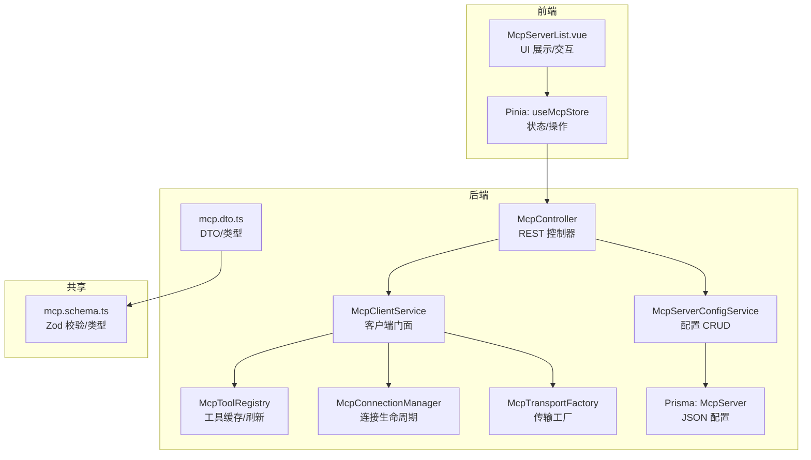
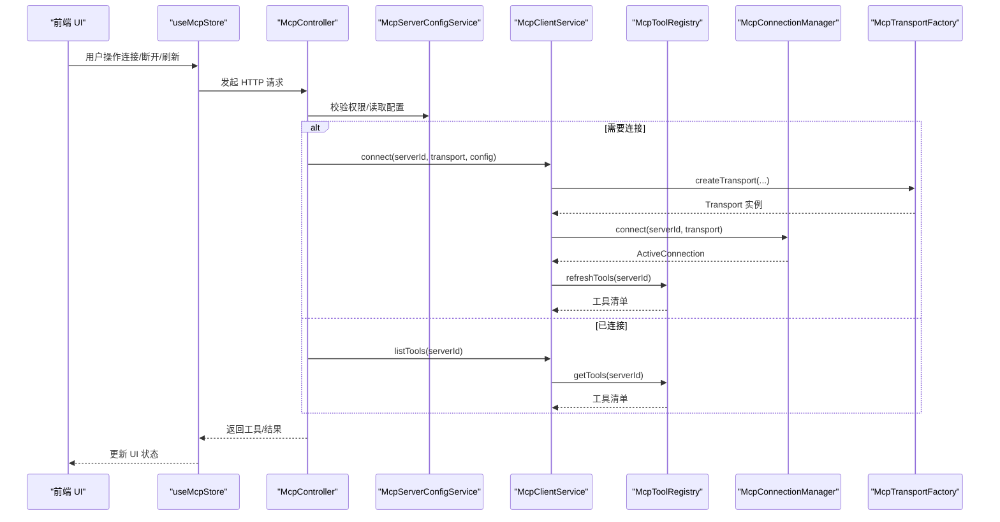
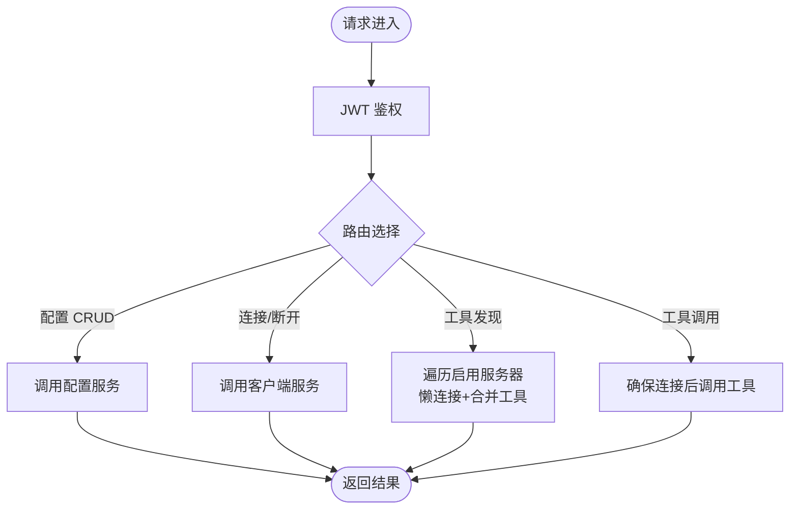
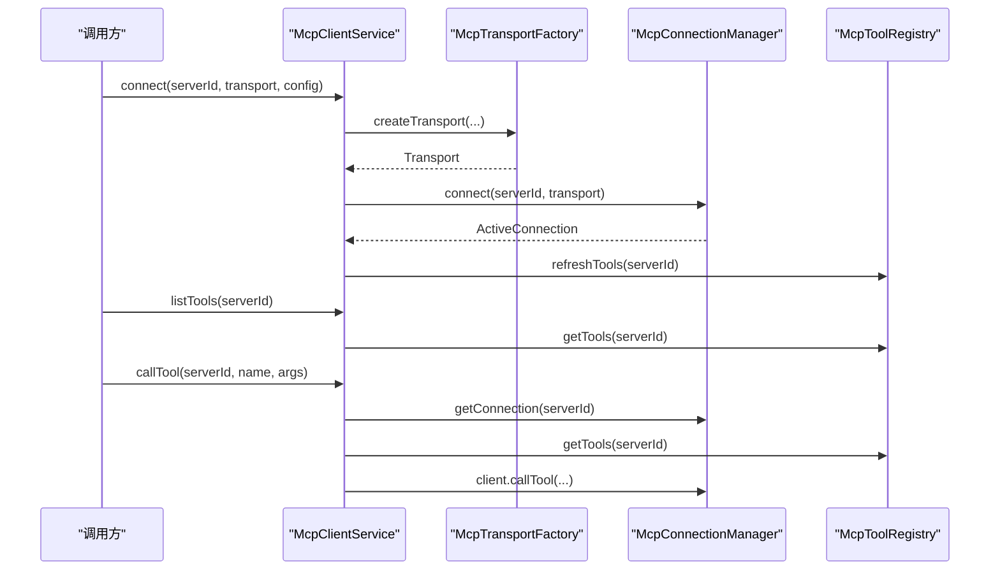
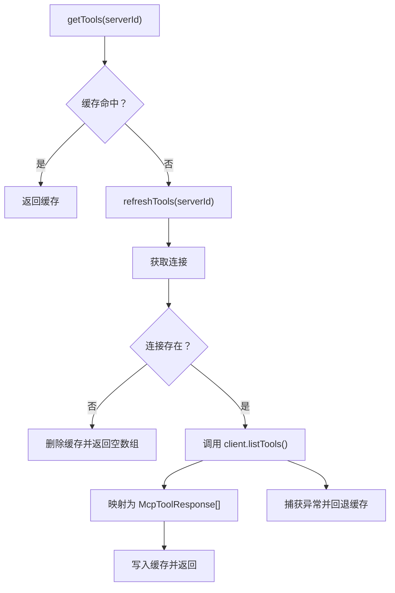
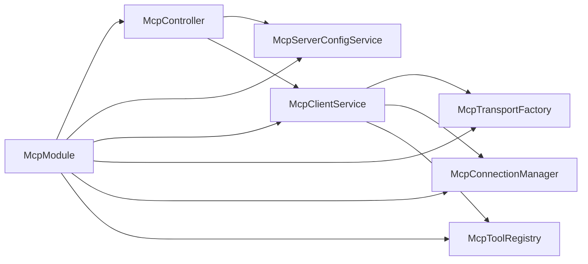

# MCP 工具注册表

<cite>
**本文引用的文件**
- [apps/backend/src/mcp/mcp.module.ts](file://apps/backend/src/mcp/mcp.module.ts)
- [apps/backend/src/mcp/mcp.controller.ts](file://apps/backend/src/mcp/mcp.controller.ts)
- [apps/backend/src/mcp/mcp-client.service.ts](file://apps/backend/src/mcp/mcp-client.service.ts)
- [apps/backend/src/mcp/mcp-server-config.service.ts](file://apps/backend/src/mcp/mcp-server-config.service.ts)
- [apps/backend/src/mcp/mcp.dto.ts](file://apps/backend/src/mcp/mcp.dto.ts)
- [apps/backend/src/mcp/core/mcp-connection.manager.ts](file://apps/backend/src/mcp/core/mcp-connection.manager.ts)
- [apps/backend/src/mcp/core/mcp-tool.registry.ts](file://apps/backend/src/mcp/core/mcp-tool.registry.ts)
- [apps/backend/src/mcp/core/mcp-transport.factory.ts](file://apps/backend/src/mcp/core/mcp-transport.factory.ts)
- [packages/shared/src/schemas/mcp.schema.ts](file://packages/shared/src/schemas/mcp.schema.ts)
- [apps/backend/prisma/schema/mcp.prisma](file://apps/backend/prisma/schema/mcp.prisma)
- [apps/backend/tests/mcp/mcp-client.service.spec.ts](file://apps/backend/tests/mcp/mcp-client.service.spec.ts)
- [apps/frontend/src/features/mcp/stores/mcp.ts](file://apps/frontend/src/features/mcp/stores/mcp.ts)
- [apps/frontend/src/features/mcp/components/McpServerList.vue](file://apps/frontend/src/features/mcp/components/McpServerList.vue)
</cite>

## 目录
1. [简介](#简介)
2. [项目结构](#项目结构)
3. [核心组件](#核心组件)
4. [架构总览](#架构总览)
5. [详细组件分析](#详细组件分析)
6. [依赖关系分析](#依赖关系分析)
7. [性能考量](#性能考量)
8. [故障排查指南](#故障排查指南)
9. [结论](#结论)
10. [附录](#附录)

## 简介
本文件系统性阐述 MCP（Model Context Protocol）工具注册表的设计与实现，覆盖工具注册、注销、查询、元数据管理、权限控制、版本兼容、调用路由与负载均衡、自定义工具开发指南、性能监控与错误处理、热更新与动态加载，以及最佳实践与常见问题。

## 项目结构
MCP 子系统位于后端 NestJS 应用的 mcp 模块内，采用“控制器-服务-工厂-连接管理-注册表”的分层设计；共享类型与校验由 shared 包提供；前端 Pinia Store 与组件负责用户交互与状态展示。

图表来源
- [apps/backend/src/mcp/mcp.controller.ts:1-198](file://apps/backend/src/mcp/mcp.controller.ts#L1-198)
- [apps/backend/src/mcp/mcp-client.service.ts:1-124](file://apps/backend/src/mcp/mcp-client.service.ts#L1-124)
- [apps/backend/src/mcp/mcp-server-config.service.ts:1-156](file://apps/backend/src/mcp/mcp-server-config.service.ts#L1-156)
- [apps/backend/src/mcp/core/mcp-tool.registry.ts:1-48](file://apps/backend/src/mcp/core/mcp-tool.registry.ts#L1-48)
- [apps/backend/src/mcp/core/mcp-connection.manager.ts:1-101](file://apps/backend/src/mcp/core/mcp-connection.manager.ts#L1-101)
- [apps/backend/src/mcp/core/mcp-transport.factory.ts:1-220](file://apps/backend/src/mcp/core/mcp-transport.factory.ts#L1-220)
- [apps/backend/src/mcp/mcp.dto.ts:1-59](file://apps/backend/src/mcp/mcp.dto.ts#L1-59)
- [apps/backend/prisma/schema/mcp.prisma:1-16](file://apps/backend/prisma/schema/mcp.prisma#L1-16)
- [packages/shared/src/schemas/mcp.schema.ts:1-220](file://packages/shared/src/schemas/mcp.schema.ts#L1-220)
- [apps/frontend/src/features/mcp/stores/mcp.ts:1-246](file://apps/frontend/src/features/mcp/stores/mcp.ts#L1-246)
- [apps/frontend/src/features/mcp/components/McpServerList.vue:1-351](file://apps/frontend/src/features/mcp/components/McpServerList.vue#L1-351)

章节来源
- [apps/backend/src/mcp/mcp.module.ts:1-25](file://apps/backend/src/mcp/mcp.module.ts#L1-25)
- [apps/backend/src/mcp/mcp.controller.ts:1-198](file://apps/backend/src/mcp/mcp.controller.ts#L1-198)
- [apps/backend/src/mcp/mcp-client.service.ts:1-124](file://apps/backend/src/mcp/mcp-client.service.ts#L1-124)
- [apps/backend/src/mcp/mcp-server-config.service.ts:1-156](file://apps/backend/src/mcp/mcp-server-config.service.ts#L1-156)
- [apps/backend/src/mcp/core/mcp-tool.registry.ts:1-48](file://apps/backend/src/mcp/core/mcp-tool.registry.ts#L1-48)
- [apps/backend/src/mcp/core/mcp-connection.manager.ts:1-101](file://apps/backend/src/mcp/core/mcp-connection.manager.ts#L1-101)
- [apps/backend/src/mcp/core/mcp-transport.factory.ts:1-220](file://apps/backend/src/mcp/core/mcp-transport.factory.ts#L1-220)
- [apps/backend/src/mcp/mcp.dto.ts:1-59](file://apps/backend/src/mcp/mcp.dto.ts#L1-59)
- [apps/backend/prisma/schema/mcp.prisma:1-16](file://apps/backend/prisma/schema/mcp.prisma#L1-16)
- [packages/shared/src/schemas/mcp.schema.ts:1-220](file://packages/shared/src/schemas/mcp.schema.ts#L1-220)
- [apps/frontend/src/features/mcp/stores/mcp.ts:1-246](file://apps/frontend/src/features/mcp/stores/mcp.ts#L1-246)
- [apps/frontend/src/features/mcp/components/McpServerList.vue:1-351](file://apps/frontend/src/features/mcp/components/McpServerList.vue#L1-351)

## 核心组件
- 控制器层：提供 REST 接口，负责鉴权、参数解析、调用服务层与返回结果。
- 服务层：
  - 配置服务：基于 Prisma 的用户 MCP 服务器配置 CRUD，含权限校验与启用过滤。
  - 客户端服务：统一门面，封装连接、断开、工具发现与调用。
- 工厂与连接：
  - 传输工厂：根据配置创建 STDIO 或 HTTP 传输，内置安全检查与环境变量白名单。
  - 连接管理器：维护活跃连接，处理连接/断开、关闭事件与日志。
- 注册表：缓存工具清单，支持刷新与清理。
- 数据模型与校验：共享 Zod Schema 确保前后端一致的输入约束。
- 前端 Store/组件：管理服务器列表、连接状态、错误信息与 UI 行为。

章节来源
- [apps/backend/src/mcp/mcp.controller.ts:1-198](file://apps/backend/src/mcp/mcp.controller.ts#L1-198)
- [apps/backend/src/mcp/mcp-server-config.service.ts:1-156](file://apps/backend/src/mcp/mcp-server-config.service.ts#L1-156)
- [apps/backend/src/mcp/mcp-client.service.ts:1-124](file://apps/backend/src/mcp/mcp-client.service.ts#L1-124)
- [apps/backend/src/mcp/core/mcp-transport.factory.ts:1-220](file://apps/backend/src/mcp/core/mcp-transport.factory.ts#L1-220)
- [apps/backend/src/mcp/core/mcp-connection.manager.ts:1-101](file://apps/backend/src/mcp/core/mcp-connection.manager.ts#L1-101)
- [apps/backend/src/mcp/core/mcp-tool.registry.ts:1-48](file://apps/backend/src/mcp/core/mcp-tool.registry.ts#L1-48)
- [packages/shared/src/schemas/mcp.schema.ts:1-220](file://packages/shared/src/schemas/mcp.schema.ts#L1-220)
- [apps/backend/prisma/schema/mcp.prisma:1-16](file://apps/backend/prisma/schema/mcp.prisma#L1-16)
- [apps/frontend/src/features/mcp/stores/mcp.ts:1-246](file://apps/frontend/src/features/mcp/stores/mcp.ts#L1-246)
- [apps/frontend/src/features/mcp/components/McpServerList.vue:1-351](file://apps/frontend/src/features/mcp/components/McpServerList.vue#L1-351)

## 架构总览
MCP 工具注册表采用“配置驱动 + 传输抽象 + 连接复用 + 工具缓存”的架构。前端通过控制器暴露的 API 管理服务器配置与连接状态；客户端服务在需要时按需连接，工具发现与调用均通过连接管理器与传输工厂完成；注册表缓存工具清单以降低重复查询成本。

图表来源
- [apps/backend/src/mcp/mcp.controller.ts:103-196](file://apps/backend/src/mcp/mcp.controller.ts#L103-196)
- [apps/backend/src/mcp/mcp-client.service.ts:30-122](file://apps/backend/src/mcp/mcp-client.service.ts#L30-122)
- [apps/backend/src/mcp/core/mcp-tool.registry.ts:12-46](file://apps/backend/src/mcp/core/mcp-tool.registry.ts#L12-46)
- [apps/backend/src/mcp/core/mcp-connection.manager.ts:23-73](file://apps/backend/src/mcp/core/mcp-connection.manager.ts#L23-73)
- [apps/backend/src/mcp/core/mcp-transport.factory.ts:112-126](file://apps/backend/src/mcp/core/mcp-transport.factory.ts#L112-126)

## 详细组件分析

### 组件一：McpController（REST 控制器）
职责
- 提供 JWT 鉴权保护的 REST 接口，包括：
  - 服务器配置：创建、查询、更新、删除
  - 连接管理：连接、断开
  - 工具发现：按用户聚合所有启用服务器的工具，或按服务器查询
  - 工具调用：转发到客户端服务

关键流程
- 权限校验：使用 JwtAuthGuard，结合当前用户上下文进行资源归属校验
- 工具聚合：遍历用户启用的服务器，懒连接并合并工具清单
- 调用链路：确保连接存在后再调用客户端服务执行工具调用

图表来源
- [apps/backend/src/mcp/mcp.controller.ts:42-196](file://apps/backend/src/mcp/mcp.controller.ts#L42-196)

章节来源
- [apps/backend/src/mcp/mcp.controller.ts:1-198](file://apps/backend/src/mcp/mcp.controller.ts#L1-198)

### 组件二：McpClientService（客户端门面）
职责
- 统一封装与 MCP 服务器的交互，协调传输工厂、连接管理器与工具注册表
- 提供连接、断开、工具列表、工具调用等能力
- 在连接成功后预热工具注册表，调用前校验工具存在性

调用序列
- connect：创建传输 → 建立连接 → 预热工具注册表
- listTools：若无连接则抛错；否则从注册表获取工具清单
- callTool：校验连接与工具存在性 → 调用远端工具 → 返回结果

图表来源
- [apps/backend/src/mcp/mcp-client.service.ts:30-122](file://apps/backend/src/mcp/mcp-client.service.ts#L30-122)
- [apps/backend/src/mcp/core/mcp-tool.registry.ts:12-46](file://apps/backend/src/mcp/core/mcp-tool.registry.ts#L12-46)
- [apps/backend/src/mcp/core/mcp-connection.manager.ts:89-95](file://apps/backend/src/mcp/core/mcp-connection.manager.ts#L89-95)

章节来源
- [apps/backend/src/mcp/mcp-client.service.ts:1-124](file://apps/backend/src/mcp/mcp-client.service.ts#L1-124)

### 组件三：McpToolRegistry（工具注册表）
职责
- 缓存每个服务器的工具清单，支持：
  - 首次访问时拉取并缓存
  - 显式刷新
  - 清理缓存（断开连接时）

实现要点
- 使用 Map 以 serverId 为键缓存工具数组
- 刷新失败时回退到已有缓存，保证可用性
- 日志记录工具数量与错误信息

图表来源
- [apps/backend/src/mcp/core/mcp-tool.registry.ts:12-46](file://apps/backend/src/mcp/core/mcp-tool.registry.ts#L12-46)

章节来源
- [apps/backend/src/mcp/core/mcp-tool.registry.ts:1-48](file://apps/backend/src/mcp/core/mcp-tool.registry.ts#L1-48)

### 组件四：McpConnectionManager（连接管理器）
职责
- 维护 serverId 到 ActiveConnection 的映射
- 生命周期管理：connect/disconnect/close/onModuleDestroy
- 对 STDIO 传输监听 stderr、onclose、onerror 并输出日志

实现要点
- 连接前若已存在则先断开再重建
- 关闭时释放资源并清理映射
- 模块销毁时逐个断开所有连接

章节来源
- [apps/backend/src/mcp/core/mcp-connection-manager.ts:1-101](file://apps/backend/src/mcp/core/mcp-connection.manager.ts#L1-101)

### 组件五：McpTransportFactory（传输工厂）
职责
- 根据配置创建 STDIO 或 HTTP 传输
- 安全控制：
  - STDIO：支持 NODE_ENV 与 MCP_STDIO_ALLOWED_COMMANDS 白名单
  - HTTP：限制协议、主机名与 IP 地址范围，支持认证头注入

实现要点
- STDIO：命令不允许包含空格（需拆分为 args），允许的环境变量白名单，包名纠错
- HTTP：动态导入 StreamableHTTPClientTransport，支持 Bearer/OAuth/API Key 认证

章节来源
- [apps/backend/src/mcp/core/mcp-transport.factory.ts:1-220](file://apps/backend/src/mcp/core/mcp-transport.factory.ts#L1-220)

### 组件六：McpServerConfigService（服务器配置服务）
职责
- 用户维度的 MCP 服务器配置 CRUD
- 权限校验：所有权验证，防止越权访问
- 启用过滤：提供 findEnabled 用于工具自动发现

实现要点
- 使用 Prisma 模型 McpServer，config 字段为 JSON
- toResponse 将数据库字段转换为响应结构（含日期类型）

章节来源
- [apps/backend/src/mcp/mcp-server-config.service.ts:1-156](file://apps/backend/src/mcp/mcp-server-config.service.ts#L1-156)
- [apps/backend/prisma/schema/mcp.prisma:1-16](file://apps/backend/prisma/schema/mcp.prisma#L1-16)

### 组件七：DTO 与共享 Schema
职责
- 后端 DTO：基于共享 Zod Schema 的 createZodDto 包装
- 共享 Schema：定义传输类型、配置结构、工具响应与调用结果，含运行时校验

实现要点
- McpTransportType：STDIO/HTTP
- StdioConfig/HttpConfig：严格字段约束与 URL/主机名/IP 安全校验
- CallToolSchema：name 必填，arguments 可选默认空对象

章节来源
- [apps/backend/src/mcp/mcp.dto.ts:1-59](file://apps/backend/src/mcp/mcp.dto.ts#L1-59)
- [packages/shared/src/schemas/mcp.schema.ts:1-220](file://packages/shared/src/schemas/mcp.schema.ts#L1-220)

### 组件八：前端 Store 与组件
职责
- useMcpStore：管理服务器列表、连接状态、错误信息；支持自动连接、更新后重连、删除后清理
- McpServerList.vue：展示服务器状态、命令/URL、连接按钮、工具查看入口与编辑/删除操作

实现要点
- 自动连接：启用且未连接时触发 connectServer
- 运行时变更：当 transport/config 变更时断开后重建连接
- 错误展示：针对每个 serverId 维护错误消息并在 UI 中提示

章节来源
- [apps/frontend/src/features/mcp/stores/mcp.ts:1-246](file://apps/frontend/src/features/mcp/stores/mcp.ts#L1-246)
- [apps/frontend/src/features/mcp/components/McpServerList.vue:1-351](file://apps/frontend/src/features/mcp/components/McpServerList.vue#L1-351)

## 依赖关系分析
模块导出与内部依赖
- McpModule 导出配置服务与客户端服务，便于其他模块注入使用
- 控制器依赖配置服务与客户端服务
- 客户端服务依赖传输工厂、连接管理器与工具注册表

图表来源
- [apps/backend/src/mcp/mcp.module.ts:13-22](file://apps/backend/src/mcp/mcp.module.ts#L13-22)

章节来源
- [apps/backend/src/mcp/mcp.module.ts:1-25](file://apps/backend/src/mcp/mcp.module.ts#L1-25)

## 性能考量
- 工具缓存：注册表缓存工具清单，减少重复 RPC 调用，提升工具发现性能
- 懒连接：工具发现与调用前才建立连接，降低资源占用
- 连接复用：同一 serverId 复用连接，避免频繁握手
- 传输优化：HTTP 传输使用可流式的 StreamableHTTPClientTransport，适合长连接与流式响应
- 前端节流：连接状态与错误信息按 serverId 粒度维护，避免全局重渲染

[本节为通用性能建议，无需特定文件引用]

## 故障排查指南
常见问题与定位
- 未连接到服务器：调用工具前检查连接状态，必要时触发 connect
- 工具不存在：调用前通过 listTools 校验工具名称
- 连接失败：查看连接管理器日志，关注 stderr、onclose、onerror 输出
- 传输安全拦截：STDIO 命令不在白名单或 NODE_ENV 限制；HTTP 协议/主机/IP 被阻断
- 配置越权：find/findOne 时抛出未找到或禁止访问，确认用户与服务器归属

章节来源
- [apps/backend/src/mcp/mcp-client.service.ts:70-108](file://apps/backend/src/mcp/mcp-client.service.ts#L70-108)
- [apps/backend/src/mcp/core/mcp-connection.manager.ts:44-58](file://apps/backend/src/mcp/core/mcp-connection.manager.ts#L44-58)
- [apps/backend/src/mcp/core/mcp-transport.factory.ts:67-89](file://apps/backend/src/mcp/core/mcp-transport.factory.ts#L67-89)
- [apps/backend/src/mcp/mcp-server-config.service.ts:114-127](file://apps/backend/src/mcp/mcp-server-config.service.ts#L114-127)

## 结论
该 MCP 工具注册表系统通过清晰的分层与职责分离，实现了安全可控、可扩展的外部工具集成能力。配置驱动与懒连接策略兼顾了易用性与性能；传输工厂的安全检查与注册表缓存进一步增强了稳定性。配合前端 Store 的状态管理，用户可以直观地管理服务器、连接与工具调用。

[本节为总结性内容，无需特定文件引用]

## 附录

### 工具注册、注销与查询实现要点
- 注册：通过配置服务创建 McpServer 记录，存储 transport 与 config（JSON）
- 查询：控制器提供按用户聚合的工具发现接口，内部遍历启用服务器并懒连接
- 注销：断开连接并清理缓存，删除配置记录

章节来源
- [apps/backend/src/mcp/mcp.controller.ts:103-129](file://apps/backend/src/mcp/mcp.controller.ts#L103-129)
- [apps/backend/src/mcp/mcp-client.service.ts:49-55](file://apps/backend/src/mcp/mcp-client.service.ts#L49-55)
- [apps/backend/src/mcp/mcp-server-config.service.ts:18-33](file://apps/backend/src/mcp/mcp-server-config.service.ts#L18-33)

### 工具元数据管理
- 元数据来源：远端 MCP 服务器返回的工具描述与输入模式
- 元数据缓存：注册表缓存工具清单，减少重复查询
- 归属标识：工具响应可注入 serverId，便于前端/模型识别来源

章节来源
- [apps/backend/src/mcp/core/mcp-tool.registry.ts:28-36](file://apps/backend/src/mcp/core/mcp-tool.registry.ts#L28-36)
- [packages/shared/src/schemas/mcp.schema.ts:197-205](file://packages/shared/src/schemas/mcp.schema.ts#L197-205)

### 权限控制与版本兼容
- 权限控制：JWT 鉴权 + 用户维度资源校验，防止越权访问
- 版本兼容：传输工厂对 STDIO 包名进行纠错，HTTP 传输动态导入，避免硬编码依赖

章节来源
- [apps/backend/src/mcp/mcp.controller.ts:32-34](file://apps/backend/src/mcp/mcp.controller.ts#L32-34)
- [apps/backend/src/mcp/core/mcp-transport.factory.ts:138-145](file://apps/backend/src/mcp/core/mcp-transport.factory.ts#L138-145)

### 工具调用路由与负载均衡
- 路由机制：控制器按 serverId 路由到对应连接；客户端服务在连接存在时转发调用
- 负载均衡：当前实现为一对一连接；如需多活，可在连接管理器扩展为多连接池与轮询/权重策略

章节来源
- [apps/backend/src/mcp/mcp.controller.ts:177-196](file://apps/backend/src/mcp/mcp.controller.ts#L177-196)
- [apps/backend/src/mcp/mcp-client.service.ts:70-108](file://apps/backend/src/mcp/mcp-client.service.ts#L70-108)

### 自定义工具开发指南
- 接口定义：遵循共享 Schema 的 McpToolResponse 与 ToolCallResult 结构
- 实现规范：
  - STDIO：命令与参数分离，遵守白名单；仅传递允许的环境变量
  - HTTP：使用受支持的协议与公开地址；正确设置认证头
- 测试方法：参考单元测试，模拟传输工厂、连接管理器与注册表行为，覆盖连接、工具发现与调用路径

章节来源
- [packages/shared/src/schemas/mcp.schema.ts:197-220](file://packages/shared/src/schemas/mcp.schema.ts#L197-220)
- [apps/backend/src/mcp/core/mcp-transport.factory.ts:128-188](file://apps/backend/src/mcp/core/mcp-transport.factory.ts#L128-188)
- [apps/backend/tests/mcp/mcp-client.service.spec.ts:1-144](file://apps/backend/tests/mcp/mcp-client.service.spec.ts#L1-144)

### 性能监控、错误处理与降级策略
- 性能监控：记录连接/断开、工具刷新、调用耗时与错误日志
- 错误处理：传输工厂与连接管理器输出详细错误；客户端服务捕获并上抛
- 降级策略：工具刷新失败回退缓存；连接断开后清理缓存并等待下次请求重建

章节来源
- [apps/backend/src/mcp/core/mcp-transport.factory.ts:91-110](file://apps/backend/src/mcp/core/mcp-transport.factory.ts#L91-110)
- [apps/backend/src/mcp/core/mcp-connection.manager.ts:67-72](file://apps/backend/src/mcp/core/mcp-connection.manager.ts#L67-72)
- [apps/backend/src/mcp/core/mcp-tool.registry.ts:38-41](file://apps/backend/src/mcp/core/mcp-tool.registry.ts#L38-41)

### 工具热更新与动态加载
- 热更新：更新服务器配置后，若运行时配置发生变更，前端 Store 会断开并重建连接，实现“热更新”
- 动态加载：传输工厂按需动态导入 HTTP 传输模块，避免不必要的初始化

章节来源
- [apps/frontend/src/features/mcp/stores/mcp.ts:134-139](file://apps/frontend/src/features/mcp/stores/mcp.ts#L134-139)
- [apps/backend/src/mcp/core/mcp-transport.factory.ts:209-218](file://apps/backend/src/mcp/core/mcp-transport.factory.ts#L209-218)

### 最佳实践与常见问题
- 最佳实践
  - 优先使用 HTTP 传输并开启必要的认证头
  - 严格配置 STDIO 白名单，避免任意命令执行
  - 启用工具缓存，减少频繁刷新
  - 前端保持连接状态与错误信息的粒度化管理
- 常见问题
  - 403/404：确认 JWT 有效与资源归属
  - 连接超时：检查远端服务器可达性与传输配置
  - 工具调用失败：确认工具名称与输入参数符合工具定义

章节来源
- [apps/backend/src/mcp/mcp-server-config.service.ts:114-127](file://apps/backend/src/mcp/mcp-server-config.service.ts#L114-127)
- [apps/backend/src/mcp/core/mcp-transport.factory.ts:67-89](file://apps/backend/src/mcp/core/mcp-transport.factory.ts#L67-89)
- [apps/frontend/src/features/mcp/stores/mcp.ts:134-139](file://apps/frontend/src/features/mcp/stores/mcp.ts#L134-139)