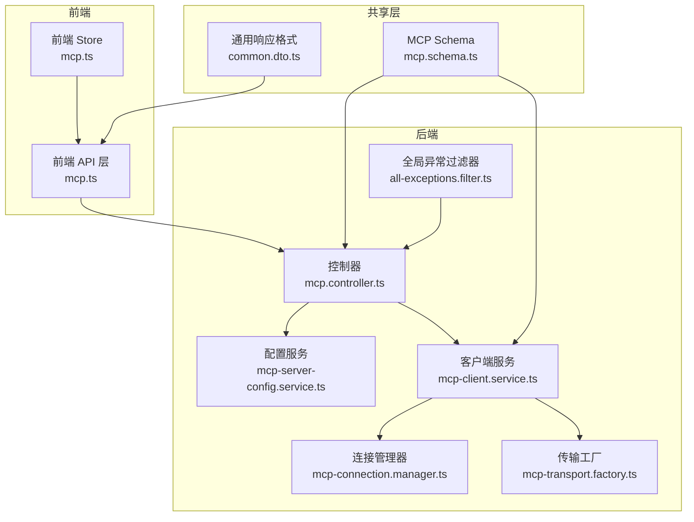
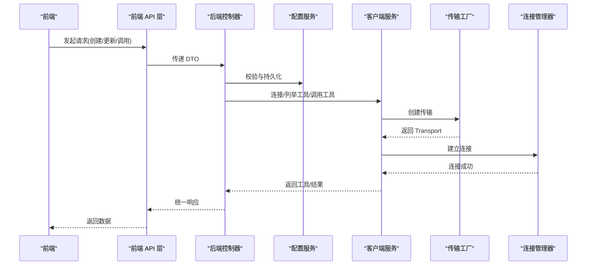
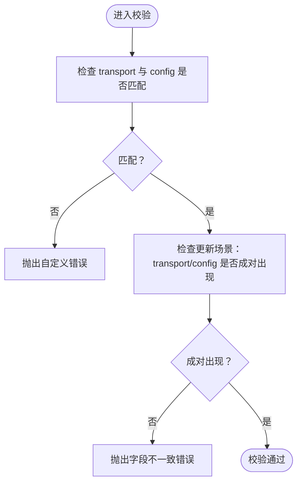
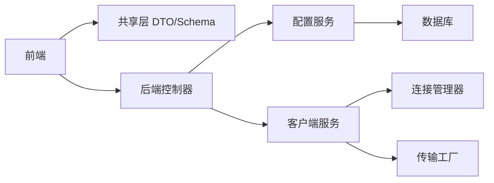

# MCP 数据传输对象

<cite>
**本文引用的文件**
- [apps/backend/src/mcp/mcp.dto.ts](file://apps/backend/src/mcp/mcp.dto.ts)
- [packages/shared/src/schemas/mcp.schema.ts](file://packages/shared/src/schemas/mcp.schema.ts)
- [apps/backend/src/mcp/mcp.controller.ts](file://apps/backend/src/mcp/mcp.controller.ts)
- [apps/backend/src/mcp/mcp-server-config.service.ts](file://apps/backend/src/mcp/mcp-server-config.service.ts)
- [apps/backend/src/mcp/mcp-client.service.ts](file://apps/backend/src/mcp/mcp-client.service.ts)
- [apps/backend/src/mcp/core/mcp-transport.factory.ts](file://apps/backend/src/mcp/core/mcp-transport.factory.ts)
- [apps/backend/src/mcp/core/mcp-connection.manager.ts](file://apps/backend/src/mcp/core/mcp-connection.manager.ts)
- [apps/frontend/src/features/mcp/api/mcp.ts](file://apps/frontend/src/features/mcp/api/mcp.ts)
- [apps/frontend/src/features/mcp/stores/mcp.ts](file://apps/frontend/src/features/mcp/stores/mcp.ts)
- [packages/shared/src/dto/common.dto.ts](file://packages/shared/src/dto/common.dto.ts)
- [apps/backend/src/common/filters/all-exceptions.filter.ts](file://apps/backend/src/common/filters/all-exceptions.filter.ts)
- [apps/backend/tests/mcp/mcp-client.service.spec.ts](file://apps/backend/tests/mcp/mcp-client.service.spec.ts)
- [apps/backend/tests/mcp/mcp-server-config.service.spec.ts](file://apps/backend/tests/mcp/mcp-server-config.service.spec.ts)
</cite>

## 目录
1. [引言](#引言)
2. [项目结构](#项目结构)
3. [核心组件](#核心组件)
4. [架构总览](#架构总览)
5. [详细组件分析](#详细组件分析)
6. [依赖关系分析](#依赖关系分析)
7. [性能考量](#性能考量)
8. [故障排查指南](#故障排查指南)
9. [结论](#结论)
10. [附录](#附录)

## 引言
本文件系统性地定义并规范了 Lumina 项目中的 MCP（Model Context Protocol）数据传输对象（DTO）。目标包括：
- 明确请求与响应的数据结构、字段语义与验证规则
- 规范 MCP 协议消息格式、序列化与反序列化机制
- 定义错误响应格式、异常处理与状态码
- 提供类型安全、运行时验证与数据转换工具
- 说明数据迁移、版本兼容与向后兼容策略
- 强调数据安全、隐私保护与敏感信息处理
- 给出使用示例、最佳实践与常见陷阱规避方法

## 项目结构
MCP DTO 的设计横跨前端、共享层与后端三层：
- 共享层定义基础 Schema 与通用响应格式，确保前后端一致
- 后端控制器与服务层负责 DTO 校验、业务处理与协议适配
- 前端通过 API 层与 Pinia Store 管理 MCP 服务器配置与运行时状态

图表来源
- [apps/frontend/src/features/mcp/api/mcp.ts:1-108](file://apps/frontend/src/features/mcp/api/mcp.ts#L1-L108)
- [apps/frontend/src/features/mcp/stores/mcp.ts:1-246](file://apps/frontend/src/features/mcp/stores/mcp.ts#L1-L246)
- [packages/shared/src/schemas/mcp.schema.ts:1-220](file://packages/shared/src/schemas/mcp.schema.ts#L1-L220)
- [packages/shared/src/dto/common.dto.ts:1-81](file://packages/shared/src/dto/common.dto.ts#L1-L81)
- [apps/backend/src/mcp/mcp.controller.ts:1-198](file://apps/backend/src/mcp/mcp.controller.ts#L1-L198)
- [apps/backend/src/mcp/mcp-server-config.service.ts:1-156](file://apps/backend/src/mcp/mcp-server-config.service.ts#L1-L156)
- [apps/backend/src/mcp/mcp-client.service.ts:1-124](file://apps/backend/src/mcp/mcp-client.service.ts#L1-L124)
- [apps/backend/src/mcp/core/mcp-connection.manager.ts:1-101](file://apps/backend/src/mcp/core/mcp-connection.manager.ts#L1-L101)
- [apps/backend/src/mcp/core/mcp-transport.factory.ts:1-220](file://apps/backend/src/mcp/core/mcp-transport.factory.ts#L1-L220)
- [apps/backend/src/common/filters/all-exceptions.filter.ts:1-137](file://apps/backend/src/common/filters/all-exceptions.filter.ts#L1-L137)

章节来源
- [apps/frontend/src/features/mcp/api/mcp.ts:1-108](file://apps/frontend/src/features/mcp/api/mcp.ts#L1-L108)
- [apps/frontend/src/features/mcp/stores/mcp.ts:1-246](file://apps/frontend/src/features/mcp/stores/mcp.ts#L1-L246)
- [packages/shared/src/schemas/mcp.schema.ts:1-220](file://packages/shared/src/schemas/mcp.schema.ts#L1-L220)
- [packages/shared/src/dto/common.dto.ts:1-81](file://packages/shared/src/dto/common.dto.ts#L1-L81)
- [apps/backend/src/mcp/mcp.controller.ts:1-198](file://apps/backend/src/mcp/mcp.controller.ts#L1-L198)
- [apps/backend/src/mcp/mcp-server-config.service.ts:1-156](file://apps/backend/src/mcp/mcp-server-config.service.ts#L1-L156)
- [apps/backend/src/mcp/mcp-client.service.ts:1-124](file://apps/backend/src/mcp/mcp-client.service.ts#L1-L124)
- [apps/backend/src/mcp/core/mcp-connection.manager.ts:1-101](file://apps/backend/src/mcp/core/mcp-connection.manager.ts#L1-L101)
- [apps/backend/src/mcp/core/mcp-transport.factory.ts:1-220](file://apps/backend/src/mcp/core/mcp-transport.factory.ts#L1-L220)
- [apps/backend/src/common/filters/all-exceptions.filter.ts:1-137](file://apps/backend/src/common/filters/all-exceptions.filter.ts#L1-L137)

## 核心组件
- 请求 DTO
  - 创建 MCP 服务器配置：CreateMcpServerDto
  - 更新 MCP 服务器配置：UpdateMcpServerDto
  - 调用工具：CallToolDto
- 响应 DTO
  - MCP 服务器响应：McpServerResponse（后端扩展时间字段为 Date）
  - 工具响应：McpToolResponse
  - 工具调用结果：ToolCallResult
- 传输配置
  - 传输类型：McpTransportType（stdio、http）
  - HTTP 配置：HttpConfig（URL、头、认证 bearer/api_key/oauth）
  - STDIO 配置：StdioConfig（命令、参数、环境变量、工作目录）

章节来源
- [apps/backend/src/mcp/mcp.dto.ts:14-59](file://apps/backend/src/mcp/mcp.dto.ts#L14-L59)
- [packages/shared/src/schemas/mcp.schema.ts:63-118](file://packages/shared/src/schemas/mcp.schema.ts#L63-L118)
- [packages/shared/src/schemas/mcp.schema.ts:146-181](file://packages/shared/src/schemas/mcp.schema.ts#L146-L181)
- [packages/shared/src/schemas/mcp.schema.ts:183-220](file://packages/shared/src/schemas/mcp.schema.ts#L183-L220)

## 架构总览
MCP DTO 在系统中的流转路径如下：
- 前端通过 API 层发起请求，携带 CreateMcpServerDto/UpdateMcpServerDto/CallToolDto
- 控制器接收请求，注入当前用户上下文，调用配置服务与客户端服务
- 客户端服务通过传输工厂创建传输，连接管理器建立连接，工具注册表缓存工具清单
- 工具调用返回 ToolCallResult，统一包装为通用响应格式

图表来源
- [apps/frontend/src/features/mcp/api/mcp.ts:16-107](file://apps/frontend/src/features/mcp/api/mcp.ts#L16-L107)
- [apps/backend/src/mcp/mcp.controller.ts:45-196](file://apps/backend/src/mcp/mcp.controller.ts#L45-L196)
- [apps/backend/src/mcp/mcp-server-config.service.ts:18-83](file://apps/backend/src/mcp/mcp-server-config.service.ts#L18-L83)
- [apps/backend/src/mcp/mcp-client.service.ts:33-108](file://apps/backend/src/mcp/mcp-client.service.ts#L33-L108)
- [apps/backend/src/mcp/core/mcp-transport.factory.ts:112-126](file://apps/backend/src/mcp/core/mcp-transport.factory.ts#L112-L126)
- [apps/backend/src/mcp/core/mcp-connection.manager.ts:23-73](file://apps/backend/src/mcp/core/mcp-connection.manager.ts#L23-L73)

## 详细组件分析

### 请求 DTO 设计与验证规则
- 创建 MCP 服务器配置（CreateMcpServerDto）
  - 字段与约束：名称必填且长度限制；描述可选；传输类型枚举；配置必须与传输类型匹配；启用标记可选
  - 关联校验：传输与配置的匹配性由 refine 校验保证
- 更新 MCP 服务器配置（UpdateMcpServerDto）
  - 字段与约束：部分字段可更新；当更新传输类型时，配置也必须同时提供；否则抛出自定义错误
- 调用工具（CallToolDto）
  - 字段与约束：工具名必填；参数为任意键值对，默认为空对象

图表来源
- [packages/shared/src/schemas/mcp.schema.ts:134-172](file://packages/shared/src/schemas/mcp.schema.ts#L134-L172)

章节来源
- [packages/shared/src/schemas/mcp.schema.ts:146-181](file://packages/shared/src/schemas/mcp.schema.ts#L146-L181)
- [apps/backend/src/mcp/mcp.dto.ts:22-27](file://apps/backend/src/mcp/mcp.dto.ts#L22-L27)

### 响应 DTO 结构与语义
- MCP 服务器响应（McpServerResponse）
  - 字段：标识、名称、描述、传输类型、配置、启用状态、用户标识、创建/更新时间
  - 后端扩展：createdAt/updatedAt 为 Date 类型，便于数据库存储与序列化
- 工具响应（McpToolResponse）
  - 字段：工具名、描述、输入模式（inputSchema）、所属服务器 ID（serverId）
- 工具调用结果（ToolCallResult）
  - 字段：内容数组（含类型、文本、数据、媒体类型等），错误标记

章节来源
- [apps/backend/src/mcp/mcp.dto.ts:37-53](file://apps/backend/src/mcp/mcp.dto.ts#L37-L53)
- [packages/shared/src/schemas/mcp.schema.ts:183-220](file://packages/shared/src/schemas/mcp.schema.ts#L183-L220)

### 传输配置与安全策略
- 传输类型
  - STDIO：通过命令、参数、环境变量、工作目录启动外部进程
  - HTTP：通过 URL、头、认证（Bearer、API Key、OAuth）访问远程 MCP 服务器
- 安全限制
  - HTTP：仅允许公共地址，禁止 localhost、.local、私网与回环地址解析
  - STDIO：生产环境需显式白名单命令，开发环境默认允许
  - 认证：支持 Bearer Token、API Key（可自定义头部名）

章节来源
- [packages/shared/src/schemas/mcp.schema.ts:63-118](file://packages/shared/src/schemas/mcp.schema.ts#L63-L118)
- [apps/backend/src/mcp/core/mcp-transport.factory.ts:91-110](file://apps/backend/src/mcp/core/mcp-transport.factory.ts#L91-L110)
- [apps/backend/src/mcp/core/mcp-transport.factory.ts:128-188](file://apps/backend/src/mcp/core/mcp-transport.factory.ts#L128-L188)
- [apps/backend/src/mcp/core/mcp-transport.factory.ts:190-218](file://apps/backend/src/mcp/core/mcp-transport.factory.ts#L190-L218)

### 协议消息格式与序列化
- 请求体
  - 创建/更新：JSON 对象，字段与 Schema 严格对应
  - 调用工具：包含工具名与参数对象
- 响应体
  - 统一包装为 ApiResponse（成功/错误两种形态）
  - 成功响应包含 data、timestamp；错误响应包含 message、errors、statusCode、timestamp
- 序列化
  - 后端使用 NestJS + Zod DTO，自动进行类型转换与校验
  - 前端通过 API 层解包响应（unwrapApiResponse）

章节来源
- [apps/frontend/src/features/mcp/api/mcp.ts:16-107](file://apps/frontend/src/features/mcp/api/mcp.ts#L16-L107)
- [packages/shared/src/dto/common.dto.ts:34-54](file://packages/shared/src/dto/common.dto.ts#L34-L54)
- [apps/backend/src/mcp/mcp.dto.ts:22-32](file://apps/backend/src/mcp/mcp.dto.ts#L22-L32)

### 错误响应格式、异常处理与状态码
- 错误响应结构
  - success=false、data=null、message、errors（字段级错误）、statusCode、timestamp
- 异常处理
  - 全局异常过滤器捕获所有未处理异常，区分 Zod 验证错误与业务异常，统一输出标准格式
  - 国际化支持：错误消息与字段名可本地化
- 状态码
  - 验证错误：400
  - 权限不足：403
  - 资源不存在：404
  - 冲突/业务错误：依据具体异常
  - 服务器内部错误：500

章节来源
- [packages/shared/src/dto/common.dto.ts:14-34](file://packages/shared/src/dto/common.dto.ts#L14-L34)
- [apps/backend/src/common/filters/all-exceptions.filter.ts:27-135](file://apps/backend/src/common/filters/all-exceptions.filter.ts#L27-L135)

### 类型安全、运行时验证与数据转换
- 类型安全
  - 使用 Zod Schema 定义 DTO，生成 TypeScript 类型，确保前后端一致
  - 后端通过 createZodDto 包装，自动注入验证中间件
- 运行时验证
  - 传输工厂在连接前进行安全校验（HTTP 主机、IP、STDIO 命令白名单）
  - 客户端服务在调用工具前检查连接状态与工具存在性
- 数据转换
  - 响应统一解包与判别，错误抛出便于前端处理
  - 后端将数据库记录转换为 McpServerResponse（Date 类型）

章节来源
- [apps/backend/src/mcp/mcp.dto.ts:22-32](file://apps/backend/src/mcp/mcp.dto.ts#L22-L32)
- [apps/backend/src/mcp/core/mcp-transport.factory.ts:112-126](file://apps/backend/src/mcp/core/mcp-transport.factory.ts#L112-L126)
- [apps/backend/src/mcp/mcp-client.service.ts:75-108](file://apps/backend/src/mcp/mcp-client.service.ts#L75-L108)
- [packages/shared/src/dto/common.dto.ts:46-54](file://packages/shared/src/dto/common.dto.ts#L46-L54)
- [apps/backend/src/mcp/mcp-server-config.service.ts:142-154](file://apps/backend/src/mcp/mcp-server-config.service.ts#L142-L154)

### 数据迁移、版本兼容与向后兼容策略
- 向后兼容
  - McpServerResponse 中的 createdAt/updatedAt 在后端扩展为 Date 类型，保持 JSON 序列化兼容
  - McpToolResponse/ToolCallResult 采用开放字段设计，便于未来扩展
- 版本策略
  - 通过 Schema 的 refine 与 superRefine 保证字段一致性与运行时约束
  - 传输配置与工具清单通过连接管理器与工具注册表动态维护，降低耦合
- 迁移建议
  - 新增字段优先使用可选属性，并在服务层提供默认值
  - 旧字段废弃时保留读取，新增映射逻辑，逐步清理

章节来源
- [apps/backend/src/mcp/mcp.dto.ts:37-43](file://apps/backend/src/mcp/mcp.dto.ts#L37-L43)
- [packages/shared/src/schemas/mcp.schema.ts:156-172](file://packages/shared/src/schemas/mcp.schema.ts#L156-L172)

### 数据安全、隐私保护与敏感信息处理
- 传输安全
  - HTTP 仅允许 https，禁止私网与回环主机
  - 支持 Bearer Token 与 API Key 认证，避免明文密码暴露
- 进程安全
  - STDIO 命令白名单与参数校验，防止注入
  - 仅允许有限环境变量透传
- 敏感信息
  - 认证凭据通过 headers 注入，不在 URL 中携带
  - 前端 Store 不存储敏感信息，仅保存连接状态与错误信息

章节来源
- [packages/shared/src/schemas/mcp.schema.ts:101-116](file://packages/shared/src/schemas/mcp.schema.ts#L101-L116)
- [apps/backend/src/mcp/core/mcp-transport.factory.ts:190-218](file://apps/backend/src/mcp/core/mcp-transport.factory.ts#L190-L218)
- [apps/backend/src/mcp/core/mcp-transport.factory.ts:128-188](file://apps/backend/src/mcp/core/mcp-transport.factory.ts#L128-L188)
- [apps/frontend/src/features/mcp/stores/mcp.ts:15-26](file://apps/frontend/src/features/mcp/stores/mcp.ts#L15-L26)

### 使用示例与最佳实践
- 创建 MCP 服务器
  - 前端：构造 CreateMcpServerDto 并调用 createServer
  - 后端：控制器接收 DTO，服务层持久化，客户端服务预热工具
- 更新 MCP 服务器
  - 若传输类型变更，需同时提供 config；否则拒绝
  - 若运行时配置变化，先断开再重连
- 调用工具
  - 确保已连接；工具名需存在于工具清单；参数为 record<string, unknown>
- 最佳实践
  - 优先使用 HTTP 传输并启用认证
  - 为工具调用设置合理超时
  - 对外暴露的 API 始终使用 JWT 认证
  - 错误处理统一走全局过滤器，避免泄漏内部细节

章节来源
- [apps/frontend/src/features/mcp/api/mcp.ts:36-84](file://apps/frontend/src/features/mcp/api/mcp.ts#L36-L84)
- [apps/backend/src/mcp/mcp.controller.ts:45-101](file://apps/backend/src/mcp/mcp.controller.ts#L45-L101)
- [apps/backend/src/mcp/mcp-client.service.ts:75-108](file://apps/backend/src/mcp/mcp-client.service.ts#L75-L108)

## 依赖关系分析
- 前端依赖共享层的 DTO 类型与通用响应格式
- 后端控制器依赖服务层与传输层，服务层依赖数据库与工具注册表
- 传输工厂与连接管理器构成 MCP 协议适配层

图表来源
- [apps/frontend/src/features/mcp/api/mcp.ts:1-11](file://apps/frontend/src/features/mcp/api/mcp.ts#L1-L11)
- [apps/backend/src/mcp/mcp.controller.ts:19-40](file://apps/backend/src/mcp/mcp.controller.ts#L19-L40)
- [apps/backend/src/mcp/mcp-server-config.service.ts:13](file://apps/backend/src/mcp/mcp-server-config.service.ts#L13)
- [apps/backend/src/mcp/mcp-client.service.ts:21-28](file://apps/backend/src/mcp/mcp-client.service.ts#L21-L28)
- [apps/backend/src/mcp/core/mcp-connection.manager.ts:15](file://apps/backend/src/mcp/core/mcp-connection.manager.ts#L15)
- [apps/backend/src/mcp/core/mcp-transport.factory.ts:11-11](file://apps/backend/src/mcp/core/mcp-transport.factory.ts#L11-L11)

章节来源
- [apps/frontend/src/features/mcp/api/mcp.ts:1-11](file://apps/frontend/src/features/mcp/api/mcp.ts#L1-L11)
- [apps/backend/src/mcp/mcp.controller.ts:19-40](file://apps/backend/src/mcp/mcp.controller.ts#L19-L40)
- [apps/backend/src/mcp/mcp-server-config.service.ts:13](file://apps/backend/src/mcp/mcp-server-config.service.ts#L13)
- [apps/backend/src/mcp/mcp-client.service.ts:21-28](file://apps/backend/src/mcp/mcp-client.service.ts#L21-L28)
- [apps/backend/src/mcp/core/mcp-connection.manager.ts:15](file://apps/backend/src/mcp/core/mcp-connection.manager.ts#L15)
- [apps/backend/src/mcp/core/mcp-transport.factory.ts:11-11](file://apps/backend/src/mcp/core/mcp-transport.factory.ts#L11-L11)

## 性能考量
- 连接复用：连接管理器维护活跃连接，避免频繁重建
- 延迟加载：工具清单按需刷新，减少不必要的网络请求
- 超时设置：HTTP 连接、工具调用设置合理超时，防止阻塞
- 日志与监控：传输层与连接层记录关键事件，便于定位性能瓶颈

## 故障排查指南
- 常见问题
  - 传输与配置不匹配：检查 CreateMcpServerDto/UpdateMcpServerDto 的 transport 与 config
  - HTTP 地址被阻止：确认 URL 非私网/回环/localhost
  - STDIO 命令未白名单：检查 MCP_STDIO_ALLOWED_COMMANDS 或 NODE_ENV
  - 工具不存在：确认已连接且工具名正确
- 排查步骤
  - 查看全局异常过滤器输出的错误详情与字段映射
  - 检查前端 Store 的连接状态与错误信息
  - 核对传输工厂的安全校验日志

章节来源
- [apps/backend/src/common/filters/all-exceptions.filter.ts:52-84](file://apps/backend/src/common/filters/all-exceptions.filter.ts#L52-L84)
- [apps/frontend/src/features/mcp/stores/mcp.ts:175-202](file://apps/frontend/src/features/mcp/stores/mcp.ts#L175-L202)
- [apps/backend/src/mcp/core/mcp-transport.factory.ts:91-110](file://apps/backend/src/mcp/core/mcp-transport.factory.ts#L91-L110)

## 结论
本文档系统化定义了 MCP DTO 的设计目的、数据结构、验证规则、协议适配与安全策略，并提供了前后端协作的最佳实践。通过共享 Schema 与统一响应格式，确保了类型安全与运行时验证的一致性；通过严格的传输安全与连接管理，保障了系统的稳定性与安全性。

## 附录
- 测试参考
  - 客户端服务测试覆盖连接、工具列举、工具调用与断开流程
  - 配置服务测试覆盖创建、查询、删除与所有权校验

章节来源
- [apps/backend/tests/mcp/mcp-client.service.spec.ts:72-131](file://apps/backend/tests/mcp/mcp-client.service.spec.ts#L72-L131)
- [apps/backend/tests/mcp/mcp-server-config.service.spec.ts:40-114](file://apps/backend/tests/mcp/mcp-server-config.service.spec.ts#L40-L114)