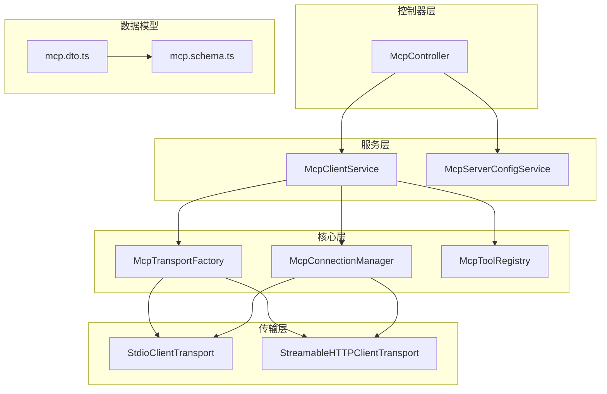
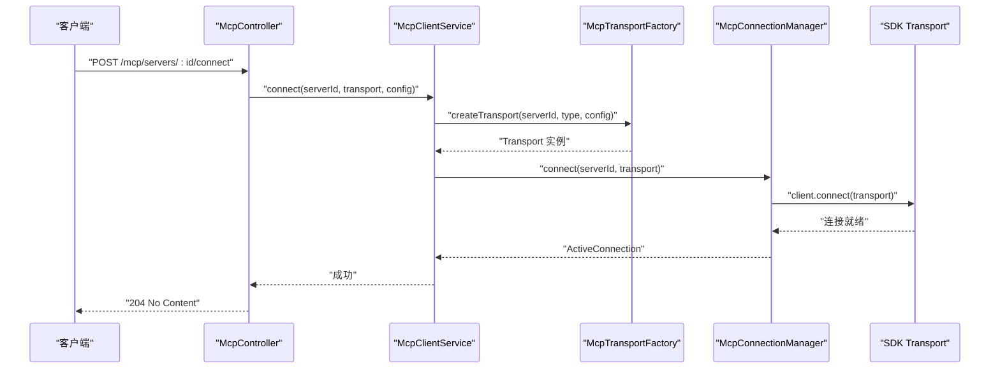
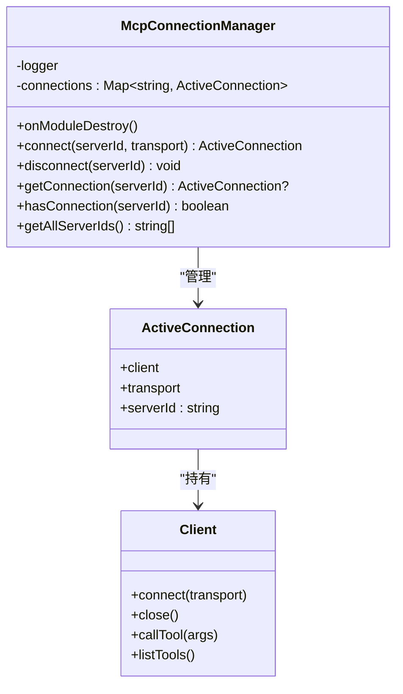
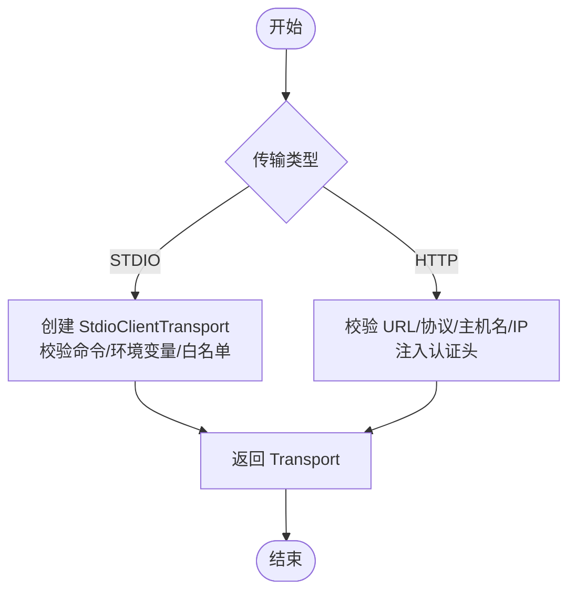
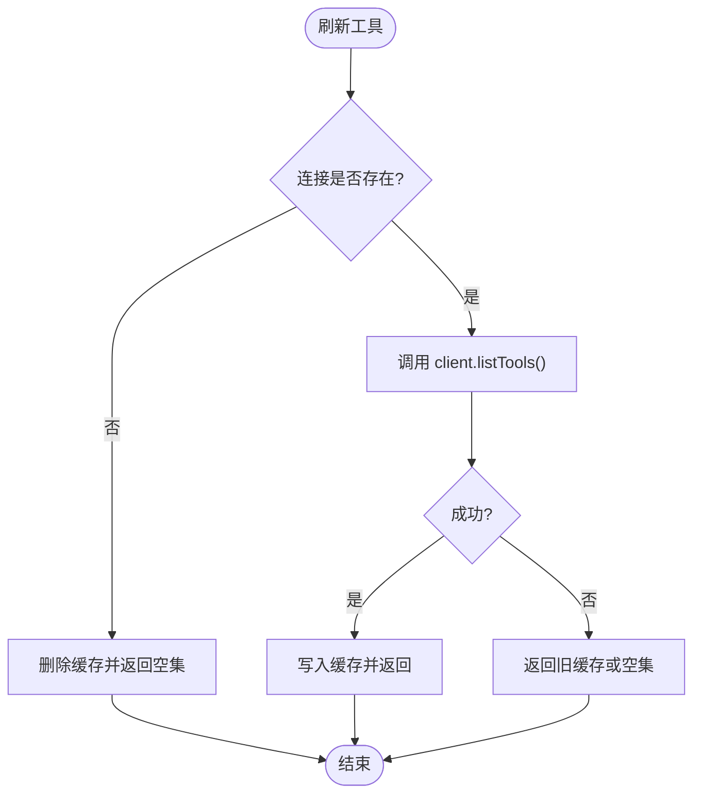
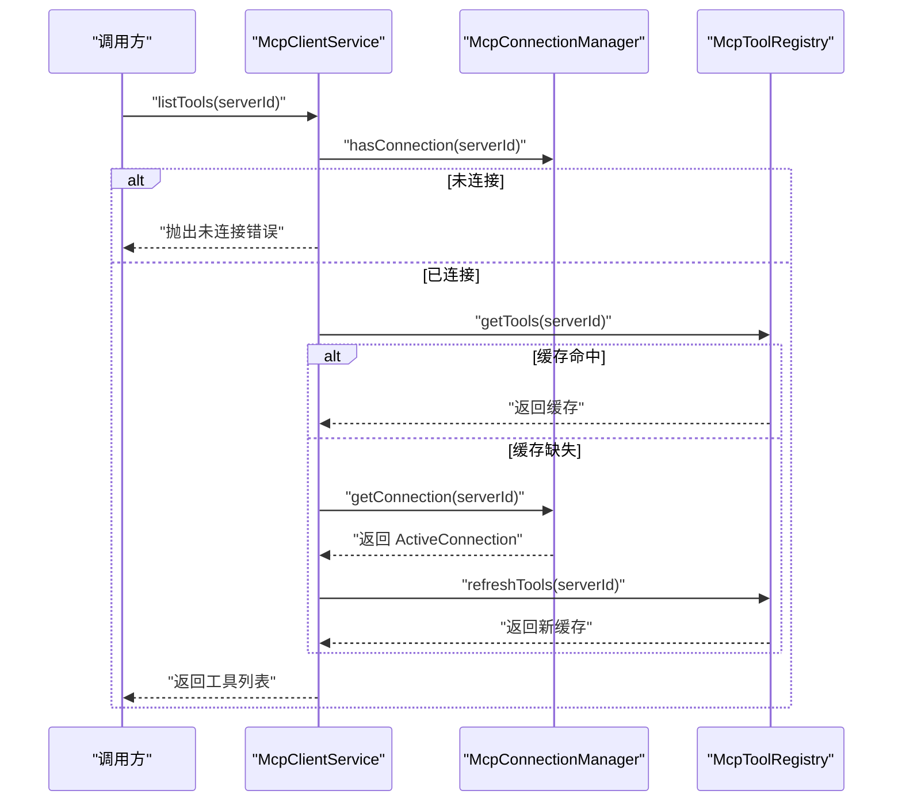
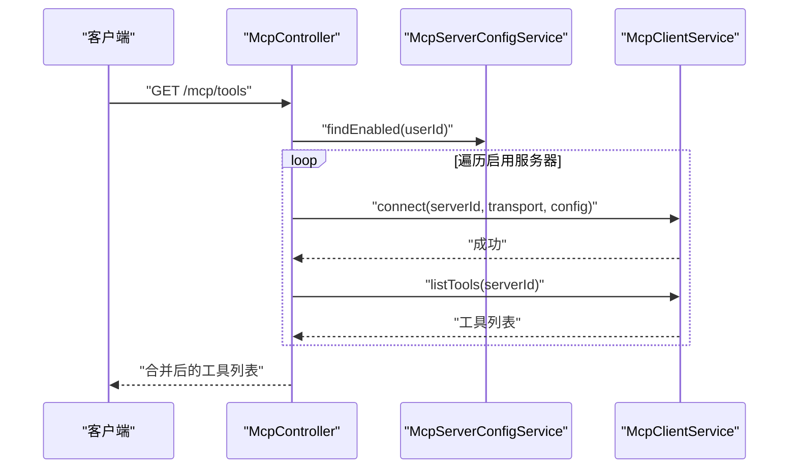
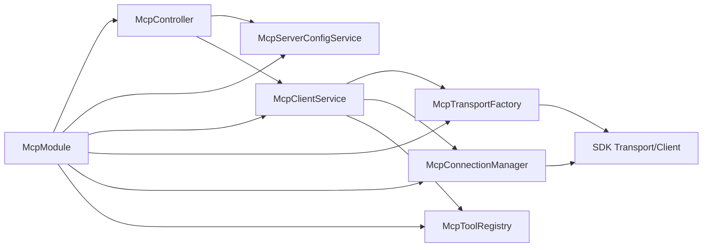

# MCP 连接管理

<cite>
**本文引用的文件**
- [mcp-connection.manager.ts](file://apps/backend/src/mcp/core/mcp-connection.manager.ts)
- [mcp-transport.factory.ts](file://apps/backend/src/mcp/core/mcp-transport.factory.ts)
- [mcp-tool.registry.ts](file://apps/backend/src/mcp/core/mcp-tool.registry.ts)
- [mcp-client.service.ts](file://apps/backend/src/mcp/mcp-client.service.ts)
- [mcp-server-config.service.ts](file://apps/backend/src/mcp/mcp-server-config.service.ts)
- [mcp.dto.ts](file://apps/backend/src/mcp/mcp.dto.ts)
- [mcp.controller.ts](file://apps/backend/src/mcp/mcp.controller.ts)
- [mcp.module.ts](file://apps/backend/src/mcp/mcp.module.ts)
- [mcp.schema.ts](file://packages/shared/src/schemas/mcp.schema.ts)
- [mcp-client.service.spec.ts](file://apps/backend/tests/mcp/mcp-client.service.spec.ts)
- [mcp-transport.factory.spec.ts](file://apps/backend/tests/mcp/mcp-transport.factory.spec.ts)
</cite>

## 目录
1. [简介](#简介)
2. [项目结构](#项目结构)
3. [核心组件](#核心组件)
4. [架构总览](#架构总览)
5. [详细组件分析](#详细组件分析)
6. [依赖关系分析](#依赖关系分析)
7. [性能考量](#性能考量)
8. [故障排除指南](#故障排除指南)
9. [结论](#结论)
10. [附录](#附录)

## 简介
本文件系统性阐述 MCP（Model Context Protocol）连接管理子系统的设计与实现，重点围绕 McpConnectionManager 类展开，涵盖连接建立流程、连接状态管理、连接池机制、ActiveConnection 接口、传输层抽象、安全策略、错误处理与重连策略、生命周期管理、监控与日志、以及针对不同传输协议（STDIO、HTTP）的适配与最佳实践。文档同时提供可视化图示与实操建议，帮助开发者在生产环境中稳定、安全地集成外部 MCP 服务器。

## 项目结构
MCP 子系统位于后端应用的 mcp 目录下，采用按职责分层的模块化组织：
- 控制器层：McpController 提供 REST API，负责用户请求接入与业务编排
- 服务层：McpClientService 作为门面，协调传输工厂与连接管理器；McpServerConfigService 管理用户配置
- 核心层：McpTransportFactory 负责根据配置创建传输实例；McpConnectionManager 维护连接生命周期；McpToolRegistry 缓存工具清单
- 数据传输层：mcp.dto.ts 与 shared 包中的 mcp.schema.ts 定义传输数据结构与校验规则

图表来源
- [mcp.controller.ts:1-198](file://apps/backend/src/mcp/mcp.controller.ts#L1-198)
- [mcp-client.service.ts:1-124](file://apps/backend/src/mcp/mcp-client.service.ts#L1-124)
- [mcp-server-config.service.ts:1-156](file://apps/backend/src/mcp/mcp-server-config.service.ts#L1-156)
- [mcp-transport.factory.ts:1-220](file://apps/backend/src/mcp/core/mcp-transport.factory.ts#L1-220)
- [mcp-connection.manager.ts:1-101](file://apps/backend/src/mcp/core/mcp-connection.manager.ts#L1-101)
- [mcp-tool.registry.ts:1-48](file://apps/backend/src/mcp/core/mcp-tool.registry.ts#L1-48)
- [mcp.dto.ts:1-59](file://apps/backend/src/mcp/mcp.dto.ts#L1-59)
- [mcp.schema.ts:1-220](file://packages/shared/src/schemas/mcp.schema.ts#L1-220)

章节来源
- [mcp.module.ts:1-25](file://apps/backend/src/mcp/mcp.module.ts#L1-25)
- [mcp.controller.ts:1-198](file://apps/backend/src/mcp/mcp.controller.ts#L1-198)
- [mcp-client.service.ts:1-124](file://apps/backend/src/mcp/mcp-client.service.ts#L1-124)
- [mcp-server-config.service.ts:1-156](file://apps/backend/src/mcp/mcp-server-config.service.ts#L1-156)
- [mcp-transport.factory.ts:1-220](file://apps/backend/src/mcp/core/mcp-transport.factory.ts#L1-220)
- [mcp-connection.manager.ts:1-101](file://apps/backend/src/mcp/core/mcp-connection.manager.ts#L1-101)
- [mcp-tool.registry.ts:1-48](file://apps/backend/src/mcp/core/mcp-tool.registry.ts#L1-48)
- [mcp.dto.ts:1-59](file://apps/backend/src/mcp/mcp.dto.ts#L1-59)
- [mcp.schema.ts:1-220](file://packages/shared/src/schemas/mcp.schema.ts#L1-220)

## 核心组件
- McpConnectionManager：维护 serverId 到 ActiveConnection 的映射，负责连接建立、断开、状态查询与模块销毁时的资源回收
- McpTransportFactory：根据配置创建传输实例，支持 STDIO 与 HTTP 两类传输，并内置安全检查与环境变量白名单
- McpToolRegistry：缓存每个服务器的工具清单，提供刷新与清理能力
- McpClientService：门面服务，串联传输工厂与连接管理器，提供连接、断开、列出工具、调用工具等高层接口
- McpServerConfigService：持久化管理用户 MCP 服务器配置，提供 CRUD 与启用筛选
- DTO 与 Schema：定义传输参数、工具响应与调用结果的数据结构与校验规则

章节来源
- [mcp-connection.manager.ts:6-101](file://apps/backend/src/mcp/core/mcp-connection.manager.ts#L6-L101)
- [mcp-transport.factory.ts:112-218](file://apps/backend/src/mcp/core/mcp-transport.factory.ts#L112-L218)
- [mcp-tool.registry.ts:12-47](file://apps/backend/src/mcp/core/mcp-tool.registry.ts#L12-L47)
- [mcp-client.service.ts:17-123](file://apps/backend/src/mcp/mcp-client.service.ts#L17-L123)
- [mcp-server-config.service.ts:15-154](file://apps/backend/src/mcp/mcp-server-config.service.ts#L15-L154)
- [mcp.dto.ts:14-59](file://apps/backend/src/mcp/mcp.dto.ts#L14-L59)
- [mcp.schema.ts:63-220](file://packages/shared/src/schemas/mcp.schema.ts#L63-L220)

## 架构总览
MCP 子系统遵循“控制器-服务-核心-传输”的分层架构。控制器接收请求，服务层进行业务编排，核心层负责连接与传输，传输层对接 SDK 的具体实现。该设计确保了：
- 解耦：传输类型与连接管理相互独立
- 可扩展：新增传输类型只需扩展工厂与控制器
- 安全：传输工厂内置 DNS 校验、私有地址拦截与环境变量白名单
- 可观测：连接管理器与传输工厂均输出结构化日志

图表来源
- [mcp.controller.ts:134-140](file://apps/backend/src/mcp/mcp.controller.ts#L134-L140)
- [mcp-client.service.ts:33-47](file://apps/backend/src/mcp/mcp-client.service.ts#L33-L47)
- [mcp-transport.factory.ts:112-126](file://apps/backend/src/mcp/core/mcp-transport.factory.ts#L112-L126)
- [mcp-connection.manager.ts:23-73](file://apps/backend/src/mcp/core/mcp-connection.manager.ts#L23-L73)

## 详细组件分析

### McpConnectionManager 设计与实现
- 角色定位：连接生命周期管理器，持有 serverId 到 ActiveConnection 的映射
- ActiveConnection 接口：封装已连接的 Client、Transport 与 serverId，便于上层直接使用
- 连接建立流程：
  - 若已存在同 serverId 的连接则先断开再重建
  - 使用 SDK Client 初始化并传入名称、版本与请求超时时间
  - 对 STDIO 传输绑定 stderr、onclose、onerror 回调，记录日志并清理连接
  - 等待 client.connect 完成后写入连接映射并返回
- 断开流程：关闭 Client 并从映射中移除，异常时同样清理映射
- 查询接口：getConnection、hasConnection、getAllServerIds
- 模块销毁：OnModuleDestroy 中遍历断开所有连接，保证优雅退出

图表来源
- [mcp-connection.manager.ts:6-101](file://apps/backend/src/mcp/core/mcp-connection.manager.ts#L6-L101)

章节来源
- [mcp-connection.manager.ts:13-101](file://apps/backend/src/mcp/core/mcp-connection.manager.ts#L13-L101)

### McpTransportFactory：传输工厂与安全策略
- 支持的传输类型：STDIO 与 HTTP
- STDIO 安全与限制：
  - 环境变量白名单：仅允许 PATH、HOME、USER、SHELL、TMPDIR、TEMP、TMP、LANG、LC_ALL、NODE_*、HTTP_PROXY、HTTPS_PROXY、NO_PROXY 等关键键
  - 生产环境默认禁用 STDIO，除非显式开启并配置允许命令列表
  - 命令名校验：禁止包含空格，需拆分为 command 与 args
  - 包名纠错：对特定包名进行自动修正
- HTTP 安全与限制：
  - 协议限制：仅允许 http/https
  - 主机名与 IP 白名单：阻止 localhost、.localhost、.local 与私有/环回地址（IPv4/IPv6）
  - DNS 解析校验：解析失败或解析到私有地址将被拒绝
  - 认证头注入：支持 bearer/oauth 与 api_key 两种方式
- 传输创建：
  - STDIO：返回 StdioClientTransport 实例
  - HTTP：动态导入 StreamableHTTPClientTransport 并返回实例

图表来源
- [mcp-transport.factory.ts:112-218](file://apps/backend/src/mcp/core/mcp-transport.factory.ts#L112-L218)

章节来源
- [mcp-transport.factory.ts:11-218](file://apps/backend/src/mcp/core/mcp-transport.factory.ts#L11-L218)
- [mcp.schema.ts:63-118](file://packages/shared/src/schemas/mcp.schema.ts#L63-L118)

### McpToolRegistry：工具缓存与刷新
- 缓存策略：以 serverId 为键缓存工具清单，避免重复拉取
- 刷新逻辑：若连接不存在则清理缓存并返回空集；成功后写入缓存并记录日志
- 清理接口：断开连接时清理对应缓存

图表来源
- [mcp-tool.registry.ts:20-42](file://apps/backend/src/mcp/core/mcp-tool.registry.ts#L20-L42)

章节来源
- [mcp-tool.registry.ts:1-48](file://apps/backend/src/mcp/core/mcp-tool.registry.ts#L1-L48)

### McpClientService：门面服务与调用编排
- 连接：创建传输 -> 连接管理器建立连接 -> 预热工具缓存
- 断开：清理工具缓存 -> 连接管理器断开
- 工具列表：校验连接 -> 读取或刷新工具缓存
- 工具调用：校验连接与工具存在 -> 调用 SDK -> 返回标准化结果
- 查询接口：isConnected、getActiveConnections

图表来源
- [mcp-client.service.ts:60-65](file://apps/backend/src/mcp/mcp-client.service.ts#L60-L65)
- [mcp-tool.registry.ts:12-18](file://apps/backend/src/mcp/core/mcp-tool.registry.ts#L12-L18)
- [mcp-tool.registry.ts:20-42](file://apps/backend/src/mcp/core/mcp-tool.registry.ts#L20-L42)

章节来源
- [mcp-client.service.ts:17-123](file://apps/backend/src/mcp/mcp-client.service.ts#L17-L123)

### 控制器与配置服务：REST 编排与持久化
- 控制器提供：
  - 创建/更新/删除 MCP 服务器配置
  - 连接/断开指定服务器
  - 获取工具列表与调用工具
  - 自动发现启用服务器的工具（懒连接）
- 配置服务提供：
  - 用户维度的 CRUD 与权限校验
  - 启用服务器筛选，用于工具自动发现

图表来源
- [mcp.controller.ts:108-129](file://apps/backend/src/mcp/mcp.controller.ts#L108-L129)
- [mcp-server-config.service.ts:102-109](file://apps/backend/src/mcp/mcp-server-config.service.ts#L102-L109)

章节来源
- [mcp.controller.ts:1-198](file://apps/backend/src/mcp/mcp.controller.ts#L1-198)
- [mcp-server-config.service.ts:1-156](file://apps/backend/src/mcp/mcp-server-config.service.ts#L1-L156)

## 依赖关系分析
- 模块导出：McpModule 导出配置服务与客户端服务，供其他模块使用
- 组件耦合：
  - McpClientService 依赖 McpTransportFactory、McpConnectionManager、McpToolRegistry
  - McpController 依赖 McpServerConfigService 与 McpClientService
  - McpConnectionManager 依赖 SDK Transport 与 Client
  - McpTransportFactory 依赖 SDK Transport 实现与 Node 内置模块
- 外部依赖：@modelcontextprotocol/sdk 的 Client、StdioClientTransport、StreamableHTTPClientTransport

图表来源
- [mcp.module.ts:13-22](file://apps/backend/src/mcp/mcp.module.ts#L13-L22)
- [mcp-client.service.ts:21-28](file://apps/backend/src/mcp/mcp-client.service.ts#L21-L28)
- [mcp-controller.ts:37-40](file://apps/backend/src/mcp/mcp.controller.ts#L37-L40)

章节来源
- [mcp.module.ts:1-25](file://apps/backend/src/mcp/mcp.module.ts#L1-L25)
- [mcp-client.service.ts:1-124](file://apps/backend/src/mcp/mcp-client.service.ts#L1-L124)
- [mcp.controller.ts:1-198](file://apps/backend/src/mcp/mcp.controller.ts#L1-L198)

## 性能考量
- 连接复用：McpConnectionManager 以 serverId 为键复用连接，避免重复握手
- 工具缓存：McpToolRegistry 缓存工具清单，减少频繁查询
- 懒连接：控制器在工具发现与调用前才连接，降低启动成本
- 请求超时：SDK Client 初始化时设置较长的请求超时，适合长耗时工具调用
- 传输选择：
  - STDIO：本地进程通信，低延迟但受限于环境变量与命令白名单
  - HTTP：可跨网络，需关注 DNS 解析与网络延迟，建议使用 HTTPS

章节来源
- [mcp-connection.manager.ts:29-39](file://apps/backend/src/mcp/core/mcp-connection.manager.ts#L29-L39)
- [mcp-tool.registry.ts:8-18](file://apps/backend/src/mcp/core/mcp-tool.registry.ts#L8-L18)
- [mcp.controller.ts:114-126](file://apps/backend/src/mcp/mcp.controller.ts#L114-L126)

## 故障排除指南
- 连接失败
  - 检查传输类型与配置是否匹配
  - 查看连接管理器日志，确认是否触发断开或错误回调
  - 确认 STDIO 命令与参数正确，且不在生产环境被禁用
- 工具不可用
  - 确认连接状态，必要时重新连接
  - 清理工具缓存后重试刷新
- HTTP 连接被拒
  - 检查 URL 协议、主机名与解析结果是否为私有/环回地址
  - 确认认证头是否正确注入
- 日志与监控
  - 关注连接管理器与传输工厂的日志级别，区分 warn/error
  - 在控制器层记录懒连接与工具发现过程
- 重连与恢复
  - 当 STDIO 进程退出或连接关闭时，连接管理器会清理映射
  - 上层可在控制器层捕获异常后触发重试或提示用户重新连接

章节来源
- [mcp-connection.manager.ts:44-58](file://apps/backend/src/mcp/core/mcp-connection.manager.ts#L44-L58)
- [mcp-transport.factory.ts:91-110](file://apps/backend/src/mcp/core/mcp-transport.factory.ts#L91-L110)
- [mcp-client.service.ts:74-108](file://apps/backend/src/mcp/mcp-client.service.ts#L74-L108)
- [mcp.controller.ts:114-126](file://apps/backend/src/mcp/mcp.controller.ts#L114-L126)

## 结论
MCP 连接管理系统通过清晰的分层设计与严格的传输安全策略，实现了对多种传输协议的统一接入与高效管理。McpConnectionManager 提供稳定的连接生命周期控制，McpTransportFactory 强化了安全边界，McpToolRegistry 优化了工具发现性能。结合控制器层的懒连接与自动发现机制，系统在可用性、安全性与可观测性方面达到了良好平衡。建议在生产环境中严格配置 STDIO 白名单与 HTTP 安全策略，并配合完善的日志与告警体系进行持续监控。

## 附录

### ActiveConnection 接口与用途
- 字段：client（SDK Client）、transport（传输实例）、serverId（服务器标识）
- 用途：作为连接管理器的返回值，向上层提供可直接使用的工具调用入口

章节来源
- [mcp-connection.manager.ts:6-10](file://apps/backend/src/mcp/core/mcp-connection.manager.ts#L6-L10)

### 连接超时与错误恢复
- 超时：SDK Client 初始化时设置了较长的请求超时，适用于长耗时工具
- 错误恢复：STDIO 传输错误与关闭事件会触发连接清理；上层可在控制器层进行重试或提示用户重新连接

章节来源
- [mcp-connection.manager.ts:29-39](file://apps/backend/src/mcp/core/mcp-connection.manager.ts#L29-L39)
- [mcp-connection.manager.ts:50-58](file://apps/backend/src/mcp/core/mcp-connection.manager.ts#L50-L58)

### 连接池机制
- 现状：当前实现为按 serverId 的一对一连接映射，未实现多路复用或连接池复用
- 建议：如需提升吞吐，可在连接管理器内引入连接池与并发控制，但需注意工具调用的幂等性与状态一致性

章节来源
- [mcp-connection.manager.ts:15-15](file://apps/backend/src/mcp/core/mcp-connection.manager.ts#L15-L15)

### 不同传输协议的处理要点
- STDIO
  - 环境变量白名单与命令白名单
  - 私有地址与环回地址拦截
  - 包名纠错与工作目录设置
- HTTP
  - 协议与主机名/IP 安全校验
  - 认证头注入（Bearer/OAuth/API Key）

章节来源
- [mcp-transport.factory.ts:128-188](file://apps/backend/src/mcp/core/mcp-transport.factory.ts#L128-L188)
- [mcp-transport.factory.ts:190-218](file://apps/backend/src/mcp/core/mcp-transport.factory.ts#L190-L218)

### 最佳实践
- 配置管理
  - 使用 McpServerConfigService 进行用户维度的配置管理
  - 启用服务器优先用于工具自动发现
- 连接策略
  - 懒连接：仅在需要时建立连接
  - 工具缓存：利用 McpToolRegistry 减少重复查询
- 安全策略
  - 生产环境禁用 STDIO 或严格配置白名单
  - HTTP 仅允许公网地址与 HTTPS
- 监控与日志
  - 记录连接建立/断开、工具调用、传输错误等关键事件
  - 在控制器层增加重试与降级策略

章节来源
- [mcp-server-config.service.ts:102-109](file://apps/backend/src/mcp/mcp-server-config.service.ts#L102-L109)
- [mcp-client.service.ts:60-108](file://apps/backend/src/mcp/mcp-client.service.ts#L60-L108)
- [mcp-transport.factory.ts:67-89](file://apps/backend/src/mcp/core/mcp-transport.factory.ts#L67-L89)
- [mcp-transport.factory.ts:91-110](file://apps/backend/src/mcp/core/mcp-transport.factory.ts#L91-L110)