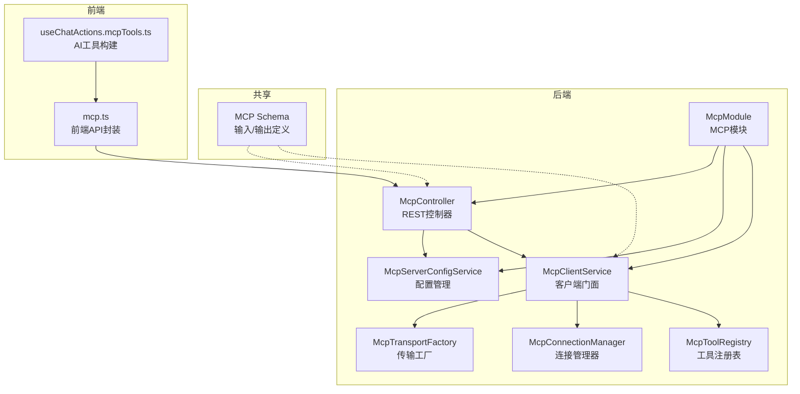
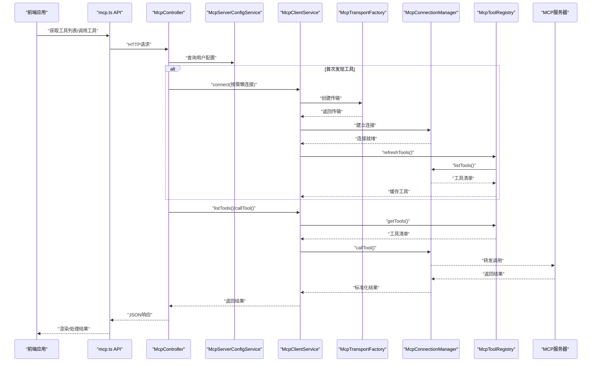
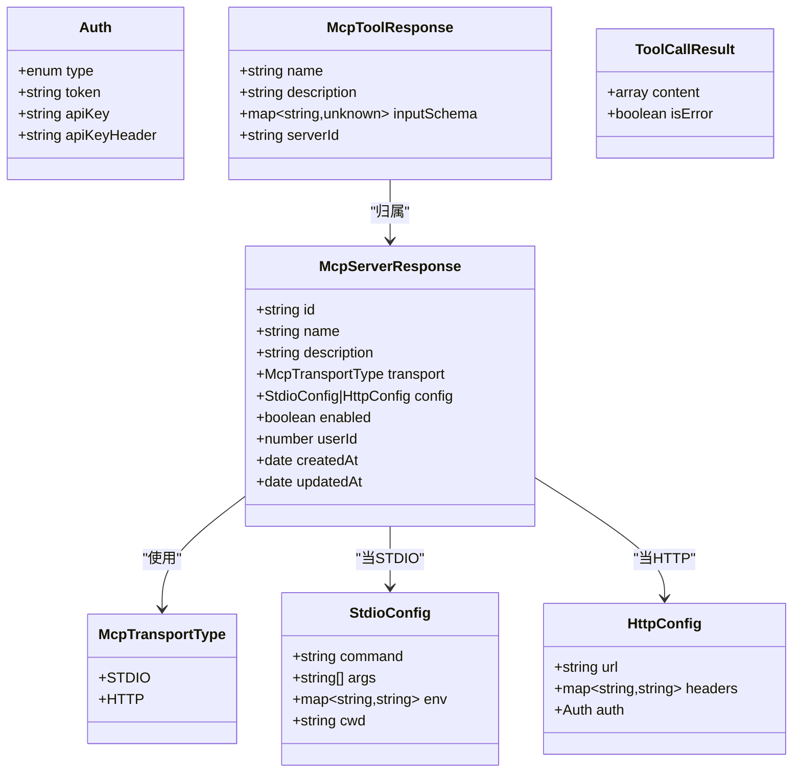
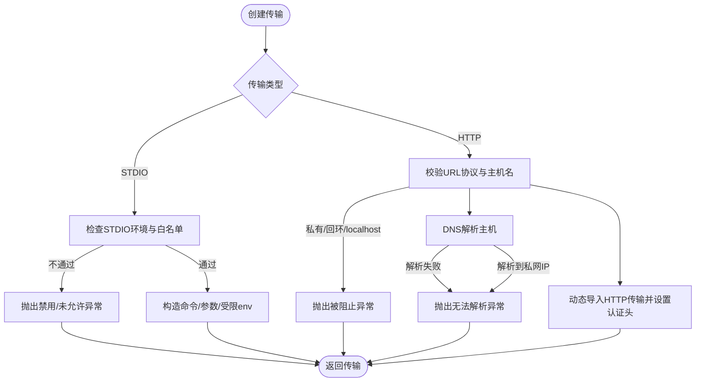
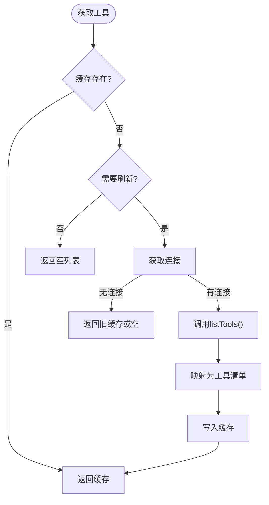
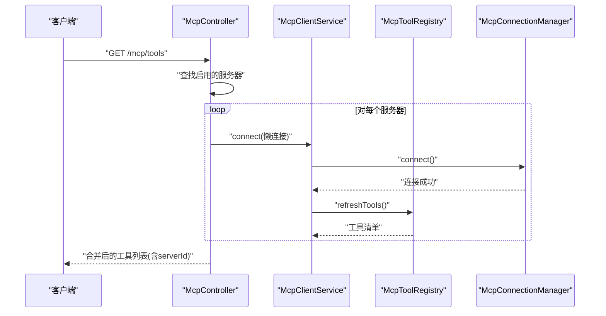
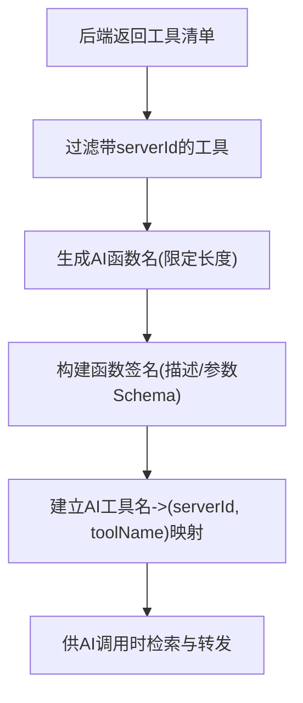
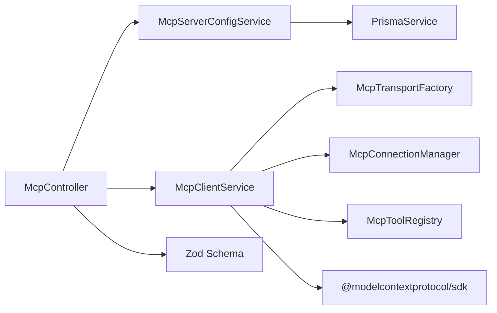

# MCP工具开发

<cite>
**本文档引用的文件**
- [apps/backend/src/mcp/mcp-client.service.ts](file://apps/backend/src/mcp/mcp-client.service.ts)
- [apps/backend/src/mcp/core/mcp-connection.manager.ts](file://apps/backend/src/mcp/core/mcp-connection.manager.ts)
- [apps/backend/src/mcp/core/mcp-tool.registry.ts](file://apps/backend/src/mcp/core/mcp-tool.registry.ts)
- [apps/backend/src/mcp/core/mcp-transport.factory.ts](file://apps/backend/src/mcp/core/mcp-transport.factory.ts)
- [apps/backend/src/mcp/mcp.dto.ts](file://apps/backend/src/mcp/mcp.dto.ts)
- [apps/backend/src/mcp/mcp.controller.ts](file://apps/backend/src/mcp/mcp.controller.ts)
- [apps/backend/src/mcp/mcp-server-config.service.ts](file://apps/backend/src/mcp/mcp-server-config.service.ts)
- [packages/shared/src/schemas/mcp.schema.ts](file://packages/shared/src/schemas/mcp.schema.ts)
- [apps/frontend/src/features/mcp/api/mcp.ts](file://apps/frontend/src/features/mcp/api/mcp.ts)
- [apps/frontend/src/features/ai/composables/useChatActions.mcpTools.ts](file://apps/frontend/src/features/ai/composables/useChatActions.mcpTools.ts)
- [apps/backend/src/mcp/mcp.module.ts](file://apps/backend/src/mcp/mcp.module.ts)
- [apps/backend/src/common/throttling/throttling.constants.ts](file://apps/backend/src/common/throttling/throttling.constants.ts)
- [apps/backend/tests/mcp/mcp-client.service.spec.ts](file://apps/backend/tests/mcp/mcp-client.service.spec.ts)
- [apps/backend/tests/mcp/mcp-transport.factory.spec.ts](file://apps/backend/tests/mcp/mcp-transport.factory.spec.ts)
</cite>

## 目录
1. [简介](#简介)
2. [项目结构](#项目结构)
3. [核心组件](#核心组件)
4. [架构总览](#架构总览)
5. [详细组件分析](#详细组件分析)
6. [依赖关系分析](#依赖关系分析)
7. [性能考量](#性能考量)
8. [故障排查指南](#故障排查指南)
9. [结论](#结论)
10. [附录](#附录)

## 简介
本指南面向需要在系统中集成和开发MCP（Model Context Protocol）工具的开发者。文档围绕以下目标展开：
- 解释MCP工具注册机制、工具发现流程与缓存管理策略
- 说明工具接口定义、输入输出模式与错误处理
- 提供MCP服务器连接管理、工具列表获取与动态刷新机制
- 解释工具调用流程、参数验证与响应处理
- 给出工具开发最佳实践、性能优化与安全考虑
- 提供完整工具开发示例与调试方法

## 项目结构
后端采用NestJS模块化架构，MCP相关能力集中在独立模块中，并通过共享Schema保证前后端一致性。

**图表来源**
- [apps/backend/src/mcp/mcp.module.ts:1-25](file://apps/backend/src/mcp/mcp.module.ts#L1-L25)
- [apps/backend/src/mcp/mcp.controller.ts:1-209](file://apps/backend/src/mcp/mcp.controller.ts#L1-L209)
- [apps/backend/src/mcp/mcp-server-config.service.ts:1-156](file://apps/backend/src/mcp/mcp-server-config.service.ts#L1-L156)
- [apps/backend/src/mcp/mcp-client.service.ts:1-124](file://apps/backend/src/mcp/mcp-client.service.ts#L1-L124)
- [apps/backend/src/mcp/core/mcp-transport.factory.ts:1-220](file://apps/backend/src/mcp/core/mcp-transport.factory.ts#L1-L220)
- [apps/backend/src/mcp/core/mcp-connection.manager.ts:1-101](file://apps/backend/src/mcp/core/mcp-connection.manager.ts#L1-L101)
- [apps/backend/src/mcp/core/mcp-tool.registry.ts:1-48](file://apps/backend/src/mcp/core/mcp-tool.registry.ts#L1-L48)
- [apps/frontend/src/features/mcp/api/mcp.ts:1-108](file://apps/frontend/src/features/mcp/api/mcp.ts#L1-L108)
- [apps/frontend/src/features/ai/composables/useChatActions.mcpTools.ts:1-50](file://apps/frontend/src/features/ai/composables/useChatActions.mcpTools.ts#L1-L50)
- [packages/shared/src/schemas/mcp.schema.ts:1-220](file://packages/shared/src/schemas/mcp.schema.ts#L1-L220)

**章节来源**
- [apps/backend/src/mcp/mcp.module.ts:1-25](file://apps/backend/src/mcp/mcp.module.ts#L1-L25)
- [apps/backend/src/mcp/mcp.controller.ts:1-209](file://apps/backend/src/mcp/mcp.controller.ts#L1-L209)
- [apps/backend/src/mcp/mcp-server-config.service.ts:1-156](file://apps/backend/src/mcp/mcp-server-config.service.ts#L1-L156)
- [apps/backend/src/mcp/mcp-client.service.ts:1-124](file://apps/backend/src/mcp/mcp-client.service.ts#L1-L124)
- [apps/backend/src/mcp/core/mcp-transport.factory.ts:1-220](file://apps/backend/src/mcp/core/mcp-transport.factory.ts#L1-L220)
- [apps/backend/src/mcp/core/mcp-connection.manager.ts:1-101](file://apps/backend/src/mcp/core/mcp-connection.manager.ts#L1-L101)
- [apps/backend/src/mcp/core/mcp-tool.registry.ts:1-48](file://apps/backend/src/mcp/core/mcp-tool.registry.ts#L1-L48)
- [apps/frontend/src/features/mcp/api/mcp.ts:1-108](file://apps/frontend/src/features/mcp/api/mcp.ts#L1-L108)
- [apps/frontend/src/features/ai/composables/useChatActions.mcpTools.ts:1-50](file://apps/frontend/src/features/ai/composables/useChatActions.mcpTools.ts#L1-L50)
- [packages/shared/src/schemas/mcp.schema.ts:1-220](file://packages/shared/src/schemas/mcp.schema.ts#L1-L220)

## 核心组件
- McpController：提供MCP服务器配置与工具发现/调用的REST接口，负责鉴权、节流与权限校验。
- McpServerConfigService：管理用户维度的MCP服务器配置（增删改查、启用状态、传输类型与配置）。
- McpClientService：门面类，统一管理连接、工具注册表与工具调用；负责懒连接与预热。
- McpTransportFactory：根据传输类型创建STDIO或HTTP传输，内置安全检查与环境变量白名单。
- McpConnectionManager：维护活跃连接，处理连接生命周期与错误事件。
- McpToolRegistry：缓存工具清单，支持刷新与清理。
- 前端API封装与AI工具构建：将后端返回的工具转换为AI可用的函数签名。

**章节来源**
- [apps/backend/src/mcp/mcp.controller.ts:1-209](file://apps/backend/src/mcp/mcp.controller.ts#L1-L209)
- [apps/backend/src/mcp/mcp-server-config.service.ts:1-156](file://apps/backend/src/mcp/mcp-server-config.service.ts#L1-L156)
- [apps/backend/src/mcp/mcp-client.service.ts:1-124](file://apps/backend/src/mcp/mcp-client.service.ts#L1-L124)
- [apps/backend/src/mcp/core/mcp-transport.factory.ts:1-220](file://apps/backend/src/mcp/core/mcp-transport.factory.ts#L1-L220)
- [apps/backend/src/mcp/core/mcp-connection.manager.ts:1-101](file://apps/backend/src/mcp/core/mcp-connection.manager.ts#L1-L101)
- [apps/backend/src/mcp/core/mcp-tool.registry.ts:1-48](file://apps/backend/src/mcp/core/mcp-tool.registry.ts#L1-L48)
- [apps/frontend/src/features/mcp/api/mcp.ts:1-108](file://apps/frontend/src/features/mcp/api/mcp.ts#L1-L108)
- [apps/frontend/src/features/ai/composables/useChatActions.mcpTools.ts:1-50](file://apps/frontend/src/features/ai/composables/useChatActions.mcpTools.ts#L1-L50)

## 架构总览
下图展示从前端到后端再到MCP服务器的整体调用链路与数据流。

**图表来源**
- [apps/frontend/src/features/mcp/api/mcp.ts:1-108](file://apps/frontend/src/features/mcp/api/mcp.ts#L1-L108)
- [apps/backend/src/mcp/mcp.controller.ts:1-209](file://apps/backend/src/mcp/mcp.controller.ts#L1-L209)
- [apps/backend/src/mcp/mcp-server-config.service.ts:1-156](file://apps/backend/src/mcp/mcp-server-config.service.ts#L1-L156)
- [apps/backend/src/mcp/mcp-client.service.ts:1-124](file://apps/backend/src/mcp/mcp-client.service.ts#L1-L124)
- [apps/backend/src/mcp/core/mcp-transport.factory.ts:1-220](file://apps/backend/src/mcp/core/mcp-transport.factory.ts#L1-L220)
- [apps/backend/src/mcp/core/mcp-connection.manager.ts:1-101](file://apps/backend/src/mcp/core/mcp-connection.manager.ts#L1-L101)
- [apps/backend/src/mcp/core/mcp-tool.registry.ts:1-48](file://apps/backend/src/mcp/core/mcp-tool.registry.ts#L1-L48)

## 详细组件分析

### 接口与数据模型
- 传输类型：STDIO与HTTP两种，分别对应本地进程与远程HTTP端点。
- 服务器配置：名称、描述、传输类型、配置对象（STDIO命令/参数/环境/CWD或HTTP URL/头/认证）、启用状态。
- 工具响应：名称、描述、输入Schema、可选serverId（用于前端/模型识别归属）。
- 工具调用结果：内容数组（含类型、文本、数据、媒体类型等），以及错误标记。

**图表来源**
- [packages/shared/src/schemas/mcp.schema.ts:1-220](file://packages/shared/src/schemas/mcp.schema.ts#L1-L220)
- [apps/backend/src/mcp/mcp.dto.ts:1-59](file://apps/backend/src/mcp/mcp.dto.ts#L1-L59)

**章节来源**
- [packages/shared/src/schemas/mcp.schema.ts:1-220](file://packages/shared/src/schemas/mcp.schema.ts#L1-L220)
- [apps/backend/src/mcp/mcp.dto.ts:1-59](file://apps/backend/src/mcp/mcp.dto.ts#L1-L59)

### 连接管理与传输工厂
- 安全约束：
  - STDIO：默认仅允许非生产环境或显式开启；生产环境必须配置允许命令白名单；禁止命令包含空格（需拆分args）。
  - HTTP：仅允许公共http(s)地址；禁止localhost、.local、私网IP与回环地址；对域名解析进行黑名单检查。
- 环境变量控制：
  - NODE_ENV决定STDIO开关；MCP_ENABLE_STDIO控制是否启用；MCP_STDIO_ALLOWED_COMMANDS在生产必须配置。
- 传输创建：
  - STDIO：构造命令、参数、受限环境变量集合（PATH、HOME、临时目录、语言、代理、Node运行时参数等），可叠加自定义env。
  - HTTP：动态导入StreamableHTTP传输，注入认证头（Bearer/OAuth或API Key）。

**图表来源**
- [apps/backend/src/mcp/core/mcp-transport.factory.ts:1-220](file://apps/backend/src/mcp/core/mcp-transport.factory.ts#L1-L220)
- [packages/shared/src/schemas/mcp.schema.ts:63-116](file://packages/shared/src/schemas/mcp.schema.ts#L63-L116)

**章节来源**
- [apps/backend/src/mcp/core/mcp-transport.factory.ts:1-220](file://apps/backend/src/mcp/core/mcp-transport.factory.ts#L1-L220)
- [apps/backend/src/common/throttling/throttling.constants.ts:144-160](file://apps/backend/src/common/throttling/throttling.constants.ts#L144-L160)

### 工具注册与缓存策略
- 缓存结构：以serverId为键，缓存工具清单；首次访问或刷新时从MCP服务器拉取并写入缓存。
- 刷新策略：连接建立后自动预热；断开连接时清理缓存；手动刷新失败时回退到旧缓存。
- 查询策略：优先读缓存；若无缓存则触发刷新。

**图表来源**
- [apps/backend/src/mcp/core/mcp-tool.registry.ts:1-48](file://apps/backend/src/mcp/core/mcp-tool.registry.ts#L1-L48)
- [apps/backend/src/mcp/core/mcp-connection.manager.ts:1-101](file://apps/backend/src/mcp/core/mcp-connection.manager.ts#L1-L101)

**章节来源**
- [apps/backend/src/mcp/core/mcp-tool.registry.ts:1-48](file://apps/backend/src/mcp/core/mcp-tool.registry.ts#L1-L48)

### 控制器与API工作流
- 工具发现：遍历用户启用的服务器，按需懒连接并获取工具列表，注入serverId便于前端/模型识别归属。
- 连接/断开：支持显式连接与断开，断开时清理缓存并关闭连接。
- 工具调用：确保已连接，校验工具存在性，转发调用并返回标准化结果。

**图表来源**
- [apps/backend/src/mcp/mcp.controller.ts:112-136](file://apps/backend/src/mcp/mcp.controller.ts#L112-L136)
- [apps/backend/src/mcp/mcp-client.service.ts:30-47](file://apps/backend/src/mcp/mcp-client.service.ts#L30-L47)
- [apps/backend/src/mcp/core/mcp-tool.registry.ts:20-42](file://apps/backend/src/mcp/core/mcp-tool.registry.ts#L20-L42)

**章节来源**
- [apps/backend/src/mcp/mcp.controller.ts:1-209](file://apps/backend/src/mcp/mcp.controller.ts#L1-L209)
- [apps/backend/src/mcp/mcp-client.service.ts:1-124](file://apps/backend/src/mcp/mcp-client.service.ts#L1-L124)

### 前端集成与AI工具构建
- 前端API封装：提供获取服务器、工具、连接/断开、调用工具等方法，并设置合理超时。
- AI工具构建：将后端返回的工具清单转换为AI可用的函数签名，生成唯一且不超过长度限制的函数名，并建立AI工具名到serverId+toolName的映射。

**图表来源**
- [apps/frontend/src/features/mcp/api/mcp.ts:1-108](file://apps/frontend/src/features/mcp/api/mcp.ts#L1-L108)
- [apps/frontend/src/features/ai/composables/useChatActions.mcpTools.ts:1-50](file://apps/frontend/src/features/ai/composables/useChatActions.mcpTools.ts#L1-L50)

**章节来源**
- [apps/frontend/src/features/mcp/api/mcp.ts:1-108](file://apps/frontend/src/features/mcp/api/mcp.ts#L1-L108)
- [apps/frontend/src/features/ai/composables/useChatActions.mcpTools.ts:1-50](file://apps/frontend/src/features/ai/composables/useChatActions.mcpTools.ts#L1-L50)

## 依赖关系分析
- 模块耦合：McpModule导出配置与客户端服务，便于其他模块按需注入。
- 组件内聚：McpClientService作为门面聚合传输、连接与注册表，降低上层复杂度。
- 外部依赖：SDK Client/Transport、Zod Schema、Prisma ORM、Redis限流。

**图表来源**
- [apps/backend/src/mcp/mcp.module.ts:1-25](file://apps/backend/src/mcp/mcp.module.ts#L1-L25)
- [apps/backend/src/mcp/mcp.controller.ts:1-209](file://apps/backend/src/mcp/mcp.controller.ts#L1-L209)
- [apps/backend/src/mcp/mcp-server-config.service.ts:1-156](file://apps/backend/src/mcp/mcp-server-config.service.ts#L1-L156)
- [apps/backend/src/mcp/mcp-client.service.ts:1-124](file://apps/backend/src/mcp/mcp-client.service.ts#L1-L124)
- [apps/backend/src/mcp/core/mcp-transport.factory.ts:1-220](file://apps/backend/src/mcp/core/mcp-transport.factory.ts#L1-L220)
- [apps/backend/src/mcp/core/mcp-connection.manager.ts:1-101](file://apps/backend/src/mcp/core/mcp-connection.manager.ts#L1-L101)
- [apps/backend/src/mcp/core/mcp-tool.registry.ts:1-48](file://apps/backend/src/mcp/core/mcp-tool.registry.ts#L1-L48)
- [packages/shared/src/schemas/mcp.schema.ts:1-220](file://packages/shared/src/schemas/mcp.schema.ts#L1-L220)

**章节来源**
- [apps/backend/src/mcp/mcp.module.ts:1-25](file://apps/backend/src/mcp/mcp.module.ts#L1-L25)
- [apps/backend/src/mcp/mcp.controller.ts:1-209](file://apps/backend/src/mcp/mcp.controller.ts#L1-L209)
- [apps/backend/src/mcp/mcp-server-config.service.ts:1-156](file://apps/backend/src/mcp/mcp-server-config.service.ts#L1-L156)
- [apps/backend/src/mcp/mcp-client.service.ts:1-124](file://apps/backend/src/mcp/mcp-client.service.ts#L1-L124)

## 性能考量
- 连接复用：通过连接管理器维护活跃连接，避免重复握手与冷启动开销。
- 懒加载：工具发现时才连接，减少不必要的网络与资源消耗。
- 缓存命中：工具清单缓存显著降低重复查询成本，建议在断开或配置变更时主动清理。
- 超时与重试：前端API为连接与工具调用设置了合理超时；后端控制器对连接与工具发现设置了节流，避免抖动。
- 传输选择：HTTP传输采用可流式的实现，适合长连接与高吞吐场景；STDIO适合本地可信进程。

[本节为通用性能建议，无需特定文件引用]

## 故障排查指南
- 连接失败
  - 检查传输类型与配置是否匹配（STDIO命令/参数/环境与HTTP URL/头/认证）。
  - 生产环境STDIO被禁用或未配置白名单会导致创建传输失败。
  - HTTP端点被判定为私网/回环/localhost会被拒绝。
- 工具不可用
  - 确认服务器已启用且已连接；如未连接会触发懒连接。
  - 若工具不存在，检查服务器是否正确实现MCP协议并返回工具清单。
- 超时与限流
  - 连接/工具发现/工具调用均有限流策略，必要时调整环境变量或等待窗口结束。
- 日志定位
  - 后端日志包含连接状态、stderr输出、错误堆栈，有助于快速定位问题。

**章节来源**
- [apps/backend/src/mcp/core/mcp-transport.factory.ts:91-110](file://apps/backend/src/mcp/core/mcp-transport.factory.ts#L91-L110)
- [apps/backend/src/mcp/core/mcp-connection.manager.ts:44-58](file://apps/backend/src/mcp/core/mcp-connection.manager.ts#L44-L58)
- [apps/backend/src/mcp/mcp.controller.ts:140-148](file://apps/backend/src/mcp/mcp.controller.ts#L140-L148)
- [apps/backend/src/common/throttling/throttling.constants.ts:144-160](file://apps/backend/src/common/throttling/throttling.constants.ts#L144-L160)

## 结论
该MCP工具体系通过清晰的模块划分与严格的输入输出约束，提供了安全、可扩展且高性能的外部工具集成方案。借助传输工厂的安全检查、连接管理器的生命周期控制与工具注册表的缓存策略，开发者可以稳定地在多服务器、多传输类型的环境下管理工具的发现与调用。

[本节为总结性内容，无需特定文件引用]

## 附录

### 开发最佳实践
- 传输选择
  - 本地可信工具优先使用STDIO，注意命令白名单与环境变量最小化。
  - 远程工具使用HTTP，确保URL为公网可访问，合理设置认证头。
- 输入输出设计
  - 工具输入Schema应明确字段类型与约束，便于AI正确构造参数。
  - 工具输出应结构化，包含必要的元信息（类型、媒体类型等）。
- 错误处理
  - 在工具内部捕获异常并返回标准化错误结果，避免向上传播未处理异常。
- 缓存与刷新
  - 在配置变更或断开重连后主动清理缓存，确保工具清单一致性。
- 安全加固
  - 生产环境严格启用STDIO白名单与HTTP主机黑名单；避免暴露敏感环境变量。

[本节为通用实践建议，无需特定文件引用]

### 调试方法
- 后端日志
  - 关注连接建立、stderr输出、工具发现与调用过程中的错误信息。
- 单元测试参考
  - 使用客户端服务与传输工厂的测试用例理解期望行为与边界条件。
- 前端验证
  - 通过前端API封装验证超时、权限与响应格式是否符合预期。

**章节来源**
- [apps/backend/tests/mcp/mcp-client.service.spec.ts:1-144](file://apps/backend/tests/mcp/mcp-client.service.spec.ts#L1-L144)
- [apps/backend/tests/mcp/mcp-transport.factory.spec.ts:1-128](file://apps/backend/tests/mcp/mcp-transport.factory.spec.ts#L1-L128)