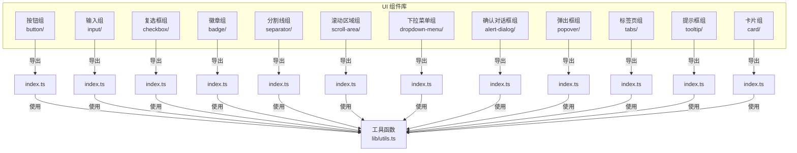
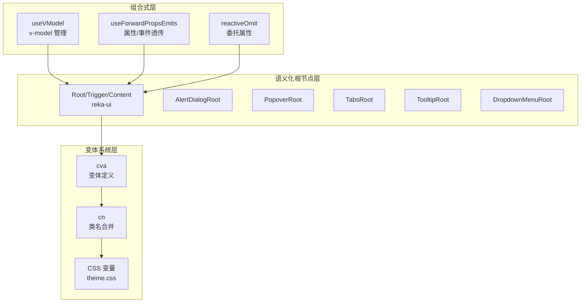
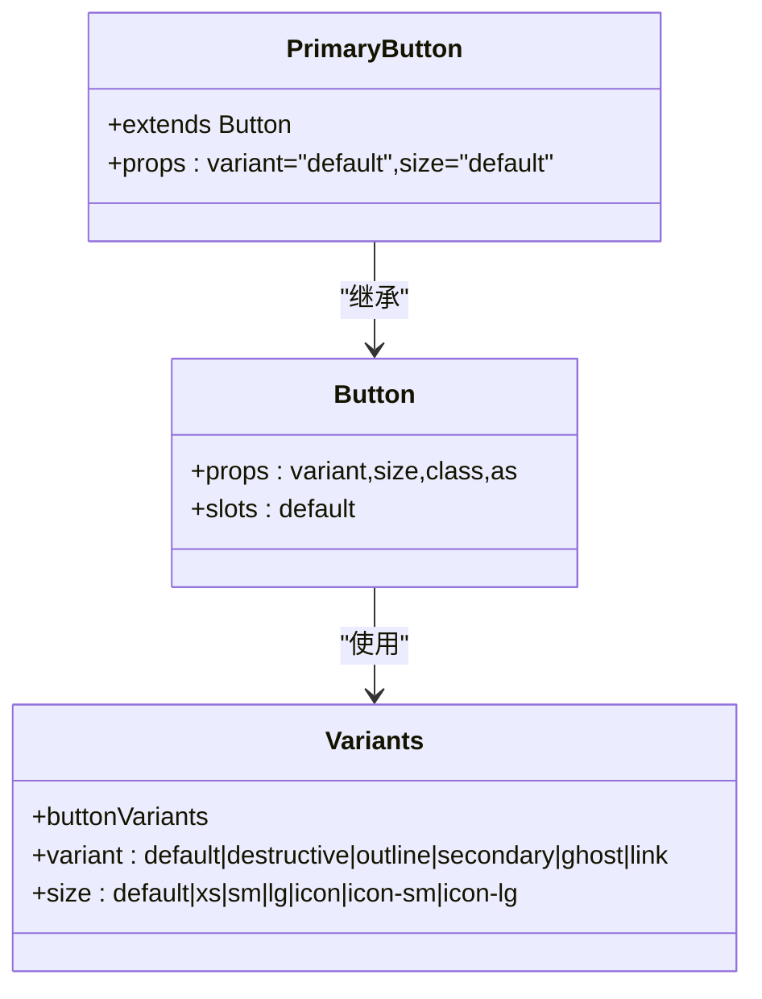
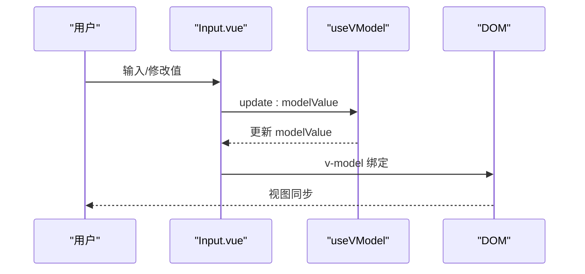
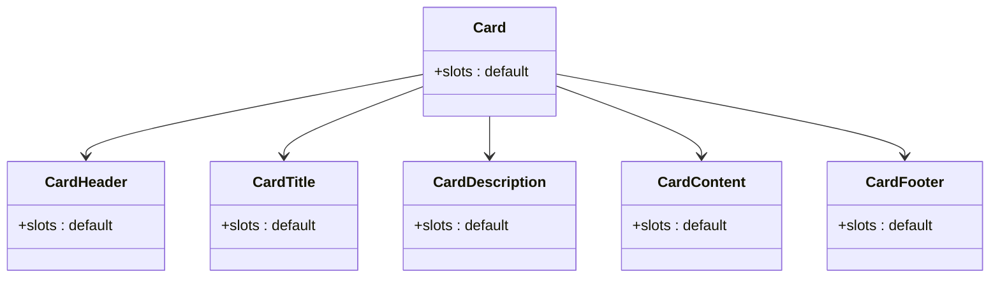
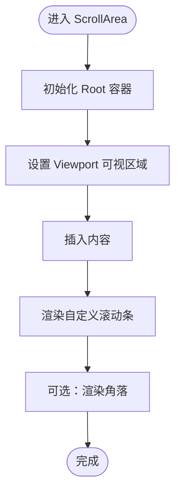
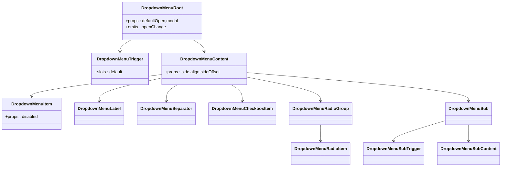
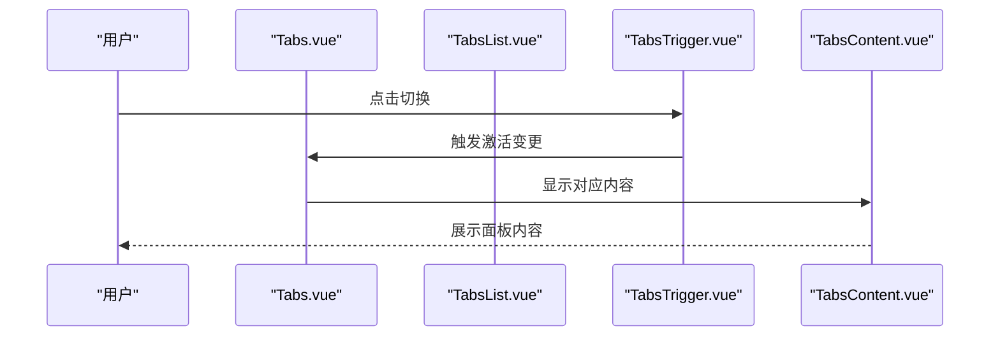
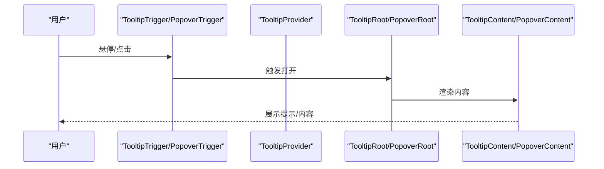
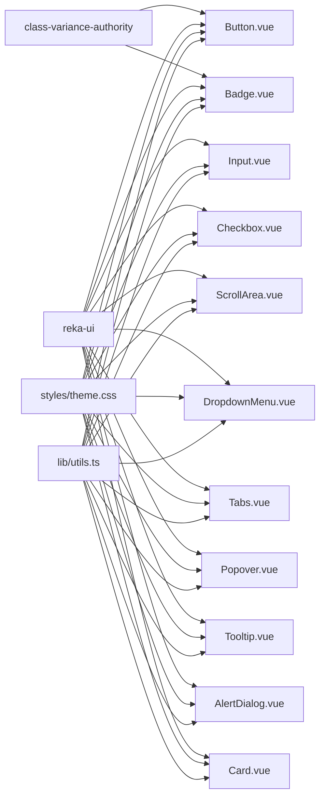

# UI 组件扩展

<cite>
**本文引用的文件**
- [apps/frontend/src/components/ui/button/Button.vue](file://apps/frontend/src/components/ui/button/Button.vue)
- [apps/frontend/src/components/ui/button/index.ts](file://apps/frontend/src/components/ui/button/index.ts)
- [apps/frontend/src/components/ui/card/Card.vue](file://apps/frontend/src/components/ui/card/Card.vue)
- [apps/frontend/src/components/ui/input/Input.vue](file://apps/frontend/src/components/ui/input/Input.vue)
- [apps/frontend/src/components/ui/checkbox/Checkbox.vue](file://apps/frontend/src/components/ui/checkbox/Checkbox.vue)
- [apps/frontend/src/components/ui/badge/Badge.vue](file://apps/frontend/src/components/ui/badge/Badge.vue)
- [apps/frontend/src/components/ui/separator/Separator.vue](file://apps/frontend/src/components/ui/separator/Separator.vue)
- [apps/frontend/src/components/ui/scroll-area/ScrollArea.vue](file://apps/frontend/src/components/ui/scroll-area/ScrollArea.vue)
- [apps/frontend/src/components/ui/scroll-area/ScrollBar.vue](file://apps/frontend/src/components/ui/scroll-area/ScrollBar.vue)
- [apps/frontend/src/components/ui/dropdown-menu/DropdownMenu.vue](file://apps/frontend/src/components/ui/dropdown-menu/DropdownMenu.vue)
- [apps/frontend/src/components/ui/alert-dialog/AlertDialog.vue](file://apps/frontend/src/components/ui/alert-dialog/AlertDialog.vue)
- [apps/frontend/src/components/ui/popover/Popover.vue](file://apps/frontend/src/components/ui/popover/Popover.vue)
- [apps/frontend/src/components/ui/tabs/Tabs.vue](file://apps/frontend/src/components/ui/tabs/Tabs.vue)
- [apps/frontend/src/components/ui/tooltip/Tooltip.vue](file://apps/frontend/src/components/ui/tooltip/Tooltip.vue)
- [apps/frontend/src/lib/utils.ts](file://apps/frontend/src/lib/utils.ts)
- [apps/frontend/src/styles/base.css](file://apps/frontend/src/styles/base.css)
- [apps/frontend/src/styles/theme.css](file://apps/frontend/src/styles/theme.css)
- [apps/frontend/src/composables/useTheme.ts](file://apps/frontend/src/composables/useTheme.ts)
- [apps/frontend/src/components/ui/card/CardHeader.vue](file://apps/frontend/src/components/ui/card/CardHeader.vue)
- [apps/frontend/src/components/ui/card/CardTitle.vue](file://apps/frontend/src/components/ui/card/CardTitle.vue)
- [apps/frontend/src/components/ui/card/CardDescription.vue](file://apps/frontend/src/components/ui/card/CardDescription.vue)
- [apps/frontend/src/components/ui/card/CardContent.vue](file://apps/frontend/src/components/ui/card/CardContent.vue)
- [apps/frontend/src/components/ui/card/CardFooter.vue](file://apps/frontend/src/components/ui/card/CardFooter.vue)
- [apps/frontend/src/components/ui/button/PrimaryButton.vue](file://apps/frontend/src/components/ui/button/PrimaryButton.vue)
- [apps/frontend/src/components/ui/alert-dialog/AlertDialogTrigger.vue](file://apps/frontend/src/components/ui/alert-dialog/AlertDialogTrigger.vue)
- [apps/frontend/src/components/ui/alert-dialog/AlertDialogContent.vue](file://apps/frontend/src/components/ui/alert-dialog/AlertDialogContent.vue)
- [apps/frontend/src/components/ui/alert-dialog/AlertDialogHeader.vue](file://apps/frontend/src/components/ui/alert-dialog/AlertDialogHeader.vue)
- [apps/frontend/src/components/ui/alert-dialog/AlertDialogTitle.vue](file://apps/frontend/src/components/ui/alert-dialog/AlertDialogTitle.vue)
- [apps/frontend/src/components/ui/alert-dialog/AlertDialogDescription.vue](file://apps/frontend/src/components/ui/alert-dialog/AlertDialogDescription.vue)
- [apps/frontend/src/components/ui/alert-dialog/AlertDialogFooter.vue](file://apps/frontend/src/components/ui/alert-dialog/AlertDialogFooter.vue)
- [apps/frontend/src/components/ui/alert-dialog/AlertDialogAction.vue](file://apps/frontend/src/components/ui/alert-dialog/AlertDialogAction.vue)
- [apps/frontend/src/components/ui/alert-dialog/AlertDialogCancel.vue](file://apps/frontend/src/components/ui/alert-dialog/AlertDialogCancel.vue)
- [apps/frontend/src/components/ui/badge/index.ts](file://apps/frontend/src/components/ui/badge/index.ts)
- [apps/frontend/src/components/ui/badge/badge.variants.ts](file://apps/frontend/src/components/ui/badge/badge.variants.ts)
- [apps/frontend/src/components/ui/dropdown-menu/index.ts](file://apps/frontend/src/components/ui/dropdown-menu/index.ts)
- [apps/frontend/src/components/ui/dropdown-menu/DropdownMenuTrigger.vue](file://apps/frontend/src/components/ui/dropdown-menu/DropdownMenuTrigger.vue)
- [apps/frontend/src/components/ui/dropdown-menu/DropdownMenuContent.vue](file://apps/frontend/src/components/ui/dropdown-menu/DropdownMenuContent.vue)
- [apps/frontend/src/components/ui/dropdown-menu/DropdownMenuItem.vue](file://apps/frontend/src/components/ui/dropdown-menu/DropdownMenuItem.vue)
- [apps/frontend/src/components/ui/dropdown-menu/DropdownMenuLabel.vue](file://apps/frontend/src/components/ui/dropdown-menu/DropdownMenuLabel.vue)
- [apps/frontend/src/components/ui/dropdown-menu/DropdownMenuSeparator.vue](file://apps/frontend/src/components/ui/dropdown-menu/DropdownMenuSeparator.vue)
- [apps/frontend/src/components/ui/dropdown-menu/DropdownMenuCheckboxItem.vue](file://apps/frontend/src/components/ui/dropdown-menu/DropdownMenuCheckboxItem.vue)
- [apps/frontend/src/components/ui/dropdown-menu/DropdownMenuRadioGroup.vue](file://apps/frontend/src/components/ui/dropdown-menu/DropdownMenuRadioGroup.vue)
- [apps/frontend/src/components/ui/dropdown-menu/DropdownMenuRadioItem.vue](file://apps/frontend/src/components/ui/dropdown-menu/DropdownMenuRadioItem.vue)
- [apps/frontend/src/components/ui/dropdown-menu/DropdownMenuSub.vue](file://apps/frontend/src/components/ui/dropdown-menu/DropdownMenuSub.vue)
- [apps/frontend/src/components/ui/dropdown-menu/DropdownMenuSubContent.vue](file://apps/frontend/src/components/ui/dropdown-menu/DropdownMenuSubContent.vue)
- [apps/frontend/src/components/ui/dropdown-menu/DropdownMenuSubTrigger.vue](file://apps/frontend/src/components/ui/dropdown-menu/DropdownMenuSubTrigger.vue)
- [apps/frontend/src/components/ui/tabs/index.ts](file://apps/frontend/src/components/ui/tabs/index.ts)
- [apps/frontend/src/components/ui/tabs/TabsList.vue](file://apps/frontend/src/components/ui/tabs/TabsList.vue)
- [apps/frontend/src/components/ui/tabs/TabsTrigger.vue](file://apps/frontend/src/components/ui/tabs/TabsTrigger.vue)
- [apps/frontend/src/components/ui/tabs/TabsContent.vue](file://apps/frontend/src/components/ui/tabs/TabsContent.vue)
- [apps/frontend/src/components/ui/tooltip/index.ts](file://apps/frontend/src/components/ui/tooltip/index.ts)
- [apps/frontend/src/components/ui/tooltip/TooltipTrigger.vue](file://apps/frontend/src/components/ui/tooltip/TooltipTrigger.vue)
- [apps/frontend/src/components/ui/tooltip/TooltipContent.vue](file://apps/frontend/src/components/ui/tooltip/TooltipContent.vue)
- [apps/frontend/src/components/ui/tooltip/TooltipProvider.vue](file://apps/frontend/src/components/ui/tooltip/TooltipProvider.vue)
- [apps/frontend/src/components/ui/popover/index.ts](file://apps/frontend/src/components/ui/popover/index.ts)
- [apps/frontend/src/components/ui/popover/PopoverTrigger.vue](file://apps/frontend/src/components/ui/popover/PopoverTrigger.vue)
- [apps/frontend/src/components/ui/popover/PopoverContent.vue](file://apps/frontend/src/components/ui/popover/PopoverContent.vue)
- [apps/frontend/src/components/ui/alert-dialog/index.ts](file://apps/frontend/src/components/ui/alert-dialog/index.ts)
- [apps/frontend/src/components/ui/alert-dialog/AlertDialogFooter.vue](file://apps/frontend/src/components/ui/alert-dialog/AlertDialogFooter.vue)
- [apps/frontend/src/components/ui/alert-dialog/AlertDialogFooter.vue](file://apps/frontend/src/components/ui/alert-dialog/AlertDialogFooter.vue)
- [apps/frontend/src/components/ui/scroll-area/index.ts](file://apps/frontend/src/components/ui/scroll-area/index.ts)
- [apps/frontend/src/components/ui/scroll-area/ScrollBar.vue](file://apps/frontend/src/components/ui/scroll-area/ScrollBar.vue)
- [apps/frontend/src/components/ui/scroll-area/ScrollArea.vue](file://apps/frontend/src/components/ui/scroll-area/ScrollArea.vue)
- [apps/frontend/src/components/ui/scroll-area/ScrollBar.vue](file://apps/frontend/src/components/ui/scroll-area/ScrollBar.vue)
- [apps/frontend/src/components/ui/scroll-area/ScrollArea.vue](file://apps/frontend/src/components/ui/scroll-area/ScrollArea.vue)
- [apps/frontend/src/components/ui/scroll-area/ScrollBar.vue](file://apps/frontend/src/components/ui/scroll-area/ScrollBar.vue)
- [apps/frontend/src/components/ui/scroll-area/ScrollArea.vue](file://apps/frontend/src/components/ui/scroll-area/ScrollArea.vue)
- [apps/frontend/src/components/ui/scroll-area/ScrollBar.vue](file://apps/frontend/src/components/ui/scroll-area/ScrollBar.vue)
- [apps/frontend/src/components/ui/scroll-area/ScrollArea.vue](file://apps/frontend/src/components/ui/scroll-area/ScrollArea.vue)
- [apps/frontend/src/components/ui/scroll-area/ScrollBar.vue](file://apps/frontend/src/components/ui/scroll-area/ScrollBar.vue)
- [apps/frontend/src/components/ui/scroll-area/ScrollArea.vue](file://apps/frontend/src/components/ui/scroll-area/ScrollArea.vue)
- [apps/frontend/src/components/ui/scroll-area/ScrollBar.vue](file://apps/frontend/src/components/ui/scroll-area/ScrollBar.vue)
- [apps/frontend/src/components/ui/scroll-area/ScrollArea.vue](file://apps/frontend/src/components/ui/scroll-area/ScrollArea.vue)
- [apps/frontend/src/components/ui/scroll-area/ScrollBar.vue](file://apps/frontend/src/components/ui/scroll-area/ScrollBar.vue)
- [apps/frontend/src/components/ui/scroll-area/ScrollArea.vue](file://apps/frontend/src/components/ui/scroll-area/ScrollArea.vue)
- [apps/frontend/src/components/ui/scroll-area/ScrollBar.vue](file://apps/frontend/src/components/ui/scroll-area/ScrollBar.vue)
- [apps/frontend/src/components/ui/scroll-area/ScrollArea.vue](file://apps/frontend/src/components/ui/scroll-area/ScrollArea.vue)
- [apps/frontend/src/components/ui/scroll-area/ScrollBar.vue](file://apps/frontend/src/components/ui/scroll-area/ScrollBar.vue)
- [apps/frontend/src/components/ui/scroll-area/ScrollArea.vue](file://apps/frontend/src/components/ui/scroll-area/ScrollArea.vue)
- [apps/frontend/src/components/ui/scroll-area/ScrollBar.vue](file://apps/frontend/src/components/ui/scroll-area/ScrollBar.vue)
- [apps/frontend/src/components/ui/scroll-area/ScrollArea.vue](file://apps/frontend/src/components/ui/scroll-area/......)
</cite>

## 目录
1. [简介](#简介)
2. [项目结构](#项目结构)
3. [核心组件](#核心组件)
4. [架构总览](#架构总览)
5. [详细组件分析](#详细组件分析)
6. [依赖关系分析](#依赖关系分析)
7. [性能考量](#性能考量)
8. [故障排查指南](#故障排查指南)
9. [结论](#结论)
10. [附录](#附录)

## 简介
本指南面向希望在 Lumina Todo 前端组件库上进行 UI 扩展与二次开发的工程师。文档围绕组件库的架构设计、组件分类体系、基础设计原则与使用规范、自定义组件开发模板与最佳实践、样式系统与主题定制、响应式与移动端适配策略、状态管理与事件处理机制、组件组合与复用策略、无障碍支持与浏览器兼容、以及测试与性能优化等方面展开，帮助读者快速构建高质量、可维护且一致的 UI 扩展。

## 项目结构
前端组件库位于 apps/frontend/src/components/ui 下，采用“按功能域分包”的组织方式，每个 UI 组件族（如 button、input、dropdown-menu、tabs 等）独立为一个目录，内部包含若干子组件与入口索引文件。样式系统通过 Tailwind CSS 与 CSS 变量层叠（layer base）统一管理，并结合 Vue 组合式工具与 reka-ui 提供的语义化组件根节点，形成“约定优于配置”的开发体验。



图示来源
- [apps/frontend/src/components/ui/button/index.ts:1-38](file://apps/frontend/src/components/ui/button/index.ts#L1-L38)
- [apps/frontend/src/components/ui/input/index.ts](file://apps/frontend/src/components/ui/input/index.ts)
- [apps/frontend/src/components/ui/checkbox/index.ts](file://apps/frontend/src/components/ui/checkbox/index.ts)
- [apps/frontend/src/components/ui/badge/index.ts](file://apps/frontend/src/components/ui/badge/index.ts)
- [apps/frontend/src/components/ui/separator/index.ts](file://apps/frontend/src/components/ui/separator/index.ts)
- [apps/frontend/src/components/ui/scroll-area/index.ts](file://apps/frontend/src/components/ui/scroll-area/index.ts)
- [apps/frontend/src/components/ui/dropdown-menu/index.ts](file://apps/frontend/src/components/ui/dropdown-menu/index.ts)
- [apps/frontend/src/components/ui/alert-dialog/index.ts](file://apps/frontend/src/components/ui/alert-dialog/index.ts)
- [apps/frontend/src/components/ui/popover/index.ts](file://apps/frontend/src/components/ui/popover/index.ts)
- [apps/frontend/src/components/ui/tabs/index.ts](file://apps/frontend/src/components/ui/tabs/index.ts)
- [apps/frontend/src/components/ui/tooltip/index.ts](file://apps/frontend/src/components/ui/tooltip/index.ts)
- [apps/frontend/src/components/ui/card/index.ts](file://apps/frontend/src/components/ui/card/index.ts)

章节来源
- [apps/frontend/src/components/ui/button/index.ts:1-38](file://apps/frontend/src/components/ui/button/index.ts#L1-L38)
- [apps/frontend/src/lib/utils.ts:1-33](file://apps/frontend/src/lib/utils.ts#L1-L33)
- [apps/frontend/src/styles/base.css:1-89](file://apps/frontend/src/styles/base.css#L1-L89)

## 核心组件
- 基础容器与排版：Card（卡片）、Separator（分割线）
- 表单控件：Input（输入）、Checkbox（复选框）
- 交互反馈：Badge（徽章）、ScrollArea（滚动区域）、ScrollBar（滚动条）
- 导航与覆盖层：Tabs（标签页）、DropdownMenu（下拉菜单）、Popover（弹出框）、Tooltip（提示框）、AlertDialog（确认对话框）
- 按钮族：Button（通用按钮）、PrimaryButton（主按钮）

这些组件遵循统一的“根节点 + 变体系统 + 工具函数”范式，既保证了可复用性，也便于扩展与定制。

章节来源
- [apps/frontend/src/components/ui/card/Card.vue:1-15](file://apps/frontend/src/components/ui/card/Card.vue#L1-L15)
- [apps/frontend/src/components/ui/separator/Separator.vue:1-29](file://apps/frontend/src/components/ui/separator/Separator.vue#L1-L29)
- [apps/frontend/src/components/ui/input/Input.vue:1-42](file://apps/frontend/src/components/ui/input/Input.vue#L1-L42)
- [apps/frontend/src/components/ui/checkbox/Checkbox.vue:1-34](file://apps/frontend/src/components/ui/checkbox/Checkbox.vue#L1-L34)
- [apps/frontend/src/components/ui/badge/Badge.vue:1-18](file://apps/frontend/src/components/ui/badge/Badge.vue#L1-L18)
- [apps/frontend/src/components/ui/scroll-area/ScrollArea.vue:1-23](file://apps/frontend/src/components/ui/scroll-area/ScrollArea.vue#L1-L23)
- [apps/frontend/src/components/ui/tabs/Tabs.vue:1-16](file://apps/frontend/src/components/ui/tabs/Tabs.vue#L1-L16)
- [apps/frontend/src/components/ui/dropdown-menu/DropdownMenu.vue:1-16](file://apps/frontend/src/components/ui/dropdown-menu/DropdownMenu.vue#L1-L16)
- [apps/frontend/src/components/ui/popover/Popover.vue:1-20](file://apps/frontend/src/components/ui/popover/Popover.vue#L1-L20)
- [apps/frontend/src/components/ui/tooltip/Tooltip.vue:1-16](file://apps/frontend/src/components/ui/tooltip/Tooltip.vue#L1-L16)
- [apps/frontend/src/components/ui/alert-dialog/AlertDialog.vue:1-16](file://apps/frontend/src/components/ui/alert-dialog/AlertDialog.vue#L1-L16)
- [apps/frontend/src/components/ui/button/Button.vue:1-32](file://apps/frontend/src/components/ui/button/Button.vue#L1-L32)
- [apps/frontend/src/components/ui/button/PrimaryButton.vue](file://apps/frontend/src/components/ui/button/PrimaryButton.vue)

## 架构总览
组件库采用“组合式 + 语义化根节点 + 变体系统”的三层架构：
- 组合式层：通过 Vue 组合式 API（如 useVModel、useForwardPropsEmits、reactiveOmit）管理状态与事件转发。
- 语义化根节点层：基于 reka-ui 的 Root/Trigger/Content 等语义化组件，确保可访问性与行为一致性。
- 变体系统层：使用 class-variance-authority 定义组件变体（variant/size），配合 cn 合并 Tailwind 类名，实现样式解耦与可扩展。



图示来源
- [apps/frontend/src/components/ui/input/Input.vue:1-42](file://apps/frontend/src/components/ui/input/Input.vue#L1-L42)
- [apps/frontend/src/components/ui/checkbox/Checkbox.vue:1-34](file://apps/frontend/src/components/ui/checkbox/Checkbox.vue#L1-L34)
- [apps/frontend/src/components/ui/alert-dialog/AlertDialog.vue:1-16](file://apps/frontend/src/components/ui/alert-dialog/AlertDialog.vue#L1-L16)
- [apps/frontend/src/components/ui/popover/Popover.vue:1-20](file://apps/frontend/src/components/ui/popover/Popover.vue#L1-L20)
- [apps/frontend/src/components/ui/tabs/Tabs.vue:1-16](file://apps/frontend/src/components/ui/tabs/Tabs.vue#L1-L16)
- [apps/frontend/src/components/ui/tooltip/Tooltip.vue:1-16](file://apps/frontend/src/components/ui/tooltip/Tooltip.vue#L1-L16)
- [apps/frontend/src/components/ui/dropdown-menu/DropdownMenu.vue:1-16](file://apps/frontend/src/components/ui/dropdown-menu/DropdownMenu.vue#L1-L16)
- [apps/frontend/src/components/ui/button/index.ts:1-38](file://apps/frontend/src/components/ui/button/index.ts#L1-L38)
- [apps/frontend/src/lib/utils.ts:1-33](file://apps/frontend/src/lib/utils.ts#L1-L33)
- [apps/frontend/src/styles/theme.css:1-146](file://apps/frontend/src/styles/theme.css#L1-L146)

## 详细组件分析

### 按钮 Button 与 PrimaryButton
- 设计原则
  - 通过变体系统控制外观与尺寸，支持默认、破坏性、描边、次级、幽灵、链接等变体与多种尺寸。
  - 使用 cn 合并 Tailwind 类名，确保与主题变量协同工作。
  - 支持原生 button 或自定义渲染标签，具备可访问性与焦点环支持。
- 使用规范
  - 优先使用 PrimaryButton 作为主要操作入口；普通操作使用 Button 默认变体。
  - 通过 variant/size 属性切换风格与尺寸；通过 class 自定义额外样式。
- 开发模板与最佳实践
  - 新增按钮变体时，在 index.ts 中扩展 buttonVariants，并在 Button.vue 中读取 props。
  - 如需图标，建议通过插槽或子元素传递，保持语义化与可访问性。
- 无障碍与兼容
  - 保持原生语义（如 type="button"），避免破坏默认行为。
  - 确保键盘可达与焦点可见性。



图示来源
- [apps/frontend/src/components/ui/button/Button.vue:1-32](file://apps/frontend/src/components/ui/button/Button.vue#L1-L32)
- [apps/frontend/src/components/ui/button/PrimaryButton.vue](file://apps/frontend/src/components/ui/button/PrimaryButton.vue)
- [apps/frontend/src/components/ui/button/index.ts:1-38](file://apps/frontend/src/components/ui/button/index.ts#L1-L38)

章节来源
- [apps/frontend/src/components/ui/button/Button.vue:1-32](file://apps/frontend/src/components/ui/button/Button.vue#L1-L32)
- [apps/frontend/src/components/ui/button/PrimaryButton.vue](file://apps/frontend/src/components/ui/button/PrimaryButton.vue)
- [apps/frontend/src/components/ui/button/index.ts:1-38](file://apps/frontend/src/components/ui/button/index.ts#L1-L38)

### 输入 Input 与复选框 Checkbox
- Input
  - 通过 useVModel 实现 v-model 双向绑定，支持 defaultValue 与被动更新。
  - 自动生成唯一 id，避免 label 关联问题；支持透传原生 input 属性。
- Checkbox
  - 通过 useForwardPropsEmits 与 reactiveOmit 将属性与事件透传给 reka-ui 根节点。
  - 支持自定义指示器内容（默认使用 Check 图标），保持尺寸与色彩与主题一致。



图示来源
- [apps/frontend/src/components/ui/input/Input.vue:1-42](file://apps/frontend/src/components/ui/input/Input.vue#L1-L42)

章节来源
- [apps/frontend/src/components/ui/input/Input.vue:1-42](file://apps/frontend/src/components/ui/input/Input.vue#L1-L42)
- [apps/frontend/src/components/ui/checkbox/Checkbox.vue:1-34](file://apps/frontend/src/components/ui/checkbox/Checkbox.vue#L1-L34)

### 卡片 Card 与徽章 Badge
- Card
  - 提供 Header/Title/Description/Content/Footer 等子组件，形成卡片内容区段化布局。
  - 通过 cn 合并 Tailwind 类名，确保与主题变量联动。
- Badge
  - 通过 badgeVariants 控制语义化外观（如默认、次级、强调、警告等）。
  - 支持通过 variant 属性切换样式，通过 class 扩展。



图示来源
- [apps/frontend/src/components/ui/card/Card.vue:1-15](file://apps/frontend/src/components/ui/card/Card.vue#L1-L15)
- [apps/frontend/src/components/ui/card/CardHeader.vue](file://apps/frontend/src/components/ui/card/CardHeader.vue)
- [apps/frontend/src/components/ui/card/CardTitle.vue](file://apps/frontend/src/components/ui/card/CardTitle.vue)
- [apps/frontend/src/components/ui/card/CardDescription.vue](file://apps/frontend/src/components/ui/card/CardDescription.vue)
- [apps/frontend/src/components/ui/card/CardContent.vue](file://apps/frontend/src/components/ui/card/CardContent.vue)
- [apps/frontend/src/components/ui/card/CardFooter.vue](file://apps/frontend/src/components/ui/card/CardFooter.vue)

章节来源
- [apps/frontend/src/components/ui/card/Card.vue:1-15](file://apps/frontend/src/components/ui/card/Card.vue#L1-L15)
- [apps/frontend/src/components/ui/badge/Badge.vue:1-18](file://apps/frontend/src/components/ui/badge/Badge.vue#L1-L18)
- [apps/frontend/src/components/ui/badge/index.ts](file://apps/frontend/src/components/ui/badge/index.ts)
- [apps/frontend/src/components/ui/badge/badge.variants.ts](file://apps/frontend/src/components/ui/badge/badge.variants.ts)

### 滚动区域 ScrollArea 与 ScrollBar
- 设计原则
  - ScrollAreaRoot 作为容器，Viewport 作为可视区域，ScrollBar 作为自定义滚动条。
  - 通过 cn 合并类名，确保滚动条与主题一致。
- 最佳实践
  - 内容区尽量使用相对定位与合适的尺寸，避免滚动条遮挡。
  - 在需要时引入 Corner 以完善右下角角落处理。



图示来源
- [apps/frontend/src/components/ui/scroll-area/ScrollArea.vue:1-23](file://apps/frontend/src/components/ui/scroll-area/ScrollArea.vue#L1-L23)
- [apps/frontend/src/components/ui/scroll-area/ScrollBar.vue](file://apps/frontend/src/components/ui/scroll-area/ScrollBar.vue)

章节来源
- [apps/frontend/src/components/ui/scroll-area/ScrollArea.vue:1-23](file://apps/frontend/src/components/ui/scroll-area/ScrollArea.vue#L1-L23)
- [apps/frontend/src/components/ui/scroll-area/ScrollBar.vue](file://apps/frontend/src/components/ui/scroll-area/ScrollBar.vue)

### 下拉菜单 DropdownMenu
- 结构与职责
  - Root 作为容器，Trigger 触发菜单，Content 容纳菜单项。
  - 支持分组、标签、分隔符、复选框项、单选项、子菜单等复合结构。
- 事件与状态
  - 通过 useForwardPropsEmits 透传属性与事件，确保与 reka-ui 行为一致。
- 最佳实践
  - 使用 DropdownMenuLabel 提升可读性；使用 DropdownMenuSeparator 分割逻辑区块。
  - 子菜单通过 DropdownMenuSub/Content/Trigger 组合实现层级导航。



图示来源
- [apps/frontend/src/components/ui/dropdown-menu/DropdownMenu.vue:1-16](file://apps/frontend/src/components/ui/dropdown-menu/DropdownMenu.vue#L1-L16)
- [apps/frontend/src/components/ui/dropdown-menu/DropdownMenuTrigger.vue](file://apps/frontend/src/components/ui/dropdown-menu/DropdownMenuTrigger.vue)
- [apps/frontend/src/components/ui/dropdown-menu/DropdownMenuContent.vue](file://apps/frontend/src/components/ui/dropdown-menu/DropdownMenuContent.vue)
- [apps/frontend/src/components/ui/dropdown-menu/DropdownMenuItem.vue](file://apps/frontend/src/components/ui/dropdown-menu/DropdownMenuItem.vue)
- [apps/frontend/src/components/ui/dropdown-menu/DropdownMenuLabel.vue](file://apps/frontend/src/components/ui/dropdown-menu/DropdownMenuLabel.vue)
- [apps/frontend/src/components/ui/dropdown-menu/DropdownMenuSeparator.vue](file://apps/frontend/src/components/ui/dropdown-menu/DropdownMenuSeparator.vue)
- [apps/frontend/src/components/ui/dropdown-menu/DropdownMenuCheckboxItem.vue](file://apps/frontend/src/components/ui/dropdown-menu/DropdownMenuCheckboxItem.vue)
- [apps/frontend/src/components/ui/dropdown-menu/DropdownMenuRadioGroup.vue](file://apps/frontend/src/components/ui/dropdown-menu/DropdownMenuRadioGroup.vue)
- [apps/frontend/src/components/ui/dropdown-menu/DropdownMenuRadioItem.vue](file://apps/frontend/src/components/ui/dropdown-menu/DropdownMenuRadioItem.vue)
- [apps/frontend/src/components/ui/dropdown-menu/DropdownMenuSub.vue](file://apps/frontend/src/components/ui/dropdown-menu/DropdownMenuSub.vue)
- [apps/frontend/src/components/ui/dropdown-menu/DropdownMenuSubContent.vue](file://apps/frontend/src/components/ui/dropdown-menu/DropdownMenuSubContent.vue)
- [apps/frontend/src/components/ui/dropdown-menu/DropdownMenuSubTrigger.vue](file://apps/frontend/src/components/ui/dropdown-menu/DropdownMenuSubTrigger.vue)

章节来源
- [apps/frontend/src/components/ui/dropdown-menu/index.ts](file://apps/frontend/src/components/ui/dropdown-menu/index.ts)

### 标签页 Tabs
- 结构
  - TabsRoot 作为容器，TabsList 包含触发器，TabsTrigger 对应面板，TabsContent 为对应内容区。
- 事件与状态
  - 通过 useForwardPropsEmits 透传属性与事件，确保与 reka-ui 行为一致。
- 最佳实践
  - 触发器与内容区一一对应，避免动态 ID 不一致导致的错位。



图示来源
- [apps/frontend/src/components/ui/tabs/Tabs.vue:1-16](file://apps/frontend/src/components/ui/tabs/Tabs.vue#L1-L16)
- [apps/frontend/src/components/ui/tabs/TabsList.vue](file://apps/frontend/src/components/ui/tabs/TabsList.vue)
- [apps/frontend/src/components/ui/tabs/TabsTrigger.vue](file://apps/frontend/src/components/ui/tabs/TabsTrigger.vue)
- [apps/frontend/src/components/ui/tabs/TabsContent.vue](file://apps/frontend/src/components/ui/tabs/TabsContent.vue)

章节来源
- [apps/frontend/src/components/ui/tabs/index.ts](file://apps/frontend/src/components/ui/tabs/index.ts)

### 提示框 Tooltip 与弹出框 Popover
- Tooltip
  - TooltipRoot 作为容器，TooltipTrigger 触发显示，TooltipContent 展示提示文本。
  - TooltipProvider 可用于全局配置延迟、位置等行为。
- Popover
  - PopoverRoot 作为容器，PopoverTrigger 触发，PopoverContent 展示内容。
- 最佳实践
  - 文本简短明确，避免长段落；必要时使用 Popover 承载复杂内容。



图示来源
- [apps/frontend/src/components/ui/tooltip/Tooltip.vue:1-16](file://apps/frontend/src/components/ui/tooltip/Tooltip.vue#L1-L16)
- [apps/frontend/src/components/ui/tooltip/TooltipTrigger.vue](file://apps/frontend/src/components/ui/tooltip/TooltipTrigger.vue)
- [apps/frontend/src/components/ui/tooltip/TooltipContent.vue](file://apps/frontend/src/components/ui/tooltip/TooltipContent.vue)
- [apps/frontend/src/components/ui/tooltip/TooltipProvider.vue](file://apps/frontend/src/components/ui/tooltip/TooltipProvider.vue)
- [apps/frontend/src/components/ui/popover/Popover.vue:1-20](file://apps/frontend/src/components/ui/popover/Popover.vue#L1-L20)
- [apps/frontend/src/components/ui/popover/PopoverTrigger.vue](file://apps/frontend/src/components/ui/popover/PopoverTrigger.vue)
- [apps/frontend/src/components/ui/popover/PopoverContent.vue](file://apps/frontend/src/components/ui/popover/PopoverContent.vue)

章节来源
- [apps/frontend/src/components/ui/tooltip/index.ts](file://apps/frontend/src/components/ui/tooltip/index.ts)
- [apps/frontend/src/components/ui/popover/index.ts](file://apps/frontend/src/components/ui/popover/index.ts)

### 确认对话框 AlertDialog
- 结构
  - AlertDialogRoot 作为容器，包含 Header/Title/Description/Footer/Action/Cancel 等子组件。
  - 通过 Trigger 触发，Content 容纳正文与操作区。
- 最佳实践
  - 使用 Action 作为确认操作，Cancel 作为取消操作，确保键盘可达与焦点管理。

```mermaid
sequenceDiagram
participant User as "用户"
participant Trigger as "AlertDialogTrigger"
participant Root as "AlertDialogRoot"
participant Header as "AlertDialogHeader"
participant Title as "AlertDialogTitle"
participant Desc as "AlertDialogDescription"
participant Footer as "AlertDialogFooter"
participant Action as "AlertDialogAction"
participant Cancel as "AlertDialogCancel"
User->>Trigger : 点击触发
Trigger->>Root : 打开对话框
Root->>Header : 渲染头部
Header->>Title : 渲染标题
Header->>Desc : 渲染描述
Root->>Footer : 渲染底部
Footer->>Action : 渲染确认按钮
Footer->>Cancel : 渲染取消按钮
User->>Action : 点击确认
Action-->>Root : 触发确认事件
Root-->>User : 关闭并返回结果
```

图示来源
- [apps/frontend/src/components/ui/alert-dialog/AlertDialog.vue:1-16](file://apps/frontend/src/components/ui/alert-dialog/AlertDialog.vue#L1-L16)
- [apps/frontend/src/components/ui/alert-dialog/AlertDialogTrigger.vue](file://apps/frontend/src/components/ui/alert-dialog/AlertDialogTrigger.vue)
- [apps/frontend/src/components/ui/alert-dialog/AlertDialogContent.vue](file://apps/frontend/src/components/ui/alert-dialog/AlertDialogContent.vue)
- [apps/frontend/src/components/ui/alert-dialog/AlertDialogHeader.vue](file://apps/frontend/src/components/ui/alert-dialog/AlertDialogHeader.vue)
- [apps/frontend/src/components/ui/alert-dialog/AlertDialogTitle.vue](file://apps/frontend/src/components/ui/alert-dialog/AlertDialogTitle.vue)
- [apps/frontend/src/components/ui/alert-dialog/AlertDialogDescription.vue](file://apps/frontend/src/components/ui/alert-dialog/AlertDialogDescription.vue)
- [apps/frontend/src/components/ui/alert-dialog/AlertDialogFooter.vue](file://apps/frontend/src/components/ui/alert-dialog/AlertDialogFooter.vue)
- [apps/frontend/src/components/ui/alert-dialog/AlertDialogAction.vue](file://apps/frontend/src/components/ui/alert-dialog/AlertDialogAction.vue)
- [apps/frontend/src/components/ui/alert-dialog/AlertDialogCancel.vue](file://apps/frontend/src/components/ui/alert-dialog/AlertDialogCancel.vue)

章节来源
- [apps/frontend/src/components/ui/alert-dialog/index.ts](file://apps/frontend/src/components/ui/alert-dialog/index.ts)

## 依赖关系分析
- 组件间依赖
  - 复杂容器组件（如 Tabs、DropdownMenu、AlertDialog、Popover、Tooltip）依赖 reka-ui 的 Root/Trigger/Content 等语义化根节点。
  - 所有组件均依赖 lib/utils.ts 的 cn 工具进行类名合并。
  - 主题变量集中于 styles/theme.css，通过 CSS 变量驱动颜色、圆角、过渡等。
- 外部依赖
  - reka-ui：提供语义化组件根节点与事件转发能力。
  - class-variance-authority：提供变体系统。
  - tailwind-merge/clsx：提供类名合并与冲突修复。
  - @vueuse/core：提供 useVModel、useForwardPropsEmits、reactiveOmit 等组合式工具。



图示来源
- [apps/frontend/src/lib/utils.ts:1-33](file://apps/frontend/src/lib/utils.ts#L1-L33)
- [apps/frontend/src/styles/theme.css:1-146](file://apps/frontend/src/styles/theme.css#L1-L146)
- [apps/frontend/src/components/ui/button/index.ts:1-38](file://apps/frontend/src/components/ui/button/index.ts#L1-L38)
- [apps/frontend/src/components/ui/alert-dialog/AlertDialog.vue:1-16](file://apps/frontend/src/components/ui/alert-dialog/AlertDialog.vue#L1-L16)
- [apps/frontend/src/components/ui/popover/Popover.vue:1-20](file://apps/frontend/src/components/ui/popover/Popover.vue#L1-L20)
- [apps/frontend/src/components/ui/tabs/Tabs.vue:1-16](file://apps/frontend/src/components/ui/tabs/Tabs.vue#L1-L16)
- [apps/frontend/src/components/ui/tooltip/Tooltip.vue:1-16](file://apps/frontend/src/components/ui/tooltip/Tooltip.vue#L1-L16)
- [apps/frontend/src/components/ui/dropdown-menu/DropdownMenu.vue:1-16](file://apps/frontend/src/components/ui/dropdown-menu/DropdownMenu.vue#L1-L16)
- [apps/frontend/src/components/ui/scroll-area/ScrollArea.vue:1-23](file://apps/frontend/src/components/ui/scroll-area/ScrollArea.vue#L1-L23)
- [apps/frontend/src/components/ui/input/Input.vue:1-42](file://apps/frontend/src/components/ui/input/Input.vue#L1-L42)
- [apps/frontend/src/components/ui/checkbox/Checkbox.vue:1-34](file://apps/frontend/src/components/ui/checkbox/Checkbox.vue#L1-L34)
- [apps/frontend/src/components/ui/badge/Badge.vue:1-18](file://apps/frontend/src/components/ui/badge/Badge.vue#L1-L18)
- [apps/frontend/src/components/ui/card/Card.vue:1-15](file://apps/frontend/src/components/ui/card/Card.vue#L1-L15)

章节来源
- [apps/frontend/src/lib/utils.ts:1-33](file://apps/frontend/src/lib/utils.ts#L1-L33)
- [apps/frontend/src/styles/theme.css:1-146](file://apps/frontend/src/styles/theme.css#L1-L146)

## 性能考量
- 样式与主题
  - 使用 CSS 变量与 layer base 减少重复样式声明，提升主题切换性能。
  - 通过 will-change/perspective/backface-visibility 等属性优化滚动与动画性能。
- 组件渲染
  - 使用 cn 合并类名，避免冗余样式计算。
  - 合理拆分组件，减少不必要的重渲染。
- 动画与过渡
  - 全局过渡时长与缓动曲线集中在 theme.css，避免逐个组件重复定义。
  - 对于高频滚动场景，可使用 no-transition 类排除特定元素的过渡。

章节来源
- [apps/frontend/src/styles/theme.css:119-146](file://apps/frontend/src/styles/theme.css#L119-L146)
- [apps/frontend/src/styles/base.css:1-89](file://apps/frontend/src/styles/base.css#L1-L89)
- [apps/frontend/src/lib/utils.ts:1-33](file://apps/frontend/src/lib/utils.ts#L1-L33)

## 故障排查指南
- 无障碍问题
  - 确保所有交互组件具备可访问性标签与键盘可达性（如焦点环、ARIA 属性）。
  - 对话框、弹出层等需正确管理焦点，避免焦点丢失。
- 样式冲突
  - 使用 cn 合并类名，避免重复覆盖；检查主题变量是否被意外覆盖。
- 事件与状态
  - 使用 useForwardPropsEmits 透传属性与事件，确保与 reka-ui 行为一致。
  - 对于 v-model 组件，使用 useVModel 管理双向绑定，避免被动更新导致的抖动。
- 浏览器兼容
  - 注意浏览器自动填充导致的背景色问题，参考 base.css 中的 autofill 修复规则。
  - 对于 WebKit 内核滚动条，使用自定义样式覆盖默认样式。

章节来源
- [apps/frontend/src/components/ui/input/Input.vue:1-42](file://apps/frontend/src/components/ui/input/Input.vue#L1-L42)
- [apps/frontend/src/components/ui/checkbox/Checkbox.vue:1-34](file://apps/frontend/src/components/ui/checkbox/Checkbox.vue#L1-L34)
- [apps/frontend/src/styles/base.css:32-42](file://apps/frontend/src/styles/base.css#L32-L42)

## 结论
Lumina Todo 组件库通过“组合式 + 语义化根节点 + 变体系统”的架构，实现了高内聚、低耦合、强可扩展的 UI 基础设施。遵循本文档的设计原则、使用规范与最佳实践，开发者可以高效地扩展新的 UI 组件，并在保持一致性的前提下满足多样化的业务需求。

## 附录

### 样式系统与主题定制
- CSS 变量层叠
  - 使用 @layer base 定义基础变量，包括字体、颜色、圆角、过渡等。
  - 支持明暗主题切换，通过 .dark 类控制深色变量。
- 主题颜色生成
  - 通过 useTheme 与 CSS 变量动态生成主题色，支持随机模式与预设色板。
- 工具函数
  - cn：合并 Tailwind 类名，修复冲突。
  - highlightMatch：安全高亮搜索匹配文本，防 XSS。

章节来源
- [apps/frontend/src/styles/theme.css:1-146](file://apps/frontend/src/styles/theme.css#L1-L146)
- [apps/frontend/src/composables/useTheme.ts:1-248](file://apps/frontend/src/composables/useTheme.ts#L1-L248)
- [apps/frontend/src/lib/utils.ts:1-33](file://apps/frontend/src/lib/utils.ts#L1-L33)

### 响应式与移动端适配
- 字体与排版
  - 引入 LXGW WenKai Screen 等字体，兼顾可读性与跨平台一致性。
- 滚动与交互
  - 自定义滚动条样式，适配不同平台与主题。
- 暗色模式
  - 通过 CSS 变量与 .dark 类实现平滑切换，避免闪烁。

章节来源
- [apps/frontend/src/styles/base.css:1-89](file://apps/frontend/src/styles/base.css#L1-L89)
- [apps/frontend/src/styles/theme.css:69-117](file://apps/frontend/src/styles/theme.css#L69-L117)

### 状态管理与事件处理
- 统一事件转发
  - 使用 useForwardPropsEmits 将属性与事件透传到 reka-ui 根节点。
- 双向绑定
  - 使用 useVModel 管理 v-model，支持被动更新与默认值。
- 委托属性
  - 使用 reactiveOmit 将 class 等非核心属性委托给根节点，避免污染。

章节来源
- [apps/frontend/src/components/ui/input/Input.vue:1-42](file://apps/frontend/src/components/ui/input/Input.vue#L1-L42)
- [apps/frontend/src/components/ui/checkbox/Checkbox.vue:1-34](file://apps/frontend/src/components/ui/checkbox/Checkbox.vue#L1-L34)
- [apps/frontend/src/components/ui/alert-dialog/AlertDialog.vue:1-16](file://apps/frontend/src/components/ui/alert-dialog/AlertDialog.vue#L1-L16)
- [apps/frontend/src/components/ui/popover/Popover.vue:1-20](file://apps/frontend/src/components/ui/popover/Popover.vue#L1-L20)
- [apps/frontend/src/components/ui/tabs/Tabs.vue:1-16](file://apps/frontend/src/components/ui/tabs/Tabs.vue#L1-L16)
- [apps/frontend/src/components/ui/tooltip/Tooltip.vue:1-16](file://apps/frontend/src/components/ui/tooltip/Tooltip.vue#L1-L16)
- [apps/frontend/src/components/ui/dropdown-menu/DropdownMenu.vue:1-16](file://apps/frontend/src/components/ui/dropdown-menu/DropdownMenu.vue#L1-L16)

### 组件组合与复用策略
- 组合模式
  - 通过子组件（如 CardHeader/Title/Content/Footer）组合成完整卡片。
  - 下拉菜单通过 Sub/Content/Trigger 实现层级导航。
- 复用策略
  - 将通用逻辑抽取为组合式函数（如 useTheme、useToast），在多个组件中复用。
  - 使用变体系统与工具函数，减少重复代码。

章节来源
- [apps/frontend/src/components/ui/card/CardHeader.vue](file://apps/frontend/src/components/ui/card/CardHeader.vue)
- [apps/frontend/src/components/ui/card/CardTitle.vue](file://apps/frontend/src/components/ui/card/CardTitle.vue)
- [apps/frontend/src/components/ui/card/CardDescription.vue](file://apps/frontend/src/components/ui/card/CardDescription.vue)
- [apps/frontend/src/components/ui/card/CardContent.vue](file://apps/frontend/src/components/ui/card/CardContent.vue)
- [apps/frontend/src/components/ui/card/CardFooter.vue](file://apps/frontend/src/components/ui/card/CardFooter.vue)
- [apps/frontend/src/components/ui/dropdown-menu/DropdownMenuSub.vue](file://apps/frontend/src/components/ui/dropdown-menu/DropdownMenuSub.vue)
- [apps/frontend/src/components/ui/dropdown-menu/DropdownMenuSubContent.vue](file://apps/frontend/src/components/ui/dropdown-menu/DropdownMenuSubContent.vue)
- [apps/frontend/src/components/ui/dropdown-menu/DropdownMenuSubTrigger.vue](file://apps/frontend/src/components/ui/dropdown-menu/DropdownMenuSubTrigger.vue)

### 无障碍访问与浏览器兼容
- 无障碍
  - 确保所有交互组件具备可访问性标签与键盘可达性。
  - 对话框、弹出层等需正确管理焦点。
- 兼容性
  - 修复浏览器自动填充背景色问题。
  - 自定义滚动条样式，适配 WebKit 内核。

章节来源
- [apps/frontend/src/styles/base.css:32-42](file://apps/frontend/src/styles/base.css#L32-L42)
- [apps/frontend/src/styles/base.css:72-89](file://apps/frontend/src/styles/base.css#L72-L89)

### 测试方法与性能优化技巧
- 测试
  - 使用 Vitest 进行单元测试，覆盖组件渲染、事件触发、样式类名合并等。
  - 对组合式函数（如 useTheme、useVModel）编写独立测试用例。
- 性能
  - 使用 CSS 变量与层叠减少样式计算。
  - 合理拆分组件，避免不必要的重渲染。
  - 使用 no-transition 类排除高频元素的过渡。

章节来源
- [apps/frontend/tests/components/ui/button/Button.spec.ts](file://apps/frontend/tests/components/ui/button/Button.spec.ts)
- [apps/frontend/tests/composables/useTheme.spec.ts](file://apps/frontend/tests/composables/useTheme.spec.ts)
- [apps/frontend/src/styles/theme.css:119-146](file://apps/frontend/src/styles/theme.css#L119-L146)
- [apps/frontend/src/lib/utils.ts:1-33](file://apps/frontend/src/lib/utils.ts#L1-L33)