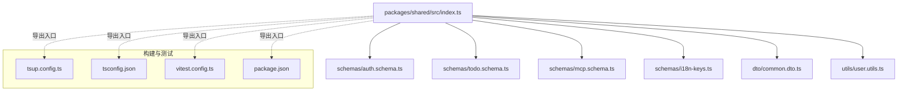
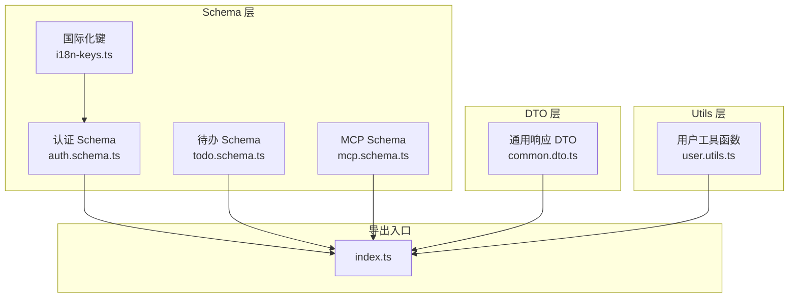
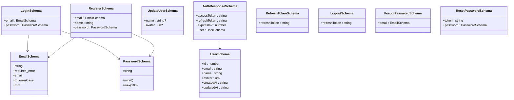
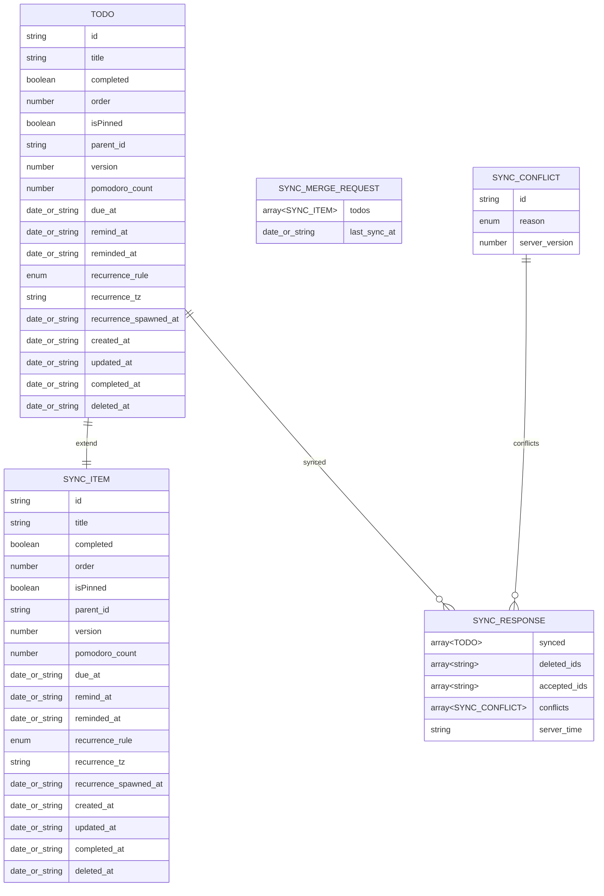
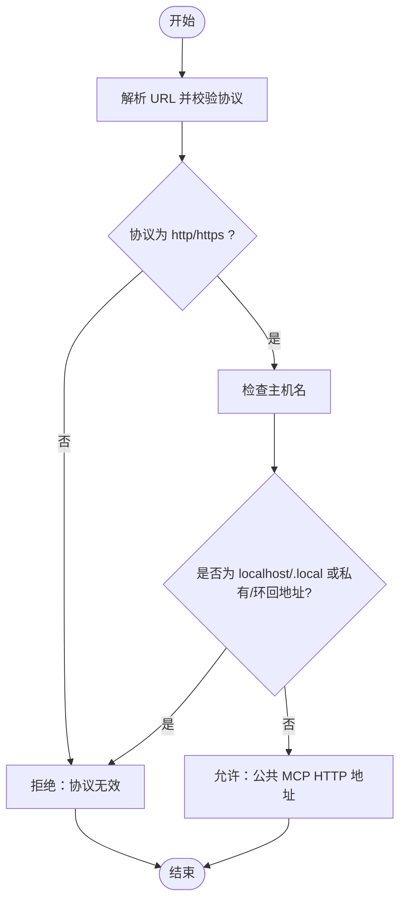
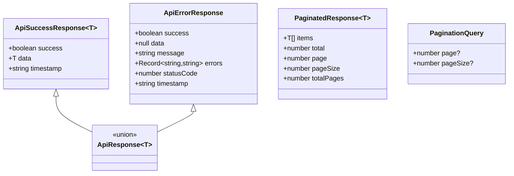
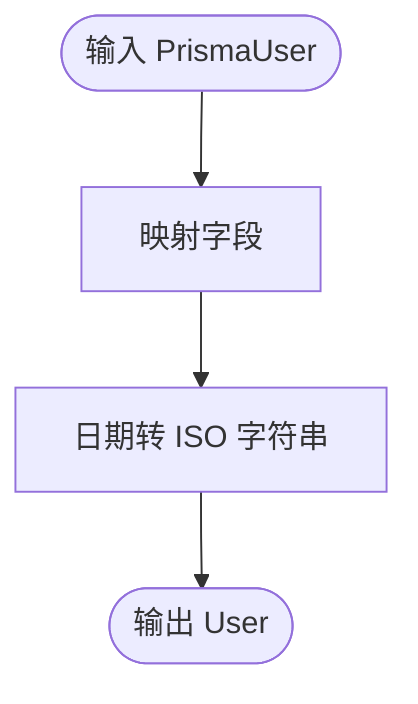
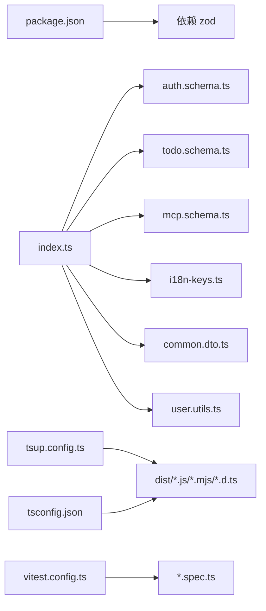

# 共享包开发

<cite>
**本文引用的文件**
- [packages/shared/package.json](file://packages/shared/package.json)
- [packages/shared/src/index.ts](file://packages/shared/src/index.ts)
- [packages/shared/tsconfig.json](file://packages/shared/tsconfig.json)
- [packages/shared/tsup.config.ts](file://packages/shared/tsup.config.ts)
- [packages/shared/vitest.config.ts](file://packages/shared/vitest.config.ts)
- [packages/shared/src/schemas/auth.schema.ts](file://packages/shared/src/schemas/auth.schema.ts)
- [packages/shared/src/schemas/todo.schema.ts](file://packages/shared/src/schemas/todo.schema.ts)
- [packages/shared/src/schemas/mcp.schema.ts](file://packages/shared/src/schemas/mcp.schema.ts)
- [packages/shared/src/schemas/i18n-keys.ts](file://packages/shared/src/schemas/i18n-keys.ts)
- [packages/shared/src/dto/common.dto.ts](file://packages/shared/src/dto/common.dto.ts)
- [packages/shared/src/utils/user.utils.ts](file://packages/shared/src/utils/user.utils.ts)
- [packages/shared/src/utils/user.utils.spec.ts](file://packages/shared/src/utils/user.utils.spec.ts)
- [packages/shared/src/schemas/todo.schema.spec.ts](file://packages/shared/src/schemas/todo.schema.spec.ts)
- [packages/shared/src/schemas/mcp.schema.spec.ts](file://packages/shared/src/schemas/mcp.schema.spec.ts)
- [packages/shared/src/dto/common.dto.spec.ts](file://packages/shared/src/dto/common.dto.spec.ts)
</cite>

## 目录
1. [简介](#简介)
2. [项目结构](#项目结构)
3. [核心组件](#核心组件)
4. [架构总览](#架构总览)
5. [详细组件分析](#详细组件分析)
6. [依赖关系分析](#依赖关系分析)
7. [性能考量](#性能考量)
8. [故障排查指南](#故障排查指南)
9. [结论](#结论)
10. [附录](#附录)

## 简介
本指南面向需要在多项目间复用的共享包开发与维护，聚焦 packages/shared 的架构设计、模块组织、数据模型（Zod Schemas）、DTO 设计与验证规则、工具函数库、构建与发布配置、版本管理策略、TypeScript 类型最佳实践以及跨项目共享代码的开发规范与测试策略。目标是帮助团队建立一致的数据契约、统一的类型与验证体系，并确保跨项目的接口兼容性与可演进性。

## 项目结构
共享包采用“按职责分层”的目录组织方式：
- src/index.ts：统一导出入口，聚合 schemas、dto、utils，形成单一可信来源
- src/schemas：基于 Zod 定义的领域模型与输入输出验证规则
- src/dto：通用响应 DTO 与类型守卫，用于前后端一致的 API 响应契约
- src/utils：与业务强相关的工具函数（如用户数据格式化）
- 构建与测试配置：tsup、tsconfig、vitest、eslint

图表来源
- [packages/shared/src/index.ts:1-22](file://packages/shared/src/index.ts#L1-L22)
- [packages/shared/tsup.config.ts:1-11](file://packages/shared/tsup.config.ts#L1-L11)
- [packages/shared/tsconfig.json:1-12](file://packages/shared/tsconfig.json#L1-L12)
- [packages/shared/vitest.config.ts:1-22](file://packages/shared/vitest.config.ts#L1-L22)
- [packages/shared/package.json:1-51](file://packages/shared/package.json#L1-L51)

章节来源
- [packages/shared/src/index.ts:1-22](file://packages/shared/src/index.ts#L1-L22)
- [packages/shared/tsconfig.json:1-12](file://packages/shared/tsconfig.json#L1-L12)
- [packages/shared/tsup.config.ts:1-11](file://packages/shared/tsup.config.ts#L1-L11)
- [packages/shared/vitest.config.ts:1-22](file://packages/shared/vitest.config.ts#L1-L22)
- [packages/shared/package.json:1-51](file://packages/shared/package.json#L1-L51)

## 核心组件
- 统一导出入口：通过 src/index.ts 暴露 Zod、各领域 Schema、通用 DTO 与工具函数，作为“单一可信来源”
- 领域模型（Schemas）：认证、待办、MCP 协议相关的核心实体与输入输出约束
- 通用 DTO：统一的成功/失败响应、分页、类型守卫与解包工具
- 工具函数：用户数据格式化（Prisma -> 应用模型），保证不可变转换
- 构建与测试：tsup 多格式打包、tsconfig 声明文件生成、vitest 覆盖率与 ESLint 规范

章节来源
- [packages/shared/src/index.ts:10-22](file://packages/shared/src/index.ts#L10-L22)
- [packages/shared/src/schemas/auth.schema.ts:1-121](file://packages/shared/src/schemas/auth.schema.ts#L1-L121)
- [packages/shared/src/schemas/todo.schema.ts:1-75](file://packages/shared/src/schemas/todo.schema.ts#L1-L75)
- [packages/shared/src/schemas/mcp.schema.ts:1-220](file://packages/shared/src/schemas/mcp.schema.ts#L1-L220)
- [packages/shared/src/dto/common.dto.ts:1-81](file://packages/shared/src/dto/common.dto.ts#L1-L81)
- [packages/shared/src/utils/user.utils.ts:1-36](file://packages/shared/src/utils/user.utils.ts#L1-L36)

## 架构总览
共享包遵循“Schema 驱动 + DTO 统一 + 工具函数内聚”的设计原则：
- Schema 层：以 Zod 为核心，定义严格的输入/输出契约，支持国际化验证键
- DTO 层：提供统一的响应格式与类型守卫，便于上层服务/前端消费
- Utils 层：封装与业务强相关的数据转换，保持不可变与可测试性
- 构建层：多格式输出（CJS/ESM）、声明文件、SourceMap，便于下游项目直接使用

图表来源
- [packages/shared/src/index.ts:10-22](file://packages/shared/src/index.ts#L10-L22)
- [packages/shared/src/schemas/auth.schema.ts:1-121](file://packages/shared/src/schemas/auth.schema.ts#L1-L121)
- [packages/shared/src/schemas/todo.schema.ts:1-75](file://packages/shared/src/schemas/todo.schema.ts#L1-L75)
- [packages/shared/src/schemas/mcp.schema.ts:1-220](file://packages/shared/src/schemas/mcp.schema.ts#L1-L220)
- [packages/shared/src/schemas/i18n-keys.ts:1-13](file://packages/shared/src/schemas/i18n-keys.ts#L1-L13)
- [packages/shared/src/dto/common.dto.ts:1-81](file://packages/shared/src/dto/common.dto.ts#L1-L81)
- [packages/shared/src/utils/user.utils.ts:1-36](file://packages/shared/src/utils/user.utils.ts#L1-L36)

## 详细组件分析

### 认证 Schema（auth.schema.ts）
- 邮箱与密码的通用验证规则，统一使用国际化键
- 登录、注册、更新用户信息、用户信息、认证响应、刷新/登出、找回/重置密码等输入输出模型
- 使用 Zod 的 infer 推导出强类型输入/输出

图表来源
- [packages/shared/src/schemas/auth.schema.ts:7-121](file://packages/shared/src/schemas/auth.schema.ts#L7-L121)

章节来源
- [packages/shared/src/schemas/auth.schema.ts:1-121](file://packages/shared/src/schemas/auth.schema.ts#L1-L121)
- [packages/shared/src/schemas/i18n-keys.ts:1-13](file://packages/shared/src/schemas/i18n-keys.ts#L1-L13)

### 待办 Schema（todo.schema.ts）
- Todo 基础模型：UUID 主键、标题长度限制、布尔状态、排序、置顶、父节点、版本号、番茄钟计数、到期/提醒/已提醒时间、周期规则与时区、创建/更新/完成/删除时间
- 同步模型：扩展 Todo，支持批量同步与冲突类型
- 同步响应：返回已同步、删除 ID、接受 ID、冲突集合与服务端时间

图表来源
- [packages/shared/src/schemas/todo.schema.ts:8-75](file://packages/shared/src/schemas/todo.schema.ts#L8-L75)

章节来源
- [packages/shared/src/schemas/todo.schema.ts:1-75](file://packages/shared/src/schemas/todo.schema.ts#L1-L75)

### MCP 协议 Schema（mcp.schema.ts）
- 传输类型枚举：STDIO 与 HTTP
- HTTP URL 白名单校验：禁止 localhost、.local、私有/环回地址
- Stdio/Http 配置 Schema：命令行参数、环境变量、工作目录、URL、头部、鉴权（Bearer/API Key/OAuth）
- 服务器配置：创建/更新 Schema，强制 transport 与 config 匹配；更新时要求 transport 与 config 成对出现
- 工具调用与响应类型：工具名称、参数、服务器元信息、工具元信息、调用结果

图表来源
- [packages/shared/src/schemas/mcp.schema.ts:63-74](file://packages/shared/src/schemas/mcp.schema.ts#L63-L74)

章节来源
- [packages/shared/src/schemas/mcp.schema.ts:1-220](file://packages/shared/src/schemas/mcp.schema.ts#L1-L220)

### 通用 DTO（common.dto.ts）
- 成功/错误响应接口与严格判别联合类型
- 类型守卫：区分成功与错误响应
- 解包工具：统一提取 data，错误时抛出异常
- 分页响应与查询参数

图表来源
- [packages/shared/src/dto/common.dto.ts:4-81](file://packages/shared/src/dto/common.dto.ts#L4-L81)

章节来源
- [packages/shared/src/dto/common.dto.ts:1-81](file://packages/shared/src/dto/common.dto.ts#L1-L81)

### 工具函数库（user.utils.ts）
- PrismaUser 与应用 User 的不可变转换
- 单个与批量格式化，保证不修改原对象

图表来源
- [packages/shared/src/utils/user.utils.ts:19-35](file://packages/shared/src/utils/user.utils.ts#L19-L35)

章节来源
- [packages/shared/src/utils/user.utils.ts:1-36](file://packages/shared/src/utils/user.utils.ts#L1-L36)
- [packages/shared/src/utils/user.utils.spec.ts:1-59](file://packages/shared/src/utils/user.utils.spec.ts#L1-L59)

## 依赖关系分析
- 内部依赖：index.ts 统一导出所有模块；认证 Schema 引用国际化键
- 外部依赖：Zod 作为验证核心
- 构建与测试：tsup 输出 CJS/ESM 与声明文件；tsconfig 控制编译；vitest 提供覆盖率与断言

图表来源
- [packages/shared/package.json:40-49](file://packages/shared/package.json#L40-L49)
- [packages/shared/src/index.ts:10-22](file://packages/shared/src/index.ts#L10-L22)
- [packages/shared/tsup.config.ts:1-11](file://packages/shared/tsup.config.ts#L1-L11)
- [packages/shared/tsconfig.json:1-12](file://packages/shared/tsconfig.json#L1-L12)
- [packages/shared/vitest.config.ts:1-22](file://packages/shared/vitest.config.ts#L1-L22)

章节来源
- [packages/shared/package.json:1-51](file://packages/shared/package.json#L1-L51)
- [packages/shared/src/index.ts:10-22](file://packages/shared/src/index.ts#L10-L22)

## 性能考量
- Schema 验证：尽量在边界处一次性验证，避免重复解析
- DTO 解包：统一在上层处理，减少分支判断开销
- 工具函数：不可变转换成本低，但注意大数组批量处理时的内存占用
- 构建优化：启用 SourceMap 便于调试；多格式输出兼顾不同运行时需求

## 故障排查指南
- 测试驱动验证：通过 *.spec.ts 文件定位问题范围
  - 认证：验证必填、长度、邮箱格式、URL 格式等
  - 待办：周期规则、时间字段、UUID 约束
  - MCP：HTTP 协议与主机名校验、传输与配置一致性
  - DTO：成功/错误响应类型守卫与解包行为
- 常见问题
  - 本地/私有地址被拒：确认 MCP HTTP URL 使用公网地址
  - 传输与配置不匹配：更新时需同时提供 transport 与 config
  - 用户数据格式化：确保 Date 正确转为 ISO 字符串，避免原对象被修改

章节来源
- [packages/shared/src/schemas/auth.schema.ts:1-121](file://packages/shared/src/schemas/auth.schema.ts#L1-L121)
- [packages/shared/src/schemas/todo.schema.ts:1-75](file://packages/shared/src/schemas/todo.schema.ts#L1-L75)
- [packages/shared/src/schemas/mcp.schema.ts:1-220](file://packages/shared/src/schemas/mcp.schema.ts#L1-L220)
- [packages/shared/src/dto/common.dto.ts:1-81](file://packages/shared/src/dto/common.dto.ts#L1-L81)
- [packages/shared/src/utils/user.utils.ts:1-36](file://packages/shared/src/utils/user.utils.ts#L1-L36)
- [packages/shared/src/schemas/todo.schema.spec.ts:1-39](file://packages/shared/src/schemas/todo.schema.spec.ts#L1-L39)
- [packages/shared/src/schemas/mcp.schema.spec.ts:1-67](file://packages/shared/src/schemas/mcp.schema.spec.ts#L1-L67)
- [packages/shared/src/dto/common.dto.spec.ts:1-48](file://packages/shared/src/dto/common.dto.spec.ts#L1-L48)
- [packages/shared/src/utils/user.utils.spec.ts:1-59](file://packages/shared/src/utils/user.utils.spec.ts#L1-L59)

## 结论
共享包通过“Schema 驱动 + DTO 统一 + 工具函数内聚”的设计，实现了跨项目的类型安全与接口一致性。借助完善的测试策略与构建配置，能够稳定地支撑多端（后端、前端、桌面端）消费。建议在后续迭代中持续完善国际化键覆盖、边界场景测试与性能监控，确保长期可维护性与演进空间。

## 附录

### 构建配置与发布流程
- 构建
  - 多格式输出：CJS 与 ESM
  - 声明文件与 SourceMap
  - 清理输出目录
- 发布
  - 私有包：当前为私有，发布策略由仓库管理决定
  - 版本管理：语义化版本控制，变更记录与标签管理
- 质量保障
  - 类型检查：tsc
  - 单测与覆盖率：vitest
  - 代码风格：ESLint

章节来源
- [packages/shared/tsup.config.ts:1-11](file://packages/shared/tsup.config.ts#L1-L11)
- [packages/shared/tsconfig.json:1-12](file://packages/shared/tsconfig.json#L1-L12)
- [packages/shared/package.json:28-39](file://packages/shared/package.json#L28-L39)
- [packages/shared/vitest.config.ts:1-22](file://packages/shared/vitest.config.ts#L1-L22)

### TypeScript 类型最佳实践与接口兼容性
- 使用 Zod 的 infer 推导强类型，避免手写重复类型
- 通过严格判别联合与类型守卫，确保运行时安全
- 对外暴露的 DTO 保持稳定字段与可选扩展，避免破坏性变更
- 工具函数保持纯函数与不可变转换，便于测试与复用

### 跨项目共享代码的开发规范与测试策略
- 规范
  - 所有输入/输出必须通过对应 Schema 验证
  - DTO 仅承载结构化响应，不包含业务逻辑
  - 工具函数聚焦单一职责，保持无副作用
- 测试
  - 为每个 Schema 编写正反例测试
  - 为 DTO 类型守卫与解包逻辑编写边界测试
  - 为工具函数编写不可变性与空值处理测试