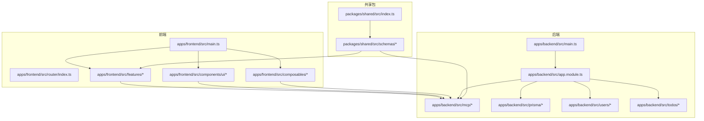
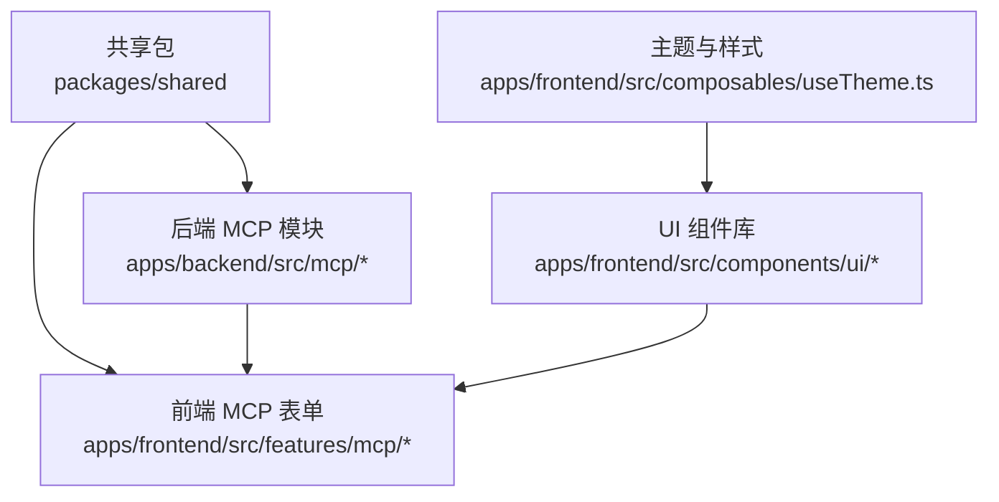
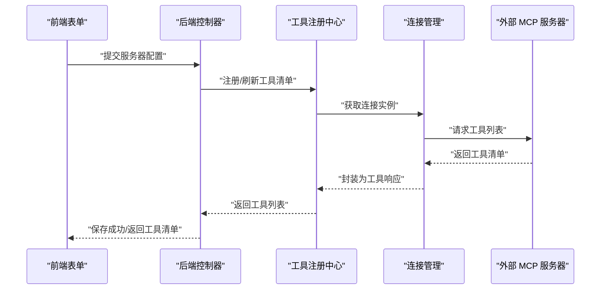
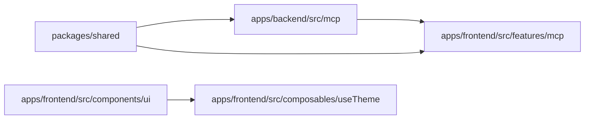

# 扩展开发

<cite>
**本文引用的文件**
- [packages/shared/src/index.ts](file://packages/shared/src/index.ts)
- [packages/shared/src/schemas/mcp.schema.ts](file://packages/shared/src/schemas/mcp.schema.ts)
- [packages/shared/src/schemas/todo.schema.ts](file://packages/shared/src/schemas/todo.schema.ts)
- [apps/backend/src/mcp/mcp.module.ts](file://apps/backend/src/mcp/mcp.module.ts)
- [apps/backend/src/mcp/core/mcp-tool.registry.ts](file://apps/backend/src/mcp/core/mcp-tool.registry.ts)
- [apps/backend/src/mcp/mcp.controller.ts](file://apps/backend/src/mcp/mcp.controller.ts)
- [apps/frontend/src/features/mcp/components/McpServerForm.vue](file://apps/frontend/src/features/mcp/components/McpServerForm.vue)
- [apps/frontend/src/features/mcp/components/McpServerStdioConfig.vue](file://apps/frontend/src/features/mcp/components/McpServerStdioConfig.vue)
- [apps/frontend/src/components/ui/button/Button.vue](file://apps/frontend/src/components/ui/button/Button.vue)
- [apps/frontend/src/composables/useTheme.ts](file://apps/frontend/src/composables/useTheme.ts)
- [apps/backend/src/app.module.ts](file://apps/backend/src/app.module.ts)
- [apps/frontend/src/lib/wails.ts](file://apps/frontend/src/lib/wails.ts)
- [CONTRIBUTING.md](file://CONTRIBUTING.md)
- [packages/shared/package.json](file://packages/shared/package.json)
</cite>

## 目录
1. [简介](#简介)
2. [项目结构](#项目结构)
3. [核心组件](#核心组件)
4. [架构总览](#架构总览)
5. [详细组件分析](#详细组件分析)
6. [依赖关系分析](#依赖关系分析)
7. [性能考量](#性能考量)
8. [故障排查指南](#故障排查指南)
9. [结论](#结论)
10. [附录](#附录)

## 简介
本指南面向希望在 Lumina Todo 中进行扩展开发的开发者，覆盖以下主题：
- 共享包 packages/shared 的架构与接口规范
- MCP 协议扩展机制与自定义工具开发
- 插件系统架构设计与开发指南
- 自定义 UI 组件开发规范与最佳实践
- 第三方服务集成方法与接口适配
- 配置系统的扩展与自定义选项
- 主题与样式系统的扩展指南
- 数据模型扩展与迁移策略
- API 的扩展与版本管理
- 社区贡献与开源协作指导原则
- 扩展开发的测试与发布流程

## 项目结构
Lumina Todo 采用多包工作区（monorepo）组织方式，核心模块包括：
- apps/backend：基于 NestJS 的后端服务，包含认证、定时任务、MCP 管理、待办同步等业务模块
- apps/frontend：基于 Vue 3 的 Web 前端，包含 UI 组件库、AI 功能、MCP 设置界面等
- apps/wails：基于 Go 的桌面壳层（Capacitor/原生桥接）
- packages/shared：共享的 Zod Schema、DTO 与工具函数，统一前后端数据契约

图表来源
- [apps/backend/src/app.module.ts:160-160](file://apps/backend/src/app.module.ts#L160-L160)
- [apps/frontend/src/main.ts:1-200](file://apps/frontend/src/main.ts#L1-L200)
- [packages/shared/src/index.ts:10-22](file://packages/shared/src/index.ts#L10-L22)

章节来源
- [apps/backend/src/app.module.ts:160-160](file://apps/backend/src/app.module.ts#L160-L160)
- [apps/frontend/src/main.ts:1-200](file://apps/frontend/src/main.ts#L1-L200)
- [packages/shared/src/index.ts:10-22](file://packages/shared/src/index.ts#L10-L22)

## 核心组件
本节聚焦于扩展开发中最常用的共享契约与协议层。

- 共享包导出清单
  - Zod 校验器与 Schema：认证、待办、MCP、国际化键等
  - 通用 DTO：统一响应结构
  - 工具函数：用户相关工具

- MCP 协议 Schema
  - 传输类型：STDIO 与 HTTP
  - HTTP 配置：URL、Headers、认证（Bearer/API Key/OAuth）
  - 工具调用参数与响应结构
  - 服务器配置的创建/更新/查询/删除

- 待办 Schema
  - 待办基础字段、递归规则与时区
  - 同步请求/响应与冲突类型

章节来源
- [packages/shared/src/index.ts:10-22](file://packages/shared/src/index.ts#L10-L22)
- [packages/shared/src/schemas/mcp.schema.ts:1-220](file://packages/shared/src/schemas/mcp.schema.ts#L1-L220)
- [packages/shared/src/schemas/todo.schema.ts:1-75](file://packages/shared/src/schemas/todo.schema.ts#L1-L75)

## 架构总览
Lumina Todo 的扩展能力围绕“共享契约 + 后端服务 + 前端界面”三层展开：
- 共享契约：packages/shared 统一数据模型与校验
- 后端服务：NestJS 模块化提供 API、连接管理、工具注册与缓存
- 前端界面：Vue 组件承载 MCP 配置表单、UI 组件库与主题系统

图表来源
- [packages/shared/src/schemas/mcp.schema.ts:1-220](file://packages/shared/src/schemas/mcp.schema.ts#L1-L220)
- [apps/backend/src/mcp/mcp.module.ts:1-25](file://apps/backend/src/mcp/mcp.module.ts#L1-L25)
- [apps/frontend/src/features/mcp/components/McpServerForm.vue:1-188](file://apps/frontend/src/features/mcp/components/McpServerForm.vue#L1-L188)
- [apps/frontend/src/components/ui/button/Button.vue:1-32](file://apps/frontend/src/components/ui/button/Button.vue#L1-L32)
- [apps/frontend/src/composables/useTheme.ts:1-248](file://apps/frontend/src/composables/useTheme.ts#L1-L248)

## 详细组件分析

### 共享包设计与使用（packages/shared）
- 设计目标
  - 以 Zod Schema 作为“单一事实源”，保证前后端一致的数据契约
  - 将认证、待办、MCP、国际化键等核心 Schema 暴露为统一入口
  - 提供通用 DTO 与工具函数，降低重复实现

- 接口规范
  - 导出 zod 实例，便于复用校验器
  - 导出各领域 Schema：认证、待办、MCP、国际化键
  - 导出通用 DTO 与工具函数

- 开发建议
  - 新增或修改 Schema 时，保持字段语义清晰、默认值合理
  - 对外暴露的 DTO 保持稳定，必要时通过版本号或命名空间隔离变更
  - 在前端与后端同时消费同一份 Schema，避免“各自为政”的数据差异

章节来源
- [packages/shared/src/index.ts:10-22](file://packages/shared/src/index.ts#L10-L22)
- [packages/shared/package.json:1-51](file://packages/shared/package.json#L1-L51)

### MCP 协议扩展机制与自定义工具开发
- 后端模块职责
  - 模块装配：控制器、客户端、传输工厂、连接管理、工具注册
  - 控制器提供 MCP 服务器的 CRUD 与列表查询
  - 工具注册：拉取远端工具清单并缓存，支持刷新与清理

- 前端表单与交互
  - 表单组件按传输类型动态渲染 Stdio 或 HTTP 配置
  - 支持命令参数、环境变量、认证头、Bearer/API Key/OAuth 等
  - 提交前对配置进行标准化与条件性剔除空值

- 扩展步骤
  - 在共享包中完善/新增 Schema（如新字段、认证类型）
  - 在后端模块中对接传输工厂与连接管理，实现工具发现与调用
  - 在前端表单中补充对应配置项，并在提交时构造标准 DTO
  - 通过控制器暴露管理接口，供前端设置与查看

图表来源
- [apps/backend/src/mcp/mcp.controller.ts:54-101](file://apps/backend/src/mcp/mcp.controller.ts#L54-L101)
- [apps/backend/src/mcp/core/mcp-tool.registry.ts:1-48](file://apps/backend/src/mcp/core/mcp-tool.registry.ts#L1-L48)
- [apps/frontend/src/features/mcp/components/McpServerForm.vue:100-135](file://apps/frontend/src/features/mcp/components/McpServerForm.vue#L100-L135)

章节来源
- [apps/backend/src/mcp/mcp.module.ts:1-25](file://apps/backend/src/mcp/mcp.module.ts#L1-L25)
- [apps/backend/src/mcp/mcp.controller.ts:54-101](file://apps/backend/src/mcp/mcp.controller.ts#L54-L101)
- [apps/backend/src/mcp/core/mcp-tool.registry.ts:1-48](file://apps/backend/src/mcp/core/mcp-tool.registry.ts#L1-L48)
- [apps/frontend/src/features/mcp/components/McpServerForm.vue:1-188](file://apps/frontend/src/features/mcp/components/McpServerForm.vue#L1-L188)
- [packages/shared/src/schemas/mcp.schema.ts:1-220](file://packages/shared/src/schemas/mcp.schema.ts#L1-L220)

### 插件系统架构设计与开发指南
- 架构思路
  - 插件即“可插拔的 MCP 服务器”，通过统一的传输与认证机制接入
  - 插件生命周期：注册 -> 连接 -> 发现工具 -> 调用工具 -> 断开
  - 插件配置存储于后端数据库，前端提供可视化配置界面

- 开发流程
  - 定义插件 Schema（传输、认证、参数）
  - 实现传输工厂与连接管理，支持 STDIO 与 HTTP
  - 注册工具清单到缓存，提供刷新与清理能力
  - 在前端表单中渲染配置项，提交时构造标准 DTO

- 最佳实践
  - 严格区分“配置”与“运行时参数”，前者持久化，后者按需传递
  - 对外部服务器进行安全校验（仅允许公网地址、禁止私有/本地域名）
  - 提供工具调用结果的标准化结构，便于前端展示

章节来源
- [apps/backend/src/mcp/mcp.module.ts:1-25](file://apps/backend/src/mcp/mcp.module.ts#L1-L25)
- [apps/backend/src/mcp/core/mcp-tool.registry.ts:1-48](file://apps/backend/src/mcp/core/mcp-tool.registry.ts#L1-L48)
- [apps/frontend/src/features/mcp/components/McpServerStdioConfig.vue:1-57](file://apps/frontend/src/features/mcp/components/McpServerStdioConfig.vue#L1-L57)
- [packages/shared/src/schemas/mcp.schema.ts:1-220](file://packages/shared/src/schemas/mcp.schema.ts#L1-L220)

### 自定义 UI 组件开发规范与最佳实践
- 规范
  - 组件属性使用受控模型（v-model），保持与父组件的双向绑定
  - 使用统一的变体与尺寸体系，遵循现有组件库风格
  - 事件命名与参数结构保持一致，便于组合与复用

- 示例参考
  - Button 组件：通过变体与尺寸控制外观，支持原生标签映射
  - 表单组件：在提交前进行数据准备与标准化

章节来源
- [apps/frontend/src/components/ui/button/Button.vue:1-32](file://apps/frontend/src/components/ui/button/Button.vue#L1-L32)
- [apps/frontend/src/features/mcp/components/McpServerForm.vue:1-188](file://apps/frontend/src/features/mcp/components/McpServerForm.vue#L1-L188)

### 第三方服务集成的方法与接口适配
- 方法论
  - 通过共享包 Schema 定义第三方服务的配置与调用参数
  - 在后端模块中实现适配器，负责认证、序列化与错误处理
  - 在前端提供配置表单，支持多种认证方式（Bearer、API Key、OAuth）

- 接口适配要点
  - URL 白名单与主机名过滤，避免私有/本地网络访问
  - 认证头与令牌的可选配置，按需注入
  - 结果标准化，统一 content 结构与错误标记

章节来源
- [packages/shared/src/schemas/mcp.schema.ts:63-116](file://packages/shared/src/schemas/mcp.schema.ts#L63-L116)
- [apps/frontend/src/features/mcp/components/McpServerForm.vue:100-135](file://apps/frontend/src/features/mcp/components/McpServerForm.vue#L100-L135)

### 配置系统的扩展与自定义选项
- 后端配置
  - 使用 ConfigModule 提供全局配置读取
  - 速率限制、日志、队列等基础设施通过配置模块集中管理
  - 国际化模块支持多语言加载与解析器

- 前端配置
  - 通过 useTheme 管理主题与颜色，支持随机色与持久化存储
  - 通过 composables 统一管理请求、窗口尺寸、主题切换等

章节来源
- [apps/backend/src/app.module.ts:28-148](file://apps/backend/src/app.module.ts#L28-L148)
- [apps/frontend/src/composables/useTheme.ts:1-248](file://apps/frontend/src/composables/useTheme.ts#L1-L248)

### 主题与样式系统的扩展指南
- 扩展点
  - CSS 变量：通过 --user-primary 系列变量注入用户主色
  - 颜色计算：提供 HSL/RGB 转换与明暗色生成
  - 随机主题：周期性更换预设色，减少视觉疲劳

- 最佳实践
  - 保持主色饱和度与亮度在舒适区间
  - 明暗两套色值需分别生成，确保对比度符合可访问性要求
  - 随机切换间隔建议较长，避免频繁打断用户注意力

章节来源
- [apps/frontend/src/composables/useTheme.ts:132-186](file://apps/frontend/src/composables/useTheme.ts#L132-L186)
- [apps/frontend/src/composables/useTheme.ts:200-246](file://apps/frontend/src/composables/useTheme.ts#L200-L246)

### 数据模型的扩展与迁移策略
- 扩展策略
  - 在共享包中新增或修改 Schema，保持向后兼容
  - 对于破坏性变更，引入版本字段或命名空间隔离
  - 在后端服务中通过 Prisma 迁移管理数据库结构演进

- 迁移建议
  - 优先在共享包中完成 Schema 设计，再在后端落地
  - 对历史数据提供默认值与回填策略，避免迁移失败
  - 对外暴露的 DTO 保持稳定，必要时通过版本号区分

章节来源
- [packages/shared/src/schemas/todo.schema.ts:1-75](file://packages/shared/src/schemas/todo.schema.ts#L1-L75)
- [packages/shared/src/schemas/mcp.schema.ts:1-220](file://packages/shared/src/schemas/mcp.schema.ts#L1-L220)

### API 的扩展与版本管理
- 版本管理
  - 在共享包中维护稳定的 Schema 与 DTO
  - 对外接口采用语义化版本控制，避免破坏性变更
  - 通过命名空间或路径前缀区分不同版本

- 扩展步骤
  - 在共享包中定义新版本 Schema
  - 在后端控制器中新增路由与处理器
  - 在前端组件中适配新旧版本，提供平滑过渡

章节来源
- [packages/shared/src/index.ts:10-22](file://packages/shared/src/index.ts#L10-L22)
- [apps/backend/src/mcp/mcp.controller.ts:54-101](file://apps/backend/src/mcp/mcp.controller.ts#L54-L101)

### 社区贡献与开源协作指导原则
- 行为准则与安全披露
  - 遵循项目行为准则与安全政策
- 开发环境与流程
  - 使用 pnpm、Node.js、Docker 等工具链
  - 通过 Conventional Commits 提交信息
  - 通过 Pull Request 流程协作，确保质量门禁

章节来源
- [CONTRIBUTING.md:1-87](file://CONTRIBUTING.md#L1-L87)

### 扩展开发的测试与发布流程
- 测试
  - 前端：组件单元测试、组合式函数测试、特性测试
  - 后端：服务层测试、控制器测试、集成测试
  - 共享包：Schema 与工具函数测试

- 发布
  - 共享包：构建产物输出至 dist，通过 package.json 的 exports 字段暴露
  - 前后端：遵循 Conventional Commits，配合 CI/CD 自动化发布

章节来源
- [packages/shared/package.json:28-39](file://packages/shared/package.json#L28-L39)
- [CONTRIBUTING.md:55-87](file://CONTRIBUTING.md#L55-L87)

## 依赖关系分析
- 模块耦合
  - 前端 MCP 表单依赖共享包中的传输与认证 Schema
  - 后端 MCP 模块通过传输工厂与连接管理实现工具注册
  - UI 组件库与主题系统解耦，便于独立扩展

- 外部依赖
  - NestJS：模块化、装饰器、拦截器、守卫
  - Vue 3：组合式 API、响应式系统、组件生态
  - Zod：强类型校验与类型推断

图表来源
- [packages/shared/src/schemas/mcp.schema.ts:1-220](file://packages/shared/src/schemas/mcp.schema.ts#L1-L220)
- [apps/backend/src/mcp/mcp.module.ts:1-25](file://apps/backend/src/mcp/mcp.module.ts#L1-L25)
- [apps/frontend/src/features/mcp/components/McpServerForm.vue:1-188](file://apps/frontend/src/features/mcp/components/McpServerForm.vue#L1-L188)
- [apps/frontend/src/components/ui/button/Button.vue:1-32](file://apps/frontend/src/components/ui/button/Button.vue#L1-L32)
- [apps/frontend/src/composables/useTheme.ts:1-248](file://apps/frontend/src/composables/useTheme.ts#L1-L248)

章节来源
- [apps/backend/src/mcp/mcp.module.ts:1-25](file://apps/backend/src/mcp/mcp.module.ts#L1-L25)
- [apps/frontend/src/features/mcp/components/McpServerForm.vue:1-188](file://apps/frontend/src/features/mcp/components/McpServerForm.vue#L1-L188)
- [apps/frontend/src/components/ui/button/Button.vue:1-32](file://apps/frontend/src/components/ui/button/Button.vue#L1-L32)
- [apps/frontend/src/composables/useTheme.ts:1-248](file://apps/frontend/src/composables/useTheme.ts#L1-L248)

## 性能考量
- 工具清单缓存
  - 工具注册中心对工具清单进行缓存，减少重复拉取
  - 提供刷新与清理接口，保障数据一致性

- 传输与认证
  - HTTP 传输仅允许公网地址，避免内网慢速或阻塞
  - 认证头与令牌按需注入，减少不必要的网络开销

- 前端渲染
  - 表单组件按需渲染配置区域，减少 DOM 体积
  - 使用组合式动画与过渡，提升交互体验

章节来源
- [apps/backend/src/mcp/core/mcp-tool.registry.ts:12-46](file://apps/backend/src/mcp/core/mcp-tool.registry.ts#L12-L46)
- [packages/shared/src/schemas/mcp.schema.ts:63-116](file://packages/shared/src/schemas/mcp.schema.ts#L63-L116)
- [apps/frontend/src/features/mcp/components/McpServerForm.vue:138-188](file://apps/frontend/src/features/mcp/components/McpServerForm.vue#L138-L188)

## 故障排查指南
- 常见问题
  - 传输与配置不匹配：检查传输类型与配置字段是否一致
  - 认证失败：确认令牌、API Key 与认证头是否正确
  - 工具未显示：尝试刷新工具清单或检查连接状态

- 排查步骤
  - 查看后端日志与错误码，定位具体环节
  - 在前端表单中逐步验证配置项，排除无效输入
  - 使用共享包 Schema 进行本地校验，确保数据结构正确

章节来源
- [apps/backend/src/mcp/mcp.controller.ts:54-101](file://apps/backend/src/mcp/mcp.controller.ts#L54-L101)
- [apps/backend/src/mcp/core/mcp-tool.registry.ts:20-46](file://apps/backend/src/mcp/core/mcp-tool.registry.ts#L20-L46)
- [packages/shared/src/schemas/mcp.schema.ts:134-172](file://packages/shared/src/schemas/mcp.schema.ts#L134-L172)

## 结论
通过共享包统一数据契约、后端模块化提供 MCP 管理能力、前端组件化承载配置与交互，Lumina Todo 为扩展开发提供了清晰的路径。遵循本文档的规范与流程，开发者可以高效地扩展 MCP 插件、UI 组件、主题样式与第三方服务，同时确保数据一致性与系统稳定性。

## 附录
- 桌面端桥接示例：前端通过 Wails 调用 Go 层系统操作（如打开浏览器、退出应用）
- 建议在扩展开发前先阅读贡献指南，确保符合社区协作规范

章节来源
- [apps/frontend/src/lib/wails.ts:50-91](file://apps/frontend/src/lib/wails.ts#L50-L91)
- [CONTRIBUTING.md:1-87](file://CONTRIBUTING.md#L1-L87)