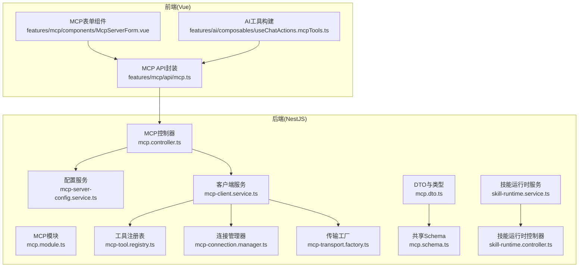
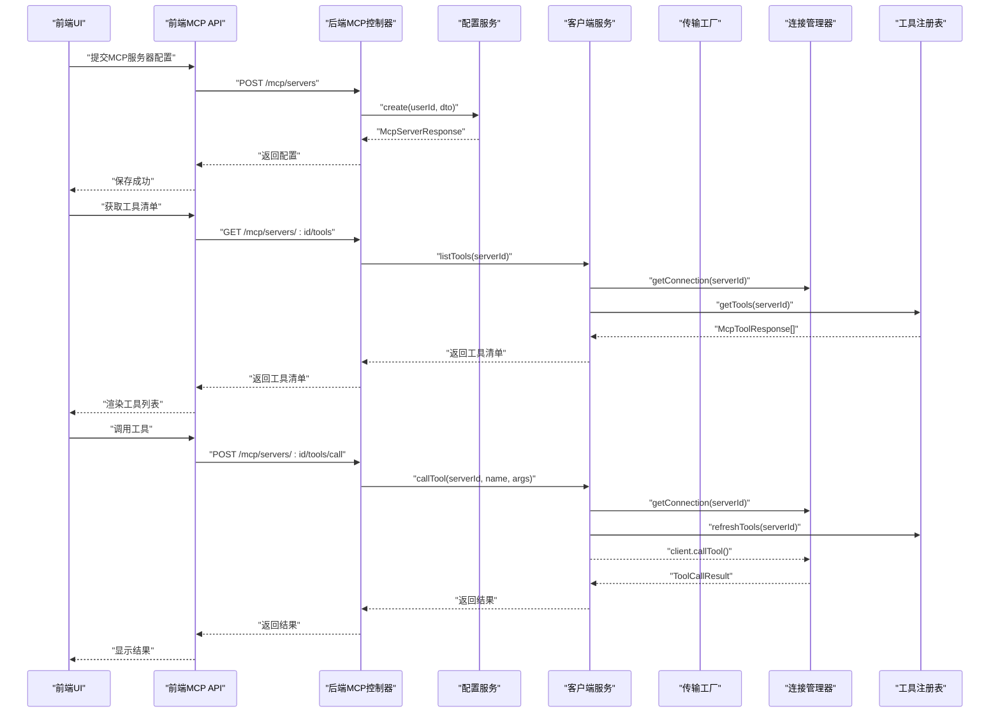
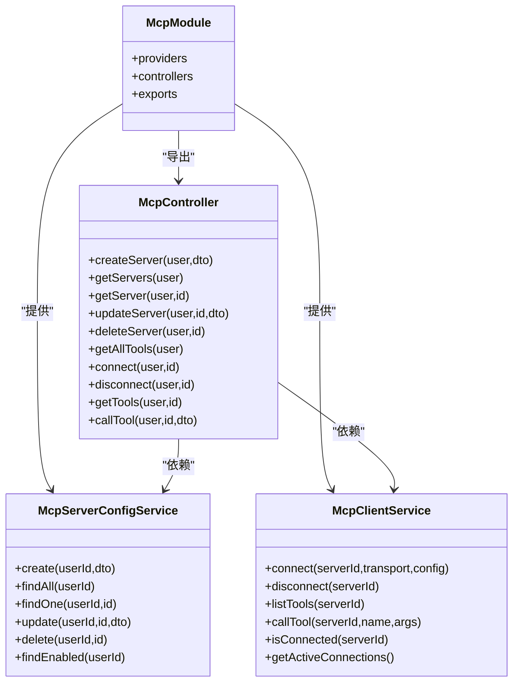
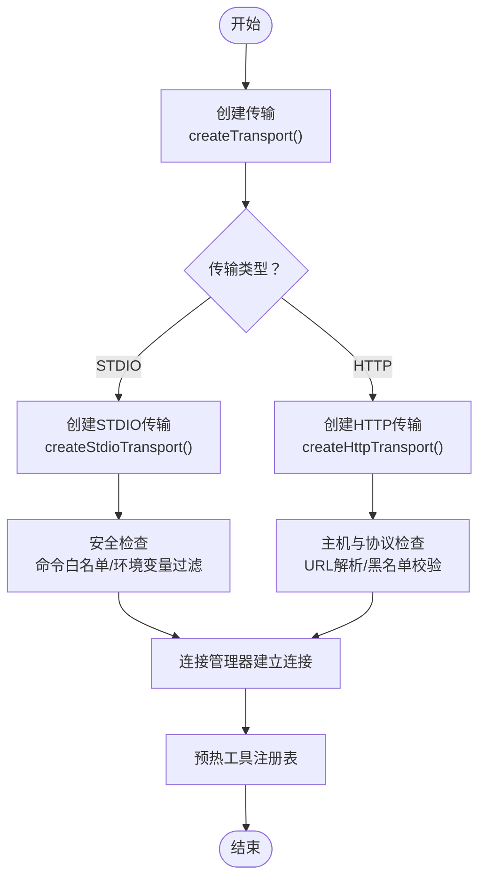
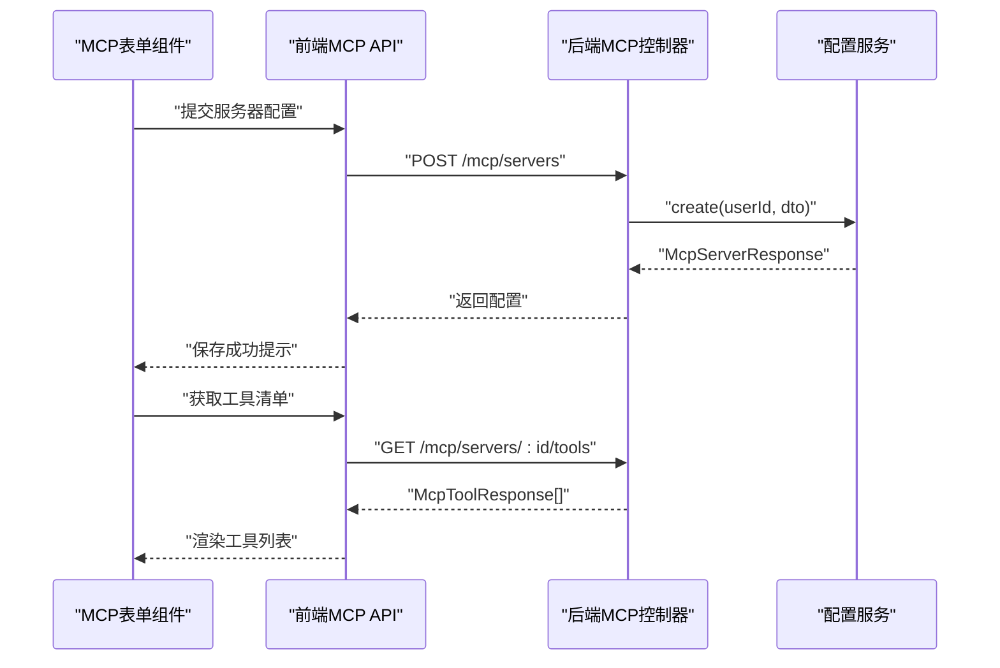
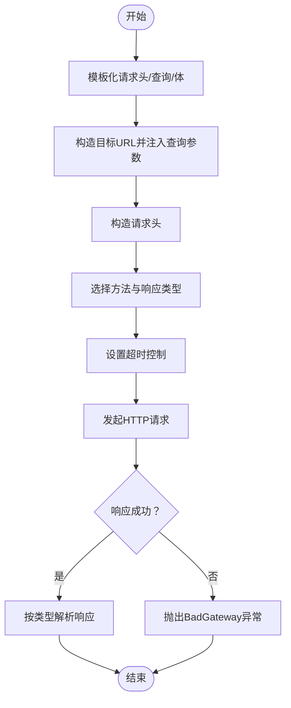
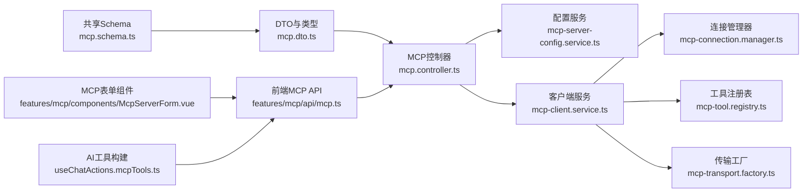

# 扩展开发

<cite>
**本文引用的文件**
- [apps/backend/src/mcp/mcp.module.ts](file://apps/backend/src/mcp/mcp.module.ts)
- [apps/backend/src/mcp/mcp.controller.ts](file://apps/backend/src/mcp/mcp.controller.ts)
- [apps/backend/src/mcp/mcp.dto.ts](file://apps/backend/src/mcp/mcp.dto.ts)
- [apps/backend/src/mcp/mcp-client.service.ts](file://apps/backend/src/mcp/mcp-client.service.ts)
- [apps/backend/src/mcp/mcp-server-config.service.ts](file://apps/backend/src/mcp/mcp-server-config.service.ts)
- [apps/backend/src/mcp/core/mcp-transport.factory.ts](file://apps/backend/src/mcp/core/mcp-transport.factory.ts)
- [apps/backend/src/mcp/core/mcp-connection.manager.ts](file://apps/backend/src/mcp/core/mcp-connection.manager.ts)
- [apps/backend/src/mcp/core/mcp-tool.registry.ts](file://apps/backend/src/mcp/core/mcp-tool.registry.ts)
- [packages/shared/src/schemas/mcp.schema.ts](file://packages/shared/src/schemas/mcp.schema.ts)
- [apps/frontend/src/features/mcp/api/mcp.ts](file://apps/frontend/src/features/mcp/api/mcp.ts)
- [apps/frontend/src/features/mcp/components/McpServerForm.vue](file://apps/frontend/src/features/mcp/components/McpServerForm.vue)
- [apps/frontend/src/features/ai/composables/useChatActions.mcpTools.ts](file://apps/frontend/src/features/ai/composables/useChatActions.mcpTools.ts)
- [apps/backend/src/skill-sources/skill-runtime.service.ts](file://apps/backend/src/skill-sources/skill-runtime.service.ts)
- [apps/backend/src/skill-sources/skill-runtime.controller.ts](file://apps/backend/src/skill-sources/skill-runtime.controller.ts)
</cite>

## 目录
1. [简介](#简介)
2. [项目结构](#项目结构)
3. [核心组件](#核心组件)
4. [架构总览](#架构总览)
5. [详细组件分析](#详细组件分析)
6. [依赖关系分析](#依赖关系分析)
7. [性能考量](#性能考量)
8. [故障排查指南](#故障排查指南)
9. [结论](#结论)
10. [附录](#附录)

## 简介
本指南面向Lumina Todo扩展开发者，聚焦于MCP（Model Context Protocol）工具系统的扩展机制，涵盖工具开发、注册与调用流程；插件架构的设计原理与实现方式；自定义组件开发、UI扩展与功能增强方法；第三方集成的最佳实践与安全考虑；API扩展、中间件开发与业务逻辑定制；以及扩展包的打包、发布与版本管理建议。文档同时提供开发工具链与调试支持路径，帮助快速上手并稳定交付。

## 项目结构
Lumina Todo采用前后端分离的多应用架构，MCP相关能力主要位于后端NestJS应用的mcp模块，前端Vue应用提供MCP配置与工具使用的UI入口。共享Schema在packages/shared中统一定义，确保前后端一致的数据契约。

**图表来源**
- [apps/backend/src/mcp/mcp.module.ts:1-25](file://apps/backend/src/mcp/mcp.module.ts#L1-L25)
- [apps/backend/src/mcp/mcp.controller.ts:1-209](file://apps/backend/src/mcp/mcp.controller.ts#L1-L209)
- [apps/backend/src/mcp/mcp-client.service.ts:1-124](file://apps/backend/src/mcp/mcp-client.service.ts#L1-L124)
- [apps/backend/src/mcp/mcp-server-config.service.ts:1-156](file://apps/backend/src/mcp/mcp-server-config.service.ts#L1-L156)
- [apps/backend/src/mcp/core/mcp-connection.manager.ts:1-101](file://apps/backend/src/mcp/core/mcp-connection.manager.ts#L1-L101)
- [apps/backend/src/mcp/core/mcp-tool.registry.ts:1-48](file://apps/backend/src/mcp/core/mcp-tool.registry.ts#L1-L48)
- [apps/backend/src/mcp/core/mcp-transport.factory.ts:1-220](file://apps/backend/src/mcp/core/mcp-transport.factory.ts#L1-L220)
- [apps/backend/src/mcp/mcp.dto.ts:1-59](file://apps/backend/src/mcp/mcp.dto.ts#L1-L59)
- [packages/shared/src/schemas/mcp.schema.ts:1-220](file://packages/shared/src/schemas/mcp.schema.ts#L1-L220)
- [apps/backend/src/skill-sources/skill-runtime.service.ts:1-97](file://apps/backend/src/skill-sources/skill-runtime.service.ts#L1-L97)
- [apps/backend/src/skill-sources/skill-runtime.controller.ts:1-23](file://apps/backend/src/skill-sources/skill-runtime.controller.ts#L1-L23)
- [apps/frontend/src/features/mcp/api/mcp.ts:1-108](file://apps/frontend/src/features/mcp/api/mcp.ts#L1-L108)
- [apps/frontend/src/features/mcp/components/McpServerForm.vue:1-188](file://apps/frontend/src/features/mcp/components/McpServerForm.vue#L1-L188)
- [apps/frontend/src/features/ai/composables/useChatActions.mcpTools.ts:1-50](file://apps/frontend/src/features/ai/composables/useChatActions.mcpTools.ts#L1-L50)

**章节来源**
- [apps/backend/src/mcp/mcp.module.ts:1-25](file://apps/backend/src/mcp/mcp.module.ts#L1-L25)
- [apps/backend/src/mcp/mcp.controller.ts:1-209](file://apps/backend/src/mcp/mcp.controller.ts#L1-L209)
- [apps/backend/src/mcp/mcp.dto.ts:1-59](file://apps/backend/src/mcp/mcp.dto.ts#L1-L59)
- [packages/shared/src/schemas/mcp.schema.ts:1-220](file://packages/shared/src/schemas/mcp.schema.ts#L1-L220)
- [apps/frontend/src/features/mcp/api/mcp.ts:1-108](file://apps/frontend/src/features/mcp/api/mcp.ts#L1-L108)
- [apps/frontend/src/features/mcp/components/McpServerForm.vue:1-188](file://apps/frontend/src/features/mcp/components/McpServerForm.vue#L1-L188)
- [apps/frontend/src/features/ai/composables/useChatActions.mcpTools.ts:1-50](file://apps/frontend/src/features/ai/composables/useChatActions.mcpTools.ts#L1-L50)
- [apps/backend/src/skill-sources/skill-runtime.service.ts:1-97](file://apps/backend/src/skill-sources/skill-runtime.service.ts#L1-L97)
- [apps/backend/src/skill-sources/skill-runtime.controller.ts:1-23](file://apps/backend/src/skill-sources/skill-runtime.controller.ts#L1-L23)

## 核心组件
- MCP模块：聚合控制器、配置服务、客户端服务、传输工厂、连接管理器与工具注册表，统一导出配置与客户端服务。
- MCP控制器：提供MCP服务器配置的CRUD、连接/断开、工具发现与调用等REST接口，结合鉴权与节流保护。
- 客户端服务：门面类，协调传输工厂、连接管理器与工具注册表，负责连接生命周期与工具调用。
- 连接管理器：维护活跃连接，封装Client实例与Transport，处理stderr日志、关闭与错误事件。
- 传输工厂：根据STDIO或HTTP类型创建安全可控的传输层，内置主机与地址白名单、命令白名单、协议限制等安全策略。
- 工具注册表：缓存工具清单，按服务器维度管理，支持刷新与清理。
- 配置服务：基于Prisma的MCP服务器配置持久化，含所有权校验与启用状态筛选。
- 共享Schema：统一定义传输类型、配置模式、工具调用参数与响应结构，前后端复用。
- 前端API封装与组件：提供MCP服务器配置与工具调用的HTTP封装，表单组件支持STDIO/HTTP配置与认证。
- AI工具构建：将MCP工具映射为AI函数工具，生成稳定的函数名称与参数Schema。

**章节来源**
- [apps/backend/src/mcp/mcp.module.ts:1-25](file://apps/backend/src/mcp/mcp.module.ts#L1-L25)
- [apps/backend/src/mcp/mcp.controller.ts:1-209](file://apps/backend/src/mcp/mcp.controller.ts#L1-L209)
- [apps/backend/src/mcp/mcp-client.service.ts:1-124](file://apps/backend/src/mcp/mcp-client.service.ts#L1-L124)
- [apps/backend/src/mcp/core/mcp-connection.manager.ts:1-101](file://apps/backend/src/mcp/core/mcp-connection.manager.ts#L1-L101)
- [apps/backend/src/mcp/core/mcp-transport.factory.ts:1-220](file://apps/backend/src/mcp/core/mcp-transport.factory.ts#L1-L220)
- [apps/backend/src/mcp/core/mcp-tool.registry.ts:1-48](file://apps/backend/src/mcp/core/mcp-tool.registry.ts#L1-L48)
- [apps/backend/src/mcp/mcp-server-config.service.ts:1-156](file://apps/backend/src/mcp/mcp-server-config.service.ts#L1-L156)
- [packages/shared/src/schemas/mcp.schema.ts:1-220](file://packages/shared/src/schemas/mcp.schema.ts#L1-L220)
- [apps/frontend/src/features/mcp/api/mcp.ts:1-108](file://apps/frontend/src/features/mcp/api/mcp.ts#L1-L108)
- [apps/frontend/src/features/mcp/components/McpServerForm.vue:1-188](file://apps/frontend/src/features/mcp/components/McpServerForm.vue#L1-L188)
- [apps/frontend/src/features/ai/composables/useChatActions.mcpTools.ts:1-50](file://apps/frontend/src/features/ai/composables/useChatActions.mcpTools.ts#L1-L50)

## 架构总览
下图展示MCP工具系统从前端到后端的关键交互路径，包括配置管理、连接建立、工具发现与调用。

**图表来源**
- [apps/frontend/src/features/mcp/api/mcp.ts:1-108](file://apps/frontend/src/features/mcp/api/mcp.ts#L1-L108)
- [apps/backend/src/mcp/mcp.controller.ts:1-209](file://apps/backend/src/mcp/mcp.controller.ts#L1-L209)
- [apps/backend/src/mcp/mcp-client.service.ts:1-124](file://apps/backend/src/mcp/mcp-client.service.ts#L1-L124)
- [apps/backend/src/mcp/core/mcp-connection.manager.ts:1-101](file://apps/backend/src/mcp/core/mcp-connection.manager.ts#L1-L101)
- [apps/backend/src/mcp/core/mcp-tool.registry.ts:1-48](file://apps/backend/src/mcp/core/mcp-tool.registry.ts#L1-L48)
- [apps/backend/src/mcp/mcp-server-config.service.ts:1-156](file://apps/backend/src/mcp/mcp-server-config.service.ts#L1-L156)

## 详细组件分析

### 组件A：MCP模块与控制器
- 模块职责：集中注册MCP相关服务，统一导出配置与客户端服务，便于其他模块注入使用。
- 控制器职责：提供JWT鉴权、节流保护、权限校验；实现服务器配置CRUD、连接/断开、工具发现与调用；对懒连接与工具缓存进行控制。

**图表来源**
- [apps/backend/src/mcp/mcp.module.ts:1-25](file://apps/backend/src/mcp/mcp.module.ts#L1-L25)
- [apps/backend/src/mcp/mcp.controller.ts:1-209](file://apps/backend/src/mcp/mcp.controller.ts#L1-L209)
- [apps/backend/src/mcp/mcp-server-config.service.ts:1-156](file://apps/backend/src/mcp/mcp-server-config.service.ts#L1-L156)
- [apps/backend/src/mcp/mcp-client.service.ts:1-124](file://apps/backend/src/mcp/mcp-client.service.ts#L1-L124)

**章节来源**
- [apps/backend/src/mcp/mcp.module.ts:1-25](file://apps/backend/src/mcp/mcp.module.ts#L1-L25)
- [apps/backend/src/mcp/mcp.controller.ts:1-209](file://apps/backend/src/mcp/mcp.controller.ts#L1-L209)
- [apps/backend/src/mcp/mcp-server-config.service.ts:1-156](file://apps/backend/src/mcp/mcp-server-config.service.ts#L1-L156)
- [apps/backend/src/mcp/mcp-client.service.ts:1-124](file://apps/backend/src/mcp/mcp-client.service.ts#L1-L124)

### 组件B：客户端服务与传输工厂
- 客户端服务：作为门面，协调传输创建、连接管理与工具注册表；在连接成功后预热工具缓存；调用前校验工具存在性。
- 传输工厂：支持STDIO与HTTP两种传输；STDIO场景下进行命令白名单与环境变量过滤；HTTP场景下进行协议与主机安全检查、动态注入认证头；严格限制私有/回环网络访问。

**图表来源**
- [apps/backend/src/mcp/mcp-client.service.ts:1-124](file://apps/backend/src/mcp/mcp-client.service.ts#L1-L124)
- [apps/backend/src/mcp/core/mcp-transport.factory.ts:1-220](file://apps/backend/src/mcp/core/mcp-transport.factory.ts#L1-L220)
- [apps/backend/src/mcp/core/mcp-connection.manager.ts:1-101](file://apps/backend/src/mcp/core/mcp-connection.manager.ts#L1-L101)
- [apps/backend/src/mcp/core/mcp-tool.registry.ts:1-48](file://apps/backend/src/mcp/core/mcp-tool.registry.ts#L1-L48)

**章节来源**
- [apps/backend/src/mcp/mcp-client.service.ts:1-124](file://apps/backend/src/mcp/mcp-client.service.ts#L1-L124)
- [apps/backend/src/mcp/core/mcp-transport.factory.ts:1-220](file://apps/backend/src/mcp/core/mcp-transport.factory.ts#L1-L220)
- [apps/backend/src/mcp/core/mcp-connection.manager.ts:1-101](file://apps/backend/src/mcp/core/mcp-connection.manager.ts#L1-L101)
- [apps/backend/src/mcp/core/mcp-tool.registry.ts:1-48](file://apps/backend/src/mcp/core/mcp-tool.registry.ts#L1-L48)

### 组件C：前端API封装与UI组件
- 前端API封装：对后端MCP接口进行统一封装，提供获取服务器、工具、调用工具、连接/断开等方法，并设置合理超时。
- 表单组件：支持STDIO与HTTP两种传输配置，包含命令/参数、工作目录、URL/请求头、认证类型与令牌等字段；提供基础信息与分步配置的表单结构。
- AI工具构建：将MCP工具转换为AI函数工具，生成稳定的函数名与参数Schema，便于模型调用。

**图表来源**
- [apps/frontend/src/features/mcp/components/McpServerForm.vue:1-188](file://apps/frontend/src/features/mcp/components/McpServerForm.vue#L1-L188)
- [apps/frontend/src/features/mcp/api/mcp.ts:1-108](file://apps/frontend/src/features/mcp/api/mcp.ts#L1-L108)
- [apps/backend/src/mcp/mcp.controller.ts:1-209](file://apps/backend/src/mcp/mcp.controller.ts#L1-L209)
- [apps/backend/src/mcp/mcp-server-config.service.ts:1-156](file://apps/backend/src/mcp/mcp-server-config.service.ts#L1-L156)

**章节来源**
- [apps/frontend/src/features/mcp/api/mcp.ts:1-108](file://apps/frontend/src/features/mcp/api/mcp.ts#L1-L108)
- [apps/frontend/src/features/mcp/components/McpServerForm.vue:1-188](file://apps/frontend/src/features/mcp/components/McpServerForm.vue#L1-L188)
- [apps/frontend/src/features/ai/composables/useChatActions.mcpTools.ts:1-50](file://apps/frontend/src/features/ai/composables/useChatActions.mcpTools.ts#L1-L50)

### 组件D：技能运行时（HTTP）
- 技能运行时服务：支持模板化请求头、查询参数与请求体，执行HTTP请求并处理响应类型；具备超时控制与错误分类。
- 技能运行时控制器：提供统一的HTTP执行入口，配合鉴权与节流。

**图表来源**
- [apps/backend/src/skill-sources/skill-runtime.service.ts:1-97](file://apps/backend/src/skill-sources/skill-runtime.service.ts#L1-L97)
- [apps/backend/src/skill-sources/skill-runtime.controller.ts:1-23](file://apps/backend/src/skill-sources/skill-runtime.controller.ts#L1-L23)

**章节来源**
- [apps/backend/src/skill-sources/skill-runtime.service.ts:1-97](file://apps/backend/src/skill-sources/skill-runtime.service.ts#L1-L97)
- [apps/backend/src/skill-sources/skill-runtime.controller.ts:1-23](file://apps/backend/src/skill-sources/skill-runtime.controller.ts#L1-L23)

## 依赖关系分析
- 后端模块内聚：MCP模块将控制器、服务、工厂、管理器与注册表组合，降低跨模块耦合。
- 前后端契约：共享Schema确保前后端数据结构一致，避免类型不匹配导致的运行时错误。
- 安全边界：传输工厂在STDIO与HTTP两端实施严格的访问控制与协议限制，防止内部网络暴露与恶意请求。

**图表来源**
- [packages/shared/src/schemas/mcp.schema.ts:1-220](file://packages/shared/src/schemas/mcp.schema.ts#L1-L220)
- [apps/backend/src/mcp/mcp.dto.ts:1-59](file://apps/backend/src/mcp/mcp.dto.ts#L1-L59)
- [apps/backend/src/mcp/mcp.controller.ts:1-209](file://apps/backend/src/mcp/mcp.controller.ts#L1-L209)
- [apps/backend/src/mcp/mcp-server-config.service.ts:1-156](file://apps/backend/src/mcp/mcp-server-config.service.ts#L1-L156)
- [apps/backend/src/mcp/mcp-client.service.ts:1-124](file://apps/backend/src/mcp/mcp-client.service.ts#L1-L124)
- [apps/backend/src/mcp/core/mcp-connection.manager.ts:1-101](file://apps/backend/src/mcp/core/mcp-connection.manager.ts#L1-L101)
- [apps/backend/src/mcp/core/mcp-tool.registry.ts:1-48](file://apps/backend/src/mcp/core/mcp-tool.registry.ts#L1-L48)
- [apps/backend/src/mcp/core/mcp-transport.factory.ts:1-220](file://apps/backend/src/mcp/core/mcp-transport.factory.ts#L1-L220)
- [apps/frontend/src/features/mcp/api/mcp.ts:1-108](file://apps/frontend/src/features/mcp/api/mcp.ts#L1-L108)
- [apps/frontend/src/features/mcp/components/McpServerForm.vue:1-188](file://apps/frontend/src/features/mcp/components/McpServerForm.vue#L1-L188)
- [apps/frontend/src/features/ai/composables/useChatActions.mcpTools.ts:1-50](file://apps/frontend/src/features/ai/composables/useChatActions.mcpTools.ts#L1-L50)

**章节来源**
- [packages/shared/src/schemas/mcp.schema.ts:1-220](file://packages/shared/src/schemas/mcp.schema.ts#L1-L220)
- [apps/backend/src/mcp/mcp.dto.ts:1-59](file://apps/backend/src/mcp/mcp.dto.ts#L1-L59)
- [apps/backend/src/mcp/mcp.controller.ts:1-209](file://apps/backend/src/mcp/mcp.controller.ts#L1-L209)
- [apps/frontend/src/features/mcp/api/mcp.ts:1-108](file://apps/frontend/src/features/mcp/api/mcp.ts#L1-L108)

## 性能考量
- 连接懒加载：工具发现与调用前才建立连接，减少不必要的资源占用。
- 工具缓存：工具清单按服务器维度缓存，定期刷新，避免重复RPC调用。
- 超时与节流：控制器对连接、工具发现与工具调用设置不同阈值，保障系统稳定性。
- 前端超时策略：前端API封装针对不同操作设置合理超时，避免长时间阻塞。

[本节为通用指导，无需列出具体文件来源]

## 故障排查指南
- 连接失败
  - 检查传输类型与配置是否匹配；确认STDIO命令白名单与HTTP主机安全策略。
  - 查看连接管理器的stderr日志与错误事件，定位进程退出或异常。
- 工具不可用
  - 确认已连接且工具清单已缓存；检查工具名称大小写与输入Schema。
- 权限与鉴权
  - 确保JWT有效；确认服务器配置所有权校验通过。
- 第三方集成问题
  - 核对HTTP认证头与令牌；检查重定向与响应类型处理。

**章节来源**
- [apps/backend/src/mcp/core/mcp-transport.factory.ts:1-220](file://apps/backend/src/mcp/core/mcp-transport.factory.ts#L1-L220)
- [apps/backend/src/mcp/core/mcp-connection.manager.ts:1-101](file://apps/backend/src/mcp/core/mcp-connection.manager.ts#L1-L101)
- [apps/backend/src/mcp/mcp-client.service.ts:1-124](file://apps/backend/src/mcp/mcp-client.service.ts#L1-L124)
- [apps/backend/src/mcp/mcp-server-config.service.ts:1-156](file://apps/backend/src/mcp/mcp-server-config.service.ts#L1-L156)

## 结论
Lumina Todo的MCP扩展体系以模块化设计为核心，通过传输工厂与连接管理器实现安全可控的外部工具接入，借助工具注册表与懒加载策略提升性能与可用性。前后端通过共享Schema保持一致性，前端提供直观的配置与调用界面。开发者可在此基础上扩展新工具、增强AI工具集成、完善第三方HTTP技能运行时，并遵循安全与性能最佳实践，构建稳定可靠的扩展生态。

[本节为总结性内容，无需列出具体文件来源]

## 附录
- 开发工具链与调试
  - 使用前端MCP API封装与表单组件快速验证配置与工具调用。
  - 在后端控制器与客户端服务中添加日志，定位连接与工具调用问题。
  - 利用传输工厂的安全检查输出，排查STDIO/HTTP访问受限原因。
- 打包、发布与版本管理
  - 共享Schema与工具类型建议独立发布为packages/shared，确保版本一致性。
  - 前端组件与API封装可随功能迭代发布，注意向后兼容与变更通告。
  - 后端模块遵循NestJS模块化规范，通过单元测试与E2E测试保障质量。

[本节为通用指导，无需列出具体文件来源]