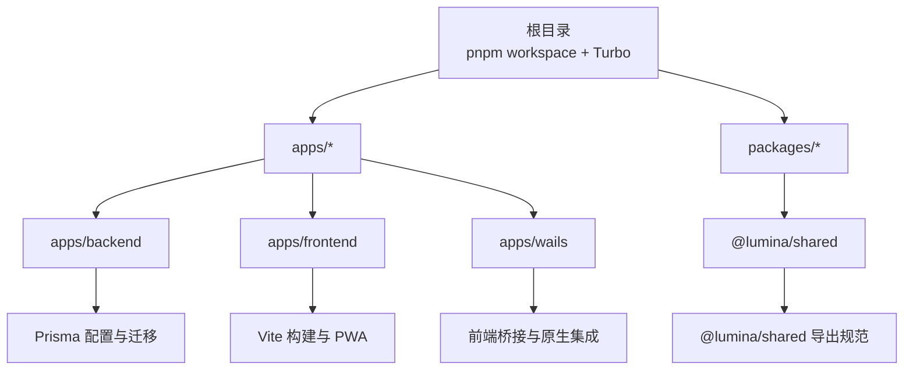
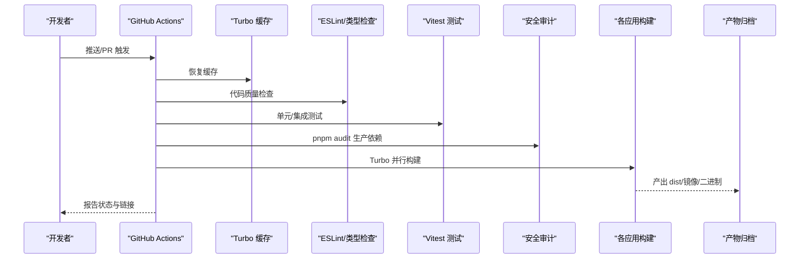
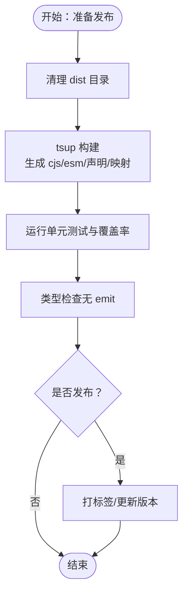
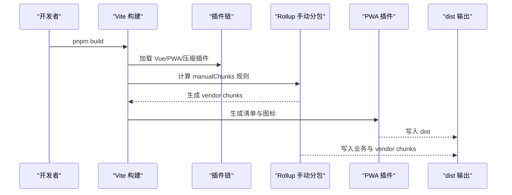
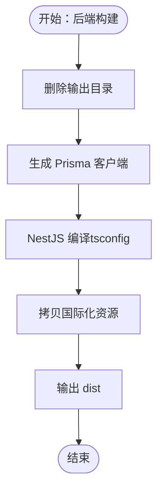
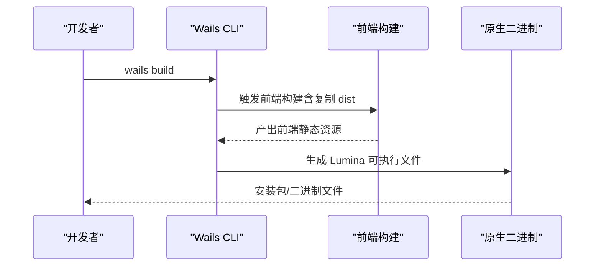
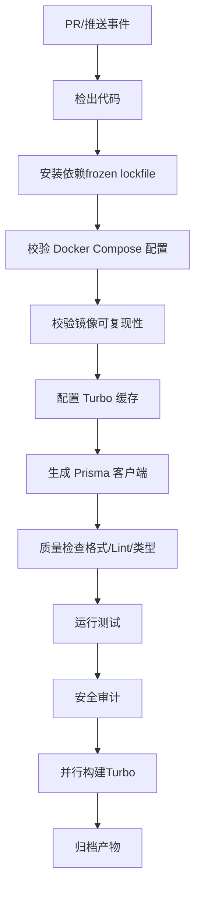
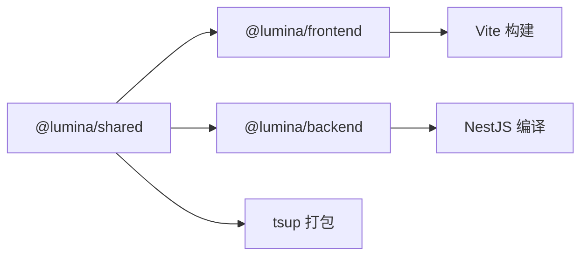

# 扩展打包与发布

<cite>
**本文档引用的文件**
- [package.json](file://package.json)
- [pnpm-workspace.yaml](file://pnpm-workspace.yaml)
- [turbo.json](file://turbo.json)
- [tsconfig.base.json](file://tsconfig.base.json)
- [packages/shared/tsup.config.ts](file://packages/shared/tsup.config.ts)
- [packages/shared/package.json](file://packages/shared/package.json)
- [apps/frontend/vite.config.mts](file://apps/frontend/vite.config.mts)
- [apps/frontend/package.json](file://apps/frontend/package.json)
- [apps/backend/nest-cli.json](file://apps/backend/nest-cli.json)
- [apps/wails/wails.json](file://apps/wails/wails.json)
- [.github/workflows/ci.yml](file://.github/workflows/ci.yml)
- [scripts/security-audit.js](file://scripts/security-audit.js)
</cite>

## 目录

1. [简介](#简介)
2. [项目结构](#项目结构)
3. [核心组件](#核心组件)
4. [架构总览](#架构总览)
5. [详细组件分析](#详细组件分析)
6. [依赖关系分析](#依赖关系分析)
7. [性能考量](#性能考量)
8. [故障排查指南](#故障排查指南)
9. [结论](#结论)
10. [附录](#附录)

## 简介

本指南面向 Lumina Todo 扩展在 monorepo 架构下的打包与发布，覆盖以下主题：

- 包管理与版本控制：基于 pnpm workspace 的统一依赖与版本策略
- 依赖管理：共享包、前端库、后端模块的打包与导出规范
- TypeScript 编译配置与构建优化：类型检查、源码映射、产物输出
- 发布策略：共享包、前端库、桌面应用（Wails）与后端服务的发布要点
- CI/CD 流水线：质量门禁、缓存、构建与测试、安全审计
- 安全与兼容性：漏洞扫描、镜像可复现性校验
- 发布渠道与运维：更新通知、回滚机制建议

## 项目结构

仓库采用 pnpm workspace + Turbo 的 monorepo 架构，主要目录与职责如下：

- apps/backend：NestJS 后端服务，含 Prisma、认证、邮件、定时任务等模块
- apps/frontend：Vue 3 前端应用，支持 Capacitor 多端与 PWA
- apps/wails：桌面应用（Wails），桥接前端与原生能力
- packages/shared：共享 TypeScript 包，供前后端与工具链复用
- scripts：安全审计与部署辅助脚本
- .github/workflows：CI 工作流定义

图表来源

- [pnpm-workspace.yaml:1-4](file://pnpm-workspace.yaml#L1-L4)
- [turbo.json:1-202](file://turbo.json#L1-L202)
- [apps/frontend/vite.config.mts:1-185](file://apps/frontend/vite.config.mts#L1-L185)
- [apps/backend/nest-cli.json:1-11](file://apps/backend/nest-cli.json#L1-L11)
- [apps/wails/wails.json:1-22](file://apps/wails/wails.json#L1-L22)
- [packages/shared/package.json:1-52](file://packages/shared/package.json#L1-L52)

章节来源

- [pnpm-workspace.yaml:1-4](file://pnpm-workspace.yaml#L1-L4)
- [turbo.json:1-202](file://turbo.json#L1-L202)
- [package.json:1-139](file://package.json#L1-L139)

## 核心组件

- 共享包（@lumina/shared）
  - 使用 tsup 输出 CJS/ESM 双格式，生成声明文件与源码映射
  - 通过 exports 字段提供多入口导出，便于消费方按需引入
- 前端库（@lumina/frontend）
  - Vite 构建，启用 Gzip/Brotli 压缩与 PWA 清单
  - 支持 Wails 模式（WAILS=true）与 Capacitor 多端构建
- 后端服务（@lumina/backend）
  - NestJS 编译配置，Prisma 资源随构建同步
- 桌面应用（@lumina/wails）
  - 通过 wails.json 配置前端目录、安装与构建命令，自动产出原生二进制

章节来源

- [packages/shared/tsup.config.ts:1-11](file://packages/shared/tsup.config.ts#L1-L11)
- [packages/shared/package.json:1-52](file://packages/shared/package.json#L1-L52)
- [apps/frontend/vite.config.mts:1-185](file://apps/frontend/vite.config.mts#L1-L185)
- [apps/backend/nest-cli.json:1-11](file://apps/backend/nest-cli.json#L1-L11)
- [apps/wails/wails.json:1-22](file://apps/wails/wails.json#L1-L22)

## 架构总览

下图展示从开发到发布的整体流程，包括质量门禁、构建与测试、安全审计以及产物产出。

图表来源

- [.github/workflows/ci.yml:1-139](file://.github/workflows/ci.yml#L1-L139)
- [turbo.json:1-202](file://turbo.json#L1-L202)
- [scripts/security-audit.js:1-53](file://scripts/security-audit.js#L1-L53)

## 详细组件分析

### 共享包打包与发布策略

- 构建配置
  - 入口：src/index.ts
  - 输出：cjs 与 esm 双格式，生成声明文件与源码映射
  - 分包策略：关闭代码分割，保证单一入口的易用性
- 导出规范
  - 通过 exports 字段提供 types/import/require，默认指向 esm
  - typesVersions 映射所有通配路径，确保 TS 智能感知
- 版本与发布
  - 当前版本号在 package.json 中维护，建议配合语义化版本与变更日志
  - 发布前执行类型检查与测试，确保导出 API 稳定
- 依赖管理
  - 将公共校验库（如 zod）作为依赖，避免重复打包
  - 开发期通过 workspace:\* 引用本地共享包，提高迭代效率

图表来源

- [packages/shared/tsup.config.ts:1-11](file://packages/shared/tsup.config.ts#L1-L11)
- [packages/shared/package.json:1-52](file://packages/shared/package.json#L1-L52)

章节来源

- [packages/shared/tsup.config.ts:1-11](file://packages/shared/tsup.config.ts#L1-L11)
- [packages/shared/package.json:1-52](file://packages/shared/package.json#L1-L52)

### 前端库构建与优化

- 构建与打包
  - Vite 构建，开启 Gzip 与 Brotli 压缩，降低传输体积
  - 自定义手动分包策略，将 Vue、UI、图表、Mermaid、Markdown、工具库等拆分为独立 vendor chunk
  - PWA 清单与图标资源自动生成与注册，支持 autoUpdate
- 环境与模式
  - Wails 模式通过环境变量切换，使用相对路径 base
  - 开发代理统一转发 /api 与 WebSocket，提升联调体验
- 依赖与别名
  - 通过 alias 将 @lumina/shared 指向共享包入口，便于跨包复用
- 多端与桌面
  - Capacitor 支持 iOS/Android 同步与运行
  - Wails 构建前将前端产物复制至 wails 前端目录，统一产出原生二进制

图表来源

- [apps/frontend/vite.config.mts:1-185](file://apps/frontend/vite.config.mts#L1-L185)

章节来源

- [apps/frontend/vite.config.mts:1-185](file://apps/frontend/vite.config.mts#L1-L185)
- [apps/frontend/package.json:1-105](file://apps/frontend/package.json#L1-L105)

### 后端模块构建与发布

- 编译与资源
  - NestJS 编译配置启用 deleteOutDir，确保输出整洁
  - assets 中包含国际化资源，随构建一并处理
- 数据层
  - Prisma schema 与客户端生成由脚本统一触发，保证一致性
- 测试与类型
  - 结合 Vitest 与类型检查，保障模块稳定性

图表来源

- [apps/backend/nest-cli.json:1-11](file://apps/backend/nest-cli.json#L1-L11)

章节来源

- [apps/backend/nest-cli.json:1-11](file://apps/backend/nest-cli.json#L1-L11)

### 桌面应用（Wails）发布

- 配置要点
  - 前端目录、安装与构建命令在 wails.json 中集中配置
  - 通过环境变量控制开发服务器地址与前端构建模式
- 产物产出
  - 构建完成后生成原生二进制，便于分发与安装

图表来源

- [apps/wails/wails.json:1-22](file://apps/wails/wails.json#L1-L22)

章节来源

- [apps/wails/wails.json:1-22](file://apps/wails/wails.json#L1-L22)

### TypeScript 编译与类型检查

- 基础配置
  - 统一的 tsconfig.base.json 提供严格模式、声明文件、源码映射与 bundler 解析
- 应用差异
  - 前端使用 vue-tsc 进行类型检查，后端使用 NestJS 编译器
  - 共享包使用 tsc --noEmit 或 tsup 的类型检查模式
- 优化建议
  - 保持严格模式，启用 skipLibCheck 以加速
  - 对大型项目启用增量编译与 watch 模式提升开发体验

章节来源

- [tsconfig.base.json:1-17](file://tsconfig.base.json#L1-L17)
- [apps/frontend/package.json:1-105](file://apps/frontend/package.json#L1-L105)
- [packages/shared/package.json:1-52](file://packages/shared/package.json#L1-L52)

### CI/CD 流水线与自动化

- 质量门禁
  - 校验 Docker Compose 配置与镜像可复现性（要求镜像带 sha256）
  - 运行格式化检查、ESLint、类型检查与测试
- 构建阶段
  - Turbo 并行构建，结合缓存键与恢复键，显著缩短构建时间
- 安全审计
  - 使用自定义脚本对生产依赖进行 pnpm audit，并过滤忽略项
- 发布建议
  - 在 PR 合并后触发发布工作流，产出各平台产物并上传制品库或镜像仓库

图表来源

- [.github/workflows/ci.yml:1-139](file://.github/workflows/ci.yml#L1-L139)
- [turbo.json:1-202](file://turbo.json#L1-L202)
- [scripts/security-audit.js:1-53](file://scripts/security-audit.js#L1-L53)

章节来源

- [.github/workflows/ci.yml:1-139](file://.github/workflows/ci.yml#L1-L139)
- [turbo.json:1-202](file://turbo.json#L1-L202)
- [scripts/security-audit.js:1-53](file://scripts/security-audit.js#L1-L53)

## 依赖关系分析

- 包管理
  - pnpm workspace 统一管理依赖，避免重复安装
  - 通过 overrides 管控高危依赖版本，确保供应链安全
- 应用间依赖
  - 前端依赖 @lumina/shared（workspace:\*），共享 DTO、Schema 与工具
  - 后端与前端分别维护各自依赖，减少耦合
- 构建依赖
  - Turbo 作为任务编排与缓存中心，提升整体效率
  - Vite/ESLint/tsup 等工具链按需启用

图表来源

- [pnpm-workspace.yaml:1-4](file://pnpm-workspace.yaml#L1-L4)
- [apps/frontend/package.json:1-105](file://apps/frontend/package.json#L1-L105)
- [packages/shared/package.json:1-52](file://packages/shared/package.json#L1-L52)

章节来源

- [pnpm-workspace.yaml:1-4](file://pnpm-workspace.yaml#L1-L4)
- [apps/frontend/package.json:1-105](file://apps/frontend/package.json#L1-L105)
- [packages/shared/package.json:1-52](file://packages/shared/package.json#L1-L52)

## 性能考量

- 构建性能
  - Turbo 并行与缓存：利用 globalDependencies 与任务输入/输出定义，最大化命中缓存
  - 前端手动分包：将常用第三方库拆分为独立 chunk，提升缓存命中率
- 传输体积
  - 启用 Gzip/Brotli 压缩，结合 PWA 资源预缓存，改善首屏加载
- 类型检查
  - 基于基础 tsconfig 的严格模式，结合 watch 模式与增量编译，平衡准确性与速度

## 故障排查指南

- 构建失败
  - 检查 Turbo 缓存键与任务输入是否匹配，必要时清理 .turbo
  - 确认各应用的 package.json 脚本与依赖版本一致
- 类型错误
  - 使用 type-check 脚本快速定位问题；共享包确保导出声明完整
- 安全问题
  - 运行安全审计脚本，核对被忽略的 advisories 与模块列表
- Docker 配置
  - 校验镜像可复现性，确保生产镜像使用固定 digest

章节来源

- [turbo.json:1-202](file://turbo.json#L1-L202)
- [scripts/security-audit.js:1-53](file://scripts/security-audit.js#L1-L53)

## 结论

本指南提供了 Lumina Todo 在 monorepo 下的打包与发布实践，涵盖共享包、前端库、后端模块与桌面应用的构建策略，以及 CI/CD、安全审计与性能优化的关键点。建议在实际发布中结合语义化版本、变更日志与自动化发布流程，确保可追溯与可回滚。

## 附录

- 发布渠道与更新通知
  - 前端：通过 PWA 自动更新与 CDN 分发
  - 后端：容器镜像仓库（含固定 digest）与编排文件
  - 桌面：应用商店/官网下载与自动更新
- 回滚机制
  - 采用镜像 digest 固定版本，回滚时切换到上一个稳定版本
  - 前端 PWA 通过缓存策略与版本号区分，回滚时清理缓存并刷新
