# 插件系统

<cite>
**本文引用的文件**
- [apps/frontend/src/main.ts](file://apps/frontend/src/main.ts)
- [apps/frontend/src/App.vue](file://apps/frontend/src/App.vue)
- [apps/frontend/src/router/index.ts](file://apps/frontend/src/router/index.ts)
- [apps/frontend/src/i18n/index.ts](file://apps/frontend/src/i18n/index.ts)
- [apps/frontend/src/services/native.ts](file://apps/frontend/src/services/native.ts)
- [apps/frontend/src/composables/index.ts](file://apps/frontend/src/composables/index.ts)
- [apps/frontend/package.json](file://apps/frontend/package.json)
- [packages/shared/src/index.ts](file://packages/shared/src/index.ts)
- [packages/shared/tsup.config.ts](file://packages/shared/tsup.config.ts)
- [apps/backend/src/events/events.module.ts](file://apps/backend/src/events/events.module.ts)
- [apps/backend/src/events/events.gateway.ts](file://apps/backend/src/events/events.gateway.ts)
- [apps/frontend/src/features/todo/stores/todo.ts](file://apps/frontend/src/features/todo/stores/todo.ts)
</cite>

## 目录

1. [简介](#简介)
2. [项目结构](#项目结构)
3. [核心组件](#核心组件)
4. [架构总览](#架构总览)
5. [详细组件分析](#详细组件分析)
6. [依赖分析](#依赖分析)
7. [性能考虑](#性能考虑)
8. [故障排查指南](#故障排查指南)
9. [结论](#结论)
10. [附录](#附录)

## 简介

本指南面向Lumina Todo插件系统的开发者，围绕前端Vue生态下的插件化架构展开，重点覆盖以下方面：

- Vue组件插件架构与组合式函数扩展
- 共享包设计与跨应用复用
- 插件注册机制、生命周期管理与依赖注入
- UI组件插件、状态管理插件、路由插件的实现方法
- 插件间通信机制、事件系统与数据共享
- 插件打包、发布与版本兼容性管理
- 插件开发模板、调试工具与性能监控方法

本指南以仓库现有代码为依据，结合可扩展的设计原则，帮助你在不破坏现有架构的前提下，安全地引入与维护插件系统。

## 项目结构

前端应用采用多特性分层组织，插件化能力通过以下层次协同：

- 应用入口与全局配置：在入口文件中完成插件注册、错误处理与全局服务挂载
- 路由与国际化：路由负责页面级插件化入口，国际化提供多语言支持
- 组合式函数与服务：提供可复用的业务逻辑与原生能力桥接
- 共享包：统一导出Zod Schema、DTO与工具函数，作为插件间契约

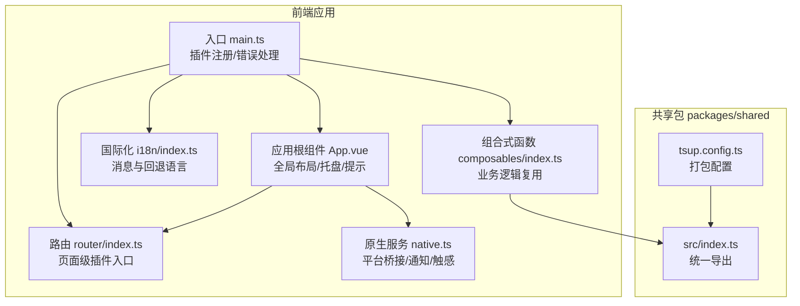

**图表来源**

- [apps/frontend/src/main.ts:1-138](file://apps/frontend/src/main.ts#L1-L138)
- [apps/frontend/src/App.vue:1-77](file://apps/frontend/src/App.vue#L1-L77)
- [apps/frontend/src/router/index.ts:1-73](file://apps/frontend/src/router/index.ts#L1-L73)
- [apps/frontend/src/i18n/index.ts:1-37](file://apps/frontend/src/i18n/index.ts#L1-L37)
- [apps/frontend/src/services/native.ts:1-116](file://apps/frontend/src/services/native.ts#L1-L116)
- [apps/frontend/src/composables/index.ts:1-11](file://apps/frontend/src/composables/index.ts#L1-L11)
- [packages/shared/src/index.ts:1-22](file://packages/shared/src/index.ts#L1-L22)
- [packages/shared/tsup.config.ts:1-11](file://packages/shared/tsup.config.ts#L1-L11)

**章节来源**

- [apps/frontend/src/main.ts:1-138](file://apps/frontend/src/main.ts#L1-L138)
- [apps/frontend/src/App.vue:1-77](file://apps/frontend/src/App.vue#L1-L77)
- [apps/frontend/src/router/index.ts:1-73](file://apps/frontend/src/router/index.ts#L1-L73)
- [apps/frontend/src/i18n/index.ts:1-37](file://apps/frontend/src/i18n/index.ts#L1-L37)
- [apps/frontend/src/services/native.ts:1-116](file://apps/frontend/src/services/native.ts#L1-L116)
- [apps/frontend/src/composables/index.ts:1-11](file://apps/frontend/src/composables/index.ts#L1-L11)
- [packages/shared/src/index.ts:1-22](file://packages/shared/src/index.ts#L1-L22)
- [packages/shared/tsup.config.ts:1-11](file://packages/shared/tsup.config.ts#L1-L11)

## 核心组件

- 应用入口与插件注册
  - 在入口文件中集中注册Pinia、路由、国际化、Vue Query等插件，并提供全局错误处理与资源初始化
  - 通过错误处理器识别并处理动态模块加载失败场景，保障部署后首次访问的稳定性
- 应用根组件与全局布局
  - 根组件负责主题初始化、平台检测与全局WebSocket监听初始化
  - 提供Toast与AI匿名迁移对话框等全局UI插件
- 路由与国际化
  - 路由按需加载页面组件，支持Wails与Web两种历史模式
  - 国际化提供回退语言与本地存储偏好，确保多语言一致性
- 原生服务与组合式函数
  - 原生服务抽象Wails/Capacitor/Web差异，统一对话框、通知、触感与窗口控制
  - 组合式函数提供请求、主题、滚动、Markdown渲染等可复用能力
- 共享包
  - 统一导出Zod Schema、DTO与工具函数，作为插件间契约，避免重复定义

**章节来源**

- [apps/frontend/src/main.ts:1-138](file://apps/frontend/src/main.ts#L1-L138)
- [apps/frontend/src/App.vue:1-77](file://apps/frontend/src/App.vue#L1-L77)
- [apps/frontend/src/router/index.ts:1-73](file://apps/frontend/src/router/index.ts#L1-L73)
- [apps/frontend/src/i18n/index.ts:1-37](file://apps/frontend/src/i18n/index.ts#L1-L37)
- [apps/frontend/src/services/native.ts:1-116](file://apps/frontend/src/services/native.ts#L1-L116)
- [apps/frontend/src/composables/index.ts:1-11](file://apps/frontend/src/composables/index.ts#L1-L11)
- [packages/shared/src/index.ts:1-22](file://packages/shared/src/index.ts#L1-L22)

## 架构总览

Lumina Todo的插件化架构以“入口注册 + 特性模块 + 共享契约”为核心：

- 入口注册：在应用启动时一次性完成核心插件注册与全局配置
- 特性模块：按功能域划分（如AI、认证、待办），每个域可进一步细分为组件、组合式函数、状态与视图
- 共享契约：通过共享包统一Schema与DTO，保证插件间数据结构一致

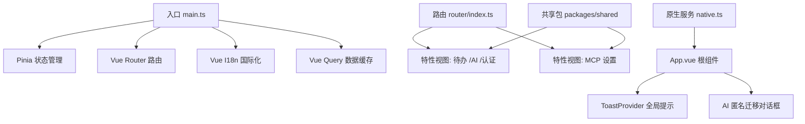

**图表来源**

- [apps/frontend/src/main.ts:1-138](file://apps/frontend/src/main.ts#L1-L138)
- [apps/frontend/src/router/index.ts:1-73](file://apps/frontend/src/router/index.ts#L1-L73)
- [apps/frontend/src/App.vue:1-77](file://apps/frontend/src/App.vue#L1-L77)
- [apps/frontend/src/services/native.ts:1-116](file://apps/frontend/src/services/native.ts#L1-L116)
- [packages/shared/src/index.ts:1-22](file://packages/shared/src/index.ts#L1-L22)

## 详细组件分析

### Vue组件插件架构

- 设计要点
  - 组件插件应遵循单一职责与可组合原则，通过组合式函数提供能力，通过Props与事件进行解耦
  - UI组件插件建议提供统一的入口索引，便于按需导入与Tree-shaking
- 实践路径
  - 参考UI组件目录的模块化组织方式，将插件组件与其子组件、索引文件配套放置
  - 在组合式函数中封装插件所需的副作用与状态，避免在组件中直接耦合外部服务

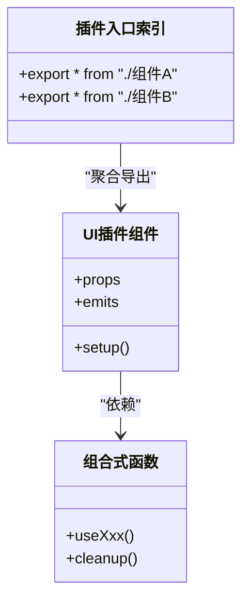

**章节来源**

- [apps/frontend/src/composables/index.ts:1-11](file://apps/frontend/src/composables/index.ts#L1-L11)

### 组合式函数扩展

- 设计要点
  - 将插件的副作用（如网络请求、主题切换、滚动行为）收敛到组合式函数中，提升可测试性与可复用性
  - 对外暴露明确的API与返回值，避免在组件中直接操作全局状态
- 实践路径
  - 参考useRequest、useTheme、useSmartScroll等组合式函数的组织方式，形成插件能力的“函数即插件”的模式

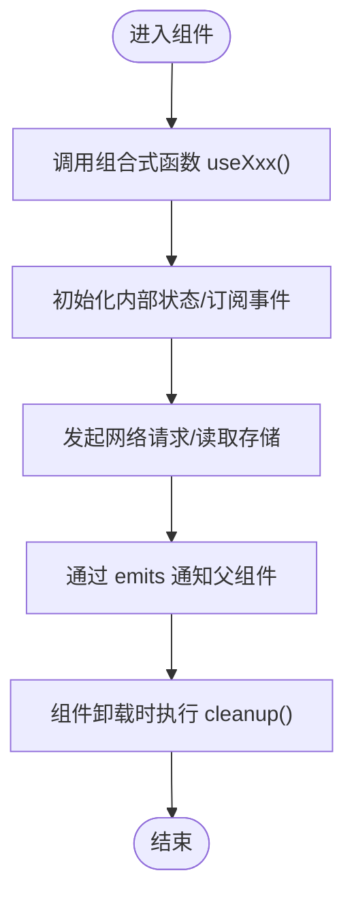

**章节来源**

- [apps/frontend/src/composables/index.ts:1-11](file://apps/frontend/src/composables/index.ts#L1-L11)

### 共享包设计

- 设计要点
  - 共享包作为插件间契约，统一导出Schema、DTO与工具函数，避免重复定义与版本漂移
  - 打包配置同时输出CommonJS与ES模块，满足不同运行时需求
- 实践路径
  - 在共享包中集中导出Zod Schema与DTO，插件在自身类型中引用这些契约，确保前后端一致

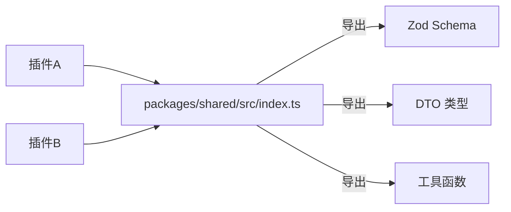

**图表来源**

- [packages/shared/src/index.ts:1-22](file://packages/shared/src/index.ts#L1-L22)
- [packages/shared/tsup.config.ts:1-11](file://packages/shared/tsup.config.ts#L1-L11)

**章节来源**

- [packages/shared/src/index.ts:1-22](file://packages/shared/src/index.ts#L1-L22)
- [packages/shared/tsup.config.ts:1-11](file://packages/shared/tsup.config.ts#L1-L11)

### 插件注册机制与生命周期

- 注册机制
  - 在入口文件中集中注册核心插件（Pinia、Router、I18n、Vue Query），并通过全局错误处理器处理动态模块加载异常
- 生命周期管理
  - 组件层面：在mounted阶段初始化全局监听（如WebSocket），在卸载阶段清理资源
  - 插件层面：组合式函数提供cleanup钩子，确保副作用可逆

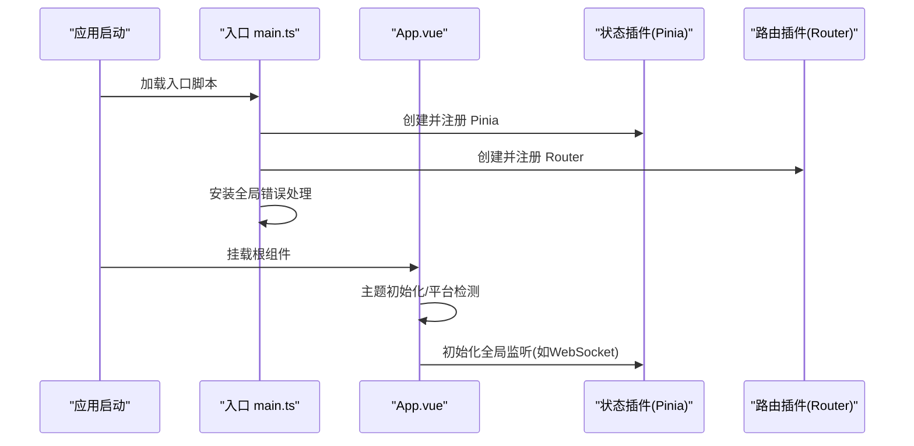

**图表来源**

- [apps/frontend/src/main.ts:1-138](file://apps/frontend/src/main.ts#L1-L138)
- [apps/frontend/src/App.vue:1-77](file://apps/frontend/src/App.vue#L1-L77)

**章节来源**

- [apps/frontend/src/main.ts:1-138](file://apps/frontend/src/main.ts#L1-L138)
- [apps/frontend/src/App.vue:1-77](file://apps/frontend/src/App.vue#L1-L77)

### 依赖注入与平台桥接

- 依赖注入
  - 通过组合式函数与服务层注入依赖（如原生服务），避免在组件中直接依赖具体实现
- 平台桥接
  - 原生服务抽象Wails/Capacitor/Web差异，提供统一的通知、触感与窗口控制接口

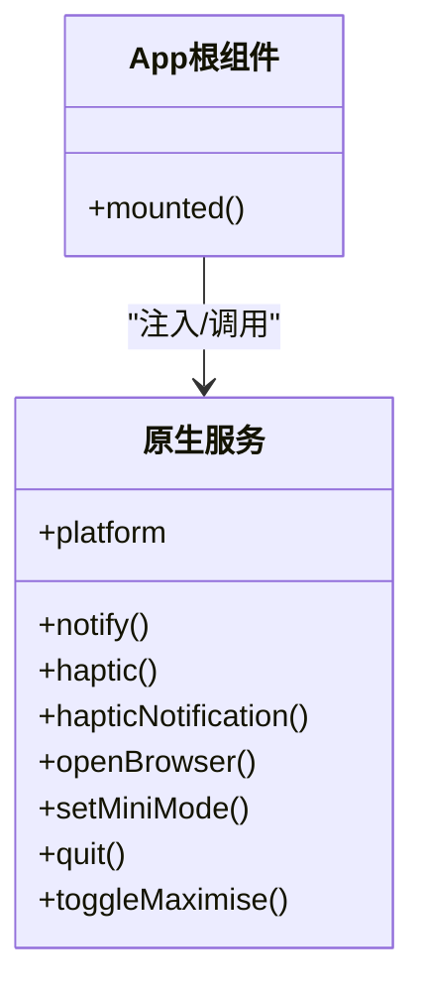

**图表来源**

- [apps/frontend/src/services/native.ts:1-116](file://apps/frontend/src/services/native.ts#L1-L116)
- [apps/frontend/src/App.vue:1-77](file://apps/frontend/src/App.vue#L1-L77)

**章节来源**

- [apps/frontend/src/services/native.ts:1-116](file://apps/frontend/src/services/native.ts#L1-L116)
- [apps/frontend/src/App.vue:1-77](file://apps/frontend/src/App.vue#L1-L77)

### UI组件插件开发

- 开发方法
  - 将UI组件与其组合式函数、样式与测试配套组织，通过索引文件统一导出
  - 在组件中仅处理UI逻辑，将业务逻辑下沉至组合式函数
- 示例参考
  - 参考UI组件目录中的按钮、卡片、输入框等组件的组织方式

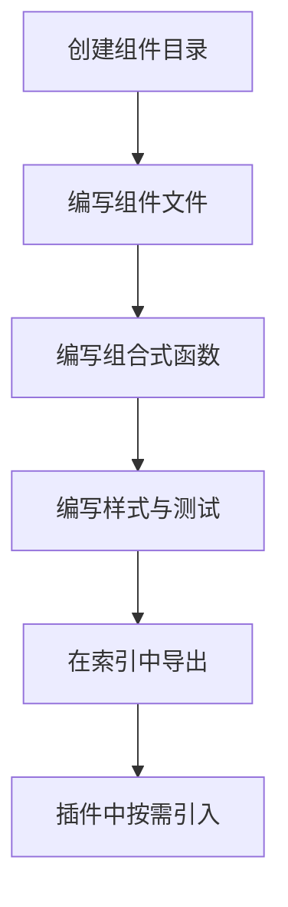

**章节来源**

- [apps/frontend/src/composables/index.ts:1-11](file://apps/frontend/src/composables/index.ts#L1-L11)

### 状态管理插件

- 开发方法
  - 将状态逻辑收敛到组合式函数或Pinia Store中，对外暴露清晰的API
  - 通过共享包统一数据模型，确保插件间状态结构一致
- 示例参考
  - 参考待办特性中的store导出与类型定义方式

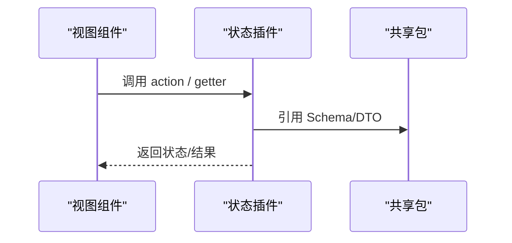

**图表来源**

- [apps/frontend/src/features/todo/stores/todo.ts:1-3](file://apps/frontend/src/features/todo/stores/todo.ts#L1-L3)
- [packages/shared/src/index.ts:1-22](file://packages/shared/src/index.ts#L1-L22)

**章节来源**

- [apps/frontend/src/features/todo/stores/todo.ts:1-3](file://apps/frontend/src/features/todo/stores/todo.ts#L1-L3)
- [packages/shared/src/index.ts:1-22](file://packages/shared/src/index.ts#L1-L22)

### 路由插件

- 开发方法
  - 路由作为页面级插件入口，按需异步加载特性视图
  - 支持Wails与Web两种历史模式，确保桌面端与Web端一致体验
- 示例参考
  - 参考路由配置与页面标题国际化更新逻辑

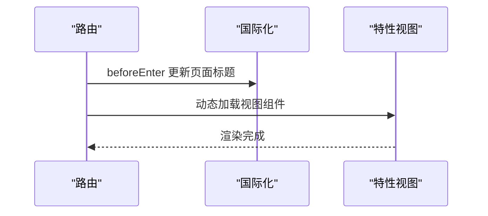

**图表来源**

- [apps/frontend/src/router/index.ts:1-73](file://apps/frontend/src/router/index.ts#L1-L73)
- [apps/frontend/src/i18n/index.ts:1-37](file://apps/frontend/src/i18n/index.ts#L1-L37)

**章节来源**

- [apps/frontend/src/router/index.ts:1-73](file://apps/frontend/src/router/index.ts#L1-L73)
- [apps/frontend/src/i18n/index.ts:1-37](file://apps/frontend/src/i18n/index.ts#L1-L37)

### 插件间通信机制、事件系统与数据共享

- 通信机制
  - 组件间通过Props与Emits进行通信；跨模块通过共享包的Schema/DTO进行数据契约约束
- 事件系统
  - 建议在根组件或服务层集中管理全局事件（如WebSocket事件），并在组合式函数中订阅/取消订阅
- 数据共享
  - 通过Pinia Store或共享包的DTO进行跨插件数据共享，避免直接依赖其他插件内部实现

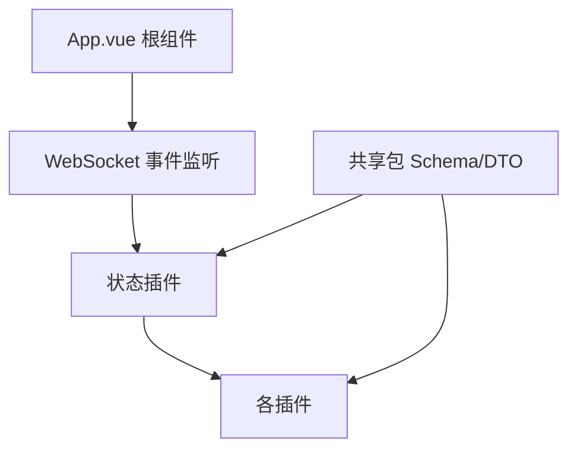

**图表来源**

- [apps/frontend/src/App.vue:1-77](file://apps/frontend/src/App.vue#L1-L77)
- [packages/shared/src/index.ts:1-22](file://packages/shared/src/index.ts#L1-L22)

**章节来源**

- [apps/frontend/src/App.vue:1-77](file://apps/frontend/src/App.vue#L1-L77)
- [packages/shared/src/index.ts:1-22](file://packages/shared/src/index.ts#L1-L22)

### 插件打包、发布与版本兼容性管理

- 打包
  - 共享包使用tsup同时输出CommonJS与ES模块，并生成类型声明
- 发布
  - 建议在工作区中通过版本管理工具统一升级共享包版本，确保插件与共享包版本对齐
- 兼容性
  - 通过共享包的类型契约约束插件的数据结构，减少破坏性变更带来的影响

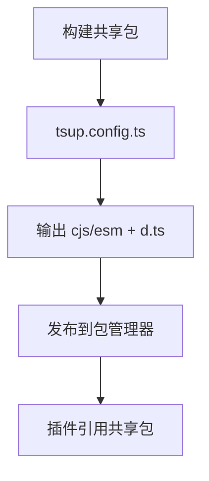

**图表来源**

- [packages/shared/tsup.config.ts:1-11](file://packages/shared/tsup.config.ts#L1-L11)

**章节来源**

- [packages/shared/tsup.config.ts:1-11](file://packages/shared/tsup.config.ts#L1-L11)

### 插件开发模板、调试工具与性能监控

- 开发模板
  - 参考UI组件与组合式函数的组织方式，建立“组件 + 组合式函数 + 测试 + 样式”的标准模板
- 调试工具
  - 在入口文件中集中安装Vue Devtools与日志工具，便于定位问题
- 性能监控
  - 使用Vue Query的默认缓存策略与staleTime配置，减少重复请求
  - 在组合式函数中实现防抖/节流与内存清理，避免泄漏

**章节来源**

- [apps/frontend/src/main.ts:1-138](file://apps/frontend/src/main.ts#L1-L138)
- [apps/frontend/package.json:1-105](file://apps/frontend/package.json#L1-L105)

## 依赖分析

- 内部依赖
  - 前端应用依赖共享包提供的Schema与DTO，确保插件间数据一致性
  - 路由与国际化相互协作，保证页面标题与语言的一致性
- 外部依赖
  - Vue 3、Pinia、Vue Router、Vue I18n、Vue Query等作为核心运行时
  - 原生能力通过Capacitor与Wails桥接，提供跨平台支持

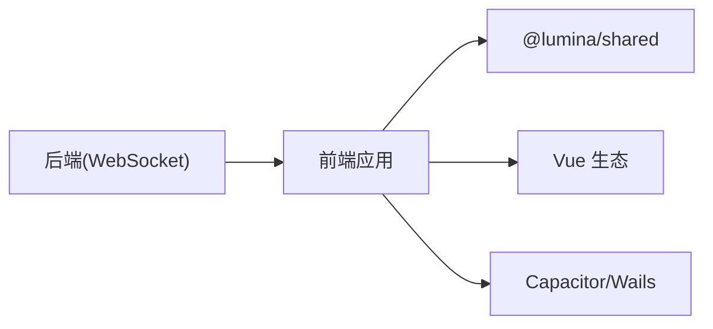

**图表来源**

- [apps/frontend/package.json:1-105](file://apps/frontend/package.json#L1-L105)
- [packages/shared/src/index.ts:1-22](file://packages/shared/src/index.ts#L1-L22)

**章节来源**

- [apps/frontend/package.json:1-105](file://apps/frontend/package.json#L1-L105)
- [packages/shared/src/index.ts:1-22](file://packages/shared/src/index.ts#L1-L22)

## 性能考虑

- 资源加载
  - 使用路由的动态导入减少首屏体积，配合入口错误处理应对部署后的模块加载异常
- 缓存策略
  - Vue Query默认查询缓存与重试策略，合理设置staleTime与retry次数
- 组合式函数
  - 在组合式函数中实现资源清理与副作用回收，避免内存泄漏

**章节来源**

- [apps/frontend/src/main.ts:1-138](file://apps/frontend/src/main.ts#L1-L138)
- [apps/frontend/src/router/index.ts:1-73](file://apps/frontend/src/router/index.ts#L1-L73)

## 故障排查指南

- 动态模块加载失败
  - 入口错误处理器会识别并尝试自动刷新，若多次失败，需手动刷新或检查部署
- ResizeObserver相关错误
  - 全局错误处理会忽略已知的良性错误，避免干扰正常日志
- WebSocket连接
  - 在根组件mounted阶段初始化监听，确保连接建立与断线重连逻辑正确

**章节来源**

- [apps/frontend/src/main.ts:1-138](file://apps/frontend/src/main.ts#L1-L138)
- [apps/frontend/src/App.vue:1-77](file://apps/frontend/src/App.vue#L1-L77)

## 结论

Lumina Todo的插件系统以“入口集中注册 + 特性模块化 + 共享契约”为核心，结合组合式函数与原生服务桥接，提供了良好的扩展性与可维护性。通过共享包统一Schema与DTO，插件间的数据契约得以稳定；通过路由与国际化协作，页面级插件入口清晰；通过入口错误处理与Vue Query缓存策略，应用具备更强的健壮性与性能表现。建议在后续迭代中持续完善插件模板、测试覆盖率与版本管理流程，以支撑更大规模的插件生态。

## 附录

- 关键实现路径参考
  - 入口注册与错误处理：[apps/frontend/src/main.ts:1-138](file://apps/frontend/src/main.ts#L1-L138)
  - 根组件与全局监听：[apps/frontend/src/App.vue:1-77](file://apps/frontend/src/App.vue#L1-L77)
  - 路由与国际化：[apps/frontend/src/router/index.ts:1-73](file://apps/frontend/src/router/index.ts#L1-L73)、[apps/frontend/src/i18n/index.ts:1-37](file://apps/frontend/src/i18n/index.ts#L1-L37)
  - 原生服务桥接：[apps/frontend/src/services/native.ts:1-116](file://apps/frontend/src/services/native.ts#L1-L116)
  - 组合式函数索引：[apps/frontend/src/composables/index.ts:1-11](file://apps/frontend/src/composables/index.ts#L1-L11)
  - 共享包导出与打包：[packages/shared/src/index.ts:1-22](file://packages/shared/src/index.ts#L1-L22)、[packages/shared/tsup.config.ts:1-11](file://packages/shared/tsup.config.ts#L1-L11)
  - 待办特性Store导出：[apps/frontend/src/features/todo/stores/todo.ts:1-3](file://apps/frontend/src/features/todo/stores/todo.ts#L1-L3)
