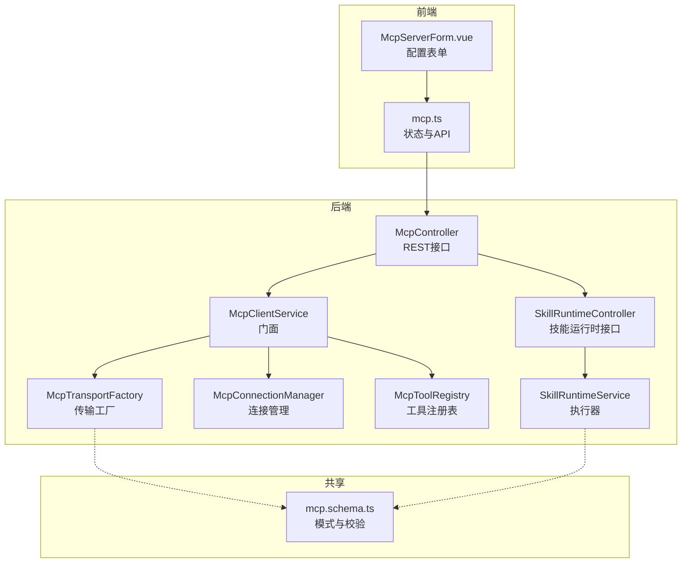
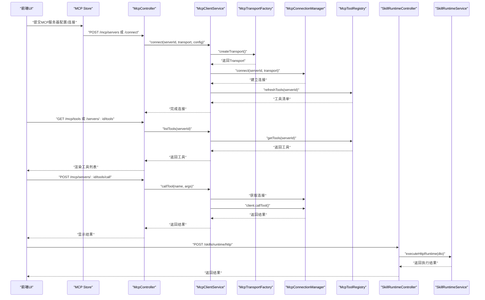
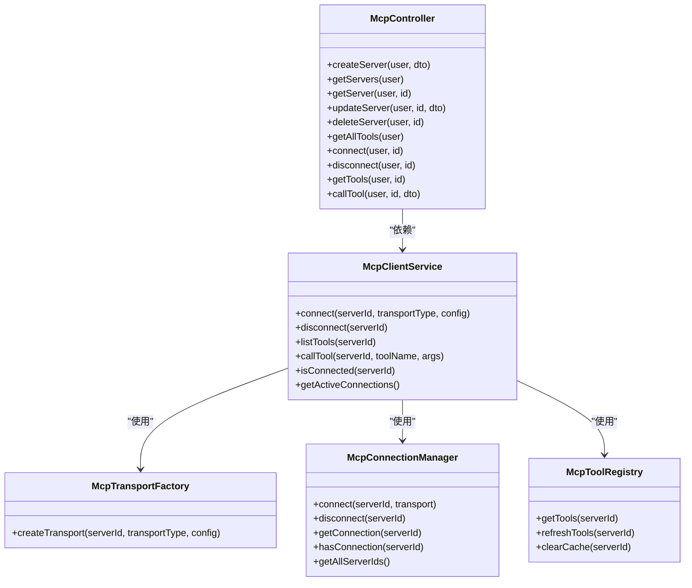
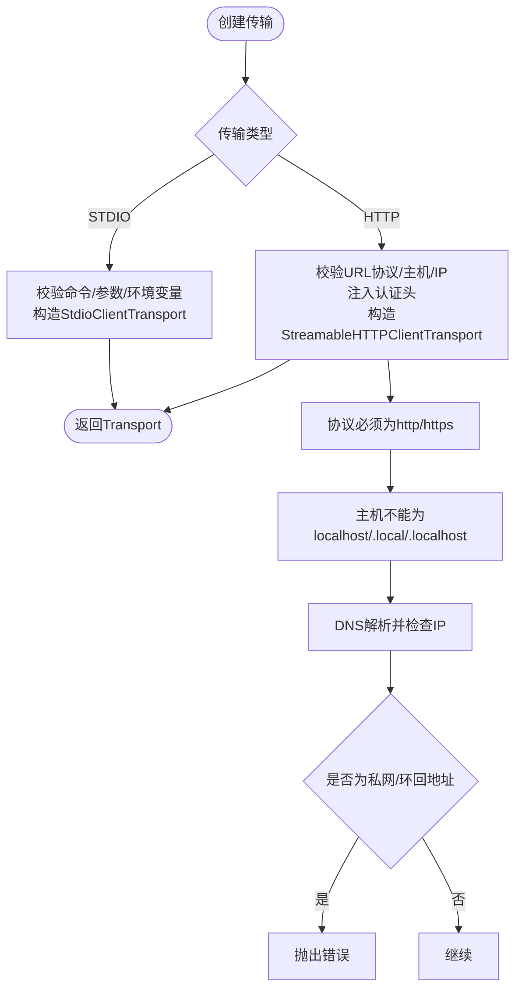
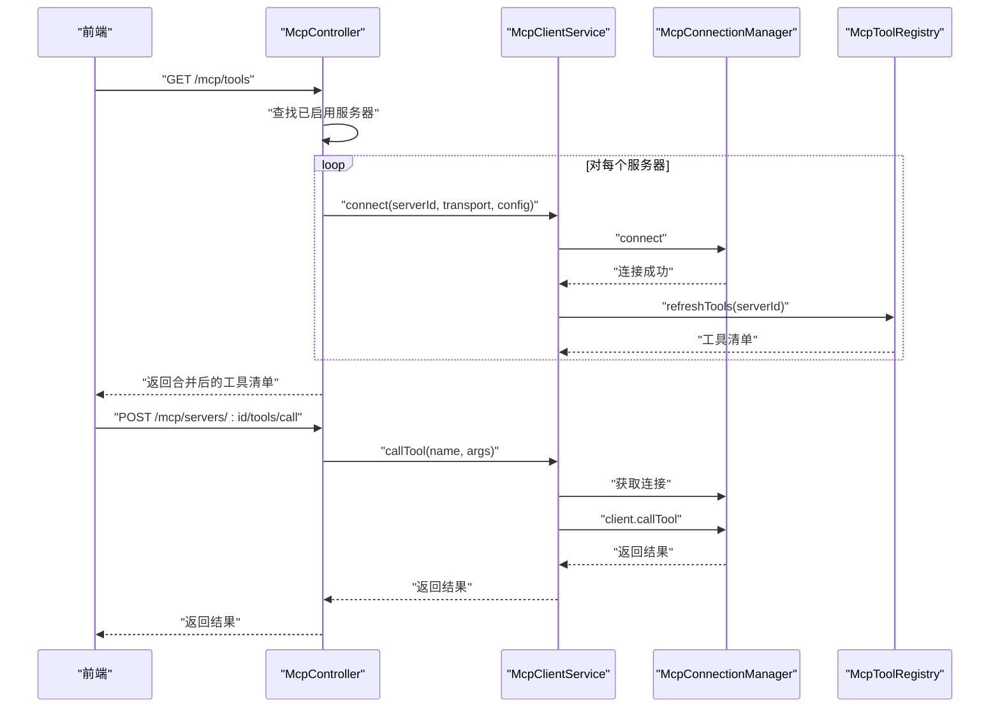
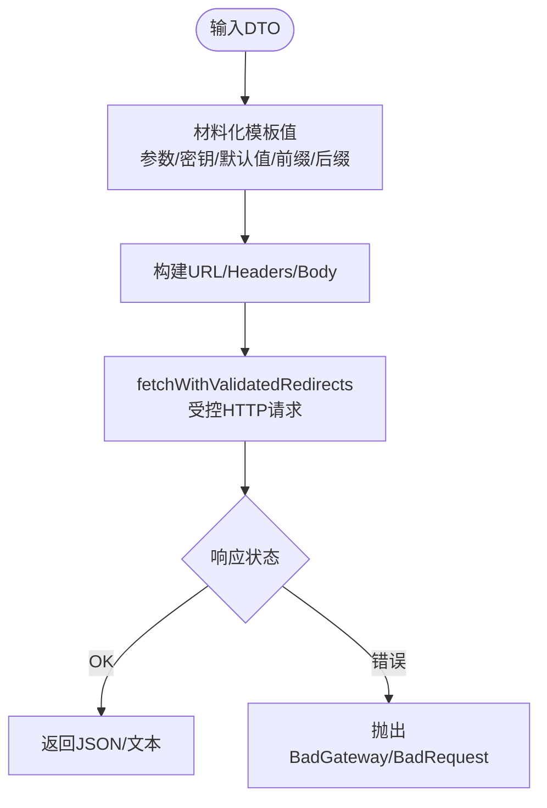
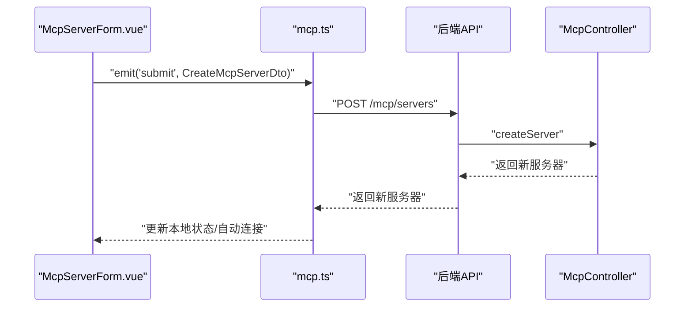
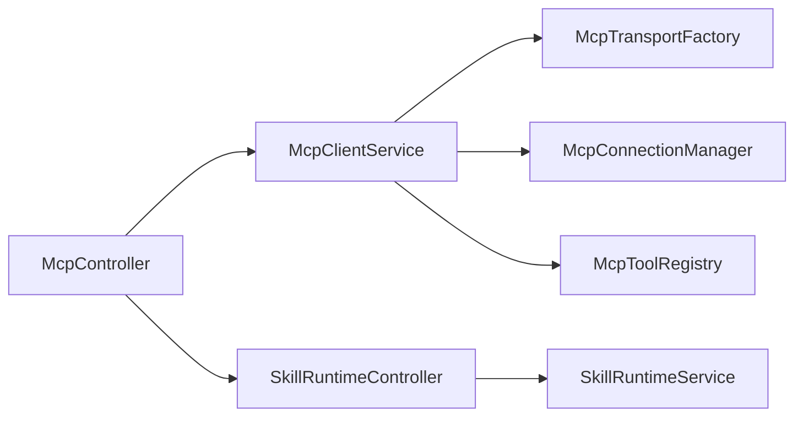

# 插件系统设计

<cite>
**本文引用的文件**   
- [apps/backend/src/mcp/mcp.module.ts](file://apps/backend/src/mcp/mcp.module.ts)
- [apps/backend/src/mcp/mcp.controller.ts](file://apps/backend/src/mcp/mcp.controller.ts)
- [apps/backend/src/mcp/mcp.dto.ts](file://apps/backend/src/mcp/mcp.dto.ts)
- [apps/backend/src/mcp/core/mcp-connection.manager.ts](file://apps/backend/src/mcp/core/mcp-connection.manager.ts)
- [apps/backend/src/mcp/core/mcp-tool.registry.ts](file://apps/backend/src/mcp/core/mcp-tool.registry.ts)
- [apps/backend/src/mcp/core/mcp-transport.factory.ts](file://apps/backend/src/mcp/core/mcp-transport.factory.ts)
- [apps/backend/src/mcp/mcp-client.service.ts](file://apps/backend/src/mcp/mcp-client.service.ts)
- [packages/shared/src/schemas/mcp.schema.ts](file://packages/shared/src/schemas/mcp.schema.ts)
- [apps/backend/src/skill-sources/skill-runtime.service.ts](file://apps/backend/src/skill-sources/skill-runtime.service.ts)
- [apps/backend/src/skill-sources/skill-runtime.controller.ts](file://apps/backend/src/skill-sources/skill-runtime.controller.ts)
- [apps/backend/src/skill-sources/skill-runtime.materialization.ts](file://apps/backend/src/skill-sources/skill-runtime.materialization.ts)
- [apps/backend/src/skill-sources/skill-runtime.http.ts](file://apps/backend/src/skill-sources/skill-runtime.http.ts)
- [apps/frontend/src/features/mcp/components/McpServerForm.vue](file://apps/frontend/src/features/mcp/components/McpServerForm.vue)
- [apps/frontend/src/features/mcp/stores/mcp.ts](file://apps/frontend/src/features/mcp/stores/mcp.ts)
</cite>

## 目录
1. [引言](#引言)
2. [项目结构](#项目结构)
3. [核心组件](#核心组件)
4. [架构总览](#架构总览)
5. [详细组件分析](#详细组件分析)
6. [依赖关系分析](#依赖关系分析)
7. [性能考量](#性能考量)
8. [故障排查指南](#故障排查指南)
9. [结论](#结论)
10. [附录](#附录)

## 引言
本指南面向 Lumina Todo 的插件系统设计与开发，聚焦“外部工具能力扩展”（MCP）与“技能运行时”两大插件化能力。系统采用模块化、可插拔的架构，支持通过标准协议接入第三方工具或服务，并提供统一的生命周期管理、安全隔离、配置与参数传递、事件与状态管理、以及前后端协同的可视化配置界面。

## 项目结构
插件系统由“后端模块 + 前端组件 + 共享模式”三部分组成：
- 后端模块：MCP 协议适配、传输工厂、连接管理、工具注册表、控制器与 DTO；技能运行时 HTTP 执行器。
- 前端模块：MCP 服务器配置表单、Pinia 状态管理、工具发现与调用。
- 共享层：跨应用复用的模式定义与校验规则（如 MCP 传输类型、HTTP 安全限制等）。

**图表来源**
- [apps/frontend/src/features/mcp/components/McpServerForm.vue:1-188](file://apps/frontend/src/features/mcp/components/McpServerForm.vue#L1-L188)
- [apps/frontend/src/features/mcp/stores/mcp.ts:1-246](file://apps/frontend/src/features/mcp/stores/mcp.ts#L1-L246)
- [apps/backend/src/mcp/mcp.controller.ts:1-198](file://apps/backend/src/mcp/mcp.controller.ts#L1-L198)
- [apps/backend/src/mcp/mcp-client.service.ts:1-124](file://apps/backend/src/mcp/mcp-client.service.ts#L1-L124)
- [apps/backend/src/mcp/core/mcp-transport.factory.ts:1-220](file://apps/backend/src/mcp/core/mcp-transport.factory.ts#L1-L220)
- [apps/backend/src/mcp/core/mcp-connection.manager.ts:1-101](file://apps/backend/src/mcp/core/mcp-connection.manager.ts#L1-L101)
- [apps/backend/src/mcp/core/mcp-tool.registry.ts:1-48](file://apps/backend/src/mcp/core/mcp-tool.registry.ts#L1-L48)
- [apps/backend/src/skill-sources/skill-runtime.controller.ts:1-20](file://apps/backend/src/skill-sources/skill-runtime.controller.ts#L1-L20)
- [apps/backend/src/skill-sources/skill-runtime.service.ts:1-97](file://apps/backend/src/skill-sources/skill-runtime.service.ts#L1-L97)
- [packages/shared/src/schemas/mcp.schema.ts:1-220](file://packages/shared/src/schemas/mcp.schema.ts#L1-L220)

**章节来源**
- [apps/backend/src/mcp/mcp.module.ts:1-25](file://apps/backend/src/mcp/mcp.module.ts#L1-L25)
- [apps/backend/src/mcp/mcp.controller.ts:1-198](file://apps/backend/src/mcp/mcp.controller.ts#L1-L198)
- [apps/backend/src/mcp/mcp-client.service.ts:1-124](file://apps/backend/src/mcp/mcp-client.service.ts#L1-L124)
- [apps/backend/src/mcp/core/mcp-transport.factory.ts:1-220](file://apps/backend/src/mcp/core/mcp-transport.factory.ts#L1-L220)
- [apps/backend/src/mcp/core/mcp-connection.manager.ts:1-101](file://apps/backend/src/mcp/core/mcp-connection.manager.ts#L1-L101)
- [apps/backend/src/mcp/core/mcp-tool.registry.ts:1-48](file://apps/backend/src/mcp/core/mcp-tool.registry.ts#L1-L48)
- [apps/backend/src/skill-sources/skill-runtime.controller.ts:1-20](file://apps/backend/src/skill-sources/skill-runtime.controller.ts#L1-L20)
- [apps/backend/src/skill-sources/skill-runtime.service.ts:1-97](file://apps/backend/src/skill-sources/skill-runtime.service.ts#L1-L97)
- [apps/frontend/src/features/mcp/components/McpServerForm.vue:1-188](file://apps/frontend/src/features/mcp/components/McpServerForm.vue#L1-L188)
- [apps/frontend/src/features/mcp/stores/mcp.ts:1-246](file://apps/frontend/src/features/mcp/stores/mcp.ts#L1-L246)
- [packages/shared/src/schemas/mcp.schema.ts:1-220](file://packages/shared/src/schemas/mcp.schema.ts#L1-L220)

## 核心组件
- MCP 控制器与门面
  - 控制器负责鉴权、权限校验、工具发现与调用入口。
  - 门面整合传输工厂、连接管理与工具注册表，屏蔽细节。
- 传输工厂
  - 统一创建 STDIO/HTTP 传输，内置安全检查与环境变量白名单。
- 连接管理
  - 维护活跃连接集合，支持懒连接、断开清理与模块销毁回收。
- 工具注册表
  - 缓存工具清单，按需刷新，失败时回退缓存。
- 技能运行时
  - 将模板化的请求参数、头部、查询与密钥绑定为最终值，发起受控 HTTP 请求并处理重定向与超时。
- 前端 MCP 管理
  - 表单组件与 Pinia Store 负责配置持久化、连接状态与错误展示。

**章节来源**
- [apps/backend/src/mcp/mcp.controller.ts:1-198](file://apps/backend/src/mcp/mcp.controller.ts#L1-L198)
- [apps/backend/src/mcp/mcp-client.service.ts:1-124](file://apps/backend/src/mcp/mcp-client.service.ts#L1-L124)
- [apps/backend/src/mcp/core/mcp-transport.factory.ts:1-220](file://apps/backend/src/mcp/core/mcp-transport.factory.ts#L1-L220)
- [apps/backend/src/mcp/core/mcp-connection.manager.ts:1-101](file://apps/backend/src/mcp/core/mcp-connection.manager.ts#L1-L101)
- [apps/backend/src/mcp/core/mcp-tool.registry.ts:1-48](file://apps/backend/src/mcp/core/mcp-tool.registry.ts#L1-L48)
- [apps/backend/src/skill-sources/skill-runtime.service.ts:1-97](file://apps/backend/src/skill-sources/skill-runtime.service.ts#L1-L97)
- [apps/frontend/src/features/mcp/components/McpServerForm.vue:1-188](file://apps/frontend/src/features/mcp/components/McpServerForm.vue#L1-L188)
- [apps/frontend/src/features/mcp/stores/mcp.ts:1-246](file://apps/frontend/src/features/mcp/stores/mcp.ts#L1-L246)

## 架构总览
下图展示了从用户操作到后端插件执行的关键路径，包括 MCP 工具发现与调用、技能运行时执行、以及安全与配置约束。

**图表来源**
- [apps/backend/src/mcp/mcp.controller.ts:1-198](file://apps/backend/src/mcp/mcp.controller.ts#L1-L198)
- [apps/backend/src/mcp/mcp-client.service.ts:1-124](file://apps/backend/src/mcp/mcp-client.service.ts#L1-L124)
- [apps/backend/src/mcp/core/mcp-transport.factory.ts:1-220](file://apps/backend/src/mcp/core/mcp-transport.factory.ts#L1-L220)
- [apps/backend/src/mcp/core/mcp-connection.manager.ts:1-101](file://apps/backend/src/mcp/core/mcp-connection.manager.ts#L1-L101)
- [apps/backend/src/mcp/core/mcp-tool.registry.ts:1-48](file://apps/backend/src/mcp/core/mcp-tool.registry.ts#L1-L48)
- [apps/backend/src/skill-sources/skill-runtime.controller.ts:1-20](file://apps/backend/src/skill-sources/skill-runtime.controller.ts#L1-L20)
- [apps/backend/src/skill-sources/skill-runtime.service.ts:1-97](file://apps/backend/src/skill-sources/skill-runtime.service.ts#L1-L97)
- [apps/frontend/src/features/mcp/stores/mcp.ts:1-246](file://apps/frontend/src/features/mcp/stores/mcp.ts#L1-L246)

## 详细组件分析

### MCP 模块与生命周期
- 模块装配：控制器、客户端服务、传输工厂、连接管理、工具注册表集中导出，便于按需注入。
- 生命周期要点：
  - 懒连接：首次发现工具或调用工具前尝试连接。
  - 连接回收：模块销毁时主动断开所有连接。
  - 工具缓存：注册表缓存工具清单，异常时回退缓存。
  - 权限与所有权：每个操作均基于当前用户上下文进行校验。

**图表来源**
- [apps/backend/src/mcp/mcp.module.ts:1-25](file://apps/backend/src/mcp/mcp.module.ts#L1-L25)
- [apps/backend/src/mcp/mcp.controller.ts:1-198](file://apps/backend/src/mcp/mcp.controller.ts#L1-L198)
- [apps/backend/src/mcp/mcp-client.service.ts:1-124](file://apps/backend/src/mcp/mcp-client.service.ts#L1-L124)
- [apps/backend/src/mcp/core/mcp-transport.factory.ts:1-220](file://apps/backend/src/mcp/core/mcp-transport.factory.ts#L1-L220)
- [apps/backend/src/mcp/core/mcp-connection.manager.ts:1-101](file://apps/backend/src/mcp/core/mcp-connection.manager.ts#L1-L101)
- [apps/backend/src/mcp/core/mcp-tool.registry.ts:1-48](file://apps/backend/src/mcp/core/mcp-tool.registry.ts#L1-L48)

**章节来源**
- [apps/backend/src/mcp/mcp.module.ts:1-25](file://apps/backend/src/mcp/mcp.module.ts#L1-L25)
- [apps/backend/src/mcp/mcp.controller.ts:1-198](file://apps/backend/src/mcp/mcp.controller.ts#L1-L198)
- [apps/backend/src/mcp/mcp-client.service.ts:1-124](file://apps/backend/src/mcp/mcp-client.service.ts#L1-L124)
- [apps/backend/src/mcp/core/mcp-connection.manager.ts:1-101](file://apps/backend/src/mcp/core/mcp-connection.manager.ts#L1-L101)
- [apps/backend/src/mcp/core/mcp-tool.registry.ts:1-48](file://apps/backend/src/mcp/core/mcp-tool.registry.ts#L1-L48)

### 传输工厂与安全隔离
- 支持 STDIO 与 HTTP 两种传输：
  - STDIO：命令与参数校验、环境变量白名单、工作目录与 CWD 设置、包名纠正。
  - HTTP：协议限制（仅 http/https）、主机黑名单（localhost、.local、私网地址）、DNS 解析与 IP 白名单校验、认证头注入（Bearer/OAuth/API Key）。
- 生产环境限制：
  - STDIO 必须显式允许命令白名单，否则拒绝。
  - HTTP 目标必须通过安全检查，否则抛出错误。

**图表来源**
- [apps/backend/src/mcp/core/mcp-transport.factory.ts:1-220](file://apps/backend/src/mcp/core/mcp-transport.factory.ts#L1-L220)
- [apps/backend/src/skill-sources/skill-runtime.http.ts:1-123](file://apps/backend/src/skill-sources/skill-runtime.http.ts#L1-L123)
- [packages/shared/src/schemas/mcp.schema.ts:1-220](file://packages/shared/src/schemas/mcp.schema.ts#L1-L220)

**章节来源**
- [apps/backend/src/mcp/core/mcp-transport.factory.ts:1-220](file://apps/backend/src/mcp/core/mcp-transport.factory.ts#L1-L220)
- [apps/backend/src/skill-sources/skill-runtime.http.ts:1-123](file://apps/backend/src/skill-sources/skill-runtime.http.ts#L1-L123)
- [packages/shared/src/schemas/mcp.schema.ts:1-220](file://packages/shared/src/schemas/mcp.schema.ts#L1-L220)

### 工具发现与调用流程
- 工具发现：
  - 用户获取“已启用服务器”的工具清单时，控制器逐个连接并拉取工具列表，同时为工具注入 serverId 以标识来源。
- 工具调用：
  - 调用前先检查连接与工具存在性，再通过底层客户端发起调用，记录日志并返回结果。

**图表来源**
- [apps/backend/src/mcp/mcp.controller.ts:105-196](file://apps/backend/src/mcp/mcp.controller.ts#L105-L196)
- [apps/backend/src/mcp/mcp-client.service.ts:60-108](file://apps/backend/src/mcp/mcp-client.service.ts#L60-L108)
- [apps/backend/src/mcp/core/mcp-connection.manager.ts:23-73](file://apps/backend/src/mcp/core/mcp-connection.manager.ts#L23-L73)
- [apps/backend/src/mcp/core/mcp-tool.registry.ts:20-42](file://apps/backend/src/mcp/core/mcp-tool.registry.ts#L20-L42)

**章节来源**
- [apps/backend/src/mcp/mcp.controller.ts:105-196](file://apps/backend/src/mcp/mcp.controller.ts#L105-L196)
- [apps/backend/src/mcp/mcp-client.service.ts:60-108](file://apps/backend/src/mcp/mcp-client.service.ts#L60-L108)
- [apps/backend/src/mcp/core/mcp-connection.manager.ts:23-73](file://apps/backend/src/mcp/core/mcp-connection.manager.ts#L23-L73)
- [apps/backend/src/mcp/core/mcp-tool.registry.ts:20-42](file://apps/backend/src/mcp/core/mcp-tool.registry.ts#L20-L42)

### 技能运行时与参数模板化
- 模板绑定：
  - 支持从“参数映射”和“密钥”中提取值，支持默认值、前缀/后缀拼接、嵌套路径读取。
- 执行流程：
  - 将模板值材料化为最终标量或对象，构建 URL 查询、请求头与请求体，设置超时与中断信号，发起受控 HTTP 请求并处理重定向。
- 安全与校验：
  - URL 协议与主机安全检查、禁止过多重定向、错误分类与提示。

**图表来源**
- [apps/backend/src/skill-sources/skill-runtime.materialization.ts:1-183](file://apps/backend/src/skill-sources/skill-runtime.materialization.ts#L1-L183)
- [apps/backend/src/skill-sources/skill-runtime.http.ts:75-122](file://apps/backend/src/skill-sources/skill-runtime.http.ts#L75-L122)
- [apps/backend/src/skill-sources/skill-runtime.service.ts:14-95](file://apps/backend/src/skill-sources/skill-runtime.service.ts#L14-L95)

**章节来源**
- [apps/backend/src/skill-sources/skill-runtime.materialization.ts:1-183](file://apps/backend/src/skill-sources/skill-runtime.materialization.ts#L1-L183)
- [apps/backend/src/skill-sources/skill-runtime.http.ts:1-123](file://apps/backend/src/skill-sources/skill-runtime.http.ts#L1-L123)
- [apps/backend/src/skill-sources/skill-runtime.service.ts:1-97](file://apps/backend/src/skill-sources/skill-runtime.service.ts#L1-L97)

### 前端插件配置与状态管理
- 表单组件：
  - 支持基础信息、传输类型切换、STDIO/HTTP 配置分段展示，提交时根据传输类型组装 DTO。
- 状态管理：
  - 统一维护服务器列表、连接状态、连接中状态、错误信息；支持自动连接、更新后按需重建连接、删除时断开。

**图表来源**
- [apps/frontend/src/features/mcp/components/McpServerForm.vue:100-135](file://apps/frontend/src/features/mcp/components/McpServerForm.vue#L100-L135)
- [apps/frontend/src/features/mcp/stores/mcp.ts:89-111](file://apps/frontend/src/features/mcp/stores/mcp.ts#L89-L111)
- [apps/backend/src/mcp/mcp.controller.ts:47-52](file://apps/backend/src/mcp/mcp.controller.ts#L47-L52)

**章节来源**
- [apps/frontend/src/features/mcp/components/McpServerForm.vue:1-188](file://apps/frontend/src/features/mcp/components/McpServerForm.vue#L1-L188)
- [apps/frontend/src/features/mcp/stores/mcp.ts:1-246](file://apps/frontend/src/features/mcp/stores/mcp.ts#L1-L246)
- [apps/backend/src/mcp/mcp.controller.ts:1-198](file://apps/backend/src/mcp/mcp.controller.ts#L1-L198)

## 依赖关系分析
- 模块内聚与解耦：
  - 控制器仅做鉴权与编排，具体传输、连接、工具管理由门面与子服务承担，职责清晰。
- 外部依赖：
  - MCP SDK 的传输与客户端封装；Node DNS/网络 API 用于安全检查；Zod 用于前后端一致的模式校验。
- 循环依赖：
  - 通过门面与注入方式避免直接循环依赖，连接管理与工具注册表通过 Map 存储，无强耦合。

**图表来源**
- [apps/backend/src/mcp/mcp.controller.ts:1-198](file://apps/backend/src/mcp/mcp.controller.ts#L1-L198)
- [apps/backend/src/mcp/mcp-client.service.ts:1-124](file://apps/backend/src/mcp/mcp-client.service.ts#L1-L124)
- [apps/backend/src/mcp/core/mcp-transport.factory.ts:1-220](file://apps/backend/src/mcp/core/mcp-transport.factory.ts#L1-L220)
- [apps/backend/src/mcp/core/mcp-connection.manager.ts:1-101](file://apps/backend/src/mcp/core/mcp-connection.manager.ts#L1-L101)
- [apps/backend/src/mcp/core/mcp-tool.registry.ts:1-48](file://apps/backend/src/mcp/core/mcp-tool.registry.ts#L1-L48)
- [apps/backend/src/skill-sources/skill-runtime.controller.ts:1-20](file://apps/backend/src/skill-sources/skill-runtime.controller.ts#L1-L20)
- [apps/backend/src/skill-sources/skill-runtime.service.ts:1-97](file://apps/backend/src/skill-sources/skill-runtime.service.ts#L1-L97)

**章节来源**
- [apps/backend/src/mcp/mcp.controller.ts:1-198](file://apps/backend/src/mcp/mcp.controller.ts#L1-L198)
- [apps/backend/src/mcp/mcp-client.service.ts:1-124](file://apps/backend/src/mcp/mcp-client.service.ts#L1-L124)
- [apps/backend/src/mcp/core/mcp-transport.factory.ts:1-220](file://apps/backend/src/mcp/core/mcp-transport.factory.ts#L1-L220)
- [apps/backend/src/mcp/core/mcp-connection.manager.ts:1-101](file://apps/backend/src/mcp/core/mcp-connection.manager.ts#L1-L101)
- [apps/backend/src/mcp/core/mcp-tool.registry.ts:1-48](file://apps/backend/src/mcp/core/mcp-tool.registry.ts#L1-L48)
- [apps/backend/src/skill-sources/skill-runtime.controller.ts:1-20](file://apps/backend/src/skill-sources/skill-runtime.controller.ts#L1-L20)
- [apps/backend/src/skill-sources/skill-runtime.service.ts:1-97](file://apps/backend/src/skill-sources/skill-runtime.service.ts#L1-L97)

## 性能考量
- 懒连接与缓存
  - 首次使用时才建立连接，减少资源占用；工具清单缓存降低重复拉取成本。
- 并发与超时
  - 连接建立与工具调用具备超时控制；HTTP 技能运行时设置默认超时与中断信号，避免长时间阻塞。
- 安全前置检查
  - 在传输创建阶段即进行协议与主机校验，尽早失败，避免无效连接与资源浪费。

[本节为通用建议，不直接分析具体文件]

## 故障排查指南
- 连接失败
  - 检查传输类型与配置是否匹配；查看传输工厂的安全限制与白名单配置；确认 MCP 服务可达且未被拦截。
- 工具不可用
  - 确认已连接目标服务器；检查工具注册表缓存是否有效；必要时触发刷新。
- HTTP 技能运行时错误
  - 关注协议与主机限制、重定向次数、响应状态码；查看错误消息中的截断内容定位问题。
- 前端状态异常
  - 查看 Pinia store 的连接状态与错误字段；确认自动连接逻辑是否触发；核对服务器启用状态变更后的连接重建。

**章节来源**
- [apps/backend/src/mcp/core/mcp-transport.factory.ts:91-126](file://apps/backend/src/mcp/core/mcp-transport.factory.ts#L91-L126)
- [apps/backend/src/mcp/core/mcp-tool.registry.ts:20-42](file://apps/backend/src/mcp/core/mcp-tool.registry.ts#L20-L42)
- [apps/backend/src/skill-sources/skill-runtime.http.ts:75-122](file://apps/backend/src/skill-sources/skill-runtime.http.ts#L75-L122)
- [apps/frontend/src/features/mcp/stores/mcp.ts:174-202](file://apps/frontend/src/features/mcp/stores/mcp.ts#L174-L202)

## 结论
Lumina Todo 的插件系统以 MCP 与技能运行时为核心，结合严格的传输安全、懒连接与缓存策略、前后端一体化的状态管理，实现了可扩展、可审计、可维护的插件化能力。通过标准化的接口与配置模式，开发者可以快速接入新的外部工具或服务，并在保证安全的前提下获得良好的运行体验。

[本节为总结，不直接分析具体文件]

## 附录

### 插件接口规范与标准化开发流程
- 接口规范
  - 使用共享模式定义传输类型、配置结构与校验规则，确保前后端一致。
  - 控制器统一鉴权与权限校验，避免越权访问。
- 开发流程
  - 设计传输配置（STDIO/HTTP），实现安全检查与白名单；
  - 实现连接与工具注册表，支持懒连接与缓存；
  - 提供工具发现与调用接口，记录日志与错误；
  - 前端表单与状态管理配合，实现可视化配置与连接控制。

**章节来源**
- [packages/shared/src/schemas/mcp.schema.ts:1-220](file://packages/shared/src/schemas/mcp.schema.ts#L1-L220)
- [apps/backend/src/mcp/mcp.controller.ts:1-198](file://apps/backend/src/mcp/mcp.controller.ts#L1-L198)
- [apps/backend/src/mcp/core/mcp-transport.factory.ts:1-220](file://apps/backend/src/mcp/core/mcp-transport.factory.ts#L1-L220)
- [apps/backend/src/mcp/core/mcp-tool.registry.ts:1-48](file://apps/backend/src/mcp/core/mcp-tool.registry.ts#L1-L48)
- [apps/frontend/src/features/mcp/components/McpServerForm.vue:1-188](file://apps/frontend/src/features/mcp/components/McpServerForm.vue#L1-L188)
- [apps/frontend/src/features/mcp/stores/mcp.ts:1-246](file://apps/frontend/src/features/mcp/stores/mcp.ts#L1-L246)

### 自定义插件开发模板与实现示例
- MCP 插件模板
  - 选择传输类型与配置项（STDIO 命令/参数/环境变量；HTTP URL/认证头）；
  - 在前端表单中填写并提交，后端通过传输工厂创建连接，连接管理器维护连接，工具注册表缓存工具清单。
- 技能运行时模板
  - 准备模板值（参数映射/密钥），材料化后构建请求，调用技能运行时控制器执行 HTTP 请求。

**章节来源**
- [apps/frontend/src/features/mcp/components/McpServerForm.vue:1-188](file://apps/frontend/src/features/mcp/components/McpServerForm.vue#L1-L188)
- [apps/backend/src/mcp/core/mcp-transport.factory.ts:1-220](file://apps/backend/src/mcp/core/mcp-transport.factory.ts#L1-L220)
- [apps/backend/src/mcp/core/mcp-connection.manager.ts:1-101](file://apps/backend/src/mcp/core/mcp-connection.manager.ts#L1-L101)
- [apps/backend/src/mcp/core/mcp-tool.registry.ts:1-48](file://apps/backend/src/mcp/core/mcp-tool.registry.ts#L1-L48)
- [apps/backend/src/skill-sources/skill-runtime.materialization.ts:1-183](file://apps/backend/src/skill-sources/skill-runtime.materialization.ts#L1-L183)
- [apps/backend/src/skill-sources/skill-runtime.service.ts:1-97](file://apps/backend/src/skill-sources/skill-runtime.service.ts#L1-L97)

### 插件间通信机制与事件系统
- 当前实现
  - 插件间通过各自独立的连接与工具注册表进行隔离；工具调用结果通过控制器返回给前端。
- 建议
  - 若需跨插件通信，可在控制器层引入事件发布/订阅或中间件层的统一路由与转发机制，以保持模块边界清晰。

[本节为概念性建议，不直接分析具体文件]

### 插件配置管理与参数传递
- 配置管理
  - 后端提供创建/更新/删除/启用/禁用接口，前端 Pinia store 维护状态与错误。
- 参数传递
  - MCP 工具调用参数与技能运行时模板值均支持材料化与绑定，支持默认值与前缀/后缀拼接。

**章节来源**
- [apps/backend/src/mcp/mcp.controller.ts:47-101](file://apps/backend/src/mcp/mcp.controller.ts#L47-L101)
- [apps/frontend/src/features/mcp/stores/mcp.ts:116-152](file://apps/frontend/src/features/mcp/stores/mcp.ts#L116-L152)
- [apps/backend/src/skill-sources/skill-runtime.materialization.ts:91-126](file://apps/backend/src/skill-sources/skill-runtime.materialization.ts#L91-L126)

### 权限控制与安全隔离策略
- 权限控制
  - 所有接口均使用 JWT 保护，控制器在每个操作前验证用户身份与资源所有权。
- 安全隔离
  - 传输工厂对 STDIO/HTTP 进行严格限制；技能运行时对 URL 与重定向进行安全检查；连接管理器在模块销毁时回收资源。

**章节来源**
- [apps/backend/src/mcp/mcp.controller.ts:16-33](file://apps/backend/src/mcp/mcp.controller.ts#L16-L33)
- [apps/backend/src/mcp/core/mcp-transport.factory.ts:67-110](file://apps/backend/src/mcp/core/mcp-transport.factory.ts#L67-L110)
- [apps/backend/src/mcp/core/mcp-connection.manager.ts:17-21](file://apps/backend/src/mcp/core/mcp-connection.manager.ts#L17-L21)
- [apps/backend/src/skill-sources/skill-runtime.http.ts:50-69](file://apps/backend/src/skill-sources/skill-runtime.http.ts#L50-L69)

### 测试框架与调试工具
- 测试建议
  - 为传输工厂添加安全检查与白名单的单元测试；为工具注册表添加缓存与刷新的集成测试；为控制器添加鉴权与权限校验的 E2E 测试。
- 调试建议
  - 利用日志输出传输与连接状态；在前端 store 中记录连接中与错误状态；对技能运行时请求增加超时与中断信号的可观测性。

[本节为通用建议，不直接分析具体文件]

### 热重载与版本兼容性处理
- 热重载
  - 建议在开发环境启用模块热替换与自动重连；对工具注册表的缓存进行失效策略，确保配置变更后及时生效。
- 版本兼容
  - 传输工厂与 SDK 的版本升级需进行回归测试；对 MCP 工具输入/输出模式变化，通过向后兼容的输入模式与输出转换进行过渡。

[本节为通用建议，不直接分析具体文件]