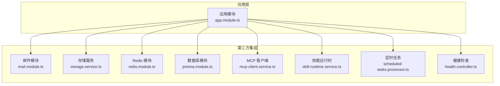
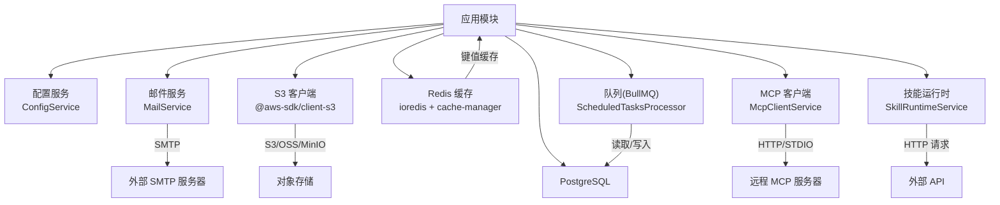
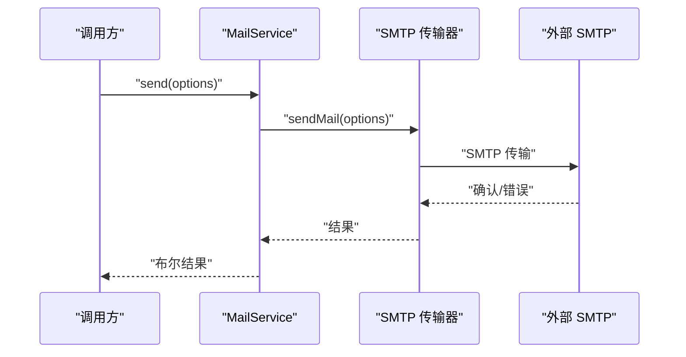
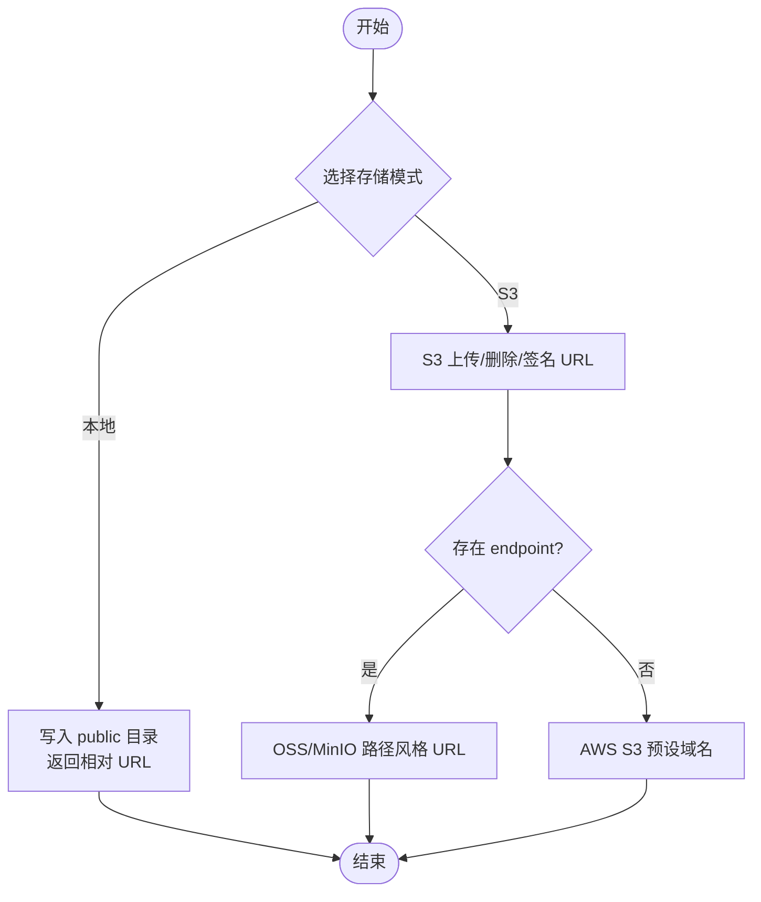
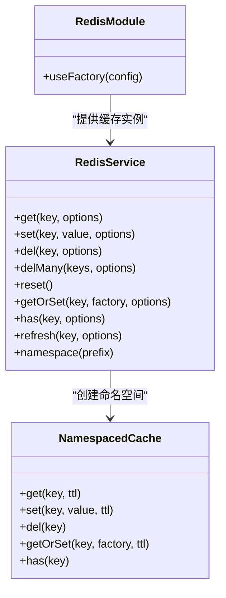
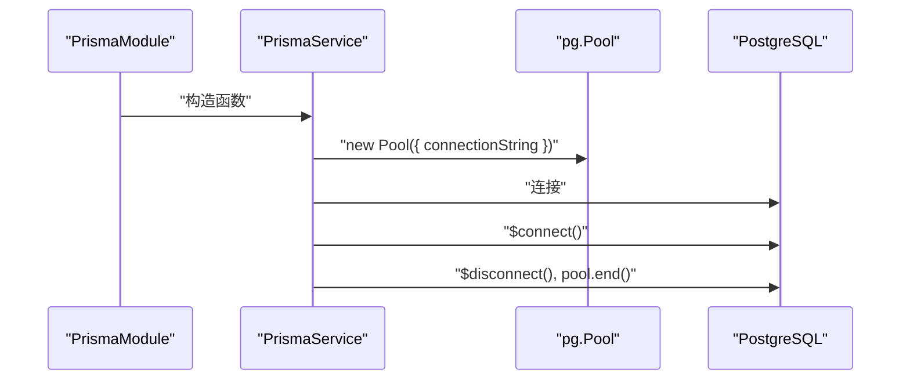
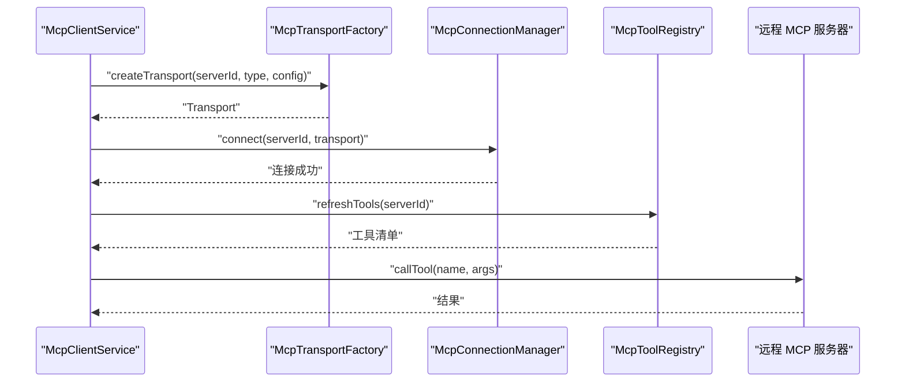
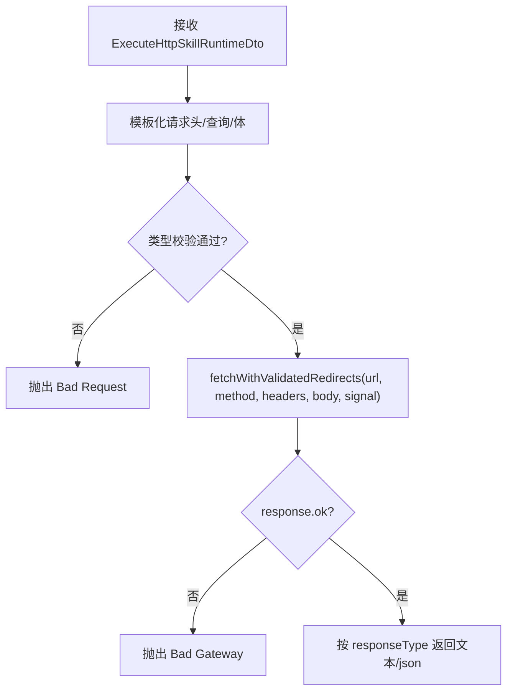
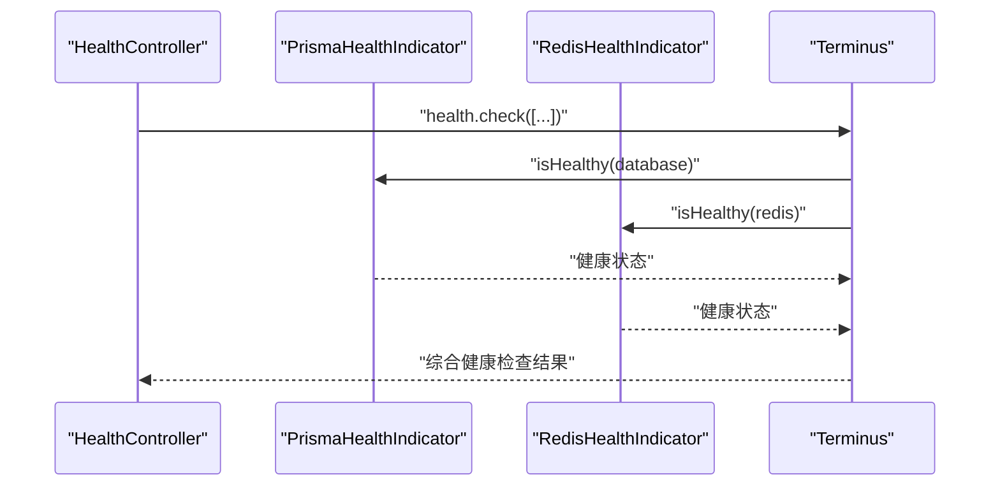
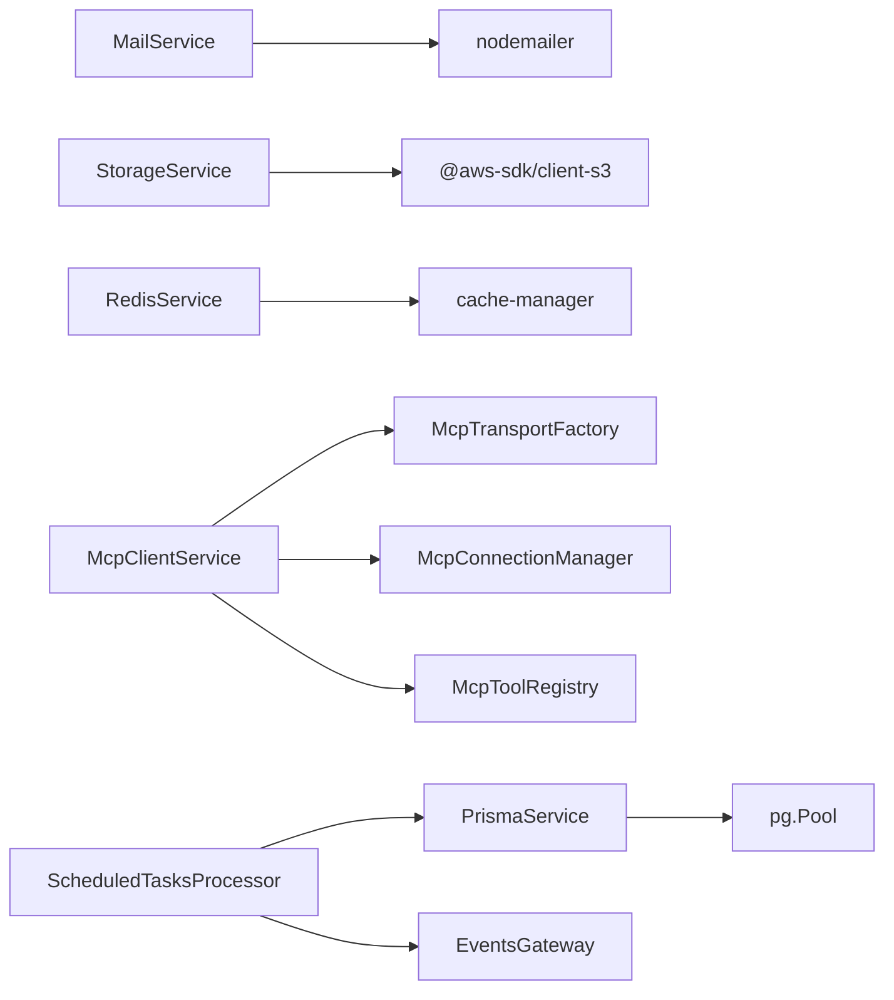

# 第三方集成

<cite>
**本文引用的文件**
- [apps/backend/src/mail/mail.module.ts](file://apps/backend/src/mail/mail.module.ts)
- [apps/backend/src/mail/mail.service.ts](file://apps/backend/src/mail/mail.service.ts)
- [apps/backend/src/upload/storage.service.ts](file://apps/backend/src/upload/storage.service.ts)
- [apps/backend/src/redis/redis.module.ts](file://apps/backend/src/redis/redis.module.ts)
- [apps/backend/src/redis/redis.service.ts](file://apps/backend/src/redis/redis.service.ts)
- [apps/backend/src/prisma/prisma.service.ts](file://apps/backend/src/prisma/prisma.service.ts)
- [apps/backend/src/prisma/prisma.module.ts](file://apps/backend/src/prisma/prisma.module.ts)
- [apps/backend/prisma/schema/base.prisma](file://apps/backend/prisma/schema/base.prisma)
- [apps/backend/prisma/schema/todo.prisma](file://apps/backend/prisma/schema/todo.prisma)
- [apps/backend/prisma/schema/user.prisma](file://apps/backend/prisma/schema/user.prisma)
- [apps/backend/src/mcp/mcp-client.service.ts](file://apps/backend/src/mcp/mcp-client.service.ts)
- [apps/backend/src/mcp/mcp-server-config.service.ts](file://apps/backend/src/mcp/mcp-server-config.service.ts)
- [apps/backend/src/skill-sources/skill-runtime.service.ts](file://apps/backend/src/skill-sources/skill-runtime.service.ts)
- [apps/backend/src/scheduled-tasks/scheduled-tasks.processor.ts](file://apps/backend/src/scheduled-tasks/scheduled-tasks.processor.ts)
- [apps/backend/src/health/health.controller.ts](file://apps/backend/src/health/health.controller.ts)
</cite>

## 目录
1. [简介](#简介)
2. [项目结构](#项目结构)
3. [核心组件](#核心组件)
4. [架构总览](#架构总览)
5. [详细组件分析](#详细组件分析)
6. [依赖分析](#依赖分析)
7. [性能考虑](#性能考虑)
8. [故障排查指南](#故障排查指南)
9. [结论](#结论)
10. [附录](#附录)

## 简介
本指南面向 Lumina Todo 的第三方服务集成，围绕以下主题提供系统化说明与最佳实践：
- 邮件服务集成：基于 SMTP 的 nodemailer 配置与国际化模板封装
- 文件存储服务：AWS S3 与兼容 S3 的对象存储（含 OSS/MinIO），以及本地文件存储
- 缓存系统：基于 Redis 的全局缓存模块与命名空间缓存
- 数据库连接池与事务：PostgreSQL 连接池、Prisma 适配器与事务管理
- 迁移策略：Prisma Schema 设计与索引策略
- 外部 API 集成：MCP 客户端、技能运行时 HTTP 调用与超时控制
- SDK 使用与错误重试：Redis 连接重试策略、S3 SDK 使用要点
- 云服务集成：Kubernetes 就绪/存活探针、健康检查
- 认证授权与数据同步：鉴权守卫、JWT、会话与事件网关
- 集成测试、监控告警与故障恢复：定时任务、健康检查、日志与异常过滤
- 安全配置、性能优化与成本控制：密钥管理、TTL 规划、连接池参数

## 项目结构
后端采用 NestJS 模块化组织，第三方集成相关模块分布如下：
- 邮件服务：mail.module.ts 与 mail.service.ts
- 存储服务：storage.service.ts（S3/本地）
- 缓存服务：redis.module.ts 与 redis.service.ts
- 数据库：prisma.module.ts 与 prisma.service.ts，配合 schema/*.prisma
- 外部集成：mcp-client.service.ts、mcp-server-config.service.ts、skill-runtime.service.ts
- 定时任务：scheduled-tasks.processor.ts
- 健康检查：health.controller.ts

图表来源
- [apps/backend/src/mail/mail.module.ts:1-37](file://apps/backend/src/mail/mail.module.ts#L1-L37)
- [apps/backend/src/upload/storage.service.ts:1-216](file://apps/backend/src/upload/storage.service.ts#L1-L216)
- [apps/backend/src/redis/redis.module.ts:1-84](file://apps/backend/src/redis/redis.module.ts#L1-L84)
- [apps/backend/src/prisma/prisma.module.ts:1-10](file://apps/backend/src/prisma/prisma.module.ts#L1-L10)
- [apps/backend/src/mcp/mcp-client.service.ts:1-124](file://apps/backend/src/mcp/mcp-client.service.ts#L1-L124)
- [apps/backend/src/skill-sources/skill-runtime.service.ts:1-97](file://apps/backend/src/skill-sources/skill-runtime.service.ts#L1-L97)
- [apps/backend/src/scheduled-tasks/scheduled-tasks.processor.ts:1-290](file://apps/backend/src/scheduled-tasks/scheduled-tasks.processor.ts#L1-L290)
- [apps/backend/src/health/health.controller.ts:1-80](file://apps/backend/src/health/health.controller.ts#L1-L80)

章节来源
- [apps/backend/src/mail/mail.module.ts:1-37](file://apps/backend/src/mail/mail.module.ts#L1-L37)
- [apps/backend/src/upload/storage.service.ts:1-216](file://apps/backend/src/upload/storage.service.ts#L1-L216)
- [apps/backend/src/redis/redis.module.ts:1-84](file://apps/backend/src/redis/redis.module.ts#L1-L84)
- [apps/backend/src/prisma/prisma.module.ts:1-10](file://apps/backend/src/prisma/prisma.module.ts#L1-L10)
- [apps/backend/src/mcp/mcp-client.service.ts:1-124](file://apps/backend/src/mcp/mcp-client.service.ts#L1-L124)
- [apps/backend/src/skill-sources/skill-runtime.service.ts:1-97](file://apps/backend/src/skill-sources/skill-runtime.service.ts#L1-L97)
- [apps/backend/src/scheduled-tasks/scheduled-tasks.processor.ts:1-290](file://apps/backend/src/scheduled-tasks/scheduled-tasks.processor.ts#L1-L290)
- [apps/backend/src/health/health.controller.ts:1-80](file://apps/backend/src/health/health.controller.ts#L1-L80)

## 核心组件
- 邮件服务：通过 ConfigService 注入 SMTP 参数，使用 nodemailer 创建传输器；提供验证码与密码重置的国际化 HTML 模板
- 存储服务：支持本地文件写入与 S3/兼容 S3 的上传、删除、签名 URL；自动识别 OSS/MinIO 的 endpoint 并切换路径风格
- 缓存服务：全局 Redis 缓存模块，提供 TTL、键前缀、命名空间缓存、批量删除与刷新 TTL 等能力
- 数据库：基于 PostgreSQL 连接池的 Prisma 客户端，统一 onModuleInit/onModuleDestroy 生命周期
- 外部集成：MCP 客户端门面类，负责连接、工具列表与调用；技能运行时对 HTTP 技能进行模板化请求与超时控制
- 定时任务：BullMQ Worker，处理健康检查、过期清理、待办提醒与每日统计
- 健康检查：Terminus 集成数据库、Redis、内存与磁盘检查，提供存活/就绪探针

章节来源
- [apps/backend/src/mail/mail.service.ts:1-117](file://apps/backend/src/mail/mail.service.ts#L1-L117)
- [apps/backend/src/upload/storage.service.ts:1-216](file://apps/backend/src/upload/storage.service.ts#L1-L216)
- [apps/backend/src/redis/redis.service.ts:1-255](file://apps/backend/src/redis/redis.service.ts#L1-L255)
- [apps/backend/src/prisma/prisma.service.ts:1-34](file://apps/backend/src/prisma/prisma.service.ts#L1-L34)
- [apps/backend/src/mcp/mcp-client.service.ts:1-124](file://apps/backend/src/mcp/mcp-client.service.ts#L1-L124)
- [apps/backend/src/skill-sources/skill-runtime.service.ts:1-97](file://apps/backend/src/skill-sources/skill-runtime.service.ts#L1-L97)
- [apps/backend/src/scheduled-tasks/scheduled-tasks.processor.ts:1-290](file://apps/backend/src/scheduled-tasks/scheduled-tasks.processor.ts#L1-L290)
- [apps/backend/src/health/health.controller.ts:1-80](file://apps/backend/src/health/health.controller.ts#L1-L80)

## 架构总览
下图展示第三方集成的关键交互：应用模块装配各集成组件，外部服务通过 SDK 或 SMTP 协议交互，定时任务与健康检查贯穿系统生命周期。

图表来源
- [apps/backend/src/mail/mail.module.ts:1-37](file://apps/backend/src/mail/mail.module.ts#L1-L37)
- [apps/backend/src/mail/mail.service.ts:1-117](file://apps/backend/src/mail/mail.service.ts#L1-L117)
- [apps/backend/src/upload/storage.service.ts:1-216](file://apps/backend/src/upload/storage.service.ts#L1-L216)
- [apps/backend/src/redis/redis.module.ts:1-84](file://apps/backend/src/redis/redis.module.ts#L1-L84)
- [apps/backend/src/prisma/prisma.service.ts:1-34](file://apps/backend/src/prisma/prisma.service.ts#L1-L34)
- [apps/backend/src/mcp/mcp-client.service.ts:1-124](file://apps/backend/src/mcp/mcp-client.service.ts#L1-L124)
- [apps/backend/src/skill-sources/skill-runtime.service.ts:1-97](file://apps/backend/src/skill-sources/skill-runtime.service.ts#L1-L97)
- [apps/backend/src/scheduled-tasks/scheduled-tasks.processor.ts:1-290](file://apps/backend/src/scheduled-tasks/scheduled-tasks.processor.ts#L1-L290)

## 详细组件分析

### 邮件服务集成
- 配置项
  - 主机、端口、安全模式、认证凭据、发件人地址
  - 通过 ConfigService 动态注入，支持环境变量覆盖
- 功能特性
  - 文本与 HTML 邮件发送
  - 国际化主题与内容，基于 i18n 键生成邮件正文
  - 日志记录发送成功与失败信息
- 使用建议
  - 生产环境务必启用 TLS/SSL，并使用专用应用密码
  - 对验证码与重置链接使用短时效链接与一次性令牌
  - 结合健康检查与告警，监控发送失败率

图表来源
- [apps/backend/src/mail/mail.service.ts:43-60](file://apps/backend/src/mail/mail.service.ts#L43-L60)
- [apps/backend/src/mail/mail.module.ts:16-30](file://apps/backend/src/mail/mail.module.ts#L16-L30)

章节来源
- [apps/backend/src/mail/mail.module.ts:1-37](file://apps/backend/src/mail/mail.module.ts#L1-L37)
- [apps/backend/src/mail/mail.service.ts:1-117](file://apps/backend/src/mail/mail.service.ts#L1-L117)

### 文件存储服务
- 支持两种模式
  - 本地存储：写入 public 目录，返回相对 URL
  - S3/兼容 S3：上传、删除、生成预签名 URL；自动识别 OSS/MinIO 的 endpoint
- 关键行为
  - 上传：生成 UUID 文件名，保留原扩展名
  - 删除：本地与 S3 分别处理
  - 签名 URL：默认 1 小时有效期，支持自定义
  - 端点适配：endpoint 存在时使用路径风格 URL
- 安全与合规
  - 私有对象建议使用预签名 URL
  - 限制上传大小与 MIME 类型
  - 使用只读凭证策略

图表来源
- [apps/backend/src/upload/storage.service.ts:116-139](file://apps/backend/src/upload/storage.service.ts#L116-L139)
- [apps/backend/src/upload/storage.service.ts:186-194](file://apps/backend/src/upload/storage.service.ts#L186-L194)
- [apps/backend/src/upload/storage.service.ts:199-206](file://apps/backend/src/upload/storage.service.ts#L199-L206)

章节来源
- [apps/backend/src/upload/storage.service.ts:1-216](file://apps/backend/src/upload/storage.service.ts#L1-L216)

### 缓存系统配置
- 全局 Redis 模块
  - 异步工厂读取配置，建立连接与重试策略
  - TTL 默认毫秒化，支持 keyPrefix
  - 连接失败时抛出错误，便于启动阶段快速失败
- RedisService 能力
  - get/set/del/delMany/reset
  - getOrSet 缓存穿透保护
  - has/refresh TTL 刷新
  - 命名空间 NamespacedCache 自动加前缀
  - 生命周期关闭连接
- 最佳实践
  - 合理设置 TTL，区分短期临时数据与长期配置
  - 使用命名空间隔离业务域
  - 对高并发场景使用批量删除与原子操作

图表来源
- [apps/backend/src/redis/redis.module.ts:29-77](file://apps/backend/src/redis/redis.module.ts#L29-L77)
- [apps/backend/src/redis/redis.service.ts:61-224](file://apps/backend/src/redis/redis.service.ts#L61-L224)
- [apps/backend/src/redis/redis.service.ts:229-254](file://apps/backend/src/redis/redis.service.ts#L229-L254)

章节来源
- [apps/backend/src/redis/redis.module.ts:1-84](file://apps/backend/src/redis/redis.module.ts#L1-L84)
- [apps/backend/src/redis/redis.service.ts:1-255](file://apps/backend/src/redis/redis.service.ts#L1-L255)

### 数据库连接池与事务管理
- 连接池
  - 通过 DATABASE_URL 初始化 pg.Pool
  - 使用 PrismaPg 适配器接入 PrismaClient
  - 生命周期中 onModuleInit/$connect 与 onModuleDestroy/$disconnect、pool.end
- 事务
  - 定时任务中使用 $transaction 包裹清理与更新，保证一致性
- 迁移策略
  - Prisma Schema 定义模型与索引，结合 base.prisma 的 provider 与二进制目标
  - 用户与待办模型具备常用查询索引，满足高频字段查询

图表来源
- [apps/backend/src/prisma/prisma.service.ts:10-32](file://apps/backend/src/prisma/prisma.service.ts#L10-L32)
- [apps/backend/src/prisma/prisma.module.ts:1-10](file://apps/backend/src/prisma/prisma.module.ts#L1-L10)
- [apps/backend/prisma/schema/base.prisma:1-9](file://apps/backend/prisma/schema/base.prisma#L1-L9)
- [apps/backend/prisma/schema/todo.prisma:24-28](file://apps/backend/prisma/schema/todo.prisma#L24-L28)
- [apps/backend/prisma/schema/user.prisma:1-16](file://apps/backend/prisma/schema/user.prisma#L1-L16)

章节来源
- [apps/backend/src/prisma/prisma.service.ts:1-34](file://apps/backend/src/prisma/prisma.service.ts#L1-L34)
- [apps/backend/src/prisma/prisma.module.ts:1-10](file://apps/backend/src/prisma/prisma.module.ts#L1-L10)
- [apps/backend/prisma/schema/base.prisma:1-9](file://apps/backend/prisma/schema/base.prisma#L1-L9)
- [apps/backend/prisma/schema/todo.prisma:1-40](file://apps/backend/prisma/schema/todo.prisma#L1-L40)
- [apps/backend/prisma/schema/user.prisma:1-16](file://apps/backend/prisma/schema/user.prisma#L1-L16)

### 外部 API 集成与 SDK 使用
- MCP 客户端
  - 通过传输工厂创建连接，连接管理器维护会话
  - 工具注册表预热工具清单，调用前校验工具存在性
- 技能运行时
  - 模板化请求头、查询与请求体，支持超时控制与重定向校验
  - 统一错误分类：客户端错误与网关错误，其他异常转为网关错误
- 错误重试机制
  - Redis 模块内置重连策略与最大重试次数
  - S3 SDK 默认重试由客户端库处理，建议结合指数退避与幂等设计

图表来源
- [apps/backend/src/mcp/mcp-client.service.ts:33-108](file://apps/backend/src/mcp/mcp-client.service.ts#L33-L108)

图表来源
- [apps/backend/src/skill-sources/skill-runtime.service.ts:14-95](file://apps/backend/src/skill-sources/skill-runtime.service.ts#L14-L95)

章节来源
- [apps/backend/src/mcp/mcp-client.service.ts:1-124](file://apps/backend/src/mcp/mcp-client.service.ts#L1-L124)
- [apps/backend/src/mcp/mcp-server-config.service.ts:1-156](file://apps/backend/src/mcp/mcp-server-config.service.ts#L1-L156)
- [apps/backend/src/skill-sources/skill-runtime.service.ts:1-97](file://apps/backend/src/skill-sources/skill-runtime.service.ts#L1-L97)

### 云服务集成、认证授权与数据同步
- 云服务集成
  - 健康检查控制器提供存活/就绪探针，集成数据库与 Redis 指标
  - 定时任务处理器处理周期性任务，通过事件网关向客户端广播
- 认证授权
  - JWT 守卫与策略在认证模块中实现，结合用户服务与令牌服务
  - 当前用户装饰器注入上下文用户信息
- 数据同步
  - 事件网关用于实时消息广播（如待办提醒）
  - 定时任务定期清理过期数据并统计每日指标

图表来源
- [apps/backend/src/health/health.controller.ts:34-54](file://apps/backend/src/health/health.controller.ts#L34-L54)

章节来源
- [apps/backend/src/health/health.controller.ts:1-80](file://apps/backend/src/health/health.controller.ts#L1-L80)
- [apps/backend/src/scheduled-tasks/scheduled-tasks.processor.ts:1-290](file://apps/backend/src/scheduled-tasks/scheduled-tasks.processor.ts#L1-L290)

## 依赖分析
- 组件耦合
  - MailService 依赖 ConfigService 与 nodemailer 传输器
  - StorageService 依赖 @aws-sdk/client-s3 与 fs/promises
  - RedisService 依赖 cache-manager 与 ioredis-store
  - PrismaService 依赖 @prisma/adapter-pg 与 pg.Pool
  - MCP 客户端依赖传输工厂、连接管理器与工具注册表
  - 定时任务依赖 PrismaService 与 EventsGateway
- 外部依赖
  - SMTP 服务器、S3/OSS/MinIO、Redis、PostgreSQL、外部 MCP 服务器与技能 API

图表来源
- [apps/backend/src/mail/mail.service.ts:1-117](file://apps/backend/src/mail/mail.service.ts#L1-L117)
- [apps/backend/src/upload/storage.service.ts:1-216](file://apps/backend/src/upload/storage.service.ts#L1-L216)
- [apps/backend/src/redis/redis.service.ts:1-255](file://apps/backend/src/redis/redis.service.ts#L1-L255)
- [apps/backend/src/prisma/prisma.service.ts:1-34](file://apps/backend/src/prisma/prisma.service.ts#L1-L34)
- [apps/backend/src/mcp/mcp-client.service.ts:1-124](file://apps/backend/src/mcp/mcp-client.service.ts#L1-L124)
- [apps/backend/src/scheduled-tasks/scheduled-tasks.processor.ts:1-290](file://apps/backend/src/scheduled-tasks/scheduled-tasks.processor.ts#L1-L290)

章节来源
- [apps/backend/src/mail/mail.service.ts:1-117](file://apps/backend/src/mail/mail.service.ts#L1-L117)
- [apps/backend/src/upload/storage.service.ts:1-216](file://apps/backend/src/upload/storage.service.ts#L1-L216)
- [apps/backend/src/redis/redis.service.ts:1-255](file://apps/backend/src/redis/redis.service.ts#L1-L255)
- [apps/backend/src/prisma/prisma.service.ts:1-34](file://apps/backend/src/prisma/prisma.service.ts#L1-L34)
- [apps/backend/src/mcp/mcp-client.service.ts:1-124](file://apps/backend/src/mcp/mcp-client.service.ts#L1-L124)
- [apps/backend/src/scheduled-tasks/scheduled-tasks.processor.ts:1-290](file://apps/backend/src/scheduled-tasks/scheduled-tasks.processor.ts#L1-L290)

## 性能考虑
- 连接池与并发
  - PostgreSQL 连接池参数应根据实例规格与 QPS 调优
  - Redis 使用懒加载与 ready 检查，合理设置 maxRetriesPerRequest
- 缓存策略
  - 使用命名空间与 TTL 控制缓存命中率与内存占用
  - 对热点数据使用 getOrSet 降低穿透风险
- 存储与网络
  - S3 上传使用分片与并发（如需要）提升吞吐
  - 预签名 URL 降低对象存储带宽压力
- 定时任务
  - 合理拆分大任务，避免阻塞队列
  - 使用批量更新减少事务开销

## 故障排查指南
- 邮件发送失败
  - 检查 SMTP 主机、端口、安全模式与认证信息
  - 查看日志中的错误堆栈定位问题
- 存储不可用
  - 若 S3 凭证未配置，将抛出“未配置”异常
  - OSS/MinIO 场景需正确设置 endpoint 与路径风格
- Redis 连接异常
  - 查看重试日志与最终失败原因
  - 确认网络连通性与密码/db/前缀配置
- 数据库事务失败
  - 检查事务包裹范围与回滚日志
  - 核对索引与锁等待情况
- 健康检查
  - 使用 /health、/health/readiness、/health/liveness
  - 关注数据库与 Redis 指标阈值

章节来源
- [apps/backend/src/mail/mail.service.ts:55-59](file://apps/backend/src/mail/mail.service.ts#L55-L59)
- [apps/backend/src/upload/storage.service.ts:208-214](file://apps/backend/src/upload/storage.service.ts#L208-L214)
- [apps/backend/src/redis/redis.module.ts:56-64](file://apps/backend/src/redis/redis.module.ts#L56-L64)
- [apps/backend/src/scheduled-tasks/scheduled-tasks.processor.ts:122-125](file://apps/backend/src/scheduled-tasks/scheduled-tasks.processor.ts#L122-L125)
- [apps/backend/src/health/health.controller.ts:34-54](file://apps/backend/src/health/health.controller.ts#L34-L54)

## 结论
本指南梳理了 Lumina Todo 的第三方服务集成方案，涵盖邮件、存储、缓存、数据库、外部 API、定时任务与健康检查等关键环节。通过合理的配置、健壮的错误处理与可观测性手段，可在生产环境中稳定运行并持续演进。

## 附录
- 配置项速查
  - 邮件：MAIL_HOST、MAIL_PORT、MAIL_SECURE、MAIL_USER、MAIL_PASSWORD、MAIL_FROM
  - 存储：S3_REGION、S3_BUCKET、S3_ENDPOINT、S3_ACCESS_KEY_ID、S3_SECRET_ACCESS_KEY
  - 缓存：REDIS_HOST、REDIS_PORT、REDIS_PASSWORD、REDIS_DB、REDIS_KEY_PREFIX、REDIS_DEFAULT_TTL
  - 数据库：DATABASE_URL
- 最佳实践清单
  - 密钥与敏感信息使用环境变量与密钥管理服务
  - 为不同业务域划分缓存前缀与 TTL
  - 对外接口统一超时与重试策略，幂等设计
  - 定期审查索引与查询计划，优化慢查询
  - 使用健康检查与告警覆盖关键依赖