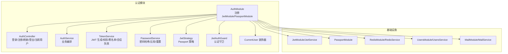
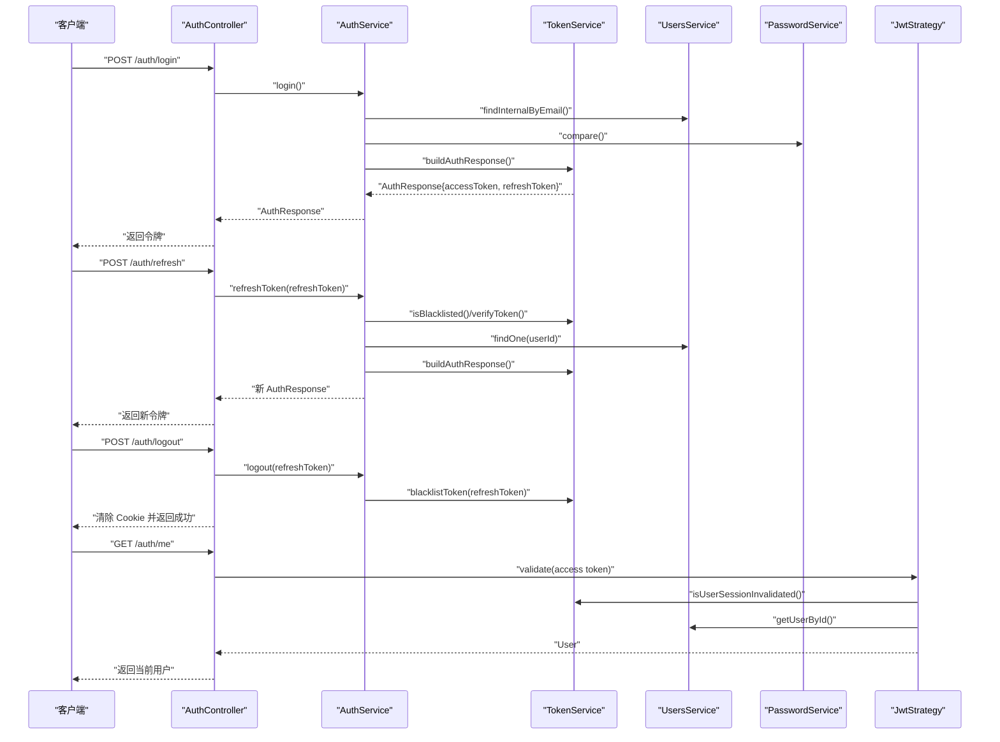
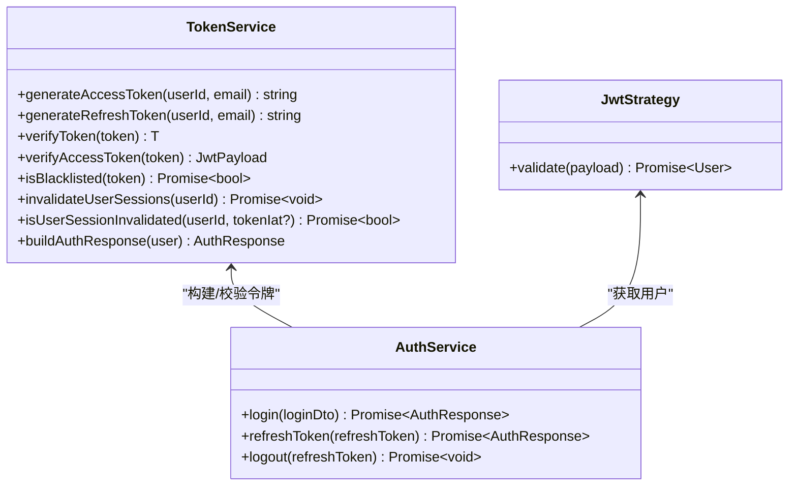
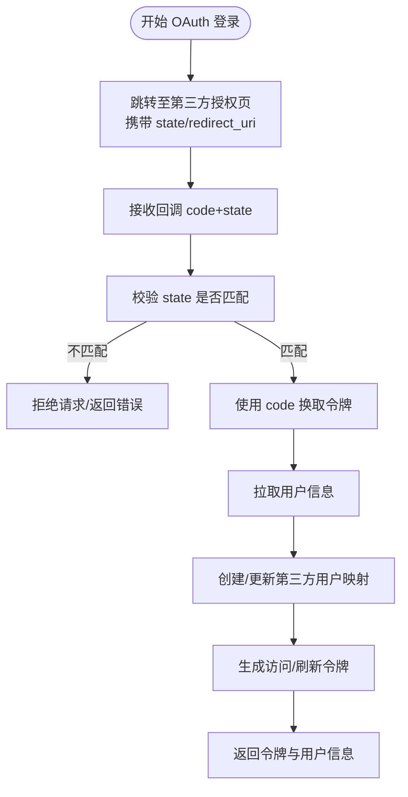
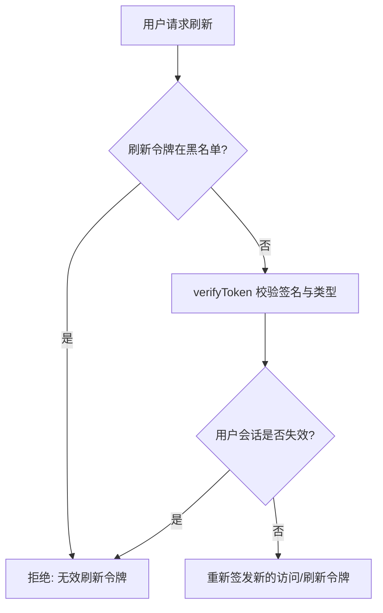
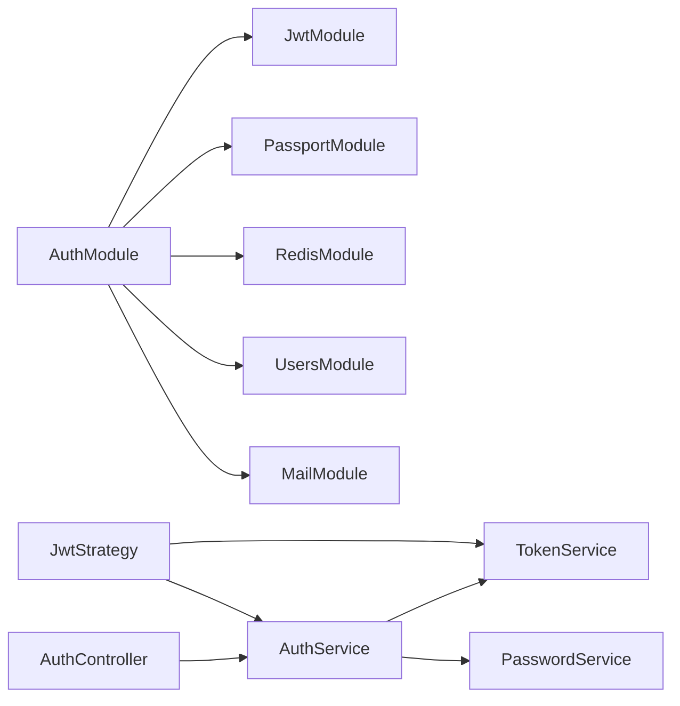

# OAuth 认证集成

<cite>
**本文档引用的文件**
- [apps/backend/src/auth/auth.module.ts](file://apps/backend/src/auth/auth.module.ts)
- [apps/backend/src/auth/auth.service.ts](file://apps/backend/src/auth/auth.service.ts)
- [apps/backend/src/auth/token.service.ts](file://apps/backend/src/auth/token.service.ts)
- [apps/backend/src/auth/jwt.strategy.ts](file://apps/backend/src/auth/jwt.strategy.ts)
- [apps/backend/src/auth/jwt-auth.guard.ts](file://apps/backend/src/auth/jwt-auth.guard.ts)
- [apps/backend/src/auth/auth.controller.ts](file://apps/backend/src/auth/auth.controller.ts)
- [apps/backend/src/auth/password.service.ts](file://apps/backend/src/auth/password.service.ts)
- [apps/backend/src/auth/current-user.decorator.ts](file://apps/backend/src/auth/current-user.decorator.ts)
- [apps/backend/src/app.module.ts](file://apps/backend/src/app.module.ts)
- [apps/backend/tests/auth/auth.service.spec.ts](file://apps/backend/tests/auth/auth.service.spec.ts)
- [apps/backend/tests/auth/token.service.spec.ts](file://apps/backend/tests/auth/token.service.spec.ts)
- [apps/backend/tests/auth/jwt.strategy.spec.ts](file://apps/backend/tests/auth/jwt.strategy.spec.ts)
- [apps/backend/tests/e2e/auth.e2e.spec.ts](file://apps/backend/tests/e2e/auth.e2e.spec.ts)
- [apps/frontend/src/features/auth/stores/auth.ts](file://apps/frontend/src/features/auth/stores/auth.ts)
</cite>

## 目录
1. [简介](#简介)
2. [项目结构](#项目结构)
3. [核心组件](#核心组件)
4. [架构总览](#架构总览)
5. [详细组件分析](#详细组件分析)
6. [依赖关系分析](#依赖关系分析)
7. [性能考虑](#性能考虑)
8. [故障排除指南](#故障排除指南)
9. [结论](#结论)
10. [附录](#附录)

## 简介
本文件面向需要在系统中集成 OAuth 认证与会话管理的开发者，基于现有代码库梳理并扩展可落地的实现方案。当前后端已完整实现了基于 JWT 的传统账号密码认证、访问令牌与刷新令牌的签发与校验、会话失效控制以及登出黑名单机制；同时提供了认证守卫与控制器接口，便于快速接入前端与第三方登录。

对于 OAuth 第三方登录（如 Google、GitHub 等），本文件提供可扩展的集成思路与最佳实践，帮助在不破坏现有 JWT 体系的前提下，安全地支持多种认证来源。

## 项目结构
后端采用 NestJS 架构，认证相关能力集中在 auth 模块，配合 JwtModule、PassportModule、RedisModule、UsersModule、MailModule 等共同构成认证子系统。

**图表来源**
- [apps/backend/src/auth/auth.module.ts:19-39](file://apps/backend/src/auth/auth.module.ts#L19-L39)
- [apps/backend/src/auth/auth.controller.ts:14-81](file://apps/backend/src/auth/auth.controller.ts#L14-L81)
- [apps/backend/src/auth/auth.service.ts:12-21](file://apps/backend/src/auth/auth.service.ts#L12-L21)
- [apps/backend/src/auth/token.service.ts:15-45](file://apps/backend/src/auth/token.service.ts#L15-L45)
- [apps/backend/src/auth/password.service.ts:9-20](file://apps/backend/src/auth/password.service.ts#L9-L20)
- [apps/backend/src/auth/jwt.strategy.ts:19-36](file://apps/backend/src/auth/jwt.strategy.ts#L19-L36)
- [apps/backend/src/auth/jwt-auth.guard.ts:8-9](file://apps/backend/src/auth/jwt-auth.guard.ts#L8-L9)
- [apps/backend/src/auth/current-user.decorator.ts:8-18](file://apps/backend/src/auth/current-user.decorator.ts#L8-L18)

**章节来源**
- [apps/backend/src/auth/auth.module.ts:19-39](file://apps/backend/src/auth/auth.module.ts#L19-L39)
- [apps/backend/src/app.module.ts:149-152](file://apps/backend/src/app.module.ts#L149-L152)

## 核心组件
- AuthModule：集中注册认证所需模块与全局配置，包括 JwtModule 异步工厂注入 ConfigService，设置访问令牌过期时间与密钥。
- AuthController：提供登录、注册、刷新、登出、获取当前用户等接口，并对部分接口启用限流保护。
- AuthService：作为门面整合 TokenService 与 PasswordService，负责用户校验、注册、令牌刷新与登出。
- TokenService：负责 JWT 签发（访问/刷新）、校验、黑名单、用户会话失效标记与响应构建。
- JwtStrategy：Passport 策略，从 Authorization 头解析 Bearer 令牌，校验类型与会话有效性，返回用户上下文。
- JwtAuthGuard：基于 JwtStrategy 的全局认证守卫，用于保护受保护路由。
- PasswordService：密码哈希/比较、重置令牌生成与邮件发送、重置后使用户会话失效。
- CurrentUser 装饰器：简化从请求中提取当前用户对象或字段。

**章节来源**
- [apps/backend/src/auth/auth.module.ts:26-34](file://apps/backend/src/auth/auth.module.ts#L26-L34)
- [apps/backend/src/auth/auth.controller.ts:22-79](file://apps/backend/src/auth/auth.controller.ts#L22-L79)
- [apps/backend/src/auth/auth.service.ts:12-21](file://apps/backend/src/auth/auth.service.ts#L12-L21)
- [apps/backend/src/auth/token.service.ts:15-45](file://apps/backend/src/auth/token.service.ts#L15-L45)
- [apps/backend/src/auth/jwt.strategy.ts:19-36](file://apps/backend/src/auth/jwt.strategy.ts#L19-L36)
- [apps/backend/src/auth/jwt-auth.guard.ts:8-9](file://apps/backend/src/auth/jwt-auth.guard.ts#L8-L9)
- [apps/backend/src/auth/password.service.ts:9-20](file://apps/backend/src/auth/password.service.ts#L9-L20)
- [apps/backend/src/auth/current-user.decorator.ts:8-18](file://apps/backend/src/auth/current-user.decorator.ts#L8-L18)

## 架构总览
下图展示认证流程的关键交互：客户端通过 AuthController 发起登录/注册/刷新/登出请求，AuthService 协调 TokenService 与 PasswordService，JwtStrategy 在受保护路由中进行访问令牌校验，TokenService 使用 Redis 实现黑名单与会话失效控制。

**图表来源**
- [apps/backend/src/auth/auth.controller.ts:22-79](file://apps/backend/src/auth/auth.controller.ts#L22-L79)
- [apps/backend/src/auth/auth.service.ts:41-101](file://apps/backend/src/auth/auth.service.ts#L41-L101)
- [apps/backend/src/auth/token.service.ts:78-185](file://apps/backend/src/auth/token.service.ts#L78-L185)
- [apps/backend/src/auth/jwt.strategy.ts:41-66](file://apps/backend/src/auth/jwt.strategy.ts#L41-L66)
- [apps/backend/src/auth/password.service.ts:39-89](file://apps/backend/src/auth/password.service.ts#L39-L89)

## 详细组件分析

### JWT 令牌生成与验证机制
- 签名算法与密钥
  - 访问令牌使用统一的 JWT_SECRET 签发，过期时间由 JWT_ACCESS_EXPIRES_IN 控制。
  - 刷新令牌在非开发环境下建议使用独立的 JWT_REFRESH_SECRET，若未配置则回退到 JWT_SECRET。
  - 策略初始化时要求配置 JWT_SECRET，否则启动即报错。
- 过期时间管理
  - 访问令牌默认短期（例如 900 秒），刷新令牌默认长期（例如 604800 秒）。
  - TokenService 在签发时传入对应 expiresIn，验证时优先尝试刷新密钥，再尝试访问密钥。
- 令牌类型与校验
  - JwtStrategy 仅接受 type=access 的令牌，且需通过 isUserSessionInvalidated 校验。
  - TokenService.verifyToken 会先尝试刷新密钥，再尝试访问密钥，均失败则抛出未授权异常。

**图表来源**
- [apps/backend/src/auth/token.service.ts:78-185](file://apps/backend/src/auth/token.service.ts#L78-L185)
- [apps/backend/src/auth/jwt.strategy.ts:41-66](file://apps/backend/src/auth/jwt.strategy.ts#L41-L66)
- [apps/backend/src/auth/auth.service.ts:41-101](file://apps/backend/src/auth/auth.service.ts#L41-L101)

**章节来源**
- [apps/backend/src/auth/token.service.ts:30-44](file://apps/backend/src/auth/token.service.ts#L30-L44)
- [apps/backend/src/auth/jwt.strategy.ts:26-35](file://apps/backend/src/auth/jwt.strategy.ts#L26-L35)
- [apps/backend/src/auth/auth.module.ts:26-34](file://apps/backend/src/auth/auth.module.ts#L26-L34)

### OAuth 流程实现（扩展设计）
当前代码库未包含 OAuth 授权码流程的具体实现，以下为可扩展的设计建议：

- 授权码获取
  - 前端跳转至第三方提供商授权页，携带 state 与 redirect_uri。
  - 服务端生成并记录 state，用于防 CSRF 校验。
- 令牌交换
  - 回调地址接收 code，服务端以 code 向提供商换取 access_token/refresh_token 与用户信息。
  - 若用户已存在映射关系则直接登录；否则创建新用户并绑定第三方标识。
- 用户信息获取
  - 使用第三方 access_token 调用用户信息接口，合并头像、邮箱等字段。
- 统一会话
  - 将第三方用户映射为内部 User 对象，使用 TokenService 生成标准的 accessToken/refreshToken 返回给客户端。
- CSRF 防护
  - state 参数必须与服务端存储一致，且在回调中严格校验。
- 会话管理
  - 可沿用现有刷新令牌与黑名单机制，登出时同样将刷新令牌加入黑名单。

[此图为概念性流程示意，无需图表来源]

### 刷新令牌机制与会话管理策略
- 刷新令牌签发与校验
  - TokenService 生成 type=refresh 的令牌，默认较长有效期；AuthService.refreshToken 会先检查是否在黑名单，再验证 payload 类型与用户是否存在。
- 会话失效
  - PasswordService.reset 与 TokenService.invalidateUserSessions 会在用户重置密码后写入失效标记，JwtStrategy.validate 会读取该标记并拒绝过期令牌。
- 黑名单
  - 登出时将刷新令牌加入 Redis 黑名单，按剩余 TTL 存储，确保即使旧刷新令牌也无法继续刷新。

**图表来源**
- [apps/backend/src/auth/auth.service.ts:59-93](file://apps/backend/src/auth/auth.service.ts#L59-L93)
- [apps/backend/src/auth/token.service.ts:130-170](file://apps/backend/src/auth/token.service.ts#L130-L170)

**章节来源**
- [apps/backend/src/auth/auth.service.ts:59-101](file://apps/backend/src/auth/auth.service.ts#L59-L101)
- [apps/backend/src/auth/token.service.ts:47-76](file://apps/backend/src/auth/token.service.ts#L47-L76)

### 安全最佳实践
- CSRF 防护
  - OAuth 回调应校验 state，防止跨站请求伪造。
- 令牌存储安全
  - 访问令牌在内存/本地存储中使用 HttpOnly Cookie 或安全存储，避免 XSS 泄露。
  - 刷新令牌同样应安全存储，登出时立即加入黑名单。
- 速率限制
  - 登录/注册/刷新接口已配置限流，防止暴力破解与滥用。
- 会话失效
  - 密码重置后调用 invalidateUserSessions，确保旧令牌无法继续使用。

**章节来源**
- [apps/backend/src/auth/auth.controller.ts:22-48](file://apps/backend/src/auth/auth.controller.ts#L22-L48)
- [apps/backend/src/auth/password.service.ts:88-89](file://apps/backend/src/auth/password.service.ts#L88-L89)
- [apps/backend/src/auth/token.service.ts:47-53](file://apps/backend/src/auth/token.service.ts#L47-L53)

### 认证中间件与守卫开发指南
- 开发步骤
  - 在 AuthModule 中注册 PassportModule，并配置 JwtModule 的 secret 与 expiresIn。
  - 实现 JwtStrategy，从 Authorization 头提取 Bearer 令牌，校验类型与会话有效性。
  - 创建 JwtAuthGuard 并在路由上使用，保护受保护资源。
  - 在 AuthController 中暴露登录、注册、刷新、登出与获取当前用户接口。
- 配置要点
  - JWT_SECRET 必须配置；生产环境建议设置 JWT_REFRESH_SECRET。
  - 访问令牌过期时间短，刷新令牌过期时间长；两者使用不同密钥更安全。
  - 登出时调用 TokenService.blacklistToken，确保刷新令牌不可复用。

**章节来源**
- [apps/backend/src/auth/auth.module.ts:25-34](file://apps/backend/src/auth/auth.module.ts#L25-L34)
- [apps/backend/src/auth/jwt.strategy.ts:19-36](file://apps/backend/src/auth/jwt.strategy.ts#L19-L36)
- [apps/backend/src/auth/jwt-auth.guard.ts:8-9](file://apps/backend/src/auth/jwt-auth.guard.ts#L8-L9)
- [apps/backend/src/auth/auth.controller.ts:22-79](file://apps/backend/src/auth/auth.controller.ts#L22-L79)

## 依赖关系分析
- 模块耦合
  - AuthModule 导出 JwtModule/PassportModule，便于其他模块复用认证能力。
  - AuthService 依赖 TokenService 与 PasswordService，形成清晰的职责边界。
- 外部依赖
  - JwtService 用于签名与验证。
  - RedisService 用于黑名单与会话失效标记。
  - ConfigService 用于读取密钥与过期时间配置。

**图表来源**
- [apps/backend/src/auth/auth.module.ts:19-39](file://apps/backend/src/auth/auth.module.ts#L19-L39)
- [apps/backend/src/auth/auth.controller.ts:17](file://apps/backend/src/auth/auth.controller.ts#L17)
- [apps/backend/src/auth/auth.service.ts:14-21](file://apps/backend/src/auth/auth.service.ts#L14-L21)

**章节来源**
- [apps/backend/src/auth/auth.module.ts:19-39](file://apps/backend/src/auth/auth.module.ts#L19-L39)
- [apps/backend/src/app.module.ts:149-152](file://apps/backend/src/app.module.ts#L149-L152)

## 性能考虑
- 令牌签发与验证
  - 使用 JwtService 异步工厂注入 ConfigService，避免重复读取环境变量。
  - 访问令牌短生命周期，减少验证成本与缓存压力。
- 黑名单与会话失效
  - Redis 黑名单按剩余 TTL 存储，避免持久化占用；会话失效标记使用原子写入，查询时 O(1)。
- 限流策略
  - 对登录/注册/刷新接口配置多级限流，降低暴力破解风险。

[本节为通用性能讨论，无需章节来源]

## 故障排除指南
- 常见问题
  - 令牌过期：访问令牌过期将触发未授权异常，需使用刷新令牌重新获取。
  - 无效刷新令牌：刷新令牌可能已被加入黑名单或会话被标记失效。
  - 用户不存在：刷新时若用户被删除，将触发未授权异常。
  - 密码重置后无法使用旧令牌：重置后会写入会话失效标记，旧令牌将被拒绝。
- 排查步骤
  - 检查 JWT_SECRET 与 JWT_REFRESH_SECRET 是否正确配置。
  - 确认 Redis 连接正常，黑名单与失效标记键值存在。
  - 查看控制器与服务层日志，定位具体异常分支。

**章节来源**
- [apps/backend/src/auth/auth.service.ts:66-92](file://apps/backend/src/auth/auth.service.ts#L66-L92)
- [apps/backend/src/auth/token.service.ts:103-125](file://apps/backend/src/auth/token.service.ts#L103-L125)
- [apps/backend/src/auth/password.service.ts:66-89](file://apps/backend/src/auth/password.service.ts#L66-L89)

## 结论
本项目已具备完善的 JWT 认证基础：访问令牌与刷新令牌的签发与校验、会话失效控制、登出黑名单机制与认证守卫。在此基础上，可无缝扩展 OAuth 第三方登录：保持现有 TokenService 的统一输出格式，将第三方用户映射为内部用户并复用现有登录/刷新/登出流程，同时引入 CSRF 校验与安全存储策略，即可实现安全、稳定的多源认证体系。

[本节为总结性内容，无需章节来源]

## 附录

### API 定义与行为
- 登录
  - 方法与路径：POST /api/auth/login
  - 请求体：包含邮箱与密码
  - 响应：返回 accessToken、refreshToken 与用户信息
- 注册
  - 方法与路径：POST /api/auth/register
  - 请求体：包含邮箱、姓名与密码
  - 响应：返回 accessToken、refreshToken 与用户信息
- 刷新
  - 方法与路径：POST /api/auth/refresh
  - 请求体：包含 refreshToken
  - 响应：返回新的 accessToken、refreshToken 与用户信息
- 获取当前用户
  - 方法与路径：GET /api/auth/me
  - 认证：Bearer accessToken
  - 响应：返回当前用户信息
- 登出
  - 方法与路径：POST /api/auth/logout
  - 请求体：包含 refreshToken
  - 行为：将刷新令牌加入黑名单并清除 Cookie
  - 响应：返回成功消息

**章节来源**
- [apps/backend/src/auth/auth.controller.ts:22-79](file://apps/backend/src/auth/auth.controller.ts#L22-L79)

### 前端集成要点
- 令牌存储
  - 建议将 accessToken 存入内存或安全存储，refreshToken 存入 HttpOnly Cookie。
  - 登出时清除 Cookie 与本地存储。
- 自动刷新
  - 在请求拦截器中检测 401 未授权，尝试使用 refreshToken 刷新令牌。
- 用户信息
  - 使用 GET /api/auth/me 获取当前用户，用于界面渲染与权限判断。

**章节来源**
- [apps/frontend/src/features/auth/stores/auth.ts:112-135](file://apps/frontend/src/features/auth/stores/auth.ts#L112-L135)