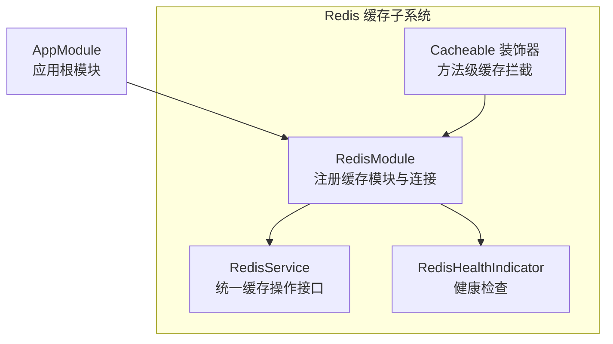
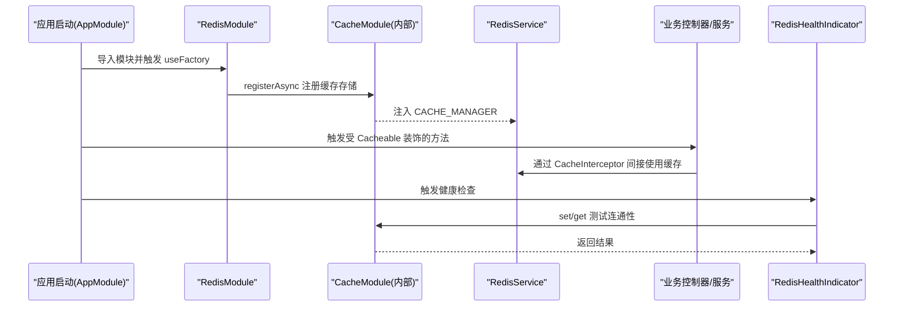
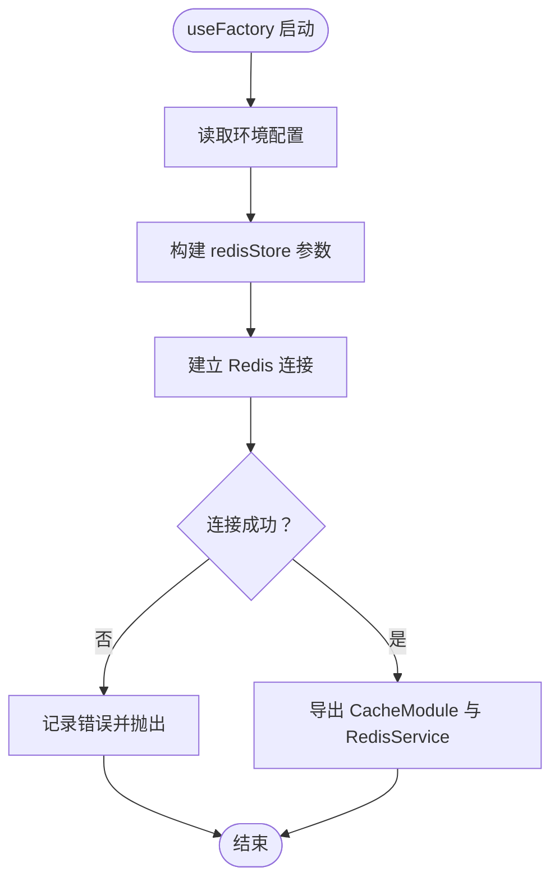
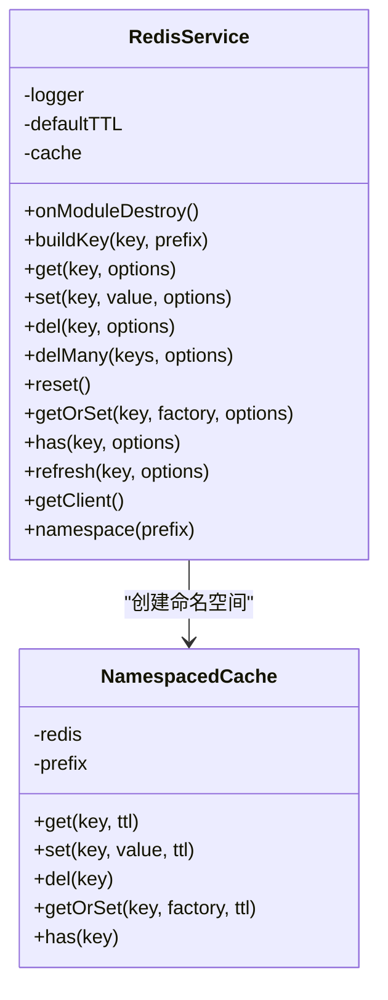
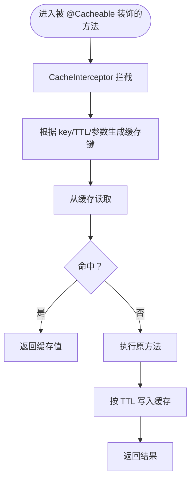
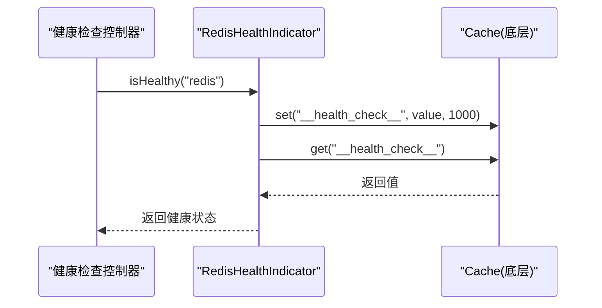
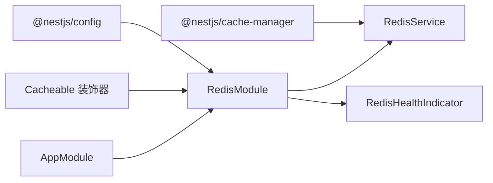

# Redis 缓存集成

<cite>
**本文引用的文件**
- [apps/backend/src/redis/redis.module.ts](file://apps/backend/src/redis/redis.module.ts)
- [apps/backend/src/redis/redis.service.ts](file://apps/backend/src/redis/redis.service.ts)
- [apps/backend/src/redis/cache.decorator.ts](file://apps/backend/src/redis/cache.decorator.ts)
- [apps/backend/src/redis/redis.health.ts](file://apps/backend/src/redis/redis.health.ts)
- [apps/backend/src/redis/index.ts](file://apps/backend/src/redis/index.ts)
- [apps/backend/src/app.module.ts](file://apps/backend/src/app.module.ts)
- [apps/backend/tests/e2e/test-app.ts](file://apps/backend/tests/e2e/test-app.ts)
</cite>

## 目录
1. [简介](#简介)
2. [项目结构](#项目结构)
3. [核心组件](#核心组件)
4. [架构总览](#架构总览)
5. [组件详解](#组件详解)
6. [依赖关系分析](#依赖关系分析)
7. [性能与并发优化](#性能与并发优化)
8. [故障排查指南](#故障排查指南)
9. [结论](#结论)
10. [附录：配置与使用清单](#附录配置与使用清单)

## 简介
本文件面向需要在 NestJS 应用中集成 Redis 缓存的工程师，系统性说明缓存连接管理、缓存服务实现、装饰器与策略配置、健康检查与监控集成、高并发优化、缓存失效与一致性保障、调试与性能分析方法。文档基于仓库现有实现进行归纳与扩展建议，确保读者能够快速落地并安全地使用 Redis 缓存。

## 项目结构
Redis 缓存相关代码集中在后端应用的 redis 子目录，采用“模块 + 服务 + 装饰器 + 健康检查”的分层设计，并通过全局模块在应用启动时完成 Redis 连接与配置注入。

图示来源
- [apps/backend/src/redis/redis.module.ts:26-82](file://apps/backend/src/redis/redis.module.ts#L26-L82)
- [apps/backend/src/redis/redis.service.ts:51-201](file://apps/backend/src/redis/redis.service.ts#L51-L201)
- [apps/backend/src/redis/cache.decorator.ts:42-58](file://apps/backend/src/redis/cache.decorator.ts#L42-L58)
- [apps/backend/src/redis/redis.health.ts:10-42](file://apps/backend/src/redis/redis.health.ts#L10-L42)
- [apps/backend/src/app.module.ts:149-150](file://apps/backend/src/app.module.ts#L149-L150)

章节来源
- [apps/backend/src/redis/redis.module.ts:26-82](file://apps/backend/src/redis/redis.module.ts#L26-L82)
- [apps/backend/src/redis/index.ts:1-5](file://apps/backend/src/redis/index.ts#L1-L5)
- [apps/backend/src/app.module.ts:149-150](file://apps/backend/src/app.module.ts#L149-L150)

## 核心组件
- RedisModule：异步注册缓存模块，加载配置并通过 redisStore 建立 Redis 连接，支持重试策略、键前缀与默认 TTL。
- RedisService：统一的缓存操作封装，提供 get/set/del/delMany/reset/has/refresh/getOrSet/namespace 等能力。
- Cacheable 装饰器：基于 NestJS CacheInterceptor 的方法级缓存装饰器，支持自定义 key、TTL 与禁用缓存。
- RedisHealthIndicator：基于 cache-manager 的健康检查，通过一次写读校验 Redis 连通性。

章节来源
- [apps/backend/src/redis/redis.module.ts:26-82](file://apps/backend/src/redis/redis.module.ts#L26-L82)
- [apps/backend/src/redis/redis.service.ts:51-201](file://apps/backend/src/redis/redis.service.ts#L51-L201)
- [apps/backend/src/redis/cache.decorator.ts:42-87](file://apps/backend/src/redis/cache.decorator.ts#L42-L87)
- [apps/backend/src/redis/redis.health.ts:10-42](file://apps/backend/src/redis/redis.health.ts#L10-L42)

## 架构总览
下图展示从应用启动到缓存调用的关键交互路径，包括连接建立、方法级缓存拦截与健康检查流程。

图示来源
- [apps/backend/src/app.module.ts:149-150](file://apps/backend/src/app.module.ts#L149-L150)
- [apps/backend/src/redis/redis.module.ts:29-78](file://apps/backend/src/redis/redis.module.ts#L29-L78)
- [apps/backend/src/redis/redis.health.ts:20-41](file://apps/backend/src/redis/redis.health.ts#L20-L41)

## 组件详解

### RedisModule：连接与配置
- 异步工厂加载配置项：REDIS_HOST、REDIS_PORT、REDIS_PASSWORD、REDIS_DB、REDIS_KEY_PREFIX、REDIS_DEFAULT_TTL。
- 使用 redisStore 建立 Redis 连接，启用 ready 检测、最大重试次数与指数退避重试策略。
- 将 CacheModule 与 RedisService 导出，供全局使用。

图示来源
- [apps/backend/src/redis/redis.module.ts:32-77](file://apps/backend/src/redis/redis.module.ts#L32-L77)

章节来源
- [apps/backend/src/redis/redis.module.ts:26-82](file://apps/backend/src/redis/redis.module.ts#L26-L82)

### RedisService：统一缓存接口
- 键前缀管理：支持内置枚举前缀与自定义字符串前缀；提供 namespace 快速命名空间封装。
- 基础操作：get/set/del/delMany/reset/has/refresh。
- 高级能力：getOrSet（缓存穿透保护）、getClient（底层 cache-manager 实例）。
- 生命周期：模块销毁时尝试断开底层连接。

图示来源
- [apps/backend/src/redis/redis.service.ts:51-201](file://apps/backend/src/redis/redis.service.ts#L51-L201)

章节来源
- [apps/backend/src/redis/redis.service.ts:51-201](file://apps/backend/src/redis/redis.service.ts#L51-L201)

### Cacheable 装饰器：方法级缓存策略
- 支持自定义缓存键（含占位符）、TTL（毫秒）、禁用缓存。
- 内部组合 UseInterceptors(CacheInterceptor)、CacheKey、CacheTTL 与元数据标记。
- 提供 CacheableTTL 常量便于统一配置。

图示来源
- [apps/backend/src/redis/cache.decorator.ts:42-58](file://apps/backend/src/redis/cache.decorator.ts#L42-L58)

章节来源
- [apps/backend/src/redis/cache.decorator.ts:42-87](file://apps/backend/src/redis/cache.decorator.ts#L42-L87)

### 健康检查与监控集成
- RedisHealthIndicator 通过一次 set/get 测试 Redis 连通性，异常时抛出 HealthCheckError。
- 结合 @nestjs/terminus 的健康检查端点可直接暴露服务状态。

图示来源
- [apps/backend/src/redis/redis.health.ts:20-41](file://apps/backend/src/redis/redis.health.ts#L20-L41)

章节来源
- [apps/backend/src/redis/redis.health.ts:10-42](file://apps/backend/src/redis/redis.health.ts#L10-L42)

## 依赖关系分析
- RedisModule 依赖 ConfigModule/ConfigService 与 redisStore，向应用提供 CacheModule 与 RedisService。
- RedisService 依赖 @nestjs/cache-manager 的 CACHE_MANAGER 注入。
- Cacheable 装饰器依赖 @nestjs/cache-manager 的 CacheInterceptor/CacheTTL/CacheKey。
- RedisHealthIndicator 依赖 CACHE_MANAGER 进行读写测试。
- AppModule 将 RedisModule 作为全局模块导入，确保全应用可用。

图示来源
- [apps/backend/src/redis/redis.module.ts:2-5](file://apps/backend/src/redis/redis.module.ts#L2-L5)
- [apps/backend/src/redis/redis.service.ts:1-3](file://apps/backend/src/redis/redis.service.ts#L1-L3)
- [apps/backend/src/redis/cache.decorator.ts:1-2](file://apps/backend/src/redis/cache.decorator.ts#L1-L2)
- [apps/backend/src/redis/redis.health.ts:1-4](file://apps/backend/src/redis/redis.health.ts#L1-L4)
- [apps/backend/src/app.module.ts:149-150](file://apps/backend/src/app.module.ts#L149-L150)

章节来源
- [apps/backend/src/redis/redis.module.ts:26-82](file://apps/backend/src/redis/redis.module.ts#L26-L82)
- [apps/backend/src/redis/redis.service.ts:51-201](file://apps/backend/src/redis/redis.service.ts#L51-L201)
- [apps/backend/src/redis/cache.decorator.ts:42-87](file://apps/backend/src/redis/cache.decorator.ts#L42-L87)
- [apps/backend/src/redis/redis.health.ts:10-42](file://apps/backend/src/redis/redis.health.ts#L10-L42)
- [apps/backend/src/app.module.ts:149-150](file://apps/backend/src/app.module.ts#L149-L150)

## 性能与并发优化
- 连接与重试
  - 已启用 ready 检测与最大重试次数，避免启动阶段抖动。
  - 建议在生产环境结合容器编排的健康探针与就绪探针，配合 Redis 健康检查端点。
- 键前缀与命名空间
  - 使用 namespace 与内置前缀减少键冲突，提升清理与维护效率。
- TTL 策略
  - 对热点数据设置较短 TTL，对静态数据设置较长 TTL；装饰器支持按方法粒度覆盖。
- 并发与批处理
  - 批量删除使用 Promise.all 并行执行，降低延迟；注意控制批量规模以避免阻塞。
- 缓存穿透防护
  - getOrSet 在缓存未命中时才回源，避免缓存雪崩；建议对空值也设置短 TTL。
- 序列化与数据类型
  - cache-manager 默认序列化策略适用于常见对象；如需自定义，可通过底层 getClient() 获取实例进行适配。
- 连接池与集群
  - 当前实现基于单实例连接；如需集群/哨兵/密码认证，请在 redisStore 参数中配置相应选项（参考 redisStore 文档）。

章节来源
- [apps/backend/src/redis/redis.module.ts:46-76](file://apps/backend/src/redis/redis.module.ts#L46-L76)
- [apps/backend/src/redis/redis.service.ts:125-132](file://apps/backend/src/redis/redis.service.ts#L125-L132)
- [apps/backend/src/redis/redis.service.ts:150-161](file://apps/backend/src/redis/redis.service.ts#L150-L161)
- [apps/backend/src/redis/cache.decorator.ts:42-58](file://apps/backend/src/redis/cache.decorator.ts#L42-L58)

## 故障排查指南
- 连接失败
  - 查看 RedisModule 的日志输出与错误堆栈；确认 REDIS_* 环境变量正确。
  - 检查网络连通性与防火墙策略。
- 健康检查失败
  - 使用 RedisHealthIndicator 的 isHealthy 方法定位问题；关注 set/get 的一致性与过期时间。
- 缓存未生效
  - 确认方法已添加 @Cacheable 装饰器且未被 NoCache 标记。
  - 检查缓存键生成规则（key 占位符、参数拼接）与 TTL 设置。
- 缓存穿透/击穿
  - 对空值设置短 TTL；对热点键使用 getOrSet 包裹回源逻辑。
- 调试与性能分析
  - 使用 getClient() 获取底层 cache-manager 实例进行细粒度诊断。
  - 在测试环境中可参考 E2E 测试中的内存模拟实现，验证键构建与过期逻辑。

章节来源
- [apps/backend/src/redis/redis.module.ts:32-77](file://apps/backend/src/redis/redis.module.ts#L32-L77)
- [apps/backend/src/redis/redis.health.ts:20-41](file://apps/backend/src/redis/redis.health.ts#L20-L41)
- [apps/backend/src/redis/cache.decorator.ts:42-66](file://apps/backend/src/redis/cache.decorator.ts#L42-L66)
- [apps/backend/tests/e2e/test-app.ts:368-406](file://apps/backend/tests/e2e/test-app.ts#L368-L406)

## 结论
该 Redis 缓存集成方案以模块化方式提供连接、服务、装饰器与健康检查能力，具备良好的可配置性与可观测性。通过命名空间、TTL 策略与 getOrSet 防穿策略，可在高并发场景下获得稳定性能。若需进一步增强（如集群、密码认证、自定义序列化），可在 redisStore 参数中扩展配置。

## 附录：配置与使用清单
- 环境变量（RedisModule）
  - REDIS_HOST、REDIS_PORT、REDIS_PASSWORD、REDIS_DB、REDIS_KEY_PREFIX、REDIS_DEFAULT_TTL
- 常用接口与装饰器
  - RedisService：get/set/del/delMany/reset/has/refresh/getOrSet/namespace/getClient
  - Cacheable：支持 key、ttl、禁用缓存
  - RedisHealthIndicator：isHealthy
- 导出入口
  - index.ts 统一导出模块、服务、健康检查与装饰器

章节来源
- [apps/backend/src/redis/redis.module.ts:34-41](file://apps/backend/src/redis/redis.module.ts#L34-L41)
- [apps/backend/src/redis/index.ts:1-5](file://apps/backend/src/redis/index.ts#L1-L5)
- [apps/backend/src/redis/cache.decorator.ts:42-87](file://apps/backend/src/redis/cache.decorator.ts#L42-L87)
- [apps/backend/src/redis/redis.health.ts:10-42](file://apps/backend/src/redis/redis.health.ts#L10-L42)