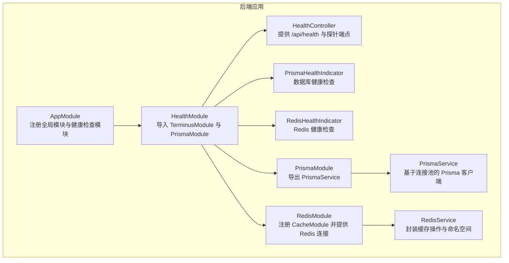
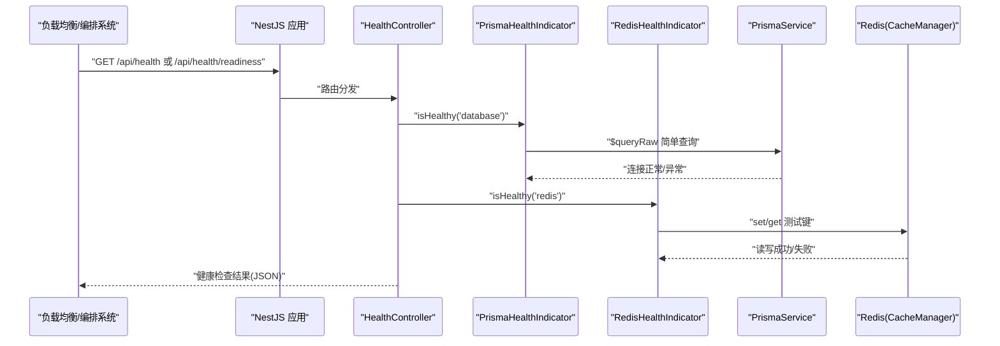
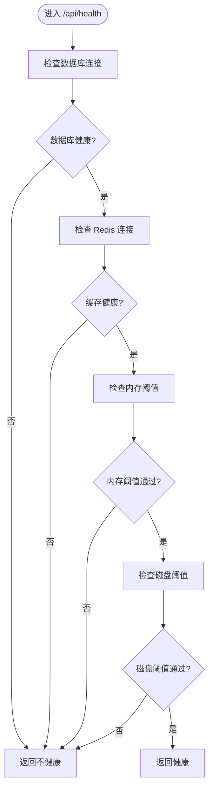
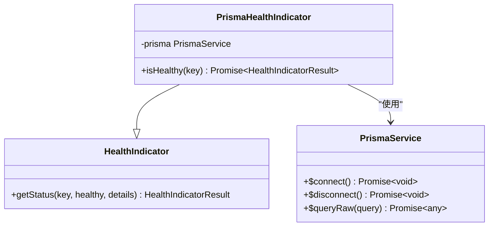
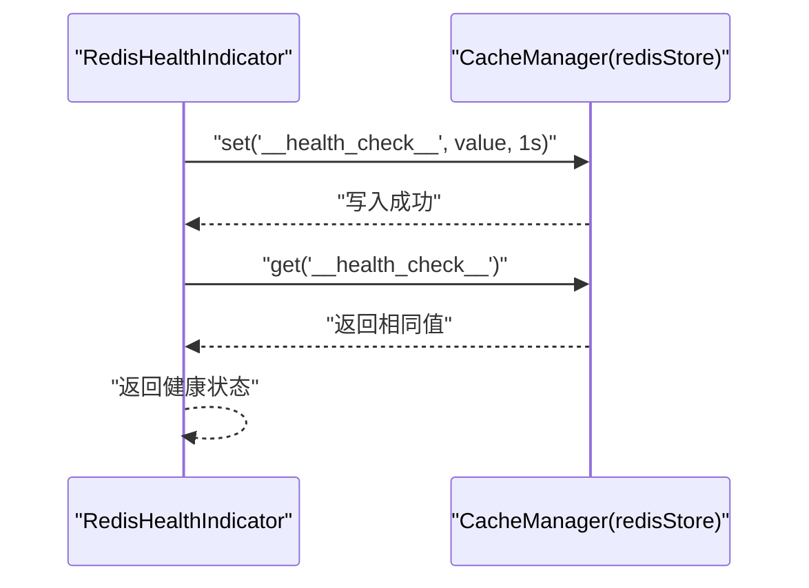
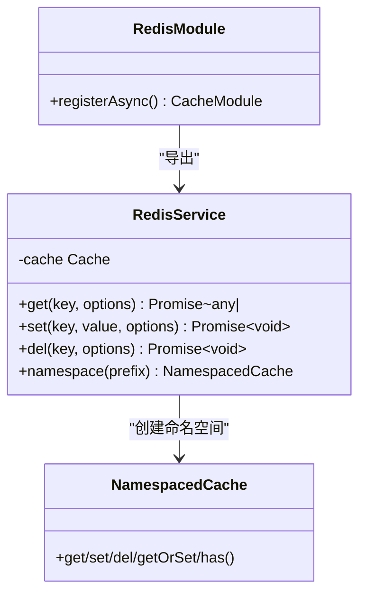
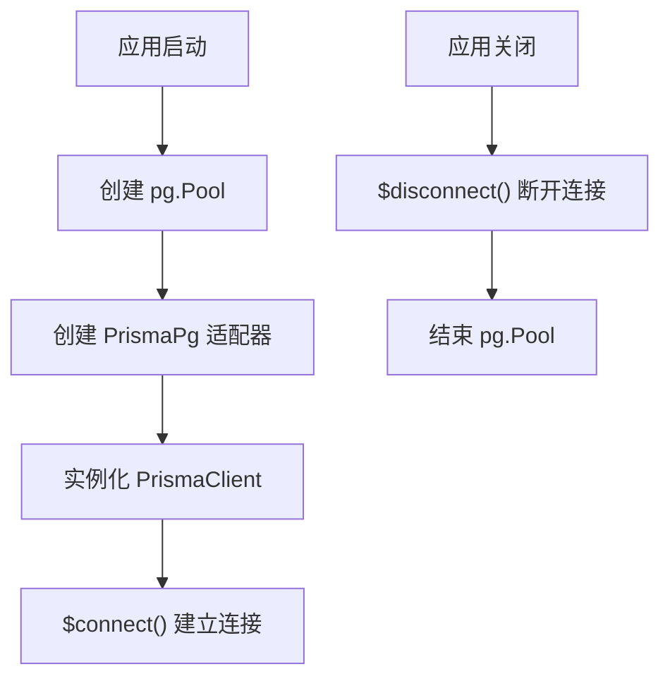
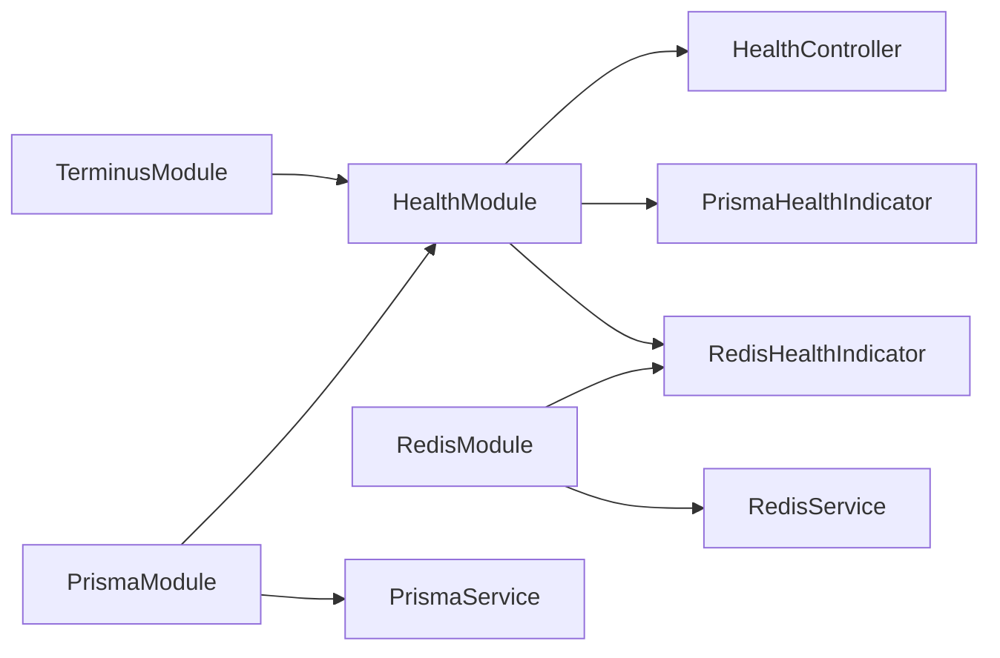
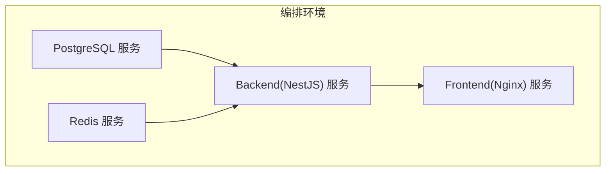

# 健康检查集成

<cite>
**本文引用的文件**
- [apps/backend/src/health/health.controller.ts](file://apps/backend/src/health/health.controller.ts)
- [apps/backend/src/health/health.module.ts](file://apps/backend/src/health/health.module.ts)
- [apps/backend/src/health/prisma.health.ts](file://apps/backend/src/health/prisma.health.ts)
- [apps/backend/src/redis/redis.health.ts](file://apps/backend/src/redis/redis.health.ts)
- [apps/backend/src/app.module.ts](file://apps/backend/src/app.module.ts)
- [apps/backend/src/prisma/prisma.module.ts](file://apps/backend/src/prisma/prisma.module.ts)
- [apps/backend/src/prisma/prisma.service.ts](file://apps/backend/src/prisma/prisma.service.ts)
- [apps/backend/src/redis/redis.module.ts](file://apps/backend/src/redis/redis.module.ts)
- [apps/backend/src/redis/redis.service.ts](file://apps/backend/src/redis/redis.service.ts)
- [apps/backend/Dockerfile](file://apps/backend/Dockerfile)
- [docker-compose.yml](file://docker-compose.yml)
- [apps/backend/package.json](file://apps/backend/package.json)
</cite>

## 目录
1. [简介](#简介)
2. [项目结构](#项目结构)
3. [核心组件](#核心组件)
4. [架构总览](#架构总览)
5. [详细组件分析](#详细组件分析)
6. [依赖关系分析](#依赖关系分析)
7. [性能考量](#性能考量)
8. [故障排查指南](#故障排查指南)
9. [结论](#结论)
10. [附录](#附录)

## 简介
本文件系统性阐述该 NestJS 应用的健康检查集成方案，覆盖以下要点：
- 基于 @nestjs/terminus 的健康检查端点设计与实现
- 自定义健康指标：Prisma 数据库连接健康检查、Redis 健康检查
- 数据库连接池与 Prisma 客户端生命周期管理
- 健康检查端点的配置与访问控制思路
- 在容器编排与负载均衡中的作用与最佳实践
- 健康检查结果格式与故障诊断方法
- 自定义健康检查指标的开发指南

## 项目结构
健康检查相关代码集中在后端应用的 health 与 redis 子模块中，并在根模块中注册启用。

**图表来源**
- [apps/backend/src/app.module.ts:149-151](file://apps/backend/src/app.module.ts#L149-L151)
- [apps/backend/src/health/health.module.ts:8-13](file://apps/backend/src/health/health.module.ts#L8-L13)
- [apps/backend/src/health/health.controller.ts:17-25](file://apps/backend/src/health/health.controller.ts#L17-L25)
- [apps/backend/src/health/prisma.health.ts:10-13](file://apps/backend/src/health/prisma.health.ts#L10-L13)
- [apps/backend/src/redis/redis.health.ts:11-14](file://apps/backend/src/redis/redis.health.ts#L11-L14)
- [apps/backend/src/prisma/prisma.module.ts:4-9](file://apps/backend/src/prisma/prisma.module.ts#L4-L9)
- [apps/backend/src/prisma/prisma.service.ts:7-21](file://apps/backend/src/prisma/prisma.service.ts#L7-L21)
- [apps/backend/src/redis/redis.module.ts:26-83](file://apps/backend/src/redis/redis.module.ts#L26-L83)
- [apps/backend/src/redis/redis.service.ts:51-56](file://apps/backend/src/redis/redis.service.ts#L51-L56)

**章节来源**
- [apps/backend/src/app.module.ts:149-151](file://apps/backend/src/app.module.ts#L149-L151)
- [apps/backend/src/health/health.module.ts:8-13](file://apps/backend/src/health/health.module.ts#L8-L13)

## 核心组件
- 健康检查控制器：提供综合健康检查、存活探针与就绪探针三个端点，组合数据库、缓存、内存与磁盘健康检查。
- 自定义健康指示器：
  - PrismaHealthIndicator：通过执行简单查询验证数据库连接可用性。
  - RedisHealthIndicator：通过写入/读取测试键验证缓存连接与基本读写能力。
- 健康检查模块：集中导入 TerminusModule、PrismaModule，并注册控制器与健康指示器。
- Redis 模块：基于 cache-manager-ioredis-yet 注册 CacheModule，提供可配置的 Redis 连接、重试与 TTL。
- Prisma 模块与服务：基于连接池的 Prisma 客户端，负责连接建立与释放。

**章节来源**
- [apps/backend/src/health/health.controller.ts:18-76](file://apps/backend/src/health/health.controller.ts#L18-L76)
- [apps/backend/src/health/prisma.health.ts:10-31](file://apps/backend/src/health/prisma.health.ts#L10-L31)
- [apps/backend/src/redis/redis.health.ts:11-42](file://apps/backend/src/redis/redis.health.ts#L11-L42)
- [apps/backend/src/health/health.module.ts:8-13](file://apps/backend/src/health/health.module.ts#L8-L13)
- [apps/backend/src/redis/redis.module.ts:26-83](file://apps/backend/src/redis/redis.module.ts#L26-L83)
- [apps/backend/src/prisma/prisma.service.ts:7-33](file://apps/backend/src/prisma/prisma.service.ts#L7-L33)

## 架构总览
下图展示健康检查在系统中的调用链路与依赖关系。

**图表来源**
- [apps/backend/src/health/health.controller.ts:34-51](file://apps/backend/src/health/health.controller.ts#L34-L51)
- [apps/backend/src/health/prisma.health.ts:19-30](file://apps/backend/src/health/prisma.health.ts#L19-L30)
- [apps/backend/src/redis/redis.health.ts:20-41](file://apps/backend/src/redis/redis.health.ts#L20-L41)
- [apps/backend/src/prisma/prisma.service.ts:23-24](file://apps/backend/src/prisma/prisma.service.ts#L23-L24)

## 详细组件分析

### 健康检查控制器
- 综合健康检查端点：组合数据库、缓存、内存与磁盘检查，返回统一的健康检查响应。
- 存活探针：轻量级端点，用于容器存活探测，快速返回运行状态。
- 就绪探针：仅检查关键依赖（数据库与缓存），用于确认服务已准备好接收流量。

**图表来源**
- [apps/backend/src/health/health.controller.ts:34-51](file://apps/backend/src/health/health.controller.ts#L34-L51)

**章节来源**
- [apps/backend/src/health/health.controller.ts:18-76](file://apps/backend/src/health/health.controller.ts#L18-L76)

### Prisma 健康检查指示器
- 通过执行一次无副作用的查询验证数据库连接可用性。
- 异常时抛出 HealthCheckError，包含具体错误信息，便于诊断。
- 返回标准健康检查结果对象，标记健康状态与附加信息。

**图表来源**
- [apps/backend/src/health/prisma.health.ts:10-31](file://apps/backend/src/health/prisma.health.ts#L10-L31)
- [apps/backend/src/prisma/prisma.service.ts:23-24](file://apps/backend/src/prisma/prisma.service.ts#L23-L24)

**章节来源**
- [apps/backend/src/health/prisma.health.ts:10-31](file://apps/backend/src/health/prisma.health.ts#L10-L31)
- [apps/backend/src/prisma/prisma.service.ts:7-33](file://apps/backend/src/prisma/prisma.service.ts#L7-L33)

### Redis 健康检查指示器
- 通过写入与读取测试键的方式验证缓存连接与基本读写能力。
- 使用 CacheManager 的 set/get 方法进行原子性校验，失败时抛出 HealthCheckError。
- 返回包含消息的健康检查结果，便于定位问题。

**图表来源**
- [apps/backend/src/redis/redis.health.ts:20-41](file://apps/backend/src/redis/redis.health.ts#L20-L41)

**章节来源**
- [apps/backend/src/redis/redis.health.ts:11-42](file://apps/backend/src/redis/redis.health.ts#L11-L42)

### Redis 模块与服务
- RedisModule 基于 cache-manager-ioredis-yet 注册 CacheModule，支持连接延迟建立、就绪检查、重试策略与 TTL。
- RedisService 提供统一的缓存操作接口，支持键前缀、命名空间、批量删除与刷新 TTL 等能力。
- 通过注入 CACHE_MANAGER 获取底层 Cache 实例，便于高级操作。

**图表来源**
- [apps/backend/src/redis/redis.module.ts:26-83](file://apps/backend/src/redis/redis.module.ts#L26-L83)
- [apps/backend/src/redis/redis.service.ts:51-202](file://apps/backend/src/redis/redis.service.ts#L51-L202)

**章节来源**
- [apps/backend/src/redis/redis.module.ts:26-83](file://apps/backend/src/redis/redis.module.ts#L26-L83)
- [apps/backend/src/redis/redis.service.ts:51-202](file://apps/backend/src/redis/redis.service.ts#L51-L202)

### Prisma 模块与连接池
- PrismaModule 导出 PrismaService，作为全局单例使用。
- PrismaService 基于 @prisma/adapter-pg 与 pg.Pool 构建连接池，支持 onModuleInit/onModuleDestroy 生命周期钩子。
- 连接池与 Prisma 客户端在应用启动时建立，在关闭时断开，避免资源泄露。

**图表来源**
- [apps/backend/src/prisma/prisma.service.ts:10-21](file://apps/backend/src/prisma/prisma.service.ts#L10-L21)
- [apps/backend/src/prisma/prisma.service.ts:23-32](file://apps/backend/src/prisma/prisma.service.ts#L23-L32)

**章节来源**
- [apps/backend/src/prisma/prisma.module.ts:4-9](file://apps/backend/src/prisma/prisma.module.ts#L4-L9)
- [apps/backend/src/prisma/prisma.service.ts:7-33](file://apps/backend/src/prisma/prisma.service.ts#L7-L33)

## 依赖关系分析
- HealthModule 依赖 TerminusModule、PrismaModule，并向容器注入 PrismaHealthIndicator 与 RedisHealthIndicator。
- HealthController 依赖 HealthCheckService、PrismaHealthIndicator、RedisHealthIndicator、MemoryHealthIndicator、DiskHealthIndicator。
- Redis 模块通过 CacheModule 注入 CACHE_MANAGER，RedisHealthIndicator 与 RedisService 均依赖该注入。
- Prisma 模块导出 PrismaService，PrismaHealthIndicator 依赖该服务。

**图表来源**
- [apps/backend/src/health/health.module.ts:8-13](file://apps/backend/src/health/health.module.ts#L8-L13)
- [apps/backend/src/health/health.controller.ts:19-25](file://apps/backend/src/health/health.controller.ts#L19-L25)
- [apps/backend/src/redis/redis.module.ts:26-83](file://apps/backend/src/redis/redis.module.ts#L26-L83)
- [apps/backend/src/prisma/prisma.module.ts:4-9](file://apps/backend/src/prisma/prisma.module.ts#L4-L9)

**章节来源**
- [apps/backend/src/health/health.module.ts:8-13](file://apps/backend/src/health/health.module.ts#L8-L13)
- [apps/backend/src/health/health.controller.ts:19-25](file://apps/backend/src/health/health.controller.ts#L19-L25)

## 性能考量
- 健康检查应尽量轻量：当前实现使用简单查询与缓存读写，避免对业务造成额外压力。
- 内存与磁盘阈值检查仅用于容量预警，不涉及复杂计算。
- Redis 连接采用 ready 检查与有限重试策略，降低抖动风险。
- Prisma 使用连接池，健康检查不会频繁创建/销毁连接。

[本节为通用建议，无需特定文件来源]

## 故障排查指南
- 健康检查返回不健康：
  - 数据库：检查 DATABASE_URL、网络连通性与数据库就绪状态；查看 PrismaHealthIndicator 抛出的 HealthCheckError 详情。
  - 缓存：检查 REDIS_HOST/PORT/PASSWORD/DB 等配置；确认 Redis 服务健康；查看 RedisHealthIndicator 错误消息。
- 容器编排中的健康检查失败：
  - 检查 Dockerfile 中 HEALTHCHECK 的命令与端口映射；确认应用监听 3000 端口且 /api/health/liveness 可访问。
  - 在 docker-compose 中，backend 依赖 postgres 与 redis 的健康状态，需先保证它们健康。
- 日志与可观测性：
  - 应用日志模块配置了自定义日志格式与级别；可在健康检查失败时结合日志定位问题。
  - 前端 Nginx 健康页 /health 可用于前端就绪探测。

**章节来源**
- [apps/backend/src/health/prisma.health.ts:23-29](file://apps/backend/src/health/prisma.health.ts#L23-L29)
- [apps/backend/src/redis/redis.health.ts:34-41](file://apps/backend/src/redis/redis.health.ts#L34-L41)
- [apps/backend/Dockerfile:97-99](file://apps/backend/Dockerfile#L97-L99)
- [docker-compose.yml:84-88](file://docker-compose.yml#L84-L88)
- [apps/backend/src/app.module.ts:82-84](file://apps/backend/src/app.module.ts#L82-L84)

## 结论
该健康检查集成以 @nestjs/terminus 为核心，结合自定义 Prisma 与 Redis 健康指示器，提供了数据库与缓存的端到端健康保障。配合容器编排的健康检查与就绪探测，能够有效提升系统的可用性与弹性。建议在生产环境中持续关注健康检查指标与日志，定期评估阈值与重试策略，确保在高负载场景下的稳定性。

[本节为总结，无需特定文件来源]

## 附录

### 健康检查端点与访问控制
- 端点列表
  - GET /api/health：综合健康检查，包含数据库、缓存、内存与磁盘检查。
  - GET /api/health/liveness：存活探针，用于容器存活探测。
  - GET /api/health/readiness：就绪探针，仅检查数据库与缓存。
- 访问控制建议
  - 在网关或反向代理层限制对 /api/health* 的访问，仅允许内部健康检查系统访问。
  - 对外暴露的 API 使用统一鉴权与限流策略，避免被恶意扫描。

**章节来源**
- [apps/backend/src/health/health.controller.ts:31-75](file://apps/backend/src/health/health.controller.ts#L31-L75)

### 容器编排与负载均衡中的健康检查
- Dockerfile 中定义 HEALTHCHECK，使用 wget 访问 /api/health/liveness。
- docker-compose 中 backend 服务依赖 postgres 与 redis 的健康状态，确保依赖服务就绪后再启动应用。
- 前端 Nginx 服务定义了 /health 健康页，便于前端就绪探测。

**图表来源**
- [apps/backend/Dockerfile:97-99](file://apps/backend/Dockerfile#L97-L99)
- [docker-compose.yml:84-88](file://docker-compose.yml#L84-L88)
- [docker-compose.yml:161-167](file://docker-compose.yml#L161-L167)

**章节来源**
- [apps/backend/Dockerfile:97-99](file://apps/backend/Dockerfile#L97-L99)
- [docker-compose.yml:84-88](file://docker-compose.yml#L84-L88)
- [docker-compose.yml:161-167](file://docker-compose.yml#L161-L167)

### 自定义健康检查指标开发指南
- 步骤
  - 新建类继承 HealthIndicator，并实现 isHealthy(key) 方法。
  - 在构造函数中注入所需依赖（如数据库客户端、缓存客户端等）。
  - 在 isHealthy 中执行轻量级检查逻辑，成功返回 this.getStatus(key, true, details)，失败抛出 HealthCheckError。
  - 在 HealthModule 的 providers 中注册新指示器，并在 HealthController 的 check 中调用。
- 示例参考
  - PrismaHealthIndicator：使用 PrismaService 执行简单查询。
  - RedisHealthIndicator：使用 CacheManager 的 set/get 验证连接与读写。

**章节来源**
- [apps/backend/src/health/prisma.health.ts:10-31](file://apps/backend/src/health/prisma.health.ts#L10-L31)
- [apps/backend/src/redis/redis.health.ts:11-42](file://apps/backend/src/redis/redis.health.ts#L11-L42)
- [apps/backend/src/health/health.module.ts:8-13](file://apps/backend/src/health/health.module.ts#L8-L13)
- [apps/backend/src/health/health.controller.ts:34-51](file://apps/backend/src/health/health.controller.ts#L34-L51)