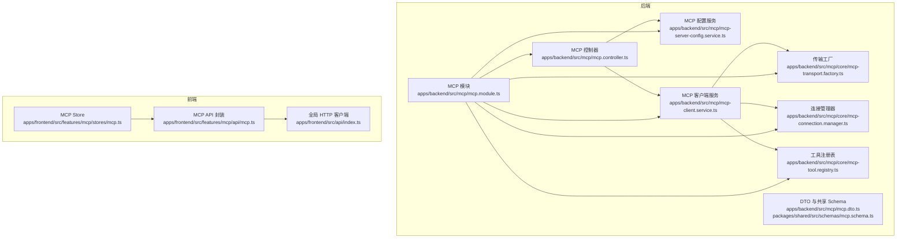
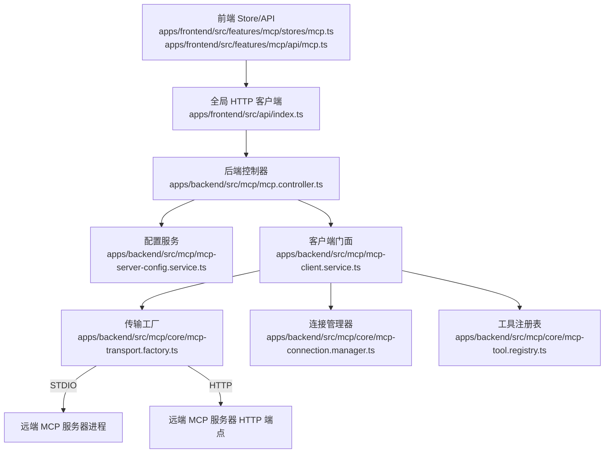
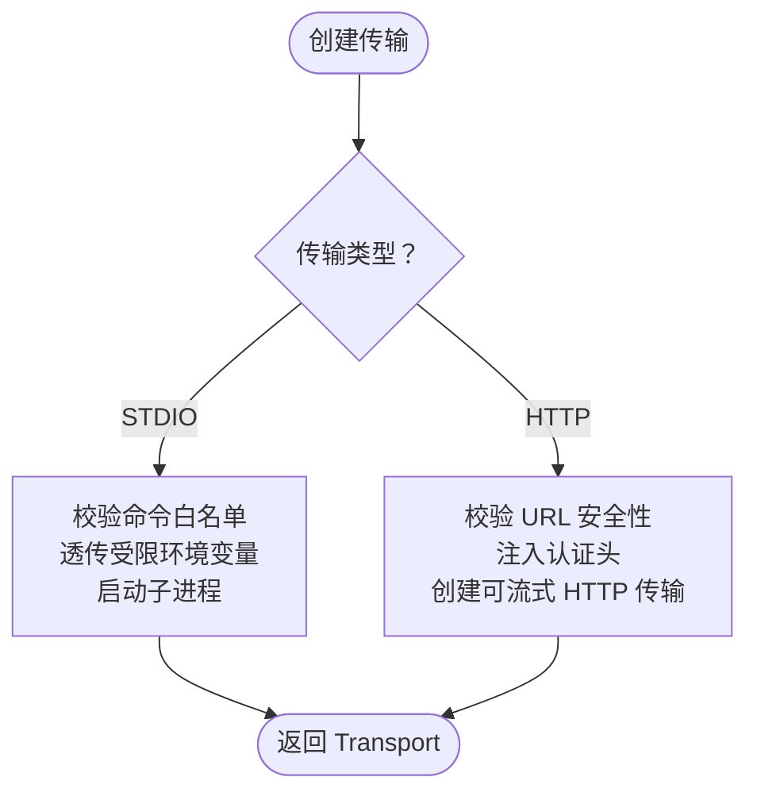
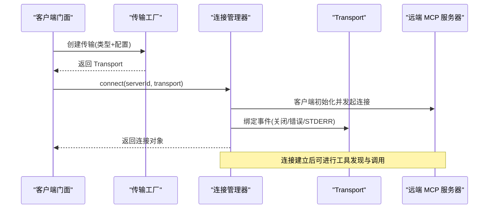
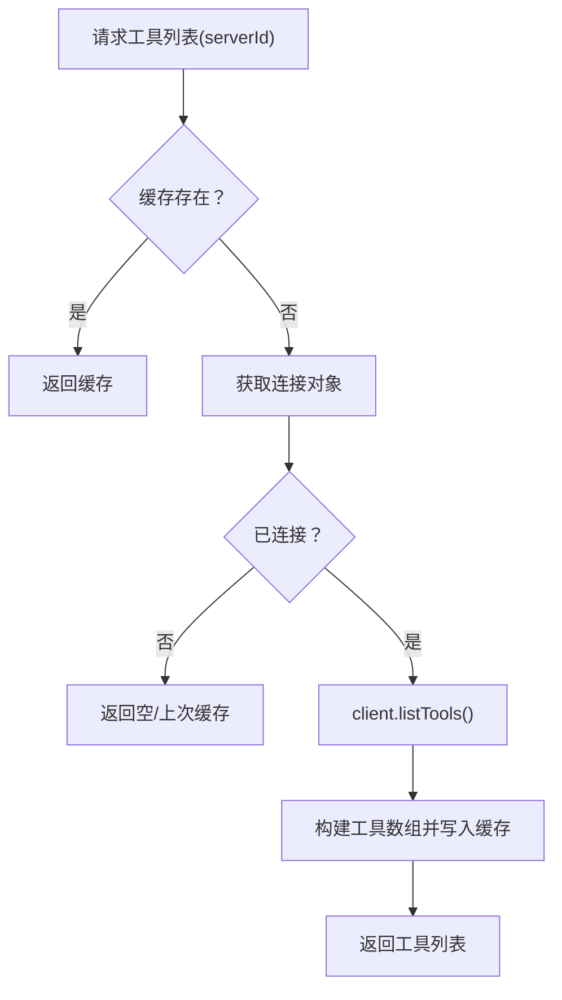
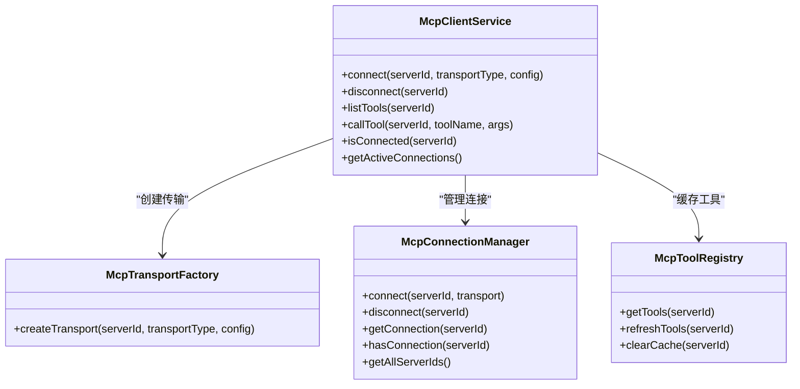
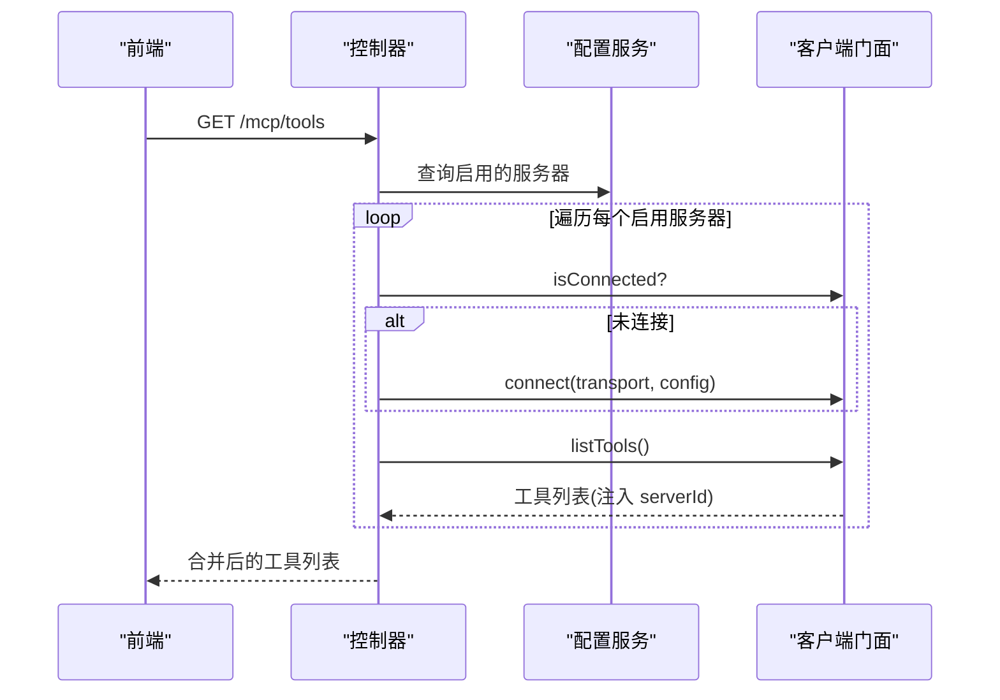
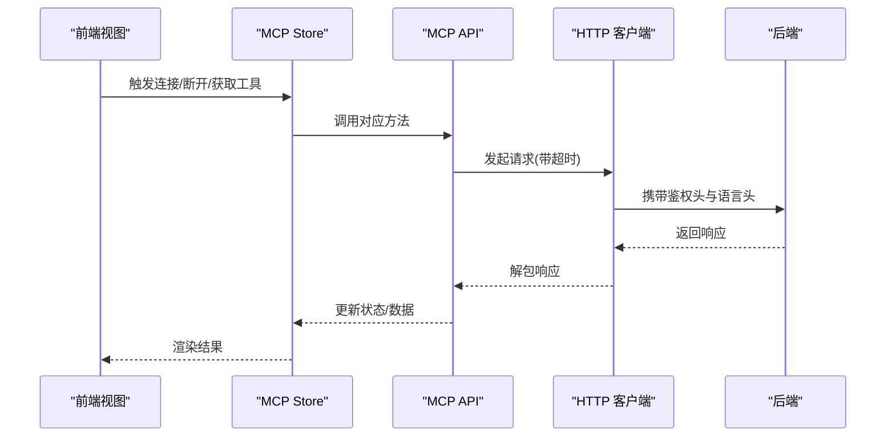
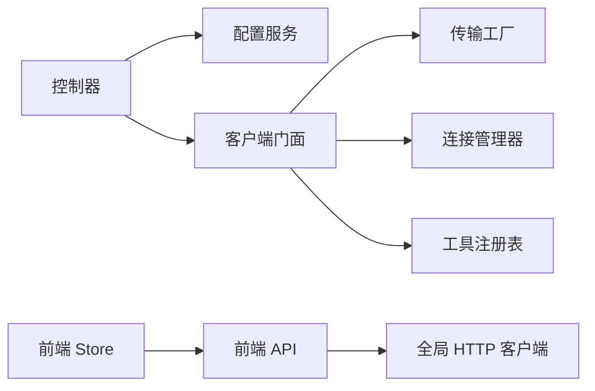

# 外部 API 集成

<cite>
**本文引用的文件**
- [apps/backend/src/mcp/mcp-client.service.ts](file://apps/backend/src/mcp/mcp-client.service.ts)
- [apps/backend/src/mcp/mcp-server-config.service.ts](file://apps/backend/src/mcp/mcp-server-config.service.ts)
- [apps/backend/src/mcp/mcp.controller.ts](file://apps/backend/src/mcp/mcp.controller.ts)
- [apps/backend/src/mcp/mcp.dto.ts](file://apps/backend/src/mcp/mcp.dto.ts)
- [apps/backend/src/mcp/mcp.module.ts](file://apps/backend/src/mcp/mcp.module.ts)
- [apps/backend/src/mcp/core/mcp-transport.factory.ts](file://apps/backend/src/mcp/core/mcp-transport.factory.ts)
- [apps/backend/src/mcp/core/mcp-connection.manager.ts](file://apps/backend/src/mcp/core/mcp-connection.manager.ts)
- [apps/backend/src/mcp/core/mcp-tool.registry.ts](file://apps/backend/src/mcp/core/mcp-tool.registry.ts)
- [packages/shared/src/schemas/mcp.schema.ts](file://packages/shared/src/schemas/mcp.schema.ts)
- [apps/backend/tests/mcp/mcp-client.service.spec.ts](file://apps/backend/tests/mcp/mcp-client.service.spec.ts)
- [apps/frontend/src/features/mcp/api/mcp.ts](file://apps/frontend/src/features/mcp/api/mcp.ts)
- [apps/frontend/src/features/mcp/stores/mcp.ts](file://apps/frontend/src/features/mcp/stores/mcp.ts)
- [apps/frontend/src/api/index.ts](file://apps/frontend/src/api/index.ts)
</cite>

## 目录
1. [简介](#简介)
2. [项目结构](#项目结构)
3. [核心组件](#核心组件)
4. [架构总览](#架构总览)
5. [详细组件分析](#详细组件分析)
6. [依赖关系分析](#依赖关系分析)
7. [性能考量](#性能考量)
8. [故障排查指南](#故障排查指南)
9. [结论](#结论)
10. [附录](#附录)

## 简介
本指南面向需要在系统中集成外部 API 服务（以 MCP 协议为例）的开发者，系统性阐述 MCP 协议客户端与服务端的实现要点，包括协议适配器与消息路由机制、外部 AI 服务集成与工具调用流程、API 客户端封装最佳实践（超时、重试、错误恢复）、认证与密钥管理、监控与日志、性能追踪以及故障转移与降级策略。文档同时覆盖前端与后端的协作模式，帮助团队在保证安全与稳定性的同时，高效扩展外部能力。

## 项目结构
后端采用 NestJS 模块化架构，MCP 功能集中在独立模块中；前端通过 Pinia Store 管理 MCP 服务器配置与连接状态，并通过统一的 HTTP 客户端进行 API 调用。

图示来源
- [apps/backend/src/mcp/mcp.controller.ts:1-198](file://apps/backend/src/mcp/mcp.controller.ts#L1-L198)
- [apps/backend/src/mcp/mcp-server-config.service.ts:1-156](file://apps/backend/src/mcp/mcp-server-config.service.ts#L1-L156)
- [apps/backend/src/mcp/mcp-client.service.ts:1-124](file://apps/backend/src/mcp/mcp-client.service.ts#L1-L124)
- [apps/backend/src/mcp/core/mcp-transport.factory.ts:1-220](file://apps/backend/src/mcp/core/mcp-transport.factory.ts#L1-L220)
- [apps/backend/src/mcp/core/mcp-connection.manager.ts:1-101](file://apps/backend/src/mcp/core/mcp-connection.manager.ts#L1-L101)
- [apps/backend/src/mcp/core/mcp-tool.registry.ts:1-48](file://apps/backend/src/mcp/core/mcp-tool.registry.ts#L1-L48)
- [apps/backend/src/mcp/mcp.dto.ts:1-59](file://apps/backend/src/mcp/mcp.dto.ts#L1-L59)
- [apps/backend/src/mcp/mcp.module.ts:1-25](file://apps/backend/src/mcp/mcp.module.ts#L1-L25)
- [apps/frontend/src/features/mcp/api/mcp.ts:1-108](file://apps/frontend/src/features/mcp/api/mcp.ts#L1-L108)
- [apps/frontend/src/features/mcp/stores/mcp.ts:1-246](file://apps/frontend/src/features/mcp/stores/mcp.ts#L1-L246)
- [apps/frontend/src/api/index.ts:1-199](file://apps/frontend/src/api/index.ts#L1-L199)

章节来源
- [apps/backend/src/mcp/mcp.module.ts:1-25](file://apps/backend/src/mcp/mcp.module.ts#L1-L25)
- [apps/backend/src/mcp/mcp.controller.ts:1-198](file://apps/backend/src/mcp/mcp.controller.ts#L1-L198)
- [apps/frontend/src/features/mcp/stores/mcp.ts:1-246](file://apps/frontend/src/features/mcp/stores/mcp.ts#L1-L246)

## 核心组件
- 协议适配器与传输层
  - 传输工厂负责根据配置创建 STDIO 或 HTTP 传输，内置安全校验与环境变量透传。
  - 连接管理器负责建立/关闭 MCP 客户端连接，维护活动连接映射。
  - 工具注册表负责缓存与刷新远端工具清单，支持按服务器维度缓存。
- 客户端门面服务
  - 统一暴露连接、断开、列出工具、调用工具等能力，负责错误日志与边界校验。
- 配置与路由
  - 控制器基于 JWT 保护，提供 MCP 服务器配置的增删改查、连接/断开、工具发现与调用。
  - 配置服务负责数据持久化与权限校验。
- 前端集成
  - Store 管理服务器列表、连接状态与错误；API 封装提供超时与错误处理；全局 HTTP 客户端注入鉴权与国际化头。

章节来源
- [apps/backend/src/mcp/core/mcp-transport.factory.ts:1-220](file://apps/backend/src/mcp/core/mcp-transport.factory.ts#L1-L220)
- [apps/backend/src/mcp/core/mcp-connection.manager.ts:1-101](file://apps/backend/src/mcp/core/mcp-connection.manager.ts#L1-L101)
- [apps/backend/src/mcp/core/mcp-tool.registry.ts:1-48](file://apps/backend/src/mcp/core/mcp-tool.registry.ts#L1-L48)
- [apps/backend/src/mcp/mcp-client.service.ts:1-124](file://apps/backend/src/mcp/mcp-client.service.ts#L1-L124)
- [apps/backend/src/mcp/mcp-server-config.service.ts:1-156](file://apps/backend/src/mcp/mcp-server-config.service.ts#L1-L156)
- [apps/backend/src/mcp/mcp.controller.ts:1-198](file://apps/backend/src/mcp/mcp.controller.ts#L1-L198)
- [apps/frontend/src/features/mcp/api/mcp.ts:1-108](file://apps/frontend/src/features/mcp/api/mcp.ts#L1-L108)
- [apps/frontend/src/features/mcp/stores/mcp.ts:1-246](file://apps/frontend/src/features/mcp/stores/mcp.ts#L1-L246)
- [apps/frontend/src/api/index.ts:1-199](file://apps/frontend/src/api/index.ts#L1-L199)

## 架构总览
下图展示 MCP 客户端门面如何协调传输工厂、连接管理器与工具注册表，以及前端如何通过 API 封装与全局 HTTP 客户端与后端交互。

图示来源
- [apps/frontend/src/features/mcp/stores/mcp.ts:1-246](file://apps/frontend/src/features/mcp/stores/mcp.ts#L1-L246)
- [apps/frontend/src/features/mcp/api/mcp.ts:1-108](file://apps/frontend/src/features/mcp/api/mcp.ts#L1-L108)
- [apps/frontend/src/api/index.ts:1-199](file://apps/frontend/src/api/index.ts#L1-L199)
- [apps/backend/src/mcp/mcp.controller.ts:1-198](file://apps/backend/src/mcp/mcp.controller.ts#L1-L198)
- [apps/backend/src/mcp/mcp-server-config.service.ts:1-156](file://apps/backend/src/mcp/mcp-server-config.service.ts#L1-L156)
- [apps/backend/src/mcp/mcp-client.service.ts:1-124](file://apps/backend/src/mcp/mcp-client.service.ts#L1-L124)
- [apps/backend/src/mcp/core/mcp-transport.factory.ts:1-220](file://apps/backend/src/mcp/core/mcp-transport.factory.ts#L1-L220)
- [apps/backend/src/mcp/core/mcp-connection.manager.ts:1-101](file://apps/backend/src/mcp/core/mcp-connection.manager.ts#L1-L101)
- [apps/backend/src/mcp/core/mcp-tool.registry.ts:1-48](file://apps/backend/src/mcp/core/mcp-tool.registry.ts#L1-L48)

## 详细组件分析

### 协议适配器与传输工厂
- 安全约束
  - 对 HTTP 端点进行协议与主机名校验，阻断私网/环回地址与 localhost 后缀域名。
  - 对 STDIO 传输进行命令白名单与环境变量透传控制，生产环境需显式允许命令。
- 认证注入
  - HTTP 传输支持 Bearer/OAuth 与 API Key 两种认证方式，自动注入 Authorization 或自定义头部。
- 传输创建
  - 根据配置动态选择 STDIO 或 HTTP 传输，HTTP 传输使用可流式的客户端实现。

图示来源
- [apps/backend/src/mcp/core/mcp-transport.factory.ts:1-220](file://apps/backend/src/mcp/core/mcp-transport.factory.ts#L1-L220)
- [packages/shared/src/schemas/mcp.schema.ts:1-220](file://packages/shared/src/schemas/mcp.schema.ts#L1-L220)

章节来源
- [apps/backend/src/mcp/core/mcp-transport.factory.ts:1-220](file://apps/backend/src/mcp/core/mcp-transport.factory.ts#L1-L220)
- [packages/shared/src/schemas/mcp.schema.ts:1-220](file://packages/shared/src/schemas/mcp.schema.ts#L1-L220)

### 连接管理器
- 生命周期
  - 建立连接时设置请求超时、捕获 STDERR 日志、处理连接关闭与错误事件。
  - 模块销毁时自动断开所有连接，确保资源回收。
- 状态维护
  - 以 Map 维护 serverId -> 连接对象，提供查询、存在性判断与枚举。

图示来源
- [apps/backend/src/mcp/mcp-client.service.ts:1-124](file://apps/backend/src/mcp/mcp-client.service.ts#L1-L124)
- [apps/backend/src/mcp/core/mcp-transport.factory.ts:1-220](file://apps/backend/src/mcp/core/mcp-transport.factory.ts#L1-L220)
- [apps/backend/src/mcp/core/mcp-connection.manager.ts:1-101](file://apps/backend/src/mcp/core/mcp-connection.manager.ts#L1-L101)

章节来源
- [apps/backend/src/mcp/core/mcp-connection.manager.ts:1-101](file://apps/backend/src/mcp/core/mcp-connection.manager.ts#L1-L101)

### 工具注册表
- 缓存策略
  - 以 serverId 为键缓存工具清单，首次访问触发刷新，后续命中缓存。
  - 断开连接时清理缓存，避免脏数据。
- 错误降级
  - 刷新失败时返回空列表或上次缓存，保障上层流程不中断。

图示来源
- [apps/backend/src/mcp/core/mcp-tool.registry.ts:1-48](file://apps/backend/src/mcp/core/mcp-tool.registry.ts#L1-L48)
- [apps/backend/src/mcp/core/mcp-connection.manager.ts:1-101](file://apps/backend/src/mcp/core/mcp-connection.manager.ts#L1-L101)

章节来源
- [apps/backend/src/mcp/core/mcp-tool.registry.ts:1-48](file://apps/backend/src/mcp/core/mcp-tool.registry.ts#L1-L48)

### 客户端门面服务
- 能力边界
  - 连接/断开、列出工具、调用工具、连接状态查询与活跃连接枚举。
- 错误处理
  - 在调用工具前校验连接与工具存在性，记录日志并抛出明确错误。
- 性能与可观测性
  - 通过日志记录工具执行前后状态，便于追踪与排障。

图示来源
- [apps/backend/src/mcp/mcp-client.service.ts:1-124](file://apps/backend/src/mcp/mcp-client.service.ts#L1-L124)
- [apps/backend/src/mcp/core/mcp-transport.factory.ts:1-220](file://apps/backend/src/mcp/core/mcp-transport.factory.ts#L1-L220)
- [apps/backend/src/mcp/core/mcp-connection.manager.ts:1-101](file://apps/backend/src/mcp/core/mcp-connection.manager.ts#L1-L101)
- [apps/backend/src/mcp/core/mcp-tool.registry.ts:1-48](file://apps/backend/src/mcp/core/mcp-tool.registry.ts#L1-L48)

章节来源
- [apps/backend/src/mcp/mcp-client.service.ts:1-124](file://apps/backend/src/mcp/mcp-client.service.ts#L1-L124)

### 控制器与配置服务
- 控制器
  - 基于 JWT 保护，提供 MCP 服务器配置的 CRUD、连接/断开、工具发现与调用。
  - 工具发现采用“懒连接”策略：仅在需要时连接启用的服务器并拉取工具清单。
- 配置服务
  - 负责数据持久化、权限校验与启用服务器查询，支持按用户维度隔离。

图示来源
- [apps/backend/src/mcp/mcp.controller.ts:1-198](file://apps/backend/src/mcp/mcp.controller.ts#L1-L198)
- [apps/backend/src/mcp/mcp-server-config.service.ts:1-156](file://apps/backend/src/mcp/mcp-server-config.service.ts#L1-L156)
- [apps/backend/src/mcp/mcp-client.service.ts:1-124](file://apps/backend/src/mcp/mcp-client.service.ts#L1-L124)

章节来源
- [apps/backend/src/mcp/mcp.controller.ts:1-198](file://apps/backend/src/mcp/mcp.controller.ts#L1-L198)
- [apps/backend/src/mcp/mcp-server-config.service.ts:1-156](file://apps/backend/src/mcp/mcp-server-config.service.ts#L1-L156)

### 前端集成与 API 封装
- Store
  - 维护服务器列表、连接状态、连接中状态与错误信息；支持自动连接启用的服务器。
- API 封装
  - 提供获取服务器、创建/更新/删除、连接/断开、获取工具与调用工具等方法；针对不同操作设置合理超时。
- 全局 HTTP 客户端
  - 自动注入 Authorization 头与语言头；对 401 场景进行令牌刷新与重试。

图示来源
- [apps/frontend/src/features/mcp/stores/mcp.ts:1-246](file://apps/frontend/src/features/mcp/stores/mcp.ts#L1-L246)
- [apps/frontend/src/features/mcp/api/mcp.ts:1-108](file://apps/frontend/src/features/mcp/api/mcp.ts#L1-L108)
- [apps/frontend/src/api/index.ts:1-199](file://apps/frontend/src/api/index.ts#L1-L199)

章节来源
- [apps/frontend/src/features/mcp/stores/mcp.ts:1-246](file://apps/frontend/src/features/mcp/stores/mcp.ts#L1-L246)
- [apps/frontend/src/features/mcp/api/mcp.ts:1-108](file://apps/frontend/src/features/mcp/api/mcp.ts#L1-L108)
- [apps/frontend/src/api/index.ts:1-199](file://apps/frontend/src/api/index.ts#L1-L199)

## 依赖关系分析
- 模块耦合
  - 控制器依赖配置服务与客户端门面；客户端门面依赖传输工厂、连接管理器与工具注册表。
  - 前端 Store 依赖 API 封装，API 封装依赖全局 HTTP 客户端。
- 外部依赖
  - 传输工厂依赖 MCP SDK 的 STDIO 与 HTTP 客户端实现。
  - 配置服务依赖数据库（Prisma），控制器依赖 JWT 守卫。

图示来源
- [apps/backend/src/mcp/mcp.controller.ts:1-198](file://apps/backend/src/mcp/mcp.controller.ts#L1-L198)
- [apps/backend/src/mcp/mcp-server-config.service.ts:1-156](file://apps/backend/src/mcp/mcp-server-config.service.ts#L1-L156)
- [apps/backend/src/mcp/mcp-client.service.ts:1-124](file://apps/backend/src/mcp/mcp-client.service.ts#L1-L124)
- [apps/backend/src/mcp/core/mcp-transport.factory.ts:1-220](file://apps/backend/src/mcp/core/mcp-transport.factory.ts#L1-L220)
- [apps/backend/src/mcp/core/mcp-connection.manager.ts:1-101](file://apps/backend/src/mcp/core/mcp-connection.manager.ts#L1-L101)
- [apps/backend/src/mcp/core/mcp-tool.registry.ts:1-48](file://apps/backend/src/mcp/core/mcp-tool.registry.ts#L1-L48)
- [apps/frontend/src/features/mcp/stores/mcp.ts:1-246](file://apps/frontend/src/features/mcp/stores/mcp.ts#L1-L246)
- [apps/frontend/src/features/mcp/api/mcp.ts:1-108](file://apps/frontend/src/features/mcp/api/mcp.ts#L1-L108)
- [apps/frontend/src/api/index.ts:1-199](file://apps/frontend/src/api/index.ts#L1-L199)

章节来源
- [apps/backend/src/mcp/mcp.module.ts:1-25](file://apps/backend/src/mcp/mcp.module.ts#L1-L25)

## 性能考量
- 连接与超时
  - 连接管理器设置请求超时，避免长时间阻塞；前端对连接、工具发现与工具调用分别设置不同超时阈值，平衡体验与稳定性。
- 缓存与懒加载
  - 工具注册表按服务器维度缓存工具清单，减少重复查询；控制器在工具发现时采用懒连接策略，仅对启用服务器建立连接。
- 传输选择
  - HTTP 传输使用可流式实现，适合长连接与流式响应场景；STDIO 传输适合本地进程通信，注意命令白名单与环境变量控制。
- 日志与监控
  - 连接管理器捕获 STDERR 并记录错误；客户端门面记录工具执行日志；建议结合业务埋点统计工具调用耗时与成功率。

章节来源
- [apps/backend/src/mcp/core/mcp-connection.manager.ts:1-101](file://apps/backend/src/mcp/core/mcp-connection.manager.ts#L1-L101)
- [apps/backend/src/mcp/core/mcp-tool.registry.ts:1-48](file://apps/backend/src/mcp/core/mcp-tool.registry.ts#L1-L48)
- [apps/backend/src/mcp/mcp.controller.ts:1-198](file://apps/backend/src/mcp/mcp.controller.ts#L1-L198)
- [apps/frontend/src/features/mcp/api/mcp.ts:1-108](file://apps/frontend/src/features/mcp/api/mcp.ts#L1-L108)

## 故障排查指南
- 连接失败
  - 检查传输配置与安全校验（URL 协议、主机名、解析结果）；确认 STDIO 命令是否在白名单内；查看连接管理器的 STDERR 日志。
- 工具不可用
  - 确认客户端门面已连接目标服务器；检查工具注册表缓存是否有效；必要时触发刷新。
- 认证问题
  - HTTP 传输需确保认证头正确注入；Bearer/OAuth 与 API Key 方案需与远端一致。
- 前端无响应
  - 检查全局 HTTP 客户端是否正确注入 Authorization 与语言头；关注 401 自动刷新流程是否生效。
- 单元测试参考
  - 参考客户端服务测试用例，验证连接、工具列举与调用行为。

章节来源
- [apps/backend/src/mcp/core/mcp-transport.factory.ts:1-220](file://apps/backend/src/mcp/core/mcp-transport.factory.ts#L1-L220)
- [apps/backend/src/mcp/core/mcp-connection.manager.ts:1-101](file://apps/backend/src/mcp/core/mcp-connection.manager.ts#L1-L101)
- [apps/backend/src/mcp/core/mcp-tool.registry.ts:1-48](file://apps/backend/src/mcp/core/mcp-tool.registry.ts#L1-L48)
- [apps/frontend/src/api/index.ts:1-199](file://apps/frontend/src/api/index.ts#L1-L199)
- [apps/backend/tests/mcp/mcp-client.service.spec.ts:1-144](file://apps/backend/tests/mcp/mcp-client.service.spec.ts#L1-L144)

## 结论
该实现以模块化方式解耦了 MCP 协议的传输、连接与工具管理，前端通过 Store 与 API 封装实现了对后端能力的直观调用。通过安全校验、缓存与懒加载、合理的超时与错误处理，系统在保证安全性与稳定性的同时，具备良好的可扩展性与可观测性。建议在生产环境中配合完善的监控与告警体系，持续优化连接与工具调用的性能表现。

## 附录
- 认证与密钥管理
  - HTTP 传输支持 Bearer/OAuth 与 API Key；API Key 支持自定义头部名称；建议将密钥存储在受控环境变量中，避免硬编码。
- 监控、日志与性能追踪
  - 建议在连接管理器与客户端门面增加指标上报（如连接数、工具调用次数与耗时）；结合日志聚合平台进行异常追踪。
- 故障转移与降级策略
  - 工具注册表在刷新失败时返回缓存或空列表，保障主流程可用；控制器在工具发现失败时记录错误并继续处理其他服务器；前端 Store 对连接失败进行错误提示与重试引导。

章节来源
- [apps/backend/src/mcp/core/mcp-transport.factory.ts:1-220](file://apps/backend/src/mcp/core/mcp-transport.factory.ts#L1-L220)
- [apps/backend/src/mcp/core/mcp-tool.registry.ts:1-48](file://apps/backend/src/mcp/core/mcp-tool.registry.ts#L1-L48)
- [apps/backend/src/mcp/mcp.controller.ts:1-198](file://apps/backend/src/mcp/mcp.controller.ts#L1-L198)
- [apps/frontend/src/features/mcp/stores/mcp.ts:1-246](file://apps/frontend/src/features/mcp/stores/mcp.ts#L1-L246)