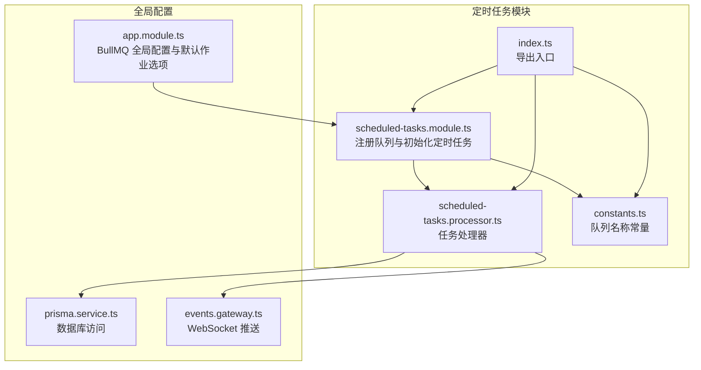
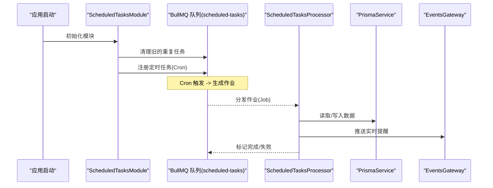
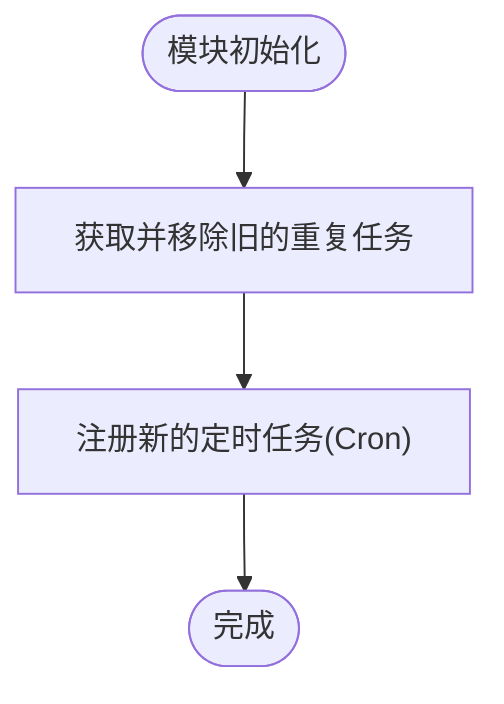
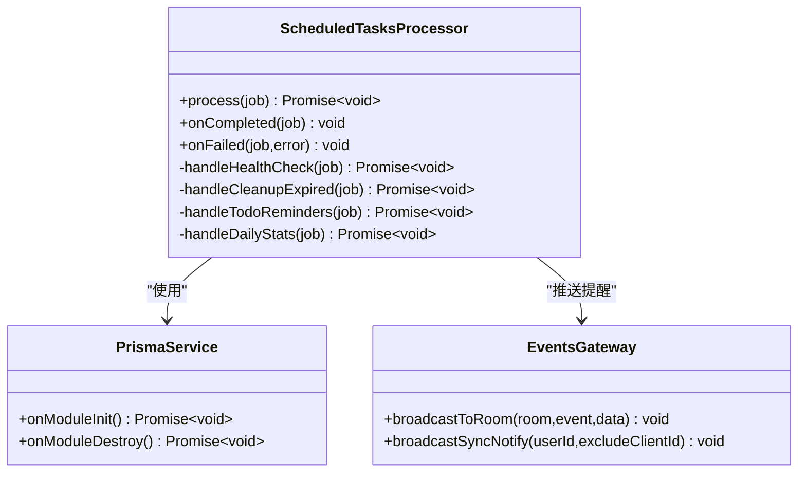
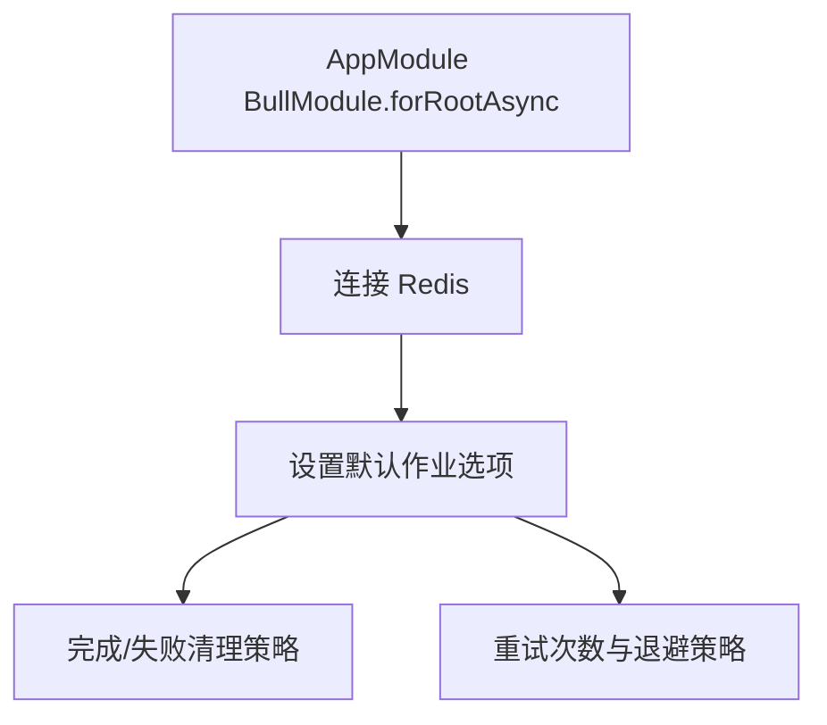
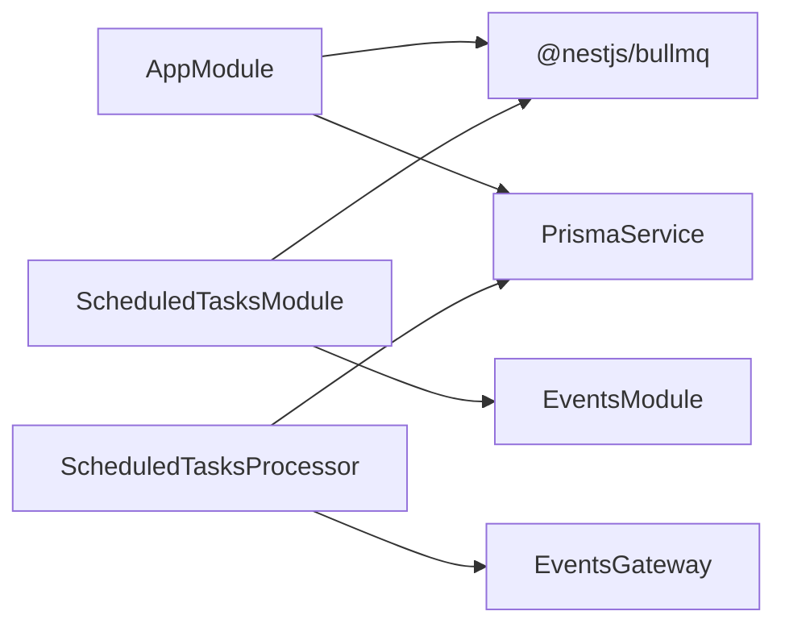

# 定时任务集成

<cite>
**本文引用的文件**
- [apps/backend/src/scheduled-tasks/scheduled-tasks.module.ts](file://apps/backend/src/scheduled-tasks/scheduled-tasks.module.ts)
- [apps/backend/src/scheduled-tasks/scheduled-tasks.processor.ts](file://apps/backend/src/scheduled-tasks/scheduled-tasks.processor.ts)
- [apps/backend/src/scheduled-tasks/constants.ts](file://apps/backend/src/scheduled-tasks/constants.ts)
- [apps/backend/src/scheduled-tasks/index.ts](file://apps/backend/src/scheduled-tasks/index.ts)
- [apps/backend/src/app.module.ts](file://apps/backend/src/app.module.ts)
- [apps/backend/src/events/events.gateway.ts](file://apps/backend/src/events/events.gateway.ts)
- [apps/backend/src/prisma/prisma.service.ts](file://apps/backend/src/prisma/prisma.service.ts)
- [apps/backend/package.json](file://apps/backend/package.json)
- [apps/backend/tests/scheduled-tasks.processor.spec.ts](file://apps/backend/tests/scheduled-tasks.processor.spec.ts)
</cite>

## 目录
1. [简介](#简介)
2. [项目结构](#项目结构)
3. [核心组件](#核心组件)
4. [架构总览](#架构总览)
5. [详细组件分析](#详细组件分析)
6. [依赖关系分析](#依赖关系分析)
7. [性能考量](#性能考量)
8. [故障排查指南](#故障排查指南)
9. [结论](#结论)
10. [附录](#附录)

## 简介
本集成文档面向基于 NestJS 与 BullMQ 的定时任务系统，围绕“后台任务队列”“任务处理器”“作业调度与队列管理”“定时任务配置与执行策略（Cron 与延迟）”“任务开发模式与错误处理”“任务持久化、重试与死信队列”“任务监控、性能优化与扩展性”以及“常见定时任务场景示例”进行系统化说明。文档同时提供可视化图示与可操作的实践建议，帮助开发者快速上手并安全地扩展定时任务能力。

## 项目结构
定时任务相关代码位于后端应用的 scheduled-tasks 子目录中，采用模块化设计，配合全局的 BullMQ 配置与 Prisma 数据访问层，形成清晰的职责边界：
- scheduled-tasks.module.ts：注册定时任务队列、在模块初始化时清理旧重复任务并注册新的定时任务
- scheduled-tasks.processor.ts：实现具体的任务处理器，按任务类型分发到不同处理函数
- constants.ts：统一队列名称常量
- index.ts：导出模块、处理器与常量，便于上层模块引入
- app.module.ts：全局注册 BullMQ 连接与默认作业选项（重试、退避、完成/失败清理策略）
- events.gateway.ts：WebSocket 网关，用于向用户实时推送提醒
- prisma.service.ts：数据库连接与事务封装，供任务处理器读写数据
- package.json：依赖声明，包含 @nestjs/bullmq 与 bullmq

图表来源
- [apps/backend/src/scheduled-tasks/scheduled-tasks.module.ts:15-37](file://apps/backend/src/scheduled-tasks/scheduled-tasks.module.ts#L15-L37)
- [apps/backend/src/scheduled-tasks/scheduled-tasks.processor.ts:36-68](file://apps/backend/src/scheduled-tasks/scheduled-tasks.processor.ts#L36-L68)
- [apps/backend/src/scheduled-tasks/constants.ts:4-4](file://apps/backend/src/scheduled-tasks/constants.ts#L4-L4)
- [apps/backend/src/scheduled-tasks/index.ts:1-4](file://apps/backend/src/scheduled-tasks/index.ts#L1-L4)
- [apps/backend/src/app.module.ts:96-115](file://apps/backend/src/app.module.ts#L96-L115)
- [apps/backend/src/prisma/prisma.service.ts:6-33](file://apps/backend/src/prisma/prisma.service.ts#L6-L33)
- [apps/backend/src/events/events.gateway.ts:57-66](file://apps/backend/src/events/events.gateway.ts#L57-L66)

章节来源
- [apps/backend/src/scheduled-tasks/scheduled-tasks.module.ts:1-92](file://apps/backend/src/scheduled-tasks/scheduled-tasks.module.ts#L1-L92)
- [apps/backend/src/scheduled-tasks/scheduled-tasks.processor.ts:1-290](file://apps/backend/src/scheduled-tasks/scheduled-tasks.processor.ts#L1-L290)
- [apps/backend/src/scheduled-tasks/constants.ts:1-5](file://apps/backend/src/scheduled-tasks/constants.ts#L1-L5)
- [apps/backend/src/scheduled-tasks/index.ts:1-4](file://apps/backend/src/scheduled-tasks/index.ts#L1-L4)
- [apps/backend/src/app.module.ts:96-115](file://apps/backend/src/app.module.ts#L96-L115)

## 核心组件
- 定时任务模块（ScheduledTasksModule）
  - 通过 BullModule.registerQueue 注册名为 “scheduled-tasks” 的队列
  - 在模块初始化时清理旧的重复任务，再注册新的定时任务
  - 默认移除完成任务、保留失败任务以便排查
- 任务处理器（ScheduledTasksProcessor）
  - 基于 @Processor 装饰器绑定队列，接收 Job 并按 type 分发
  - 实现健康检查、过期数据清理、待办提醒推送、每日统计等任务
  - 通过 PrismaService 访问数据库，通过 EventsGateway 推送实时消息
  - 监听 completed/failed 事件进行日志记录
- 全局 BullMQ 配置（AppModule）
  - 通过 BullModule.forRootAsync 提供 Redis 连接参数
  - 设置默认作业选项：完成自动清理、失败保留、重试 3 次、指数退避（初始 1 秒）
- 队列常量（constants.ts）
  - 统一的队列名称常量，避免硬编码

章节来源
- [apps/backend/src/scheduled-tasks/scheduled-tasks.module.ts:15-37](file://apps/backend/src/scheduled-tasks/scheduled-tasks.module.ts#L15-L37)
- [apps/backend/src/scheduled-tasks/scheduled-tasks.processor.ts:36-68](file://apps/backend/src/scheduled-tasks/scheduled-tasks.processor.ts#L36-L68)
- [apps/backend/src/app.module.ts:96-115](file://apps/backend/src/app.module.ts#L96-L115)
- [apps/backend/src/scheduled-tasks/constants.ts:4-4](file://apps/backend/src/scheduled-tasks/constants.ts#L4-L4)

## 架构总览
下图展示定时任务从注册到执行的关键交互路径，包括 Cron 触发、作业入队、处理器消费与数据/推送处理。

图表来源
- [apps/backend/src/scheduled-tasks/scheduled-tasks.module.ts:28-37](file://apps/backend/src/scheduled-tasks/scheduled-tasks.module.ts#L28-L37)
- [apps/backend/src/scheduled-tasks/scheduled-tasks.processor.ts:49-68](file://apps/backend/src/scheduled-tasks/scheduled-tasks.processor.ts#L49-L68)
- [apps/backend/src/prisma/prisma.service.ts:6-33](file://apps/backend/src/prisma/prisma.service.ts#L6-L33)
- [apps/backend/src/events/events.gateway.ts:255-257](file://apps/backend/src/events/events.gateway.ts#L255-L257)

## 详细组件分析

### 组件 A：定时任务模块（ScheduledTasksModule）
- 职责
  - 注册队列、在 onModuleInit 时清理旧重复任务，确保新配置生效
  - 注册多种 Cron 任务，如每分钟健康检查、每小时清理、每日统计等
- 关键点
  - 使用 repeat.pattern 指定 Cron 表达式
  - removeOnComplete/removeOnFail 控制完成/失败后的作业清理
- 扩展建议
  - 将 Cron 配置集中管理，或从配置中心动态加载
  - 对高优先级任务设置更严格的重试与退避策略

图表来源
- [apps/backend/src/scheduled-tasks/scheduled-tasks.module.ts:28-37](file://apps/backend/src/scheduled-tasks/scheduled-tasks.module.ts#L28-L37)

章节来源
- [apps/backend/src/scheduled-tasks/scheduled-tasks.module.ts:15-92](file://apps/backend/src/scheduled-tasks/scheduled-tasks.module.ts#L15-L92)

### 组件 B：任务处理器（ScheduledTasksProcessor）
- 职责
  - 接收作业并按 type 分发到具体处理函数
  - 健康检查、过期数据清理、待办提醒推送、每日统计
  - 记录完成/失败事件日志
- 数据流
  - 读取/写入 Prisma 数据库
  - 通过 EventsGateway 向用户房间广播实时提醒
- 错误处理
  - 每个任务内部使用 try/catch 记录错误日志
  - 未捕获异常由 BullMQ 默认重试与退避策略兜底

图表来源
- [apps/backend/src/scheduled-tasks/scheduled-tasks.processor.ts:36-68](file://apps/backend/src/scheduled-tasks/scheduled-tasks.processor.ts#L36-L68)
- [apps/backend/src/prisma/prisma.service.ts:6-33](file://apps/backend/src/prisma/prisma.service.ts#L6-L33)
- [apps/backend/src/events/events.gateway.ts:255-257](file://apps/backend/src/events/events.gateway.ts#L255-L257)

章节来源
- [apps/backend/src/scheduled-tasks/scheduled-tasks.processor.ts:1-290](file://apps/backend/src/scheduled-tasks/scheduled-tasks.processor.ts#L1-L290)

### 组件 C：全局 BullMQ 配置（AppModule）
- 职责
  - 提供 Redis 连接参数
  - 设置默认作业选项：完成自动清理、失败保留、重试 3 次、指数退避
- 影响范围
  - 所有通过 BullModule 创建的队列均继承这些默认值
- 注意
  - 如需对特定队列覆盖默认值，可在注册队列时传入 options

图表来源
- [apps/backend/src/app.module.ts:96-115](file://apps/backend/src/app.module.ts#L96-L115)

章节来源
- [apps/backend/src/app.module.ts:96-115](file://apps/backend/src/app.module.ts#L96-L115)

### 组件 D：队列常量与导出（constants.ts 与 index.ts）
- 队列名称统一管理，避免硬编码
- index.ts 提供统一导出，便于模块间引用

章节来源
- [apps/backend/src/scheduled-tasks/constants.ts:4-4](file://apps/backend/src/scheduled-tasks/constants.ts#L4-L4)
- [apps/backend/src/scheduled-tasks/index.ts:1-4](file://apps/backend/src/scheduled-tasks/index.ts#L1-L4)

## 依赖关系分析
- 模块耦合
  - ScheduledTasksModule 依赖 BullModule 与 EventsModule
  - ScheduledTasksProcessor 依赖 PrismaService 与 EventsGateway
- 外部依赖
  - Redis：BullMQ 作业存储与分布式锁
  - PostgreSQL：Prisma 访问
  - Socket.IO：实时提醒推送
- 潜在循环依赖
  - 当前结构无明显循环依赖；若未来引入跨模块回调，需谨慎设计

图表来源
- [apps/backend/src/app.module.ts:96-115](file://apps/backend/src/app.module.ts#L96-L115)
- [apps/backend/src/scheduled-tasks/scheduled-tasks.module.ts:15-24](file://apps/backend/src/scheduled-tasks/scheduled-tasks.module.ts#L15-L24)
- [apps/backend/src/scheduled-tasks/scheduled-tasks.processor.ts:40-47](file://apps/backend/src/scheduled-tasks/scheduled-tasks.processor.ts#L40-L47)
- [apps/backend/src/events/events.gateway.ts:57-66](file://apps/backend/src/events/events.gateway.ts#L57-L66)

章节来源
- [apps/backend/src/app.module.ts:96-115](file://apps/backend/src/app.module.ts#L96-L115)
- [apps/backend/src/scheduled-tasks/scheduled-tasks.module.ts:15-24](file://apps/backend/src/scheduled-tasks/scheduled-tasks.module.ts#L15-L24)
- [apps/backend/src/scheduled-tasks/scheduled-tasks.processor.ts:40-47](file://apps/backend/src/scheduled-tasks/scheduled-tasks.processor.ts#L40-L47)

## 性能考量
- 作业粒度与并发
  - 将耗时任务拆分为多个小作业，避免单个作业长时间占用 Worker
  - 合理设置 Worker 数量，避免过度竞争 Redis
- 数据库访问
  - 使用事务批量写入，减少往返次数
  - 对高频查询建立必要索引（如待办事项的 dueAt/remindAt 等）
- 网络与 IO
  - WebSocket 推送采用房间广播，注意控制单次推送的数据量
  - 对外 API 调用增加超时与熔断保护
- Redis 与内存
  - 监控队列长度与作业堆积情况，必要时扩容 Worker 或队列实例
  - 避免在作业中缓存大量中间数据

## 故障排查指南
- 常见问题
  - 任务未执行：检查 Cron 表达式是否正确、模块初始化是否完成
  - 任务频繁失败：查看失败保留策略与重试退避配置
  - 数据不一致：确认事务使用与并发写入控制
  - 推送失败：检查 WebSocket 房间权限与连接状态
- 日志与监控
  - 使用 @OnWorkerEvent('completed'|'failed') 记录作业生命周期事件
  - 结合 BullMQ Web UI 或第三方监控工具观察队列状态
- 单元测试参考
  - 测试用例覆盖每日统计任务的聚合逻辑与错误分支

章节来源
- [apps/backend/src/scheduled-tasks/scheduled-tasks.processor.ts:280-289](file://apps/backend/src/scheduled-tasks/scheduled-tasks.processor.ts#L280-L289)
- [apps/backend/tests/scheduled-tasks.processor.spec.ts:31-93](file://apps/backend/tests/scheduled-tasks.processor.spec.ts#L31-L93)

## 结论
本系统以 BullMQ 为核心，结合 NestJS 模块化与装饰器模式，实现了稳定、可扩展的定时任务体系。通过统一的队列常量、模块化的任务处理器与全局的默认作业配置，开发者可以快速新增任务类型并保证在分布式环境下的唯一执行与可靠重试。建议在生产环境中进一步完善配置中心、监控告警与容量规划，以支撑更大规模的业务需求。

## 附录

### 定时任务配置与执行策略
- Cron 表达式
  - 每分钟健康检查与待办提醒：* * * * *
  - 每小时清理：0 * * * *
  - 每日统计：0 2 * * *
- 延迟执行
  - 可通过在 add 时传入 delay 参数实现延迟作业（适用于一次性任务）
- 重试与退避
  - 默认重试 3 次，指数退避（初始 1 秒），失败作业保留以便排查

章节来源
- [apps/backend/src/scheduled-tasks/scheduled-tasks.module.ts:41-89](file://apps/backend/src/scheduled-tasks/scheduled-tasks.module.ts#L41-L89)
- [apps/backend/src/app.module.ts:105-113](file://apps/backend/src/app.module.ts#L105-L113)

### 任务处理器开发模式与错误处理
- 开发模式
  - 新增任务类型：在 constants.ts 中定义 type，在 module 中注册作业，在 processor 中新增处理函数
  - 使用事务包裹写操作，避免部分失败导致的数据不一致
- 错误处理
  - 任务内部 try/catch 记录错误日志
  - 未捕获异常由 BullMQ 默认重试与退避兜底

章节来源
- [apps/backend/src/scheduled-tasks/scheduled-tasks.processor.ts:49-68](file://apps/backend/src/scheduled-tasks/scheduled-tasks.processor.ts#L49-L68)
- [apps/backend/src/app.module.ts:105-113](file://apps/backend/src/app.module.ts#L105-L113)

### 任务持久化、重试策略与死信队列
- 持久化
  - 作业状态与历史记录由 Redis 存储，重启后仍可恢复
- 重试策略
  - 默认 3 次重试，指数退避
- 死信队列
  - 当前未启用专用死信队列；可通过自定义队列与错误处理器实现

章节来源
- [apps/backend/src/app.module.ts:105-113](file://apps/backend/src/app.module.ts#L105-L113)

### 任务监控与可观测性
- 建议指标
  - 作业完成率、平均耗时、失败率、队列长度、重试次数
- 工具
  - BullMQ Web UI 或第三方监控平台
  - 结合日志系统与告警规则

### 扩展性考虑
- 多队列隔离：按任务类型拆分队列，避免相互影响
- 动态配置：将 Cron 与重试策略迁移到配置中心
- 弹性扩容：Worker 水平扩展，结合负载均衡

### 常见定时任务场景示例
- 健康检查：周期性检查数据库、缓存与外部服务连通性
- 数据清理：定期物理删除长期未使用的逻辑删除数据
- 提醒推送：向用户房间广播待办事项到期提醒
- 统计报表：按自然日统计活跃/完成/创建/删除等指标

章节来源
- [apps/backend/src/scheduled-tasks/scheduled-tasks.module.ts:39-89](file://apps/backend/src/scheduled-tasks/scheduled-tasks.module.ts#L39-L89)
- [apps/backend/src/scheduled-tasks/scheduled-tasks.processor.ts:73-77](file://apps/backend/src/scheduled-tasks/scheduled-tasks.processor.ts#L73-L77)
- [apps/backend/src/scheduled-tasks/scheduled-tasks.processor.ts:82-145](file://apps/backend/src/scheduled-tasks/scheduled-tasks.processor.ts#L82-L145)
- [apps/backend/src/scheduled-tasks/scheduled-tasks.processor.ts:147-190](file://apps/backend/src/scheduled-tasks/scheduled-tasks.processor.ts#L147-L190)
- [apps/backend/src/scheduled-tasks/scheduled-tasks.processor.ts:195-278](file://apps/backend/src/scheduled-tasks/scheduled-tasks.processor.ts#L195-L278)