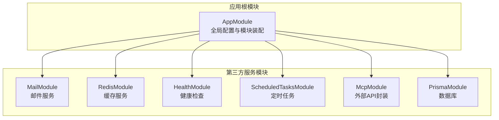
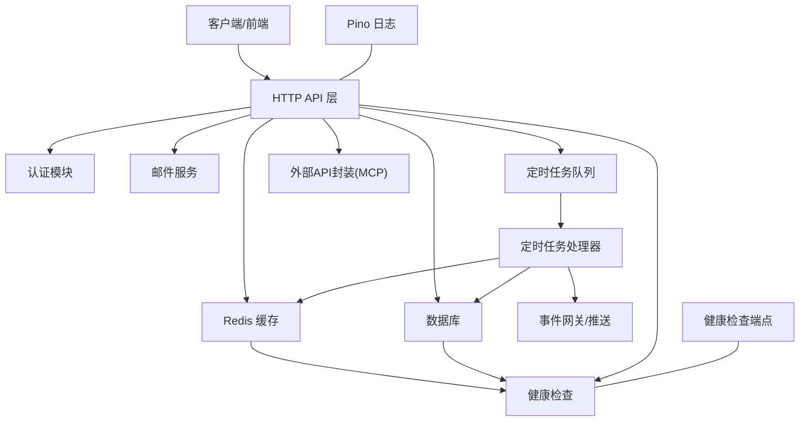
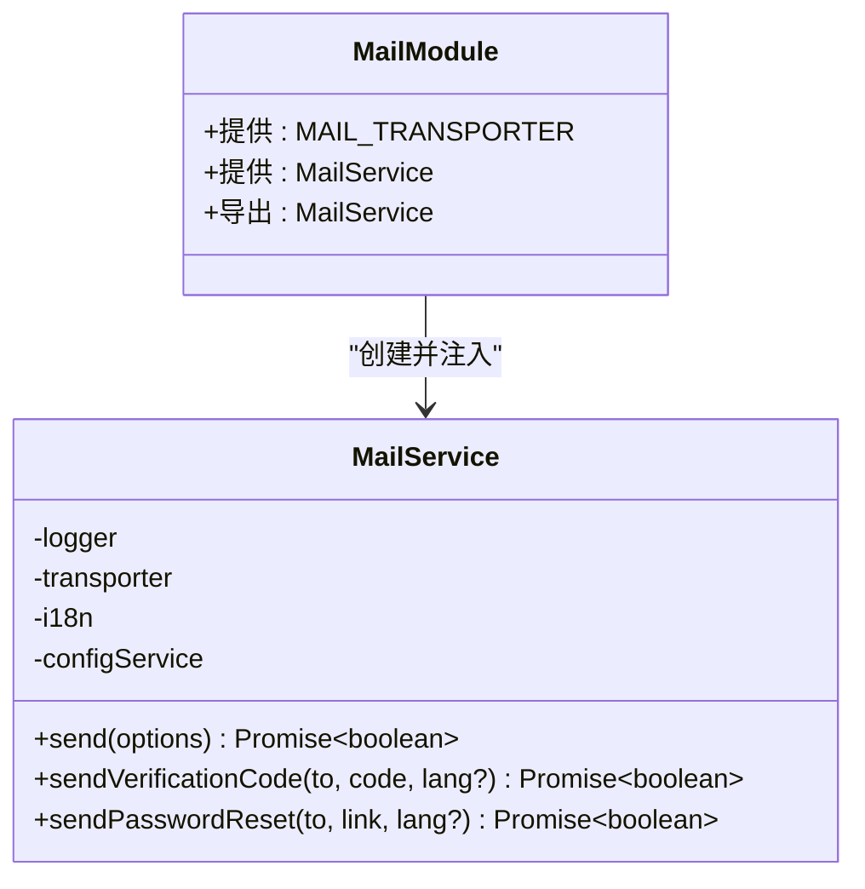
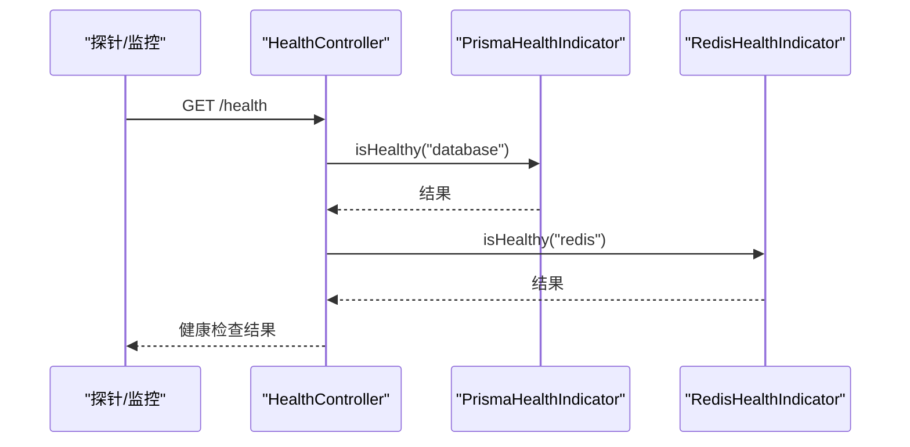
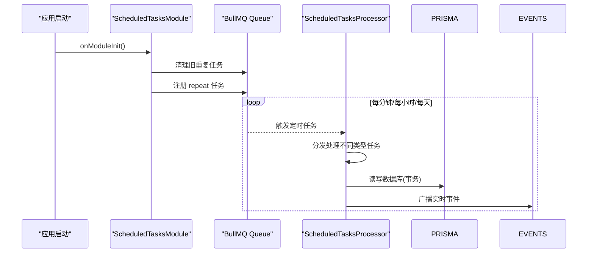
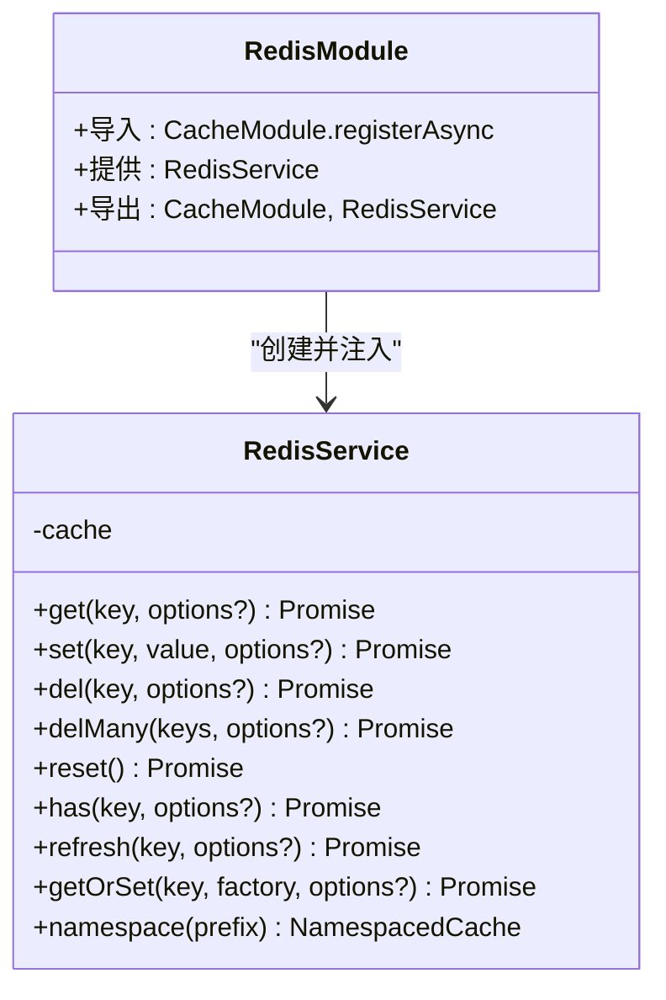
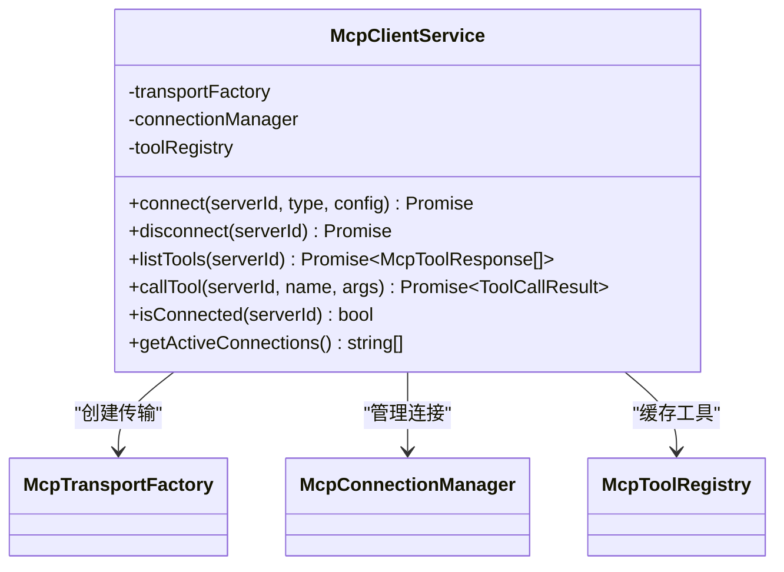
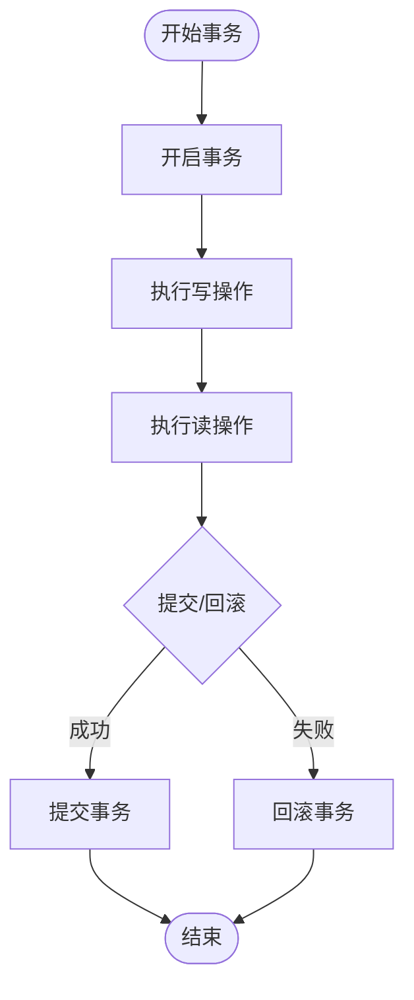
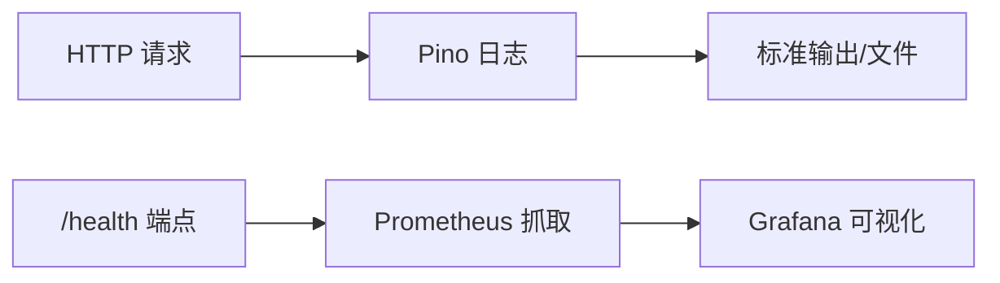
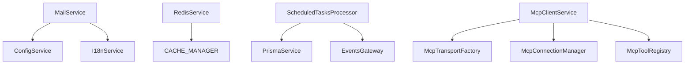

# 第三方集成

<cite>
**本文引用的文件**
- [apps/backend/src/app.module.ts](file://apps/backend/src/app.module.ts)
- [apps/backend/src/mail/mail.module.ts](file://apps/backend/src/mail/mail.module.ts)
- [apps/backend/src/mail/mail.service.ts](file://apps/backend/src/mail/mail.service.ts)
- [apps/backend/src/i18n/en-US/mail.ts](file://apps/backend/src/i18n/en-US/mail.ts)
- [apps/backend/src/i18n/zh-CN/mail.ts](file://apps/backend/src/i18n/zh-CN/mail.ts)
- [apps/backend/src/redis/redis.module.ts](file://apps/backend/src/redis/redis.module.ts)
- [apps/backend/src/redis/redis.service.ts](file://apps/backend/src/redis/redis.service.ts)
- [apps/backend/src/redis/redis.health.ts](file://apps/backend/src/redis/redis.health.ts)
- [apps/backend/src/scheduled-tasks/scheduled-tasks.module.ts](file://apps/backend/src/scheduled-tasks/scheduled-tasks.module.ts)
- [apps/backend/src/scheduled-tasks/scheduled-tasks.processor.ts](file://apps/backend/src/scheduled-tasks/scheduled-tasks.processor.ts)
- [apps/backend/src/health/health.controller.ts](file://apps/backend/src/health/health.controller.ts)
- [apps/backend/src/health/prisma.health.ts](file://apps/backend/src/health/prisma.health.ts)
- [apps/backend/src/prisma/prisma.service.ts](file://apps/backend/src/prisma/prisma.service.ts)
- [apps/backend/src/mcp/mcp.module.ts](file://apps/backend/src/mcp/mcp.module.ts)
- [apps/backend/src/mcp/mcp-client.service.ts](file://apps/backend/src/mcp/mcp-client.service.ts)
</cite>

## 目录
1. [简介](#简介)
2. [项目结构](#项目结构)
3. [核心组件](#核心组件)
4. [架构总览](#架构总览)
5. [详细组件分析](#详细组件分析)
6. [依赖关系分析](#依赖关系分析)
7. [性能考虑](#性能考虑)
8. [故障排查指南](#故障排查指南)
9. [结论](#结论)
10. [附录](#附录)

## 简介
本指南面向 Lumina Todo 后端的第三方服务集成与扩展开发，覆盖以下主题：
- 邮件服务集成：配置、使用与国际化文案
- 健康检查服务：实现与监控集成
- 定时任务系统：扩展与自定义调度器开发
- Redis 缓存系统：集成与性能优化
- 外部 API 服务封装与错误处理机制
- OAuth 认证服务集成与用户授权流程
- 数据库连接池与事务管理扩展
- 日志服务与监控系统集成策略

## 项目结构
后端采用 NestJS 架构，第三方服务以模块形式组织，集中于 apps/backend/src 下的子目录中。根模块负责全局配置与模块装配。

图表来源
- [apps/backend/src/app.module.ts:27-175](file://apps/backend/src/app.module.ts#L27-L175)
- [apps/backend/src/mail/mail.module.ts:11-36](file://apps/backend/src/mail/mail.module.ts#L11-L36)
- [apps/backend/src/redis/redis.module.ts:26-83](file://apps/backend/src/redis/redis.module.ts#L26-L83)
- [apps/backend/src/health/health.controller.ts:16-77](file://apps/backend/src/health/health.controller.ts#L16-L77)
- [apps/backend/src/scheduled-tasks/scheduled-tasks.module.ts:15-92](file://apps/backend/src/scheduled-tasks/scheduled-tasks.module.ts#L15-L92)
- [apps/backend/src/mcp/mcp.module.ts:13-24](file://apps/backend/src/mcp/mcp.module.ts#L13-L24)

章节来源
- [apps/backend/src/app.module.ts:27-175](file://apps/backend/src/app.module.ts#L27-L175)

## 核心组件
- 邮件服务：基于 nodemailer 的 SMTP 集成，支持文本与 HTML 邮件发送，并通过国际化模块提供多语言文案。
- Redis 缓存：基于 cache-manager-ioredis-yet 的全局缓存模块，提供 TTL、键前缀、命名空间等能力。
- 健康检查：基于 @nestjs/terminus 的综合健康检查，包含数据库、Redis、内存、磁盘等指标。
- 定时任务：基于 BullMQ 的 repeat 机制，内置健康检查、清理过期数据、待办提醒、每日统计等任务。
- 外部 API 封装：MCP（Model Context Protocol）客户端门面，统一管理连接、工具列表与调用。
- 数据库：Prisma + PostgreSQL 连接池，提供事务管理与生命周期钩子。
- 日志与监控：Pino 日志模块与健康检查端点，便于集成 Prometheus/Kubernetes 等监控体系。

章节来源
- [apps/backend/src/mail/mail.service.ts:18-117](file://apps/backend/src/mail/mail.service.ts#L18-L117)
- [apps/backend/src/redis/redis.service.ts:51-233](file://apps/backend/src/redis/redis.service.ts#L51-L233)
- [apps/backend/src/health/health.controller.ts:16-77](file://apps/backend/src/health/health.controller.ts#L16-L77)
- [apps/backend/src/scheduled-tasks/scheduled-tasks.processor.ts:36-290](file://apps/backend/src/scheduled-tasks/scheduled-tasks.processor.ts#L36-L290)
- [apps/backend/src/mcp/mcp-client.service.ts:17-124](file://apps/backend/src/mcp/mcp-client.service.ts#L17-L124)
- [apps/backend/src/prisma/prisma.service.ts:6-34](file://apps/backend/src/prisma/prisma.service.ts#L6-L34)
- [apps/backend/src/app.module.ts:34-148](file://apps/backend/src/app.module.ts#L34-L148)

## 架构总览
下图展示第三方服务在系统中的交互关系与控制流。

图表来源
- [apps/backend/src/app.module.ts:27-175](file://apps/backend/src/app.module.ts#L27-L175)
- [apps/backend/src/health/health.controller.ts:16-77](file://apps/backend/src/health/health.controller.ts#L16-L77)
- [apps/backend/src/scheduled-tasks/scheduled-tasks.processor.ts:36-290](file://apps/backend/src/scheduled-tasks/scheduled-tasks.processor.ts#L36-L290)
- [apps/backend/src/mcp/mcp-client.service.ts:17-124](file://apps/backend/src/mcp/mcp-client.service.ts#L17-L124)

## 详细组件分析

### 邮件服务集成
- 配置方式：通过 ConfigService 读取 MAIL_* 环境变量，动态创建 SMTP 传输器。
- 发送能力：支持纯文本与 HTML 邮件；提供验证码与密码重置专用模板。
- 国际化：使用 I18nService 与 i18n 键生成邮件标题与正文，支持多语言。
- 错误处理：捕获发送异常并记录日志，返回布尔结果以便上层判断。

图表来源
- [apps/backend/src/mail/mail.module.ts:11-36](file://apps/backend/src/mail/mail.module.ts#L11-L36)
- [apps/backend/src/mail/mail.service.ts:18-117](file://apps/backend/src/mail/mail.service.ts#L18-L117)

章节来源
- [apps/backend/src/mail/mail.module.ts:11-36](file://apps/backend/src/mail/mail.module.ts#L11-L36)
- [apps/backend/src/mail/mail.service.ts:18-117](file://apps/backend/src/mail/mail.service.ts#L18-L117)
- [apps/backend/src/i18n/en-US/mail.ts:1-16](file://apps/backend/src/i18n/en-US/mail.ts#L1-L16)
- [apps/backend/src/i18n/zh-CN/mail.ts:1-15](file://apps/backend/src/i18n/zh-CN/mail.ts#L1-L15)

### 健康检查服务
- 控制器：提供 /health、/health/liveness、/health/readiness 三个端点，分别用于综合健康检查、存活探针与就绪探针。
- 指示器：
  - PrismaHealthIndicator：执行简单查询验证数据库连通性。
  - RedisHealthIndicator：通过 set/get 测试 Redis 连通性与读写一致性。
  - Memory/Disk：基于 @nestjs/terminus 的内存堆与磁盘阈值检查。
- 监控集成：Kubernetes 探针可直接对接上述端点；Prometheus 可抓取 /health 输出（需配合相应 Exporter）。

图表来源
- [apps/backend/src/health/health.controller.ts:16-77](file://apps/backend/src/health/health.controller.ts#L16-L77)
- [apps/backend/src/health/prisma.health.ts:10-32](file://apps/backend/src/health/prisma.health.ts#L10-L32)
- [apps/backend/src/redis/redis.health.ts:11-43](file://apps/backend/src/redis/redis.health.ts#L11-L43)

章节来源
- [apps/backend/src/health/health.controller.ts:16-77](file://apps/backend/src/health/health.controller.ts#L16-L77)
- [apps/backend/src/health/prisma.health.ts:10-32](file://apps/backend/src/health/prisma.health.ts#L10-L32)
- [apps/backend/src/redis/redis.health.ts:11-43](file://apps/backend/src/redis/redis.health.ts#L11-L43)

### 定时任务系统
- 平台：BullMQ（基于 Redis），支持分布式、去重、失败重试与指数退避。
- 配置：默认队列、作业清理策略、重试次数与退避策略由根模块集中配置。
- 任务注册：启动时清理旧重复任务并注册新的定时任务（每分钟健康检查、待办提醒、每小时清理、每日统计）。
- 处理器：按任务类型分发处理，包含数据库事务、事件广播与日志记录。

图表来源
- [apps/backend/src/scheduled-tasks/scheduled-tasks.module.ts:25-92](file://apps/backend/src/scheduled-tasks/scheduled-tasks.module.ts#L25-L92)
- [apps/backend/src/scheduled-tasks/scheduled-tasks.processor.ts:36-290](file://apps/backend/src/scheduled-tasks/scheduled-tasks.processor.ts#L36-L290)

章节来源
- [apps/backend/src/scheduled-tasks/scheduled-tasks.module.ts:15-92](file://apps/backend/src/scheduled-tasks/scheduled-tasks.module.ts#L15-L92)
- [apps/backend/src/scheduled-tasks/scheduled-tasks.processor.ts:36-290](file://apps/backend/src/scheduled-tasks/scheduled-tasks.processor.ts#L36-L290)

### Redis 缓存系统
- 集成：全局 RedisModule，使用 cache-manager-ioredis-yet，支持连接重试、键前缀与 TTL。
- 服务：RedisService 提供 get/set/del/delMany/reset/has/refresh/getOrSet 等统一接口，并支持命名空间缓存。
- 性能：默认 TTL 与连接参数可配置；命名空间减少键冲突；批量删除使用并发 Promise。

图表来源
- [apps/backend/src/redis/redis.module.ts:26-83](file://apps/backend/src/redis/redis.module.ts#L26-L83)
- [apps/backend/src/redis/redis.service.ts:51-233](file://apps/backend/src/redis/redis.service.ts#L51-L233)

章节来源
- [apps/backend/src/redis/redis.module.ts:26-83](file://apps/backend/src/redis/redis.module.ts#L26-L83)
- [apps/backend/src/redis/redis.service.ts:51-233](file://apps/backend/src/redis/redis.service.ts#L51-L233)

### 外部 API 服务封装（MCP）
- 目标：统一管理与外部 MCP 服务器的连接、工具发现与调用。
- 组件：
  - McpTransportFactory：根据传输类型创建传输层。
  - McpConnectionManager：维护连接生命周期与会话。
  - McpToolRegistry：缓存与刷新工具清单。
  - McpClientService：门面类，提供 connect/disconnect/listTools/callTool 等方法。
- 错误处理：连接失败、工具不存在、调用异常均被记录并抛出，便于上层捕获。

图表来源
- [apps/backend/src/mcp/mcp.module.ts:13-24](file://apps/backend/src/mcp/mcp.module.ts#L13-L24)
- [apps/backend/src/mcp/mcp-client.service.ts:17-124](file://apps/backend/src/mcp/mcp-client.service.ts#L17-L124)

章节来源
- [apps/backend/src/mcp/mcp.module.ts:13-24](file://apps/backend/src/mcp/mcp.module.ts#L13-L24)
- [apps/backend/src/mcp/mcp-client.service.ts:17-124](file://apps/backend/src/mcp/mcp-client.service.ts#L17-L124)

### OAuth 认证服务集成与用户授权流程
- 当前仓库未包含 OAuth 相关实现文件。建议参考以下步骤进行集成：
  - 引入认证模块与守卫：已在根模块装配认证与 JWT 守卫。
  - 添加 OAuth 提供商（如 Google、GitHub）的登录路由与回调处理。
  - 在用户服务中实现第三方用户信息映射与本地账户绑定。
  - 使用 JWT 生成访问令牌与刷新令牌，结合 Redis 存储会话。
  - 在控制器中使用守卫保护受保护资源。
- 适配策略：
  - 保持现有 JWT 策略与守卫不变，OAuth 登录成功后颁发相同格式的令牌。
  - 将第三方用户标识与本地用户 ID 关联，统一鉴权逻辑。

[本节为概念性指导，不直接分析具体文件，故无章节来源]

### 数据库连接池与事务管理扩展
- 连接池：PrismaService 基于 PrismaPg 与 pg.Pool 创建连接池，支持 onModuleInit/onModuleDestroy 生命周期。
- 事务：定时任务处理器中使用 $transaction 包裹多表写入，保证原子性。
- 扩展建议：
  - 调整连接池大小与超时参数以匹配负载。
  - 对热点查询增加索引与只读副本。
  - 使用 Prisma 的事务隔离级别与锁策略应对并发场景。

图表来源
- [apps/backend/src/prisma/prisma.service.ts:6-34](file://apps/backend/src/prisma/prisma.service.ts#L6-L34)
- [apps/backend/src/scheduled-tasks/scheduled-tasks.processor.ts:99-118](file://apps/backend/src/scheduled-tasks/scheduled-tasks.processor.ts#L99-L118)

章节来源
- [apps/backend/src/prisma/prisma.service.ts:6-34](file://apps/backend/src/prisma/prisma.service.ts#L6-L34)
- [apps/backend/src/scheduled-tasks/scheduled-tasks.processor.ts:99-118](file://apps/backend/src/scheduled-tasks/scheduled-tasks.processor.ts#L99-L118)

### 日志服务与监控集成
- 日志：Pino LoggerModule 提供 HTTP 请求日志、自定义级别与序列化器，支持生产 JSON 与开发彩色输出。
- 监控：健康检查端点可被 Kubernetes liveness/readiness/probe 使用；可结合 Prometheus 与 Grafana 进行可视化。

图表来源
- [apps/backend/src/app.module.ts:34-148](file://apps/backend/src/app.module.ts#L34-L148)
- [apps/backend/src/health/health.controller.ts:16-77](file://apps/backend/src/health/health.controller.ts#L16-L77)

章节来源
- [apps/backend/src/app.module.ts:34-148](file://apps/backend/src/app.module.ts#L34-L148)
- [apps/backend/src/health/health.controller.ts:16-77](file://apps/backend/src/health/health.controller.ts#L16-L77)

## 依赖关系分析
- 模块耦合：
  - MailService 依赖 ConfigService 与 I18nService，耦合度低，便于替换传输器或翻译源。
  - RedisService 仅依赖 CACHE_MANAGER，通过命名空间降低键冲突风险。
  - ScheduledTasksProcessor 依赖 PrismaService 与 EventsGateway，职责清晰。
  - McpClientService 通过工厂与管理器解耦传输细节。
- 外部依赖：
  - Redis 作为队列与缓存后端，BullMQ 与 cache-manager-ioredis-yet 提供高可靠与高性能。
  - @nestjs/terminus 提供标准化健康检查能力。
  - Pino 提供高性能日志输出。

图表来源
- [apps/backend/src/mail/mail.service.ts:22-26](file://apps/backend/src/mail/mail.service.ts#L22-L26)
- [apps/backend/src/redis/redis.service.ts:56](file://apps/backend/src/redis/redis.service.ts#L56)
- [apps/backend/src/scheduled-tasks/scheduled-tasks.processor.ts:40-47](file://apps/backend/src/scheduled-tasks/scheduled-tasks.processor.ts#L40-L47)
- [apps/backend/src/mcp/mcp-client.service.ts:21-28](file://apps/backend/src/mcp/mcp-client.service.ts#L21-L28)

章节来源
- [apps/backend/src/mail/mail.service.ts:22-26](file://apps/backend/src/mail/mail.service.ts#L22-L26)
- [apps/backend/src/redis/redis.service.ts:56](file://apps/backend/src/redis/redis.service.ts#L56)
- [apps/backend/src/scheduled-tasks/scheduled-tasks.processor.ts:40-47](file://apps/backend/src/scheduled-tasks/scheduled-tasks.processor.ts#L40-L47)
- [apps/backend/src/mcp/mcp-client.service.ts:21-28](file://apps/backend/src/mcp/mcp-client.service.ts#L21-L28)

## 性能考虑
- Redis：
  - 合理设置 TTL 与 keyPrefix，避免键空间污染。
  - 使用命名空间与批量操作减少网络往返。
  - 连接重试与 readyCheck 提升稳定性。
- 定时任务：
  - 任务粒度与频率需与业务峰值匹配，避免瞬时压力。
  - 事务写入与事件广播应异步化，减少阻塞。
- 邮件：
  - 使用模板与异步发送，避免阻塞请求线程。
  - 失败重试与降级策略（如本地队列）提升可靠性。
- 日志：
  - 生产环境使用 JSON 输出，便于日志收集与检索。
  - 自定义日志级别与序列化器，减少冗余字段。

[本节为通用指导，不直接分析具体文件，故无章节来源]

## 故障排查指南
- 邮件发送失败：
  - 检查 MAIL_* 环境变量与 SMTP 主机/端口/安全设置。
  - 查看日志中的错误堆栈，定位具体异常。
- Redis 连接问题：
  - 确认连接参数与网络可达性；查看重试日志。
  - 使用健康检查端点验证 Redis 可用性。
- 健康检查失败：
  - 检查数据库连通性与 Prisma 查询；核对磁盘阈值与内存限制。
- 定时任务异常：
  - 查看任务完成/失败事件日志；确认事务边界与并发控制。
- 外部 API 调用失败：
  - 检查 MCP 服务器连接状态与工具清单缓存；确认工具名称与参数。

章节来源
- [apps/backend/src/mail/mail.service.ts:55-59](file://apps/backend/src/mail/mail.service.ts#L55-L59)
- [apps/backend/src/redis/redis.health.ts:20-41](file://apps/backend/src/redis/redis.health.ts#L20-L41)
- [apps/backend/src/health/health.controller.ts:34-51](file://apps/backend/src/health/health.controller.ts#L34-L51)
- [apps/backend/src/scheduled-tasks/scheduled-tasks.processor.ts:280-289](file://apps/backend/src/scheduled-tasks/scheduled-tasks.processor.ts#L280-L289)
- [apps/backend/src/mcp/mcp-client.service.ts:43-46](file://apps/backend/src/mcp/mcp-client.service.ts#L43-L46)

## 结论
Lumina Todo 的第三方服务集成遵循模块化与可插拔原则，通过 NestJS 的依赖注入与模块系统实现了邮件、缓存、健康检查、定时任务、外部 API 封装、数据库与日志监控的统一接入。建议在扩展新服务时复用现有模式：以模块封装配置与工厂，以服务抽象能力与错误处理，以健康检查与日志保障可观测性。

[本节为总结性内容，不直接分析具体文件，故无章节来源]

## 附录
- 环境变量与配置要点（示例）
  - 邮件：MAIL_HOST、MAIL_PORT、MAIL_USER、MAIL_PASSWORD、MAIL_SECURE、MAIL_FROM
  - Redis：REDIS_HOST、REDIS_PORT、REDIS_PASSWORD、REDIS_DB、REDIS_KEY_PREFIX、REDIS_DEFAULT_TTL
  - 数据库：DATABASE_URL
  - 速率限制：THROTTLE_SHORT_TTL/LIMIT、THROTTLE_MEDIUM_TTL/LIMIT、THROTTLE_LONG_TTL/LIMIT
  - 日志：NODE_ENV、LOG_LEVEL

[本节为通用信息，不直接分析具体文件，故无章节来源]