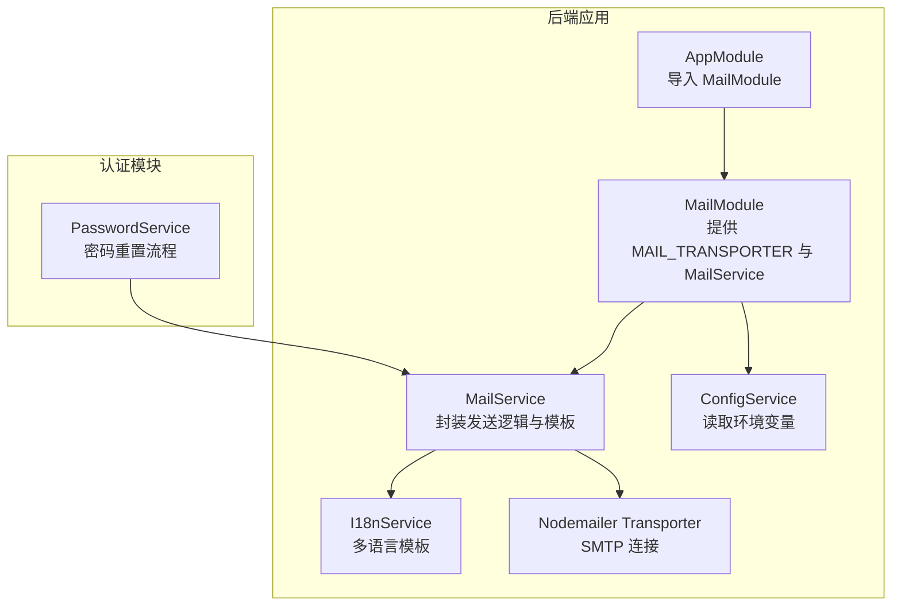
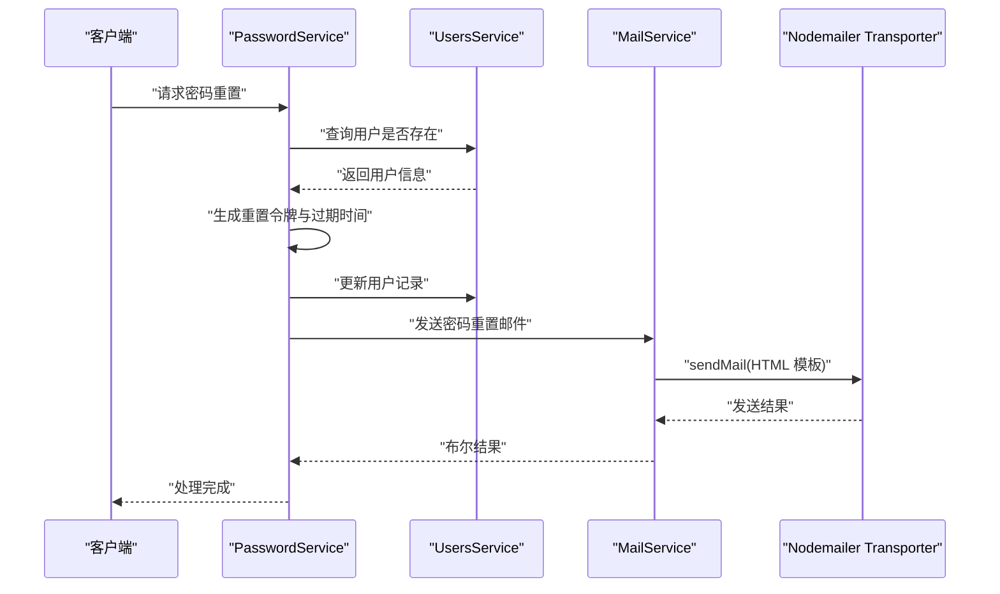
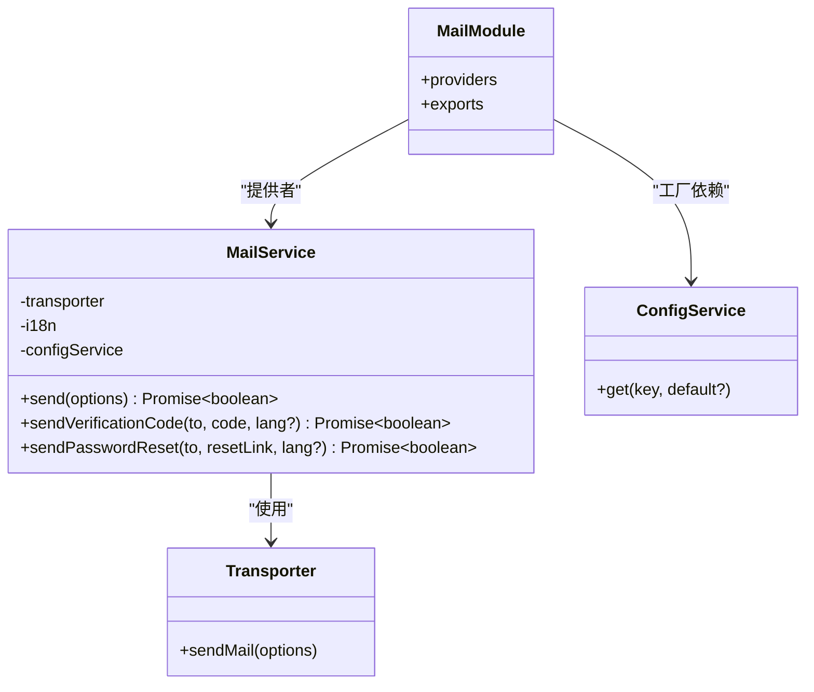
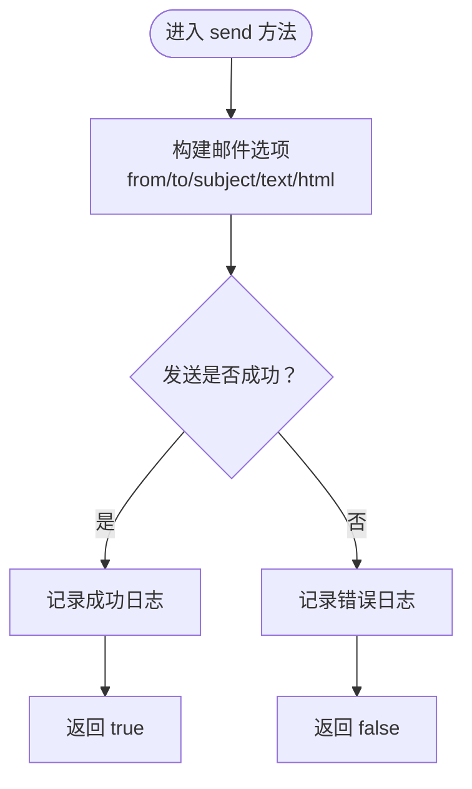
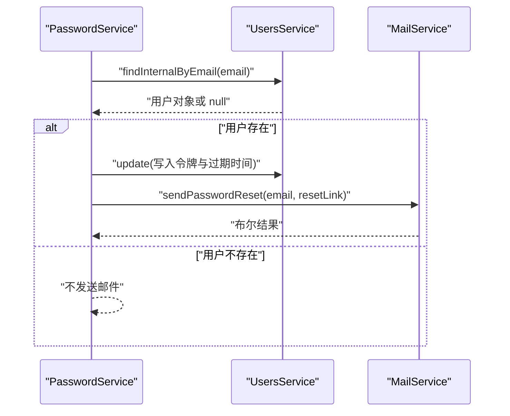
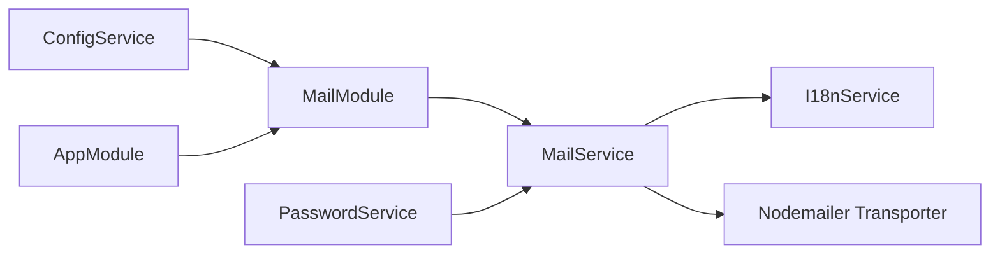

# 邮件服务集成

<cite>
**本文引用的文件**
- [apps/backend/src/mail/index.ts](file://apps/backend/src/mail/index.ts)
- [apps/backend/src/mail/mail.constants.ts](file://apps/backend/src/mail/mail.constants.ts)
- [apps/backend/src/mail/mail.module.ts](file://apps/backend/src/mail/mail.module.ts)
- [apps/backend/src/mail/mail.service.ts](file://apps/backend/src/mail/mail.service.ts)
- [apps/backend/src/i18n/en-US/mail.ts](file://apps/backend/src/i18n/en-US/mail.ts)
- [apps/backend/src/i18n/zh-CN/mail.ts](file://apps/backend/src/i18n/zh-CN/mail.ts)
- [apps/backend/src/auth/password.service.ts](file://apps/backend/src/auth/password.service.ts)
- [apps/backend/src/app.module.ts](file://apps/backend/src/app.module.ts)
- [apps/backend/src/main.ts](file://apps/backend/src/main.ts)
- [apps/backend/tests/mail/mail.module.spec.ts](file://apps/backend/tests/mail/mail.module.spec.ts)
- [apps/backend/tests/auth/password.service.spec.ts](file://apps/backend/tests/auth/password.service.spec.ts)
</cite>

## 目录
1. [简介](#简介)
2. [项目结构](#项目结构)
3. [核心组件](#核心组件)
4. [架构总览](#架构总览)
5. [详细组件分析](#详细组件分析)
6. [依赖关系分析](#依赖关系分析)
7. [性能考量](#性能考量)
8. [故障排除指南](#故障排除指南)
9. [结论](#结论)
10. [附录](#附录)

## 简介
本文件系统性阐述基于 Nodemailer 的邮件服务集成方案，涵盖 SMTP 配置、传输器工厂模式、邮件服务封装、依赖注入配置（MAIL_TRANSPORTER 提供者与动态配置加载）、最佳实践（错误处理、重试机制、邮件模板管理），以及在用户注册、密码重置与通知系统中的应用场景。文档同时提供配置示例、环境变量设置与安全注意事项，帮助开发者快速、安全地集成与维护邮件功能。

## 项目结构
邮件服务位于后端应用的独立模块中，通过工厂提供者按需创建 SMTP 传输器，并由 MailService 统一封装发送逻辑。国际化模块为邮件模板提供多语言支持。认证模块在密码重置流程中调用邮件服务。

**图表来源**
- [apps/backend/src/app.module.ts:154-154](file://apps/backend/src/app.module.ts#L154-L154)
- [apps/backend/src/mail/mail.module.ts:11-36](file://apps/backend/src/mail/mail.module.ts#L11-L36)
- [apps/backend/src/mail/mail.service.ts:18-26](file://apps/backend/src/mail/mail.service.ts#L18-L26)
- [apps/backend/src/auth/password.service.ts:16-16](file://apps/backend/src/auth/password.service.ts#L16-L16)

**章节来源**
- [apps/backend/src/app.module.ts:154-154](file://apps/backend/src/app.module.ts#L154-L154)
- [apps/backend/src/mail/mail.module.ts:1-37](file://apps/backend/src/mail/mail.module.ts#L1-L37)
- [apps/backend/src/mail/mail.service.ts:1-117](file://apps/backend/src/mail/mail.service.ts#L1-L117)

## 核心组件
- 邮件常量与导出
  - 定义注入令牌 MAIL_TRANSPORTER，用于标识 SMTP 传输器实例。
  - 通过 index.ts 统一导出常量、模块与服务，便于上层模块按需引入。
- 邮件模块
  - 使用工厂提供者创建 SMTP 传输器，读取环境变量进行动态配置。
  - 暴露 MailService，供其他模块注入使用。
- 邮件服务
  - 封装通用发送逻辑与两类常用模板：验证码邮件、密码重置邮件。
  - 支持多语言模板渲染，基于 I18nService 动态选择语言。
  - 统一错误处理与日志记录，返回布尔结果表示发送是否成功。

**章节来源**
- [apps/backend/src/mail/mail.constants.ts:1-2](file://apps/backend/src/mail/mail.constants.ts#L1-L2)
- [apps/backend/src/mail/index.ts:1-4](file://apps/backend/src/mail/index.ts#L1-L4)
- [apps/backend/src/mail/mail.module.ts:11-36](file://apps/backend/src/mail/mail.module.ts#L11-L36)
- [apps/backend/src/mail/mail.service.ts:18-117](file://apps/backend/src/mail/mail.service.ts#L18-L117)

## 架构总览
邮件服务采用“工厂提供者 + 服务封装”的架构设计：
- 工厂提供者按需创建 SMTP 传输器，避免在模块启动时即建立连接，降低资源占用。
- MailService 聚合发送逻辑与模板，屏蔽底层细节，便于业务模块调用。
- 国际化模块为邮件模板提供多语言支持，提升用户体验。
- 认证模块在密码重置流程中调用 MailService，完成邮件发送。

**图表来源**
- [apps/backend/src/auth/password.service.ts:39-61](file://apps/backend/src/auth/password.service.ts#L39-L61)
- [apps/backend/src/mail/mail.service.ts:88-115](file://apps/backend/src/mail/mail.service.ts#L88-L115)

## 详细组件分析

### 邮件模块（MailModule）
- 作用
  - 通过工厂提供者创建 SMTP 传输器，注入 ConfigService 读取环境变量。
  - 暴露 MailService，供其他模块使用。
- 关键点
  - 传输器选项：host、port、secure、auth（可选）。
  - 默认值：host 默认值、port 默认 587、secure 默认 false。
  - 当 user 和 pass 存在时才启用认证。
- 依赖注入
  - 提供者 MAIL_TRANSPORTER：工厂函数依赖 ConfigService。
  - 提供者 MailService：直接注入 MAIL_TRANSPORTER 实例。

**图表来源**
- [apps/backend/src/mail/mail.module.ts:11-36](file://apps/backend/src/mail/mail.module.ts#L11-L36)
- [apps/backend/src/mail/mail.service.ts:18-26](file://apps/backend/src/mail/mail.service.ts#L18-L26)

**章节来源**
- [apps/backend/src/mail/mail.module.ts:11-36](file://apps/backend/src/mail/mail.module.ts#L11-L36)

### 邮件服务（MailService）
- 作用
  - 封装通用发送逻辑，支持纯文本与 HTML 邮件。
  - 提供两类常用模板：验证码邮件、密码重置邮件。
  - 基于 I18nService 选择语言，实现多语言模板。
- 关键点
  - 发送方法：统一设置 from、to、subject、text/html，捕获异常并记录日志。
  - 验证码模板：标题、内容、验证码展示区、有效期说明。
  - 密码重置模板：标题、内容、重置按钮、有效期说明。
- 错误处理
  - try/catch 包裹发送过程；记录错误堆栈；返回布尔值表示成功与否。

**图表来源**
- [apps/backend/src/mail/mail.service.ts:43-60](file://apps/backend/src/mail/mail.service.ts#L43-L60)

**章节来源**
- [apps/backend/src/mail/mail.service.ts:18-117](file://apps/backend/src/mail/mail.service.ts#L18-L117)

### 国际化模板（I18n）
- 作用
  - 为验证码与密码重置邮件提供多语言文案。
- 结构
  - 英文与中文两个版本，分别定义主题、标题、正文、按钮、有效期等键值。
- 使用方式
  - MailService 在发送模板邮件时，通过 I18nService.t 获取对应语言的文案。

**章节来源**
- [apps/backend/src/i18n/en-US/mail.ts:1-16](file://apps/backend/src/i18n/en-US/mail.ts#L1-L16)
- [apps/backend/src/i18n/zh-CN/mail.ts:1-15](file://apps/backend/src/i18n/zh-CN/mail.ts#L1-L15)

### 认证模块中的应用（PasswordService）
- 作用
  - 在密码重置流程中调用 MailService 发送重置邮件。
- 流程
  - 查询用户是否存在（防枚举）。
  - 生成令牌与过期时间，更新用户记录。
  - 拼接前端重置链接，调用 MailService 发送邮件。
- 测试验证
  - 单元测试覆盖了存在用户与不存在用户的两种场景，确保发送行为符合预期。

**图表来源**
- [apps/backend/src/auth/password.service.ts:39-61](file://apps/backend/src/auth/password.service.ts#L39-L61)
- [apps/backend/tests/auth/password.service.spec.ts:60-91](file://apps/backend/tests/auth/password.service.spec.ts#L60-L91)

**章节来源**
- [apps/backend/src/auth/password.service.ts:1-100](file://apps/backend/src/auth/password.service.ts#L1-L100)
- [apps/backend/tests/auth/password.service.spec.ts:1-122](file://apps/backend/tests/auth/password.service.spec.ts#L1-L122)

## 依赖关系分析
- MailModule 依赖 ConfigService 读取 SMTP 配置，通过工厂提供者创建 Transporter。
- MailService 注入 MAIL_TRANSPORTER、I18nService 与 ConfigService，负责发送与模板渲染。
- AppModule 导入 MailModule，使邮件服务在整个应用中可用。
- PasswordService 注入 MailService，在密码重置流程中触发邮件发送。

**图表来源**
- [apps/backend/src/mail/mail.module.ts:11-36](file://apps/backend/src/mail/mail.module.ts#L11-L36)
- [apps/backend/src/mail/mail.service.ts:18-26](file://apps/backend/src/mail/mail.service.ts#L18-L26)
- [apps/backend/src/app.module.ts:154-154](file://apps/backend/src/app.module.ts#L154-L154)
- [apps/backend/src/auth/password.service.ts:16-16](file://apps/backend/src/auth/password.service.ts#L16-L16)

**章节来源**
- [apps/backend/src/mail/mail.module.ts:1-37](file://apps/backend/src/mail/mail.module.ts#L1-L37)
- [apps/backend/src/mail/mail.service.ts:1-117](file://apps/backend/src/mail/mail.service.ts#L1-L117)
- [apps/backend/src/app.module.ts:154-154](file://apps/backend/src/app.module.ts#L154-L154)
- [apps/backend/src/auth/password.service.ts:1-100](file://apps/backend/src/auth/password.service.ts#L1-L100)

## 性能考量
- 传输器复用
  - 通过工厂提供者创建的 Transporter 可被多次复用，避免重复初始化带来的开销。
- 异步发送
  - 发送过程为异步，建议在业务流程中非阻塞调用，必要时结合队列或后台任务处理。
- 模板渲染
  - 多语言模板通过 I18nService 渲染，注意语言切换成本与缓存策略（如需优化可考虑预热常用语言包）。
- 资源释放
  - 传输器生命周期由 NestJS DI 管理，无需手动关闭；若自定义长连接，需遵循 SMTP 服务器的连接池策略。

## 故障排除指南
- 发送失败
  - 现象：返回 false 并记录错误日志。
  - 排查：检查 SMTP 配置（host、port、secure、auth）、网络连通性、凭据有效性。
- 无日志输出
  - 现象：无法定位问题。
  - 排查：确认日志模块已正确初始化，检查日志级别与输出目标。
- 语言模板未生效
  - 现象：邮件文案未按预期语言显示。
  - 排查：确认 I18nService 的语言解析链（请求头、Accept-Language 等）与本地化文件路径。
- 密码重置未发送
  - 现象：用户存在但未收到邮件。
  - 排查：确认用户存在性校验、令牌生成与过期时间、前端重置链接拼接、MailService 调用链路。

**章节来源**
- [apps/backend/src/mail/mail.service.ts:55-59](file://apps/backend/src/mail/mail.service.ts#L55-L59)
- [apps/backend/src/auth/password.service.ts:39-61](file://apps/backend/src/auth/password.service.ts#L39-L61)

## 结论
该邮件服务集成以 Nodemailer 为基础，采用工厂提供者与服务封装相结合的设计，实现了 SMTP 配置的动态加载、多语言模板渲染与统一错误处理。通过在认证模块中的密码重置流程应用，展示了邮件服务在实际业务中的典型场景。建议在生产环境中配合队列、重试与监控体系，进一步提升可靠性与可观测性。

## 附录

### 环境变量与配置示例
- SMTP 基础配置
  - MAIL_HOST：SMTP 主机地址（默认值：示例域名）
  - MAIL_PORT：SMTP 端口（默认值：587）
  - MAIL_SECURE：是否启用 TLS（字符串形式的布尔值，默认：false）
  - MAIL_USER：SMTP 用户名（可选）
  - MAIL_PASSWORD：SMTP 密码（可选）
- 发件人配置
  - MAIL_FROM：发件人地址与名称（默认值：示例地址）
- 其他相关配置
  - FRONTEND_URL：前端重置链接基础地址（用于拼接重置链接）
  - RESET_PASSWORD_EXPIRES_IN：重置令牌有效期（秒）

**章节来源**
- [apps/backend/src/mail/mail.module.ts:16-27](file://apps/backend/src/mail/mail.module.ts#L16-L27)
- [apps/backend/src/mail/mail.service.ts:46-46](file://apps/backend/src/mail/mail.service.ts#L46-L46)
- [apps/backend/src/auth/password.service.ts:57-58](file://apps/backend/src/auth/password.service.ts#L57-L58)

### 依赖注入与工厂提供者
- 提供者 MAIL_TRANSPORTER
  - 类型：工厂提供者
  - 依赖：ConfigService
  - 行为：根据环境变量动态创建 SMTP 传输器实例
- 提供者 MailService
  - 类型：类提供者
  - 依赖：MAIL_TRANSPORTER、I18nService、ConfigService
  - 行为：封装发送逻辑与模板

**章节来源**
- [apps/backend/src/mail/mail.module.ts:12-34](file://apps/backend/src/mail/mail.module.ts#L12-L34)
- [apps/backend/src/mail/mail.service.ts:22-26](file://apps/backend/src/mail/mail.service.ts#L22-L26)

### 安全注意事项
- 凭据保护
  - 使用环境变量存储 MAIL_USER 与 MAIL_PASSWORD，避免硬编码。
- 端口与加密
  - 正确设置 MAIL_PORT 与 MAIL_SECURE，确保传输安全。
- 防枚举攻击
  - 密码重置流程对不存在的用户不发送邮件，避免泄露用户信息。
- 日志与审计
  - 记录发送结果与错误信息，但避免在日志中打印敏感字段。

**章节来源**
- [apps/backend/src/auth/password.service.ts:42-45](file://apps/backend/src/auth/password.service.ts#L42-L45)
- [apps/backend/src/mail/mail.module.ts:17-27](file://apps/backend/src/mail/mail.module.ts#L17-L27)

### 应用场景
- 用户注册
  - 可扩展：在用户注册成功后，调用 MailService 发送欢迎邮件或账户确认邮件。
- 密码重置
  - 已实现：在 PasswordService 中完成令牌生成、过期时间设置与邮件发送。
- 通知系统
  - 可扩展：通过 MailService 的通用发送方法与模板能力，实现各类通知邮件。

**章节来源**
- [apps/backend/src/auth/password.service.ts:39-61](file://apps/backend/src/auth/password.service.ts#L39-L61)
- [apps/backend/src/mail/mail.service.ts:65-115](file://apps/backend/src/mail/mail.service.ts#L65-L115)