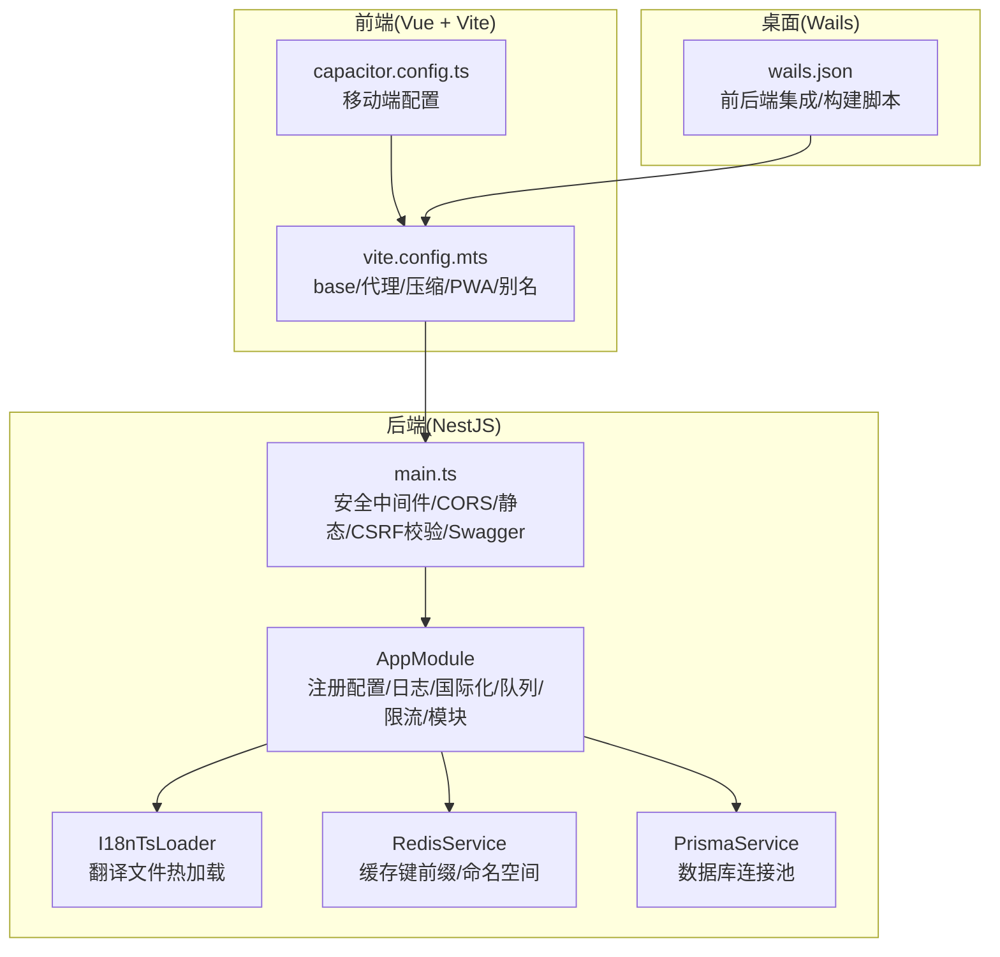
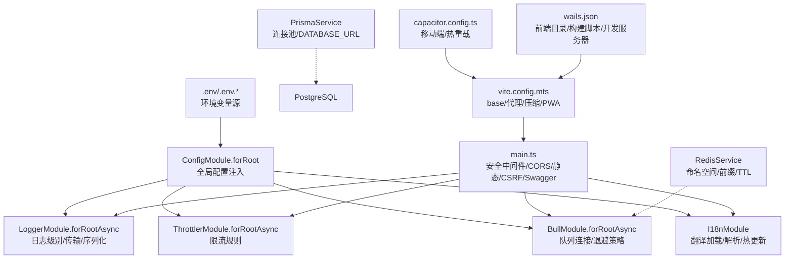
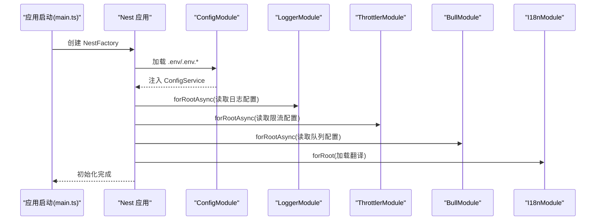
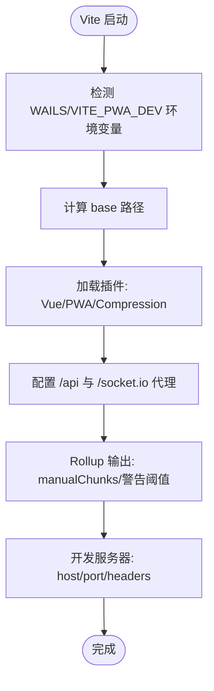
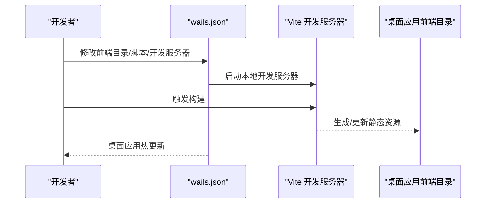
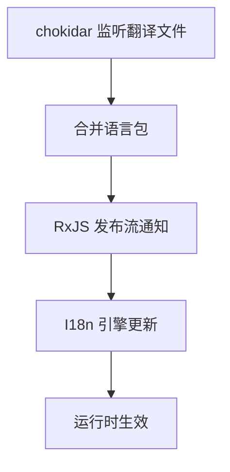
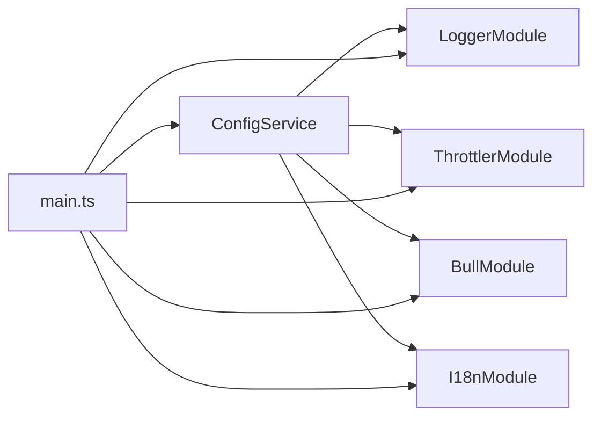

# 配置系统扩展

<cite>
**本文引用的文件**
- [apps/backend/src/app.module.ts](file://apps/backend/src/app.module.ts)
- [apps/backend/src/main.ts](file://apps/backend/src/main.ts)
- [apps/backend/src/i18n/i18n-ts.loader.ts](file://apps/backend/src/i18n/i18n-ts.loader.ts)
- [apps/backend/src/redis/redis.service.ts](file://apps/backend/src/redis/redis.service.ts)
- [apps/backend/src/prisma/prisma.service.ts](file://apps/backend/src/prisma/prisma.service.ts)
- [apps/backend/nest-cli.json](file://apps/backend/nest-cli.json)
- [apps/backend/package.json](file://apps/backend/package.json)
- [apps/backend/tsconfig.json](file://apps/backend/tsconfig.json)
- [apps/frontend/vite.config.mts](file://apps/frontend/vite.config.mts)
- [apps/frontend/capacitor.config.ts](file://apps/frontend/capacitor.config.ts)
- [apps/frontend/package.json](file://apps/frontend/package.json)
- [apps/frontend/tsconfig.json](file://apps/frontend/tsconfig.json)
- [apps/wails/wails.json](file://apps/wails/wails.json)
- [apps/backend/src/common/types.ts](file://apps/backend/src/common/types.ts)
</cite>

## 目录
1. [简介](#简介)
2. [项目结构](#项目结构)
3. [核心组件](#核心组件)
4. [架构总览](#架构总览)
5. [详细组件分析](#详细组件分析)
6. [依赖分析](#依赖分析)
7. [性能考虑](#性能考虑)
8. [故障排查指南](#故障排查指南)
9. [结论](#结论)
10. [附录](#附录)

## 简介
本指南面向 Lumina Todo 的配置系统扩展开发，围绕多环境配置管理、NestJS 配置扩展与自定义配置提供者、Vite 构建配置扩展与插件开发、Wails 桌面应用配置与原生集成、环境变量与配置验证、配置热重载与运行时修改、安全存储与敏感信息保护、以及配置迁移与版本兼容性等方面进行系统化说明。文档以仓库现有实现为依据，结合代码级图示帮助读者快速理解与扩展。

## 项目结构
Lumina Todo 采用多应用工作区布局，包含后端 NestJS 应用、前端 Vue 应用（含 Capacitor 移动与 PWA）、以及 Wails 桌面应用。配置相关的关键位置如下：
- 后端配置：NestJS 根模块集中注册配置模块、日志、国际化、队列、限流、数据库与缓存等；主入口负责安全中间件、CORS、静态资源、Swagger 文档与优雅停机。
- 前端配置：Vite 配置按环境动态决定 base、代理、压缩与 PWA 行为；Capacitor 配置控制移动端行为与启动页。
- Wails 配置：wails.json 统一前后端集成参数，如前端目录、安装命令、构建脚本、开发服务器地址等。

**图表来源**
- [apps/backend/src/app.module.ts:27-175](file://apps/backend/src/app.module.ts#L27-L175)
- [apps/backend/src/main.ts:34-195](file://apps/backend/src/main.ts#L34-L195)
- [apps/backend/src/i18n/i18n-ts.loader.ts:86-184](file://apps/backend/src/i18n/i18n-ts.loader.ts#L86-L184)
- [apps/backend/src/redis/redis.service.ts:51-233](file://apps/backend/src/redis/redis.service.ts#L51-L233)
- [apps/backend/src/prisma/prisma.service.ts:6-34](file://apps/backend/src/prisma/prisma.service.ts#L6-L34)
- [apps/frontend/vite.config.mts:80-184](file://apps/frontend/vite.config.mts#L80-L184)
- [apps/frontend/capacitor.config.ts:3-22](file://apps/frontend/capacitor.config.ts#L3-L22)
- [apps/wails/wails.json:1-22](file://apps/wails/wails.json#L1-L22)

**章节来源**
- [apps/backend/src/app.module.ts:27-175](file://apps/backend/src/app.module.ts#L27-L175)
- [apps/backend/src/main.ts:34-195](file://apps/backend/src/main.ts#L34-L195)
- [apps/frontend/vite.config.mts:80-184](file://apps/frontend/vite.config.mts#L80-L184)
- [apps/frontend/capacitor.config.ts:3-22](file://apps/frontend/capacitor.config.ts#L3-L22)
- [apps/wails/wails.json:1-22](file://apps/wails/wails.json#L1-L22)

## 核心组件
- NestJS 配置模块与全局配置注入
  - 根模块通过全局配置模块加载环境变量，并将配置注入到日志、队列、限流等模块工厂中，形成“配置即服务”的模式。
  - 主入口读取环境变量控制 CORS、静态资源、安全头、CSRF 校验、压缩、多部分上传大小等。
- 国际化热加载
  - 自定义 I18nTsLoader 基于 chokidar 监听翻译文件变化，合并语言包并提供可观测的热更新能力。
- 缓存与命名空间
  - RedisService 提供统一缓存接口、键前缀与命名空间封装，便于按域隔离与 TTL 管理。
- 数据库连接
  - PrismaService 基于 DATABASE_URL 创建连接池，确保连接生命周期与优雅停机。
- 前端构建与代理
  - Vite 配置按 WAILS 环境变量切换 base 与 PWA 开关，支持代理后端 API 与 WebSocket。
- 桌面集成
  - wails.json 统一前端目录、安装与构建命令，以及开发服务器地址，支撑桌面应用的原生集成。

**章节来源**
- [apps/backend/src/app.module.ts:27-175](file://apps/backend/src/app.module.ts#L27-L175)
- [apps/backend/src/main.ts:34-195](file://apps/backend/src/main.ts#L34-L195)
- [apps/backend/src/i18n/i18n-ts.loader.ts:86-184](file://apps/backend/src/i18n/i18n-ts.loader.ts#L86-L184)
- [apps/backend/src/redis/redis.service.ts:51-233](file://apps/backend/src/redis/redis.service.ts#L51-L233)
- [apps/backend/src/prisma/prisma.service.ts:6-34](file://apps/backend/src/prisma/prisma.service.ts#L6-L34)
- [apps/frontend/vite.config.mts:80-184](file://apps/frontend/vite.config.mts#L80-L184)
- [apps/wails/wails.json:1-22](file://apps/wails/wails.json#L1-L22)

## 架构总览
下图展示配置在各层的落地方式与交互关系：

**图表来源**
- [apps/backend/src/app.module.ts:30-148](file://apps/backend/src/app.module.ts#L30-L148)
- [apps/backend/src/main.ts:48-180](file://apps/backend/src/main.ts#L48-L180)
- [apps/backend/src/i18n/i18n-ts.loader.ts:86-184](file://apps/backend/src/i18n/i18n-ts.loader.ts#L86-L184)
- [apps/backend/src/redis/redis.service.ts:51-233](file://apps/backend/src/redis/redis.service.ts#L51-L233)
- [apps/backend/src/prisma/prisma.service.ts:6-34](file://apps/backend/src/prisma/prisma.service.ts#L6-L34)
- [apps/frontend/vite.config.mts:80-184](file://apps/frontend/vite.config.mts#L80-L184)
- [apps/frontend/capacitor.config.ts:3-22](file://apps/frontend/capacitor.config.ts#L3-L22)
- [apps/wails/wails.json:1-22](file://apps/wails/wails.json#L1-L22)

## 详细组件分析

### NestJS 配置扩展与自定义配置提供者
- 全局配置模块
  - 通过根模块注册全局配置模块，加载多级 .env 文件，使后续模块可通过 ConfigService 获取配置。
- 日志模块工厂注入
  - LoggerModule.forRootAsync 从 ConfigService 读取日志级别、传输器（生产/开发）、自定义日志格式与级别映射。
- 队列模块工厂注入
  - BullModule.forRootAsync 从 ConfigService 读取 Redis 连接参数与作业默认策略（完成/失败清理、重试次数、指数退避）。
- 限流模块工厂注入
  - ThrottlerModule.forRootAsync 从 ConfigService 读取短/中/长期限流阈值与窗口，形成多粒度防护。
- 国际化模块
  - I18nModule.forRoot 配合自定义 I18nTsLoader，递归扫描语言目录，合并同名键，支持热更新。

**图表来源**
- [apps/backend/src/app.module.ts:30-148](file://apps/backend/src/app.module.ts#L30-L148)
- [apps/backend/src/main.ts:34-195](file://apps/backend/src/main.ts#L34-L195)

**章节来源**
- [apps/backend/src/app.module.ts:27-175](file://apps/backend/src/app.module.ts#L27-L175)
- [apps/backend/src/main.ts:34-195](file://apps/backend/src/main.ts#L34-L195)

### Vite 构建工具的配置扩展与插件开发
- 动态 base 与 Wails 模式
  - 通过 WAILS 环境变量决定 base 路径（相对路径用于桌面），生产环境可由 VITE_BASE_URL 控制。
- 代理与长连接
  - 配置 /api 与 /socket.io 代理至后端，设置超时与 WebSocket 支持，适配开发调试场景。
- 压缩与 PWA
  - 同时启用 gzip 与 Brotli 压缩；PWA 插件支持自动更新与开发模式开关。
- 代码分割与别名
  - 基于手动分包策略拆分常用库，提升缓存命中率；配置 @ 与共享包别名，统一路径解析。
- 移动端与权限策略
  - 服务器头设置 Permissions-Policy；Capacitor 配置支持热重载与启动页。

**图表来源**
- [apps/frontend/vite.config.mts:80-184](file://apps/frontend/vite.config.mts#L80-L184)
- [apps/frontend/capacitor.config.ts:3-22](file://apps/frontend/capacitor.config.ts#L3-L22)

**章节来源**
- [apps/frontend/vite.config.mts:80-184](file://apps/frontend/vite.config.mts#L80-L184)
- [apps/frontend/capacitor.config.ts:3-22](file://apps/frontend/capacitor.config.ts#L3-L22)

### Wails 桌面应用的配置管理与原生集成
- 前后端目录与脚本
  - 前端目录指向 apps/frontend；安装与构建脚本通过 npm 脚本桥接；开发服务器地址指向本地 Vite。
- 构建产物同步
  - 前端构建完成后复制到 wails 前端目录，保证桌面应用可直接加载。
- 开发体验
  - 开发模式下监听前端变更并热更新，降低迭代成本。

**图表来源**
- [apps/wails/wails.json:1-22](file://apps/wails/wails.json#L1-L22)

**章节来源**
- [apps/wails/wails.json:1-22](file://apps/wails/wails.json#L1-L22)

### 环境变量管理与配置验证
- 环境变量加载
  - 后端通过 ConfigModule.forRoot 加载 .env 与根目录 .env，主入口读取 CORS、静态资源、上传限制等关键变量。
- 配置验证建议
  - 在工厂函数中对关键配置进行类型与范围校验，失败时抛出明确错误，避免运行期异常。
  - 对必填项（如 DATABASE_URL、REDIS_*）进行存在性检查与格式校验。
- 类型安全
  - 结合 TypeScript 与共享包导出的类型，确保配置键与取值的类型一致性。

**章节来源**
- [apps/backend/src/app.module.ts:30-148](file://apps/backend/src/app.module.ts#L30-L148)
- [apps/backend/src/main.ts:48-113](file://apps/backend/src/main.ts#L48-L113)
- [apps/backend/src/prisma/prisma.service.ts:10-15](file://apps/backend/src/prisma/prisma.service.ts#L10-L15)

### 配置的热重载与运行时修改机制
- 国际化热重载
  - I18nTsLoader 基于 chokidar 监听翻译文件变化，合并语言包并通过 RxJS 流推送更新，实现无需重启的服务热更。
- 缓存与配置键
  - RedisService 提供命名空间与 TTL 管理，可在运行时刷新特定配置键的缓存，配合后台任务定期回写。
- 前端热重载
  - Vite 开发服务器与 Capacitor 热重载配合，实现界面与逻辑的即时反馈。

**图表来源**
- [apps/backend/src/i18n/i18n-ts.loader.ts:104-144](file://apps/backend/src/i18n/i18n-ts.loader.ts#L104-L144)

**章节来源**
- [apps/backend/src/i18n/i18n-ts.loader.ts:86-184](file://apps/backend/src/i18n/i18n-ts.loader.ts#L86-L184)
- [apps/backend/src/redis/redis.service.ts:146-186](file://apps/backend/src/redis/redis.service.ts#L146-L186)

### 配置的安全存储与敏感信息保护
- 环境变量隔离
  - 敏感信息（数据库、Redis、邮件、第三方密钥）通过 .env 存储，避免硬编码与提交到版本库。
- 安全中间件
  - 主入口启用 Helmet、Gzip 压缩、Cookie、CSRF 校验与权限策略头，降低常见攻击面。
- 传输加密
  - 建议在生产环境强制 HTTPS 与安全 Cookie，WebSocket 使用 wss。
- 访问控制
  - 严格限制 CORS 与 Allowed-Headers，仅暴露必要端点。

**章节来源**
- [apps/backend/src/main.ts:84-121](file://apps/backend/src/main.ts#L84-L121)
- [apps/backend/src/prisma/prisma.service.ts:10-15](file://apps/backend/src/prisma/prisma.service.ts#L10-L15)

### 配置迁移与版本兼容性
- 版本化配置
  - 通过 package.json 的版本号与 Swagger 文档版本保持一致，便于客户端与文档同步升级。
- 渐进式迁移
  - 新增配置项时保留默认值与兼容逻辑，逐步替换旧键；对不兼容变更提供迁移脚本与降级策略。
- 文档与契约
  - 使用 Swagger/OpenAPI 生成文档，约束配置变更对客户端的影响范围。

**章节来源**
- [apps/backend/src/main.ts:171-180](file://apps/backend/src/main.ts#L171-L180)
- [apps/backend/package.json:1-108](file://apps/backend/package.json#L1-L108)

## 依赖分析
- 后端依赖
  - NestJS 配置、日志、国际化、队列、限流、Prisma、Redis 等模块均通过 ConfigService 注入，耦合集中在根模块与工厂函数。
- 前端依赖
  - Vite 插件链路清晰，代理与 PWA 与后端服务强关联；Capacitor 与 Wails 通过配置文件解耦。
- 耦合与内聚
  - 配置读取集中在主入口与根模块，其他模块通过依赖注入获取所需配置，内聚性良好，便于扩展。

**图表来源**
- [apps/backend/src/app.module.ts:30-148](file://apps/backend/src/app.module.ts#L30-L148)
- [apps/backend/src/main.ts:34-195](file://apps/backend/src/main.ts#L34-L195)

**章节来源**
- [apps/backend/src/app.module.ts:27-175](file://apps/backend/src/app.module.ts#L27-L175)
- [apps/backend/src/main.ts:34-195](file://apps/backend/src/main.ts#L34-L195)

## 性能考虑
- 日志与网络
  - 生产环境使用 JSON 日志与压缩传输；开发环境使用 pino-pretty 提升可观测性。
- 缓存与队列
  - Redis 命名空间与 TTL 策略减少键冲突与内存占用；队列退避与失败保留便于排障。
- 构建优化
  - 手动分包与压缩显著降低首屏体积；代理超时与 WebSocket 支持提升开发体验。

**章节来源**
- [apps/backend/src/app.module.ts:35-115](file://apps/backend/src/app.module.ts#L35-L115)
- [apps/frontend/vite.config.mts:175-182](file://apps/frontend/vite.config.mts#L175-L182)

## 故障排查指南
- 启动失败
  - 检查 DATABASE_URL 是否存在；确认端口占用与容器网络绑定（0.0.0.0）。
- 国际化不生效
  - 确认翻译文件扩展名与命名规范；检查 chokidar 监听是否正常；查看合并逻辑与键冲突。
- 缓存异常
  - 检查命名空间前缀与 TTL；确认底层 cache-manager 连接状态；排查并发写入导致的覆盖。
- 前端代理失效
  - 核对 VITE_PROXY_TARGET 与后端端口；确认 WebSocket 代理与超时设置。
- 桌面应用无法热更新
  - 检查 wails.json 的开发服务器地址与前端脚本；确认构建产物复制流程。

**章节来源**
- [apps/backend/src/prisma/prisma.service.ts:10-15](file://apps/backend/src/prisma/prisma.service.ts#L10-L15)
- [apps/backend/src/i18n/i18n-ts.loader.ts:146-156](file://apps/backend/src/i18n/i18n-ts.loader.ts#L146-L156)
- [apps/backend/src/redis/redis.service.ts:58-74](file://apps/backend/src/redis/redis.service.ts#L58-L74)
- [apps/frontend/vite.config.mts:157-170](file://apps/frontend/vite.config.mts#L157-L170)
- [apps/wails/wails.json:7-9](file://apps/wails/wails.json#L7-L9)

## 结论
Lumina Todo 的配置体系以 NestJS ConfigModule 为核心，结合工厂注入与自定义加载器，实现了多环境、可热更、可扩展的配置管理。前端通过 Vite 插件链路与 Capacitor/Wails 集成，提供了良好的开发与部署体验。建议在新增配置时遵循“最小可用”原则，配合类型校验与文档契约，确保系统的稳定性与演进效率。

## 附录
- 关键配置键与来源
  - 后端：NODE_ENV、LOG_LEVEL、REDIS_HOST/PORT/PASSWORD、THROTTLE_*、CORS_ORIGIN、UPLOAD_MAX_SIZE/UPLOAD_MAX_FILES、DATABASE_URL、PORT、VITE_PROXY_TARGET。
  - 前端：VITE_BASE_URL、VITE_PWA_DEV、WAILS、VITE_PROXY_TARGET。
  - 桌面：wails.json 中的前端目录、安装与构建脚本、开发服务器地址。

**章节来源**
- [apps/backend/src/app.module.ts:30-148](file://apps/backend/src/app.module.ts#L30-L148)
- [apps/backend/src/main.ts:48-113](file://apps/backend/src/main.ts#L48-L113)
- [apps/frontend/vite.config.mts:15-21](file://apps/frontend/vite.config.mts#L15-L21)
- [apps/wails/wails.json:5-9](file://apps/wails/wails.json#L5-L9)