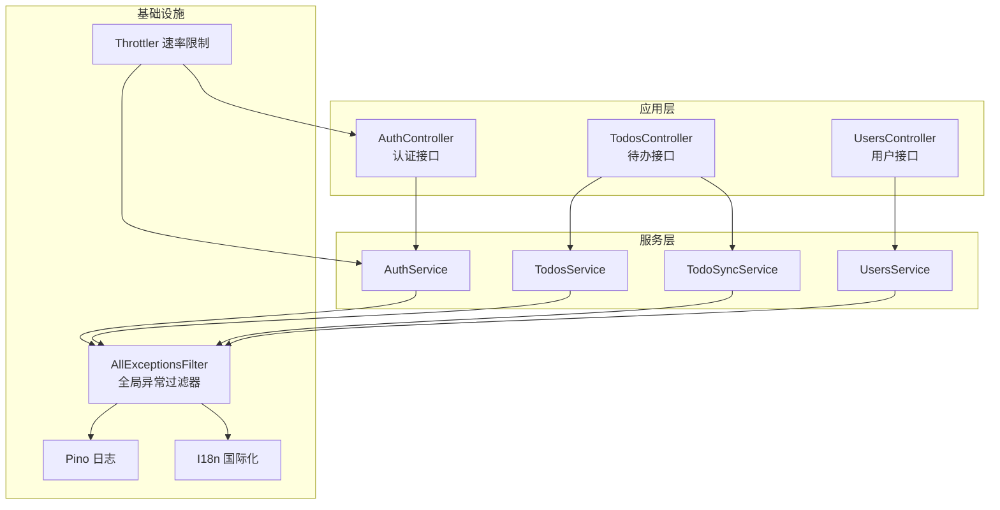
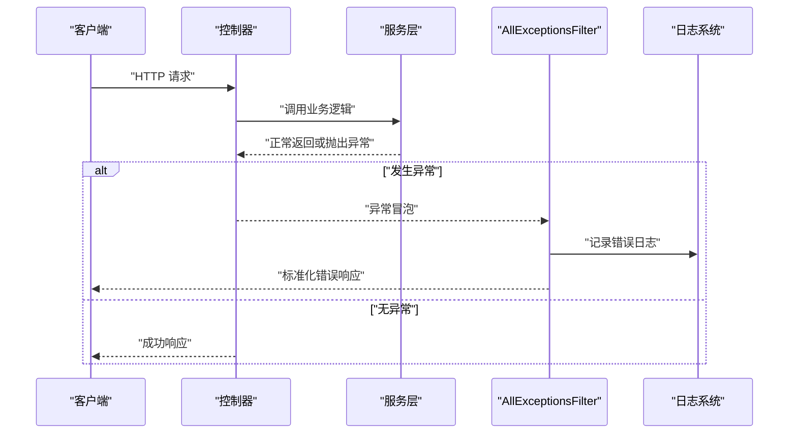
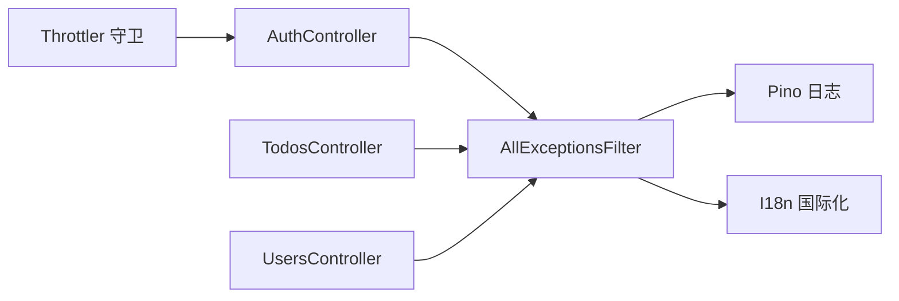
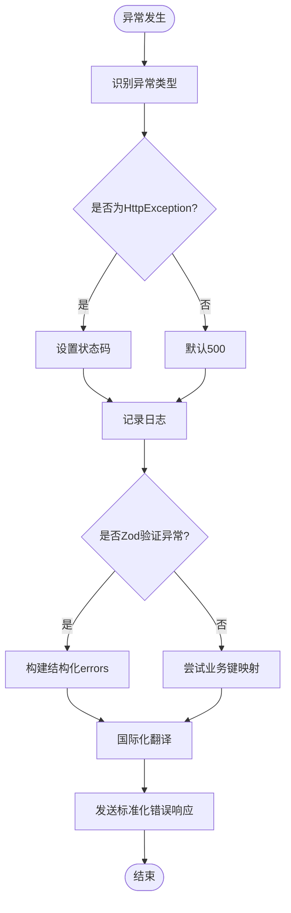

# API错误

<cite>
**本文引用的文件**
- [apps/backend/src/common/filters/all-exceptions.filter.ts](file://apps/backend/src/common/filters/all-exceptions.filter.ts)
- [apps/backend/src/app.module.ts](file://apps/backend/src/app.module.ts)
- [apps/backend/src/auth/auth.controller.ts](file://apps/backend/src/auth/auth.controller.ts)
- [apps/backend/src/todos/todos.controller.ts](file://apps/backend/src/todos/todos.controller.ts)
- [apps/backend/src/users/users.controller.ts](file://apps/backend/src/users/users.controller.ts)
- [apps/backend/src/auth/auth.dto.ts](file://apps/backend/src/auth/auth.dto.ts)
- [apps/backend/src/todos/todos.dto.ts](file://apps/backend/src/todos/todos.dto.ts)
- [apps/backend/src/common/types.ts](file://apps/backend/src/common/types.ts)
- [apps/backend/tests/common/filters/all-exceptions.filter.spec.ts](file://apps/backend/tests/common/filters/all-exceptions.filter.spec.ts)
- [apps/backend/tests/e2e/auth.e2e.spec.ts](file://apps/backend/tests/e2e/auth.e2e.spec.ts)
</cite>

## 目录
1. [简介](#简介)
2. [项目结构](#项目结构)
3. [核心组件](#核心组件)
4. [架构总览](#架构总览)
5. [详细组件分析](#详细组件分析)
6. [依赖关系分析](#依赖关系分析)
7. [性能考量](#性能考量)
8. [故障排除指南](#故障排除指南)
9. [结论](#结论)
10. [附录](#附录)

## 简介
本指南面向Lumina Todo后端API使用者与维护者，聚焦于API错误的诊断与修复。内容涵盖：
- HTTP状态码含义与4xx/5xx区分
- 错误响应统一格式与字段说明
- 全局异常过滤器工作原理与错误码分类
- 常见错误场景与快速修复方案
- 调试工具与日志解读技巧
- 请求/响应分析与最佳实践

## 项目结构
后端采用NestJS框架，错误处理通过全局异常过滤器集中处理，并结合国际化、日志与速率限制等机制，确保错误响应一致、可追踪、可理解。

图表来源
- [apps/backend/src/auth/auth.controller.ts:15-81](file://apps/backend/src/auth/auth.controller.ts#L15-L81)
- [apps/backend/src/todos/todos.controller.ts:20-70](file://apps/backend/src/todos/todos.controller.ts#L20-L70)
- [apps/backend/src/users/users.controller.ts:22-135](file://apps/backend/src/users/users.controller.ts#L22-L135)
- [apps/backend/src/common/filters/all-exceptions.filter.ts:12-137](file://apps/backend/src/common/filters/all-exceptions.filter.ts#L12-L137)
- [apps/backend/src/app.module.ts:147-153](file://apps/backend/src/app.module.ts#L147-L153)

章节来源
- [apps/backend/src/app.module.ts:1-160](file://apps/backend/src/app.module.ts#L1-L160)

## 核心组件
- 全局异常过滤器：统一捕获未处理异常，输出标准化错误响应，记录错误日志，支持Zod验证错误与业务异常字段映射。
- 控制器层：各模块控制器负责路由与鉴权守卫，调用对应服务执行业务逻辑。
- DTO与验证：基于Zod的DTO在进入控制器前完成参数校验，异常由过滤器统一处理。
- 国际化与日志：错误消息可按语言环境翻译；日志模块按状态码级别输出，便于问题定位。

章节来源
- [apps/backend/src/common/filters/all-exceptions.filter.ts:12-137](file://apps/backend/src/common/filters/all-exceptions.filter.ts#L12-L137)
- [apps/backend/src/auth/auth.controller.ts:15-81](file://apps/backend/src/auth/auth.controller.ts#L15-L81)
- [apps/backend/src/todos/todos.controller.ts:20-70](file://apps/backend/src/todos/todos.controller.ts#L20-L70)
- [apps/backend/src/users/users.controller.ts:22-135](file://apps/backend/src/users/users.controller.ts#L22-L135)
- [apps/backend/src/auth/auth.dto.ts:1-41](file://apps/backend/src/auth/auth.dto.ts#L1-L41)
- [apps/backend/src/todos/todos.dto.ts:1-5](file://apps/backend/src/todos/todos.dto.ts#L1-L5)
- [apps/backend/src/app.module.ts:118-133](file://apps/backend/src/app.module.ts#L118-L133)

## 架构总览
下图展示从请求到错误响应的关键路径，以及全局异常过滤器如何介入统一处理。

图表来源
- [apps/backend/src/common/filters/all-exceptions.filter.ts:27-135](file://apps/backend/src/common/filters/all-exceptions.filter.ts#L27-L135)
- [apps/backend/src/auth/auth.controller.ts:23-79](file://apps/backend/src/auth/auth.controller.ts#L23-L79)
- [apps/backend/src/todos/todos.controller.ts:30-68](file://apps/backend/src/todos/todos.controller.ts#L30-L68)
- [apps/backend/src/users/users.controller.ts:59-111](file://apps/backend/src/users/users.controller.ts#L59-L111)

## 详细组件分析

### 全局异常过滤器（AllExceptionsFilter）
- 功能要点
  - 统一捕获所有未处理异常，区分HTTP异常与未知错误，设置相应状态码。
  - 记录请求方法、URL、状态码与错误堆栈，便于审计与排障。
  - 处理Zod验证错误：提取每个字段的问题，进行国际化翻译，生成结构化errors对象。
  - 处理业务异常（如冲突）：尝试将消息映射到具体字段，提升前端可读性。
  - 国际化消息：对包含点号的消息键进行翻译，否则保持原样。
  - 输出统一错误响应：包含success、data、message、errors、statusCode、timestamp。

- 错误码分类
  - 4xx客户端错误：主要来自HttpException（如400、401、403、404、409、429等）。
  - 5xx服务器错误：默认未知错误映射为500。
  - 特殊处理：Zod验证错误强制为400；部分业务异常（如冲突）按实际状态码返回。

- 错误响应字段
  - success：布尔值，始终为false。
  - data：始终为null。
  - message：字符串，错误描述或国际化键。
  - errors：可选对象，结构化字段级错误，键为字段路径，值为对应错误消息。
  - statusCode：数字，HTTP状态码。
  - timestamp：字符串，ISO时间戳。

- 国际化与字段映射
  - 字段名可被翻译为本地化显示名。
  - 业务消息键（如auth.*）会被映射到具体字段，便于前端聚焦。

章节来源
- [apps/backend/src/common/filters/all-exceptions.filter.ts:12-137](file://apps/backend/src/common/filters/all-exceptions.filter.ts#L12-L137)

### 控制器与DTO验证
- 认证控制器
  - 提供登录、注册、刷新令牌、登出、获取当前用户等接口。
  - 注册与登录接口受速率限制保护，避免暴力破解。
  - 登出会清除相关Cookie。

- 待办控制器
  - 提供同步、查询、回收站管理、恢复与永久删除等接口。
  - 需要JWT鉴权守卫保护。

- 用户控制器
  - 提供用户列表、当前用户信息、头像上传等接口。
  - 头像上传对文件类型与扩展名进行严格校验，不满足条件抛出400错误。

- DTO与Zod
  - 所有入参DTO均基于Zod Schema，自动进行参数校验。
  - 校验失败由过滤器统一转换为400错误与结构化errors。

章节来源
- [apps/backend/src/auth/auth.controller.ts:15-81](file://apps/backend/src/auth/auth.controller.ts#L15-L81)
- [apps/backend/src/todos/todos.controller.ts:20-70](file://apps/backend/src/todos/todos.controller.ts#L20-L70)
- [apps/backend/src/users/users.controller.ts:22-135](file://apps/backend/src/users/users.controller.ts#L22-L135)
- [apps/backend/src/auth/auth.dto.ts:1-41](file://apps/backend/src/auth/auth.dto.ts#L1-L41)
- [apps/backend/src/todos/todos.dto.ts:1-5](file://apps/backend/src/todos/todos.dto.ts#L1-L5)
- [apps/backend/src/common/types.ts:1-16](file://apps/backend/src/common/types.ts#L1-L16)

### 日志与国际化集成
- 日志模块
  - 根据状态码自定义日志级别（>=500 error，>=400 warn，否则 info）。
  - 自定义成功/错误消息格式，序列化请求与响应关键字段。
  - 排除健康检查端点的日志开关可配置。

- 国际化模块
  - 支持多语言解析（Header与Accept-Language）。
  - 过滤器与日志均支持消息键翻译，提升用户体验。

章节来源
- [apps/backend/src/app.module.ts:35-89](file://apps/backend/src/app.module.ts#L35-L89)
- [apps/backend/src/app.module.ts:124-133](file://apps/backend/src/app.module.ts#L124-L133)

## 依赖关系分析
- 控制器依赖服务层，服务层依赖数据访问与第三方能力。
- 全局异常过滤器作为统一出口，向上游所有控制器生效。
- 速率限制守卫在应用层注入，对认证相关接口进行防护。
- 日志与国际化模块贯穿全链路，保证可观测性与一致性。

图表来源
- [apps/backend/src/auth/auth.controller.ts:15-81](file://apps/backend/src/auth/auth.controller.ts#L15-L81)
- [apps/backend/src/todos/todos.controller.ts:20-70](file://apps/backend/src/todos/todos.controller.ts#L20-L70)
- [apps/backend/src/users/users.controller.ts:22-135](file://apps/backend/src/users/users.controller.ts#L22-L135)
- [apps/backend/src/common/filters/all-exceptions.filter.ts:12-137](file://apps/backend/src/common/filters/all-exceptions.filter.ts#L12-L137)
- [apps/backend/src/app.module.ts:147-153](file://apps/backend/src/app.module.ts#L147-L153)

章节来源
- [apps/backend/src/app.module.ts:147-153](file://apps/backend/src/app.module.ts#L147-L153)

## 性能考量
- 速率限制：对注册、登录、刷新等敏感接口设置独立阈值，避免资源滥用。
- 日志级别：按状态码动态调整日志级别，减少低价值日志噪声，突出高风险事件。
- 过滤器开销：全局过滤器仅在异常时触发，正常路径零成本；建议避免在过滤器中执行重逻辑。

章节来源
- [apps/backend/src/app.module.ts:118-123](file://apps/backend/src/app.module.ts#L118-L123)
- [apps/backend/src/app.module.ts:58-71](file://apps/backend/src/app.module.ts#L58-L71)

## 故障排除指南

### 一、HTTP状态码与含义速查
- 200 OK：请求成功。
- 201 Created：创建资源成功（如注册）。
- 400 Bad Request：参数校验失败（Zod错误）或请求格式错误。
- 401 Unauthorized：未认证或令牌无效。
- 403 Forbidden：缺少安全头或权限不足。
- 404 Not Found：资源不存在。
- 409 Conflict：业务冲突（如邮箱已存在）。
- 413 Payload Too Large：请求体过大。
- 415 Unsupported Media Type：不支持的媒体类型。
- 429 Too Many Requests：超过速率限制。
- 500 Internal Server Error：服务器内部错误。

章节来源
- [apps/backend/tests/e2e/auth.e2e.spec.ts:30-62](file://apps/backend/tests/e2e/auth.e2e.spec.ts#L30-L62)
- [apps/backend/tests/e2e/auth.e2e.spec.ts:155-182](file://apps/backend/tests/e2e/auth.e2e.spec.ts#L155-L182)
- [apps/backend/tests/e2e/auth.e2e.spec.ts:184-211](file://apps/backend/tests/e2e/auth.e2e.spec.ts#L184-L211)
- [apps/backend/tests/e2e/auth.e2e.spec.ts:213-241](file://apps/backend/tests/e2e/auth.e2e.spec.ts#L213-L241)

### 二、错误响应格式与字段解读
- 统一字段
  - success：是否成功（错误时为false）
  - data：始终为null
  - message：错误描述或国际化键
  - errors：结构化字段级错误（可选）
  - statusCode：HTTP状态码
  - timestamp：错误发生时间
- 示例解读
  - 400错误：errors包含字段路径到错误消息的映射；message为“验证失败”类提示。
  - 401/403：通常为认证或安全头缺失导致。
  - 409：业务冲突，message可能为业务键，errors映射到具体字段。
  - 429：超过速率限制，message为限流提示。

章节来源
- [apps/backend/src/common/filters/all-exceptions.filter.ts:127-134](file://apps/backend/src/common/filters/all-exceptions.filter.ts#L127-L134)
- [apps/backend/tests/common/filters/all-exceptions.filter.spec.ts:49-78](file://apps/backend/tests/common/filters/all-exceptions.filter.spec.ts#L49-L78)
- [apps/backend/tests/common/filters/all-exceptions.filter.spec.ts:80-110](file://apps/backend/tests/common/filters/all-exceptions.filter.spec.ts#L80-L110)
- [apps/backend/tests/common/filters/all-exceptions.filter.spec.ts:112-124](file://apps/backend/tests/common/filters/all-exceptions.filter.spec.ts#L112-L124)

### 三、常见错误场景与快速修复
- 参数校验失败（400）
  - 现象：返回errors，包含字段路径与错误消息。
  - 修复：对照DTO定义修正字段类型、长度、必填项等。
  - 参考：控制器入参均为Zod DTO，校验失败由过滤器统一处理。
- 邮箱已存在（409）
  - 现象：message为业务键，errors映射到email字段。
  - 修复：更换唯一字段值或引导用户登录。
- 登录失败（401）
  - 现象：凭据无效或账户不存在。
  - 修复：确认用户名/密码正确；检查是否被限流。
- 安全头缺失（403）
  - 现象：缺少X-Requested-With头。
  - 修复：在请求头添加该字段。
- 速率限制（429）
  - 现象：短时间内重复请求被拒绝。
  - 修复：降低请求频率或等待冷却时间。
- 未知错误（500）
  - 现象：服务器内部异常。
  - 修复：查看日志定位异常堆栈，修复服务实现。

章节来源
- [apps/backend/tests/common/filters/all-exceptions.filter.spec.ts:49-78](file://apps/backend/tests/common/filters/all-exceptions.filter.spec.ts#L49-L78)
- [apps/backend/tests/common/filters/all-exceptions.filter.spec.ts:80-110](file://apps/backend/tests/common/filters/all-exceptions.filter.spec.ts#L80-L110)
- [apps/backend/tests/e2e/auth.e2e.spec.ts:30-62](file://apps/backend/tests/e2e/auth.e2e.spec.ts#L30-L62)
- [apps/backend/tests/e2e/auth.e2e.spec.ts:155-182](file://apps/backend/tests/e2e/auth.e2e.spec.ts#L155-L182)
- [apps/backend/tests/e2e/auth.e2e.spec.ts:184-211](file://apps/backend/tests/e2e/auth.e2e.spec.ts#L184-L211)

### 四、API调试工具与请求响应分析
- 工具推荐
  - cURL：直接构造请求，观察状态码与响应体。
  - Postman/Insomnia：图形化调试，支持环境变量与预请求脚本。
  - 浏览器开发者工具：查看网络面板与响应头。
- 分析步骤
  - 检查请求头：Authorization、Content-Type、X-Requested-With等。
  - 关注响应头：Content-Type、Set-Cookie（登出会清理令牌）。
  - 解析响应体：优先看statusCode与message；若为400，重点看errors。
- 国际化与语言
  - 设置语言头（如x-lang）以获得本地化错误消息。

章节来源
- [apps/backend/src/app.module.ts:124-133](file://apps/backend/src/app.module.ts#L124-L133)
- [apps/backend/src/auth/auth.controller.ts:64-79](file://apps/backend/src/auth/auth.controller.ts#L64-L79)

### 五、错误日志解读与定位
- 日志级别
  - >=500：error
  - >=400：warn
  - 其他：info
- 关键字段
  - 方法、URL、状态码、错误消息与堆栈。
- 定位流程
  - 根据状态码与message初步判断异常类型。
  - 查看errors定位具体字段。
  - 结合过滤器逻辑与控制器调用链定位问题代码位置。

章节来源
- [apps/backend/src/app.module.ts:58-71](file://apps/backend/src/app.module.ts#L58-L71)
- [apps/backend/src/common/filters/all-exceptions.filter.ts:38-45](file://apps/backend/src/common/filters/all-exceptions.filter.ts#L38-L45)

### 六、最佳实践
- 前端
  - 显示message与errors，优先聚焦errors中的字段提示。
  - 对429进行指数退避重试。
  - 对401/403引导用户重新登录或检查权限。
- 后端
  - 在服务层抛出语义明确的异常，便于过滤器映射。
  - 对外暴露的DTO必须覆盖边界条件（长度、范围、格式）。
  - 保持错误消息键的可维护性，避免硬编码。

章节来源
- [apps/backend/src/common/filters/all-exceptions.filter.ts:127-134](file://apps/backend/src/common/filters/all-exceptions.filter.ts#L127-L134)
- [apps/backend/src/auth/auth.dto.ts:1-41](file://apps/backend/src/auth/auth.dto.ts#L1-L41)
- [apps/backend/src/todos/todos.dto.ts:1-5](file://apps/backend/src/todos/todos.dto.ts#L1-L5)

## 结论
通过全局异常过滤器与统一的错误响应格式，Lumina Todo后端实现了高一致性的错误呈现与可追踪的排障体验。配合国际化的消息与严格的参数校验，开发者与运维人员可以快速定位问题并高效修复。建议在日常开发中遵循本文的最佳实践，持续优化错误处理与可观测性。

## 附录

### A. 错误处理流程图（代码级）

图表来源
- [apps/backend/src/common/filters/all-exceptions.filter.ts:27-135](file://apps/backend/src/common/filters/all-exceptions.filter.ts#L27-L135)