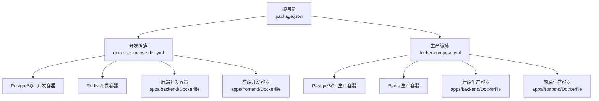
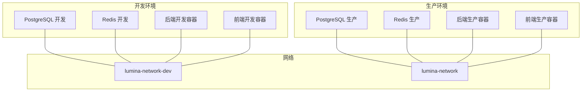
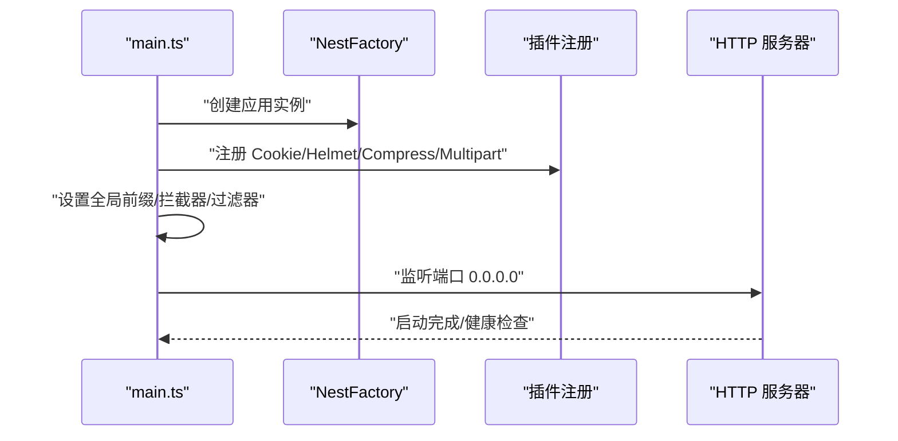
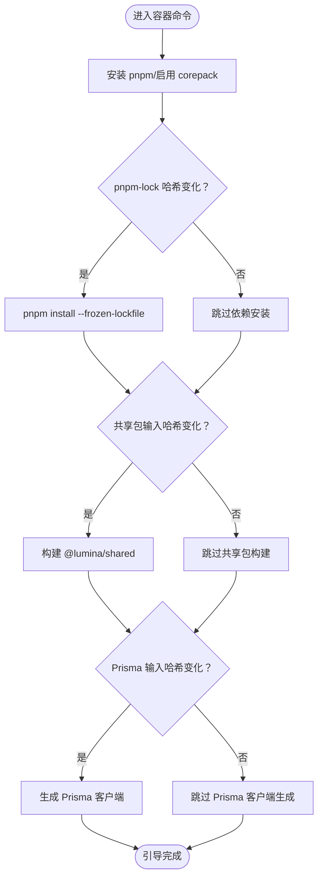
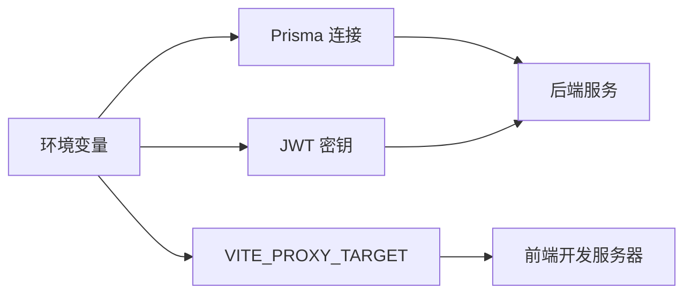

# 启动问题

<cite>
**本文引用的文件**
- [package.json](file://package.json)
- [docker-compose.yml](file://docker-compose.yml)
- [docker-compose.dev.yml](file://docker-compose.dev.yml)
- [apps/backend/package.json](file://apps/backend/package.json)
- [apps/frontend/package.json](file://apps/frontend/package.json)
- [apps/backend/src/main.ts](file://apps/backend/src/main.ts)
- [apps/frontend/vite.config.mts](file://apps/frontend/vite.config.mts)
- [apps/backend/Dockerfile](file://apps/backend/Dockerfile)
- [apps/frontend/Dockerfile](file://apps/frontend/Dockerfile)
- [scripts/dev-bootstrap.sh](file://scripts/dev-bootstrap.sh)
- [ecosystem.config.js](file://ecosystem.config.js)
- [apps/backend/src/common/filters/all-exceptions.filter.ts](file://apps/backend/src/common/filters/all-exceptions.filter.ts)
- [apps/backend/src/prisma/prisma.service.ts](file://apps/backend/src/prisma/prisma.service.ts)
- [apps/backend/src/auth/jwt.strategy.ts](file://apps/backend/src/auth/jwt.strategy.ts)
- [apps/backend/src/auth/token.service.ts](file://apps/backend/src/auth/token.service.ts)
</cite>

## 目录
1. [简介](#简介)
2. [项目结构](#项目结构)
3. [核心组件](#核心组件)
4. [架构总览](#架构总览)
5. [详细组件分析](#详细组件分析)
6. [依赖关系分析](#依赖关系分析)
7. [性能注意事项](#性能注意事项)
8. [故障排除指南](#故障排除指南)
9. [结论](#结论)
10. [附录](#附录)

## 简介
本指南聚焦 Lumina Todo 的启动问题排查，覆盖本地开发、Docker 容器、前端构建、后端服务启动等常见场景。针对端口占用、依赖缺失、环境变量配置错误、数据库连接失败、认证密钥缺失、健康检查失败等典型问题，提供可操作的诊断步骤、错误信息解读与修复建议，并给出实用的调试命令与工具。

## 项目结构
Lumina Todo 采用多包工作区（monorepo）结构，包含后端（NestJS）、前端（Vue + Vite）、共享包（shared）、Wails 桌面端以及 Docker 编排。启动相关的关键位置如下：
- 根级脚本与编排：根 package.json、docker-compose.yml、docker-compose.dev.yml
- 后端：apps/backend/src/main.ts、Dockerfile、package.json
- 前端：apps/frontend/vite.config.mts、Dockerfile、package.json
- 开发引导：scripts/dev-bootstrap.sh
- 进程管理：ecosystem.config.js

图表来源
- [docker-compose.dev.yml:13-181](file://docker-compose.dev.yml#L13-L181)
- [docker-compose.yml:19-240](file://docker-compose.yml#L19-L240)
- [apps/backend/Dockerfile:1-103](file://apps/backend/Dockerfile#L1-L103)
- [apps/frontend/Dockerfile:1-94](file://apps/frontend/Dockerfile#L1-L94)

章节来源
- [package.json:31-76](file://package.json#L31-L76)
- [docker-compose.dev.yml:1-192](file://docker-compose.dev.yml#L1-L192)
- [docker-compose.yml:1-240](file://docker-compose.yml#L1-L240)

## 核心组件
- 后端主入口与安全中间件：负责 CORS、Helmet、压缩、CSRF 校验、全局拦截器与异常过滤器、Swagger 文档、优雅退出钩子、监听端口等。
- 前端开发服务器与代理：Vite 开发服务器、代理到后端容器、权限策略头设置。
- Docker 编排：生产与开发两套 compose，分别定义数据库、缓存、后端、前端、反向代理与可视化组件。
- 开发引导脚本：按输入哈希缓存与锁机制，增量安装依赖、构建共享包、生成 Prisma 客户端。
- 进程管理：PM2 配置，区分 Docker 与本地环境的 cwd、日志输出与实例数。

章节来源
- [apps/backend/src/main.ts:34-205](file://apps/backend/src/main.ts#L34-L205)
- [apps/frontend/vite.config.mts:154-174](file://apps/frontend/vite.config.mts#L154-L174)
- [scripts/dev-bootstrap.sh:68-126](file://scripts/dev-bootstrap.sh#L68-L126)
- [ecosystem.config.js:5-32](file://ecosystem.config.js#L5-L32)

## 架构总览
后端与前端通过 Docker 网络互通，前端开发模式下通过 Vite 代理转发到后端容器；生产模式下由 Nginx 提供静态资源与反向代理。数据库与缓存服务在开发与生产环境中均通过 compose 管理。

图表来源
- [docker-compose.dev.yml:182-184](file://docker-compose.dev.yml#L182-L184)
- [docker-compose.yml:228-230](file://docker-compose.yml#L228-L230)

## 详细组件分析

### 后端启动流程与关键点
- 环境变量与安全中间件：CORS、Helmet、压缩、CSRF 校验、上传限制、全局拦截器与异常过滤器、Swagger 文档、优雅退出。
- 监听地址：在容器中必须监听 0.0.0.0 才能被外部访问。
- 健康检查：通过 liveness 探针验证服务可用性。

图表来源
- [apps/backend/src/main.ts:34-205](file://apps/backend/src/main.ts#L34-L205)

章节来源
- [apps/backend/src/main.ts:48-205](file://apps/backend/src/main.ts#L48-L205)

### 前端开发服务器与代理
- Vite 开发服务器监听 5173，host 设为 0.0.0.0 以适配容器访问。
- 代理规则将 /api 与 /socket.io 转发至后端容器地址，默认指向 http://localhost:3000 或环境变量 VITE_PROXY_TARGET。
- 权限策略头统一设置。

章节来源
- [apps/frontend/vite.config.mts:154-174](file://apps/frontend/vite.config.mts#L154-L174)

### Docker 开发编排与引导
- 开发 compose 为每个服务设置独立网络与卷，后端与前端容器通过命令调用开发引导脚本，实现增量安装与构建。
- 引导脚本基于锁文件与输入哈希判断是否跳过依赖安装、共享包构建与 Prisma 客户端生成。

图表来源
- [scripts/dev-bootstrap.sh:68-126](file://scripts/dev-bootstrap.sh#L68-L126)

章节来源
- [docker-compose.dev.yml:138-142](file://docker-compose.dev.yml#L138-L142)
- [scripts/dev-bootstrap.sh:1-151](file://scripts/dev-bootstrap.sh#L1-L151)

### Docker 生产编排与健康检查
- 生产 compose 定义数据库、缓存、后端、前端与反向代理服务，均配置健康检查。
- 后端与前端健康检查分别访问各自健康端点，容器启动后才对外提供服务。

章节来源
- [docker-compose.yml:128-139](file://docker-compose.yml#L128-L139)
- [docker-compose.yml:163-169](file://docker-compose.yml#L163-L169)

## 依赖关系分析
- 后端依赖 Prisma 客户端与数据库连接字符串；若未提供 DATABASE_URL，将在连接池初始化阶段抛出错误。
- 认证模块依赖 JWT 密钥；若未配置 JWT_SECRET 或 JWT_REFRESH_SECRET，将在策略或令牌服务初始化时报错。
- 前端开发代理依赖后端容器可达；若代理目标不可达，将导致请求失败。

图表来源
- [apps/backend/src/prisma/prisma.service.ts:10-16](file://apps/backend/src/prisma/prisma.service.ts#L10-L16)
- [apps/backend/src/auth/jwt.strategy.ts:25-33](file://apps/backend/src/auth/jwt.strategy.ts#L25-L33)
- [apps/backend/src/auth/token.service.ts:29-37](file://apps/backend/src/auth/token.service.ts#L29-L37)
- [apps/frontend/vite.config.mts:157-170](file://apps/frontend/vite.config.mts#L157-L170)

章节来源
- [apps/backend/src/prisma/prisma.service.ts:10-16](file://apps/backend/src/prisma/prisma.service.ts#L10-L16)
- [apps/backend/src/auth/jwt.strategy.ts:25-33](file://apps/backend/src/auth/jwt.strategy.ts#L25-L33)
- [apps/backend/src/auth/token.service.ts:29-37](file://apps/backend/src/auth/token.service.ts#L29-L37)
- [apps/frontend/vite.config.mts:157-170](file://apps/frontend/vite.config.mts#L157-L170)

## 性能注意事项
- 后端健康检查设置了较长的启动缓冲时间，以适应初始化压力。
- 前端开发服务器开启 gzip/Brotli 压缩与权限策略头，减少传输体积并提升安全性。
- Docker 生产镜像采用分层构建与最小化部署，降低运行时资源占用。

章节来源
- [apps/backend/Dockerfile:97-99](file://apps/backend/Dockerfile#L97-L99)
- [apps/frontend/Dockerfile:88-90](file://apps/frontend/Dockerfile#L88-L90)
- [apps/frontend/vite.config.mts:88-103](file://apps/frontend/vite.config.mts#L88-L103)

## 故障排除指南

### 一、端口占用与网络连通性
- 症状
  - 后端启动报端口被占用或无法监听。
  - 前端代理无法访问后端接口。
  - 健康检查失败。
- 诊断步骤
  - 检查宿主机端口占用：使用系统工具查看 3000（后端）、5173（前端）、5432（数据库）、6379（Redis）是否被占用。
  - 开发环境确认容器间网络：使用 compose 状态命令查看服务状态与端口映射。
  - 生产环境确认反向代理与 NPM 端口映射。
- 修复方案
  - 修改映射端口或释放占用进程。
  - 确认容器网络与健康检查配置正确。
  - 如需外网访问，调整 host 与端口映射。

章节来源
- [apps/backend/src/main.ts:196-197](file://apps/backend/src/main.ts#L196-L197)
- [apps/frontend/vite.config.mts:154-174](file://apps/frontend/vite.config.mts#L154-L174)
- [docker-compose.dev.yml:75-76](file://docker-compose.dev.yml#L75-L76)
- [docker-compose.yml:36-37](file://docker-compose.yml#L36-L37)

### 二、依赖缺失与安装失败
- 症状
  - 容器启动后立即退出或报缺少依赖。
  - 本地开发启动报模块找不到。
- 诊断步骤
  - 开发引导脚本会基于 pnpm 锁文件与输入哈希判断是否跳过安装；若安装失败，检查缓存目录与网络镜像配置。
  - 生产 Dockerfile 使用 frozen-lockfile，若依赖不匹配会直接失败。
- 修复方案
  - 清理缓存并重试安装，或使用官方镜像源。
  - 确保 pnpm 版本与工作区配置一致。
  - 生产构建时保持依赖一致性，避免本地修改影响锁定文件。

章节来源
- [scripts/dev-bootstrap.sh:73-87](file://scripts/dev-bootstrap.sh#L73-L87)
- [apps/backend/Dockerfile:33-46](file://apps/backend/Dockerfile#L33-L46)
- [apps/frontend/Dockerfile:28-45](file://apps/frontend/Dockerfile#L28-L45)

### 三、环境变量配置错误
- 症状
  - 数据库连接失败（提示未定义 DATABASE_URL）。
  - 认证失败（提示未配置 JWT_SECRET/JWT_REFRESH_SECRET）。
  - CORS 或安全头异常。
- 诊断步骤
  - 检查 compose 中的环境变量是否正确注入。
  - 在容器内打印关键环境变量进行核对。
  - 核对后端启动日志中的环境变量读取与中间件配置。
- 修复方案
  - 补充必需环境变量（如 DATABASE_URL、JWT_SECRET、JWT_REFRESH_SECRET、REDIS_PASSWORD 等）。
  - 确保 CORS_ORIGIN 与前端开发地址一致。
  - 在开发与生产环境分别提供正确的 .env 或环境注入。

章节来源
- [apps/backend/src/prisma/prisma.service.ts:10-16](file://apps/backend/src/prisma/prisma.service.ts#L10-L16)
- [apps/backend/src/auth/jwt.strategy.ts:25-33](file://apps/backend/src/auth/jwt.strategy.ts#L25-L33)
- [apps/backend/src/auth/token.service.ts:29-37](file://apps/backend/src/auth/token.service.ts#L29-L37)
- [apps/backend/src/main.ts:48-63](file://apps/backend/src/main.ts#L48-L63)

### 四、Docker 容器启动失败
- 症状
  - 容器启动即退出（healthcheck 失败）。
  - 服务未就绪，前端无法访问后端。
- 诊断步骤
  - 查看容器日志，定位初始化阶段的错误（数据库连接、密钥缺失、端口监听失败等）。
  - 检查依赖安装与构建阶段是否成功。
  - 核对健康检查命令与端口映射。
- 修复方案
  - 修复环境变量与依赖问题后再启动。
  - 调整健康检查的 start_period 与重试次数以适应初始化耗时。
  - 在开发环境使用增量引导脚本，避免重复安装与构建。

章节来源
- [docker-compose.yml:128-139](file://docker-compose.yml#L128-L139)
- [docker-compose.dev.yml:138-142](file://docker-compose.dev.yml#L138-L142)
- [scripts/dev-bootstrap.sh:133-151](file://scripts/dev-bootstrap.sh#L133-L151)

### 五、前端构建错误
- 症状
  - Vite 启动失败或构建产物为空。
  - 代理目标不可达导致接口 404。
- 诊断步骤
  - 检查 Vite 代理配置与后端容器可达性。
  - 确认共享包构建与前端构建顺序。
  - 查看浏览器控制台与网络面板。
- 修复方案
  - 确保 VITE_PROXY_TARGET 指向正确的后端地址。
  - 保证共享包先于前端构建完成。
  - 清理 node_modules 与缓存后重新安装。

章节来源
- [apps/frontend/vite.config.mts:157-170](file://apps/frontend/vite.config.mts#L157-L170)
- [scripts/dev-bootstrap.sh:89-107](file://scripts/dev-bootstrap.sh#L89-L107)

### 六、后端服务启动异常
- 症状
  - 启动后立即崩溃或健康检查失败。
  - 请求返回标准化错误响应（全局异常过滤器）。
- 诊断步骤
  - 查看后端日志与健康检查输出。
  - 检查数据库连接、认证密钥、上传限制、CSRF 校验等配置。
  - 使用 Swagger 文档端点验证服务可用性。
- 修复方案
  - 修复数据库连接字符串与缓存密码。
  - 补齐 JWT 密钥与 CORS 配置。
  - 调整上传大小与文件数量限制以适配实际需求。

章节来源
- [apps/backend/src/main.ts:192-205](file://apps/backend/src/main.ts#L192-L205)
- [apps/backend/src/common/filters/all-exceptions.filter.ts:27-135](file://apps/backend/src/common/filters/all-exceptions.filter.ts#L27-L135)

### 七、PM2 进程管理问题
- 症状
  - PM2 启动失败或日志输出异常。
- 诊断步骤
  - 检查 cwd 与日志文件路径在 Docker 与本地的差异。
  - 确认实例数与环境变量。
- 修复方案
  - 根据运行环境设置正确的 cwd 与日志输出。
  - 在 Docker 环境下使用单实例以避免会话抖动。

章节来源
- [ecosystem.config.js:10-29](file://ecosystem.config.js#L10-L29)

## 结论
启动问题通常源于端口占用、依赖缺失、环境变量错误与容器健康检查失败。通过分层排查（网络/端口 → 依赖 → 环境变量 → 容器健康检查 → 日志分析），结合开发引导脚本与 Docker 编排配置，可快速定位并修复问题。建议在开发与生产环境分别维护稳定的 .env 注入与健康检查策略，以提升启动成功率与可观测性。

## 附录

### 常用命令与调试技巧
- 开发环境
  - 启动开发编排：pnpm docker:dev
  - 查看实时日志：pnpm docker:dev:logs
  - 重启服务：pnpm docker:dev:restart
  - 查看服务状态：pnpm docker:dev:ps
  - 停止并清理：pnpm docker:dev:down
- 生产环境
  - 启动/停止：pnpm docker:up / pnpm docker:down
  - 查看日志：pnpm docker:logs
  - 清理资源：pnpm docker:prune
- 后端
  - 本地开发：pnpm --filter @lumina/backend dev
  - 构建：pnpm --filter @lumina/backend build
  - PM2 管理：pnpm --filter @lumina/backend pm2:start
- 前端
  - 本地开发：pnpm --filter @lumina/frontend dev
  - 构建：pnpm --filter @lumina/frontend build
- 数据库
  - 生成/推送/迁移：pnpm db:generate / pnpm db:push / pnpm db:migrate
  - 打开数据库工具：pnpm db:studio

章节来源
- [package.json:58-76](file://package.json#L58-L76)
- [apps/backend/package.json:7-29](file://apps/backend/package.json#L7-L29)
- [apps/frontend/package.json:9-29](file://apps/frontend/package.json#L9-L29)