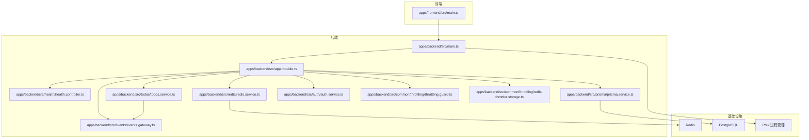
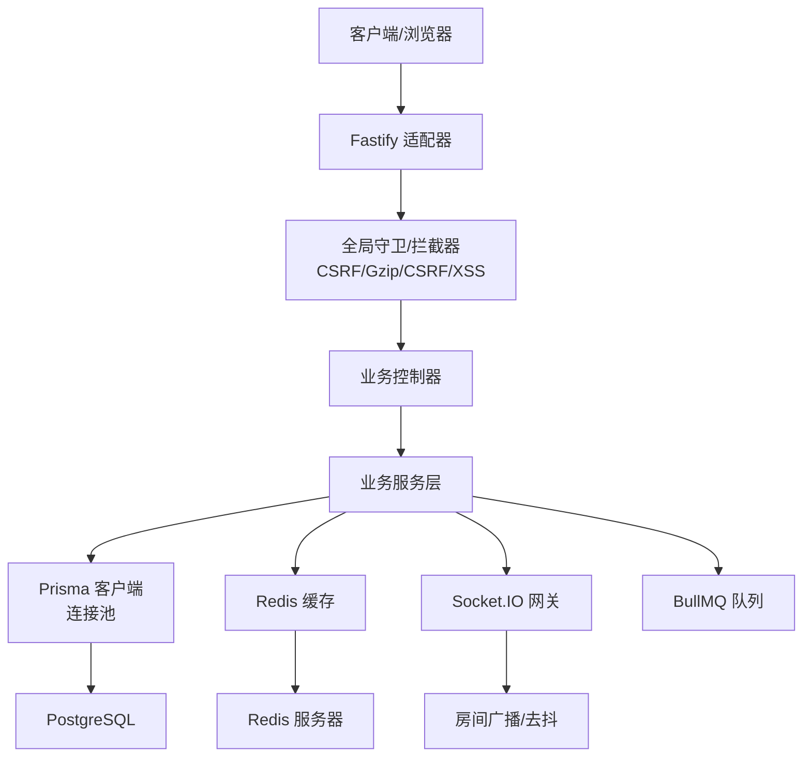
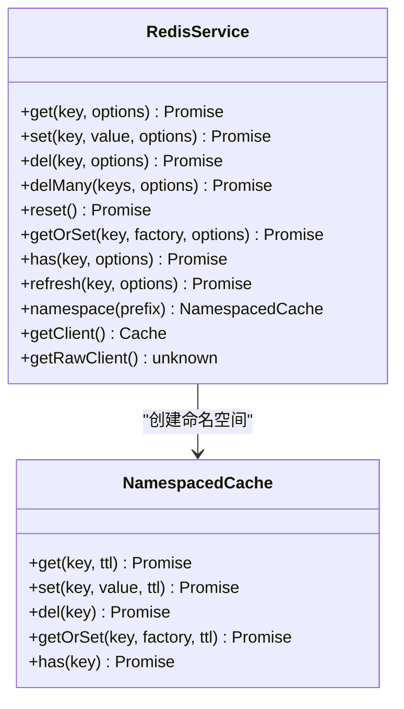
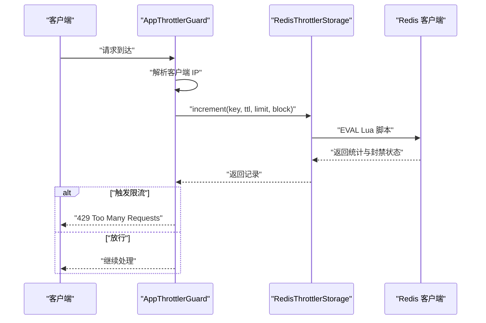
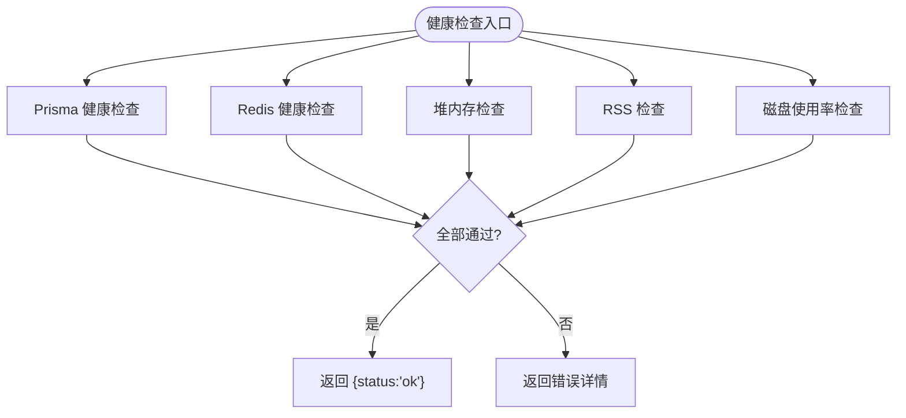
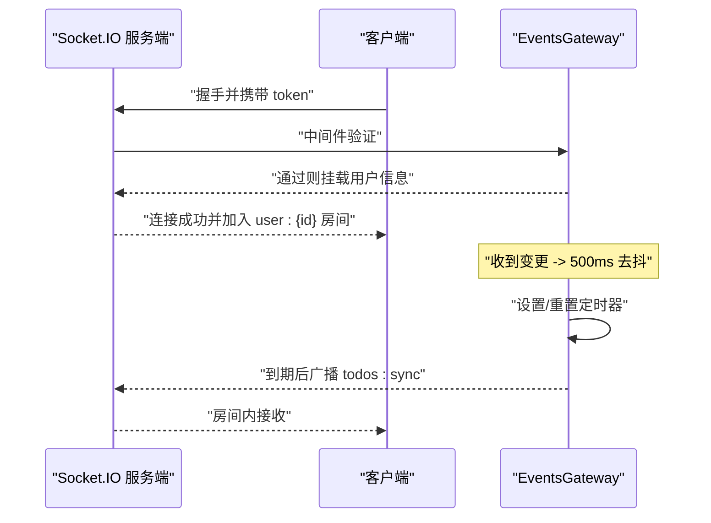
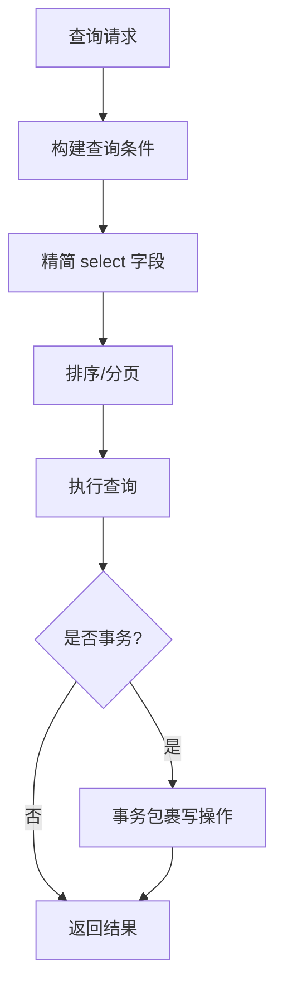
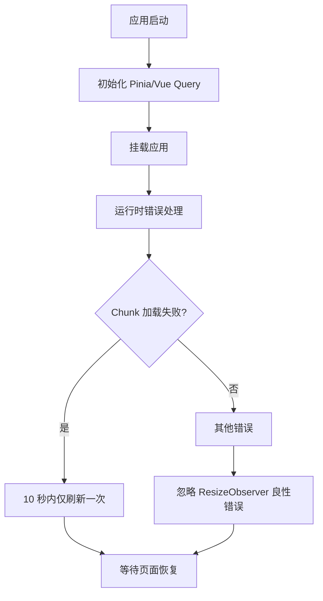
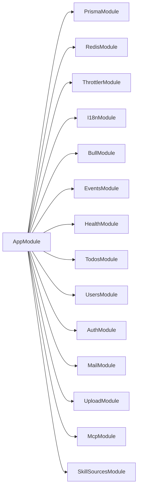

# 性能问题

<cite>
**本文引用的文件**
- [apps/backend/src/app.module.ts](file://apps/backend/src/app.module.ts)
- [apps/backend/src/main.ts](file://apps/backend/src/main.ts)
- [apps/backend/src/prisma/prisma.service.ts](file://apps/backend/src/prisma/prisma.service.ts)
- [apps/backend/src/redis/redis.service.ts](file://apps/backend/src/redis/redis.service.ts)
- [apps/backend/src/common/throttling/throttling.guard.ts](file://apps/backend/src/common/throttling/throttling.guard.ts)
- [apps/backend/src/common/throttling/redis-throttler.storage.ts](file://apps/backend/src/common/throttling/redis-throttler.storage.ts)
- [apps/backend/src/health/health.controller.ts](file://apps/backend/src/health/health.controller.ts)
- [apps/backend/src/events/events.gateway.ts](file://apps/backend/src/events/events.gateway.ts)
- [apps/backend/src/todos/todos.service.ts](file://apps/backend/src/todos/todos.service.ts)
- [apps/backend/src/auth/auth.service.ts](file://apps/backend/src/auth/auth.service.ts)
- [apps/backend/prisma.config.js](file://apps/backend/prisma.config.js)
- [ecosystem.config.js](file://ecosystem.config.js)
- [apps/frontend/src/main.ts](file://apps/frontend/src/main.ts)
</cite>

## 目录

1. [简介](#简介)
2. [项目结构](#项目结构)
3. [核心组件](#核心组件)
4. [架构总览](#架构总览)
5. [详细组件分析](#详细组件分析)
6. [依赖关系分析](#依赖关系分析)
7. [性能考量](#性能考量)
8. [故障排除指南](#故障排除指南)
9. [结论](#结论)
10. [附录](#附录)

## 简介

本指南面向 Lumina Todo 的运维与开发团队，聚焦后端与前端在真实负载下的性能问题定位与优化。内容覆盖响应缓慢、内存占用过高、CPU 使用异常、数据库查询慢、缓存策略失效、并发请求过多、前端渲染卡顿等典型瓶颈，并提供性能监控指标解读、内存泄漏检测、数据库查询优化、前端性能分析、负载测试方法与调优最佳实践。

## 项目结构

Lumina Todo 采用前后端分离的多包工作区布局，后端基于 NestJS + Fastify，前端基于 Vue 3 + Pinia + TanStack Query，辅以 Prisma、Redis、Socket.IO、BullMQ 等组件。整体通过 PM2 在生产环境进行进程管理与自动重启。

图示来源

- [apps/backend/src/main.ts:34-211](file://apps/backend/src/main.ts#L34-L211)
- [apps/backend/src/app.module.ts:28-159](file://apps/backend/src/app.module.ts#L28-L159)
- [apps/backend/src/redis/redis.service.ts:61-224](file://apps/backend/src/redis/redis.service.ts#L61-L224)
- [apps/backend/src/prisma/prisma.service.ts:6-33](file://apps/backend/src/prisma/prisma.service.ts#L6-L33)
- [apps/backend/src/events/events.gateway.ts:57-266](file://apps/backend/src/events/events.gateway.ts#L57-L266)
- [apps/backend/src/todos/todos.service.ts:27-147](file://apps/backend/src/todos/todos.service.ts#L27-L147)
- [apps/backend/src/auth/auth.service.ts:12-127](file://apps/backend/src/auth/auth.service.ts#L12-L127)
- [apps/backend/src/common/throttling/throttling.guard.ts:28-34](file://apps/backend/src/common/throttling/throttling.guard.ts#L28-L34)
- [apps/backend/src/common/throttling/redis-throttler.storage.ts:106-173](file://apps/backend/src/common/throttling/redis-throttler.storage.ts#L106-L173)
- [apps/backend/src/health/health.controller.ts:18-80](file://apps/backend/src/health/health.controller.ts#L18-L80)
- [ecosystem.config.js:5-33](file://ecosystem.config.js#L5-L33)

章节来源

- [apps/backend/src/main.ts:34-211](file://apps/backend/src/main.ts#L34-L211)
- [apps/backend/src/app.module.ts:28-159](file://apps/backend/src/app.module.ts#L28-L159)
- [ecosystem.config.js:5-33](file://ecosystem.config.js#L5-L33)

## 核心组件

- Web 服务器与中间件：NestJS + Fastify，启用 Helmet、CSRF 校验、Gzip 压缩、静态资源托管、CORS、全局拦截器与异常过滤器。
- 缓存：基于 cache-manager 的 Redis 缓存服务，提供命名空间、TTL、批量删除、穿透保护等能力。
- 数据访问：Prisma + PostgreSQL，使用连接池与适配器；提供健康检查与连接生命周期管理。
- 实时通信：Socket.IO 网关，支持鉴权、房间隔离、广播去抖（500ms）。
- 限流：全局 Throttler + Redis 存储，Lua 脚本原子计数与封禁。
- 健康检查：综合数据库、Redis、内存、磁盘健康指标。
- 前端：Vue 3 + Pinia + TanStack Query，具备错误兜底与图表渲染能力。

章节来源

- [apps/backend/src/main.ts:34-211](file://apps/backend/src/main.ts#L34-L211)
- [apps/backend/src/redis/redis.service.ts:61-224](file://apps/backend/src/redis/redis.service.ts#L61-L224)
- [apps/backend/src/prisma/prisma.service.ts:6-33](file://apps/backend/src/prisma/prisma.service.ts#L6-L33)
- [apps/backend/src/events/events.gateway.ts:57-266](file://apps/backend/src/events/events.gateway.ts#L57-L266)
- [apps/backend/src/common/throttling/throttling.guard.ts:28-34](file://apps/backend/src/common/throttling/throttling.guard.ts#L28-L34)
- [apps/backend/src/common/throttling/redis-throttler.storage.ts:106-173](file://apps/backend/src/common/throttling/redis-throttler.storage.ts#L106-L173)
- [apps/backend/src/health/health.controller.ts:18-80](file://apps/backend/src/health/health.controller.ts#L18-L80)
- [apps/frontend/src/main.ts:54-138](file://apps/frontend/src/main.ts#L54-L138)

## 架构总览

后端通过 Fastify Adapter 提供高性能 HTTP 服务，结合全局管道、拦截器与异常过滤器统一处理请求生命周期。数据库层采用 Prisma + PostgreSQL，缓存层采用 Redis。实时场景通过 Socket.IO 网关实现用户房间隔离与广播去抖。限流策略基于 Redis Lua 脚本保证原子性与跨实例一致性。

图示来源

- [apps/backend/src/main.ts:34-211](file://apps/backend/src/main.ts#L34-L211)
- [apps/backend/src/app.module.ts:28-159](file://apps/backend/src/app.module.ts#L28-L159)
- [apps/backend/src/prisma/prisma.service.ts:6-33](file://apps/backend/src/prisma/prisma.service.ts#L6-L33)
- [apps/backend/src/redis/redis.service.ts:61-224](file://apps/backend/src/redis/redis.service.ts#L61-L224)
- [apps/backend/src/events/events.gateway.ts:57-266](file://apps/backend/src/events/events.gateway.ts#L57-L266)

## 详细组件分析

### 缓存服务（Redis）

- 能力概览：键前缀管理、TTL 控制、批量删除、穿透保护 getOrSet、命名空间 NamespacedCache、底层客户端访问。
- 性能要点：默认 TTL 5 分钟；批量删除使用 Promise.all 并发删除；getOrSet 可降低缓存穿透风险。
- 优化建议：对热点键设置更短 TTL 以降低陈旧数据影响；对高并发读场景考虑使用 pipeline 或批量 get；对写放大场景评估是否需要预热。

图示来源

- [apps/backend/src/redis/redis.service.ts:61-224](file://apps/backend/src/redis/redis.service.ts#L61-L224)
- [apps/backend/src/redis/redis.service.ts:229-255](file://apps/backend/src/redis/redis.service.ts#L229-L255)

章节来源

- [apps/backend/src/redis/redis.service.ts:61-224](file://apps/backend/src/redis/redis.service.ts#L61-L224)
- [apps/backend/src/redis/redis.service.ts:229-255](file://apps/backend/src/redis/redis.service.ts#L229-L255)

### 限流与速率控制

- 全局守卫：优先使用 request.ip，回退到 X-Forwarded-For 链末尾有效 IP，保障代理场景正确识别客户端。
- Redis 存储：使用 Lua 脚本原子地维护 hits 堆栈、block 标记、序列号与过期时间，失败时降级到内存存储。
- 配置：通过环境变量与默认值组合生成窗口定义，支持跳过健康检查等路径。

图示来源

- [apps/backend/src/common/throttling/throttling.guard.ts:28-34](file://apps/backend/src/common/throttling/throttling.guard.ts#L28-L34)
- [apps/backend/src/common/throttling/redis-throttler.storage.ts:106-173](file://apps/backend/src/common/throttling/redis-throttler.storage.ts#L106-L173)

章节来源

- [apps/backend/src/common/throttling/throttling.guard.ts:28-34](file://apps/backend/src/common/throttling/throttling.guard.ts#L28-L34)
- [apps/backend/src/common/throttling/redis-throttler.storage.ts:106-173](file://apps/backend/src/common/throttling/redis-throttler.storage.ts#L106-L173)

### 健康检查与资源监控

- 综合健康检查：数据库、Redis、堆内存、RSS、磁盘使用率阈值报警。
- 存活/就绪探针：用于容器编排的健康探测。
- 建议：结合系统监控（CPU、内存、网络、IO）与应用日志，建立告警阈值与基线。

图示来源

- [apps/backend/src/health/health.controller.ts:18-80](file://apps/backend/src/health/health.controller.ts#L18-L80)

章节来源

- [apps/backend/src/health/health.controller.ts:18-80](file://apps/backend/src/health/health.controller.ts#L18-L80)

### 实时通信与广播去抖

- 鉴权：握手阶段校验 token 并检查会话是否失效。
- 房间隔离：仅允许进入自身房间，防止越权。
- 广播去抖：同一用户在 500ms 内仅广播一次 todos:sync，减少风暴效应。

图示来源

- [apps/backend/src/events/events.gateway.ts:57-266](file://apps/backend/src/events/events.gateway.ts#L57-L266)

章节来源

- [apps/backend/src/events/events.gateway.ts:57-266](file://apps/backend/src/events/events.gateway.ts#L57-L266)

### 数据库访问与事务

- 连接池：通过 PrismaPg + pg.Pool 建立连接池，模块销毁时释放连接。
- 查询优化：todos.service 对常用字段做 select 精简与排序索引；事务包裹 tombstone 与删除，保证一致性。
- 建议：为高频查询字段建立合适索引；避免 N+1 查询；对大列表分页与懒加载。

图示来源

- [apps/backend/src/todos/todos.service.ts:27-147](file://apps/backend/src/todos/todos.service.ts#L27-L147)
- [apps/backend/src/prisma/prisma.service.ts:6-33](file://apps/backend/src/prisma/prisma.service.ts#L6-L33)

章节来源

- [apps/backend/src/todos/todos.service.ts:27-147](file://apps/backend/src/todos/todos.service.ts#L27-L147)
- [apps/backend/src/prisma/prisma.service.ts:6-33](file://apps/backend/src/prisma/prisma.service.ts#L6-L33)

### 前端性能与错误兜底

- 全局错误处理：捕获动态模块加载失败（Chunk Error）并自动刷新；忽略 ResizeObserver 相关良性错误。
- 状态与缓存：Pinia + 持久化插件；TanStack Query 默认 staleTime 1 分钟，重试 1 次。
- 建议：对长列表虚拟滚动；拆分大组件；减少不必要的响应式依赖；合理使用 keep-alive。

图示来源

- [apps/frontend/src/main.ts:54-138](file://apps/frontend/src/main.ts#L54-L138)

章节来源

- [apps/frontend/src/main.ts:54-138](file://apps/frontend/src/main.ts#L54-L138)

## 依赖关系分析

- 后端模块耦合：AppModule 统一引入 Prisma、Redis、Throttler、I18n、BullMQ、EventEmitter 等，体现高内聚低耦合；各功能模块通过服务注入解耦。
- 外部依赖：PostgreSQL、Redis、Socket.IO、PM2；生产环境通过 ecosystem.config.js 管理实例数与日志。
- 潜在环依赖：未见明显环状依赖；注意避免在 Gateway 与 Service 之间形成双向强耦合。

图示来源

- [apps/backend/src/app.module.ts:28-159](file://apps/backend/src/app.module.ts#L28-L159)

章节来源

- [apps/backend/src/app.module.ts:28-159](file://apps/backend/src/app.module.ts#L28-L159)
- [ecosystem.config.js:5-33](file://ecosystem.config.js#L5-L33)

## 性能考量

- 响应缓慢
  - 检查 Fastify 中间件链路（Helmet、CSRF、Gzip、静态资源）是否阻塞；确认请求头与路径白名单。
  - 关注限流是否误伤；核对 Redis 是否可用，Lua 脚本是否超时。
  - 健康检查端点是否被限流或代理转发异常。
- 内存占用过高
  - 结合健康检查的堆/内存阈值与系统 RSS；排查大对象未释放、事件监听器泄漏、Socket 连接未清理。
  - 检查 Redis 缓存键数量与 TTL 设置，避免大量过期堆积。
- CPU 使用异常
  - 观察限流脚本执行频率与 Redis 延迟；检查 Socket 广播风暴与去抖是否生效。
  - 前端是否存在高频重渲染或未节流的计算。
- 数据库查询慢
  - 核查慢查询日志与索引；确认事务边界与锁竞争；避免一次性拉取过大列表。
- 缓存策略失效
  - 检查 getOrSet 是否频繁穿透；TTL 是否过长；命名空间前缀是否正确。
- 并发请求过多
  - 核对限流窗口与阈值；确认代理链是否正确传递客户端 IP；区分健康检查与业务流量。
- 前端渲染卡顿
  - 检查组件拆分与懒加载；避免在渲染路径上做昂贵计算；减少响应式依赖层级。

[本节为通用指导，无需具体文件引用]

## 故障排除指南

### 一、响应缓慢

- 快速定位
  - 查看健康检查端点与日志，确认数据库、Redis、内存、磁盘是否异常。
  - 使用压测工具（如 wrk/JMeter）模拟峰值流量，观察端到端延迟与错误率。
- 根因分析
  - 限流误伤：检查 Redis 存储可用性与 Lua 脚本返回；必要时临时提升阈值验证。
  - 中间件阻塞：确认静态资源、压缩、CORS 配置是否合理。
  - Socket 广播风暴：确认去抖是否生效，房间数量与消息大小。
- 优化建议
  - 为高频接口开启缓存；对非幂等写接口增加幂等键与去重。
  - 调整限流窗口与阈值，区分不同端点类型。

章节来源

- [apps/backend/src/health/health.controller.ts:18-80](file://apps/backend/src/health/health.controller.ts#L18-L80)
- [apps/backend/src/common/throttling/redis-throttler.storage.ts:106-173](file://apps/backend/src/common/throttling/redis-throttler.storage.ts#L106-L173)
- [apps/backend/src/events/events.gateway.ts:177-202](file://apps/backend/src/events/events.gateway.ts#L177-L202)

### 二、内存占用过高

- 快速定位
  - 使用健康检查的堆/内存阈值报警；对比 RSS 与堆使用趋势。
  - 检查事件监听器数量与 Socket 连接数。
- 根因分析
  - 事件发射器 maxListeners 与监听器泄漏；Socket 房间未清理；缓存键过多。
- 优化建议
  - 限制最大监听器数量；及时移除事件监听；清理广播定时器；定期清理过期缓存。

章节来源

- [apps/backend/src/app.module.ts:90-96](file://apps/backend/src/app.module.ts#L90-L96)
- [apps/backend/src/events/events.gateway.ts:118-124](file://apps/backend/src/events/events.gateway.ts#L118-L124)
- [apps/backend/src/redis/redis.service.ts:147-157](file://apps/backend/src/redis/redis.service.ts#L147-L157)

### 三、CPU 使用异常

- 快速定位
  - 观察限流脚本执行耗时与 Redis 延迟；检查 Socket 广播频率。
- 根因分析
  - Lua 脚本复杂度高；Redis 客户端不可用导致降级到内存存储；前端频繁触发后端广播。
- 优化建议
  - 简化限流逻辑；确保 Redis 高可用；前端侧减少无效交互。

章节来源

- [apps/backend/src/common/throttling/redis-throttler.storage.ts:106-173](file://apps/backend/src/common/throttling/redis-throttler.storage.ts#L106-L173)
- [apps/backend/src/events/events.gateway.ts:177-202](file://apps/backend/src/events/events.gateway.ts#L177-L202)

### 四、数据库查询慢

- 快速定位
  - 使用 Prisma 日志与慢查询分析；核对索引与排序字段。
- 根因分析
  - 未命中索引的排序/过滤；N+1 查询；大事务锁竞争。
- 优化建议
  - 为高频字段建立索引；使用 select 精简字段；拆分事务；分页与懒加载。

章节来源

- [apps/backend/src/todos/todos.service.ts:27-147](file://apps/backend/src/todos/todos.service.ts#L27-L147)
- [apps/backend/src/prisma/prisma.service.ts:6-33](file://apps/backend/src/prisma/prisma.service.ts#L6-L33)
- [apps/backend/prisma.config.js:13-22](file://apps/backend/prisma.config.js#L13-L22)

### 五、缓存策略失效

- 快速定位
  - 检查 getOrSet 是否频繁穿透；TTL 是否过长；命名空间前缀是否一致。
- 根因分析
  - 缓存未命中导致直连数据库；键过期策略不当；批量删除未覆盖前缀。
- 优化建议
  - 为热点键设置更短 TTL；使用命名空间隔离；批量删除时统一前缀。

章节来源

- [apps/backend/src/redis/redis.service.ts:163-174](file://apps/backend/src/redis/redis.service.ts#L163-L174)
- [apps/backend/src/redis/redis.service.ts:137-145](file://apps/backend/src/redis/redis.service.ts#L137-L145)
- [apps/backend/src/redis/redis.service.ts:215-218](file://apps/backend/src/redis/redis.service.ts#L215-L218)

### 六、并发请求过多

- 快速定位
  - 检查限流配置与 Redis 存储可用性；确认代理链是否正确传递客户端 IP。
- 根因分析
  - 限流阈值过低；Redis 不可用导致降级；健康检查被误判为业务流量。
- 优化建议
  - 调整限流窗口与阈值；确保代理正确透传 IP；区分健康检查路径。

章节来源

- [apps/backend/src/common/throttling/throttling.guard.ts:28-34](file://apps/backend/src/common/throttling/throttling.guard.ts#L28-L34)
- [apps/backend/src/common/throttling/redis-throttler.storage.ts:106-173](file://apps/backend/src/common/throttling/redis-throttler.storage.ts#L106-L173)

### 七、前端渲染卡顿

- 快速定位
  - 检查组件拆分与懒加载；观察错误日志中是否有 Chunk 加载失败。
- 根因分析
  - 动态导入失败导致页面闪烁；ResizeObserver 警告；重渲染频繁。
- 优化建议
  - 修复部署后的模块版本不一致；拆分大组件；避免在渲染路径上做昂贵计算。

章节来源

- [apps/frontend/src/main.ts:54-138](file://apps/frontend/src/main.ts#L54-L138)

### 八、性能监控指标解读

- 应用层
  - 请求延迟分布（P50/P95/P99）、错误率、吞吐量；限流触发次数与封禁比例。
- 系统层
  - CPU 使用率、内存 RSS/堆、磁盘 IO、网络带宽；Redis 延迟与连接数。
- 数据库层
  - 连接池利用率、慢查询数量、锁等待时间、表扫描比例。
- 前端层
  - 首屏时间、可交互时间、长任务占比、内存峰值。

[本节为通用指导，无需具体文件引用]

### 九、内存泄漏检测

- 后端
  - 使用 EventEmitter 的 verboseMemoryLeak 提示；定期检查监听器数量；清理 Socket 定时器。
- 前端
  - 使用浏览器性能面板与内存快照；关注未释放的事件监听器与闭包引用。

章节来源

- [apps/backend/src/app.module.ts:90-96](file://apps/backend/src/app.module.ts#L90-L96)
- [apps/backend/src/events/events.gateway.ts:118-124](file://apps/backend/src/events/events.gateway.ts#L118-L124)
- [apps/frontend/src/main.ts:54-138](file://apps/frontend/src/main.ts#L54-L138)

### 十、数据库查询优化

- 建议
  - 为高频查询字段建立索引；使用 select 精简字段；拆分大事务；分页与懒加载。
  - 使用 Prisma 日志与慢查询分析工具定位热点 SQL。

章节来源

- [apps/backend/src/todos/todos.service.ts:27-147](file://apps/backend/src/todos/todos.service.ts#L27-L147)
- [apps/backend/prisma.config.js:13-22](file://apps/backend/prisma.config.js#L13-L22)

### 十一、前端性能分析

- 建议
  - 使用浏览器性能面板分析长任务与重渲染；拆分大组件与使用懒加载；减少不必要的响应式依赖。

章节来源

- [apps/frontend/src/main.ts:54-138](file://apps/frontend/src/main.ts#L54-L138)

### 十二、负载测试方法

- 工具
  - wrk/JMeter/K6；针对登录、列表查询、增删改、实时广播等关键路径设计场景。
- 方法
  - 逐步加压至 SLO 基线，记录延迟、错误率、资源使用；回归验证优化效果。
- 结果
  - 输出 P50/P95/P99 延迟曲线、错误率曲线与资源使用曲线。

[本节为通用指导，无需具体文件引用]

### 十三、性能调优最佳实践

- 后端
  - 合理设置限流参数；启用缓存与去重；优化数据库索引与事务；保持中间件最小化。
- 前端
  - 组件拆分与懒加载；虚拟滚动与分页；避免在渲染路径上做昂贵计算；错误兜底与自动刷新。
- 运维
  - 使用 PM2 管理实例与日志；结合健康检查与告警；定期巡检 Redis 与数据库。

章节来源

- [ecosystem.config.js:5-33](file://ecosystem.config.js#L5-L33)
- [apps/backend/src/main.ts:34-211](file://apps/backend/src/main.ts#L34-L211)
- [apps/frontend/src/main.ts:54-138](file://apps/frontend/src/main.ts#L54-L138)

## 结论

Lumina Todo 的性能问题多源于缓存策略不当、并发请求激增、数据库索引缺失与前端重渲染。通过健康检查与限流机制、合理的缓存与索引策略、前端组件优化与负载测试，可显著提升系统稳定性与用户体验。建议建立持续的性能监控与回归测试流程，确保变更不会引入新的性能退化。

[本节为总结，无需具体文件引用]

## 附录

- 关键配置参考
  - 后端启动与中间件：[apps/backend/src/main.ts:34-211](file://apps/backend/src/main.ts#L34-L211)
  - 模块装配与全局守卫：[apps/backend/src/app.module.ts:28-159](file://apps/backend/src/app.module.ts#L28-L159)
  - Redis 缓存服务：[apps/backend/src/redis/redis.service.ts:61-224](file://apps/backend/src/redis/redis.service.ts#L61-L224)
  - 限流守卫与存储：[apps/backend/src/common/throttling/throttling.guard.ts:28-34](file://apps/backend/src/common/throttling/throttling.guard.ts#L28-L34)、[apps/backend/src/common/throttling/redis-throttler.storage.ts:106-173](file://apps/backend/src/common/throttling/redis-throttler.storage.ts#L106-L173)
  - 健康检查：[apps/backend/src/health/health.controller.ts:18-80](file://apps/backend/src/health/health.controller.ts#L18-L80)
  - 实时网关：[apps/backend/src/events/events.gateway.ts:57-266](file://apps/backend/src/events/events.gateway.ts#L57-L266)
  - 数据库服务：[apps/backend/src/prisma/prisma.service.ts:6-33](file://apps/backend/src/prisma/prisma.service.ts#L6-L33)
  - 前端入口：[apps/frontend/src/main.ts:54-138](file://apps/frontend/src/main.ts#L54-L138)
  - PM2 配置：[ecosystem.config.js:5-33](file://ecosystem.config.js#L5-L33)
  - Prisma 配置：[apps/backend/prisma.config.js:13-22](file://apps/backend/prisma.config.js#L13-L22)
