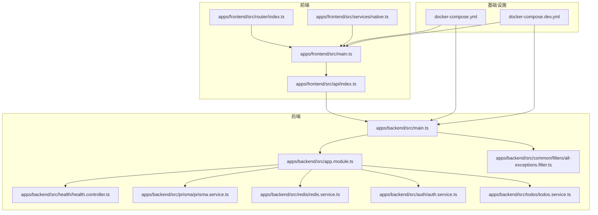
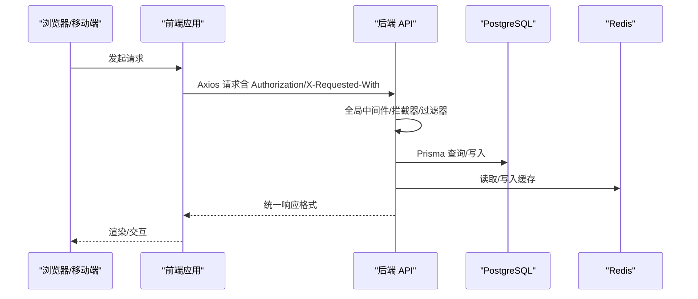
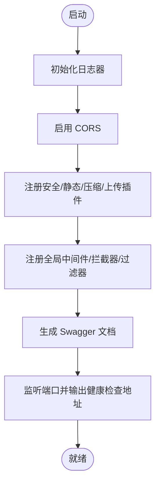
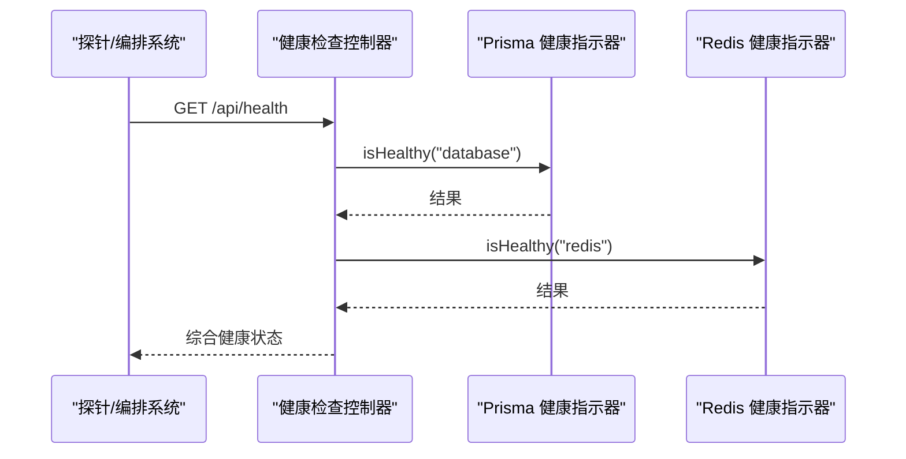
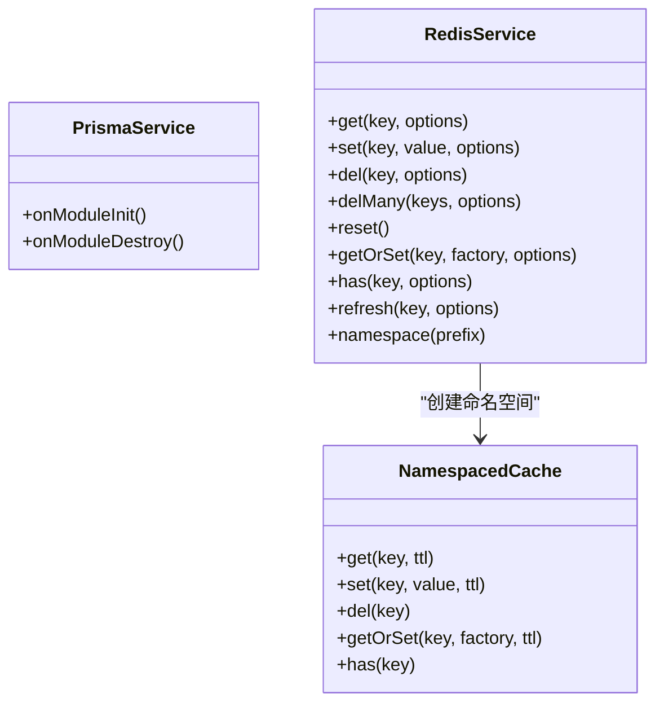
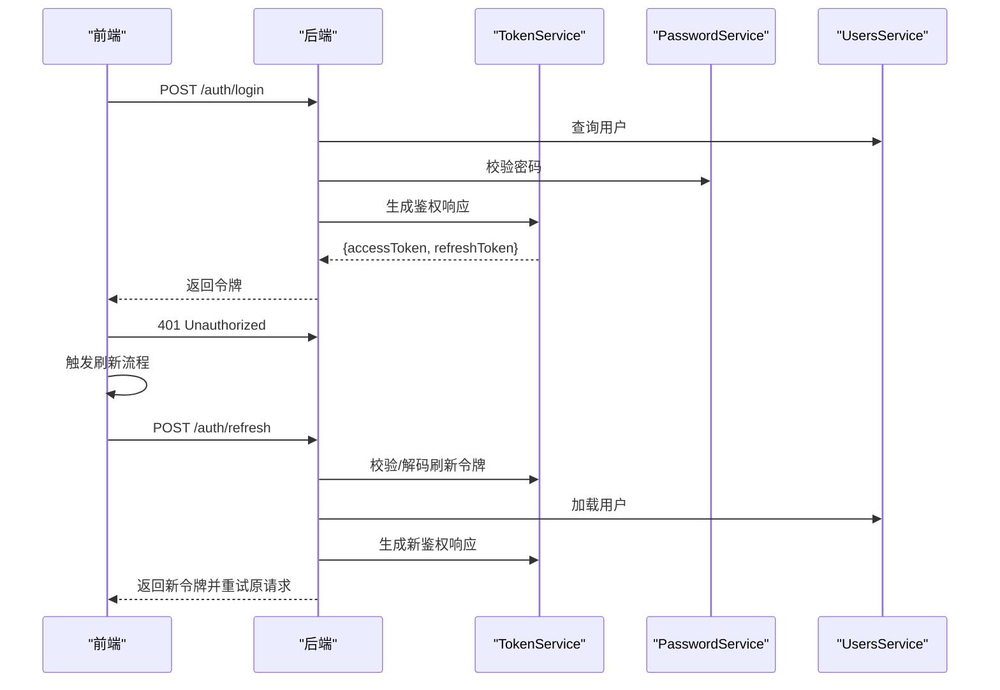
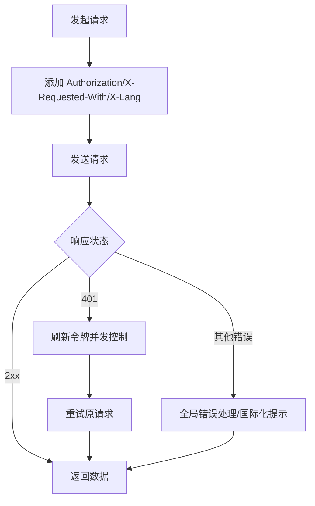
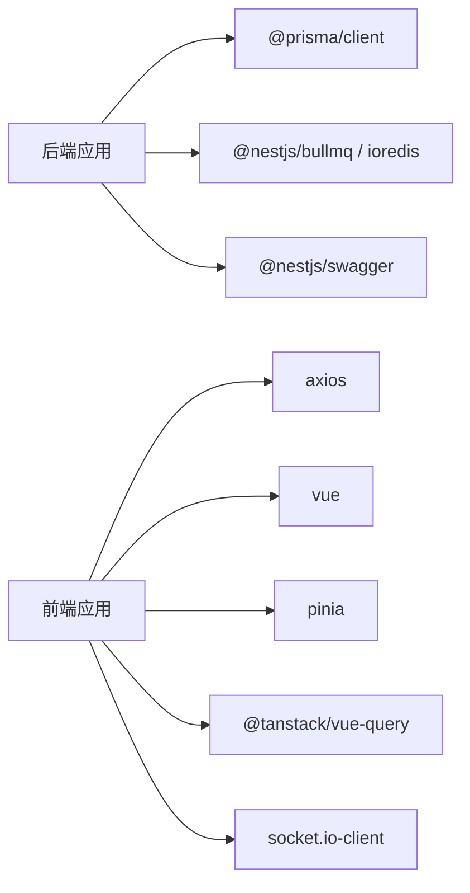

# 故障排除

<cite>
**本文引用的文件**   
- [apps/backend/src/main.ts](file://apps/backend/src/main.ts)
- [apps/backend/src/app.module.ts](file://apps/backend/src/app.module.ts)
- [apps/backend/src/common/filters/all-exceptions.filter.ts](file://apps/backend/src/common/filters/all-exceptions.filter.ts)
- [apps/backend/src/health/health.controller.ts](file://apps/backend/src/health/health.controller.ts)
- [apps/backend/src/prisma/prisma.service.ts](file://apps/backend/src/prisma/prisma.service.ts)
- [apps/backend/src/redis/redis.service.ts](file://apps/backend/src/redis/redis.service.ts)
- [apps/backend/src/auth/auth.service.ts](file://apps/backend/src/auth/auth.service.ts)
- [apps/backend/src/todos/todos.service.ts](file://apps/backend/src/todos/todos.service.ts)
- [apps/backend/package.json](file://apps/backend/package.json)
- [apps/frontend/src/main.ts](file://apps/frontend/src/main.ts)
- [apps/frontend/src/api/index.ts](file://apps/frontend/src/api/index.ts)
- [apps/frontend/src/composables/useRequest.ts](file://apps/frontend/src/composables/useRequest.ts)
- [apps/frontend/src/services/native.ts](file://apps/frontend/src/services/native.ts)
- [apps/frontend/src/router/index.ts](file://apps/frontend/src/router/index.ts)
- [apps/frontend/package.json](file://apps/frontend/package.json)
- [docker-compose.yml](file://docker-compose.yml)
- [docker-compose.dev.yml](file://docker-compose.dev.yml)
</cite>

## 目录

1. [简介](#简介)
2. [项目结构](#项目结构)
3. [核心组件](#核心组件)
4. [架构总览](#架构总览)
5. [详细组件分析](#详细组件分析)
6. [依赖关系分析](#依赖关系分析)
7. [性能考虑](#性能考虑)
8. [故障排除指南](#故障排除指南)
9. [结论](#结论)
10. [附录](#附录)

## 简介

本指南面向运维与开发者，聚焦 Lumina Todo 的启动失败、连接异常、性能问题、日志分析、错误码与调试技巧、监控指标与告警流程，以及数据库连接、API 调用失败、前端渲染异常等具体场景的排查步骤。文档同时覆盖性能瓶颈分析、内存泄漏检测与并发问题诊断，并提供可操作的工具与方法。

## 项目结构

Lumina Todo 采用前后端分离与多服务编排的架构：

- 后端（NestJS + Fastify）：负责认证、待办、队列、缓存、健康检查、Swagger 文档等。
- 前端（Vue 3 + Vite）：负责路由、状态管理、请求封装、国际化、原生能力桥接等。
- 数据库（PostgreSQL）与缓存/队列（Redis）通过 Docker Compose 编排。
- 健康检查与反向代理（Nginx Proxy Manager）用于生产环境接入。

**图表来源**

- [apps/frontend/src/main.ts:1-138](file://apps/frontend/src/main.ts#L1-L138)
- [apps/frontend/src/api/index.ts:1-199](file://apps/frontend/src/api/index.ts#L1-L199)
- [apps/frontend/src/router/index.ts:1-73](file://apps/frontend/src/router/index.ts#L1-L73)
- [apps/frontend/src/services/native.ts:1-116](file://apps/frontend/src/services/native.ts#L1-L116)
- [apps/backend/src/main.ts:1-211](file://apps/backend/src/main.ts#L1-L211)
- [apps/backend/src/app.module.ts:1-160](file://apps/backend/src/app.module.ts#L1-L160)
- [apps/backend/src/health/health.controller.ts:1-80](file://apps/backend/src/health/health.controller.ts#L1-L80)
- [apps/backend/src/common/filters/all-exceptions.filter.ts:1-137](file://apps/backend/src/common/filters/all-exceptions.filter.ts#L1-L137)
- [apps/backend/src/prisma/prisma.service.ts:1-34](file://apps/backend/src/prisma/prisma.service.ts#L1-L34)
- [apps/backend/src/redis/redis.service.ts:1-255](file://apps/backend/src/redis/redis.service.ts#L1-L255)
- [apps/backend/src/auth/auth.service.ts:1-127](file://apps/backend/src/auth/auth.service.ts#L1-L127)
- [apps/backend/src/todos/todos.service.ts:1-147](file://apps/backend/src/todos/todos.service.ts#L1-L147)
- [docker-compose.yml:1-240](file://docker-compose.yml#L1-L240)
- [docker-compose.dev.yml:1-192](file://docker-compose.dev.yml#L1-L192)

**章节来源**

- [apps/backend/src/main.ts:1-211](file://apps/backend/src/main.ts#L1-L211)
- [apps/backend/src/app.module.ts:1-160](file://apps/backend/src/app.module.ts#L1-L160)
- [apps/frontend/src/main.ts:1-138](file://apps/frontend/src/main.ts#L1-L138)
- [docker-compose.yml:1-240](file://docker-compose.yml#L1-L240)
- [docker-compose.dev.yml:1-192](file://docker-compose.dev.yml#L1-L192)

## 核心组件

- 启动与安全中间件：CORS、Helmet、CSRF、压缩、静态资源、全局管道与过滤器。
- 健康检查：数据库、Redis、内存堆/RSS、磁盘占用。
- 数据库与缓存：PostgreSQL（Prisma）、Redis（BullMQ、缓存）。
- 认证与授权：JWT、刷新令牌、登出黑名单、速率限制。
- 前端请求与状态：Axios 封装、Token 刷新防并发、错误处理与国际化。
- 原生能力桥接：Wails/Capacitor/Web 的统一调用层。

**章节来源**

- [apps/backend/src/main.ts:34-205](file://apps/backend/src/main.ts#L34-L205)
- [apps/backend/src/app.module.ts:28-159](file://apps/backend/src/app.module.ts#L28-L159)
- [apps/backend/src/health/health.controller.ts:18-79](file://apps/backend/src/health/health.controller.ts#L18-L79)
- [apps/backend/src/prisma/prisma.service.ts:6-33](file://apps/backend/src/prisma/prisma.service.ts#L6-L33)
- [apps/backend/src/redis/redis.service.ts:61-224](file://apps/backend/src/redis/redis.service.ts#L61-L224)
- [apps/frontend/src/api/index.ts:8-199](file://apps/frontend/src/api/index.ts#L8-L199)
- [apps/frontend/src/main.ts:54-138](file://apps/frontend/src/main.ts#L54-L138)

## 架构总览

后端基于 Fastify，启用 Helmet、CSRF、压缩与静态资源；全局 Zod 验证、异常过滤、响应拦截与 XSS 清理；健康检查集成 Prisma 与 Redis；前端通过 Axios 统一封装请求，内置刷新令牌并发控制与错误兜底。

**图表来源**

- [apps/backend/src/main.ts:48-197](file://apps/backend/src/main.ts#L48-L197)
- [apps/backend/src/common/filters/all-exceptions.filter.ts:27-135](file://apps/backend/src/common/filters/all-exceptions.filter.ts#L27-L135)
- [apps/backend/src/prisma/prisma.service.ts:10-21](file://apps/backend/src/prisma/prisma.service.ts#L10-L21)
- [apps/backend/src/redis/redis.service.ts:99-121](file://apps/backend/src/redis/redis.service.ts#L99-L121)
- [apps/frontend/src/api/index.ts:66-91](file://apps/frontend/src/api/index.ts#L66-L91)

**章节来源**

- [apps/backend/src/main.ts:48-197](file://apps/backend/src/main.ts#L48-L197)
- [apps/frontend/src/api/index.ts:66-91](file://apps/frontend/src/api/index.ts#L66-L91)

## 详细组件分析

### 后端启动与安全中间件

- CORS、Helmet、CSRF、压缩、multipart、静态资源均在启动阶段注册。
- 全局 Zod 验证、异常过滤、响应拦截、XSS 清理。
- Swagger 文档与健康检查端点。
- 优雅退出与日志初始化。

**图表来源**

- [apps/backend/src/main.ts:34-205](file://apps/backend/src/main.ts#L34-L205)

**章节来源**

- [apps/backend/src/main.ts:34-205](file://apps/backend/src/main.ts#L34-L205)

### 健康检查与监控

- 综合健康检查：数据库、Redis、内存堆/RSS、磁盘。
- 存活/就绪探针：用于容器编排与负载均衡。
- Docker Compose 中配置了健康检查与日志轮转。

**图表来源**

- [apps/backend/src/health/health.controller.ts:22-54](file://apps/backend/src/health/health.controller.ts#L22-L54)

**章节来源**

- [apps/backend/src/health/health.controller.ts:18-79](file://apps/backend/src/health/health.controller.ts#L18-L79)
- [docker-compose.yml:128-137](file://docker-compose.yml#L128-L137)

### 数据库与缓存

- Prisma 使用 Postgres 适配器，启动即连接，销毁时断开并关闭底层连接池。
- Redis 通过 cache-manager 管理，提供命名空间、批量删除、TTL 刷新等能力，并在销毁时尝试断开底层连接。

**图表来源**

- [apps/backend/src/prisma/prisma.service.ts:6-33](file://apps/backend/src/prisma/prisma.service.ts#L6-L33)
- [apps/backend/src/redis/redis.service.ts:61-224](file://apps/backend/src/redis/redis.service.ts#L61-L224)

**章节来源**

- [apps/backend/src/prisma/prisma.service.ts:6-33](file://apps/backend/src/prisma/prisma.service.ts#L6-L33)
- [apps/backend/src/redis/redis.service.ts:61-224](file://apps/backend/src/redis/redis.service.ts#L61-L224)

### 认证与令牌刷新

- 登录/注册/刷新/登出流程，刷新令牌并发控制与订阅重试。
- 刷新失败时的错误传播与兜底处理。

**图表来源**

- [apps/backend/src/auth/auth.service.ts:26-101](file://apps/backend/src/auth/auth.service.ts#L26-L101)
- [apps/frontend/src/api/index.ts:124-196](file://apps/frontend/src/api/index.ts#L124-L196)

**章节来源**

- [apps/backend/src/auth/auth.service.ts:12-127](file://apps/backend/src/auth/auth.service.ts#L12-L127)
- [apps/frontend/src/api/index.ts:124-196](file://apps/frontend/src/api/index.ts#L124-L196)

### 前端请求与错误处理

- Axios 实例：baseURL、超时、凭据、CSRF 头、语言头。
- 请求拦截器：注入 Authorization、语言头。
- 响应拦截器：401 刷新令牌并发控制、订阅重试、错误透传。
- 全局错误处理：动态导入失败自动刷新、忽略 ResizeObserver 良性错误。

**图表来源**

- [apps/frontend/src/api/index.ts:66-196](file://apps/frontend/src/api/index.ts#L66-L196)
- [apps/frontend/src/main.ts:58-113](file://apps/frontend/src/main.ts#L58-L113)

**章节来源**

- [apps/frontend/src/api/index.ts:8-199](file://apps/frontend/src/api/index.ts#L8-L199)
- [apps/frontend/src/main.ts:58-113](file://apps/frontend/src/main.ts#L58-L113)

## 依赖关系分析

- 后端模块：Config、Logger、EventEmitter、BullMQ、Throttler、I18n、Prisma、Redis、Health、Auth、Users、Mail、Events、Upload、Todos、ScheduledTasks、Mcp、SkillSources。
- 前端依赖：Vue、Pinia、Vue Query、Socket.IO、Tailwind、Mermaid、ECharts 等。
- Docker Compose：Postgres、Redis、Backend、Frontend、GoAccess、NPM。

**图表来源**

- [apps/backend/package.json:31-86](file://apps/backend/package.json#L31-L86)
- [apps/frontend/package.json:31-70](file://apps/frontend/package.json#L31-L70)

**章节来源**

- [apps/backend/package.json:31-86](file://apps/backend/package.json#L31-L86)
- [apps/frontend/package.json:31-70](file://apps/frontend/package.json#L31-L70)
- [docker-compose.yml:19-240](file://docker-compose.yml#L19-L240)

## 性能考虑

- 启动阶段启用压缩与静态资源，减少传输体积。
- Redis 与 Postgres 的连接池与 TTL 策略影响吞吐与延迟。
- BullMQ 默认重试与指数退避，注意失败任务堆积与队列积压。
- 前端查询缓存与重试次数需平衡用户体验与服务器压力。
- Docker Compose 中对日志大小与文件数做了限制，避免磁盘膨胀。

**章节来源**

- [apps/backend/src/main.ts:111-123](file://apps/backend/src/main.ts#L111-L123)
- [apps/backend/src/app.module.ts:98-116](file://apps/backend/src/app.module.ts#L98-L116)
- [docker-compose.yml:13-17](file://docker-compose.yml#L13-L17)

## 故障排除指南

### 一、启动失败

- 症状：容器启动后立即退出或健康检查失败。
- 排查步骤：
  1. 查看容器日志与健康检查输出。
     - 生产：docker compose logs -f backend
     - 开发：docker compose -f docker-compose.dev.yml logs -f backend
  2. 检查环境变量是否齐全（DATABASE*URL、REDIS*\_、JWT\_\_、CORS_ORIGIN 等）。
  3. 确认数据库与 Redis 可达且健康。
  4. 检查端口占用与信任代理配置。
  5. 如使用 PM2，请确认进程配置与日志输出。
- 关键定位点：
  - 启动日志与健康检查端点输出：[apps/backend/src/main.ts:196-204](file://apps/backend/src/main.ts#L196-L204)
  - 健康检查配置与探针：[apps/backend/src/health/health.controller.ts:20-79](file://apps/backend/src/health/health.controller.ts#L20-L79)
  - Docker Compose 健康检查与环境变量：[docker-compose.yml:93-126](file://docker-compose.yml#L93-L126)

**章节来源**

- [apps/backend/src/main.ts:196-204](file://apps/backend/src/main.ts#L196-L204)
- [apps/backend/src/health/health.controller.ts:20-79](file://apps/backend/src/health/health.controller.ts#L20-L79)
- [docker-compose.yml:93-126](file://docker-compose.yml#L93-L126)

### 二、连接异常

- 数据库连接失败
  - 症状：启动时报错或健康检查失败。
  - 排查：确认 DATABASE_URL 正确、Postgres 已初始化、网络可达、Schema 权限。
  - 定位：Prisma 初始化与连接断开逻辑。
    - [apps/backend/src/prisma/prisma.service.ts:10-32](file://apps/backend/src/prisma/prisma.service.ts#L10-L32)
  - Docker Compose 中 Postgres 健康检查与端口映射。
    - [docker-compose.yml:23-50](file://docker-compose.yml#L23-L50)
- Redis 连接失败
  - 症状：缓存/队列不可用、任务堆积。
  - 排查：确认 REDIS_HOST/PORT/PASSWORD、Redis 健康、ACL/密码。
  - 定位：RedisService 生命周期与断连处理。
    - [apps/backend/src/redis/redis.service.ts:68-87](file://apps/backend/src/redis/redis.service.ts#L68-L87)
  - Docker Compose 中 Redis 健康检查与命令行。
    - [docker-compose.yml:54-69](file://docker-compose.yml#L54-L69)
- 前端跨域/CSRF
  - 症状：403 缺失 X-Requested-With。
  - 排查：确认 Axios 请求头、CORS 配置、静态资源路径。
  - 定位：CSRF 拦截与 CORS 配置。
    - [apps/backend/src/main.ts:48-63](file://apps/backend/src/main.ts#L48-L63)
    - [apps/backend/src/main.ts:152-166](file://apps/backend/src/main.ts#L152-L166)
    - [apps/frontend/src/api/index.ts:14-18](file://apps/frontend/src/api/index.ts#L14-L18)

**章节来源**

- [apps/backend/src/prisma/prisma.service.ts:10-32](file://apps/backend/src/prisma/prisma.service.ts#L10-L32)
- [apps/backend/src/redis/redis.service.ts:68-87](file://apps/backend/src/redis/redis.service.ts#L68-L87)
- [apps/backend/src/main.ts:48-63](file://apps/backend/src/main.ts#L48-L63)
- [apps/backend/src/main.ts:152-166](file://apps/backend/src/main.ts#L152-L166)
- [apps/frontend/src/api/index.ts:14-18](file://apps/frontend/src/api/index.ts#L14-L18)
- [docker-compose.yml:23-69](file://docker-compose.yml#L23-L69)

### 三、性能问题

- CPU/内存/磁盘压力
  - 使用健康检查中的内存与磁盘阈值判断。
    - [apps/backend/src/health/health.controller.ts:43-52](file://apps/backend/src/health/health.controller.ts#L43-L52)
  - Docker Compose 中日志轮转与资源限制。
    - [docker-compose.yml:13-17](file://docker-compose.yml#L13-L17)
- 队列积压
  - 检查 BullMQ 默认重试与退避策略。
    - [apps/backend/src/app.module.ts:98-116](file://apps/backend/src/app.module.ts#L98-L116)
  - Redis 队列状态与任务堆积。
    - [apps/backend/src/redis/redis.service.ts:150-157](file://apps/backend/src/redis/redis.service.ts#L150-L157)
- 缓存命中率低
  - 检查 TTL、命名空间与批量删除策略。
    - [apps/backend/src/redis/redis.service.ts:99-121](file://apps/backend/src/redis/redis.service.ts#L99-L121)
    - [apps/backend/src/redis/redis.service.ts:138-145](file://apps/backend/src/redis/redis.service.ts#L138-L145)

**章节来源**

- [apps/backend/src/health/health.controller.ts:43-52](file://apps/backend/src/health/health.controller.ts#L43-L52)
- [apps/backend/src/app.module.ts:98-116](file://apps/backend/src/app.module.ts#L98-L116)
- [apps/backend/src/redis/redis.service.ts:99-121](file://apps/backend/src/redis/redis.service.ts#L99-L121)
- [apps/backend/src/redis/redis.service.ts:138-145](file://apps/backend/src/redis/redis.service.ts#L138-L145)
- [docker-compose.yml:13-17](file://docker-compose.yml#L13-L17)

### 四、日志分析与错误码

- 后端日志
  - Pino 配置：自定义级别、成功/错误消息格式、序列化、属性上下文。
    - [apps/backend/src/app.module.ts:36-88](file://apps/backend/src/app.module.ts#L36-L88)
  - 全局异常过滤器：统一错误响应、结构化错误对象、国际化。
    - [apps/backend/src/common/filters/all-exceptions.filter.ts:27-135](file://apps/backend/src/common/filters/all-exceptions.filter.ts#L27-L135)
- 前端日志
  - 全局错误处理器：动态导入失败自动刷新、忽略 ResizeObserver 良性错误。
    - [apps/frontend/src/main.ts:58-113](file://apps/frontend/src/main.ts#L58-L113)
- 健康检查端点
  - 综合健康检查、存活/就绪探针。
    - [apps/backend/src/health/health.controller.ts:20-79](file://apps/backend/src/health/health.controller.ts#L20-L79)

**章节来源**

- [apps/backend/src/app.module.ts:36-88](file://apps/backend/src/app.module.ts#L36-L88)
- [apps/backend/src/common/filters/all-exceptions.filter.ts:27-135](file://apps/backend/src/common/filters/all-exceptions.filter.ts#L27-L135)
- [apps/frontend/src/main.ts:58-113](file://apps/frontend/src/main.ts#L58-L113)
- [apps/backend/src/health/health.controller.ts:20-79](file://apps/backend/src/health/health.controller.ts#L20-L79)

### 五、API 调用失败

- 常见原因与排查
  - 401 未授权：刷新令牌并发控制、刷新接口自身保护。
    - [apps/frontend/src/api/index.ts:130-196](file://apps/frontend/src/api/index.ts#L130-L196)
  - 403 CSRF：缺少 X-Requested-With。
    - [apps/backend/src/main.ts:152-166](file://apps/backend/src/main.ts#L152-L166)
  - 参数校验失败：Zod 验证错误结构化返回。
    - [apps/backend/src/common/filters/all-exceptions.filter.ts:52-84](file://apps/backend/src/common/filters/all-exceptions.filter.ts#L52-L84)
- 建议
  - 前端统一通过 Axios 封装，确保 Authorization 与 CSRF 头。
  - 后端开启全局 Zod 验证与异常过滤，便于快速定位。

**章节来源**

- [apps/frontend/src/api/index.ts:130-196](file://apps/frontend/src/api/index.ts#L130-L196)
- [apps/backend/src/main.ts:152-166](file://apps/backend/src/main.ts#L152-L166)
- [apps/backend/src/common/filters/all-exceptions.filter.ts:52-84](file://apps/backend/src/common/filters/all-exceptions.filter.ts#L52-L84)

### 六、前端渲染异常

- 动态导入失败（Chunk 加载错误）
  - 现象：页面白屏或报错“Failed to fetch dynamically imported module”。
  - 处理：自动刷新，限制刷新频率。
    - [apps/frontend/src/main.ts:58-79](file://apps/frontend/src/main.ts#L58-L79)
- ResizeObserver 相关错误
  - 现象：控制台出现 ResizeObserver loop limit exceeded。
  - 处理：全局忽略该类错误，不影响功能。
    - [apps/frontend/src/main.ts:85-93](file://apps/frontend/src/main.ts#L85-L93)
- 路由与标题国际化
  - 现象：页面标题不显示或不正确。
  - 处理：检查路由元信息与国际化键。
    - [apps/frontend/src/router/index.ts:56-70](file://apps/frontend/src/router/index.ts#L56-L70)
- 原生能力桥接
  - 现象：桌面端/移动端通知/震动无效。
  - 处理：确认平台识别与权限授予。
    - [apps/frontend/src/services/native.ts:13-58](file://apps/frontend/src/services/native.ts#L13-L58)

**章节来源**

- [apps/frontend/src/main.ts:58-113](file://apps/frontend/src/main.ts#L58-L113)
- [apps/frontend/src/router/index.ts:56-70](file://apps/frontend/src/router/index.ts#L56-L70)
- [apps/frontend/src/services/native.ts:13-58](file://apps/frontend/src/services/native.ts#L13-L58)

### 七、数据库与缓存问题

- 数据库
  - 症状：查询慢、连接数过多、事务失败。
  - 排查：检查连接字符串、Postgres 参数、连接池大小、慢查询日志。
    - [apps/backend/src/prisma/prisma.service.ts:10-21](file://apps/backend/src/prisma/prisma.service.ts#L10-L21)
- 缓存
  - 症状：缓存穿透、热点失效、内存增长。
  - 排查：TTL 合理设置、命名空间隔离、批量删除与清理。
    - [apps/backend/src/redis/redis.service.ts:99-121](file://apps/backend/src/redis/redis.service.ts#L99-L121)
    - [apps/backend/src/redis/redis.service.ts:138-157](file://apps/backend/src/redis/redis.service.ts#L138-L157)

**章节来源**

- [apps/backend/src/prisma/prisma.service.ts:10-21](file://apps/backend/src/prisma/prisma.service.ts#L10-L21)
- [apps/backend/src/redis/redis.service.ts:99-121](file://apps/backend/src/redis/redis.service.ts#L99-L121)
- [apps/backend/src/redis/redis.service.ts:138-157](file://apps/backend/src/redis/redis.service.ts#L138-L157)

### 八、并发与内存问题

- 并发刷新令牌
  - 症状：多个 401 请求同时触发刷新，导致多次刷新。
  - 处理：isRefreshing 标志与订阅队列，确保仅一次刷新。
    - [apps/frontend/src/api/index.ts:93-122](file://apps/frontend/src/api/index.ts#L93-L122)
- 内存泄漏
  - 建议：开启 EventEmitter 的内存泄漏提示，定期巡检监听器数量。
    - [apps/backend/src/app.module.ts:90-96](file://apps/backend/src/app.module.ts#L90-L96)
  - 前端：避免在组件销毁后仍持有长生命周期引用，使用组合式 API 管理状态。
    - [apps/frontend/src/main.ts:115-132](file://apps/frontend/src/main.ts#L115-L132)

**章节来源**

- [apps/frontend/src/api/index.ts:93-122](file://apps/frontend/src/api/index.ts#L93-L122)
- [apps/backend/src/app.module.ts:90-96](file://apps/backend/src/app.module.ts#L90-L96)
- [apps/frontend/src/main.ts:115-132](file://apps/frontend/src/main.ts#L115-L132)

### 九、监控指标与告警流程

- 指标
  - 数据库健康、Redis 健康、内存堆/RSS、磁盘使用率。
    - [apps/backend/src/health/health.controller.ts:38-53](file://apps/backend/src/health/health.controller.ts#L38-L53)
- 告警
  - 健康检查失败、队列积压、缓存异常、磁盘阈值告警。
  - 建议：结合 Docker 日志轮转与外部监控系统（如 GoAccess）。
    - [docker-compose.yml:184-196](file://docker-compose.yml#L184-L196)

**章节来源**

- [apps/backend/src/health/health.controller.ts:38-53](file://apps/backend/src/health/health.controller.ts#L38-L53)
- [docker-compose.yml:184-196](file://docker-compose.yml#L184-L196)

## 结论

通过统一的启动与安全中间件、结构化的异常与日志体系、完善的健康检查与监控指标，以及前后端协同的请求与错误处理机制，Lumina Todo 能够在复杂环境中稳定运行。建议在生产中持续关注数据库与缓存的连接与容量、队列积压与重试策略、前端动态导入与全局错误兜底，并结合健康检查与日志进行持续观测与优化。

## 附录

- 常用命令
  - 启动/停止/查看日志（生产）：docker compose up -d / down / logs -f
  - 启动/停止/查看日志（开发）：docker compose -f docker-compose.dev.yml up -d / down / logs -f
  - 后端 PM2：pm2:start / pm2:stop / pm2:restart / pm2:logs
- 关键端点
  - Swagger 文档：/api/docs
  - 健康检查：/api/health、/api/health/liveness、/api/health/readiness

**章节来源**

- [apps/backend/package.json:15-18](file://apps/backend/package.json#L15-L18)
- [apps/backend/src/main.ts:182-204](file://apps/backend/src/main.ts#L182-L204)
- [apps/backend/src/health/health.controller.ts:20-79](file://apps/backend/src/health/health.controller.ts#L20-L79)
- [docker-compose.yml:10-11](file://docker-compose.yml#L10-L11)
- [docker-compose.dev.yml:1-11](file://docker-compose.dev.yml#L1-L11)
