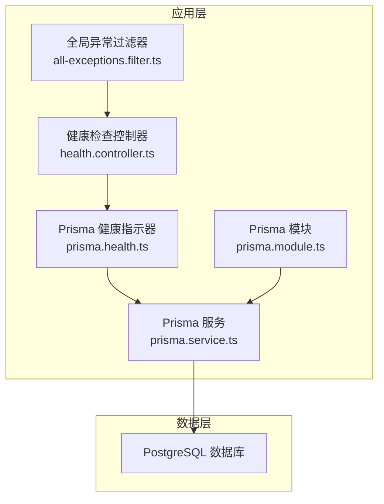
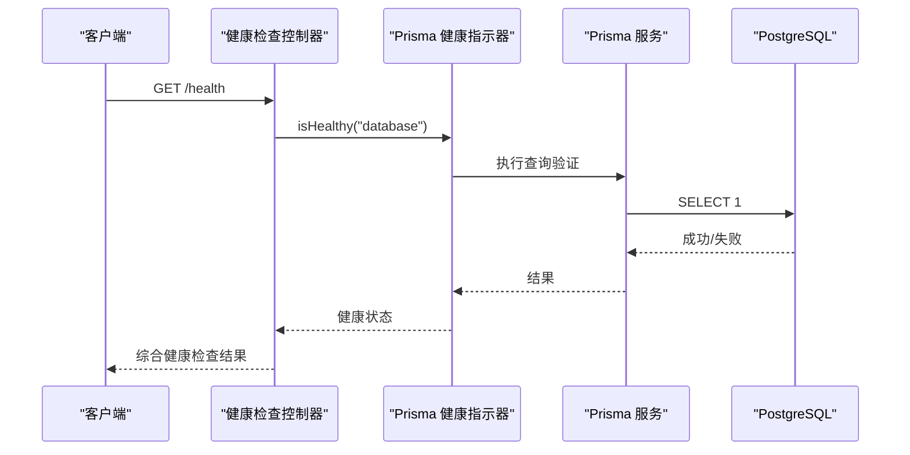
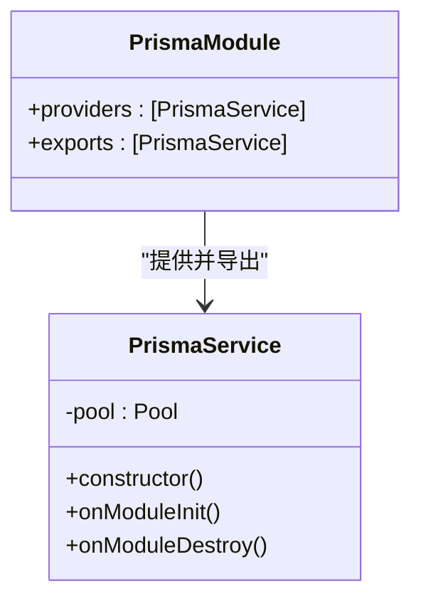
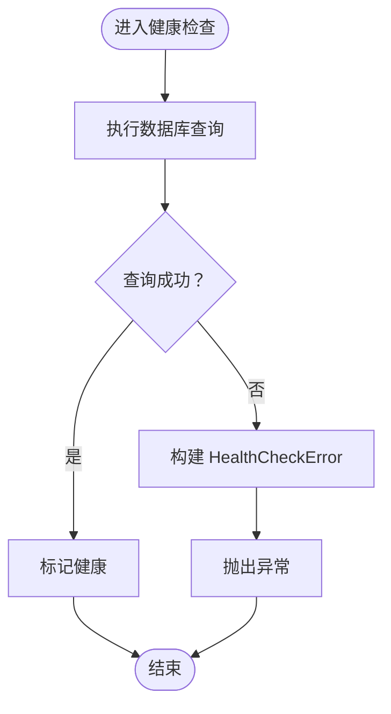
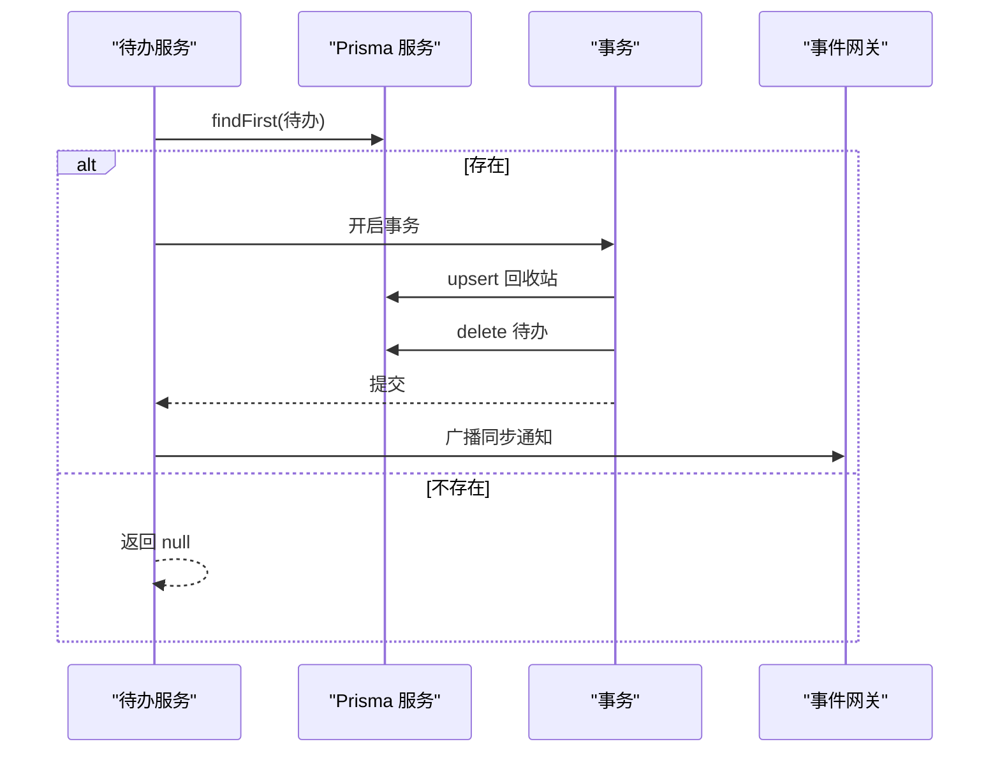
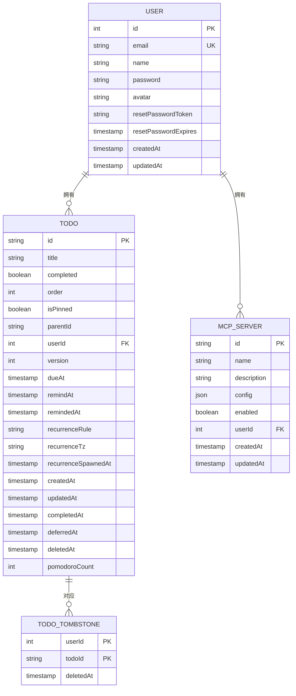
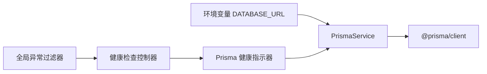

# 数据库问题

<cite>
**本文引用的文件**
- [apps/backend/prisma/schema/base.prisma](file://apps/backend/prisma/schema/base.prisma)
- [apps/backend/prisma/schema/todo.prisma](file://apps/backend/prisma/schema/todo.prisma)
- [apps/backend/prisma/schema/user.prisma](file://apps/backend/prisma/schema/user.prisma)
- [apps/backend/prisma/schema/mcp.prisma](file://apps/backend/prisma/schema/mcp.prisma)
- [apps/backend/src/prisma/prisma.service.ts](file://apps/backend/src/prisma/prisma.service.ts)
- [apps/backend/src/prisma/prisma.module.ts](file://apps/backend/src/prisma/prisma.module.ts)
- [apps/backend/src/health/prisma.health.ts](file://apps/backend/src/health/prisma.health.ts)
- [apps/backend/src/health/health.controller.ts](file://apps/backend/src/health/health.controller.ts)
- [apps/backend/src/common/filters/all-exceptions.filter.ts](file://apps/backend/src/common/filters/all-exceptions.filter.ts)
- [apps/backend/src/todos/todos.service.ts](file://apps/backend/src/todos/todos.service.ts)
- [apps/backend/src/users/users.service.ts](file://apps/backend/src/users/users.service.ts)
- [apps/backend/src/mcp/mcp-client.service.ts](file://apps/backend/src/mcp/mcp-client.service.ts)
</cite>

## 目录

1. [简介](#简介)
2. [项目结构](#项目结构)
3. [核心组件](#核心组件)
4. [架构总览](#架构总览)
5. [详细组件分析](#详细组件分析)
6. [依赖分析](#依赖分析)
7. [性能考虑](#性能考虑)
8. [故障排除指南](#故障排除指南)
9. [结论](#结论)
10. [附录](#附录)

## 简介

本指南聚焦 Lumina Todo 后端数据库相关问题的诊断与解决，覆盖数据库连接失败、查询超时、数据不一致、迁移失败等场景，并结合 Prisma ORM 在本项目中的使用方式，给出 Schema 定义、关系建模、事务处理、健康检查、异常过滤、备份恢复、索引优化、慢查询分析与连接池配置等实用建议。目标是帮助开发者在出现数据库问题时快速定位根因并采取有效措施。

## 项目结构

后端采用 NestJS + Prisma 架构，数据库通过 PostgreSQL 提供服务，Prisma 使用 @prisma/adapter-pg 与 pg.Pool 建立连接池，全局注入 PrismaService 并在模块生命周期内完成连接与断开。健康检查通过 @nestjs/terminus 对数据库进行连通性探测；全局异常过滤器统一输出标准化错误响应。

图表来源

- [apps/backend/src/health/health.controller.ts:19-79](file://apps/backend/src/health/health.controller.ts#L19-L79)
- [apps/backend/src/health/prisma.health.ts:10-31](file://apps/backend/src/health/prisma.health.ts#L10-L31)
- [apps/backend/src/prisma/prisma.service.ts:7-33](file://apps/backend/src/prisma/prisma.service.ts#L7-L33)
- [apps/backend/src/prisma/prisma.module.ts:1-10](file://apps/backend/src/prisma/prisma.module.ts#L1-L10)

章节来源

- [apps/backend/src/health/health.controller.ts:1-80](file://apps/backend/src/health/health.controller.ts#L1-L80)
- [apps/backend/src/health/prisma.health.ts:1-32](file://apps/backend/src/health/prisma.health.ts#L1-L32)
- [apps/backend/src/prisma/prisma.service.ts:1-34](file://apps/backend/src/prisma/prisma.service.ts#L1-L34)
- [apps/backend/src/prisma/prisma.module.ts:1-10](file://apps/backend/src/prisma/prisma.module.ts#L1-L10)

## 核心组件

- PrismaService：负责从环境变量读取 DATABASE_URL，创建 pg.Pool 并注入 Prisma 客户端，实现 OnModuleInit/OnModuleDestroy 生命周期内的连接与断开。
- Prisma 健康指示器：执行一次简单查询以验证数据库可用性。
- 健康检查控制器：聚合数据库、Redis、内存、磁盘健康检查，提供存活/就绪探针。
- 全局异常过滤器：统一记录错误日志并输出结构化错误响应，便于定位数据库相关异常。

章节来源

- [apps/backend/src/prisma/prisma.service.ts:1-34](file://apps/backend/src/prisma/prisma.service.ts#L1-L34)
- [apps/backend/src/health/prisma.health.ts:1-32](file://apps/backend/src/health/prisma.health.ts#L1-L32)
- [apps/backend/src/health/health.controller.ts:1-80](file://apps/backend/src/health/health.controller.ts#L1-L80)
- [apps/backend/src/common/filters/all-exceptions.filter.ts:1-137](file://apps/backend/src/common/filters/all-exceptions.filter.ts#L1-L137)

## 架构总览

下图展示数据库访问链路与健康检查流程：

图表来源

- [apps/backend/src/health/health.controller.ts:34-54](file://apps/backend/src/health/health.controller.ts#L34-L54)
- [apps/backend/src/health/prisma.health.ts:19-30](file://apps/backend/src/health/prisma.health.ts#L19-L30)
- [apps/backend/src/prisma/prisma.service.ts:23-25](file://apps/backend/src/prisma/prisma.service.ts#L23-L25)

## 详细组件分析

### 数据库连接与连接池

- 连接来源：从环境变量 DATABASE_URL 读取连接字符串，创建 pg.Pool 并通过 @prisma/adapter-pg 注入 Prisma。
- 生命周期：模块初始化时调用 $connect()，销毁时 $disconnect() 并关闭 pg.Pool。
- 连接池配置：当前实现未显式设置池大小、空闲超时等参数，如需优化可扩展构造函数以传入连接池选项。

图表来源

- [apps/backend/src/prisma/prisma.service.ts:7-33](file://apps/backend/src/prisma/prisma.service.ts#L7-L33)
- [apps/backend/src/prisma/prisma.module.ts:1-10](file://apps/backend/src/prisma/prisma.module.ts#L1-L10)

章节来源

- [apps/backend/src/prisma/prisma.service.ts:1-34](file://apps/backend/src/prisma/prisma.service.ts#L1-L34)
- [apps/backend/src/prisma/prisma.module.ts:1-10](file://apps/backend/src/prisma/prisma.module.ts#L1-L10)

### 健康检查与异常处理

- 健康检查：通过 $queryRaw 执行轻量查询验证数据库连通性，失败时抛出 HealthCheckError。
- 异常处理：全局过滤器记录请求 URL、状态码与堆栈，对 Zod 验证错误、HTTP 异常、业务冲突等进行结构化输出，便于定位数据库约束或唯一性冲突等问题。

图表来源

- [apps/backend/src/health/prisma.health.ts:19-30](file://apps/backend/src/health/prisma.health.ts#L19-L30)

章节来源

- [apps/backend/src/health/prisma.health.ts:1-32](file://apps/backend/src/health/prisma.health.ts#L1-L32)
- [apps/backend/src/common/filters/all-exceptions.filter.ts:1-137](file://apps/backend/src/common/filters/all-exceptions.filter.ts#L1-L137)

### 业务服务中的数据库操作

- 待办服务：使用 $transaction 包裹删除与回收站写入，确保一致性；支持按用户维度查询、排序与软删除。
- 用户服务：基于 Prisma 客户端进行查找、更新与创建，利用唯一索引避免重复邮箱。

图表来源

- [apps/backend/src/todos/todos.service.ts:97-107](file://apps/backend/src/todos/todos.service.ts#L97-L107)

章节来源

- [apps/backend/src/todos/todos.service.ts:1-147](file://apps/backend/src/todos/todos.service.ts#L1-L147)
- [apps/backend/src/users/users.service.ts:1-118](file://apps/backend/src/users/users.service.ts#L1-L118)

### Prisma Schema 与关系建模

- 数据源与生成器：使用 PostgreSQL 作为 provider，生成 Prisma 客户端。
- 用户模型：包含邮箱唯一性、密码与头像字段，关联待办与 MCP 服务器。
- 待办模型：软删除通过 deletedAt 字段实现，多维索引覆盖用户与时间字段；与用户建立外键关系。
- 回收站模型：联合主键记录被删除的待办，便于审计与恢复。
- MCP 服务器模型：与用户建立级联删除关系，确保用户删除时清理其服务器配置。

图表来源

- [apps/backend/prisma/schema/base.prisma:1-9](file://apps/backend/prisma/schema/base.prisma#L1-L9)
- [apps/backend/prisma/schema/user.prisma:1-16](file://apps/backend/prisma/schema/user.prisma#L1-L16)
- [apps/backend/prisma/schema/todo.prisma:1-40](file://apps/backend/prisma/schema/todo.prisma#L1-L40)
- [apps/backend/prisma/schema/mcp.prisma:1-16](file://apps/backend/prisma/schema/mcp.prisma#L1-L16)

章节来源

- [apps/backend/prisma/schema/base.prisma:1-9](file://apps/backend/prisma/schema/base.prisma#L1-L9)
- [apps/backend/prisma/schema/user.prisma:1-16](file://apps/backend/prisma/schema/user.prisma#L1-L16)
- [apps/backend/prisma/schema/todo.prisma:1-40](file://apps/backend/prisma/schema/todo.prisma#L1-L40)
- [apps/backend/prisma/schema/mcp.prisma:1-16](file://apps/backend/prisma/schema/mcp.prisma#L1-L16)

## 依赖分析

- PrismaService 依赖环境变量 DATABASE_URL 与 pg.Pool，通过适配器注入 Prisma 客户端。
- 健康检查控制器依赖 Prisma 健康指示器与 Redis 健康指示器，统一对外暴露健康状态。
- 全局异常过滤器在请求处理过程中拦截异常，输出结构化错误体，便于前端与运维定位问题。

图表来源

- [apps/backend/src/prisma/prisma.service.ts:10-21](file://apps/backend/src/prisma/prisma.service.ts#L10-L21)
- [apps/backend/src/health/health.controller.ts:22-28](file://apps/backend/src/health/health.controller.ts#L22-L28)
- [apps/backend/src/health/prisma.health.ts:11-12](file://apps/backend/src/health/prisma.health.ts#L11-L12)
- [apps/backend/src/common/filters/all-exceptions.filter.ts:27-45](file://apps/backend/src/common/filters/all-exceptions.filter.ts#L27-L45)

章节来源

- [apps/backend/src/prisma/prisma.service.ts:1-34](file://apps/backend/src/prisma/prisma.service.ts#L1-L34)
- [apps/backend/src/health/health.controller.ts:1-80](file://apps/backend/src/health/health.controller.ts#L1-L80)
- [apps/backend/src/health/prisma.health.ts:1-32](file://apps/backend/src/health/prisma.health.ts#L1-L32)
- [apps/backend/src/common/filters/all-exceptions.filter.ts:1-137](file://apps/backend/src/common/filters/all-exceptions.filter.ts#L1-L137)

## 性能考虑

- 连接池参数：当前实现未显式配置连接池大小、最大空闲、获取超时等参数。建议在生产环境为连接池增加合理上限与超时策略，避免连接争用与泄漏。
- 查询索引：待办模型已针对用户与时间字段建立复合索引，有助于高频查询与排序；可结合 EXPLAIN 分析热点 SQL 的索引命中情况。
- 事务边界：删除与回收站写入使用事务保证一致性，但应避免在事务中执行耗时操作，必要时拆分任务或异步化。
- 健康检查频率：健康检查应避免过于频繁导致数据库压力，建议在探针中设置合理的间隔与超时。

## 故障排除指南

### 一、数据库连接失败

- 症状
  - 应用启动时报错提示未设置 DATABASE_URL 或连接字符串无效。
  - 健康检查返回数据库不可用。
- 诊断步骤
  - 检查环境变量 DATABASE_URL 是否正确设置且可解析为有效的 PostgreSQL 连接串。
  - 使用健康检查端点验证数据库连通性。
  - 查看全局异常过滤器输出的错误日志，确认具体错误类型（网络、认证、权限）。
- 解决方案
  - 补充或修正 DATABASE_URL，确保协议、主机、端口、数据库名、用户名与密码正确。
  - 如使用容器编排，确认服务间网络可达与端口开放。
  - 若为云数据库，检查白名单与 TLS 设置。

章节来源

- [apps/backend/src/prisma/prisma.service.ts:10-21](file://apps/backend/src/prisma/prisma.service.ts#L10-L21)
- [apps/backend/src/health/prisma.health.ts:19-30](file://apps/backend/src/health/prisma.health.ts#L19-L30)
- [apps/backend/src/common/filters/all-exceptions.filter.ts:34-45](file://apps/backend/src/common/filters/all-exceptions.filter.ts#L34-L45)

### 二、查询超时

- 症状
  - 某些查询长时间无响应，最终超时。
- 诊断步骤
  - 结合业务服务中的查询路径，定位涉及的模型与索引使用情况。
  - 使用数据库 EXPLAIN 分析慢查询计划，确认是否命中预期索引。
- 解决方案
  - 为常用过滤与排序字段添加合适索引（如用户维度的 dueAt/remindAt 等）。
  - 优化查询条件，避免在 WHERE 中对索引列进行函数计算。
  - 调整连接池参数与查询超时阈值，避免误判。

章节来源

- [apps/backend/src/todos/todos.service.ts:38-47](file://apps/backend/src/todos/todos.service.ts#L38-L47)
- [apps/backend/prisma/schema/todo.prisma:24-28](file://apps/backend/prisma/schema/todo.prisma#L24-L28)

### 三、数据不一致

- 症状
  - 删除后仍可见或回收站缺失。
- 诊断步骤
  - 检查删除流程是否包裹在事务中，确认事务提交顺序与回滚路径。
  - 核对软删除字段 deletedAt 的写入时机与查询过滤条件。
- 解决方案
  - 确保删除与回收站写入在同一事务内执行，失败时整体回滚。
  - 对关键写入路径增加幂等校验（如 upsert 的条件与版本号）。

章节来源

- [apps/backend/src/todos/todos.service.ts:97-107](file://apps/backend/src/todos/todos.service.ts#L97-L107)
- [apps/backend/prisma/schema/todo.prisma:31-39](file://apps/backend/prisma/schema/todo.prisma#L31-L39)

### 四、迁移失败

- 症状
  - 执行迁移命令报错，无法应用最新变更。
- 诊断步骤
  - 检查 Prisma Schema 文件中模型与关系定义是否符合数据库现状。
  - 关注唯一性约束、外键依赖与索引变更引发的冲突。
- 解决方案
  - 在本地或测试环境先预演迁移，逐步调整 Schema 与数据。
  - 对于破坏性变更，优先准备回滚脚本与数据备份。

章节来源

- [apps/backend/prisma/schema/base.prisma:1-9](file://apps/backend/prisma/schema/base.prisma#L1-L9)
- [apps/backend/prisma/schema/user.prisma:1-16](file://apps/backend/prisma/schema/user.prisma#L1-L16)
- [apps/backend/prisma/schema/todo.prisma:1-40](file://apps/backend/prisma/schema/todo.prisma#L1-L40)
- [apps/backend/prisma/schema/mcp.prisma:1-16](file://apps/backend/prisma/schema/mcp.prisma#L1-L16)

### 五、Prisma ORM 常见问题

- Schema 定义错误
  - 症状：生成客户端报错或运行时报字段/模型不存在。
  - 处理：核对模型字段类型、关系与索引定义，确保与数据库一致。
- 数据模型关系问题
  - 症状：外键约束冲突、删除行为不符合预期。
  - 处理：检查 onDelete/Cascade 等关系属性，确保与业务一致。
- 事务处理异常
  - 症状：部分写入成功、部分失败。
  - 处理：将相关写入放入同一事务，捕获异常并回滚。

章节来源

- [apps/backend/prisma/schema/user.prisma:11-12](file://apps/backend/prisma/schema/user.prisma#L11-L12)
- [apps/backend/prisma/schema/mcp.prisma:11-11](file://apps/backend/prisma/schema/mcp.prisma#L11-L11)
- [apps/backend/src/todos/todos.service.ts:97-107](file://apps/backend/src/todos/todos.service.ts#L97-L107)

### 六、备份与恢复

- 备份策略
  - 使用数据库自带工具进行全量/增量备份，定期验证备份完整性。
  - 对关键业务表（如用户、待办、回收站）制定差异备份计划。
- 恢复流程
  - 在隔离环境中验证备份可用性，再进行生产恢复。
  - 恢复后执行健康检查与关键查询回归测试。

[本节为通用实践指导，无需特定文件引用]

### 七、数据修复

- 软删除修复：若回收站缺失或数据残留，可通过批量 upsert 回收站条目并清理冗余数据。
- 唯一性冲突：当邮箱重复导致创建失败时，先清理重复项再重试创建。
- 版本冲突：在同步场景中，遵循服务端版本号进行合并或重试。

章节来源

- [apps/backend/src/todos/todos.service.ts:97-107](file://apps/backend/src/todos/todos.service.ts#L97-L107)
- [apps/backend/src/users/users.service.ts:96-103](file://apps/backend/src/users/users.service.ts#L96-L103)

### 八、索引优化

- 建议
  - 为用户维度的高频过滤字段（如 dueAt、remindAt、deletedAt）建立复合索引。
  - 定期分析索引使用率，移除未使用的索引以降低写入开销。
- 验证
  - 使用 EXPLAIN 分析查询计划，确认索引被正确使用。

章节来源

- [apps/backend/prisma/schema/todo.prisma:24-28](file://apps/backend/prisma/schema/todo.prisma#L24-L28)

### 九、慢查询分析与连接池配置

- 慢查询分析
  - 在数据库侧启用慢查询日志，定位耗时 SQL。
  - 结合业务服务中的查询路径，识别热点接口与模型。
- 连接池配置
  - 当前实现未显式设置连接池参数，建议在生产环境增加池大小、空闲超时、获取超时等配置，避免连接争用与泄漏。

章节来源

- [apps/backend/src/prisma/prisma.service.ts:17-21](file://apps/backend/src/prisma/prisma.service.ts#L17-L21)

## 结论

本指南围绕 Lumina Todo 的数据库与 Prisma 使用，提供了从连接、健康检查、异常处理到事务、索引与性能优化的系统化排查思路。建议在生产环境中完善连接池参数、索引策略与备份恢复流程，并持续通过健康检查与日志定位问题，确保系统的稳定性与可维护性。

## 附录

- 健康检查端点
  - 综合健康检查：GET /health
  - 存活探针：GET /health/liveness
  - 就绪探针：GET /health/readiness
- 关键环境变量
  - DATABASE_URL：数据库连接字符串

章节来源

- [apps/backend/src/health/health.controller.ts:34-78](file://apps/backend/src/health/health.controller.ts#L34-L78)
- [apps/backend/src/prisma/prisma.service.ts:10-21](file://apps/backend/src/prisma/prisma.service.ts#L10-L21)
