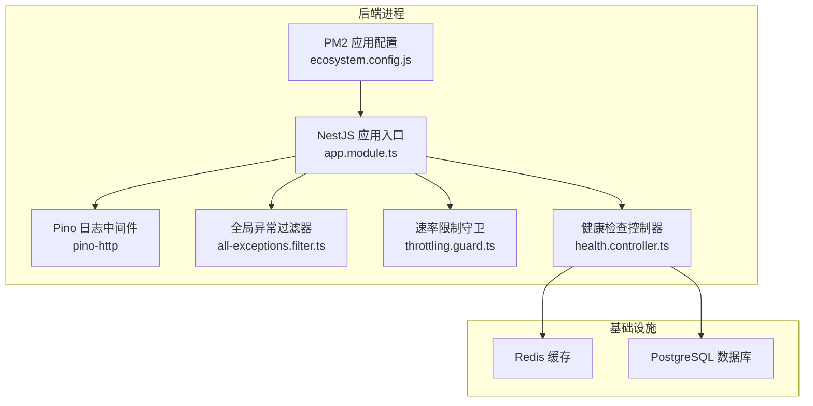
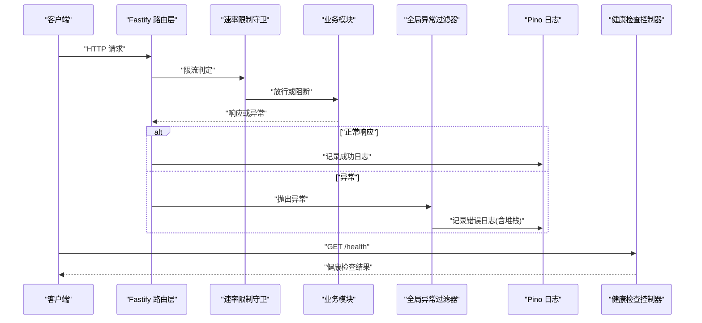
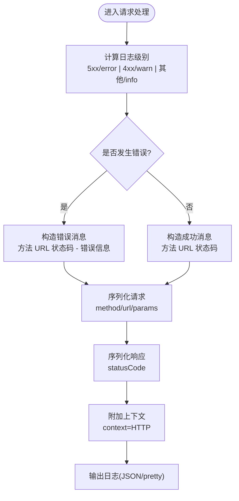
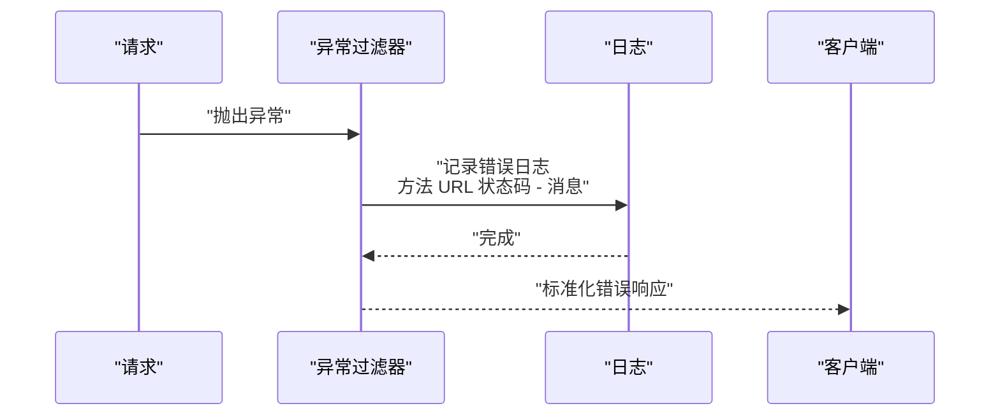
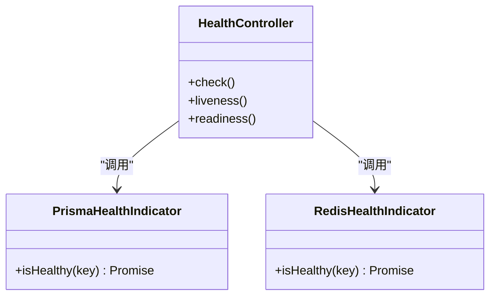
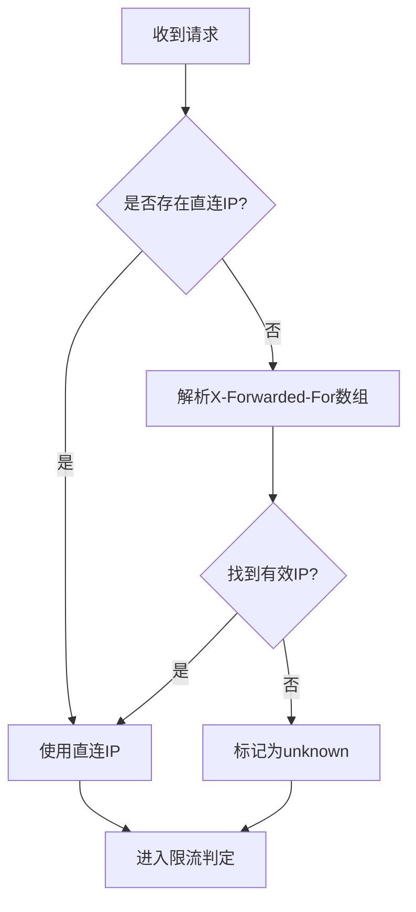
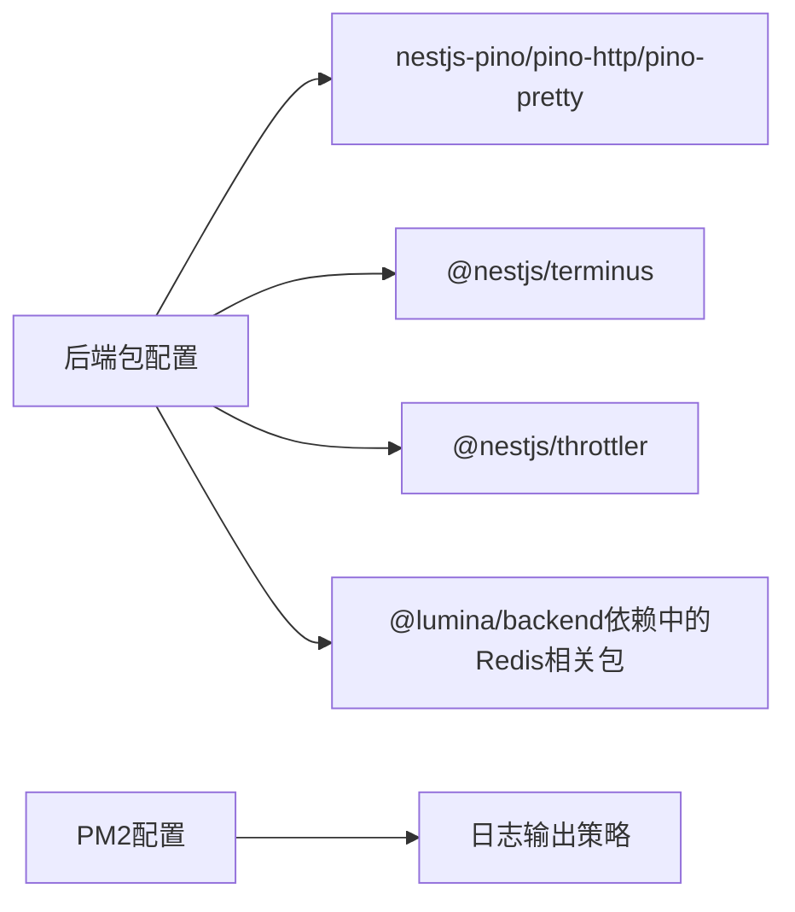

# 日志分析

<cite>
**本文引用的文件**
- [apps/backend/src/app.module.ts](file://apps/backend/src/app.module.ts)
- [apps/backend/src/common/filters/all-exceptions.filter.ts](file://apps/backend/src/common/filters/all-exceptions.filter.ts)
- [apps/backend/src/health/health.controller.ts](file://apps/backend/src/health/health.controller.ts)
- [apps/backend/src/health/prisma.health.ts](file://apps/backend/src/health/prisma.health.ts)
- [apps/backend/src/redis/redis.health.ts](file://apps/backend/src/redis/redis.health.ts)
- [apps/backend/src/common/throttling/throttling.constants.ts](file://apps/backend/src/common/throttling/throttling.constants.ts)
- [apps/backend/src/common/throttling/throttling.guard.ts](file://apps/backend/src/common/throttling/throttling.guard.ts)
- [apps/backend/src/prisma/prisma.service.ts](file://apps/backend/src/prisma/prisma.service.ts)
- [apps/backend/package.json](file://apps/backend/package.json)
- [package.json](file://package.json)
- [ecosystem.config.js](file://ecosystem.config.js)
- [apps/backend/tests/setup.ts](file://apps/backend/tests/setup.ts)
</cite>

## 目录

1. [简介](#简介)
2. [项目结构](#项目结构)
3. [核心组件](#核心组件)
4. [架构总览](#架构总览)
5. [详细组件分析](#详细组件分析)
6. [依赖分析](#依赖分析)
7. [性能考量](#性能考量)
8. [故障排除指南](#故障排除指南)
9. [结论](#结论)
10. [附录](#附录)

## 简介

本指南面向Lumina Todo后端服务的运维与开发人员，聚焦于如何高效利用系统日志进行问题定位与根因分析。文档覆盖日志级别与字段解读、日志聚合与搜索技巧、常见错误模式识别、异常堆栈分析、性能瓶颈追踪，以及日志监控配置、告警规则与日志清理策略等运维最佳实践。

## 项目结构

后端采用NestJS + Fastify + Pino日志框架，结合PM2进程管理与Docker部署。日志在生产环境以JSON格式输出，开发环境以人类可读格式输出；全局异常过滤器统一记录错误上下文；健康检查端点提供数据库、缓存与资源使用状态；速率限制守卫基于Redis实现并支持代理场景下的真实客户端IP追踪。

图表来源

- [apps/backend/src/app.module.ts:36-89](file://apps/backend/src/app.module.ts#L36-L89)
- [apps/backend/src/common/filters/all-exceptions.filter.ts:17-45](file://apps/backend/src/common/filters/all-exceptions.filter.ts#L17-L45)
- [apps/backend/src/health/health.controller.ts:19-79](file://apps/backend/src/health/health.controller.ts#L19-L79)
- [ecosystem.config.js:5-32](file://ecosystem.config.js#L5-L32)

章节来源

- [apps/backend/src/app.module.ts:28-160](file://apps/backend/src/app.module.ts#L28-L160)
- [ecosystem.config.js:1-32](file://ecosystem.config.js#L1-L32)

## 核心组件

- Pino日志模块：按环境动态选择输出格式，自定义请求日志级别与消息格式，序列化请求/响应关键字段，并对健康检查端点进行日志排除。
- 全局异常过滤器：统一记录HTTP方法、URL、状态码与错误堆栈，支持国际化错误消息与结构化字段映射。
- 健康检查控制器：组合数据库、Redis、内存与磁盘健康指标，提供存活与就绪探针。
- 速率限制守卫：在代理场景下从XFF链路提取真实客户端IP，避免限流误伤。
- PM2进程管理：集中管理日志输出位置、日期格式与合并策略，便于容器化部署。

章节来源

- [apps/backend/src/app.module.ts:36-89](file://apps/backend/src/app.module.ts#L36-L89)
- [apps/backend/src/common/filters/all-exceptions.filter.ts:17-137](file://apps/backend/src/common/filters/all-exceptions.filter.ts#L17-L137)
- [apps/backend/src/health/health.controller.ts:19-79](file://apps/backend/src/health/health.controller.ts#L19-L79)
- [apps/backend/src/common/throttling/throttling.guard.ts:29-34](file://apps/backend/src/common/throttling/throttling.guard.ts#L29-L34)
- [ecosystem.config.js:5-32](file://ecosystem.config.js#L5-L32)

## 架构总览

下图展示日志在系统中的流向与关键落点：

图表来源

- [apps/backend/src/app.module.ts:56-86](file://apps/backend/src/app.module.ts#L56-L86)
- [apps/backend/src/common/filters/all-exceptions.filter.ts:27-45](file://apps/backend/src/common/filters/all-exceptions.filter.ts#L27-L45)
- [apps/backend/src/health/health.controller.ts:34-54](file://apps/backend/src/health/health.controller.ts#L34-L54)

## 详细组件分析

### 日志模块与级别

- 级别策略：根据HTTP状态码与错误存在性自动提升级别；5xx错误与异常一律记为error，4xx记为warn，其他info。
- 输出格式：生产环境输出JSON，便于结构化采集；开发环境使用pino-pretty增强可读性。
- 请求/响应序列化：仅保留method、url、params、statusCode等关键字段，降低冗余。
- 上下文标记：为每条HTTP日志附加context字段，便于聚合检索。
- 健康检查日志排除：通过autoLogging.ignore策略避免频繁探针污染日志。

图表来源

- [apps/backend/src/app.module.ts:56-86](file://apps/backend/src/app.module.ts#L56-L86)

章节来源

- [apps/backend/src/app.module.ts:36-89](file://apps/backend/src/app.module.ts#L36-L89)

### 全局异常过滤器

- 记录维度：HTTP方法、路径、状态码、错误消息与完整堆栈。
- 国际化与结构化：对验证类错误与业务异常进行字段级映射与翻译，输出结构化errors对象。
- 统一响应：返回success=false、data=null、带timestamp的标准错误体，便于日志侧关联。

图表来源

- [apps/backend/src/common/filters/all-exceptions.filter.ts:27-45](file://apps/backend/src/common/filters/all-exceptions.filter.ts#L27-L45)

章节来源

- [apps/backend/src/common/filters/all-exceptions.filter.ts:17-137](file://apps/backend/src/common/filters/all-exceptions.filter.ts#L17-L137)

### 健康检查与依赖状态

- 综合健康：数据库、Redis、内存堆与RSS、磁盘使用率。
- 存活/就绪：分别用于容器编排的存活与就绪探测，快速判断服务可用性。
- Redis健康：通过一次写读操作验证连通性与一致性。
- Prisma健康：执行简单查询确认数据库可用。

图表来源

- [apps/backend/src/health/health.controller.ts:22-79](file://apps/backend/src/health/health.controller.ts#L22-L79)
- [apps/backend/src/health/prisma.health.ts:10-31](file://apps/backend/src/health/prisma.health.ts#L10-L31)
- [apps/backend/src/redis/redis.health.ts:11-43](file://apps/backend/src/redis/redis.health.ts#L11-L43)

章节来源

- [apps/backend/src/health/health.controller.ts:19-79](file://apps/backend/src/health/health.controller.ts#L19-L79)
- [apps/backend/src/health/prisma.health.ts:10-31](file://apps/backend/src/health/prisma.health.ts#L10-L31)
- [apps/backend/src/redis/redis.health.ts:11-43](file://apps/backend/src/redis/redis.health.ts#L11-L43)

### 速率限制与代理IP追踪

- 代理IP解析：优先使用直连ip，否则回退到X-Forwarded-For链末端的有效IP。
- 全局限流策略：短、中、长窗口的TTL与限额可通过环境变量覆盖，支持跳过特定端点（如健康检查）。
- 与日志联动：限流触发通常伴随warn/error级别日志，便于定位攻击源IP与频率模式。

图表来源

- [apps/backend/src/common/throttling/throttling.guard.ts:29-34](file://apps/backend/src/common/throttling/throttling.guard.ts#L29-L34)
- [apps/backend/src/common/throttling/throttling.constants.ts:162-197](file://apps/backend/src/common/throttling/throttling.constants.ts#L162-L197)

章节来源

- [apps/backend/src/common/throttling/throttling.guard.ts:29-34](file://apps/backend/src/common/throttling/throttling.guard.ts#L29-L34)
- [apps/backend/src/common/throttling/throttling.constants.ts:173-197](file://apps/backend/src/common/throttling/throttling.constants.ts#L173-L197)

### PM2日志与容器化

- PM2配置：区分Docker与本地环境的日志输出目标，容器内直接输出到标准流，避免I/O开销。
- 日志格式：统一时间格式，合并多实例日志，便于集中采集。
- 后端脚本：提供pm2:logs命令，便于快速查看后端应用日志。

章节来源

- [ecosystem.config.js:5-32](file://ecosystem.config.js#L5-L32)
- [apps/backend/package.json:15-25](file://apps/backend/package.json#L15-L25)
- [package.json:76-76](file://package.json#L76-L76)

## 依赖分析

- 日志依赖：nestjs-pino、pino-http、pino-pretty。
- 健康检查：@nestjs/terminus、Prisma、cache-manager + Redis。
- 速率限制：@nestjs/throttler + Redis存储。
- 进程管理：PM2（ecosystem.config.js）。

图表来源

- [apps/backend/package.json:31-87](file://apps/backend/package.json#L31-L87)
- [ecosystem.config.js:5-32](file://ecosystem.config.js#L5-L32)

章节来源

- [apps/backend/package.json:31-87](file://apps/backend/package.json#L31-L87)
- [ecosystem.config.js:5-32](file://ecosystem.config.js#L5-L32)

## 性能考量

- 日志级别与消息：仅记录必要字段，避免序列化大型对象；错误消息包含堆栈但应控制异常频率。
- 健康检查：探针端点不应产生大量日志；当前已通过autoLogging.ignore策略减少干扰。
- 速率限制：合理设置短/中/长窗口的TTL与限额，避免误伤正常用户；代理场景需确保XFF链正确。
- 数据库与缓存：Redis与数据库健康检查应定期执行，避免长时间不可用导致的连锁错误。

[本节为通用指导，无需列出具体文件来源]

## 故障排除指南

### 日志级别与字段解读

- 级别选择
  - info：常规请求成功响应（2xx/3xx）。
  - warn：客户端错误（4xx），如鉴权失败、参数校验失败。
  - error：服务端错误（5xx）与异常抛出。
- 关键字段
  - 时间戳：用于定位时间段与排序。
  - 方法/URL：快速识别接口与路径。
  - 状态码：区分成功、客户端错误、服务端错误。
  - 上下文：context=HTTP，便于筛选HTTP类日志。
  - 错误消息与堆栈：定位异常类型与调用链。

章节来源

- [apps/backend/src/app.module.ts:56-86](file://apps/backend/src/app.module.ts#L56-L86)
- [apps/backend/src/common/filters/all-exceptions.filter.ts:37-45](file://apps/backend/src/common/filters/all-exceptions.filter.ts#L37-L45)

### 常见错误模式与日志特征

- 鉴权失败
  - 特征：401/403，错误消息包含无效凭证/刷新令牌等关键字。
  - 日志：全局异常过滤器记录方法、URL、状态码与消息。
- 频繁触发限流
  - 特征：429，错误消息包含“请求过多”等国际化文案。
  - 日志：Pino记录请求上下文，结合速率限制策略定位来源IP。
- 数据库/缓存不可用
  - 特征：健康检查失败，数据库/Redis健康指标异常。
  - 日志：Prisma/Redis健康指示器抛出HealthCheckError，包含错误消息。
- 参数校验失败
  - 特征：400，响应体errors包含字段级错误映射。
  - 日志：异常过滤器将Zod错误转换为结构化字段映射并记录。

章节来源

- [apps/backend/src/common/filters/all-exceptions.filter.ts:52-117](file://apps/backend/src/common/filters/all-exceptions.filter.ts#L52-L117)
- [apps/backend/src/health/prisma.health.ts:20-30](file://apps/backend/src/health/prisma.health.ts#L20-L30)
- [apps/backend/src/redis/redis.health.ts:20-41](file://apps/backend/src/redis/redis.health.ts#L20-L41)
- [apps/backend/src/common/throttling/throttling.constants.ts:173-197](file://apps/backend/src/common/throttling/throttling.constants.ts#L173-L197)

### 异常堆栈分析

- 定位异常来源：优先查看全局异常过滤器记录的错误消息与堆栈。
- 字段映射：关注结构化errors对象，快速定位问题字段。
- 国际化：若消息为键名，需结合i18n上下文理解实际含义。

章节来源

- [apps/backend/src/common/filters/all-exceptions.filter.ts:27-137](file://apps/backend/src/common/filters/all-exceptions.filter.ts#L27-L137)

### 性能瓶颈日志追踪

- 高延迟请求：结合Pino日志中的URL与状态码，筛选慢请求并关联上游依赖（数据库/缓存）。
- 限流风暴：观察429日志分布，结合速率限制策略与代理IP解析，识别攻击源或客户端配置问题。
- 健康检查波动：关注数据库/Redis健康检查的失败时间点，排查连接池与网络抖动。

章节来源

- [apps/backend/src/app.module.ts:56-86](file://apps/backend/src/app.module.ts#L56-L86)
- [apps/backend/src/common/throttling/throttling.guard.ts:29-34](file://apps/backend/src/common/throttling/throttling.guard.ts#L29-L34)
- [apps/backend/src/health/health.controller.ts:34-54](file://apps/backend/src/health/health.controller.ts#L34-L54)

### 日志聚合与搜索技巧

- 结构化字段：优先按context=HTTP、状态码、方法、URL进行筛选。
- 时间范围：结合PM2统一时间格式，限定时间段排查。
- 关键字：针对鉴权失败、限流、健康检查失败等场景建立关键字索引。
- 测试环境抑制：测试脚本已抑制部分噪声日志，避免干扰。

章节来源

- [apps/backend/src/app.module.ts:56-86](file://apps/backend/src/app.module.ts#L56-L86)
- [apps/backend/tests/setup.ts:3-39](file://apps/backend/tests/setup.ts#L3-L39)

### 日志监控与告警规则建议

- 告警规则（示例）
  - 错误级别阈值：error级别日志在5分钟内超过阈值。
  - 4xx异常比例：客户端错误占比异常升高。
  - 429限流：短时间大量429告警。
  - 健康检查失败：数据库/Redis连续失败或成功率骤降。
  - 响应时间：P95/P99响应时间超阈值。
- 可视化：按方法/URL/状态码/来源IP聚合，定位热点接口与异常来源。
- 通知：结合PM2日志与集中式日志平台（如ELK/Vector/Loki+Grafana）实现告警推送。

[本节为通用指导，无需列出具体文件来源]

### 日志清理策略

- 容器化部署：日志输出至标准流，由平台接管轮转与清理。
- 本地开发：PM2配置合并日志，避免磁盘膨胀；定期清理历史日志。
- 建议：按天/周归档，保留最近30天的错误级别日志用于审计与复盘。

[本节为通用指导，无需列出具体文件来源]

## 结论

通过统一的日志级别策略、结构化的字段设计与全局异常过滤器，Lumina Todo后端具备了良好的可观测性基础。结合健康检查与速率限制机制，可在生产环境中快速定位异常、识别攻击与性能瓶颈。配合合理的监控告警与日志清理策略，可显著提升问题定位效率与系统稳定性。

[本节为总结性内容，无需列出具体文件来源]

## 附录

### 关键日志字段速查

- 时间戳：用于排序与区间检索。
- 方法/URL：接口路径与端点。
- 状态码：响应状态。
- 上下文：HTTP。
- 来源IP：代理场景下由速率限制守卫解析的真实客户端IP。
- 错误消息/堆栈：异常详情与调用链。

章节来源

- [apps/backend/src/app.module.ts:56-86](file://apps/backend/src/app.module.ts#L56-L86)
- [apps/backend/src/common/throttling/throttling.guard.ts:29-34](file://apps/backend/src/common/throttling/throttling.guard.ts#L29-L34)
- [apps/backend/src/common/filters/all-exceptions.filter.ts:37-45](file://apps/backend/src/common/filters/all-exceptions.filter.ts#L37-L45)
