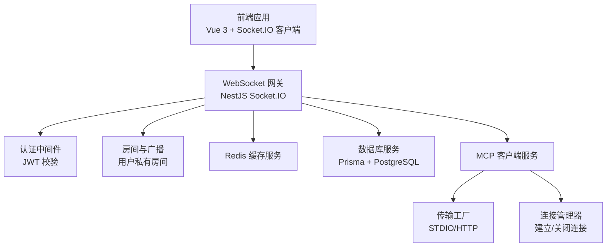
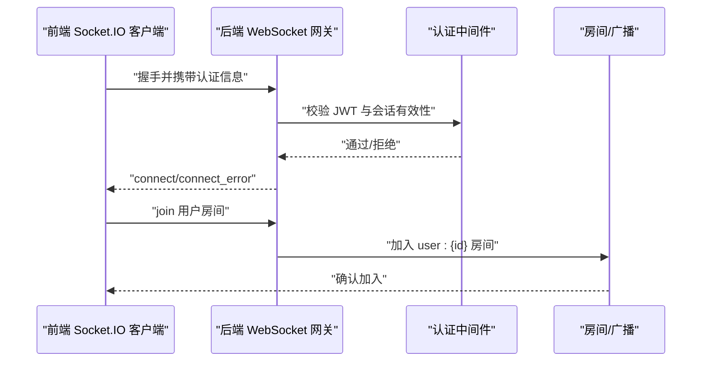
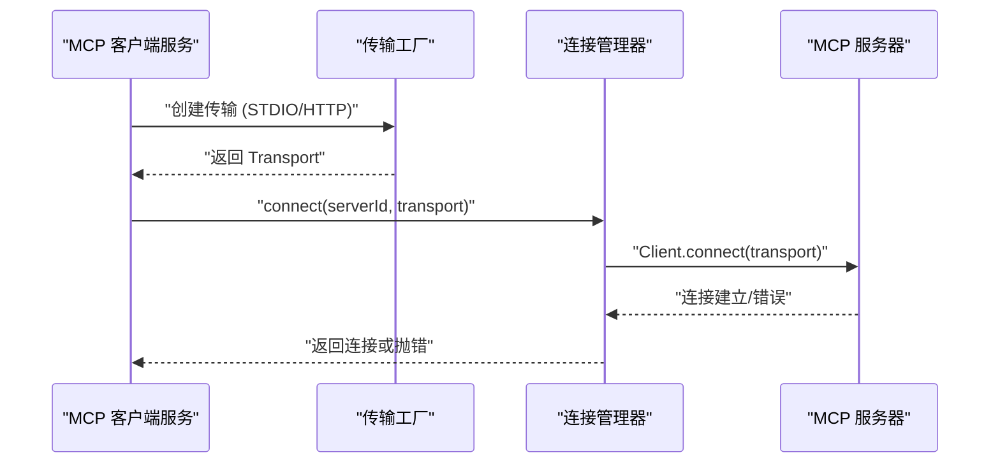
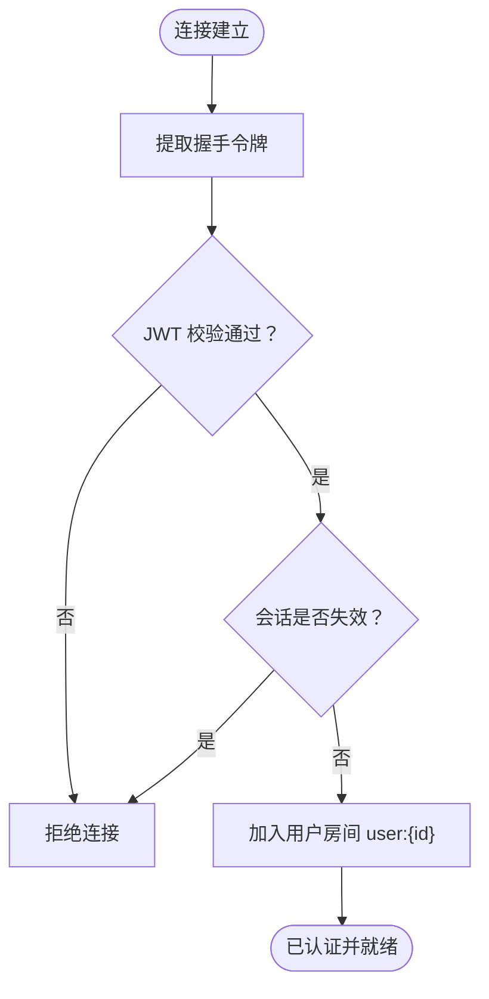
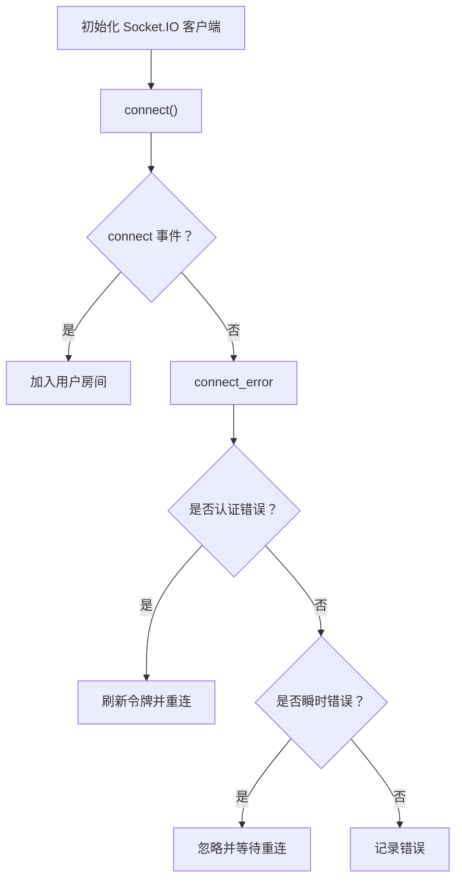
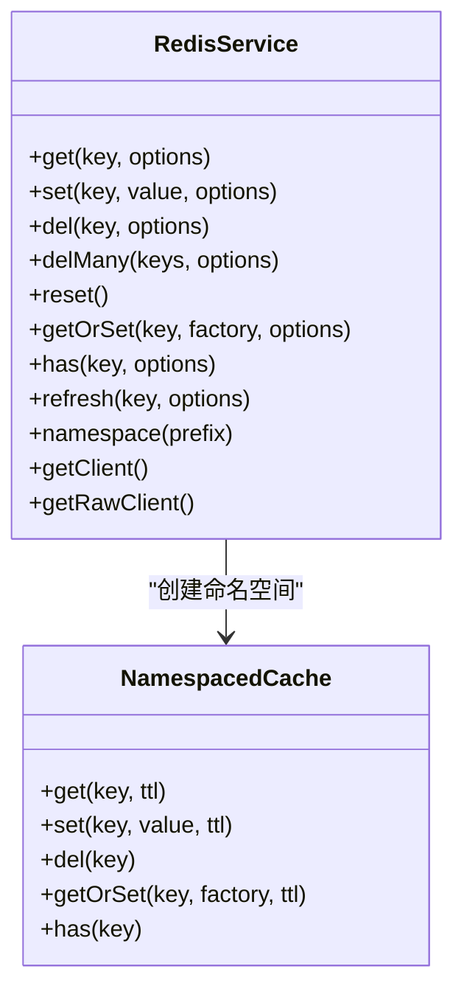
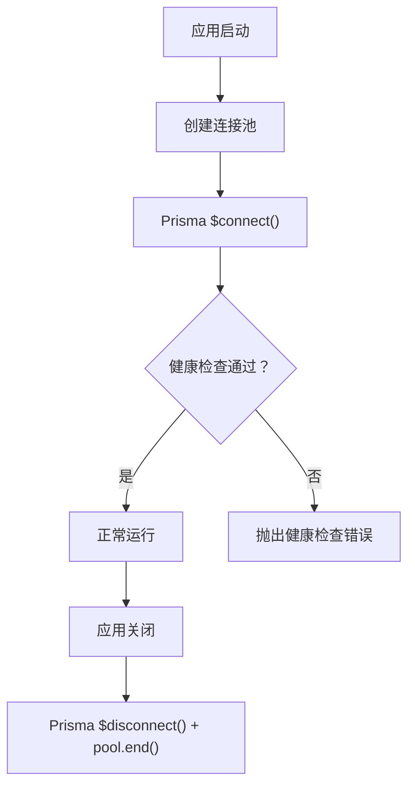
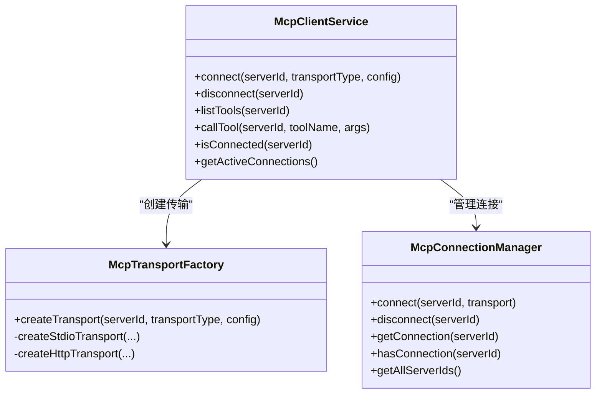
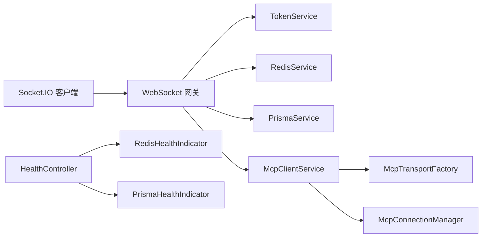

# 连接问题

<cite>
**本文引用的文件**
- [apps/backend/src/events/events.gateway.ts](file://apps/backend/src/events/events.gateway.ts)
- [apps/frontend/src/composables/useSocket.ts](file://apps/frontend/src/composables/useSocket.ts)
- [apps/frontend/src/composables/useSocket.errors.ts](file://apps/frontend/src/composables/useSocket.errors.ts)
- [apps/backend/src/redis/redis.service.ts](file://apps/backend/src/redis/redis.service.ts)
- [apps/backend/src/redis/redis.health.ts](file://apps/backend/src/redis/redis.health.ts)
- [apps/backend/src/prisma/prisma.service.ts](file://apps/backend/src/prisma/prisma.service.ts)
- [apps/backend/src/health/prisma.health.ts](file://apps/backend/src/health/prisma.health.ts)
- [apps/backend/src/health/health.controller.ts](file://apps/backend/src/health/health.controller.ts)
- [apps/backend/src/mcp/mcp-client.service.ts](file://apps/backend/src/mcp/mcp-client.service.ts)
- [apps/backend/src/mcp/core/mcp-connection.manager.ts](file://apps/backend/src/mcp/core/mcp-connection.manager.ts)
- [apps/backend/src/mcp/core/mcp-transport.factory.ts](file://apps/backend/src/mcp/core/mcp-transport.factory.ts)
- [apps/backend/src/mcp/mcp.dto.ts](file://apps/backend/src/mcp/mcp.dto.ts)
- [apps/backend/src/common/filters/all-exceptions.filter.ts](file://apps/backend/src/common/filters/all-exceptions.filter.ts)
</cite>

## 目录
1. [简介](#简介)
2. [项目结构](#项目结构)
3. [核心组件](#核心组件)
4. [架构总览](#架构总览)
5. [详细组件分析](#详细组件分析)
6. [依赖关系分析](#依赖关系分析)
7. [性能考量](#性能考量)
8. [故障排除指南](#故障排除指南)
9. [结论](#结论)
10. [附录](#附录)

## 简介
本指南聚焦 Lumina Todo 的连接问题诊断与修复，覆盖以下场景：
- WebSocket 连接失败与认证失败
- Redis 连接异常与健康检查
- 数据库连接中断与健康检查
- MCP 工具连接问题（STDIO/HTTP 传输）
- 连接超时、网络不稳定、跨域与重连机制
- 前后端连接问题区分与针对性排查步骤

目标是帮助开发者与运维人员快速定位问题根因，并给出可操作的修复建议。

## 项目结构
Lumina Todo 采用前后端分离架构：
- 前端基于 Vue 3 + Vite，使用 Socket.IO 客户端进行实时通信与重连。
- 后端基于 NestJS，提供 WebSocket 网关、Redis 缓存、PostgreSQL 数据库、MCP 工具集成与健康检查端点。

图表来源
- [apps/backend/src/events/events.gateway.ts:20-56](file://apps/backend/src/events/events.gateway.ts#L20-L56)
- [apps/frontend/src/composables/useSocket.ts:56-120](file://apps/frontend/src/composables/useSocket.ts#L56-L120)
- [apps/backend/src/redis/redis.service.ts:62-87](file://apps/backend/src/redis/redis.service.ts#L62-L87)
- [apps/backend/src/prisma/prisma.service.ts:6-21](file://apps/backend/src/prisma/prisma.service.ts#L6-L21)
- [apps/backend/src/mcp/mcp-client.service.ts:17-28](file://apps/backend/src/mcp/mcp-client.service.ts#L17-L28)
- [apps/backend/src/mcp/core/mcp-transport.factory.ts:10-26](file://apps/backend/src/mcp/core/mcp-transport.factory.ts#L10-L26)
- [apps/backend/src/mcp/core/mcp-connection.manager.ts:12-21](file://apps/backend/src/mcp/core/mcp-connection.manager.ts#L12-L21)

章节来源
- [apps/backend/src/events/events.gateway.ts:16-56](file://apps/backend/src/events/events.gateway.ts#L16-L56)
- [apps/frontend/src/composables/useSocket.ts:56-120](file://apps/frontend/src/composables/useSocket.ts#L56-L120)
- [apps/backend/src/redis/redis.service.ts:62-87](file://apps/backend/src/redis/redis.service.ts#L62-L87)
- [apps/backend/src/prisma/prisma.service.ts:6-21](file://apps/backend/src/prisma/prisma.service.ts#L6-L21)
- [apps/backend/src/mcp/mcp-client.service.ts:17-28](file://apps/backend/src/mcp/mcp-client.service.ts#L17-L28)
- [apps/backend/src/mcp/core/mcp-transport.factory.ts:10-26](file://apps/backend/src/mcp/core/mcp-transport.factory.ts#L10-L26)
- [apps/backend/src/mcp/core/mcp-connection.manager.ts:12-21](file://apps/backend/src/mcp/core/mcp-connection.manager.ts#L12-L21)

## 核心组件
- WebSocket 网关：负责 CORS、认证、房间管理与广播。
- Socket.IO 客户端：负责连接、重连、认证失败自动刷新令牌。
- Redis 服务：统一缓存接口、命名空间、健康检查。
- 数据库服务：Prisma + PostgreSQL，模块化初始化与销毁。
- MCP 客户端：封装传输工厂与连接管理器，支持 STDIO/HTTP。
- 健康检查控制器：统一对外暴露健康/存活/就绪探针。

章节来源
- [apps/backend/src/events/events.gateway.ts:57-145](file://apps/backend/src/events/events.gateway.ts#L57-L145)
- [apps/frontend/src/composables/useSocket.ts:56-120](file://apps/frontend/src/composables/useSocket.ts#L56-L120)
- [apps/backend/src/redis/redis.service.ts:62-224](file://apps/backend/src/redis/redis.service.ts#L62-L224)
- [apps/backend/src/prisma/prisma.service.ts:6-33](file://apps/backend/src/prisma/prisma.service.ts#L6-L33)
- [apps/backend/src/mcp/mcp-client.service.ts:17-123](file://apps/backend/src/mcp/mcp-client.service.ts#L17-L123)
- [apps/backend/src/health/health.controller.ts:18-79](file://apps/backend/src/health/health.controller.ts#L18-L79)

## 架构总览
WebSocket 与 MCP 的连接流程如下：

图表来源
- [apps/backend/src/events/events.gateway.ts:86-145](file://apps/backend/src/events/events.gateway.ts#L86-L145)
- [apps/frontend/src/composables/useSocket.ts:79-108](file://apps/frontend/src/composables/useSocket.ts#L79-L108)

MCP 连接流程如下：

图表来源
- [apps/backend/src/mcp/mcp-client.service.ts:33-47](file://apps/backend/src/mcp/mcp-client.service.ts#L33-L47)
- [apps/backend/src/mcp/core/mcp-transport.factory.ts:112-126](file://apps/backend/src/mcp/core/mcp-transport.factory.ts#L112-L126)
- [apps/backend/src/mcp/core/mcp-connection.manager.ts:23-73](file://apps/backend/src/mcp/core/mcp-connection.manager.ts#L23-L73)

## 详细组件分析

### WebSocket 网关与认证
- CORS 支持多源与开发环境特殊协议；显式允许授权头与凭据。
- 认证中间件从握手处提取令牌，验证后写入 socket.data.user。
- 会话失效检查：若用户会话被标记失效，拒绝连接。
- 房间策略：仅允许进入“user:{id}”房间，防止越权。

图表来源
- [apps/backend/src/events/events.gateway.ts:86-145](file://apps/backend/src/events/events.gateway.ts#L86-L145)

章节来源
- [apps/backend/src/events/events.gateway.ts:20-56](file://apps/backend/src/events/events.gateway.ts#L20-L56)
- [apps/backend/src/events/events.gateway.ts:86-145](file://apps/backend/src/events/events.gateway.ts#L86-L145)

### Socket.IO 客户端与重连
- 自动连接、轮询与 WebSocket 双栈传输优先级。
- 连接错误分类：认证错误与瞬时错误。
- 认证错误触发令牌刷新并重连。
- 提供等待连接完成的 Promise 化工具。

图表来源
- [apps/frontend/src/composables/useSocket.ts:59-120](file://apps/frontend/src/composables/useSocket.ts#L59-L120)
- [apps/frontend/src/composables/useSocket.errors.ts:23-32](file://apps/frontend/src/composables/useSocket.errors.ts#L23-L32)

章节来源
- [apps/frontend/src/composables/useSocket.ts:56-191](file://apps/frontend/src/composables/useSocket.ts#L56-L191)
- [apps/frontend/src/composables/useSocket.errors.ts:1-33](file://apps/frontend/src/composables/useSocket.errors.ts#L1-L33)

### Redis 缓存与健康检查
- 统一键前缀与 TTL 管理，支持命名空间缓存。
- 健康检查通过 set/get 测试，异常即抛出健康检查错误。
- 模块销毁时尝试断开底层连接。

图表来源
- [apps/backend/src/redis/redis.service.ts:61-224](file://apps/backend/src/redis/redis.service.ts#L61-L224)
- [apps/backend/src/redis/redis.health.ts:10-42](file://apps/backend/src/redis/redis.health.ts#L10-L42)

章节来源
- [apps/backend/src/redis/redis.service.ts:61-224](file://apps/backend/src/redis/redis.service.ts#L61-L224)
- [apps/backend/src/redis/redis.health.ts:10-42](file://apps/backend/src/redis/redis.health.ts#L10-L42)

### 数据库连接与健康检查
- Prisma 使用 PostgreSQL 连接池，模块初始化时连接，销毁时断开。
- 健康检查执行简单查询以验证可用性。

图表来源
- [apps/backend/src/prisma/prisma.service.ts:6-33](file://apps/backend/src/prisma/prisma.service.ts#L6-L33)
- [apps/backend/src/health/prisma.health.ts:10-31](file://apps/backend/src/health/prisma.health.ts#L10-L31)

章节来源
- [apps/backend/src/prisma/prisma.service.ts:6-33](file://apps/backend/src/prisma/prisma.service.ts#L6-L33)
- [apps/backend/src/health/prisma.health.ts:10-31](file://apps/backend/src/health/prisma.health.ts#L10-L31)

### MCP 客户端与传输工厂
- 客户端服务：统一 connect/disconnect/listTools/callTool 接口。
- 连接管理器：维护 serverId -> 连接映射，支持重连与关闭。
- 传输工厂：STDIO/HTTP 两种传输，STDIO 命令白名单与安全限制，HTTP 安全解析与认证头注入。

图表来源
- [apps/backend/src/mcp/mcp-client.service.ts:17-123](file://apps/backend/src/mcp/mcp-client.service.ts#L17-L123)
- [apps/backend/src/mcp/core/mcp-connection.manager.ts:12-101](file://apps/backend/src/mcp/core/mcp-connection.manager.ts#L12-L101)
- [apps/backend/src/mcp/core/mcp-transport.factory.ts:10-220](file://apps/backend/src/mcp/core/mcp-transport.factory.ts#L10-L220)

章节来源
- [apps/backend/src/mcp/mcp-client.service.ts:17-123](file://apps/backend/src/mcp/mcp-client.service.ts#L17-L123)
- [apps/backend/src/mcp/core/mcp-connection.manager.ts:12-101](file://apps/backend/src/mcp/core/mcp-connection.manager.ts#L12-L101)
- [apps/backend/src/mcp/core/mcp-transport.factory.ts:10-220](file://apps/backend/src/mcp/core/mcp-transport.factory.ts#L10-L220)
- [apps/backend/src/mcp/mcp.dto.ts:1-59](file://apps/backend/src/mcp/mcp.dto.ts#L1-L59)

## 依赖关系分析
- WebSocket 网关依赖认证服务进行 JWT 校验与会话失效检查。
- Socket.IO 客户端依赖认证状态与令牌刷新能力。
- Redis/数据库健康检查由健康控制器统一聚合。
- MCP 客户端依赖传输工厂与连接管理器，后者再依赖具体传输实现。

图表来源
- [apps/backend/src/events/events.gateway.ts:63-115](file://apps/backend/src/events/events.gateway.ts#L63-L115)
- [apps/frontend/src/composables/useSocket.ts:56-120](file://apps/frontend/src/composables/useSocket.ts#L56-L120)
- [apps/backend/src/health/health.controller.ts:18-79](file://apps/backend/src/health/health.controller.ts#L18-L79)
- [apps/backend/src/redis/redis.health.ts:10-42](file://apps/backend/src/redis/redis.health.ts#L10-L42)
- [apps/backend/src/health/prisma.health.ts:10-31](file://apps/backend/src/health/prisma.health.ts#L10-L31)
- [apps/backend/src/mcp/mcp-client.service.ts:17-28](file://apps/backend/src/mcp/mcp-client.service.ts#L17-L28)
- [apps/backend/src/mcp/core/mcp-transport.factory.ts:10-26](file://apps/backend/src/mcp/core/mcp-transport.factory.ts#L10-L26)
- [apps/backend/src/mcp/core/mcp-connection.manager.ts:12-21](file://apps/backend/src/mcp/core/mcp-connection.manager.ts#L12-L21)

章节来源
- [apps/backend/src/health/health.controller.ts:18-79](file://apps/backend/src/health/health.controller.ts#L18-L79)
- [apps/backend/src/redis/redis.health.ts:10-42](file://apps/backend/src/redis/redis.health.ts#L10-L42)
- [apps/backend/src/health/prisma.health.ts:10-31](file://apps/backend/src/health/prisma.health.ts#L10-L31)

## 性能考量
- WebSocket 重连参数：最大重连次数、基础延迟、抖动因子与最大延迟，有助于在瞬时网络波动下稳定恢复。
- Redis 命名空间与 TTL 管理降低键冲突与内存压力。
- Prisma 连接池与健康检查避免长事务阻塞与连接泄漏。
- MCP 请求超时配置较长，适合工具调用场景，但需结合前端等待逻辑避免 UI 卡顿。

## 故障排除指南

### 一、WebSocket 连接失败
常见症状
- 前端持续重连，无法进入房间
- 控制台出现 CORS 或认证错误

排查步骤
1. 检查后端 CORS 配置是否允许前端源与开发协议。
2. 确认握手时携带的令牌有效且未过期。
3. 核对用户会话是否被标记为失效。
4. 确认房间名称格式为“user:{id}”，并仅允许进入该房间。
5. 查看网关日志中的握手与认证阶段输出。

定位参考
- [apps/backend/src/events/events.gateway.ts:20-56](file://apps/backend/src/events/events.gateway.ts#L20-L56)
- [apps/backend/src/events/events.gateway.ts:86-145](file://apps/backend/src/events/events.gateway.ts#L86-L145)

前端重连与认证错误处理
- 若为认证错误，前端会自动刷新令牌并重连。
- 对瞬时错误（如网络抖动）会静默重试。
- 对非预期错误进行冷却日志输出，避免刷屏。

定位参考
- [apps/frontend/src/composables/useSocket.ts:59-120](file://apps/frontend/src/composables/useSocket.ts#L59-L120)
- [apps/frontend/src/composables/useSocket.errors.ts:23-32](file://apps/frontend/src/composables/useSocket.errors.ts#L23-L32)

### 二、Redis 连接异常
常见症状
- 缓存读写失败、健康检查失败
- 应用启动/关闭时 Redis 断开报错

排查步骤
1. 使用健康检查端点验证 Redis 可用性。
2. 检查连接字符串、密码与网络可达性。
3. 观察模块销毁阶段的断开流程是否执行。
4. 关注命名空间与 TTL 配置是否导致键冲突或过期异常。

定位参考
- [apps/backend/src/redis/redis.health.ts:16-41](file://apps/backend/src/redis/redis.health.ts#L16-L41)
- [apps/backend/src/redis/redis.service.ts:68-87](file://apps/backend/src/redis/redis.service.ts#L68-L87)
- [apps/backend/src/health/health.controller.ts:34-54](file://apps/backend/src/health/health.controller.ts#L34-L54)

### 三、数据库连接中断
常见症状
- 健康检查失败、查询报错
- 应用启动时无法连接数据库

排查步骤
1. 使用健康检查端点验证数据库连通性。
2. 检查 DATABASE_URL 是否正确、网络是否可达。
3. 关注连接池配置与并发查询上限。
4. 应用关闭时确保连接与池正确释放。

定位参考
- [apps/backend/src/health/prisma.health.ts:15-30](file://apps/backend/src/health/prisma.health.ts#L15-L30)
- [apps/backend/src/prisma/prisma.service.ts:10-32](file://apps/backend/src/prisma/prisma.service.ts#L10-L32)
- [apps/backend/src/health/health.controller.ts:34-54](file://apps/backend/src/health/health.controller.ts#L34-L54)

### 四、MCP 工具连接问题
常见症状
- 连接失败、工具列表为空、调用报错
- STDIO 无法启动、HTTP 地址被拦截

排查步骤
1. 确认传输类型（STDIO/HTTP）与配置正确。
2. 对于 STDIO：检查命令白名单、允许的命令与包名修正规则。
3. 对于 HTTP：检查协议、主机名、DNS 解析与 IP 地址是否被拦截。
4. 检查连接管理器日志，关注 stderr 输出与连接关闭事件。
5. 调用前先 listTools，确认工具存在后再 callTool。

定位参考
- [apps/backend/src/mcp/core/mcp-transport.factory.ts:112-218](file://apps/backend/src/mcp/core/mcp-transport.factory.ts#L112-L218)
- [apps/backend/src/mcp/core/mcp-connection.manager.ts:23-73](file://apps/backend/src/mcp/core/mcp-connection.manager.ts#L23-L73)
- [apps/backend/src/mcp/mcp-client.service.ts:30-108](file://apps/backend/src/mcp/mcp-client.service.ts#L30-L108)

### 五、连接超时、认证失败、网络不稳定
- 超时：调整前端重连参数与后端 MCP 请求超时；观察日志中是否有“timeout”关键字。
- 认证失败：核对令牌颁发方、有效期与后端会话失效检查；前端会自动刷新并重连。
- 网络不稳定：启用双栈传输（polling/websocket），合理设置重连间隔与最大重连次数。

定位参考
- [apps/frontend/src/composables/useSocket.ts:64-77](file://apps/frontend/src/composables/useSocket.ts#L64-L77)
- [apps/frontend/src/composables/useSocket.errors.ts:8-16](file://apps/frontend/src/composables/useSocket.errors.ts#L8-L16)
- [apps/backend/src/mcp/core/mcp-connection.manager.ts:29-39](file://apps/backend/src/mcp/core/mcp-connection.manager.ts#L29-L39)

### 六、前后端连接问题区分
- 前端：关注 connect/connect_error 事件、错误类型与是否为认证错误；利用等待连接工具判断握手阶段。
- 后端：关注网关日志、CORS 与认证中间件输出；查看健康检查端点返回状态。

定位参考
- [apps/frontend/src/composables/useSocket.ts:79-108](file://apps/frontend/src/composables/useSocket.ts#L79-L108)
- [apps/backend/src/events/events.gateway.ts:86-115](file://apps/backend/src/events/events.gateway.ts#L86-L115)
- [apps/backend/src/health/health.controller.ts:34-78](file://apps/backend/src/health/health.controller.ts#L34-L78)

### 七、连接状态检查与重连机制配置
- 连接状态检查
  - WebSocket：使用前端等待连接工具或监听 connect/disconnect 事件。
  - Redis/数据库：调用健康检查端点或使用内置健康指示器。
- 重连机制
  - 前端：reconnectionAttempts、reconnectionDelay、randomizationFactor、transports。
  - 后端 MCP：连接管理器内部处理重连与清理。

定位参考
- [apps/frontend/src/composables/useSocket.ts:64-77](file://apps/frontend/src/composables/useSocket.ts#L64-L77)
- [apps/backend/src/mcp/core/mcp-connection.manager.ts:23-73](file://apps/backend/src/mcp/core/mcp-connection.manager.ts#L23-L73)
- [apps/backend/src/health/health.controller.ts:34-78](file://apps/backend/src/health/health.controller.ts#L34-L78)

### 八、网络诊断工具使用
- DNS 解析：确认 MCP HTTP 主机可解析且不在私网/环回地址拦截列表。
- 端口连通性：使用网络探测工具验证后端 WebSocket/HTTP 端口。
- 代理与防火墙：检查代理变量（HTTP_PROXY/HTTPS_PROXY/NO_PROXY）与防火墙策略。

定位参考
- [apps/backend/src/mcp/core/mcp-transport.factory.ts:91-110](file://apps/backend/src/mcp/core/mcp-transport.factory.ts#L91-L110)
- [apps/backend/src/mcp/core/mcp-transport.factory.ts:190-218](file://apps/backend/src/mcp/core/mcp-transport.factory.ts#L190-L218)

### 九、异常处理与日志
- 全局异常过滤器：统一记录错误、状态码与结构化错误对象，便于定位。
- 网关与 MCP：在握手、连接、工具调用等关键节点记录错误日志。

定位参考
- [apps/backend/src/common/filters/all-exceptions.filter.ts:27-135](file://apps/backend/src/common/filters/all-exceptions.filter.ts#L27-L135)
- [apps/backend/src/events/events.gateway.ts:110-115](file://apps/backend/src/events/events.gateway.ts#L110-L115)
- [apps/backend/src/mcp/core/mcp-connection.manager.ts:44-58](file://apps/backend/src/mcp/core/mcp-connection.manager.ts#L44-L58)

## 结论
- WebSocket 连接问题多源于 CORS、认证与房间权限；前端具备自动重连与认证错误处理。
- Redis/数据库异常可通过健康检查端点快速定位；注意连接池与模块生命周期。
- MCP 工具连接需严格遵循传输工厂的安全限制与配置规范。
- 建议在生产环境开启健康检查与日志监控，配合合理的重连参数与网络诊断工具，形成闭环的连接问题治理方案。

## 附录
- 健康检查端点
  - GET /health：综合健康检查（数据库、Redis、内存、磁盘）
  - GET /health/liveness：存活探针
  - GET /health/readiness：就绪探针
- 常见错误关键词
  - 认证错误：unauthorized、token、jwt、authentication
  - 瞬时错误：timeout、transport close、transport error、websocket error、xhr poll error、xhr post error

章节来源
- [apps/backend/src/health/health.controller.ts:34-78](file://apps/backend/src/health/health.controller.ts#L34-L78)
- [apps/frontend/src/composables/useSocket.errors.ts:8-16](file://apps/frontend/src/composables/useSocket.errors.ts#L8-L16)