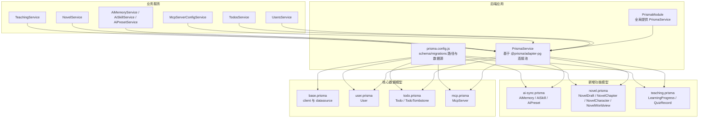
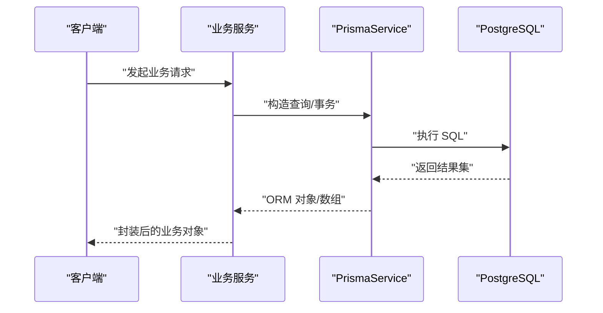
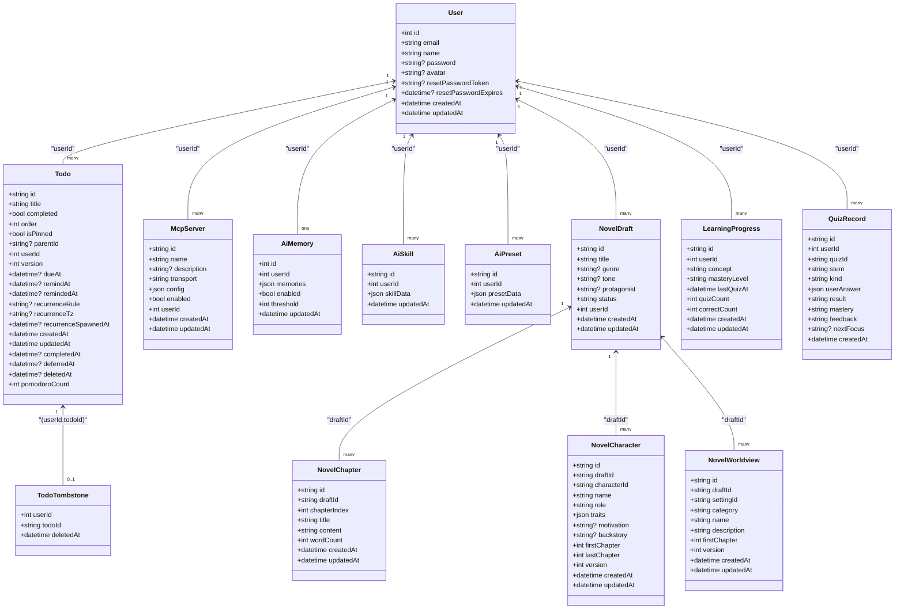
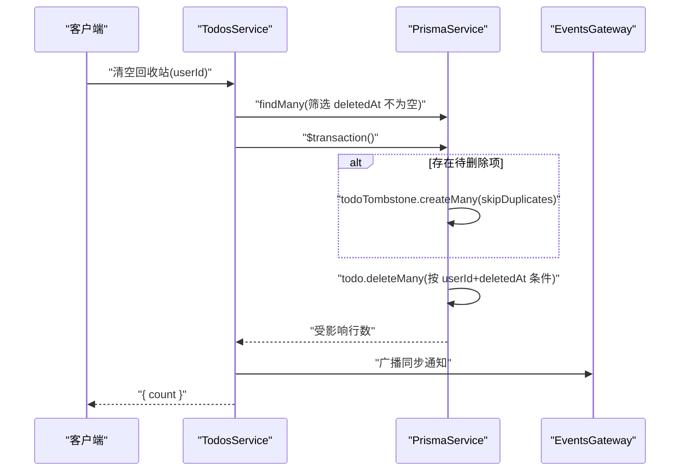
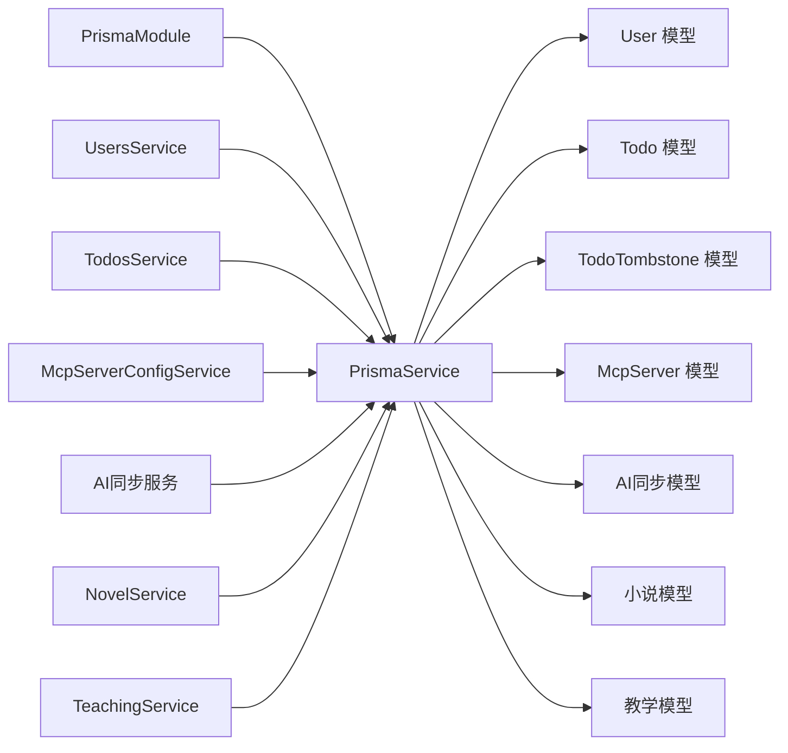

# 数据库设计

<cite>
**本文引用的文件**
- [apps/backend/prisma/schema/base.prisma](file://apps/backend/prisma/schema/base.prisma)
- [apps/backend/prisma/schema/user.prisma](file://apps/backend/prisma/schema/user.prisma)
- [apps/backend/prisma/schema/todo.prisma](file://apps/backend/prisma/schema/todo.prisma)
- [apps/backend/prisma/schema/mcp.prisma](file://apps/backend/prisma/schema/mcp.prisma)
- [apps/backend/prisma/schema/ai-sync.prisma](file://apps/backend/prisma/schema/ai-sync.prisma)
- [apps/backend/prisma/schema/novel.prisma](file://apps/backend/prisma/schema/novel.prisma)
- [apps/backend/prisma/schema/teaching.prisma](file://apps/backend/prisma/schema/teaching.prisma)
- [apps/backend/prisma.config.js](file://apps/backend/prisma.config.js)
- [apps/backend/src/prisma/prisma.service.ts](file://apps/backend/src/prisma/prisma.service.ts)
- [apps/backend/src/prisma/prisma.module.ts](file://apps/backend/src/prisma/prisma.module.ts)
- [apps/backend/src/users/users.service.ts](file://apps/backend/src/users/users.service.ts)
- [apps/backend/src/todos/todos.service.ts](file://apps/backend/src/todos/todos.service.ts)
- [apps/backend/src/mcp/mcp-server-config.service.ts](file://apps/backend/src/mcp/mcp-server-config.service.ts)
- [apps/backend/src/ai-sync/ai-memory.service.ts](file://apps/backend/src/ai-sync/ai-memory.service.ts)
- [apps/backend/src/ai-sync/ai-skill.service.ts](file://apps/backend/src/ai-sync/ai-skill.service.ts)
- [apps/backend/src/ai-sync/ai-preset.service.ts](file://apps/backend/src/ai-sync/ai-preset.service.ts)
- [apps/backend/src/novel/novel.service.ts](file://apps/backend/src/novel/novel.service.ts)
- [apps/backend/src/teaching/teaching.service.ts](file://apps/backend/src/teaching/teaching.service.ts)
- [packages/shared/src/schemas/todo.schema.ts](file://packages/shared/src/schemas/todo.schema.ts)
- [packages/shared/src/schemas/mcp.schema.ts](file://packages/shared/src/schemas/mcp.schema.ts)
- [packages/shared/src/schemas/ai-sync.schema.ts](file://packages/shared/src/schemas/ai-sync.schema.ts)
- [packages/shared/src/schemas/novel.schema.ts](file://packages/shared/src/schemas/novel.schema.ts)
- [packages/shared/src/schemas/teaching.schema.ts](file://packages/shared/src/schemas/teaching.schema.ts)
- [apps/backend/package.json](file://apps/backend/package.json)
</cite>

## 更新摘要
**所做更改**
- 新增AI同步数据模型章节，包含AiMemory、AiSkill、AiPreset三张表的详细设计
- 新增小说创作数据模型章节，包含NovelDraft、NovelChapter、NovelCharacter、NovelWorldview四张表的关系设计
- 新增教学学习数据模型章节，包含LearningProgress、QuizRecord两张表的学习追踪设计
- 更新核心组件分析，将新增模型纳入整体架构
- 更新详细组件分析，添加新模型的类图和关系映射
- 更新依赖分析，反映新增模块对PrismaService的集成
- 更新性能考虑，增加新模型的索引策略建议

## 目录
1. [简介](#简介)
2. [项目结构](#项目结构)
3. [核心组件](#核心组件)
4. [架构总览](#架构总览)
5. [详细组件分析](#详细组件分析)
6. [依赖分析](#依赖分析)
7. [性能考虑](#性能考虑)
8. [故障排查指南](#故障排查指南)
9. [结论](#结论)
10. [附录](#附录)

## 简介
本文件面向数据库开发者与架构师，系统化阐述 Lumina Todo 的数据库设计与 Prisma ORM 使用实践。内容涵盖数据模型定义、关系映射与约束、索引策略与查询优化、迁移与部署、数据验证与业务约束、数据访问模式与缓存策略，并结合实际代码路径给出实现细节与最佳实践。

**更新** 本次更新新增了AI同步、小说创作和教学学习三大功能模块的数据模型设计，扩展了系统的功能边界和数据复杂度。

## 项目结构
后端采用 NestJS + Prisma 架构，数据库层通过 Prisma Service 统一接入 PostgreSQL。数据模型按领域拆分至独立 schema 文件，配合全局注入的 PrismaModule 提供客户端实例；迁移与生成命令在应用包中定义，配置文件集中管理数据源与迁移路径。

**图表来源**
- [apps/backend/src/prisma/prisma.module.ts:1-10](file://apps/backend/src/prisma/prisma.module.ts#L1-L10)
- [apps/backend/src/prisma/prisma.service.ts:1-34](file://apps/backend/src/prisma/prisma.service.ts#L1-L34)
- [apps/backend/prisma.config.js:1-22](file://apps/backend/prisma.config.js#L1-L22)
- [apps/backend/prisma/schema/base.prisma:1-9](file://apps/backend/prisma/schema/base.prisma#L1-L9)
- [apps/backend/prisma/schema/user.prisma:1-16](file://apps/backend/prisma/schema/user.prisma#L1-L16)
- [apps/backend/prisma/schema/todo.prisma:1-40](file://apps/backend/prisma/schema/todo.prisma#L1-L40)
- [apps/backend/prisma/schema/mcp.prisma:1-16](file://apps/backend/prisma/schema/mcp.prisma#L1-L16)
- [apps/backend/prisma/schema/ai-sync.prisma:1-39](file://apps/backend/prisma/schema/ai-sync.prisma#L1-L39)
- [apps/backend/prisma/schema/novel.prisma:1-74](file://apps/backend/prisma/schema/novel.prisma#L1-L74)
- [apps/backend/prisma/schema/teaching.prisma:1-36](file://apps/backend/prisma/schema/teaching.prisma#L1-L36)

**章节来源**
- [apps/backend/src/prisma/prisma.module.ts:1-10](file://apps/backend/src/prisma/prisma.module.ts#L1-L10)
- [apps/backend/src/prisma/prisma.service.ts:1-34](file://apps/backend/src/prisma/prisma.service.ts#L1-L34)
- [apps/backend/prisma.config.js:1-22](file://apps/backend/prisma.config.js#L1-L22)

## 核心组件
- 数据模型与关系
  - User：用户主表，包含邮箱唯一性、密码哈希、头像、重置令牌与过期时间等字段，并与 Todo、McpServer、AiMemory、AiSkill、AiPreset、NovelDraft、LearningProgress 建立一对多关系。
  - Todo：待办事项表，支持 UUID 主键、完成状态、排序、置顶、父节点、版本号、到期/提醒时间、递归规则与时区、完成/延期/删除时间戳、番茄钟计数等；与 User 建立多对一关系。
  - McpServer：外部 MCP 服务器配置表，支持传输类型（HTTP/STDIO）、JSON 配置、启用状态、外键关联用户；删除时级联。
  - TodoTombstone：软删除墓碑表，记录被删除的 todo 与用户组合的删除时间，复合主键避免重复。
  - **新增** AiMemory：AI 记忆同步表，每个用户一条记录，存储记忆字符串数组、启用状态和阈值，与 User 建立一对一关系。
  - **新增** AiSkill：AI 技能同步表，存储技能完整对象（不含运行时密钥），支持按用户索引，与 User 建立多对一关系。
  - **新增** AiPreset：AI 预设同步表，存储预设骨架（不含 apiKey），支持按用户索引，与 User 建立多对一关系。
  - **新增** NovelDraft：小说草稿表，包含标题、题材、语调、主角、状态等字段，与 User 建立多对一关系，并包含章节、角色、世界观的集合关系。
  - **新增** NovelChapter：小说章节表，包含章节索引、标题、内容、字数统计等字段，与 NovelDraft 建立多对一关系，支持章节唯一性约束。
  - **新增** NovelCharacter：小说角色表，包含角色标识、姓名、角色身份、特质、动机、背景故事等字段，与 NovelDraft 建立多对一关系，支持角色唯一性约束。
  - **新增** NovelWorldview：小说世界观表，包含设定标识、分类、名称、描述等字段，与 NovelDraft 建立多对一关系，支持设定唯一性约束。
  - **新增** LearningProgress：学习进度表，记录概念掌握程度、测验次数、正确次数、最后测验时间等字段，支持用户+概念唯一性约束，与 User 建立多对一关系。
  - **新增** QuizRecord：测验记录表，存储测验题目、答案、结果、掌握度、反馈等字段，支持用户索引和时间排序，与 User 建立多对一关系。
- 索引策略
  - Todo 上针对 (userId, updatedAt)、(userId, remindAt)、(userId, dueAt)、(deletedAt) 建有索引，覆盖常见查询与回收站场景。
  - McpServer 上针对 (userId) 建有索引，便于按用户检索。
  - **新增** AiSkill 和 AiPreset 针对 (userId) 建有索引，便于按用户检索 AI 数据。
  - **新增** NovelDraft、NovelChapter、NovelCharacter、NovelWorldview 针对 (userId) 建有索引，便于按用户检索创作内容。
  - **新增** QuizRecord 针对 (userId) 和 (userId, createdAt) 建有索引，便于学习记录查询和时间排序。
- 约束与映射
  - User.email 唯一；User.id 自增主键；Todo.id 默认 UUID；McpServer.id 默认 UUID。
  - Todo.userId 关系映射到 User.id；McpServer.userId 关系映射到 User.id 并设置删除级联。
  - Todo 与 TodoTombstone 通过 (userId, todoId) 组合进行 upsert/查询，保证软删除一致性。
  - **新增** 所有新增模型均通过 userId 外键关联 User 表，删除时采用级联策略。
  - **新增** NovelChapter、NovelCharacter、NovelWorldview 通过 (draftId, chapterIndex)、(draftId, characterId)、(draftId, settingId) 组合建立唯一性约束。

**章节来源**
- [apps/backend/prisma/schema/user.prisma:1-16](file://apps/backend/prisma/schema/user.prisma#L1-L16)
- [apps/backend/prisma/schema/todo.prisma:1-40](file://apps/backend/prisma/schema/todo.prisma#L1-L40)
- [apps/backend/prisma/schema/mcp.prisma:1-16](file://apps/backend/prisma/schema/mcp.prisma#L1-L16)
- [apps/backend/prisma/schema/ai-sync.prisma:1-39](file://apps/backend/prisma/schema/ai-sync.prisma#L1-L39)
- [apps/backend/prisma/schema/novel.prisma:1-74](file://apps/backend/prisma/schema/novel.prisma#L1-L74)
- [apps/backend/prisma/schema/teaching.prisma:1-36](file://apps/backend/prisma/schema/teaching.prisma#L1-L36)

## 架构总览
下图展示 Prisma 在应用中的装配与使用流程：全局模块提供 PrismaService，业务服务通过依赖注入获取客户端，执行查询与事务操作。

**图表来源**
- [apps/backend/src/prisma/prisma.module.ts:1-10](file://apps/backend/src/prisma/prisma.module.ts#L1-L10)
- [apps/backend/src/prisma/prisma.service.ts:1-34](file://apps/backend/src/prisma/prisma.service.ts#L1-L34)
- [apps/backend/src/users/users.service.ts:1-118](file://apps/backend/src/users/users.service.ts#L1-L118)
- [apps/backend/src/todos/todos.service.ts:1-147](file://apps/backend/src/todos/todos.service.ts#L1-L147)
- [apps/backend/src/mcp/mcp-server-config.service.ts:1-156](file://apps/backend/src/mcp/mcp-server-config.service.ts#L1-L156)

## 详细组件分析

### 数据模型类图

**图表来源**
- [apps/backend/prisma/schema/user.prisma:1-16](file://apps/backend/prisma/schema/user.prisma#L1-L16)
- [apps/backend/prisma/schema/todo.prisma:1-40](file://apps/backend/prisma/schema/todo.prisma#L1-L40)
- [apps/backend/prisma/schema/mcp.prisma:1-16](file://apps/backend/prisma/schema/mcp.prisma#L1-L16)
- [apps/backend/prisma/schema/ai-sync.prisma:1-39](file://apps/backend/prisma/schema/ai-sync.prisma#L1-L39)
- [apps/backend/prisma/schema/novel.prisma:1-74](file://apps/backend/prisma/schema/novel.prisma#L1-L74)
- [apps/backend/prisma/schema/teaching.prisma:1-36](file://apps/backend/prisma/schema/teaching.prisma#L1-L36)

**章节来源**
- [apps/backend/prisma/schema/user.prisma:1-16](file://apps/backend/prisma/schema/user.prisma#L1-L16)
- [apps/backend/prisma/schema/todo.prisma:1-40](file://apps/backend/prisma/schema/todo.prisma#L1-L40)
- [apps/backend/prisma/schema/mcp.prisma:1-16](file://apps/backend/prisma/schema/mcp.prisma#L1-L16)
- [apps/backend/prisma/schema/ai-sync.prisma:1-39](file://apps/backend/prisma/schema/ai-sync.prisma#L1-L39)
- [apps/backend/prisma/schema/novel.prisma:1-74](file://apps/backend/prisma/schema/novel.prisma#L1-L74)
- [apps/backend/prisma/schema/teaching.prisma:1-36](file://apps/backend/prisma/schema/teaching.prisma#L1-L36)

### AI同步数据模型
**新增** AI同步模块包含三个核心表，用于支持AI助手的记忆、技能和预设的跨设备同步。

- **AiMemory**：每个用户仅有一条记录，存储记忆字符串数组、启用状态和阈值
  - 主键：自增id
  - 唯一约束：userId（每个用户一条记忆记录）
  - 字段：memories（JSON数组，最多100个项目，每项≤200字符）、enabled（布尔值，默认true）、threshold（整数，默认30）
  - 关系：与User表一对一，删除时级联

- **AiSkill**：存储AI技能完整对象（不含运行时密钥）
  - 主键：UUID id
  - 索引：userId（按用户检索）
  - 字段：skillData（JSON，包含技能名称、提示词、描述、别名等信息）
  - 关系：与User表多对一，删除时级联

- **AiPreset**：存储AI预设骨架（不含apiKey）
  - 主键：UUID id
  - 索引：userId（按用户检索）
  - 字段：presetData（JSON，包含基础URL、模型、系统提示词、温度等配置）
  - 关系：与User表多对一，删除时级联

**章节来源**
- [apps/backend/prisma/schema/ai-sync.prisma:5-39](file://apps/backend/prisma/schema/ai-sync.prisma#L5-L39)
- [apps/backend/src/ai-sync/ai-memory.service.ts:15-64](file://apps/backend/src/ai-sync/ai-memory.service.ts#L15-L64)
- [apps/backend/src/ai-sync/ai-skill.service.ts:9-49](file://apps/backend/src/ai-sync/ai-skill.service.ts#L9-L49)
- [apps/backend/src/ai-sync/ai-preset.service.ts:9-55](file://apps/backend/src/ai-sync/ai-preset.service.ts#L9-L55)

### 小说创作数据模型
**新增** 小说创作模块包含四个核心表，支持完整的创作工作流管理。

- **NovelDraft**：小说草稿主表
  - 主键：UUID id
  - 索引：userId（按用户检索）
  - 字段：title（标题）、genre（题材）、tone（语调）、protagonist（主角）、status（状态，默认draft）
  - 关系：与User表多对一，与NovelChapter、NovelCharacter、NovelWorldview建立一对多关系

- **NovelChapter**：小说章节表
  - 主键：UUID id
  - 唯一约束：(draftId, chapterIndex)（同一草稿内章节索引唯一）
  - 索引：draftId（按草稿检索）
  - 字段：chapterIndex（章节索引）、title（标题）、content（内容）、wordCount（字数统计）
  - 关系：与NovelDraft表多对一，删除时级联

- **NovelCharacter**：小说角色表
  - 主键：UUID id
  - 唯一约束：(draftId, characterId)（同一草稿内角色唯一）
  - 索引：draftId（按草稿检索）
  - 字段：characterId（角色标识）、name（姓名）、role（角色身份）、traits（特质数组）、motivation（动机）、backstory（背景故事）、firstChapter/lastChapter（首次/最后出场章节）、version（版本号）
  - 关系：与NovelDraft表多对一，删除时级联

- **NovelWorldview**：小说世界观表
  - 主键：UUID id
  - 唯一约束：(draftId, settingId)（同一草稿内设定唯一）
  - 索引：draftId（按草稿检索）
  - 字段：settingId（设定标识）、category（分类）、name（名称）、description（描述）、firstChapter（首次出现章节）、version（版本号）
  - 关系：与NovelDraft表多对一，删除时级联

**章节来源**
- [apps/backend/prisma/schema/novel.prisma:1-74](file://apps/backend/prisma/schema/novel.prisma#L1-L74)
- [apps/backend/src/novel/novel.service.ts:8-253](file://apps/backend/src/novel/novel.service.ts#L8-L253)

### 教学学习数据模型
**新增** 教学学习模块包含两个核心表，用于跟踪学习进度和测验表现。

- **LearningProgress**：学习进度表
  - 主键：UUID id
  - 唯一约束：(userId, concept)（用户+概念唯一）
  - 索引：userId（按用户检索）
  - 字段：concept（概念名称）、masteryLevel（掌握度等级，默认novice）、lastQuizAt（最后测验时间）、quizCount/correctCount（测验次数/正确次数）
  - 关系：与User表多对一，删除时级联

- **QuizRecord**：测验记录表
  - 主键：UUID id
  - 索引：userId（按用户检索）、(userId, createdAt)（用户+时间排序）
  - 字段：quizId（测验标识）、stem（题目内容）、kind（题型）、userAnswer（用户答案）、result（结果）、mastery（掌握度）、feedback（反馈）、nextFocus（关注点）
  - 关系：与User表多对一，删除时级联

**章节来源**
- [apps/backend/prisma/schema/teaching.prisma:1-36](file://apps/backend/prisma/schema/teaching.prisma#L1-L36)
- [apps/backend/src/teaching/teaching.service.ts:5-160](file://apps/backend/src/teaching/teaching.service.ts#L5-L160)

### 查询流程与事务（软删除与回收站）

**图表来源**
- [apps/backend/src/todos/todos.service.ts:116-145](file://apps/backend/src/todos/todos.service.ts#L116-L145)

**章节来源**
- [apps/backend/src/todos/todos.service.ts:116-145](file://apps/backend/src/todos/todos.service.ts#L116-L145)

### 数据验证与业务约束
- Todo 验证
  - 字段长度与范围约束、可空性、日期字符串兼容、递归规则枚举、时区长度限制等，详见共享 DTO 定义。
- MCP 服务器配置验证
  - 传输类型与配置必须匹配（STDIO/HTTP），HTTP URL 必须为公网地址且不允许私有/环回主机名，支持 Bearer/API Key/OAuth 认证参数校验。
- **新增** AI同步数据验证
  - AIMemory：memories 数组最多100项，单项≤200字符；enabled 布尔值；threshold 整数10-100
  - AISkill：id、name、prompt 等字段长度限制；不包含 runtime secrets
  - AIPreset：baseUrl 必须为有效URL；model、temperature、thinkingEffort 等字段范围限制；不包含 apiKey
- **新增** 小说创作数据验证
  - NovelGenre：限定在8种预定义题材内
  - NovelCharacterRole：限定在5种角色身份内
  - NovelWorldviewCategory：限定在7种世界观分类内
  - 章节索引必须为正整数，字数必须≥0
- **新增** 教学学习数据验证
  - TeachingQuizKind：单选、多选、简答三种类型
  - TeachingAssessmentResult：正确、部分正确、错误三种结果
  - TeachingMasteryLevel：新手、发展中、熟练三个等级
- 业务约束
  - 用户邮箱唯一；Todo 与 TodoTombstone 通过 (userId, todoId) 组合保证墓碑唯一；McpServer 删除级联清理。
  - **新增** AI同步：AiMemory 每用户唯一；AiSkill/AiPreset 按用户索引；NovelDraft/Chapter/Character/Worldview 按草稿唯一；LearningProgress 用户+概念唯一。

**章节来源**
- [packages/shared/src/schemas/todo.schema.ts:1-76](file://packages/shared/src/schemas/todo.schema.ts#L1-L76)
- [packages/shared/src/schemas/mcp.schema.ts:1-220](file://packages/shared/src/schemas/mcp.schema.ts#L1-L220)
- [packages/shared/src/schemas/ai-sync.schema.ts:1-66](file://packages/shared/src/schemas/ai-sync.schema.ts#L1-L66)
- [packages/shared/src/schemas/novel.schema.ts:1-161](file://packages/shared/src/schemas/novel.schema.ts#L1-L161)
- [packages/shared/src/schemas/teaching.schema.ts:1-91](file://packages/shared/src/schemas/teaching.schema.ts#L1-L91)
- [apps/backend/prisma/schema/todo.prisma:31-40](file://apps/backend/prisma/schema/todo.prisma#L31-L40)
- [apps/backend/prisma/schema/mcp.prisma:11-11](file://apps/backend/prisma/schema/mcp.prisma#L11-L11)

### 数据访问模式与缓存策略
- 访问模式
  - 通过 PrismaService 在各业务服务中直接查询或批量操作，如 UsersService 的邮箱/ID 查询、TodosService 的回收站清空与软删除墓碑 upsert、McpServerConfigService 的 CRUD。
  - **新增** AI同步服务：AiMemoryService 的全量读写、AiSkillService/AiPresetService 的全量替换（事务保证原子性）。
  - **新增** 小说服务：NovelService 的草稿、章节、角色、世界观的CRUD操作，支持批量导出。
  - **新增** 教学服务：TeachingService 的测验记录保存、学习进度更新、概览统计和批量导出。
- 缓存策略
  - 应用依赖 cache-manager 与 ioredis 实现缓存与健康检查，但当前仓库未见数据库层显式缓存装饰器或读写分离配置；建议在高频查询上引入缓存装饰器与只读副本路由（需在 PrismaService 层扩展连接池与路由策略）。
  - **新增** AI同步：AiMemory 可考虑短期缓存以减少频繁读取，但需注意跨设备同步的一致性要求。
  - **新增** 小说创作：草稿和章节数据可考虑缓存，但需处理并发编辑冲突。
  - **新增** 教学学习：学习进度和测验记录适合缓存，但需确保统计数据的准确性。

**章节来源**
- [apps/backend/src/users/users.service.ts:1-118](file://apps/backend/src/users/users.service.ts#L1-L118)
- [apps/backend/src/todos/todos.service.ts:1-147](file://apps/backend/src/todos/todos.service.ts#L1-L147)
- [apps/backend/src/mcp/mcp-server-config.service.ts:1-156](file://apps/backend/src/mcp/mcp-server-config.service.ts#L1-L156)
- [apps/backend/src/ai-sync/ai-memory.service.ts:15-64](file://apps/backend/src/ai-sync/ai-memory.service.ts#L15-L64)
- [apps/backend/src/ai-sync/ai-skill.service.ts:9-49](file://apps/backend/src/ai-sync/ai-skill.service.ts#L9-L49)
- [apps/backend/src/ai-sync/ai-preset.service.ts:9-55](file://apps/backend/src/ai-sync/ai-preset.service.ts#L9-L55)
- [apps/backend/src/novel/novel.service.ts:8-253](file://apps/backend/src/novel/novel.service.ts#L8-L253)
- [apps/backend/src/teaching/teaching.service.ts:5-160](file://apps/backend/src/teaching/teaching.service.ts#L5-L160)

## 依赖分析
- 模块耦合
  - PrismaModule 全局提供 PrismaService，业务服务通过依赖注入使用，降低耦合度。
  - Todo 与 TodoTombstone 通过事务协同，保证软删除一致性。
  - **新增** AI同步模块、小说模块、教学模块各自提供独立的业务服务，通过 PrismaService 统一访问数据库。
- 外部依赖
  - @prisma/adapter-pg + pg Pool 提供连接池；prisma client 生成类型安全的查询接口。
- 潜在风险
  - 当前未发现循环依赖；若后续引入读写分离或分布式缓存，需评估 PrismaService 的扩展点与路由策略。
  - **新增** 新增模型增加了数据库连接压力，需监控连接池使用情况和查询性能。

**图表来源**
- [apps/backend/src/prisma/prisma.module.ts:1-10](file://apps/backend/src/prisma/prisma.module.ts#L1-L10)
- [apps/backend/src/prisma/prisma.service.ts:1-34](file://apps/backend/src/prisma/prisma.service.ts#L1-L34)
- [apps/backend/src/users/users.service.ts:1-118](file://apps/backend/src/users/users.service.ts#L1-L118)
- [apps/backend/src/todos/todos.service.ts:1-147](file://apps/backend/src/todos/todos.service.ts#L1-L147)
- [apps/backend/src/mcp/mcp-server-config.service.ts:1-156](file://apps/backend/src/mcp/mcp-server-config.service.ts#L1-L156)
- [apps/backend/src/ai-sync/ai-memory.service.ts:15-64](file://apps/backend/src/ai-sync/ai-memory.service.ts#L15-L64)
- [apps/backend/src/novel/novel.service.ts:8-253](file://apps/backend/src/novel/novel.service.ts#L8-L253)
- [apps/backend/src/teaching/teaching.service.ts:5-160](file://apps/backend/src/teaching/teaching.service.ts#L5-L160)

**章节来源**
- [apps/backend/src/prisma/prisma.module.ts:1-10](file://apps/backend/src/prisma/prisma.module.ts#L1-L10)
- [apps/backend/src/prisma/prisma.service.ts:1-34](file://apps/backend/src/prisma/prisma.service.ts#L1-L34)

## 性能考虑
- 索引与查询
  - Todo 已针对 (userId, updatedAt)、(userId, remindAt)、(userId, dueAt)、(deletedAt) 建立索引，有助于回收站、到期/提醒查询与软删除过滤。
  - McpServer 已针对 (userId) 建有索引，便于按用户检索。
  - **新增** AiSkill 和 AiPreset 已针对 (userId) 建有索引，便于按用户检索 AI 数据。
  - **新增** NovelDraft、NovelChapter、NovelCharacter、NovelWorldview 已针对 (userId) 建有索引，便于按用户检索创作内容。
  - **新增** QuizRecord 已针对 (userId) 和 (userId, createdAt) 建有索引，便于学习记录查询和时间排序。
  - 建议在高并发场景下对 (userId, deletedAt) 建立复合索引以优化回收站查询。
- 连接池与适配器
  - 使用 @prisma/adapter-pg + pg.Pool，建议在生产环境配置合理的最大连接数、空闲超时与重试策略。
  - **新增** 随着新增模型的引入，需监控数据库连接使用情况，必要时调整连接池大小。
- 事务与批量
  - 回收站清空使用 $transaction 与 createMany(skipDuplicates)，减少往返并保证幂等。
  - **新增** AI同步的全量替换操作使用事务保证原子性，批量写入提高性能。
  - **新增** 小说服务的批量导出使用 Promise.all 并行查询多个集合。
- 分页与投影
  - TodosService 使用 select 投影常用字段，减少网络与序列化开销；建议在前端分页时结合索引列排序（如 isPinned/createdAt）。
  - **新增** 教学服务的概览查询限制返回数量，避免大数据集查询影响性能。

**章节来源**
- [apps/backend/prisma/schema/todo.prisma:24-28](file://apps/backend/prisma/schema/todo.prisma#L24-L28)
- [apps/backend/src/todos/todos.service.ts:5-25](file://apps/backend/src/todos/todos.service.ts#L5-L25)
- [apps/backend/src/todos/todos.service.ts:116-145](file://apps/backend/src/todos/todos.service.ts#L116-L145)
- [apps/backend/src/prisma/prisma.service.ts:1-34](file://apps/backend/src/prisma/prisma.service.ts#L1-L34)
- [apps/backend/src/ai-sync/ai-skill.service.ts:29-47](file://apps/backend/src/ai-sync/ai-skill.service.ts#L29-L47)
- [apps/backend/src/ai-sync/ai-preset.service.ts:30-53](file://apps/backend/src/ai-sync/ai-preset.service.ts#L30-L53)
- [apps/backend/src/novel/novel.service.ts:240-251](file://apps/backend/src/novel/novel.service.ts#L240-L251)
- [apps/backend/src/teaching/teaching.service.ts:117-141](file://apps/backend/src/teaching/teaching.service.ts#L117-L141)

## 故障排查指南
- 连接问题
  - 确认 DATABASE_URL 环境变量存在且可连通；PrismaService 构造函数会校验该值。
- 生成与迁移
  - 使用脚本生成客户端与迁移：prisma:generate、prisma:migrate；若 schema 路径或数据源变更，请同步 prisma.config.js。
- 数据一致性
  - 软删除依赖事务与墓碑 upsert，若出现冲突，检查 (userId, todoId) 唯一键约束与事务隔离级别。
  - **新增** AI同步的全量替换依赖事务，若出现数据不一致，检查事务回滚和批量写入的完整性。
  - **新增** 小说创作的唯一性约束冲突，检查草稿ID和索引值的正确性。
- 业务异常
  - 用户邮箱冲突、MCP 配置权限不足、无效 ID 等均在服务层抛出明确异常，定位到对应 DTO/验证层与服务方法。
  - **新增** AI同步：包含敏感字段（apiKey、runtime secrets）的请求会被拒绝；全量替换失败时检查数据格式和事务状态。
  - **新增** 小说创作：章节索引冲突、角色ID冲突、设定ID冲突等唯一性约束异常。
  - **新增** 教学学习：测验记录格式错误、学习进度更新冲突等数据验证异常。

**章节来源**
- [apps/backend/src/prisma/prisma.service.ts:10-21](file://apps/backend/src/prisma/prisma.service.ts#L10-L21)
- [apps/backend/package.json:26-29](file://apps/backend/package.json#L26-L29)
- [apps/backend/prisma.config.js:13-21](file://apps/backend/prisma.config.js#L13-L21)
- [apps/backend/src/users/users.service.ts:96-103](file://apps/backend/src/users/users.service.ts#L96-L103)
- [apps/backend/src/mcp/mcp-server-config.service.ts:114-127](file://apps/backend/src/mcp/mcp-server-config.service.ts#L114-L127)
- [apps/backend/src/ai-sync/ai-preset.service.ts:31-36](file://apps/backend/src/ai-sync/ai-preset.service.ts#L31-L36)
- [apps/backend/src/novel/novel.service.ts:62-65](file://apps/backend/src/novel/novel.service.ts#L62-L65)
- [apps/backend/src/teaching/teaching.service.ts:11-27](file://apps/backend/src/teaching/teaching.service.ts#L11-L27)

## 结论
本设计以清晰的领域模型与严格的索引策略为基础，结合 Prisma 的类型安全与事务能力，实现了用户、待办与 MCP 服务器配置的完整数据流。**更新** 新增的AI同步、小说创作和教学学习三大模块进一步丰富了系统功能，通过合理的数据模型设计和业务约束保证了数据完整性。

建议在生产环境中完善连接池参数、补充回收站复合索引、在高频查询处引入缓存与只读副本路由，并持续通过迁移脚本演进 schema 与约束，确保数据完整性与性能双优。同时，针对新增模块的特殊需求（如AI数据的安全性、小说创作的并发控制、教学数据的统计准确性）制定相应的优化策略和监控方案。

## 附录
- 命令速查
  - 生成客户端：prisma:generate
  - 推送开发库：prisma:push
  - 迁移开发库：prisma:migrate
  - 启动 Studio：prisma:studio
- 配置要点
  - schema 路径与迁移路径在 prisma.config.js 中集中管理；数据源 URL 从环境变量注入。
- **新增** 新功能模块说明
  - AI同步：支持记忆、技能、预设的跨设备同步，采用server-as-truth策略
  - 小说创作：完整的创作工作流管理，支持草稿、章节、角色、世界观的组织
  - 教学学习：学习进度跟踪和测验记录管理，支持学习数据分析

**章节来源**
- [apps/backend/package.json:26-29](file://apps/backend/package.json#L26-L29)
- [apps/backend/prisma.config.js:13-21](file://apps/backend/prisma.config.js#L13-L21)