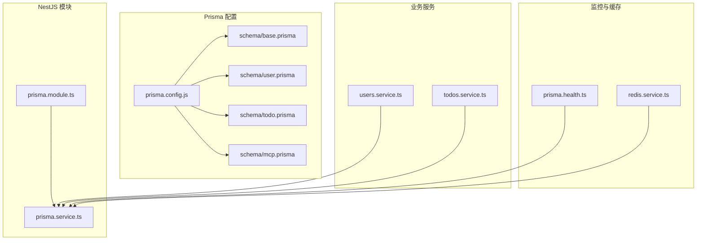
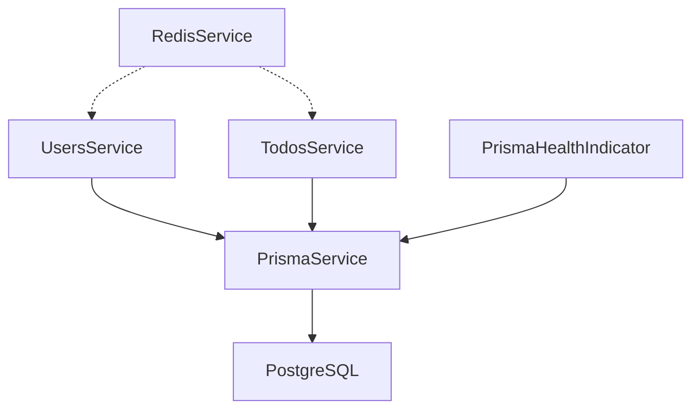
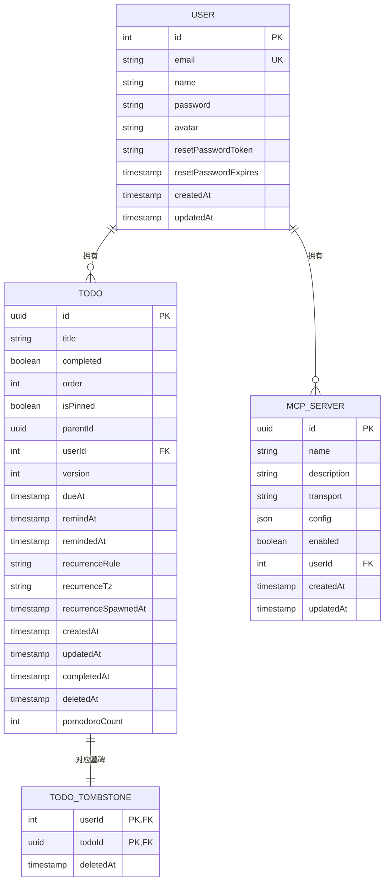
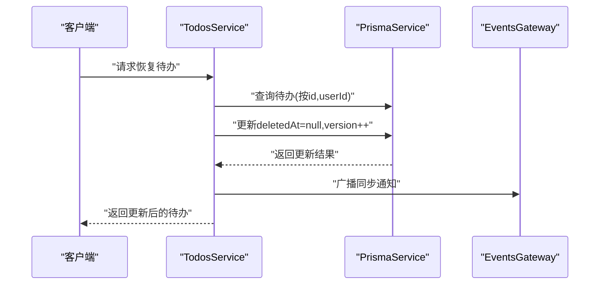
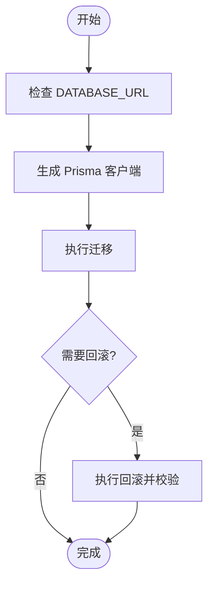
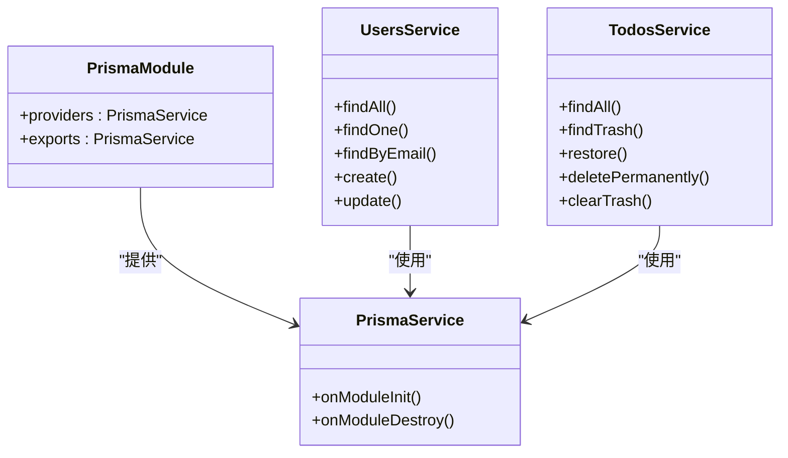

# 数据库设计

<cite>
**本文引用的文件**
- [apps/backend/prisma/schema/base.prisma](file://apps/backend/prisma/schema/base.prisma)
- [apps/backend/prisma/schema/user.prisma](file://apps/backend/prisma/schema/user.prisma)
- [apps/backend/prisma/schema/todo.prisma](file://apps/backend/prisma/schema/todo.prisma)
- [apps/backend/prisma/schema/mcp.prisma](file://apps/backend/prisma/schema/mcp.prisma)
- [apps/backend/prisma.config.js](file://apps/backend/prisma.config.js)
- [apps/backend/src/prisma/prisma.service.ts](file://apps/backend/src/prisma/prisma.service.ts)
- [apps/backend/src/prisma/prisma.module.ts](file://apps/backend/src/prisma/prisma.module.ts)
- [apps/backend/src/users/users.service.ts](file://apps/backend/src/users/users.service.ts)
- [apps/backend/src/todos/todos.service.ts](file://apps/backend/src/todos/todos.service.ts)
- [apps/backend/src/health/prisma.health.ts](file://apps/backend/src/health/prisma.health.ts)
- [apps/backend/src/redis/redis.service.ts](file://apps/backend/src/redis/redis.service.ts)
</cite>

## 目录
1. [简介](#简介)
2. [项目结构](#项目结构)
3. [核心组件](#核心组件)
4. [架构总览](#架构总览)
5. [详细组件分析](#详细组件分析)
6. [依赖分析](#依赖分析)
7. [性能考虑](#性能考虑)
8. [故障排查指南](#故障排查指南)
9. [结论](#结论)
10. [附录](#附录)

## 简介
本文件系统性梳理 Lumina 后端数据库设计与 Prisma ORM 配置，覆盖数据模型定义、实体关系映射、索引与约束、外键与级联策略、迁移与版本控制、查询优化与分页、全文搜索现状、备份恢复与运维监控等主题，并提供 ER 关系图与数据模型图，帮助开发者与运维人员快速理解与维护数据库层。

## 项目结构
后端数据库相关代码主要集中在以下位置：
- Prisma 配置与模式：apps/backend/prisma/schema/*.prisma 与 apps/backend/prisma.config.js
- Prisma 客户端封装：apps/backend/src/prisma/prisma.service.ts、prisma.module.ts
- 业务服务与查询：apps/backend/src/users/users.service.ts、apps/backend/src/todos/todos.service.ts
- 健康检查：apps/backend/src/health/prisma.health.ts
- 缓存与性能：apps/backend/src/redis/redis.service.ts

**图表来源**
- [apps/backend/prisma.config.js:13-21](file://apps/backend/prisma.config.js#L13-L21)
- [apps/backend/prisma/schema/base.prisma:1-9](file://apps/backend/prisma/schema/base.prisma#L1-L9)
- [apps/backend/prisma/schema/user.prisma:1-16](file://apps/backend/prisma/schema/user.prisma#L1-L16)
- [apps/backend/prisma/schema/todo.prisma:1-39](file://apps/backend/prisma/schema/todo.prisma#L1-L39)
- [apps/backend/prisma/schema/mcp.prisma:1-16](file://apps/backend/prisma/schema/mcp.prisma#L1-L16)
- [apps/backend/src/prisma/prisma.module.ts:1-10](file://apps/backend/src/prisma/prisma.module.ts#L1-L10)
- [apps/backend/src/prisma/prisma.service.ts:1-34](file://apps/backend/src/prisma/prisma.service.ts#L1-L34)
- [apps/backend/src/users/users.service.ts:1-110](file://apps/backend/src/users/users.service.ts#L1-L110)
- [apps/backend/src/todos/todos.service.ts:1-146](file://apps/backend/src/todos/todos.service.ts#L1-L146)
- [apps/backend/src/health/prisma.health.ts:1-32](file://apps/backend/src/health/prisma.health.ts#L1-L32)
- [apps/backend/src/redis/redis.service.ts:1-233](file://apps/backend/src/redis/redis.service.ts#L1-L233)

**章节来源**
- [apps/backend/prisma.config.js:13-21](file://apps/backend/prisma.config.js#L13-L21)
- [apps/backend/prisma/schema/base.prisma:1-9](file://apps/backend/prisma/schema/base.prisma#L1-L9)

## 核心组件
- Prisma 客户端适配器：通过 PostgreSQL 连接池适配 Prisma，集中于 PrismaService 的构造与生命周期钩子。
- 数据模型：用户(User)、待办(Todo)、MCP 服务器(McpServer)，以及 Todo 的墓碑表(TodoTombstone)。
- 业务服务：UsersService 负责用户 CRUD；TodosService 负责待办列表、回收站、软删除与硬删除、版本号递增与事件广播。
- 健康检查：基于原生 SQL 查询验证数据库连通性。
- 缓存：统一的 Redis 缓存抽象，支持命名空间、TTL、批量操作与穿透保护。

**章节来源**
- [apps/backend/src/prisma/prisma.service.ts:1-34](file://apps/backend/src/prisma/prisma.service.ts#L1-L34)
- [apps/backend/src/prisma/prisma.module.ts:1-10](file://apps/backend/src/prisma/prisma.module.ts#L1-L10)
- [apps/backend/src/users/users.service.ts:1-110](file://apps/backend/src/users/users.service.ts#L1-L110)
- [apps/backend/src/todos/todos.service.ts:1-146](file://apps/backend/src/todos/todos.service.ts#L1-L146)
- [apps/backend/src/health/prisma.health.ts:1-32](file://apps/backend/src/health/prisma.health.ts#L1-L32)
- [apps/backend/src/redis/redis.service.ts:1-233](file://apps/backend/src/redis/redis.service.ts#L1-L233)

## 架构总览
下图展示数据库层与应用层的交互关系：业务服务通过 PrismaService 访问数据库；健康检查模块定期验证数据库可用性；缓存层提升热点数据访问性能。

**图表来源**
- [apps/backend/src/users/users.service.ts:14](file://apps/backend/src/users/users.service.ts#L14)
- [apps/backend/src/todos/todos.service.ts:28](file://apps/backend/src/todos/todos.service.ts#L28)
- [apps/backend/src/health/prisma.health.ts:10](file://apps/backend/src/health/prisma.health.ts#L10)
- [apps/backend/src/redis/redis.service.ts:52](file://apps/backend/src/redis/redis.service.ts#L52)
- [apps/backend/src/prisma/prisma.service.ts:7](file://apps/backend/src/prisma/prisma.service.ts#L7)

## 详细组件分析

### 数据模型与实体关系
- 用户表(User)
  - 主键：自增整型 id
  - 唯一索引：email
  - 字段：name、password、avatar、重置令牌与过期时间、创建/更新时间
  - 关系：一对多到 McpServer、一对多到 Todo
  - 映射：表名为 users
- 待办表(Todo)
  - 主键：UUID id
  - 字段：标题、完成状态、排序、置顶、父节点、用户外键、版本号、到期/提醒时间、提醒历史、重复规则与时区、生成时间、删除时间、番茄钟计数、创建/更新时间、完成时间
  - 关系：多对一到 User
  - 索引：复合索引(userId, updatedAt)、(userId, remindAt)、(userId, dueAt)、(deletedAt)
  - 映射：表名为 todos
- 待办墓碑表(TodoTombstone)
  - 主键：(userId, todoId)
  - 字段：deletedAt
  - 索引：(userId, deletedAt)
  - 映射：表名为 todo_tombstones
- MCP 服务器表(McpServer)
  - 主键：UUID id
  - 字段：名称、描述、传输方式、配置(JSON)、启用标志、用户外键、创建/更新时间
  - 关系：多对一到 User，onDelete: Cascade
  - 索引：(userId)
  - 映射：表名为 mcp_servers

**图表来源**
- [apps/backend/prisma/schema/user.prisma:1-16](file://apps/backend/prisma/schema/user.prisma#L1-L16)
- [apps/backend/prisma/schema/todo.prisma:1-39](file://apps/backend/prisma/schema/todo.prisma#L1-L39)
- [apps/backend/prisma/schema/mcp.prisma:1-16](file://apps/backend/prisma/schema/mcp.prisma#L1-L16)

**章节来源**
- [apps/backend/prisma/schema/user.prisma:1-16](file://apps/backend/prisma/schema/user.prisma#L1-L16)
- [apps/backend/prisma/schema/todo.prisma:1-39](file://apps/backend/prisma/schema/todo.prisma#L1-L39)
- [apps/backend/prisma/schema/mcp.prisma:1-16](file://apps/backend/prisma/schema/mcp.prisma#L1-L16)

### 外键关系与级联策略
- Todo.userId → User.id：RESTRICT（默认），保证数据完整性
- McpServer.userId → User.id：onDelete: Cascade，用户删除时自动清理其 MCP 服务器配置
- TodoTombstone(userId, todoId) 关联 Todo，用于回收站与审计

**章节来源**
- [apps/backend/prisma/schema/todo.prisma:21](file://apps/backend/prisma/schema/todo.prisma#L21)
- [apps/backend/prisma/schema/mcp.prisma:11](file://apps/backend/prisma/schema/mcp.prisma#L11)
- [apps/backend/prisma/schema/todo.prisma:30-38](file://apps/backend/prisma/schema/todo.prisma#L30-L38)

### 索引设计与查询优化
- Todo 表关键索引
  - (userId, updatedAt)：按用户维度的时间倒序查询
  - (userId, remindAt)：提醒任务检索
  - (userId, dueAt)：到期任务检索
  - (deletedAt)：回收站过滤
- TodoTombstone 表
  - (userId, deletedAt)：回收站审计
- McpServer 表
  - (userId)：按用户检索 MCP 服务器

这些索引支撑了业务高频查询：按用户分组的待办列表、回收站、提醒与到期任务筛选。建议在高并发场景下结合 EXPLAIN 分析热点查询，必要时增加覆盖索引或物化视图。

**章节来源**
- [apps/backend/prisma/schema/todo.prisma:23-27](file://apps/backend/prisma/schema/todo.prisma#L23-L27)
- [apps/backend/prisma/schema/todo.prisma:36](file://apps/backend/prisma/schema/todo.prisma#L36)
- [apps/backend/prisma/schema/mcp.prisma:13](file://apps/backend/prisma/schema/mcp.prisma#L13)

### 查询流程与事务处理
- 待办列表与回收站
  - 通过 TodosService 的查询方法按用户过滤、软删除过滤、排序与选择字段
- 回收站恢复与永久删除
  - 恢复：更新 deletedAt 为空并递增版本号，随后广播同步通知
  - 永久删除：使用事务写入墓碑表并删除记录，随后广播同步通知
- 清空回收站
  - 批量写入墓碑表并删除记录，事务保障一致性

**图表来源**
- [apps/backend/src/todos/todos.service.ts:65-84](file://apps/backend/src/todos/todos.service.ts#L65-L84)

**章节来源**
- [apps/backend/src/todos/todos.service.ts:37-46](file://apps/backend/src/todos/todos.service.ts#L37-L46)
- [apps/backend/src/todos/todos.service.ts:51-60](file://apps/backend/src/todos/todos.service.ts#L51-L60)
- [apps/backend/src/todos/todos.service.ts:65-84](file://apps/backend/src/todos/todos.service.ts#L65-L84)
- [apps/backend/src/todos/todos.service.ts:89-110](file://apps/backend/src/todos/todos.service.ts#L89-L110)
- [apps/backend/src/todos/todos.service.ts:115-144](file://apps/backend/src/todos/todos.service.ts#L115-L144)

### 数据完整性与约束
- 用户唯一性：email 唯一
- 外键约束：Todo.userId 指向 User.id；McpServer.userId 指向 User.id
- 级联删除：McpServer onDelete: Cascade
- 版本号：Todo.version 用于冲突检测与增量同步
- 软删除：Todo.deletedAt 标记删除，配合墓碑表审计

**章节来源**
- [apps/backend/prisma/schema/user.prisma:3](file://apps/backend/prisma/schema/user.prisma#L3)
- [apps/backend/prisma/schema/todo.prisma:21](file://apps/backend/prisma/schema/todo.prisma#L21)
- [apps/backend/prisma/schema/mcp.prisma:11](file://apps/backend/prisma/schema/mcp.prisma#L11)
- [apps/backend/prisma/schema/todo.prisma:8](file://apps/backend/prisma/schema/todo.prisma#L8)
- [apps/backend/prisma/schema/todo.prisma:19](file://apps/backend/prisma/schema/todo.prisma#L19)

### 迁移管理、版本控制与回滚
- 配置入口：prisma.config.js 指定 schema 目录、datasource.url、migrations 目录
- 运行方式：通过 Prisma CLI 在本地或 CI 中执行迁移命令
- 版本控制：迁移文件按时间戳命名，提交到版本库以追踪变更
- 回滚策略：生产环境建议先备份再回滚；可使用 prisma migrate resolve 标记解决不一致状态

**图表来源**
- [apps/backend/prisma.config.js:13-21](file://apps/backend/prisma.config.js#L13-L21)

**章节来源**
- [apps/backend/prisma.config.js:13-21](file://apps/backend/prisma.config.js#L13-L21)

### 全文搜索支持
- 当前模式未见全文搜索索引或向量扩展配置
- 建议：如需全文搜索，可在 PostgreSQL 中引入 pg_trgm 或向量扩展，并在 Prisma 中补充相应索引与查询

**章节来源**
- [apps/backend/prisma/schema/todo.prisma:1-39](file://apps/backend/prisma/schema/todo.prisma#L1-L39)

### 缓存与性能优化
- RedisService 提供统一缓存接口：键前缀、TTL、批量删除、穿透保护(getOrSet)
- 建议：对用户信息、会话、频繁查询结果进行缓存；对高并发写入采用延迟双删或基于消息队列的最终一致性

**章节来源**
- [apps/backend/src/redis/redis.service.ts:52-233](file://apps/backend/src/redis/redis.service.ts#L52-L233)

## 依赖分析
- 模块耦合
  - UsersService、TodosService 依赖 PrismaService
  - PrismaModule 全局导出 PrismaService，便于注入
  - PrismaService 通过 PrismaPg 适配 PostgreSQL 连接池
- 外部依赖
  - PostgreSQL 数据库
  - Redis 缓存（通过 cache-manager）

**图表来源**
- [apps/backend/src/prisma/prisma.module.ts:1-10](file://apps/backend/src/prisma/prisma.module.ts#L1-L10)
- [apps/backend/src/prisma/prisma.service.ts:1-34](file://apps/backend/src/prisma/prisma.service.ts#L1-L34)
- [apps/backend/src/users/users.service.ts:14](file://apps/backend/src/users/users.service.ts#L14)
- [apps/backend/src/todos/todos.service.ts:28](file://apps/backend/src/todos/todos.service.ts#L28)

**章节来源**
- [apps/backend/src/prisma/prisma.module.ts:1-10](file://apps/backend/src/prisma/prisma.module.ts#L1-L10)
- [apps/backend/src/prisma/prisma.service.ts:1-34](file://apps/backend/src/prisma/prisma.service.ts#L1-L34)
- [apps/backend/src/users/users.service.ts:14](file://apps/backend/src/users/users.service.ts#L14)
- [apps/backend/src/todos/todos.service.ts:28](file://apps/backend/src/todos/todos.service.ts#L28)

## 性能考虑
- 查询优化
  - 使用索引覆盖：针对高频过滤与排序字段建立复合索引
  - 分页：TodosService 已按多列排序，建议在前端实现游标分页或基于 limit/offset 的分页
  - 选择字段：通过 select 精简返回字段，减少网络与序列化开销
- 写入优化
  - 事务批处理：批量删除与墓碑写入使用事务，降低锁竞争
  - 并发控制：利用 Todo.version 实现乐观锁，避免覆盖写
- 缓存策略
  - 对热点用户与会话数据设置合理 TTL
  - 使用命名空间隔离不同业务域缓存键

**章节来源**
- [apps/backend/src/todos/todos.service.ts:5-24](file://apps/backend/src/todos/todos.service.ts#L5-L24)
- [apps/backend/src/todos/todos.service.ts:37-46](file://apps/backend/src/todos/todos.service.ts#L37-L46)
- [apps/backend/src/todos/todos.service.ts:96-106](file://apps/backend/src/todos/todos.service.ts#L96-L106)
- [apps/backend/src/redis/redis.service.ts:52-233](file://apps/backend/src/redis/redis.service.ts#L52-L233)

## 故障排查指南
- 数据库连通性
  - 使用 PrismaHealthIndicator 执行 SELECT 1 检测
  - 若失败，检查 DATABASE_URL、网络与数据库实例状态
- 迁移问题
  - 使用 prisma migrate status 检查迁移状态
  - 使用 prisma migrate resolve 标记未解决的迁移
- 事务异常
  - 永久删除与清空回收站均使用事务，若失败需查看具体错误并回滚
- 缓存异常
  - RedisService 提供日志与错误捕获，定位键构建与 TTL 设置问题

**章节来源**
- [apps/backend/src/health/prisma.health.ts:19-30](file://apps/backend/src/health/prisma.health.ts#L19-L30)
- [apps/backend/src/todos/todos.service.ts:96-106](file://apps/backend/src/todos/todos.service.ts#L96-L106)
- [apps/backend/src/redis/redis.service.ts:86-108](file://apps/backend/src/redis/redis.service.ts#L86-L108)

## 结论
本设计以 Prisma ORM 为核心，围绕用户、待办与 MCP 服务器三张核心表构建清晰的实体关系，辅以外键约束、索引与事务保障数据一致性与性能。通过健康检查与缓存抽象，提升了系统的可观测性与吞吐能力。建议后续完善全文搜索、分页策略与迁移回滚流程，持续优化热点查询与缓存命中率。

## 附录
- Prisma 客户端初始化与生命周期
  - 构造函数中读取 DATABASE_URL，创建连接池并初始化 PrismaPg 适配器
  - onModuleInit/onModuleDestroy 确保连接与资源释放
- 业务服务要点
  - UsersService：注册时对密码进行哈希处理，避免重复邮箱
  - TodosService：版本号递增、软删除与墓碑表配合、事件广播

**章节来源**
- [apps/backend/src/prisma/prisma.service.ts:10-21](file://apps/backend/src/prisma/prisma.service.ts#L10-L21)
- [apps/backend/src/prisma/prisma.service.ts:23-32](file://apps/backend/src/prisma/prisma.service.ts#L23-L32)
- [apps/backend/src/users/users.service.ts:88-108](file://apps/backend/src/users/users.service.ts#L88-L108)
- [apps/backend/src/todos/todos.service.ts:72-78](file://apps/backend/src/todos/todos.service.ts#L72-L78)