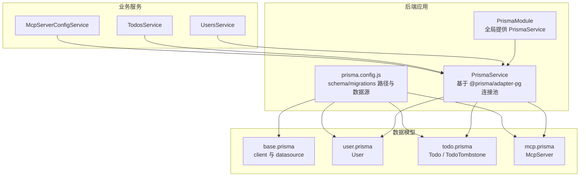
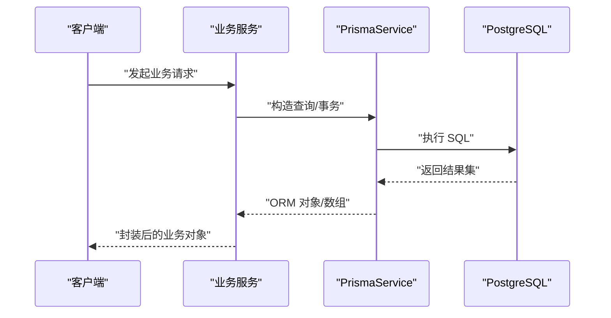
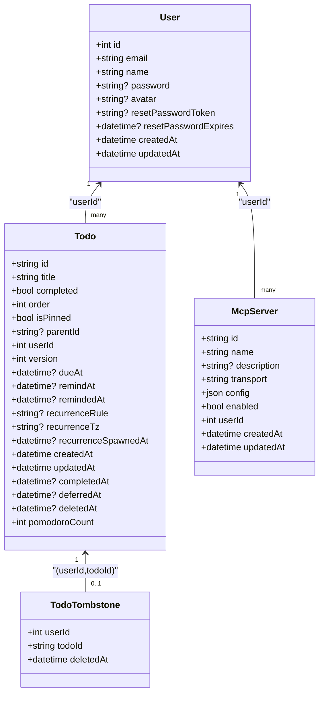
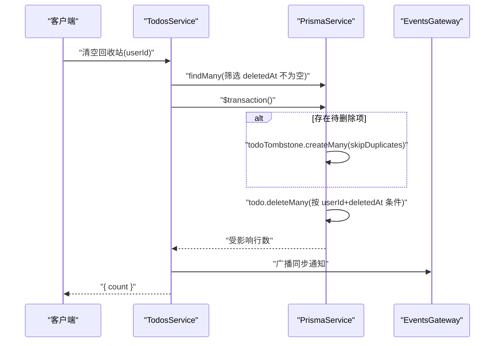
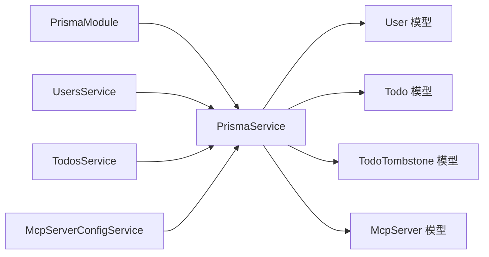

# 数据库设计

<cite>
**本文引用的文件**
- [apps/backend/prisma/schema/base.prisma](file://apps/backend/prisma/schema/base.prisma)
- [apps/backend/prisma/schema/user.prisma](file://apps/backend/prisma/schema/user.prisma)
- [apps/backend/prisma/schema/todo.prisma](file://apps/backend/prisma/schema/todo.prisma)
- [apps/backend/prisma/schema/mcp.prisma](file://apps/backend/prisma/schema/mcp.prisma)
- [apps/backend/prisma.config.js](file://apps/backend/prisma.config.js)
- [apps/backend/src/prisma/prisma.service.ts](file://apps/backend/src/prisma/prisma.service.ts)
- [apps/backend/src/prisma/prisma.module.ts](file://apps/backend/src/prisma/prisma.module.ts)
- [apps/backend/src/users/users.service.ts](file://apps/backend/src/users/users.service.ts)
- [apps/backend/src/todos/todos.service.ts](file://apps/backend/src/todos/todos.service.ts)
- [apps/backend/src/mcp/mcp-server-config.service.ts](file://apps/backend/src/mcp/mcp-server-config.service.ts)
- [packages/shared/src/schemas/todo.schema.ts](file://packages/shared/src/schemas/todo.schema.ts)
- [packages/shared/src/schemas/mcp.schema.ts](file://packages/shared/src/schemas/mcp.schema.ts)
- [apps/backend/package.json](file://apps/backend/package.json)
</cite>

## 目录
1. [简介](#简介)
2. [项目结构](#项目结构)
3. [核心组件](#核心组件)
4. [架构总览](#架构总览)
5. [详细组件分析](#详细组件分析)
6. [依赖分析](#依赖分析)
7. [性能考虑](#性能考虑)
8. [故障排查指南](#故障排查指南)
9. [结论](#结论)
10. [附录](#附录)

## 简介
本文件面向数据库开发者与架构师，系统化阐述 Lumina Todo 的数据库设计与 Prisma ORM 使用实践。内容涵盖数据模型定义、关系映射与约束、索引策略与查询优化、迁移与部署、数据验证与业务约束、数据访问模式与缓存策略，并结合实际代码路径给出实现细节与最佳实践。

## 项目结构
后端采用 NestJS + Prisma 架构，数据库层通过 Prisma Service 统一接入 PostgreSQL。数据模型按领域拆分至独立 schema 文件，配合全局注入的 PrismaModule 提供客户端实例；迁移与生成命令在应用包中定义，配置文件集中管理数据源与迁移路径。

图表来源
- [apps/backend/src/prisma/prisma.module.ts:1-10](file://apps/backend/src/prisma/prisma.module.ts#L1-L10)
- [apps/backend/src/prisma/prisma.service.ts:1-34](file://apps/backend/src/prisma/prisma.service.ts#L1-L34)
- [apps/backend/prisma.config.js:1-22](file://apps/backend/prisma.config.js#L1-L22)
- [apps/backend/prisma/schema/base.prisma:1-9](file://apps/backend/prisma/schema/base.prisma#L1-L9)
- [apps/backend/prisma/schema/user.prisma:1-16](file://apps/backend/prisma/schema/user.prisma#L1-L16)
- [apps/backend/prisma/schema/todo.prisma:1-40](file://apps/backend/prisma/schema/todo.prisma#L1-L40)
- [apps/backend/prisma/schema/mcp.prisma:1-16](file://apps/backend/prisma/schema/mcp.prisma#L1-L16)
- [apps/backend/src/users/users.service.ts:1-118](file://apps/backend/src/users/users.service.ts#L1-L118)
- [apps/backend/src/todos/todos.service.ts:1-147](file://apps/backend/src/todos/todos.service.ts#L1-L147)
- [apps/backend/src/mcp/mcp-server-config.service.ts:1-156](file://apps/backend/src/mcp/mcp-server-config.service.ts#L1-L156)

章节来源
- [apps/backend/src/prisma/prisma.module.ts:1-10](file://apps/backend/src/prisma/prisma.module.ts#L1-L10)
- [apps/backend/src/prisma/prisma.service.ts:1-34](file://apps/backend/src/prisma/prisma.service.ts#L1-L34)
- [apps/backend/prisma.config.js:1-22](file://apps/backend/prisma.config.js#L1-L22)

## 核心组件
- 数据模型与关系
  - User：用户主表，包含邮箱唯一性、密码哈希、头像、重置令牌与过期时间等字段，并与 Todo、McpServer 建立一对多关系。
  - Todo：待办事项表，支持 UUID 主键、完成状态、排序、置顶、父节点、版本号、到期/提醒时间、递归规则与时区、完成/延期/删除时间戳、番茄钟计数等；与 User 建立多对一关系。
  - McpServer：外部 MCP 服务器配置表，支持传输类型（HTTP/STDIO）、JSON 配置、启用状态、外键关联用户；删除时级联。
  - TodoTombstone：软删除墓碑表，记录被删除的 todo 与用户组合的删除时间，复合主键避免重复。
- 索引策略
  - Todo 上针对 (userId, updatedAt)、(userId, remindAt)、(userId, dueAt)、(deletedAt) 建有索引，覆盖常见查询与回收站场景。
  - McpServer 上针对 (userId) 建有索引，便于按用户检索。
- 约束与映射
  - User.email 唯一；User.id 自增主键；Todo.id 默认 UUID；McpServer.id 默认 UUID。
  - Todo.userId 关系映射到 User.id；McpServer.userId 关系映射到 User.id 并设置删除级联。
  - Todo 与 TodoTombstone 通过 (userId, todoId) 组合进行 upsert/查询，保证软删除一致性。

章节来源
- [apps/backend/prisma/schema/user.prisma:1-16](file://apps/backend/prisma/schema/user.prisma#L1-L16)
- [apps/backend/prisma/schema/todo.prisma:1-40](file://apps/backend/prisma/schema/todo.prisma#L1-L40)
- [apps/backend/prisma/schema/mcp.prisma:1-16](file://apps/backend/prisma/schema/mcp.prisma#L1-L16)

## 架构总览
下图展示 Prisma 在应用中的装配与使用流程：全局模块提供 PrismaService，业务服务通过依赖注入获取客户端，执行查询与事务操作。

图表来源
- [apps/backend/src/prisma/prisma.module.ts:1-10](file://apps/backend/src/prisma/prisma.module.ts#L1-L10)
- [apps/backend/src/prisma/prisma.service.ts:1-34](file://apps/backend/src/prisma/prisma.service.ts#L1-L34)
- [apps/backend/src/users/users.service.ts:1-118](file://apps/backend/src/users/users.service.ts#L1-L118)
- [apps/backend/src/todos/todos.service.ts:1-147](file://apps/backend/src/todos/todos.service.ts#L1-L147)
- [apps/backend/src/mcp/mcp-server-config.service.ts:1-156](file://apps/backend/src/mcp/mcp-server-config.service.ts#L1-L156)

## 详细组件分析

### 数据模型类图

图表来源
- [apps/backend/prisma/schema/user.prisma:1-16](file://apps/backend/prisma/schema/user.prisma#L1-L16)
- [apps/backend/prisma/schema/todo.prisma:1-40](file://apps/backend/prisma/schema/todo.prisma#L1-L40)
- [apps/backend/prisma/schema/mcp.prisma:1-16](file://apps/backend/prisma/schema/mcp.prisma#L1-L16)

章节来源
- [apps/backend/prisma/schema/user.prisma:1-16](file://apps/backend/prisma/schema/user.prisma#L1-L16)
- [apps/backend/prisma/schema/todo.prisma:1-40](file://apps/backend/prisma/schema/todo.prisma#L1-L40)
- [apps/backend/prisma/schema/mcp.prisma:1-16](file://apps/backend/prisma/schema/mcp.prisma#L1-L16)

### 查询流程与事务（软删除与回收站）

图表来源
- [apps/backend/src/todos/todos.service.ts:116-145](file://apps/backend/src/todos/todos.service.ts#L116-L145)

章节来源
- [apps/backend/src/todos/todos.service.ts:116-145](file://apps/backend/src/todos/todos.service.ts#L116-L145)

### 数据验证与业务约束
- Todo 验证
  - 字段长度与范围约束、可空性、日期字符串兼容、递归规则枚举、时区长度限制等，详见共享 DTO 定义。
- MCP 服务器配置验证
  - 传输类型与配置必须匹配（STDIO/HTTP），HTTP URL 必须为公网地址且不允许私有/环回主机名，支持 Bearer/API Key/OAuth 认证参数校验。
- 业务约束
  - 用户邮箱唯一；Todo 与 TodoTombstone 通过 (userId, todoId) 组合保证墓碑唯一；McpServer 删除级联清理。

章节来源
- [packages/shared/src/schemas/todo.schema.ts:1-76](file://packages/shared/src/schemas/todo.schema.ts#L1-L76)
- [packages/shared/src/schemas/mcp.schema.ts:1-220](file://packages/shared/src/schemas/mcp.schema.ts#L1-L220)
- [apps/backend/prisma/schema/todo.prisma:31-40](file://apps/backend/prisma/schema/todo.prisma#L31-L40)
- [apps/backend/prisma/schema/mcp.prisma:11-11](file://apps/backend/prisma/schema/mcp.prisma#L11-L11)

### 数据访问模式与缓存策略
- 访问模式
  - 通过 PrismaService 在各业务服务中直接查询或批量操作，如 UsersService 的邮箱/ID 查询、TodosService 的回收站清空与软删除墓碑 upsert、McpServerConfigService 的 CRUD。
- 缓存策略
  - 应用依赖 cache-manager 与 ioredis 实现缓存与健康检查，但当前仓库未见数据库层显式缓存装饰器或读写分离配置；建议在高频查询上引入缓存装饰器与只读副本路由（需在 PrismaService 层扩展连接池与路由策略）。

章节来源
- [apps/backend/src/users/users.service.ts:1-118](file://apps/backend/src/users/users.service.ts#L1-L118)
- [apps/backend/src/todos/todos.service.ts:1-147](file://apps/backend/src/todos/todos.service.ts#L1-L147)
- [apps/backend/src/mcp/mcp-server-config.service.ts:1-156](file://apps/backend/src/mcp/mcp-server-config.service.ts#L1-L156)
- [apps/backend/package.json:63-63](file://apps/backend/package.json#L63-L63)

## 依赖分析
- 模块耦合
  - PrismaModule 全局提供 PrismaService，业务服务通过依赖注入使用，降低耦合度。
  - Todo 与 TodoTombstone 通过事务协同，保证软删除一致性。
- 外部依赖
  - @prisma/adapter-pg + pg Pool 提供连接池；prisma client 生成类型安全的查询接口。
- 潜在风险
  - 当前未发现循环依赖；若后续引入读写分离或分布式缓存，需评估 PrismaService 的扩展点与路由策略。

图表来源
- [apps/backend/src/prisma/prisma.module.ts:1-10](file://apps/backend/src/prisma/prisma.module.ts#L1-L10)
- [apps/backend/src/prisma/prisma.service.ts:1-34](file://apps/backend/src/prisma/prisma.service.ts#L1-L34)
- [apps/backend/src/users/users.service.ts:1-118](file://apps/backend/src/users/users.service.ts#L1-L118)
- [apps/backend/src/todos/todos.service.ts:1-147](file://apps/backend/src/todos/todos.service.ts#L1-L147)
- [apps/backend/src/mcp/mcp-server-config.service.ts:1-156](file://apps/backend/src/mcp/mcp-server-config.service.ts#L1-L156)

章节来源
- [apps/backend/src/prisma/prisma.module.ts:1-10](file://apps/backend/src/prisma/prisma.module.ts#L1-L10)
- [apps/backend/src/prisma/prisma.service.ts:1-34](file://apps/backend/src/prisma/prisma.service.ts#L1-L34)

## 性能考虑
- 索引与查询
  - Todo 已针对 (userId, updatedAt)、(userId, remindAt)、(userId, dueAt)、(deletedAt) 建立索引，有助于回收站、到期/提醒查询与软删除过滤。
  - 建议在高并发场景下对 (userId, deletedAt) 建立复合索引以优化回收站查询。
- 连接池与适配器
  - 使用 @prisma/adapter-pg + pg.Pool，建议在生产环境配置合理的最大连接数、空闲超时与重试策略。
- 事务与批量
  - 回收站清空使用 $transaction 与 createMany(skipDuplicates)，减少往返并保证幂等。
- 分页与投影
  - TodosService 使用 select 投影常用字段，减少网络与序列化开销；建议在前端分页时结合索引列排序（如 isPinned/createdAt）。

章节来源
- [apps/backend/prisma/schema/todo.prisma:24-28](file://apps/backend/prisma/schema/todo.prisma#L24-L28)
- [apps/backend/src/todos/todos.service.ts:5-25](file://apps/backend/src/todos/todos.service.ts#L5-L25)
- [apps/backend/src/todos/todos.service.ts:116-145](file://apps/backend/src/todos/todos.service.ts#L116-L145)
- [apps/backend/src/prisma/prisma.service.ts:1-34](file://apps/backend/src/prisma/prisma.service.ts#L1-L34)

## 故障排查指南
- 连接问题
  - 确认 DATABASE_URL 环境变量存在且可连通；PrismaService 构造函数会校验该值。
- 生成与迁移
  - 使用脚本生成客户端与迁移：prisma:generate、prisma:migrate；若 schema 路径或数据源变更，请同步 prisma.config.js。
- 数据一致性
  - 软删除依赖事务与墓碑 upsert，若出现冲突，检查 (userId, todoId) 唯一键约束与事务隔离级别。
- 业务异常
  - 用户邮箱冲突、MCP 配置权限不足、无效 ID 等均在服务层抛出明确异常，定位到对应 DTO/验证层与服务方法。

章节来源
- [apps/backend/src/prisma/prisma.service.ts:10-21](file://apps/backend/src/prisma/prisma.service.ts#L10-L21)
- [apps/backend/package.json:26-29](file://apps/backend/package.json#L26-L29)
- [apps/backend/prisma.config.js:13-21](file://apps/backend/prisma.config.js#L13-L21)
- [apps/backend/src/users/users.service.ts:96-103](file://apps/backend/src/users/users.service.ts#L96-L103)
- [apps/backend/src/mcp/mcp-server-config.service.ts:114-127](file://apps/backend/src/mcp/mcp-server-config.service.ts#L114-L127)

## 结论
本设计以清晰的领域模型与严格的索引策略为基础，结合 Prisma 的类型安全与事务能力，实现了用户、待办与 MCP 服务器配置的完整数据流。建议在生产环境中完善连接池参数、补充回收站复合索引、在高频查询处引入缓存与只读副本路由，并持续通过迁移脚本演进 schema 与约束，确保数据完整性与性能双优。

## 附录
- 命令速查
  - 生成客户端：prisma:generate
  - 推送开发库：prisma:push
  - 迁移开发库：prisma:migrate
  - 启动 Studio：prisma:studio
- 配置要点
  - schema 路径与迁移路径在 prisma.config.js 中集中管理；数据源 URL 从环境变量注入。

章节来源
- [apps/backend/package.json:26-29](file://apps/backend/package.json#L26-L29)
- [apps/backend/prisma.config.js:13-21](file://apps/backend/prisma.config.js#L13-L21)