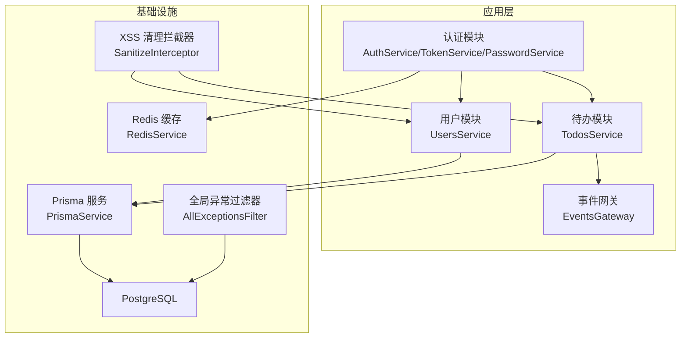
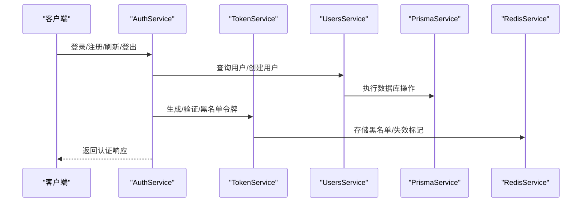
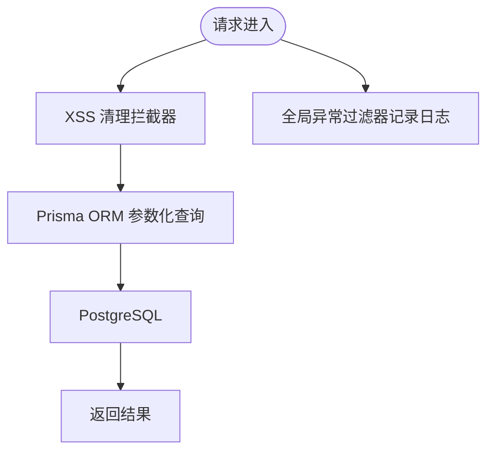
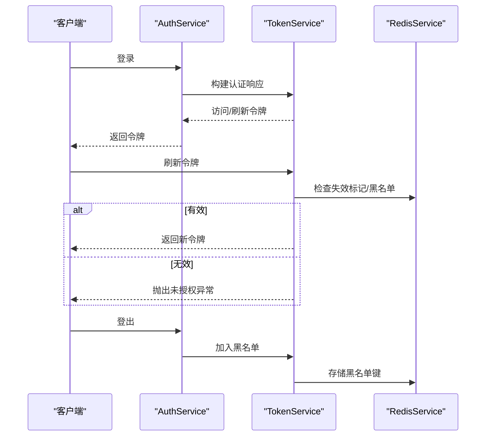
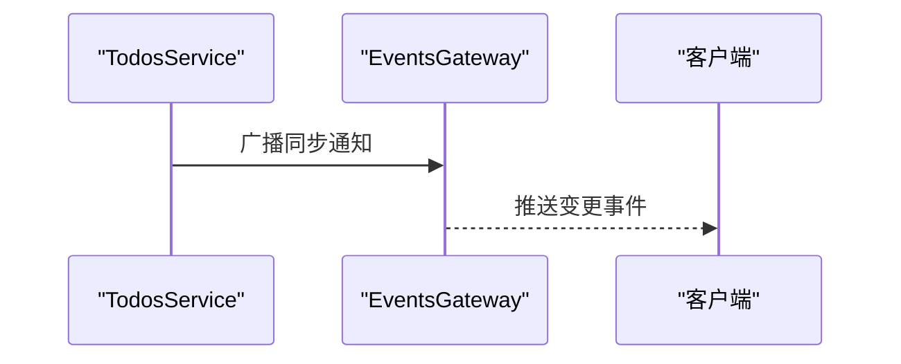
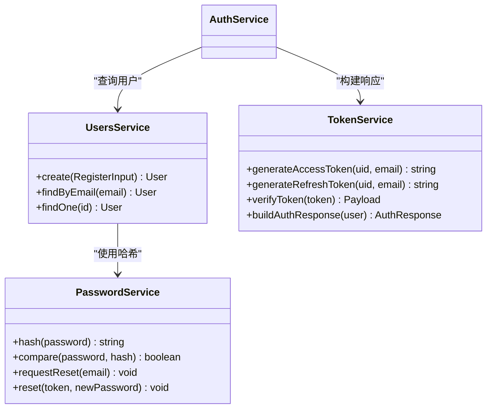
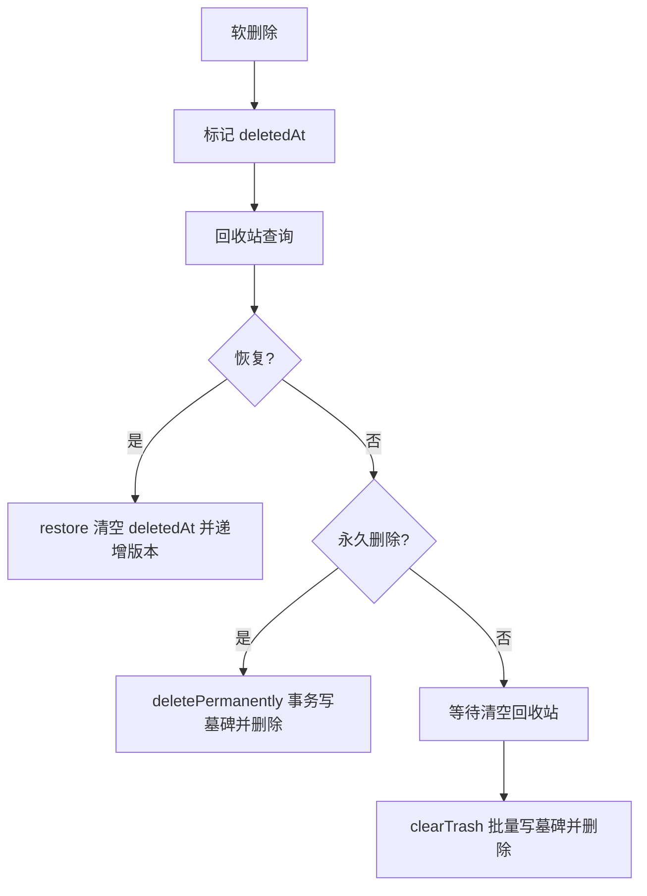
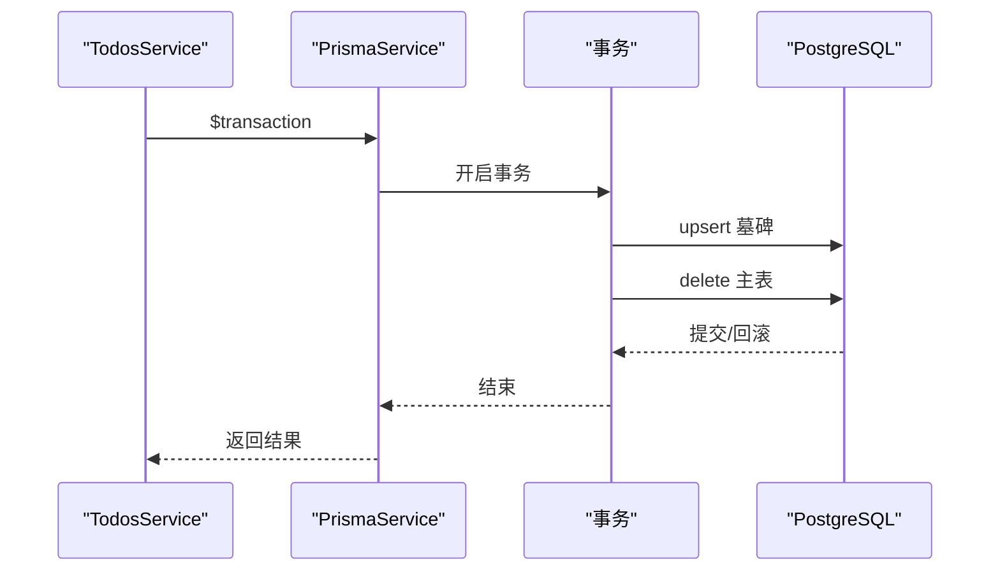
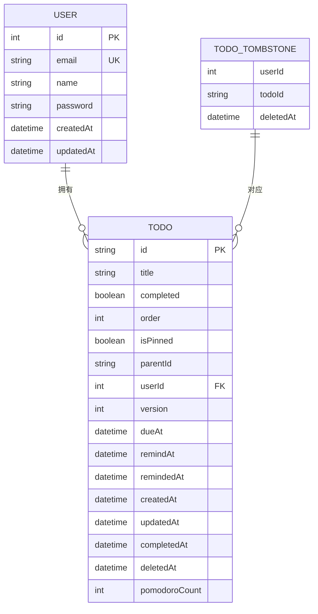
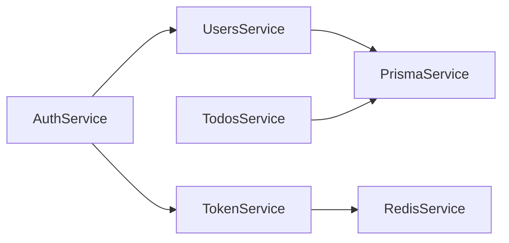

# 安全与数据完整性

<cite>
**本文引用的文件**
- [apps/backend/src/prisma/prisma.service.ts](file://apps/backend/src/prisma/prisma.service.ts)
- [apps/backend/src/auth/auth.service.ts](file://apps/backend/src/auth/auth.service.ts)
- [apps/backend/src/auth/password.service.ts](file://apps/backend/src/auth/password.service.ts)
- [apps/backend/src/auth/token.service.ts](file://apps/backend/src/auth/token.service.ts)
- [apps/backend/src/users/users.service.ts](file://apps/backend/src/users/users.service.ts)
- [apps/backend/src/todos/todos.service.ts](file://apps/backend/src/todos/todos.service.ts)
- [apps/backend/src/common/filters/all-exceptions.filter.ts](file://apps/backend/src/common/filters/all-exceptions.filter.ts)
- [apps/backend/src/common/interceptors/sanitize.interceptor.ts](file://apps/backend/src/common/interceptors/sanitize.interceptor.ts)
- [apps/backend/src/redis/redis.service.ts](file://apps/backend/src/redis/redis.service.ts)
- [apps/backend/prisma/schema/todo.prisma](file://apps/backend/prisma/schema/todo.prisma)
- [apps/backend/prisma/schema/user.prisma](file://apps/backend/prisma/schema/user.prisma)
- [apps/backend/prisma/schema/base.prisma](file://apps/backend/prisma/schema/base.prisma)
- [scripts/security-audit.js](file://scripts/security-audit.js)
- [SECURITY.md](file://SECURITY.md)
</cite>

## 目录
1. 引言
2. 项目结构
3. 核心组件
4. 架构总览
5. 详细组件分析
6. 依赖关系分析
7. 性能考量
8. 故障排查指南
9. 结论
10. 附录

## 引言
本文件聚焦 Lumina Todo 的数据库安全与数据完整性保护，系统性阐述以下主题：
- SQL 注入防护与参数化查询
- 数据访问控制与权限管理
- 审计日志与数据变更追踪
- 数据加密与敏感信息保护
- 软删除与数据恢复机制
- 事务管理与并发控制
- 数据备份与恢复方案
- 数据一致性检查与完整性约束
- 安全漏洞扫描与修复指南
- GDPR 合规与数据保护措施

## 项目结构
后端采用 NestJS + Prisma + PostgreSQL + Redis 的技术栈。数据库连接通过 PrismaClient 与 Postgres Pool 管理；认证与会话通过 JWT + Redis 黑名单与失效机制保障；XSS 防护通过全局拦截器实现；异常统一由全局过滤器处理并记录日志。

图表来源
- [apps/backend/src/auth/auth.service.ts:1-127](file://apps/backend/src/auth/auth.service.ts#L1-L127)
- [apps/backend/src/auth/token.service.ts:1-187](file://apps/backend/src/auth/token.service.ts#L1-L187)
- [apps/backend/src/auth/password.service.ts:1-100](file://apps/backend/src/auth/password.service.ts#L1-L100)
- [apps/backend/src/users/users.service.ts:1-110](file://apps/backend/src/users/users.service.ts#L1-L110)
- [apps/backend/src/todos/todos.service.ts:1-146](file://apps/backend/src/todos/todos.service.ts#L1-L146)
- [apps/backend/src/prisma/prisma.service.ts:1-34](file://apps/backend/src/prisma/prisma.service.ts#L1-L34)
- [apps/backend/src/redis/redis.service.ts:1-233](file://apps/backend/src/redis/redis.service.ts#L1-L233)
- [apps/backend/src/common/filters/all-exceptions.filter.ts:1-137](file://apps/backend/src/common/filters/all-exceptions.filter.ts#L1-L137)
- [apps/backend/src/common/interceptors/sanitize.interceptor.ts:1-64](file://apps/backend/src/common/interceptors/sanitize.interceptor.ts#L1-L64)

章节来源
- [apps/backend/src/prisma/prisma.service.ts:1-34](file://apps/backend/src/prisma/prisma.service.ts#L1-L34)
- [apps/backend/src/auth/auth.service.ts:1-127](file://apps/backend/src/auth/auth.service.ts#L1-L127)
- [apps/backend/src/auth/token.service.ts:1-187](file://apps/backend/src/auth/token.service.ts#L1-L187)
- [apps/backend/src/auth/password.service.ts:1-100](file://apps/backend/src/auth/password.service.ts#L1-L100)
- [apps/backend/src/users/users.service.ts:1-110](file://apps/backend/src/users/users.service.ts#L1-L110)
- [apps/backend/src/todos/todos.service.ts:1-146](file://apps/backend/src/todos/todos.service.ts#L1-L146)
- [apps/backend/src/common/filters/all-exceptions.filter.ts:1-137](file://apps/backend/src/common/filters/all-exceptions.filter.ts#L1-L137)
- [apps/backend/src/common/interceptors/sanitize.interceptor.ts:1-64](file://apps/backend/src/common/interceptors/sanitize.interceptor.ts#L1-L64)
- [apps/backend/src/redis/redis.service.ts:1-233](file://apps/backend/src/redis/redis.service.ts#L1-L233)

## 核心组件
- 数据库访问层：通过 PrismaService 统一连接 PostgreSQL，使用 PrismaPg 适配器与连接池，确保连接安全与资源回收。
- 认证与授权：AuthService 聚合 TokenService 与 PasswordService，提供登录、注册、刷新、登出、密码重置等能力；TokenService 使用 JWT 并结合 Redis 黑名单与失效标记实现强会话控制。
- 用户与待办：UsersService 负责用户 CRUD 与密码哈希；TodosService 提供软删除、回收站、恢复与永久删除，并通过事务保证一致性。
- 安全中间件：SanitizeInterceptor 对请求体/查询/路径参数进行 XSS 清理；AllExceptionsFilter 统一错误输出并记录日志。
- 缓存与会话：RedisService 提供命名空间缓存、TTL 管理、黑名单存储等。

章节来源
- [apps/backend/src/prisma/prisma.service.ts:1-34](file://apps/backend/src/prisma/prisma.service.ts#L1-L34)
- [apps/backend/src/auth/auth.service.ts:1-127](file://apps/backend/src/auth/auth.service.ts#L1-L127)
- [apps/backend/src/auth/token.service.ts:1-187](file://apps/backend/src/auth/token.service.ts#L1-L187)
- [apps/backend/src/auth/password.service.ts:1-100](file://apps/backend/src/auth/password.service.ts#L1-L100)
- [apps/backend/src/users/users.service.ts:1-110](file://apps/backend/src/users/users.service.ts#L1-L110)
- [apps/backend/src/todos/todos.service.ts:1-146](file://apps/backend/src/todos/todos.service.ts#L1-L146)
- [apps/backend/src/common/interceptors/sanitize.interceptor.ts:1-64](file://apps/backend/src/common/interceptors/sanitize.interceptor.ts#L1-L64)
- [apps/backend/src/common/filters/all-exceptions.filter.ts:1-137](file://apps/backend/src/common/filters/all-exceptions.filter.ts#L1-L137)
- [apps/backend/src/redis/redis.service.ts:1-233](file://apps/backend/src/redis/redis.service.ts#L1-L233)

## 架构总览
下图展示从客户端到数据库的关键交互路径，以及安全控制点：

图表来源
- [apps/backend/src/auth/auth.service.ts:1-127](file://apps/backend/src/auth/auth.service.ts#L1-L127)
- [apps/backend/src/auth/token.service.ts:1-187](file://apps/backend/src/auth/token.service.ts#L1-L187)
- [apps/backend/src/users/users.service.ts:1-110](file://apps/backend/src/users/users.service.ts#L1-L110)
- [apps/backend/src/prisma/prisma.service.ts:1-34](file://apps/backend/src/prisma/prisma.service.ts#L1-L34)
- [apps/backend/src/redis/redis.service.ts:1-233](file://apps/backend/src/redis/redis.service.ts#L1-L233)

## 详细组件分析

### SQL 注入防护与参数化查询
- 参数化查询：所有数据访问通过 Prisma ORM 执行，Prisma 在底层对输入进行参数化绑定，有效防止 SQL 注入。
- 输入清理：SanitizeInterceptor 对请求体、查询参数与路径参数进行递归清理，移除潜在恶意标签，降低二次注入风险。
- 异常与日志：AllExceptionsFilter 记录请求 URL、状态码与堆栈，便于定位问题与审计。

图表来源
- [apps/backend/src/common/interceptors/sanitize.interceptor.ts:1-64](file://apps/backend/src/common/interceptors/sanitize.interceptor.ts#L1-L64)
- [apps/backend/src/prisma/prisma.service.ts:1-34](file://apps/backend/src/prisma/prisma.service.ts#L1-L34)
- [apps/backend/src/common/filters/all-exceptions.filter.ts:1-137](file://apps/backend/src/common/filters/all-exceptions.filter.ts#L1-L137)

章节来源
- [apps/backend/src/common/interceptors/sanitize.interceptor.ts:1-64](file://apps/backend/src/common/interceptors/sanitize.interceptor.ts#L1-L64)
- [apps/backend/src/prisma/prisma.service.ts:1-34](file://apps/backend/src/prisma/prisma.service.ts#L1-L34)
- [apps/backend/src/common/filters/all-exceptions.filter.ts:1-137](file://apps/backend/src/common/filters/all-exceptions.filter.ts#L1-L137)

### 数据访问控制与权限管理
- 认证与授权：AuthService 聚合用户校验、令牌构建；TokenService 生成短期访问令牌与长期刷新令牌，并支持黑名单与失效标记。
- 会话失效：invalidateUserSessions 将用户最近失效时间写入 Redis，后续刷新流程校验 token 的签发时间是否早于失效时间。
- 登出机制：logout 将刷新令牌加入黑名单，确保令牌无法再次使用。

图表来源
- [apps/backend/src/auth/auth.service.ts:1-127](file://apps/backend/src/auth/auth.service.ts#L1-L127)
- [apps/backend/src/auth/token.service.ts:1-187](file://apps/backend/src/auth/token.service.ts#L1-L187)
- [apps/backend/src/redis/redis.service.ts:1-233](file://apps/backend/src/redis/redis.service.ts#L1-L233)

章节来源
- [apps/backend/src/auth/auth.service.ts:1-127](file://apps/backend/src/auth/auth.service.ts#L1-L127)
- [apps/backend/src/auth/token.service.ts:1-187](file://apps/backend/src/auth/token.service.ts#L1-L187)
- [apps/backend/src/redis/redis.service.ts:1-233](file://apps/backend/src/redis/redis.service.ts#L1-L233)

### 审计日志与数据变更追踪
- 全局异常审计：AllExceptionsFilter 记录请求方法、URL、状态码与堆栈，统一输出标准化错误响应，便于审计与排障。
- 变更通知：TodosService 在软删除、恢复、清空回收站等操作后触发事件广播，实现客户端同步。

图表来源
- [apps/backend/src/common/filters/all-exceptions.filter.ts:1-137](file://apps/backend/src/common/filters/all-exceptions.filter.ts#L1-L137)
- [apps/backend/src/todos/todos.service.ts:1-146](file://apps/backend/src/todos/todos.service.ts#L1-L146)

章节来源
- [apps/backend/src/common/filters/all-exceptions.filter.ts:1-137](file://apps/backend/src/common/filters/all-exceptions.filter.ts#L1-L137)
- [apps/backend/src/todos/todos.service.ts:1-146](file://apps/backend/src/todos/todos.service.ts#L1-L146)

### 数据加密与敏感信息保护
- 密码存储：UsersService 与 PasswordService 使用 bcrypt 对密码进行哈希存储，注册与重置流程均采用哈希比较。
- 令牌安全：TokenService 使用独立的访问与刷新密钥，生产环境强制配置刷新密钥；令牌过期时间严格控制。
- 传输安全：建议配合 HTTPS 与安全头策略，避免明文传输。

图表来源
- [apps/backend/src/users/users.service.ts:1-110](file://apps/backend/src/users/users.service.ts#L1-L110)
- [apps/backend/src/auth/password.service.ts:1-100](file://apps/backend/src/auth/password.service.ts#L1-L100)
- [apps/backend/src/auth/token.service.ts:1-187](file://apps/backend/src/auth/token.service.ts#L1-L187)
- [apps/backend/src/auth/auth.service.ts:1-127](file://apps/backend/src/auth/auth.service.ts#L1-L127)

章节来源
- [apps/backend/src/users/users.service.ts:1-110](file://apps/backend/src/users/users.service.ts#L1-L110)
- [apps/backend/src/auth/password.service.ts:1-100](file://apps/backend/src/auth/password.service.ts#L1-L100)
- [apps/backend/src/auth/token.service.ts:1-187](file://apps/backend/src/auth/token.service.ts#L1-L187)
- [apps/backend/src/auth/auth.service.ts:1-127](file://apps/backend/src/auth/auth.service.ts#L1-L127)

### 软删除与数据恢复机制
- 软删除字段：Todo 模型包含 deletedAt 字段，删除时不物理移除，而是标记删除时间。
- 回收站查询：TodosService 提供回收站查询接口，按删除时间倒序展示。
- 恢复与永久删除：restore 将 deletedAt 清空并版本号递增；deletePermanently 通过事务写入墓碑表并删除主表记录；clearTrash 清空回收站并批量写入墓碑。
- 广播同步：上述操作完成后广播同步事件，确保客户端一致。

图表来源
- [apps/backend/src/todos/todos.service.ts:1-146](file://apps/backend/src/todos/todos.service.ts#L1-L146)
- [apps/backend/prisma/schema/todo.prisma:1-39](file://apps/backend/prisma/schema/todo.prisma#L1-L39)

章节来源
- [apps/backend/src/todos/todos.service.ts:1-146](file://apps/backend/src/todos/todos.service.ts#L1-L146)
- [apps/backend/prisma/schema/todo.prisma:1-39](file://apps/backend/prisma/schema/todo.prisma#L1-L39)

### 事务管理与并发控制
- 事务边界：TodosService 在“永久删除”和“清空回收站”场景使用 Prisma 事务，确保墓碑与主表的一致性。
- 并发控制：通过数据库层面的唯一索引与外键约束，配合 Prisma 的原子操作，减少竞态条件。
- 版本号：Todo 模型包含 version 字段，用于乐观锁场景下的并发更新控制（可扩展）。

图表来源
- [apps/backend/src/todos/todos.service.ts:96-106](file://apps/backend/src/todos/todos.service.ts#L96-L106)
- [apps/backend/src/todos/todos.service.ts:126-140](file://apps/backend/src/todos/todos.service.ts#L126-L140)

章节来源
- [apps/backend/src/todos/todos.service.ts:96-106](file://apps/backend/src/todos/todos.service.ts#L96-L106)
- [apps/backend/src/todos/todos.service.ts:126-140](file://apps/backend/src/todos/todos.service.ts#L126-L140)

### 数据备份与恢复方案
- 逻辑备份：建议使用 Prisma 与数据库导出工具定期导出 schema 与数据，结合版本控制保存快照。
- 物理备份：PostgreSQL 支持逻辑/物理备份策略，结合 WAL 归档实现增量备份。
- 恢复演练：制定恢复流程与演练计划，验证备份数据的可用性与一致性。
- 回收站与墓碑：利用 TodoTombstone 记录永久删除历史，辅助数据恢复决策。

章节来源
- [apps/backend/prisma/schema/todo.prisma:30-38](file://apps/backend/prisma/schema/todo.prisma#L30-L38)

### 数据一致性检查与完整性约束
- 数据模型：User 的 email 唯一；Todo 与 User 外键关联；索引覆盖常用查询字段（如 userId、dueAt、remindAt）。
- 约束与默认值：布尔默认值、时间戳默认值、可空字段设计，降低脏数据风险。
- 事务一致性：通过事务保证跨表写入的原子性。

图表来源
- [apps/backend/prisma/schema/user.prisma:1-16](file://apps/backend/prisma/schema/user.prisma#L1-L16)
- [apps/backend/prisma/schema/todo.prisma:1-39](file://apps/backend/prisma/schema/todo.prisma#L1-L39)
- [apps/backend/prisma/schema/base.prisma:1-9](file://apps/backend/prisma/schema/base.prisma#L1-L9)

章节来源
- [apps/backend/prisma/schema/user.prisma:1-16](file://apps/backend/prisma/schema/user.prisma#L1-L16)
- [apps/backend/prisma/schema/todo.prisma:1-39](file://apps/backend/prisma/schema/todo.prisma#L1-L39)
- [apps/backend/prisma/schema/base.prisma:1-9](file://apps/backend/prisma/schema/base.prisma#L1-L9)

### 安全漏洞扫描与修复指南
- 依赖审计：脚本 security-audit.js 调用 pnpm audit，解析 JSON 输出并忽略白名单条目，未忽略漏洞将导致退出码非零。
- 修复流程：针对中等及以上严重级别漏洞，优先升级依赖或应用补丁；对无法立即修复的漏洞，评估影响并制定缓解措施。

章节来源
- [scripts/security-audit.js:1-53](file://scripts/security-audit.js#L1-L53)
- [SECURITY.md:1-40](file://SECURITY.md#L1-L40)

### GDPR 合规与数据保护
- 数据最小化：仅收集必要字段（如 email、name），避免过度采集。
- 用户权利：提供密码重置与账户删除能力；通过软删除与墓碑记录保留合规审计痕迹。
- 传输与存储：使用 HTTPS 与安全头；密码使用强哈希；令牌设置合理过期时间并支持黑名单。
- 安全政策：遵循项目安全策略，私有渠道报告漏洞，及时修复并发布更新。

章节来源
- [apps/backend/src/auth/password.service.ts:39-61](file://apps/backend/src/auth/password.service.ts#L39-L61)
- [apps/backend/src/auth/token.service.ts:30-45](file://apps/backend/src/auth/token.service.ts#L30-L45)
- [SECURITY.md:1-40](file://SECURITY.md#L1-L40)

## 依赖关系分析
- 组件耦合：AuthService 依赖 UsersService 与 TokenService；UsersService/ TodosService 依赖 PrismaService；TokenService 依赖 RedisService。
- 外部依赖：PostgreSQL 作为持久化存储；Redis 用于缓存与会话状态；Prisma 作为 ORM。
- 循环依赖：当前模块间无明显循环依赖迹象。

图表来源
- [apps/backend/src/auth/auth.service.ts:1-127](file://apps/backend/src/auth/auth.service.ts#L1-L127)
- [apps/backend/src/users/users.service.ts:1-110](file://apps/backend/src/users/users.service.ts#L1-L110)
- [apps/backend/src/todos/todos.service.ts:1-146](file://apps/backend/src/todos/todos.service.ts#L1-L146)
- [apps/backend/src/auth/token.service.ts:1-187](file://apps/backend/src/auth/token.service.ts#L1-L187)
- [apps/backend/src/prisma/prisma.service.ts:1-34](file://apps/backend/src/prisma/prisma.service.ts#L1-L34)
- [apps/backend/src/redis/redis.service.ts:1-233](file://apps/backend/src/redis/redis.service.ts#L1-L233)

章节来源
- [apps/backend/src/auth/auth.service.ts:1-127](file://apps/backend/src/auth/auth.service.ts#L1-L127)
- [apps/backend/src/users/users.service.ts:1-110](file://apps/backend/src/users/users.service.ts#L1-L110)
- [apps/backend/src/todos/todos.service.ts:1-146](file://apps/backend/src/todos/todos.service.ts#L1-L146)
- [apps/backend/src/auth/token.service.ts:1-187](file://apps/backend/src/auth/token.service.ts#L1-L187)
- [apps/backend/src/prisma/prisma.service.ts:1-34](file://apps/backend/src/prisma/prisma.service.ts#L1-L34)
- [apps/backend/src/redis/redis.service.ts:1-233](file://apps/backend/src/redis/redis.service.ts#L1-L233)

## 性能考量
- 连接池：PrismaService 使用 Postgres Pool，建议根据并发与数据库性能调优连接数与超时。
- 缓存策略：RedisService 提供 TTL 与命名空间，建议对热点数据与会话状态启用缓存，降低数据库压力。
- 查询优化：依据 schema 中索引设计，确保高频查询命中索引；避免 N+1 查询，使用 select 精简字段。
- 事务粒度：将相关写操作放入事务，减少锁竞争与不一致窗口。

## 故障排查指南
- SQL 注入与参数化：确认所有外部输入经由 Prisma ORM；若需原生查询，请使用参数绑定。
- XSS 防护：检查 SanitizeInterceptor 是否生效；对富文本场景，评估白名单策略。
- 会话异常：核对 TokenService 的密钥配置与 Redis 可用性；检查黑名单键与失效标记。
- 数据不一致：审查事务边界与索引设计；对并发更新引入版本号或乐观锁。
- 日志审计：通过 AllExceptionsFilter 的错误日志定位问题；结合数据库慢查询日志分析性能瓶颈。

章节来源
- [apps/backend/src/common/interceptors/sanitize.interceptor.ts:1-64](file://apps/backend/src/common/interceptors/sanitize.interceptor.ts#L1-L64)
- [apps/backend/src/auth/token.service.ts:30-45](file://apps/backend/src/auth/token.service.ts#L30-L45)
- [apps/backend/src/redis/redis.service.ts:1-233](file://apps/backend/src/redis/redis.service.ts#L1-L233)
- [apps/backend/src/common/filters/all-exceptions.filter.ts:1-137](file://apps/backend/src/common/filters/all-exceptions.filter.ts#L1-L137)

## 结论
Lumina Todo 在数据库安全与数据完整性方面采取了多层防护：ORM 参数化查询、XSS 清理、JWT 会话控制、Redis 黑名单与失效标记、软删除与墓碑记录、事务一致性与索引设计。建议持续完善依赖审计、GDPR 合规与备份演练，以进一步提升整体安全性与可靠性。

## 附录
- 关键实现参考路径
  - 数据库连接与生命周期：[apps/backend/src/prisma/prisma.service.ts:1-34](file://apps/backend/src/prisma/prisma.service.ts#L1-L34)
  - 认证与令牌：[apps/backend/src/auth/auth.service.ts:1-127](file://apps/backend/src/auth/auth.service.ts#L1-L127)，[apps/backend/src/auth/token.service.ts:1-187](file://apps/backend/src/auth/token.service.ts#L1-L187)
  - 密码与会话：[apps/backend/src/auth/password.service.ts:1-100](file://apps/backend/src/auth/password.service.ts#L1-L100)，[apps/backend/src/redis/redis.service.ts:1-233](file://apps/backend/src/redis/redis.service.ts#L1-L233)
  - 用户与待办：[apps/backend/src/users/users.service.ts:1-110](file://apps/backend/src/users/users.service.ts#L1-L110)，[apps/backend/src/todos/todos.service.ts:1-146](file://apps/backend/src/todos/todos.service.ts#L1-L146)
  - 安全与审计：[apps/backend/src/common/interceptors/sanitize.interceptor.ts:1-64](file://apps/backend/src/common/interceptors/sanitize.interceptor.ts#L1-L64)，[apps/backend/src/common/filters/all-exceptions.filter.ts:1-137](file://apps/backend/src/common/filters/all-exceptions.filter.ts#L1-L137)
  - 数据模型与约束：[apps/backend/prisma/schema/user.prisma:1-16](file://apps/backend/prisma/schema/user.prisma#L1-L16)，[apps/backend/prisma/schema/todo.prisma:1-39](file://apps/backend/prisma/schema/todo.prisma#L1-L39)，[apps/backend/prisma/schema/base.prisma:1-9](file://apps/backend/prisma/schema/base.prisma#L1-L9)
  - 安全策略与漏洞报告：[SECURITY.md:1-40](file://SECURITY.md#L1-L40)，[scripts/security-audit.js:1-53](file://scripts/security-audit.js#L1-L53)