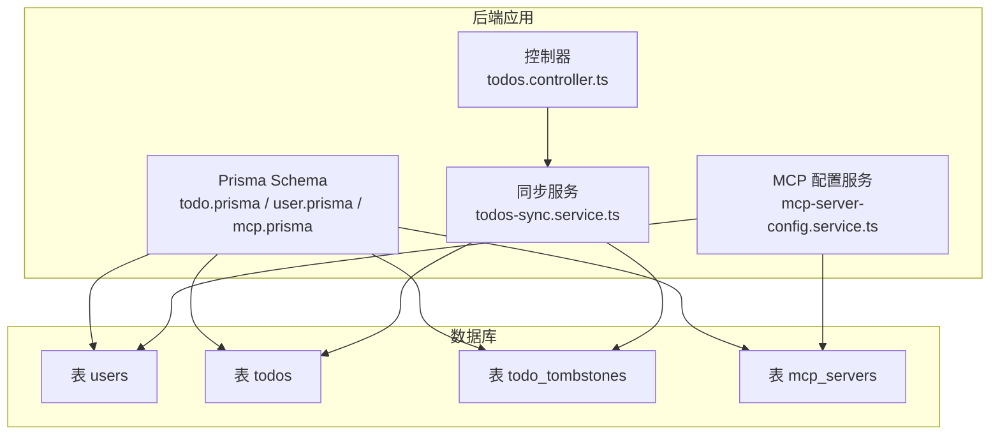
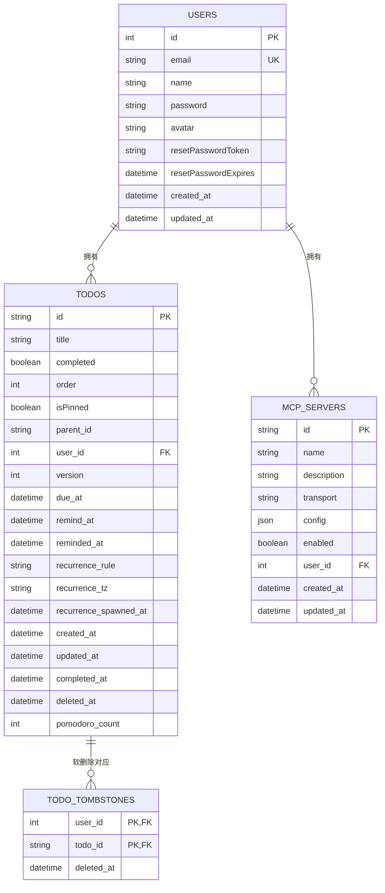
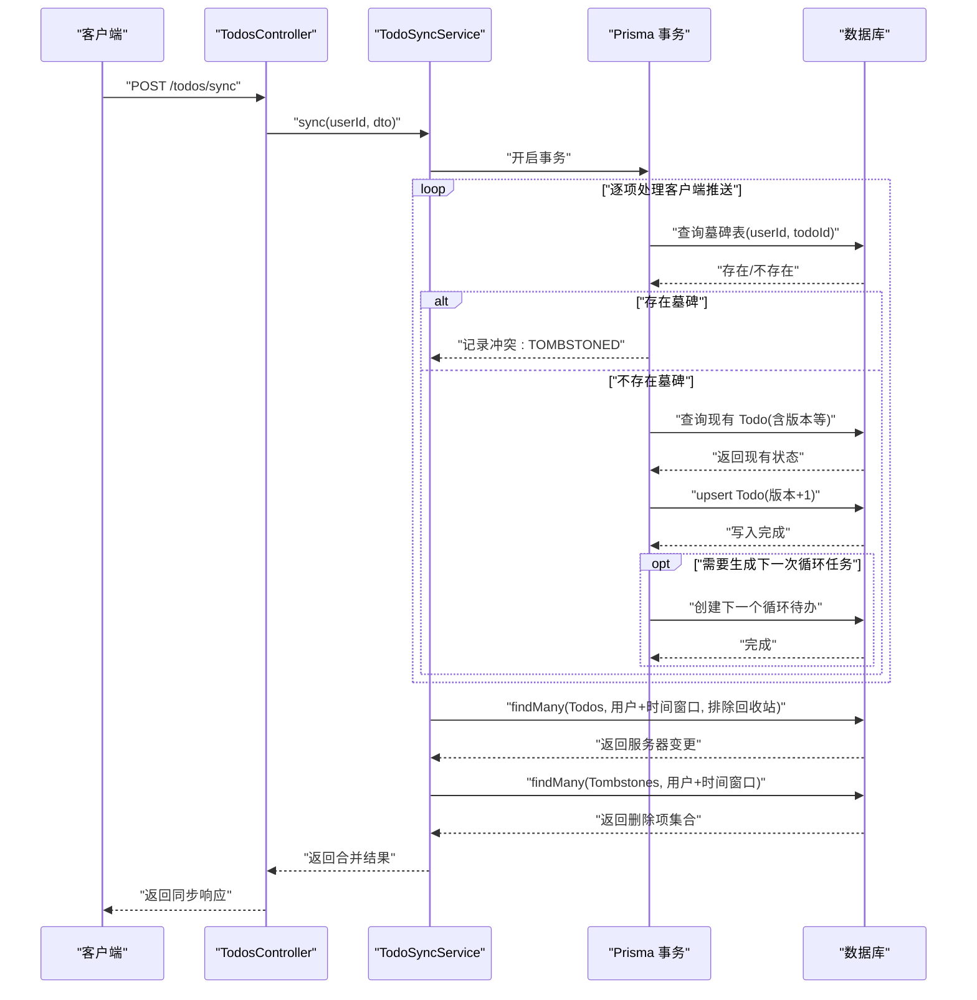
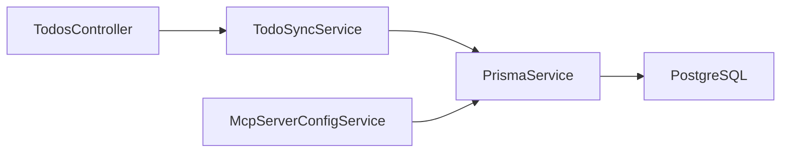

# 实体关系模型

<cite>
**本文引用的文件**
- [apps/backend/prisma/schema/todo.prisma](file://apps/backend/prisma/schema/todo.prisma)
- [apps/backend/prisma/schema/user.prisma](file://apps/backend/prisma/schema/user.prisma)
- [apps/backend/prisma/schema/mcp.prisma](file://apps/backend/prisma/schema/mcp.prisma)
- [apps/backend/prisma/schema/base.prisma](file://apps/backend/prisma/schema/base.prisma)
- [apps/backend/src/todos/todos-sync.service.ts](file://apps/backend/src/todos/todos-sync.service.ts)
- [apps/backend/src/mcp/mcp-server-config.service.ts](file://apps/backend/src/mcp/mcp-server-config.service.ts)
- [apps/backend/src/todos/todos.controller.ts](file://apps/backend/src/todos/todos.controller.ts)
- [apps/backend/tests/e2e/test-app.ts](file://apps/backend/tests/e2e/test-app.ts)
- [apps/backend/tests/todos-sync.service.spec.ts](file://apps/backend/tests/todos-sync.service.spec.ts)
</cite>

## 目录
1. [简介](#简介)
2. [项目结构](#项目结构)
3. [核心组件](#核心组件)
4. [架构总览](#架构总览)
5. [详细组件分析](#详细组件分析)
6. [依赖分析](#依赖分析)
7. [性能考虑](#性能考虑)
8. [故障排查指南](#故障排查指南)
9. [结论](#结论)
10. [附录](#附录)

## 简介
本文件系统化梳理 Lumina Todo 的实体关系模型，聚焦以下目标：
- 明确核心实体及其关系：User 与 Todo 的一对多、Todo 与 TodoTombstone 的软删除关联、McpServer 与 User 的一对多。
- 解释外键约束与级联删除策略，以及导航属性与关系查询模式。
- 给出实体关系图与数据流向图，并说明多对多关系设计与中间表实现现状。
- 提供关系完整性与引用完整性的保障机制、实体生命周期与状态转换、关系查询最佳实践与性能优化建议。

## 项目结构
围绕实体关系的核心文件位于后端 Prisma Schema 中，分别定义了用户、待办与 MCP 服务器三类模型；同步服务负责处理增量合并与软删除协调；控制器暴露同步接口；测试用例验证软删除与同步行为。

图表来源
- [apps/backend/prisma/schema/todo.prisma:1-39](file://apps/backend/prisma/schema/todo.prisma#L1-L39)
- [apps/backend/prisma/schema/user.prisma:1-16](file://apps/backend/prisma/schema/user.prisma#L1-L16)
- [apps/backend/prisma/schema/mcp.prisma:1-16](file://apps/backend/prisma/schema/mcp.prisma#L1-L16)
- [apps/backend/src/todos/todos-sync.service.ts:1-221](file://apps/backend/src/todos/todos-sync.service.ts#L1-L221)
- [apps/backend/src/mcp/mcp-server-config.service.ts:1-156](file://apps/backend/src/mcp/mcp-server-config.service.ts#L1-L156)
- [apps/backend/src/todos/todos.controller.ts:1-70](file://apps/backend/src/todos/todos.controller.ts#L1-L70)

章节来源
- [apps/backend/prisma/schema/todo.prisma:1-39](file://apps/backend/prisma/schema/todo.prisma#L1-L39)
- [apps/backend/prisma/schema/user.prisma:1-16](file://apps/backend/prisma/schema/user.prisma#L1-L16)
- [apps/backend/prisma/schema/mcp.prisma:1-16](file://apps/backend/prisma/schema/mcp.prisma#L1-L16)
- [apps/backend/prisma/schema/base.prisma:1-9](file://apps/backend/prisma/schema/base.prisma#L1-L9)

## 核心组件
- User（用户）
  - 导航属性：拥有多个 Todo 与 McpServer。
  - 主键：自增整数 id。
- Todo（待办）
  - 外键：userId → User(id)，建立与用户的多对一关系。
  - 软删除字段：deletedAt。
  - 版本控制：version，用于冲突检测与合并。
  - 索引：复合索引覆盖用户维度与时间维度，支持高效查询。
- TodoTombstone（待办墓碑）
  - 复合主键：(userId, todoId)，记录软删除事实与时间。
  - 作用：在增量同步中识别已被软删除的项，避免冲突。
- McpServer（MCP 服务器配置）
  - 外键：userId → User(id)，onDelete: Cascade，表示用户删除时级联删除其所有 MCP 配置。
  - 导航属性：属于一个 User。

章节来源
- [apps/backend/prisma/schema/user.prisma:1-16](file://apps/backend/prisma/schema/user.prisma#L1-L16)
- [apps/backend/prisma/schema/todo.prisma:1-39](file://apps/backend/prisma/schema/todo.prisma#L1-L39)
- [apps/backend/prisma/schema/mcp.prisma:1-16](file://apps/backend/prisma/schema/mcp.prisma#L1-L16)

## 架构总览
下图展示实体关系与关键数据流：

图表来源
- [apps/backend/prisma/schema/user.prisma:1-16](file://apps/backend/prisma/schema/user.prisma#L1-L16)
- [apps/backend/prisma/schema/todo.prisma:1-39](file://apps/backend/prisma/schema/todo.prisma#L1-L39)
- [apps/backend/prisma/schema/mcp.prisma:1-16](file://apps/backend/prisma/schema/mcp.prisma#L1-L16)

## 详细组件分析

### 关系与约束
- User 与 Todo（一对多）
  - 外键：Todo.userId → User.id。
  - 导航：User.todos、Todo.user。
  - 约束：无显式 onDelete，遵循 Prisma 默认行为；查询通过 userId 进行隔离。
- Todo 与 TodoTombstone（软删除）
  - 复合主键：(userId, todoId)，确保同一用户下同 id 待办仅有一条墓碑记录。
  - 作用：在同步阶段检测“已被软删除”的项，返回冲突类型以避免误合并。
- McpServer 与 User（一对多 + 级联删除）
  - 外键：McpServer.userId → User.id。
  - 导航：User.mcpServers、McpServer.user。
  - 级联：onDelete: Cascade，用户删除时自动清理其 MCP 配置。

章节来源
- [apps/backend/prisma/schema/user.prisma:11-12](file://apps/backend/prisma/schema/user.prisma#L11-L12)
- [apps/backend/prisma/schema/todo.prisma:21-21](file://apps/backend/prisma/schema/todo.prisma#L21-L21)
- [apps/backend/prisma/schema/mcp.prisma:11-11](file://apps/backend/prisma/schema/mcp.prisma#L11-L11)

### 导航属性与关系查询模式
- User
  - 查询用户拥有的 Todo 列表：基于 Todo.userId = 用户 id。
  - 查询用户拥有的 McpServer 列表：基于 McpServer.userId = 用户 id。
- Todo
  - 查询单个 Todo 及其所属 User：使用关系查询或联表。
  - 查询软删除墓碑：基于 (userId, todoId) 复合主键。
- McpServer
  - 查询单个配置及其所属 User：基于 McpServer.userId = 用户 id。
  - 删除配置时触发级联删除其关联的 MCP 连接（由 Prisma 客户端与数据库共同保证）。

章节来源
- [apps/backend/src/mcp/mcp-server-config.service.ts:38-45](file://apps/backend/src/mcp/mcp-server-config.service.ts#L38-L45)
- [apps/backend/src/mcp/mcp-server-config.service.ts:50-60](file://apps/backend/src/mcp/mcp-server-config.service.ts#L50-L60)
- [apps/backend/src/mcp/mcp-server-config.service.ts:88-96](file://apps/backend/src/mcp/mcp-server-config.service.ts#L88-L96)

### 数据流向与软删除协同
- 增量同步流程要点
  - 客户端推送变更：服务端在事务内执行 upsert，同时检查墓碑表，若存在则报告冲突类型。
  - 服务器端拉取变更：按用户与时间窗口筛选未软删除的 Todo；初次同步时排除 deletedAt 非空项。
  - 墓碑同步：按用户与时间窗口拉取墓碑列表，返回被删除项 id 集合，客户端据此更新本地状态。
- 测试验证点
  - 初次同步时忽略回收站项。
  - 当 lastSyncAt 非法时回退到 epoch，确保一致性。
  - 逻辑删除项在同步中作为“已删除”返回，避免重复恢复。

图表来源
- [apps/backend/src/todos/todos.controller.ts:30-38](file://apps/backend/src/todos/todos.controller.ts#L30-L38)
- [apps/backend/src/todos/todos-sync.service.ts:51-219](file://apps/backend/src/todos/todos-sync.service.ts#L51-L219)
- [apps/backend/tests/todos-sync.service.spec.ts:117-168](file://apps/backend/tests/todos-sync.service.spec.ts#L117-L168)

章节来源
- [apps/backend/src/todos/todos-sync.service.ts:51-219](file://apps/backend/src/todos/todos-sync.service.ts#L51-L219)
- [apps/backend/tests/todos-sync.service.spec.ts:117-168](file://apps/backend/tests/todos-sync.service.spec.ts#L117-L168)

### 多对多关系与中间表
- 当前模型中未发现显式的多对多中间表。User 与 Todo 是多对一（Todo.userId → User.id），User 与 McpServer 是多对一（McpServer.userId → User.id）。如需引入多对多，请在 Prisma Schema 中新增中间表并定义关系与索引，以确保查询性能与引用完整性。

章节来源
- [apps/backend/prisma/schema/user.prisma:11-12](file://apps/backend/prisma/schema/user.prisma#L11-L12)
- [apps/backend/prisma/schema/todo.prisma:21-21](file://apps/backend/prisma/schema/todo.prisma#L21-L21)
- [apps/backend/prisma/schema/mcp.prisma:11-11](file://apps/backend/prisma/schema/mcp.prisma#L11-L11)

### 关系完整性与引用完整性
- 外键约束
  - Todo.userId 引用 User.id。
  - McpServer.userId 引用 User.id。
- 级联删除
  - McpServer.onDelete: Cascade，用户删除时自动删除其 MCP 配置。
- 唯一性
  - User.email 唯一。
  - TodoTombstone 复合主键 (userId, todoId) 唯一。
- 索引
  - Todo 上有针对 (userId, updatedAt)、(userId, remindAt)、(userId, dueAt)、deletedAt 的索引，提升查询效率。
  - McpServer 上有针对 (userId) 的索引。
- 导航属性
  - User.todos、User.mcpServers；Todo.user；McpServer.user。

章节来源
- [apps/backend/prisma/schema/todo.prisma:23-27](file://apps/backend/prisma/schema/todo.prisma#L23-L27)
- [apps/backend/prisma/schema/mcp.prisma:13-14](file://apps/backend/prisma/schema/mcp.prisma#L13-L14)
- [apps/backend/prisma/schema/user.prisma:3-3](file://apps/backend/prisma/schema/user.prisma#L3-L3)
- [apps/backend/prisma/schema/mcp.prisma:11-11](file://apps/backend/prisma/schema/mcp.prisma#L11-L11)

### 实体生命周期与状态转换
- Todo 生命周期
  - 创建：生成唯一 id，设置初始版本与时间戳。
  - 更新：版本递增，更新时间戳，可设置完成/提醒/到期等状态。
  - 软删除：设置 deletedAt，同时在墓碑表写入记录。
  - 恢复：删除墓碑表记录，保留 Todo 状态。
  - 永久删除：从数据库物理删除 Todo 记录（控制器提供接口）。
- McpServer 生命周期
  - 创建：绑定到用户，标记启用状态。
  - 更新：修改名称、传输方式、配置等。
  - 删除：删除配置；若用户删除，因级联删除而自动清理。

章节来源
- [apps/backend/src/todos/todos.controller.ts:46-68](file://apps/backend/src/todos/todos.controller.ts#L46-L68)
- [apps/backend/src/mcp/mcp-server-config.service.ts:18-33](file://apps/backend/src/mcp/mcp-server-config.service.ts#L18-L33)
- [apps/backend/src/mcp/mcp-server-config.service.ts:65-83](file://apps/backend/src/mcp/mcp-server-config.service.ts#L65-L83)
- [apps/backend/src/mcp/mcp-server-config.service.ts:88-96](file://apps/backend/src/mcp/mcp-server-config.service.ts#L88-L96)

## 依赖分析
- 控制器依赖同步服务进行增量合并。
- 同步服务依赖 Prisma 事务读写 Todo 与 TodoTombstone。
- MCP 配置服务依赖 Prisma 读写 McpServer，并校验用户所有权。
- 数据库层由 Prisma Schema 定义模型、索引与约束。

图表来源
- [apps/backend/src/todos/todos.controller.ts:24-28](file://apps/backend/src/todos/todos.controller.ts#L24-L28)
- [apps/backend/src/todos/todos-sync.service.ts:42-46](file://apps/backend/src/todos/todos-sync.service.ts#L42-L46)
- [apps/backend/src/mcp/mcp-server-config.service.ts:13-13](file://apps/backend/src/mcp/mcp-server-config.service.ts#L13-L13)

章节来源
- [apps/backend/src/todos/todos.controller.ts:1-70](file://apps/backend/src/todos/todos.controller.ts#L1-L70)
- [apps/backend/src/todos/todos-sync.service.ts:1-221](file://apps/backend/src/todos/todos-sync.service.ts#L1-L221)
- [apps/backend/src/mcp/mcp-server-config.service.ts:1-156](file://apps/backend/src/mcp/mcp-server-config.service.ts#L1-L156)

## 性能考虑
- 查询优化
  - 使用复合索引：Todo 的 (userId, updatedAt)、(userId, remindAt)、(userId, dueAt)、deletedAt，有助于按用户维度快速筛选与排序。
  - 分页与选择字段：在高频查询中限制返回字段，减少网络与序列化开销。
- 事务与并发
  - 同步阶段使用事务包裹 upsert 与墓碑检查，保证一致性与原子性。
- 软删除与墓碑
  - 通过墓碑表快速识别已删除项，避免扫描全量 Todo 表。
- 级联删除
  - McpServer 的级联删除减少孤儿数据，降低维护成本。

章节来源
- [apps/backend/prisma/schema/todo.prisma:23-27](file://apps/backend/prisma/schema/todo.prisma#L23-L27)
- [apps/backend/src/todos/todos-sync.service.ts:66-174](file://apps/backend/src/todos/todos-sync.service.ts#L66-L174)

## 故障排查指南
- 同步冲突
  - TOMBSTONED：客户端尝试更新已被软删除的项，服务端返回冲突并附带原因。
  - OWNER_MISMATCH：客户端试图更新非自身拥有的 Todo。
  - VERSION_CONFLICT：版本不一致导致合并失败。
- 初次同步异常
  - 若 lastSyncAt 非法，服务端回退到 epoch，确保不会遗漏任何变更。
- 回收站相关
  - 初次同步默认排除 deletedAt 非空项；后续按需加载。
- 测试参考
  - 单元测试与端到端测试覆盖上述场景，便于定位问题。

章节来源
- [apps/backend/src/todos/todos-sync.service.ts:68-122](file://apps/backend/src/todos/todos-sync.service.ts#L68-L122)
- [apps/backend/tests/todos-sync.service.spec.ts:117-168](file://apps/backend/tests/todos-sync.service.spec.ts#L117-L168)
- [apps/backend/tests/e2e/test-app.ts:285-295](file://apps/backend/tests/e2e/test-app.ts#L285-L295)
- [apps/backend/tests/e2e/test-app.ts:311-323](file://apps/backend/tests/e2e/test-app.ts#L311-L323)
- [apps/backend/tests/e2e/test-app.ts:324-342](file://apps/backend/tests/e2e/test-app.ts#L324-L342)

## 结论
本模型以简洁清晰的方式表达用户、待办与 MCP 服务器之间的关系：User 与 Todo 为多对一，Todo 与 TodoTombstone 通过墓碑表实现软删除协作，McpServer 与 User 为多对一并具备级联删除。通过合理的索引、事务与查询模式，系统在保证关系完整性的同时兼顾性能与可维护性。未来如需引入多对多关系，应在 Schema 中明确中间表与约束，确保查询与一致性。

## 附录
- 关键路径参考
  - 同步入口：[apps/backend/src/todos/todos.controller.ts:30-38](file://apps/backend/src/todos/todos.controller.ts#L30-L38)
  - 同步实现：[apps/backend/src/todos/todos-sync.service.ts:51-219](file://apps/backend/src/todos/todos-sync.service.ts#L51-L219)
  - MCP 配置 CRUD：[apps/backend/src/mcp/mcp-server-config.service.ts:18-96](file://apps/backend/src/mcp/mcp-server-config.service.ts#L18-L96)
  - 模型定义：[apps/backend/prisma/schema/user.prisma:1-16](file://apps/backend/prisma/schema/user.prisma#L1-L16)、[apps/backend/prisma/schema/todo.prisma:1-39](file://apps/backend/prisma/schema/todo.prisma#L1-L39)、[apps/backend/prisma/schema/mcp.prisma:1-16](file://apps/backend/prisma/schema/mcp.prisma#L1-L16)