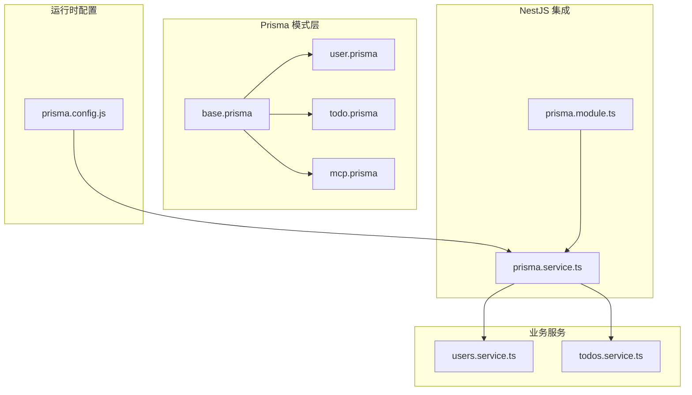
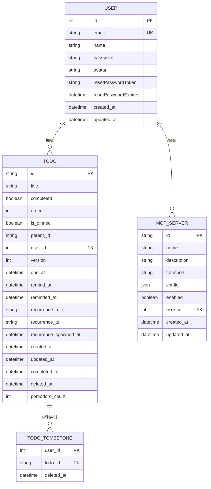
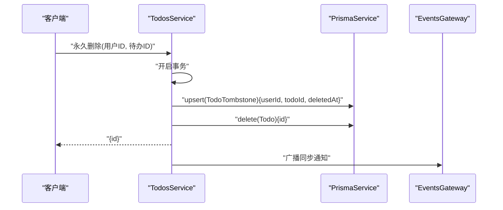
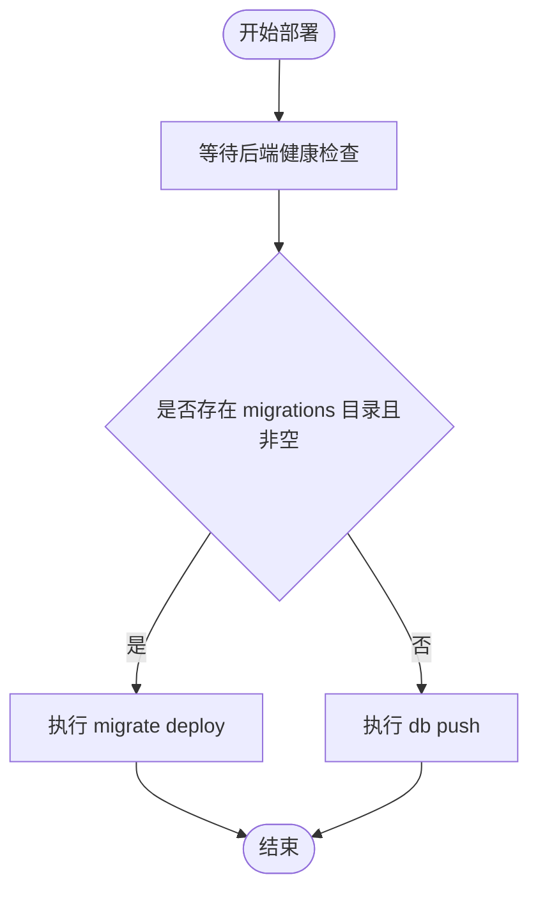
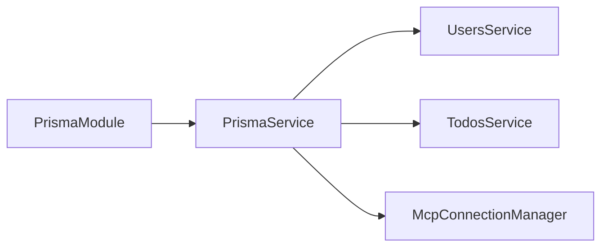

# 数据库设计

<cite>
**本文引用的文件**
- [apps/backend/prisma/schema/base.prisma](file://apps/backend/prisma/schema/base.prisma)
- [apps/backend/prisma/schema/user.prisma](file://apps/backend/prisma/schema/user.prisma)
- [apps/backend/prisma/schema/todo.prisma](file://apps/backend/prisma/schema/todo.prisma)
- [apps/backend/prisma/schema/mcp.prisma](file://apps/backend/prisma/schema/mcp.prisma)
- [apps/backend/prisma.config.js](file://apps/backend/prisma.config.js)
- [apps/backend/src/prisma/prisma.service.ts](file://apps/backend/src/prisma/prisma.service.ts)
- [apps/backend/src/prisma/prisma.module.ts](file://apps/backend/src/prisma/prisma.module.ts)
- [apps/backend/src/users/users.service.ts](file://apps/backend/src/users/users.service.ts)
- [apps/backend/src/todos/todos.service.ts](file://apps/backend/src/todos/todos.service.ts)
- [apps/backend/src/mcp/core/mcp-connection.manager.ts](file://apps/backend/src/mcp/core/mcp-connection.manager.ts)
- [apps/backend/src/mcp/core/mcp-transport.factory.ts](file://apps/backend/src/mcp/core/mcp-transport.factory.ts)
- [apps/backend/src/mcp/core/mcp-tool.registry.ts](file://apps/backend/src/mcp/core/mcp-tool.registry.ts)
- [deploy.sh](file://deploy.sh)
- [apps/backend/tests/e2e/test-app.ts](file://apps/backend/tests/e2e/test-app.ts)
</cite>

## 目录
1. [简介](#简介)
2. [项目结构](#项目结构)
3. [核心组件](#核心组件)
4. [架构总览](#架构总览)
5. [详细组件分析](#详细组件分析)
6. [依赖分析](#依赖分析)
7. [性能考量](#性能考量)
8. [故障排查指南](#故障排查指南)
9. [结论](#结论)
10. [附录](#附录)

## 简介
本文件系统性梳理 Lumina Todo 基于 Prisma ORM 的数据库设计与实现，覆盖实体关系模型、字段与约束、索引与查询优化、迁移与版本管理、软删除与审计、数据隔离与多租户思路、备份与灾备、性能监控与瓶颈分析、数据导入导出以及安全与访问控制等主题。文档同时结合后端 Prisma 客户端与 NestJS 模块化集成方式，给出可落地的工程实践建议。

## 项目结构
后端数据库层采用 Prisma Schema 分层建模，配合 Prisma Client 与 NestJS 模块注入，形成清晰的“模式-服务-控制器”分层。核心文件组织如下：
- 模式层：apps/backend/prisma/schema/*.prisma
- 运行时配置：apps/backend/prisma.config.js
- Prisma 客户端封装：apps/backend/src/prisma/prisma.service.ts、apps/backend/src/prisma/prisma.module.ts
- 业务服务：apps/backend/src/users/users.service.ts、apps/backend/src/todos/todos.service.ts
- MCP 相关：apps/backend/src/mcp/core/*.ts
- 部署脚本：deploy.sh（含数据库迁移部署流程）



图表来源
- [apps/backend/prisma/schema/base.prisma:1-9](file://apps/backend/prisma/schema/base.prisma#L1-L9)
- [apps/backend/prisma/schema/user.prisma:1-16](file://apps/backend/prisma/schema/user.prisma#L1-L16)
- [apps/backend/prisma/schema/todo.prisma:1-39](file://apps/backend/prisma/schema/todo.prisma#L1-L39)
- [apps/backend/prisma/schema/mcp.prisma:1-16](file://apps/backend/prisma/schema/mcp.prisma#L1-L16)
- [apps/backend/prisma.config.js:1-22](file://apps/backend/prisma.config.js#L1-L22)
- [apps/backend/src/prisma/prisma.module.ts:1-10](file://apps/backend/src/prisma/prisma.module.ts#L1-L10)
- [apps/backend/src/prisma/prisma.service.ts:1-34](file://apps/backend/src/prisma/prisma.service.ts#L1-L34)
- [apps/backend/src/users/users.service.ts:1-110](file://apps/backend/src/users/users.service.ts#L1-L110)
- [apps/backend/src/todos/todos.service.ts:1-146](file://apps/backend/src/todos/todos.service.ts#L1-L146)

章节来源
- [apps/backend/prisma/schema/base.prisma:1-9](file://apps/backend/prisma/schema/base.prisma#L1-L9)
- [apps/backend/prisma/schema/user.prisma:1-16](file://apps/backend/prisma/schema/user.prisma#L1-L16)
- [apps/backend/prisma/schema/todo.prisma:1-39](file://apps/backend/prisma/schema/todo.prisma#L1-L39)
- [apps/backend/prisma/schema/mcp.prisma:1-16](file://apps/backend/prisma/schema/mcp.prisma#L1-L16)
- [apps/backend/prisma.config.js:1-22](file://apps/backend/prisma.config.js#L1-L22)
- [apps/backend/src/prisma/prisma.module.ts:1-10](file://apps/backend/src/prisma/prisma.module.ts#L1-L10)
- [apps/backend/src/prisma/prisma.service.ts:1-34](file://apps/backend/src/prisma/prisma.service.ts#L1-L34)
- [apps/backend/src/users/users.service.ts:1-110](file://apps/backend/src/users/users.service.ts#L1-L110)
- [apps/backend/src/todos/todos.service.ts:1-146](file://apps/backend/src/todos/todos.service.ts#L1-L146)

## 核心组件
- 数据库提供方与客户端生成器
  - 提供方：PostgreSQL
  - 客户端：Prisma Client JS
  - 二进制目标：原生与多种 Linux 发行版适配
- 实体模型
  - User：用户主表，包含认证与基本信息
  - Todo：待办事项，支持软删除、提醒、周期性任务、完成状态与计数
  - TodoTombstone：软删除墓碑表，记录用户维度的删除时间点
  - McpServer：MCP 服务器配置，与用户建立一对多关系
- 关系与外键
  - Todo.userId → User.id
  - McpServer.userId → User.id（级联删除）
- 索引与查询优化
  - Todo 上对 (userId, updatedAt)、(userId, remindAt)、(userId, dueAt)、(deletedAt) 建有索引
  - McpServer 对 (userId) 建有索引
- 软删除与审计
  - Todo.deletedAt 支持软删除
  - TodoTombstone 记录删除时间点，便于审计与同步
- 多租户与数据隔离
  - 通过 userId 强制隔离不同用户的 Todo 与 Tombstone
  - McpServer 亦以 userId 隔离
- 迁移与版本管理
  - 通过 prisma.config.js 指定 schema 与 migrations 路径
  - 部署脚本在容器内执行 migrate deploy 或 db push

章节来源
- [apps/backend/prisma/schema/base.prisma:1-9](file://apps/backend/prisma/schema/base.prisma#L1-L9)
- [apps/backend/prisma/schema/user.prisma:1-16](file://apps/backend/prisma/schema/user.prisma#L1-L16)
- [apps/backend/prisma/schema/todo.prisma:1-39](file://apps/backend/prisma/schema/todo.prisma#L1-L39)
- [apps/backend/prisma/schema/mcp.prisma:1-16](file://apps/backend/prisma/schema/mcp.prisma#L1-L16)
- [apps/backend/prisma.config.js:1-22](file://apps/backend/prisma.config.js#L1-L22)
- [apps/backend/src/todos/todos.service.ts:88-144](file://apps/backend/src/todos/todos.service.ts#L88-L144)

## 架构总览
下图展示数据库层在系统中的位置与交互：

```mermaid
graph TB
APP["应用服务<br/>NestJS 控制器/服务"] --> PRISMA["PrismaService<br/>PrismaClient 封装"]
PRISMA --> PG["PostgreSQL 数据库"]
subgraph "模式层"
U["User"]
T["Todo"]
TT["TodoTombstone"]
M["McpServer"]
end
U < --> |"1 对多"| T
U < --> |"1 对多"| M
T -.->|"软删除审计"| TT
```

图表来源
- [apps/backend/src/prisma/prisma.service.ts:1-34](file://apps/backend/src/prisma/prisma.service.ts#L1-L34)
- [apps/backend/prisma/schema/user.prisma:1-16](file://apps/backend/prisma/schema/user.prisma#L1-L16)
- [apps/backend/prisma/schema/todo.prisma:1-39](file://apps/backend/prisma/schema/todo.prisma#L1-L39)
- [apps/backend/prisma/schema/mcp.prisma:1-16](file://apps/backend/prisma/schema/mcp.prisma#L1-L16)

## 详细组件分析

### 实体关系模型与字段定义
- User
  - 主键：自增整型
  - 唯一索引：email
  - 时间戳：createdAt、updatedAt
  - 关系：与 Todo、McpServer 一对多
- Todo
  - 主键：UUID 字符串
  - 常用布尔：completed、isPinned
  - 排序与版本：order、version
  - 时间点：dueAt、remindAt、remindedAt、createdAt、updatedAt、completedAt、deletedAt
  - 软删除：deletedAt
  - 周期性：recurrenceRule、recurrenceTz、recurrenceSpawnedAt
  - 计数：pomodoroCount
  - 关系：userId → User.id
  - 索引：(userId, updatedAt)、(userId, remindAt)、(userId, dueAt)、(deletedAt)
- TodoTombstone
  - 复合主键：(userId, todoId)
  - 时间戳：deletedAt
  - 索引：(userId, deletedAt)
- McpServer
  - 主键：UUID 字符串
  - 配置：transport、config(Json)
  - 开关：enabled
  - 关系：userId → User.id（onDelete: Cascade）
  - 索引：(userId)



图表来源
- [apps/backend/prisma/schema/user.prisma:1-16](file://apps/backend/prisma/schema/user.prisma#L1-L16)
- [apps/backend/prisma/schema/todo.prisma:1-39](file://apps/backend/prisma/schema/todo.prisma#L1-L39)
- [apps/backend/prisma/schema/mcp.prisma:1-16](file://apps/backend/prisma/schema/mcp.prisma#L1-L16)

章节来源
- [apps/backend/prisma/schema/user.prisma:1-16](file://apps/backend/prisma/schema/user.prisma#L1-L16)
- [apps/backend/prisma/schema/todo.prisma:1-39](file://apps/backend/prisma/schema/todo.prisma#L1-L39)
- [apps/backend/prisma/schema/mcp.prisma:1-16](file://apps/backend/prisma/schema/mcp.prisma#L1-L16)

### 查询路径与事务处理（软删除与回收站）
- 回收站查询：基于 deletedAt 非空过滤
- 恢复：将 deletedAt 置空并递增 version
- 永久删除：事务中先写入 TodoTombstone，再删除 Todo，并广播同步通知
- 清空回收站：批量写入 Tombstone 并删除所有标记删除的 Todo



图表来源
- [apps/backend/src/todos/todos.service.ts:88-110](file://apps/backend/src/todos/todos.service.ts#L88-L110)

章节来源
- [apps/backend/src/todos/todos.service.ts:48-144](file://apps/backend/src/todos/todos.service.ts#L48-L144)

### 索引策略与查询优化
- Todo
  - (userId, updatedAt)：按用户排序与时间倒序展示
  - (userId, remindAt)：提醒扫描
  - (userId, dueAt)：截止日期扫描
  - (deletedAt)：软删除过滤与回收站扫描
- McpServer
  - (userId)：按用户检索 MCP 配置
- 优化建议
  - 在高频过滤列上保持单列或复合索引
  - 避免在高基数列上过度建索引
  - 使用 select 精简字段，减少网络与序列化开销

章节来源
- [apps/backend/prisma/schema/todo.prisma:23-27](file://apps/backend/prisma/schema/todo.prisma#L23-L27)
- [apps/backend/prisma/schema/mcp.prisma:13-13](file://apps/backend/prisma/schema/mcp.prisma#L13-L13)

### 数据迁移与版本管理
- 配置
  - schema 路径：prisma/schema
  - migrations 路径：prisma/migrations
  - datasource.url 来自 DATABASE_URL 环境变量
- 部署流程
  - 若存在 migrations 目录且非空，则执行 migrate deploy
  - 否则执行 db push
- 最佳实践
  - 优先使用 migrate deploy，保证可追踪与可回滚
  - 在 CI/CD 中显式等待后端健康后再执行迁移
  - 本地开发使用 db push 快速迭代，生产使用 migrate deploy



图表来源
- [deploy.sh:448-452](file://deploy.sh#L448-L452)
- [apps/backend/prisma.config.js:13-21](file://apps/backend/prisma.config.js#L13-L21)

章节来源
- [apps/backend/prisma.config.js:1-22](file://apps/backend/prisma.config.js#L1-L22)
- [deploy.sh:448-452](file://deploy.sh#L448-L452)

### 软删除、审计与数据完整性
- 软删除
  - Todo.deletedAt 标记删除时间
  - 回收站查询仅返回 deletedAt 非空的记录
- 审计
  - TodoTombstone 记录用户+待办+删除时间，支持按用户与删除时间范围查询
- 完整性
  - 删除事务保证 Tombstone 与 Todo 删除的一致性
  - McpServer 的 onDelete: Cascade 确保用户删除时级联清理 MCP 配置

章节来源
- [apps/backend/prisma/schema/todo.prisma:30-38](file://apps/backend/prisma/schema/todo.prisma#L30-L38)
- [apps/backend/src/todos/todos.service.ts:88-144](file://apps/backend/src/todos/todos.service.ts#L88-L144)
- [apps/backend/prisma/schema/mcp.prisma:11-11](file://apps/backend/prisma/schema/mcp.prisma#L11-L11)

### 多租户与数据隔离
- 隔离策略
  - Todo 与 TodoTombstone 均以 userId 作为过滤条件与索引列
  - McpServer 以 userId 隔离
- 一致性
  - 业务层严格传入 userId，避免跨租户误读
  - 级联删除保障用户维度下的资源完整清理

章节来源
- [apps/backend/prisma/schema/todo.prisma:30-38](file://apps/backend/prisma/schema/todo.prisma#L30-L38)
- [apps/backend/prisma/schema/mcp.prisma:8-11](file://apps/backend/prisma/schema/mcp.prisma#L8-L11)
- [apps/backend/src/todos/todos.service.ts:37-60](file://apps/backend/src/todos/todos.service.ts#L37-L60)

### 备份、恢复与灾难恢复
- 建议流程
  - 定期逻辑备份（如使用 pg_dump）与物理备份相结合
  - 验证恢复流程，确保在 24/48 小时窗口内完成 RPO/RTO
  - 将备份加密并异地存放
- 迁移与回滚
  - 使用 migrate deploy 的迁移历史进行可控回滚
  - 重大变更前先在预生产验证

（本节为通用实践说明，不直接分析具体文件）

### 性能监控与瓶颈分析
- 指标
  - 查询延迟（P95/P99）、慢查询、连接池饱和度
  - 索引命中率、锁等待、WAL 写入
- 方法
  - 使用数据库内置分析工具（EXPLAIN/ANALYZE、pg_stat_statements）
  - 结合业务查询模式（按用户过滤、软删除过滤）定位热点
  - 评估索引维护成本与查询收益

（本节为通用实践说明，不直接分析具体文件）

### 数据导出与导入
- 导出
  - Todo：按用户导出可见字段集合，支持分页与增量导出
  - McpServer：导出用户维度的配置 JSON
- 导入
  - 建议采用批量写入与事务包裹，避免中间态
  - 导入前校验数据格式与必填字段，失败时回滚
- 注意
  - 软删除状态与墓碑记录需单独处理，避免重复导入

（本节为通用实践说明，不直接分析具体文件）

### 安全考虑与访问控制
- 传输与存储
  - 使用 TLS 连接数据库
  - 敏感配置通过环境变量注入，不在仓库中保存明文
- 访问控制
  - 严格按用户维度过滤数据
  - 对删除、修改等高危操作增加鉴权与审计
- MCP 安全
  - 限制传输协议与地址范围，禁止私有/环回地址直连
  - 生产环境必须配置允许的命令白名单

章节来源
- [apps/backend/src/mcp/core/mcp-transport.factory.ts:33-78](file://apps/backend/src/mcp/core/mcp-transport.factory.ts#L33-L78)
- [apps/backend/src/mcp/core/mcp-connection.manager.ts:1-42](file://apps/backend/src/mcp/core/mcp-connection.manager.ts#L1-L42)
- [apps/backend/src/mcp/core/mcp-tool.registry.ts:1-47](file://apps/backend/src/mcp/core/mcp-tool.registry.ts#L1-L47)

## 依赖分析
- 模块耦合
  - PrismaService 作为全局单例，被用户与待办服务依赖
  - 业务服务通过 PrismaService 组织事务，降低耦合
- 外部依赖
  - PostgreSQL 提供数据持久化
  - Prisma Adapter-PG 用于连接池与适配
- 可能的循环依赖
  - 当前模块结构清晰，未见循环依赖迹象



图表来源
- [apps/backend/src/prisma/prisma.module.ts:1-10](file://apps/backend/src/prisma/prisma.module.ts#L1-L10)
- [apps/backend/src/prisma/prisma.service.ts:1-34](file://apps/backend/src/prisma/prisma.service.ts#L1-L34)
- [apps/backend/src/users/users.service.ts:1-110](file://apps/backend/src/users/users.service.ts#L1-L110)
- [apps/backend/src/todos/todos.service.ts:1-146](file://apps/backend/src/todos/todos.service.ts#L1-L146)
- [apps/backend/src/mcp/core/mcp-connection.manager.ts:1-42](file://apps/backend/src/mcp/core/mcp-connection.manager.ts#L1-L42)

章节来源
- [apps/backend/src/prisma/prisma.module.ts:1-10](file://apps/backend/src/prisma/prisma.module.ts#L1-L10)
- [apps/backend/src/prisma/prisma.service.ts:1-34](file://apps/backend/src/prisma/prisma.service.ts#L1-L34)
- [apps/backend/src/users/users.service.ts:1-110](file://apps/backend/src/users/users.service.ts#L1-L110)
- [apps/backend/src/todos/todos.service.ts:1-146](file://apps/backend/src/todos/todos.service.ts#L1-L146)

## 性能考量
- 索引与查询
  - 为高频过滤列建立合适索引，避免全表扫描
  - 使用 select 精简字段，减少序列化与网络开销
- 事务与并发
  - 将墓碑写入与删除放在同一事务，保证一致性
  - 控制事务粒度，避免长时间持有锁
- 连接池
  - 通过 PrismaPg 与连接池复用，避免频繁握手
  - 监控连接池饱和度，必要时扩容

（本节为通用实践说明，不直接分析具体文件）

## 故障排查指南
- 迁移失败
  - 检查 DATABASE_URL 是否正确
  - 确认 migrations 目录是否为空，必要时改用 db push 临时过渡
- 软删除异常
  - 核对 TodoTombstone 是否成功写入
  - 检查事务是否回滚
- 测试环境模拟
  - E2E 测试中使用内存 Prisma 模拟，验证软删除与墓碑行为

章节来源
- [apps/backend/prisma.config.js:13-21](file://apps/backend/prisma.config.js#L13-L21)
- [apps/backend/src/todos/todos.service.ts:88-144](file://apps/backend/src/todos/todos.service.ts#L88-L144)
- [apps/backend/tests/e2e/test-app.ts:138-359](file://apps/backend/tests/e2e/test-app.ts#L138-L359)

## 结论
本设计以 Prisma Schema 明确实体与关系，结合业务服务的事务封装，实现了可靠的软删除与审计能力；通过合理的索引与查询策略，满足了用户维度的数据隔离与高效检索需求。配合规范的迁移流程与安全策略，整体具备良好的可运维性与扩展性。

## 附录
- 运行时集成要点
  - PrismaService 初始化时从 DATABASE_URL 读取连接字符串
  - NestJS 全局注册 PrismaModule，统一提供 PrismaService
- MCP 安全基线
  - 限制私有/环回地址与主机名
  - 生产环境强制配置命令白名单

章节来源
- [apps/backend/src/prisma/prisma.service.ts:10-21](file://apps/backend/src/prisma/prisma.service.ts#L10-L21)
- [apps/backend/src/prisma/prisma.module.ts:1-10](file://apps/backend/src/prisma/prisma.module.ts#L1-L10)
- [apps/backend/src/mcp/core/mcp-transport.factory.ts:33-78](file://apps/backend/src/mcp/core/mcp-transport.factory.ts#L33-L78)