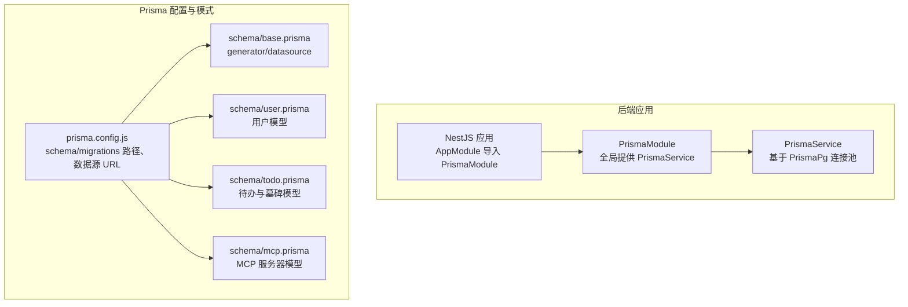
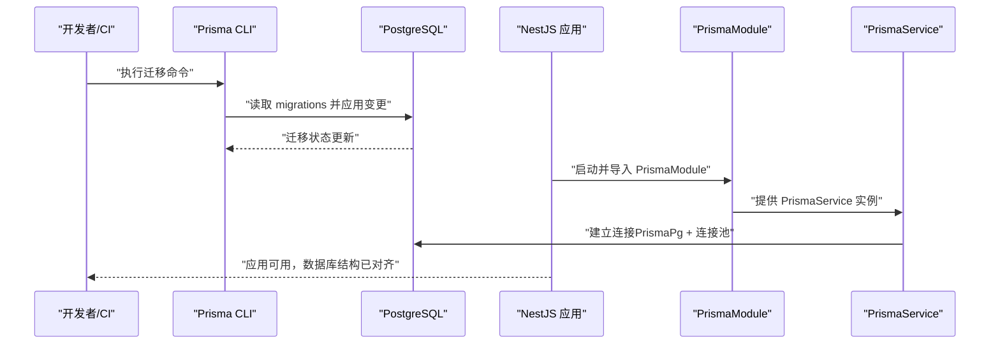
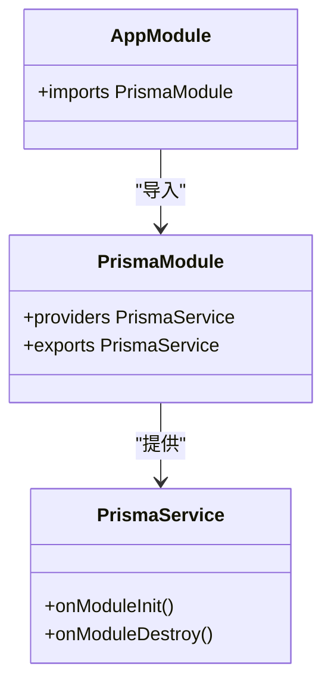

# 数据迁移管理

<cite>
**本文引用的文件**
- [apps/backend/prisma.config.js](file://apps/backend/prisma.config.js)
- [apps/backend/package.json](file://apps/backend/package.json)
- [apps/backend/prisma/schema/base.prisma](file://apps/backend/prisma/schema/base.prisma)
- [apps/backend/prisma/schema/user.prisma](file://apps/backend/prisma/schema/user.prisma)
- [apps/backend/prisma/schema/todo.prisma](file://apps/backend/prisma/schema/todo.prisma)
- [apps/backend/prisma/schema/mcp.prisma](file://apps/backend/prisma/schema/mcp.prisma)
- [apps/backend/src/prisma/prisma.module.ts](file://apps/backend/src/prisma/prisma.module.ts)
- [apps/backend/src/prisma/prisma.service.ts](file://apps/backend/src/prisma/prisma.service.ts)
- [apps/backend/src/app.module.ts](file://apps/backend/src/app.module.ts)
- [apps/backend/tests/e2e/test-app.ts](file://apps/backend/tests/e2e/test-app.ts)
</cite>

## 目录
1. [简介](#简介)
2. [项目结构](#项目结构)
3. [核心组件](#核心组件)
4. [架构总览](#架构总览)
5. [详细组件分析](#详细组件分析)
6. [依赖关系分析](#依赖关系分析)
7. [性能考量](#性能考量)
8. [故障排除指南](#故障排除指南)
9. [结论](#结论)
10. [附录](#附录)

## 简介
本文件系统性阐述 Lumina Todo 后端应用的数据库迁移管理，围绕 Prisma Migrate 的使用、迁移文件与历史追踪、向后兼容与回滚策略、生产安全实践、数据种子与初始数据加载、迁移脚本编写与测试、失败恢复、多环境策略与配置管理，以及迁移性能优化与批量操作处理方法进行说明。目标是帮助开发者与运维人员在不同环境下稳定、可追溯地演进数据库结构。

## 项目结构
后端采用 NestJS + Prisma 架构，数据库为 PostgreSQL。迁移配置通过独立的 Prisma 配置文件集中管理，模式文件按领域拆分，便于团队协作与演进。

图表来源
- [apps/backend/src/app.module.ts:149-149](file://apps/backend/src/app.module.ts#L149-L149)
- [apps/backend/src/prisma/prisma.module.ts:1-10](file://apps/backend/src/prisma/prisma.module.ts#L1-L10)
- [apps/backend/src/prisma/prisma.service.ts:1-34](file://apps/backend/src/prisma/prisma.service.ts#L1-L34)
- [apps/backend/prisma.config.js:13-21](file://apps/backend/prisma.config.js#L13-L21)
- [apps/backend/prisma/schema/base.prisma:1-9](file://apps/backend/prisma/schema/base.prisma#L1-L9)
- [apps/backend/prisma/schema/user.prisma:1-16](file://apps/backend/prisma/schema/user.prisma#L1-L16)
- [apps/backend/prisma/schema/todo.prisma:1-39](file://apps/backend/prisma/schema/todo.prisma#L1-L39)
- [apps/backend/prisma/schema/mcp.prisma:1-16](file://apps/backend/prisma/schema/mcp.prisma#L1-L16)

章节来源
- [apps/backend/src/app.module.ts:149-149](file://apps/backend/src/app.module.ts#L149-L149)
- [apps/backend/src/prisma/prisma.module.ts:1-10](file://apps/backend/src/prisma/prisma.module.ts#L1-L10)
- [apps/backend/src/prisma/prisma.service.ts:1-34](file://apps/backend/src/prisma/prisma.service.ts#L1-L34)
- [apps/backend/prisma.config.js:13-21](file://apps/backend/prisma.config.js#L13-L21)
- [apps/backend/prisma/schema/base.prisma:1-9](file://apps/backend/prisma/schema/base.prisma#L1-L9)
- [apps/backend/prisma/schema/user.prisma:1-16](file://apps/backend/prisma/schema/user.prisma#L1-L16)
- [apps/backend/prisma/schema/todo.prisma:1-39](file://apps/backend/prisma/schema/todo.prisma#L1-L39)
- [apps/backend/prisma/schema/mcp.prisma:1-16](file://apps/backend/prisma/schema/mcp.prisma#L1-L16)

## 核心组件
- Prisma 配置与数据源
  - 配置文件集中声明 schema 与 migrations 路径，并从环境变量读取 DATABASE_URL。
  - 该设计使迁移路径与模式解耦，便于 CI/CD 与多环境部署。
- Prisma 模式文件
  - base.prisma 定义 generator 与 datasource（PostgreSQL）。
  - user.prisma、todo.prisma、mcp.prisma 分别定义用户、待办与墓碑、MCP 服务器等模型及索引映射。
- Prisma 服务与连接
  - PrismaService 基于 PrismaPg 适配器与 pg 连接池，实现 onModuleInit/onModuleDestroy 生命周期钩子，确保连接生命周期与应用一致。
  - 未在代码中发现显式的迁移执行逻辑，迁移通常通过 CLI 在构建/部署阶段完成。

章节来源
- [apps/backend/prisma.config.js:13-21](file://apps/backend/prisma.config.js#L13-L21)
- [apps/backend/prisma/schema/base.prisma:1-9](file://apps/backend/prisma/schema/base.prisma#L1-L9)
- [apps/backend/prisma/schema/user.prisma:1-16](file://apps/backend/prisma/schema/user.prisma#L1-L16)
- [apps/backend/prisma/schema/todo.prisma:1-39](file://apps/backend/prisma/schema/todo.prisma#L1-L39)
- [apps/backend/prisma/schema/mcp.prisma:1-16](file://apps/backend/prisma/schema/mcp.prisma#L1-L16)
- [apps/backend/src/prisma/prisma.service.ts:1-34](file://apps/backend/src/prisma/prisma.service.ts#L1-L34)

## 架构总览
下图展示迁移与应用启动的关键交互：应用启动时通过 PrismaModule 注入 PrismaService；PrismaService 建立数据库连接；迁移通过 Prisma CLI 在部署前执行，确保数据库结构与模式一致。

图表来源
- [apps/backend/prisma.config.js:13-21](file://apps/backend/prisma.config.js#L13-L21)
- [apps/backend/src/prisma/prisma.module.ts:1-10](file://apps/backend/src/prisma/prisma.module.ts#L1-L10)
- [apps/backend/src/prisma/prisma.service.ts:1-34](file://apps/backend/src/prisma/prisma.service.ts#L1-L34)

## 详细组件分析

### 迁移配置与路径管理
- 配置项
  - schema 路径：指向 prisma/schema，统一存放所有模式文件。
  - migrations 路径：指向 prisma/migrations，存放迁移文件。
  - 数据源 URL：从环境变量 DATABASE_URL 注入，支持多环境隔离。
- 环境变量加载
  - 配置文件尝试加载根目录 .env，便于本地开发；生产环境通常由容器注入环境变量。

章节来源
- [apps/backend/prisma.config.js:7-11](file://apps/backend/prisma.config.js#L7-L11)
- [apps/backend/prisma.config.js:13-21](file://apps/backend/prisma.config.js#L13-L21)

### 模式文件与模型设计
- generator 与 datasource
  - generator 指定 prisma-client-js，binaryTargets 覆盖多平台二进制需求。
  - datasource 指定 PostgreSQL 提供商。
- 用户模型（User）
  - 关键字段：邮箱唯一、密码可空、头像、重置令牌与过期时间、时间戳。
  - 关系：与 McpServer、Todo 双向关联。
- 待办与墓碑模型（Todo / TodoTombstone）
  - Todo 包含标题、完成状态、排序、置顶、父节点、用户外键、版本号、到期/提醒/已提醒时间、周期规则与时区、创建/更新/完成/删除时间、番茄钟计数。
  - TodoTombstone 记录软删除键（userId+todoId），并带索引优化查询。
- MCP 服务器模型（McpServer）
  - 字段：名称、描述、传输类型、配置 JSON、启用标志、用户外键、时间戳。
  - 关系：onDelete Cascade，确保用户删除时级联清理。

章节来源
- [apps/backend/prisma/schema/base.prisma:1-9](file://apps/backend/prisma/schema/base.prisma#L1-L9)
- [apps/backend/prisma/schema/user.prisma:1-16](file://apps/backend/prisma/schema/user.prisma#L1-L16)
- [apps/backend/prisma/schema/todo.prisma:1-39](file://apps/backend/prisma/schema/todo.prisma#L1-L39)
- [apps/backend/prisma/schema/mcp.prisma:1-16](file://apps/backend/prisma/schema/mcp.prisma#L1-L16)

### 迁移执行与应用集成
- 迁移命令
  - 开发环境常用命令：prisma:migrate（对应 prisma migrate dev）。
  - 其他常用命令：prisma:generate、prisma:push、prisma:studio。
- 应用集成
  - AppModule 导入 PrismaModule，PrismaModule 全局导出 PrismaService。
  - PrismaService 通过 PrismaPg 与连接池建立连接，确保生命周期与应用一致。

章节来源
- [apps/backend/package.json:25-28](file://apps/backend/package.json#L25-L28)
- [apps/backend/src/app.module.ts:149-149](file://apps/backend/src/app.module.ts#L149-L149)
- [apps/backend/src/prisma/prisma.module.ts:1-10](file://apps/backend/src/prisma/prisma.module.ts#L1-L10)
- [apps/backend/src/prisma/prisma.service.ts:1-34](file://apps/backend/src/prisma/prisma.service.ts#L1-L34)

### 数据库版本控制与迁移历史追踪
- 版本控制
  - 迁移文件位于 prisma/migrations，每次结构变更生成新迁移文件，记录变更内容与顺序。
  - 通过 prisma migrate dev/validate/resolve 等命令维护历史与一致性。
- 历史追踪
  - 迁移历史由数据库内部表维护，结合文件系统中的迁移文件形成双重保障。
  - 建议在 CI 中使用 prisma migrate status/validate 校验迁移状态。

章节来源
- [apps/backend/prisma.config.js:18-20](file://apps/backend/prisma.config.js#L18-L20)
- [apps/backend/package.json:27-27](file://apps/backend/package.json#L27-L27)

### 向后兼容性保证与回滚策略
- 向后兼容
  - 使用非破坏性变更：新增列、添加索引、默认值调整等；避免删除列或修改列类型。
  - 对于复杂变更，先添加新列/索引，再迁移数据，最后删除旧列。
- 回滚策略
  - 开发环境：prisma migrate dev 支持回滚至上一个迁移点。
  - 生产环境：优先使用“前向迁移 + 数据修复”而非直接回滚；必要时使用 prisma migrate resolve --rolled-back。
  - 建议在回滚前备份数据库。

章节来源
- [apps/backend/package.json:27-27](file://apps/backend/package.json#L27-L27)

### 生产环境迁移的安全实践与最佳方案
- 安全实践
  - 仅在维护窗口执行迁移；使用只读副本或离线迁移演练。
  - 严格权限控制：迁移账户仅具备必要权限；避免在生产使用 prisma db push。
  - 使用 prisma migrate deploy 在生产强制应用未审阅迁移，确保一致性。
- 最佳方案
  - CI/CD 流水线：构建后执行 prisma migrate deploy；失败即阻断发布。
  - 健康检查：结合健康检查模块，在迁移后验证服务可用性。
  - 监控告警：对迁移耗时与失败进行监控与告警。

章节来源
- [apps/backend/package.json:27-27](file://apps/backend/package.json#L27-L27)
- [apps/backend/src/app.module.ts:149-149](file://apps/backend/src/app.module.ts#L149-L149)

### 数据种子与初始数据加载机制
- 种子策略
  - 使用 Prisma 种子脚本（如 seed.ts）初始化基础数据（角色、默认配置等）。
  - 在 CI 中通过 prisma db seed 执行，确保测试与预生产环境数据一致。
- 初始数据加载
  - 通过 Prisma Client 在应用启动后执行一次性初始化流程，避免在迁移中写入业务数据。
  - 若需批量插入，建议使用 createMany 并分批提交，降低锁竞争与事务时长。

章节来源
- [apps/backend/package.json:27-27](file://apps/backend/package.json#L27-L27)

### 迁移脚本的编写与测试方法
- 编写规范
  - 将破坏性变更拆分为多个小迁移；为每个迁移添加清晰注释与变更说明。
  - 使用事务包裹复杂迁移，确保原子性。
- 测试方法
  - 单元测试：针对迁移后的数据结构与约束进行断言。
  - 端到端测试：在内存数据库或专用测试数据库上执行完整迁移流程。
  - 示例参考：测试工具链中存在内存版 Prisma 客户端模拟，可用于快速验证迁移影响。

章节来源
- [apps/backend/tests/e2e/test-app.ts:138-359](file://apps/backend/tests/e2e/test-app.ts#L138-L359)

### 迁移失败的故障排除与恢复方案
- 常见问题
  - 迁移卡住：检查数据库锁、长时间运行事务、索引重建。
  - 权限不足：确认迁移账户具备 CREATE/ALTER/INDEX 权限。
  - 数据冲突：使用 prisma migrate resolve --applied 或手动修复数据。
- 恢复方案
  - 开发环境：回滚至上一迁移点，修正后再重新迁移。
  - 生产环境：使用 prisma migrate resolve --rolled-back；若仍失败，准备数据库快照回滚并修复后再行迁移。
  - 日志与审计：开启详细日志，定位失败步骤与具体 SQL。

章节来源
- [apps/backend/package.json:27-27](file://apps/backend/package.json#L27-L27)

### 多环境迁移策略与配置管理
- 环境隔离
  - 不同环境使用不同的 DATABASE_URL；开发使用本地数据库，测试使用专用测试库，生产使用主库。
- 配置管理
  - prisma.config.js 统一声明 schema 与 migrations 路径；通过环境变量切换数据源。
  - 在 CI 中为不同分支设置独立的 DATABASE_URL，避免交叉污染。

章节来源
- [apps/backend/prisma.config.js:15-17](file://apps/backend/prisma.config.js#L15-L17)
- [apps/backend/prisma.config.js:13-21](file://apps/backend/prisma.config.js#L13-L21)

### 迁移性能优化与批量操作处理
- 性能优化
  - 批量插入：使用 createMany/executeRawBatch；合理分批大小，避免单事务过大。
  - 索引策略：在大批量导入前禁用非必要索引，导入完成后重建索引。
  - 并发控制：避免在高峰期执行长事务；使用维护窗口。
- 批量操作
  - 使用 transaction 包裹相关写操作，确保一致性。
  - 对于超大数据集，考虑分页扫描与增量处理，减少锁持有时间。

章节来源
- [apps/backend/prisma/schema/todo.prisma:23-28](file://apps/backend/prisma/schema/todo.prisma#L23-L28)
- [apps/backend/prisma/schema/todo.prisma:30-38](file://apps/backend/prisma/schema/todo.prisma#L30-L38)

## 依赖关系分析
- 组件耦合
  - AppModule 仅通过 PrismaModule 引入 PrismaService，降低耦合度。
  - PrismaService 依赖 PrismaPg 与 pg 连接池，负责连接生命周期管理。
- 外部依赖
  - PostgreSQL 提供商与 Prisma 客户端；Prisma CLI 用于迁移与生成。
- 潜在风险
  - 若 DATABASE_URL 未正确注入，PrismaService 将抛出异常；应确保环境变量在各环境中正确配置。

图表来源
- [apps/backend/src/app.module.ts:149-149](file://apps/backend/src/app.module.ts#L149-L149)
- [apps/backend/src/prisma/prisma.module.ts:1-10](file://apps/backend/src/prisma/prisma.module.ts#L1-L10)
- [apps/backend/src/prisma/prisma.service.ts:1-34](file://apps/backend/src/prisma/prisma.service.ts#L1-L34)

章节来源
- [apps/backend/src/app.module.ts:149-149](file://apps/backend/src/app.module.ts#L149-L149)
- [apps/backend/src/prisma/prisma.module.ts:1-10](file://apps/backend/src/prisma/prisma.module.ts#L1-L10)
- [apps/backend/src/prisma/prisma.service.ts:1-34](file://apps/backend/src/prisma/prisma.service.ts#L1-L34)

## 性能考量
- 迁移期间的性能影响
  - 大表重建索引与添加列可能造成锁等待；建议在低峰期执行。
  - 批量数据迁移时，合理设置批次大小与并发度，避免数据库压力峰值。
- 连接与资源
  - PrismaService 使用连接池，避免频繁创建/销毁连接；在应用关闭时释放连接池。
- 监控与调优
  - 结合数据库慢查询日志与应用日志，定位迁移瓶颈；必要时拆分迁移步骤。

章节来源
- [apps/backend/src/prisma/prisma.service.ts:17-31](file://apps/backend/src/prisma/prisma.service.ts#L17-L31)

## 故障排除指南
- 迁移失败
  - 检查 DATABASE_URL 是否正确；确认数据库可达且具备相应权限。
  - 使用 prisma migrate status 查看当前状态；必要时使用 prisma migrate resolve。
- 应用启动失败
  - 若 PrismaService 未获取到 DATABASE_URL，会抛出异常；请检查环境变量注入。
- 数据不一致
  - 在迁移后执行数据校验脚本；对关键表进行完整性检查。

章节来源
- [apps/backend/src/prisma/prisma.service.ts:10-15](file://apps/backend/src/prisma/prisma.service.ts#L10-L15)
- [apps/backend/package.json:27-27](file://apps/backend/package.json#L27-L27)

## 结论
Lumina Todo 的数据库迁移管理以 Prisma 为核心，通过集中配置与按领域拆分的模式文件实现清晰的演进路径。配合严格的生产安全实践、多环境隔离与性能优化策略，可在保障稳定性的同时高效推进功能迭代。建议在 CI/CD 中强制执行迁移校验与部署，确保数据库结构与应用始终一致。

## 附录
- 常用命令速查
  - 生成客户端：prisma:generate
  - 开发迁移：prisma:migrate
  - 部署迁移：prisma migrate deploy
  - 校验迁移：prisma migrate status/validate
  - 解决迁移状态：prisma migrate resolve
  - 数据库推送（仅开发）：prisma:push
  - Studio 可视化：prisma:studio

章节来源
- [apps/backend/package.json:25-28](file://apps/backend/package.json#L25-L28)