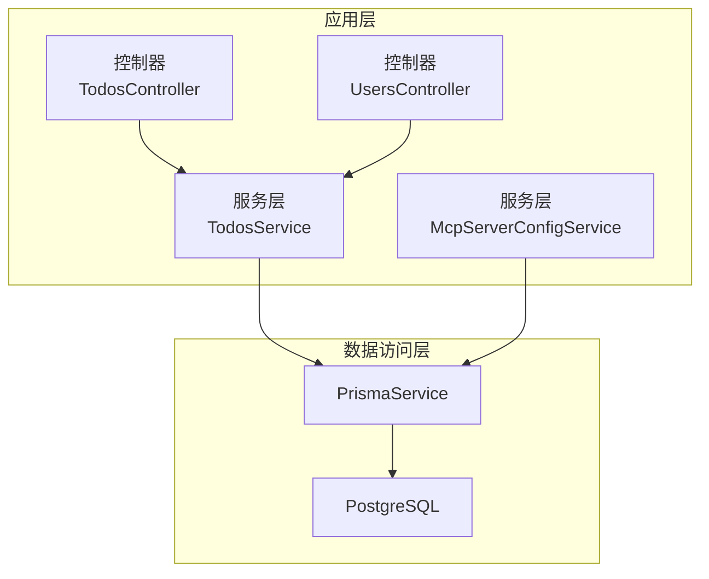
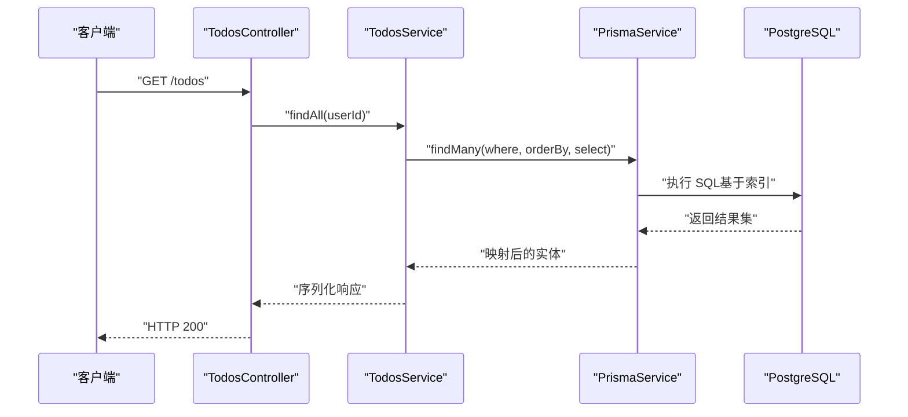
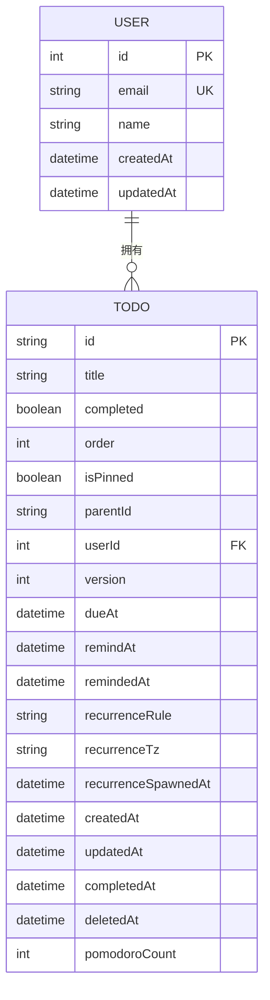
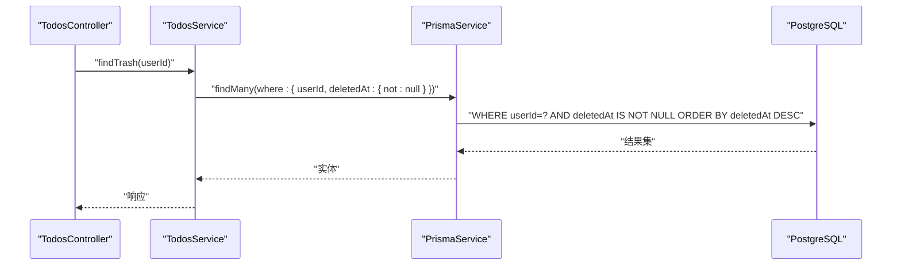
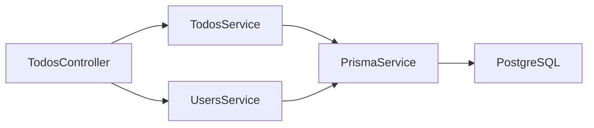

# 索引优化策略

<cite>
**本文引用的文件**
- [apps/backend/prisma/schema/todo.prisma](file://apps/backend/prisma/schema/todo.prisma)
- [apps/backend/prisma/schema/user.prisma](file://apps/backend/prisma/schema/user.prisma)
- [apps/backend/prisma/schema/mcp.prisma](file://apps/backend/prisma/schema/mcp.prisma)
- [apps/backend/prisma/schema/base.prisma](file://apps/backend/prisma/schema/base.prisma)
- [apps/backend/src/todos/todos.service.ts](file://apps/backend/src/todos/todos.service.ts)
- [apps/backend/src/mcp/mcp-server-config.service.ts](file://apps/backend/src/mcp/mcp-server-config.service.ts)
- [apps/backend/src/prisma/prisma.service.ts](file://apps/backend/src/prisma/prisma.service.ts)
- [apps/backend/src/todos/todos.controller.ts](file://apps/backend/src/todos/todos.controller.ts)
- [apps/backend/src/users/users.controller.ts](file://apps/backend/src/users/users.controller.ts)
- [apps/backend/src/prisma/prisma.module.ts](file://apps/backend/src/prisma/prisma.module.ts)
- [docker-compose.yml](file://docker-compose.yml)
- [docker-compose.dev.yml](file://docker-compose.dev.yml)
</cite>

## 目录
1. [简介](#简介)
2. [项目结构](#项目结构)
3. [核心组件](#核心组件)
4. [架构总览](#架构总览)
5. [详细组件分析](#详细组件分析)
6. [依赖关系分析](#依赖关系分析)
7. [性能考量](#性能考量)
8. [故障排查指南](#故障排查指南)
9. [结论](#结论)
10. [附录](#附录)

## 简介
本文件面向 Lumina Todo 的数据库索引优化，聚焦以下主题：
- 复合索引设计原则与查询性能优化
- 覆盖索引与前缀索引的适用场景
- 索引选择性分析与索引维护策略
- 查询计划分析与慢查询优化方法
- 分区表与水平分割的实现方案建议
- 索引监控与性能评估工具使用指南
- 索引重建与维护最佳实践
- 内存索引与磁盘索引的选择策略
- 索引对写入性能的影响与平衡方案

## 项目结构
Lumina Todo 的数据库层采用 Prisma ORM，PostgreSQL 作为数据存储，NestJS 提供服务层与控制器层。数据库模式定义集中在 Prisma Schema 中，服务层通过 Prisma 客户端执行查询与事务。

图表来源
- [apps/backend/src/todos/todos.controller.ts:24-69](file://apps/backend/src/todos/todos.controller.ts#L24-L69)
- [apps/backend/src/users/users.controller.ts:12-49](file://apps/backend/src/users/users.controller.ts#L12-L49)
- [apps/backend/src/todos/todos.service.ts:26-145](file://apps/backend/src/todos/todos.service.ts#L26-L145)
- [apps/backend/src/mcp/mcp-server-config.service.ts:9-156](file://apps/backend/src/mcp/mcp-server-config.service.ts#L9-L156)
- [apps/backend/src/prisma/prisma.service.ts:6-33](file://apps/backend/src/prisma/prisma.service.ts#L6-L33)

章节来源
- [apps/backend/src/todos/todos.controller.ts:24-69](file://apps/backend/src/todos/todos.controller.ts#L24-L69)
- [apps/backend/src/users/users.controller.ts:12-49](file://apps/backend/src/users/users.controller.ts#L12-L49)
- [apps/backend/src/todos/todos.service.ts:26-145](file://apps/backend/src/todos/todos.service.ts#L26-L145)
- [apps/backend/src/mcp/mcp-server-config.service.ts:9-156](file://apps/backend/src/mcp/mcp-server-config.service.ts#L9-L156)
- [apps/backend/src/prisma/prisma.service.ts:6-33](file://apps/backend/src/prisma/prisma.service.ts#L6-L33)

## 核心组件
- 数据模型与索引
  - Todo 模型：包含用户维度字段与多维时间字段，定义了多组复合索引以支撑常见查询路径。
  - User 模型：主键与唯一索引 email。
  - McpServer 模型：用户维度字段上的索引。
- 查询与事务
  - 服务层封装查询、排序与事务，直接影响索引命中与扫描成本。
- 数据库连接
  - PrismaService 使用 PrismaPg 适配器连接 PostgreSQL，提供连接池与生命周期管理。

章节来源
- [apps/backend/prisma/schema/todo.prisma:1-39](file://apps/backend/prisma/schema/todo.prisma#L1-L39)
- [apps/backend/prisma/schema/user.prisma:1-16](file://apps/backend/prisma/schema/user.prisma#L1-L16)
- [apps/backend/prisma/schema/mcp.prisma:1-16](file://apps/backend/prisma/schema/mcp.prisma#L1-L16)
- [apps/backend/src/todos/todos.service.ts:26-145](file://apps/backend/src/todos/todos.service.ts#L26-L145)
- [apps/backend/src/mcp/mcp-server-config.service.ts:9-156](file://apps/backend/src/mcp/mcp-server-config.service.ts#L9-L156)
- [apps/backend/src/prisma/prisma.service.ts:6-33](file://apps/backend/src/prisma/prisma.service.ts#L6-L33)

## 架构总览
Lumina Todo 的数据库访问链路自上而下为：控制器 -> 服务层 -> Prisma 客户端 -> PostgreSQL。索引优化需从模式设计、查询语义与运行时配置三方面协同推进。

图表来源
- [apps/backend/src/todos/todos.controller.ts:40-44](file://apps/backend/src/todos/todos.controller.ts#L40-L44)
- [apps/backend/src/todos/todos.service.ts:34-46](file://apps/backend/src/todos/todos.service.ts#L34-L46)
- [apps/backend/src/prisma/prisma.service.ts:6-33](file://apps/backend/src/prisma/prisma.service.ts#L6-L33)

## 详细组件分析

### Todo 模型与索引设计
- 复合索引现状
  - [userId, updatedAt]：支持“用户+最近更新”类查询与排序。
  - [userId, remindAt]：支持“用户+提醒时间”范围查询。
  - [userId, dueAt]：支持“用户+截止时间”范围查询。
  - [deletedAt]：支持软删除回收站查询。
- 查询模式与索引匹配
  - 列出用户待办：过滤 userId 并按 pinned/order/created 排序，可利用 [userId, updatedAt] 或 [userId, dueAt] 等复合索引进行高效过滤与排序。
  - 回收站查询：过滤 deletedAt 非空，可利用 [deletedAt] 索引。
  - 恢复/删除：按 id 与 userId 查询，当前未见 id 上的索引，可能触发全表扫描或回表成本较高。
- 建议补充
  - 在 Todo.id 上建立唯一索引（默认主键具备唯一索引，但需确认是否被删除或变更）。
  - 若存在频繁的“用户+状态/完成时间”组合查询，可考虑 [userId, completed, completedAt] 复合索引。
  - 对于高选择性的字段组合，如 [userId, dueAt, completed]，可评估作为候选复合索引。

图表来源
- [apps/backend/prisma/schema/user.prisma:1-16](file://apps/backend/prisma/schema/user.prisma#L1-L16)
- [apps/backend/prisma/schema/todo.prisma:1-39](file://apps/backend/prisma/schema/todo.prisma#L1-L39)

章节来源
- [apps/backend/prisma/schema/todo.prisma:1-39](file://apps/backend/prisma/schema/todo.prisma#L1-L39)
- [apps/backend/src/todos/todos.service.ts:34-46](file://apps/backend/src/todos/todos.service.ts#L34-L46)
- [apps/backend/src/todos/todos.service.ts:48-59](file://apps/backend/src/todos/todos.service.ts#L48-L59)
- [apps/backend/src/todos/todos.service.ts:65-84](file://apps/backend/src/todos/todos.service.ts#L65-L84)

### 用户与 McpServer 模型
- User
  - 主键 id 与唯一索引 email，适合按 id 与 email 的等值查询。
- McpServer
  - 字段 userId 上有索引，适合按用户查询 MCP 服务器配置列表。

章节来源
- [apps/backend/prisma/schema/user.prisma:1-16](file://apps/backend/prisma/schema/user.prisma#L1-L16)
- [apps/backend/prisma/schema/mcp.prisma:1-16](file://apps/backend/prisma/schema/mcp.prisma#L1-L16)
- [apps/backend/src/mcp/mcp-server-config.service.ts:38-45](file://apps/backend/src/mcp/mcp-server-config.service.ts#L38-L45)
- [apps/backend/src/mcp/mcp-server-config.service.ts:102-109](file://apps/backend/src/mcp/mcp-server-config.service.ts#L102-L109)

### 查询路径与索引利用
- 控制器到服务层
  - TodosController 提供列出、回收站、恢复、永久删除、清空回收站等接口。
- 服务层查询
  - TodosService 的 findAll/findTrash 等方法直接驱动 Prisma 查询，决定索引是否被有效利用。
- 事务与并发
  - 永久删除与清空回收站使用事务，涉及多表写入，需关注索引对写入性能的影响。

图表来源
- [apps/backend/src/todos/todos.controller.ts:46-50](file://apps/backend/src/todos/todos.controller.ts#L46-L50)
- [apps/backend/src/todos/todos.service.ts:48-59](file://apps/backend/src/todos/todos.service.ts#L48-L59)

章节来源
- [apps/backend/src/todos/todos.controller.ts:40-69](file://apps/backend/src/todos/todos.controller.ts#L40-L69)
- [apps/backend/src/todos/todos.service.ts:34-145](file://apps/backend/src/todos/todos.service.ts#L34-L145)

### 复合索引设计原则与查询性能优化
- 设计原则
  - 前缀匹配：将选择性高的列放在前面，提升区分度。
  - 查询覆盖：尽量使查询条件与排序字段能被现有索引覆盖，避免回表。
  - 写读权衡：在高频写入场景下减少索引数量，或延迟非关键索引。
- 针对 Todo 的优化方向
  - 列出用户待办：优先保证 [userId, updatedAt] 或 [userId, dueAt] 能覆盖 orderBy 与过滤条件。
  - 回收站查询：[deletedAt] 已存在，可进一步结合 [userId, deletedAt] 复合索引以加速分页与排序。
  - 恢复/删除：若按 id 高频查询，确保 Todo.id 唯一索引可用；必要时评估 [userId, id] 复合索引以覆盖“用户限定 + 主键定位”。

章节来源
- [apps/backend/prisma/schema/todo.prisma:23-26](file://apps/backend/prisma/schema/todo.prisma#L23-L26)
- [apps/backend/src/todos/todos.service.ts:34-46](file://apps/backend/src/todos/todos.service.ts#L34-L46)
- [apps/backend/src/todos/todos.service.ts:48-59](file://apps/backend/src/todos/todos.service.ts#L48-L59)
- [apps/backend/src/todos/todos.service.ts:65-84](file://apps/backend/src/todos/todos.service.ts#L65-L84)

### 覆盖索引与前缀索引
- 覆盖索引
  - 当查询所需的列均可从索引中获得时，可避免回表，显著降低 IO。
  - Todo 模型中，select 列较多，建议评估是否可通过复合索引覆盖常用查询列，减少回表。
- 前缀索引
  - 将高选择性的列置于复合索引前缀，可提升查询效率与统计成本。
  - 例如 [userId, dueAt] 可优先满足“用户+截止时间”的高选择性过滤。

章节来源
- [apps/backend/prisma/schema/todo.prisma:23-26](file://apps/backend/prisma/schema/todo.prisma#L23-L26)
- [apps/backend/src/todos/todos.service.ts:5-24](file://apps/backend/src/todos/todos.service.ts#L5-L24)

### 索引选择性分析与维护策略
- 选择性分析
  - 通过统计 distinct 值与行数估算选择性，优先将高选择性列置于前缀。
  - 对于布尔字段（如 completed），选择性通常较低，不建议单独作为高优先级前缀。
- 维护策略
  - 定期分析表与索引统计信息，识别低效或冗余索引。
  - 针对冷数据或历史数据，评估降级为二级索引或归档策略。

章节来源
- [apps/backend/prisma/schema/todo.prisma:1-39](file://apps/backend/prisma/schema/todo.prisma#L1-L39)

### 查询计划分析与慢查询优化
- 查询计划
  - 使用 EXPLAIN/EXPLAIN ANALYZE 观察执行计划，确认是否使用预期索引、是否存在全表扫描或隐式转换。
- 慢查询优化
  - 优先保证过滤条件与排序字段能被索引覆盖。
  - 对于范围查询，尽量将高选择性列前置，缩小扫描范围。
  - 避免在 WHERE/SORT 中对索引列施加函数或类型转换。

章节来源
- [apps/backend/src/todos/todos.service.ts:34-46](file://apps/backend/src/todos/todos.service.ts#L34-L46)
- [apps/backend/src/todos/todos.service.ts:48-59](file://apps/backend/src/todos/todos.service.ts#L48-L59)

### 分区表与水平分割
- 分区表
  - 可按时间（如 createdAt/updatedAt）或用户维度进行分区，降低扫描范围与维护成本。
- 水平分割
  - 按用户 ID 或地域划分数据分片，配合路由层实现跨分片查询与聚合。
- 建议
  - 从查询模式出发评估分区键，确保热点不集中。
  - 分区/分片后需统一迁移与同步策略，保障一致性。

章节来源
- [apps/backend/prisma/schema/todo.prisma:1-39](file://apps/backend/prisma/schema/todo.prisma#L1-L39)
- [apps/backend/src/todos/todos.service.ts:34-46](file://apps/backend/src/todos/todos.service.ts#L34-L46)

### 索引监控与性能评估
- 监控指标
  - 索引扫描次数、缓存命中率、查询耗时分布。
- 工具与方法
  - 使用数据库内置统计视图与扩展（如 pg_stat_statements）收集查询与索引使用情况。
  - 结合 A/B 测试验证索引变更效果。
- 评估周期
  - 建议按季度回顾索引使用率与查询模式变化，动态调整。

章节来源
- [docker-compose.yml:23-51](file://docker-compose.yml#L23-L51)
- [docker-compose.dev.yml:17-52](file://docker-compose.dev.yml#L17-L52)

### 索引重建与维护最佳实践
- 重建策略
  - 在低峰时段执行，避免阻塞线上流量。
  - 对大表采用在线 DDL 或分批重建，缩短窗口。
- 维护流程
  - 变更前备份、变更后验证查询计划与性能回归。
  - 记录变更清单与回滚预案。

章节来源
- [apps/backend/src/todos/todos.service.ts:96-106](file://apps/backend/src/todos/todos.service.ts#L96-L106)
- [apps/backend/src/todos/todos.service.ts:126-140](file://apps/backend/src/todos/todos.service.ts#L126-L140)

### 内存索引与磁盘索引的选择
- 内存索引
  - 适用于热数据与高 QPS 场景，但受内存容量限制。
- 磁盘索引
  - 更适合大规模数据与长周期查询，需结合 IO 性能与缓存策略。
- 策略建议
  - 热点用户与近期数据可考虑内存优化策略，其余走磁盘索引。

章节来源
- [docker-compose.yml:30-35](file://docker-compose.yml#L30-L35)
- [docker-compose.dev.yml:46-51](file://docker-compose.dev.yml#L46-L51)

### 索引对写入性能的影响与平衡
- 影响因素
  - 写入时需更新索引树，增加 CPU 与 IO 开销。
  - 高频更新字段（如 updatedAt）与高基数索引会放大写入成本。
- 平衡方案
  - 合理精简索引数量，仅保留高频查询所需索引。
  - 对写多读少场景，可考虑延迟索引或异步重建。
  - 使用批量写入与事务合并，降低索引更新频率。

章节来源
- [apps/backend/src/todos/todos.service.ts:72-80](file://apps/backend/src/todos/todos.service.ts#L72-L80)
- [apps/backend/src/todos/todos.service.ts:96-106](file://apps/backend/src/todos/todos.service.ts#L96-L106)
- [apps/backend/src/todos/todos.service.ts:126-140](file://apps/backend/src/todos/todos.service.ts#L126-L140)

## 依赖关系分析
- 组件耦合
  - 控制器依赖服务层；服务层依赖 PrismaService；PrismaService 依赖 PostgreSQL。
- 外部依赖
  - PostgreSQL 提供索引与查询执行能力；Redis 用于缓存与队列，间接影响数据库压力。

图表来源
- [apps/backend/src/todos/todos.controller.ts:24-69](file://apps/backend/src/todos/todos.controller.ts#L24-L69)
- [apps/backend/src/users/users.controller.ts:12-49](file://apps/backend/src/users/users.controller.ts#L12-L49)
- [apps/backend/src/todos/todos.service.ts:26-32](file://apps/backend/src/todos/todos.service.ts#L26-L32)
- [apps/backend/src/prisma/prisma.service.ts:6-33](file://apps/backend/src/prisma/prisma.service.ts#L6-L33)

章节来源
- [apps/backend/src/todos/todos.controller.ts:24-69](file://apps/backend/src/todos/todos.controller.ts#L24-L69)
- [apps/backend/src/users/users.controller.ts:12-49](file://apps/backend/src/users/users.controller.ts#L12-L49)
- [apps/backend/src/todos/todos.service.ts:26-32](file://apps/backend/src/todos/todos.service.ts#L26-L32)
- [apps/backend/src/prisma/prisma.service.ts:6-33](file://apps/backend/src/prisma/prisma.service.ts#L6-L33)

## 性能考量
- 运行时配置
  - PostgreSQL 参数（shared_buffers、effective_cache_size、work_mem、maintenance_work_mem、random_page_cost、max_connections）直接影响索引扫描与写入性能。
- 缓存策略
  - Redis 可承载部分热点读取，缓解数据库压力，但需注意缓存失效与一致性问题。

章节来源
- [docker-compose.yml:28-35](file://docker-compose.yml#L28-L35)
- [docker-compose.dev.yml:46-51](file://docker-compose.dev.yml#L46-L51)

## 故障排查指南
- 常见问题
  - 查询变慢：检查执行计划是否使用索引、是否存在隐式转换、是否发生回表。
  - 写入抖动：评估索引数量与更新频率，识别热点写入。
- 排查步骤
  - 采集慢查询日志与执行计划。
  - 对比索引使用统计与查询模式变化。
  - 小范围灰度变更并观察指标。

章节来源
- [apps/backend/src/todos/todos.service.ts:34-46](file://apps/backend/src/todos/todos.service.ts#L34-L46)
- [apps/backend/src/todos/todos.service.ts:48-59](file://apps/backend/src/todos/todos.service.ts#L48-L59)
- [apps/backend/src/todos/todos.service.ts:65-84](file://apps/backend/src/todos/todos.service.ts#L65-L84)
- [apps/backend/src/todos/todos.service.ts:96-106](file://apps/backend/src/todos/todos.service.ts#L96-L106)
- [apps/backend/src/todos/todos.service.ts:126-140](file://apps/backend/src/todos/todos.service.ts#L126-L140)

## 结论
Lumina Todo 的索引优化应围绕“查询模式 + 选择性 + 写入代价”三位一体展开。当前 Todo 模型已具备若干关键复合索引，建议在此基础上：
- 补充主键与高价值查询的索引覆盖
- 基于查询计划与监控持续迭代
- 在低峰时段进行索引重建与维护
- 平衡写入与读取的索引策略，结合分区/分片与缓存优化整体性能

## 附录
- 数据库连接与适配器
  - PrismaService 使用 PrismaPg 适配器与连接池，确保稳定连接与资源释放。
- 环境与部署
  - docker-compose 提供生产与开发环境的数据库与缓存配置示例，便于本地与线上对比测试。

章节来源
- [apps/backend/src/prisma/prisma.service.ts:6-33](file://apps/backend/src/prisma/prisma.service.ts#L6-L33)
- [apps/backend/src/prisma/prisma.module.ts:1-10](file://apps/backend/src/prisma/prisma.module.ts#L1-L10)
- [docker-compose.yml:23-51](file://docker-compose.yml#L23-L51)
- [docker-compose.dev.yml:17-52](file://docker-compose.dev.yml#L17-L52)