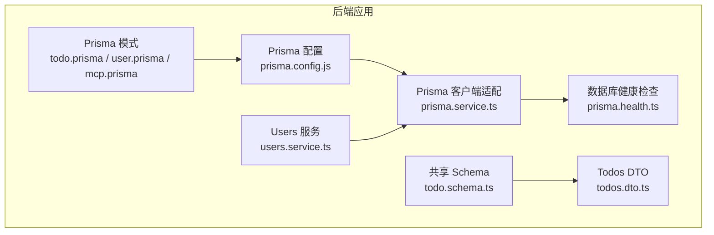
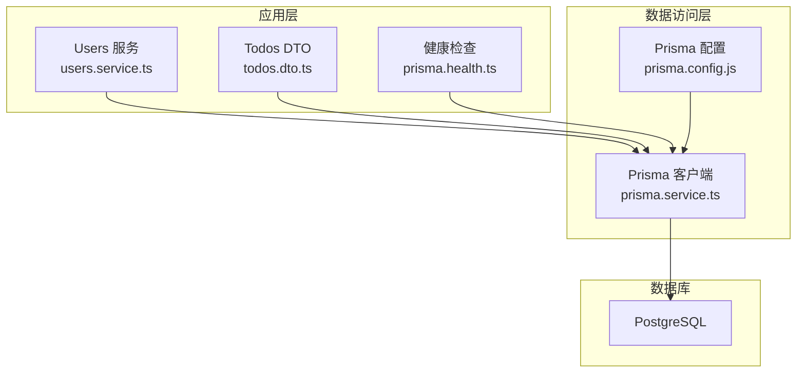
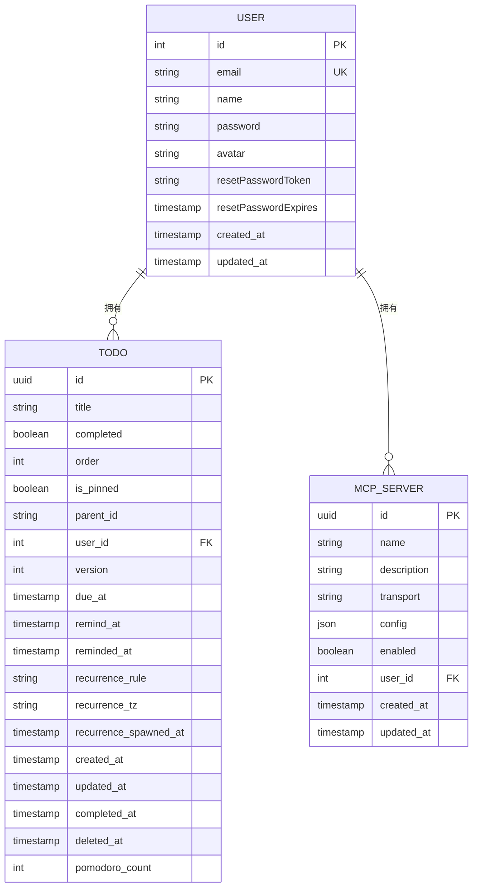
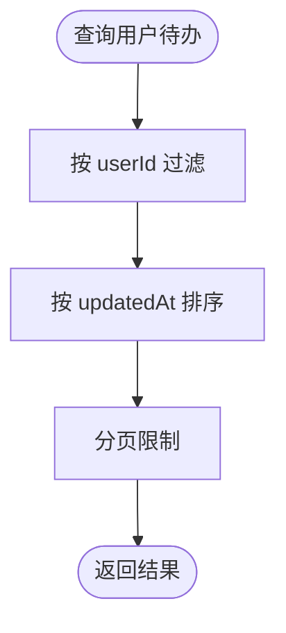
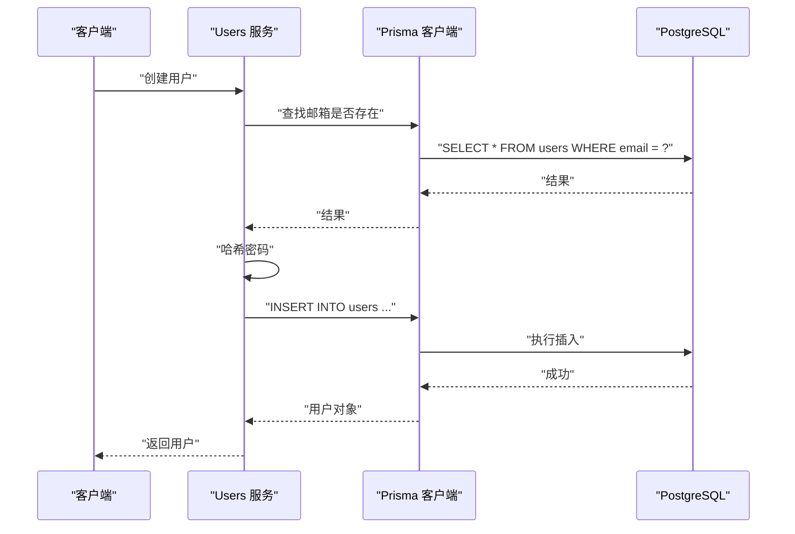
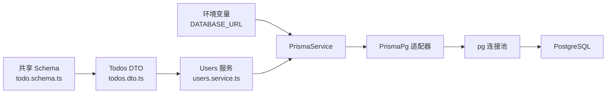

# 表结构设计

<cite>
**本文引用的文件**
- [apps/backend/prisma/schema/todo.prisma](file://apps/backend/prisma/schema/todo.prisma)
- [apps/backend/prisma/schema/user.prisma](file://apps/backend/prisma/schema/user.prisma)
- [apps/backend/prisma/schema/mcp.prisma](file://apps/backend/prisma/schema/mcp.prisma)
- [apps/backend/prisma/schema/base.prisma](file://apps/backend/prisma/schema/base.prisma)
- [apps/backend/prisma.config.js](file://apps/backend/prisma.config.js)
- [apps/backend/src/prisma/prisma.service.ts](file://apps/backend/src/prisma/prisma.service.ts)
- [apps/backend/src/health/prisma.health.ts](file://apps/backend/src/health/prisma.health.ts)
- [packages/shared/src/schemas/todo.schema.ts](file://packages/shared/src/schemas/todo.schema.ts)
- [apps/backend/src/todos/todos.dto.ts](file://apps/backend/src/todos/todos.dto.ts)
- [apps/backend/src/users/users.service.ts](file://apps/backend/src/users/users.service.ts)
</cite>

## 目录
1. [简介](#简介)
2. [项目结构](#项目结构)
3. [核心组件](#核心组件)
4. [架构总览](#架构总览)
5. [详细组件分析](#详细组件分析)
6. [依赖关系分析](#依赖关系分析)
7. [性能考量](#性能考量)
8. [故障排查指南](#故障排查指南)
9. [结论](#结论)
10. [附录](#附录)

## 简介
本文件系统性梳理 Lumina Todo 的数据库表结构设计，聚焦 Prisma 模式文件中定义的实体与关系，并结合共享 Schema、DTO、服务层与健康检查模块，说明字段定义、数据类型选择、约束规则、索引设计、默认值与时间戳策略、枚举与状态管理、JSON 字段与复杂数据存储、以及迁移与版本控制方案。文档同时给出面向开发与运维的可操作建议与排障指引。

## 项目结构
后端采用 NestJS + Prisma 架构，数据库通过 PostgreSQL 提供者连接。Prisma 模式文件集中于 apps/backend/prisma/schema，包含用户、待办与 MCP 服务器三张核心表；迁移与生成客户端由 prisma.config.js 统一配置；共享 Schema 在 packages/shared 中定义，用于前后端一致的数据校验与同步协议。

**图表来源**
- [apps/backend/prisma/schema/todo.prisma:1-39](file://apps/backend/prisma/schema/todo.prisma#L1-L39)
- [apps/backend/prisma/schema/user.prisma:1-16](file://apps/backend/prisma/schema/user.prisma#L1-L16)
- [apps/backend/prisma/schema/mcp.prisma:1-16](file://apps/backend/prisma/schema/mcp.prisma#L1-L16)
- [apps/backend/prisma.config.js:1-22](file://apps/backend/prisma.config.js#L1-L22)
- [apps/backend/src/prisma/prisma.service.ts:1-34](file://apps/backend/src/prisma/prisma.service.ts#L1-L34)
- [apps/backend/src/health/prisma.health.ts:1-32](file://apps/backend/src/health/prisma.health.ts#L1-L32)
- [packages/shared/src/schemas/todo.schema.ts:1-75](file://packages/shared/src/schemas/todo.schema.ts#L1-L75)
- [apps/backend/src/todos/todos.dto.ts:1-5](file://apps/backend/src/todos/todos.dto.ts#L1-L5)
- [apps/backend/src/users/users.service.ts:1-110](file://apps/backend/src/users/users.service.ts#L1-L110)

**章节来源**
- [apps/backend/prisma/schema/todo.prisma:1-39](file://apps/backend/prisma/schema/todo.prisma#L1-L39)
- [apps/backend/prisma/schema/user.prisma:1-16](file://apps/backend/prisma/schema/user.prisma#L1-L16)
- [apps/backend/prisma/schema/mcp.prisma:1-16](file://apps/backend/prisma/schema/mcp.prisma#L1-L16)
- [apps/backend/prisma/schema/base.prisma:1-9](file://apps/backend/prisma/schema/base.prisma#L1-L9)
- [apps/backend/prisma.config.js:1-22](file://apps/backend/prisma.config.js#L1-L22)

## 核心组件
- 用户表（users）
  - 主键：自增整型 id
  - 唯一约束：email
  - 时间戳：createdAt、updatedAt
  - 关系：与 Todo、McpServer 一对多
- 待办表（todos）
  - 主键：UUID id
  - 默认值：completed=false、order=0、version=0、pomodoroCount=0
  - 时间戳：createdAt、updatedAt、deletedAt、completedAt、remindedAt
  - 关系：与 User 多对一
  - 索引：复合索引（userId, updatedAt）、（userId, remindAt）、（userId, dueAt）、单列索引（deletedAt）
- 待办墓碑表（todo_tombstones）
  - 复合主键：（userId, todoId）
  - 默认值：deletedAt=now()
  - 索引：（userId, deletedAt）

上述组件均通过 Prisma 模式文件定义，映射到 PostgreSQL 数据库。

**章节来源**
- [apps/backend/prisma/schema/user.prisma:1-16](file://apps/backend/prisma/schema/user.prisma#L1-L16)
- [apps/backend/prisma/schema/todo.prisma:1-39](file://apps/backend/prisma/schema/todo.prisma#L1-L39)
- [apps/backend/prisma/schema/mcp.prisma:1-16](file://apps/backend/prisma/schema/mcp.prisma#L1-L16)

## 架构总览
下图展示数据库层与应用层交互：Prisma 客户端通过适配器连接 PostgreSQL；健康检查模块定期验证连接可用性；共享 Schema 为前端与后端提供统一的数据契约；服务层封装业务逻辑并通过 Prisma 访问数据库。

**图表来源**
- [apps/backend/src/users/users.service.ts:1-110](file://apps/backend/src/users/users.service.ts#L1-L110)
- [apps/backend/src/todos/todos.dto.ts:1-5](file://apps/backend/src/todos/todos.dto.ts#L1-L5)
- [apps/backend/src/health/prisma.health.ts:1-32](file://apps/backend/src/health/prisma.health.ts#L1-L32)
- [apps/backend/src/prisma/prisma.service.ts:1-34](file://apps/backend/src/prisma/prisma.service.ts#L1-L34)
- [apps/backend/prisma.config.js:1-22](file://apps/backend/prisma.config.js#L1-L22)

## 详细组件分析

### 用户表（users）
- 字段与约束
  - id：整型主键，自增策略由 Prisma 模式定义
  - email：字符串，唯一约束
  - name/password/avatar：字符串或空值
  - resetPasswordToken/resetPasswordExpires：令牌与过期时间
  - createdAt/updatedAt：时间戳，默认值与更新行为由 Prisma 模式定义
- 设计要点
  - 自增主键适合高并发下的写入性能与简单性
  - 唯一索引保证邮箱唯一性，避免重复注册
  - 密码字段为空值允许匿名或第三方登录场景
- 关系
  - 与 Todo、McpServer 一对多，外键在关系字段中声明

**图表来源**
- [apps/backend/prisma/schema/user.prisma:1-16](file://apps/backend/prisma/schema/user.prisma#L1-L16)
- [apps/backend/prisma/schema/todo.prisma:1-39](file://apps/backend/prisma/schema/todo.prisma#L1-L39)
- [apps/backend/prisma/schema/mcp.prisma:1-16](file://apps/backend/prisma/schema/mcp.prisma#L1-L16)

**章节来源**
- [apps/backend/prisma/schema/user.prisma:1-16](file://apps/backend/prisma/schema/user.prisma#L1-L16)

### 待办表（todos）
- 字段与约束
  - id：UUID 主键
  - title：字符串，配合共享 Schema 限制最大长度
  - completed/isPinned：布尔，默认值 false/False
  - order/version/pomodoroCount：整数，默认值 0
  - dueAt/remindAt/remindedAt：时间戳，支持空值
  - recurrenceRule/recurrenceTz/recurrenceSpawnedAt：周期任务相关，空值表示未启用
  - createdAt/updatedAt/deletedAt/completedAt：时间戳，部分字段带默认值
  - parentId：指向自身层级关系的外键
  - userId：用户外键
- 索引设计
  - 复合索引（userId, updatedAt）：按用户维度快速检索最近更新
  - 复合索引（userId, remindAt）：按用户维度检索提醒计划
  - 复合索引（userId, dueAt）：按用户维度检索到期任务
  - 单列索引（deletedAt）：支持软删除过滤
- 设计要点
  - UUID 主键避免序列号暴露与跨系统合并冲突
  - 软删除字段 deletedAt 支持审计与恢复
  - 周期任务字段为空值表示非周期任务，减少无效索引

**图表来源**
- [apps/backend/prisma/schema/todo.prisma:22-27](file://apps/backend/prisma/schema/todo.prisma#L22-L27)

**章节来源**
- [apps/backend/prisma/schema/todo.prisma:1-39](file://apps/backend/prisma/schema/todo.prisma#L1-L39)
- [packages/shared/src/schemas/todo.schema.ts:8-27](file://packages/shared/src/schemas/todo.schema.ts#L8-L27)

### 待办墓碑表（todo_tombstones）
- 复合主键（userId, todoId），用于记录已删除的待办项
- deletedAt 默认值为当前时间，便于审计与去重
- 索引（userId, deletedAt）支持按用户快速检索删除记录

**图表来源**
- [apps/backend/src/users/users.service.ts:88-108](file://apps/backend/src/users/users.service.ts#L88-L108)
- [apps/backend/src/prisma/prisma.service.ts:1-34](file://apps/backend/src/prisma/prisma.service.ts#L1-L34)

**章节来源**
- [apps/backend/prisma/schema/todo.prisma:30-39](file://apps/backend/prisma/schema/todo.prisma#L30-L39)
- [apps/backend/src/users/users.service.ts:88-108](file://apps/backend/src/users/users.service.ts#L88-L108)

### MCP 服务器表（mcp_servers）
- 字段与约束
  - id：UUID 主键
  - name/description/transport：字符串
  - config：JSON 类型，存储传输配置
  - enabled：布尔，默认值 true
  - userId：用户外键，级联删除
  - createdAt/updatedAt：时间戳
- 设计要点
  - JSON 字段用于灵活存储不同传输类型的配置
  - 级联删除保证用户删除时关联资源清理

**章节来源**
- [apps/backend/prisma/schema/mcp.prisma:1-16](file://apps/backend/prisma/schema/mcp.prisma#L1-L16)

## 依赖关系分析
- 数据源与适配
  - Prisma 提供者为 PostgreSQL，连接通过 PrismaPg 适配器与 pg 连接池建立
  - DATABASE_URL 环境变量驱动连接字符串
- 应用层依赖
  - PrismaService 在模块初始化时连接数据库，在销毁时断开并释放连接池
  - 健康检查模块通过原生查询验证数据库连通性
- 共享契约
  - 共享 Schema 定义了待办项的字段范围、长度与枚举取值，作为前后端同步协议的基础

**图表来源**
- [apps/backend/src/prisma/prisma.service.ts:1-34](file://apps/backend/src/prisma/prisma.service.ts#L1-L34)
- [apps/backend/prisma.config.js:13-21](file://apps/backend/prisma.config.js#L13-L21)
- [packages/shared/src/schemas/todo.schema.ts:1-75](file://packages/shared/src/schemas/todo.schema.ts#L1-L75)
- [apps/backend/src/todos/todos.dto.ts:1-5](file://apps/backend/src/todos/todos.dto.ts#L1-L5)
- [apps/backend/src/users/users.service.ts:1-110](file://apps/backend/src/users/users.service.ts#L1-L110)

**章节来源**
- [apps/backend/src/prisma/prisma.service.ts:1-34](file://apps/backend/src/prisma/prisma.service.ts#L1-L34)
- [apps/backend/prisma.config.js:13-21](file://apps/backend/prisma.config.js#L13-L21)
- [packages/shared/src/schemas/todo.schema.ts:1-75](file://packages/shared/src/schemas/todo.schema.ts#L1-L75)
- [apps/backend/src/todos/todos.dto.ts:1-5](file://apps/backend/src/todos/todos.dto.ts#L1-L5)
- [apps/backend/src/users/users.service.ts:1-110](file://apps/backend/src/users/users.service.ts#L1-L110)

## 性能考量
- 索引策略
  - 对高频查询条件（如按用户过滤、按更新/提醒/到期时间排序）建立复合索引，降低全表扫描概率
  - 单列索引（deletedAt）支持软删除过滤，建议在删除量较大时评估维护成本
- 写入优化
  - UUID 主键避免热点序列竞争，适合分布式写入
  - 默认值减少写入参数，提升批量导入效率
- 查询优化
  - 利用 updatedAt、remindAt、dueAt 等时间字段进行分页与范围查询
  - 避免在大字段（如 JSON）上建立索引，必要时考虑物化派生列
- 连接与健康
  - 使用连接池复用连接，健康检查定期探测数据库可用性，异常时快速失败

[本节为通用指导，无需特定文件引用]

## 故障排查指南
- 数据库连接失败
  - 检查 DATABASE_URL 是否正确设置且可达
  - 通过健康检查接口确认数据库连通性
- 迁移与生成客户端
  - 使用脚本生成客户端与执行迁移，确保模式与数据库一致
- 数据不一致
  - 校验共享 Schema 与 Prisma 模式的字段定义一致性
  - 检查软删除与墓碑表的使用是否符合预期

**章节来源**
- [apps/backend/src/health/prisma.health.ts:19-30](file://apps/backend/src/health/prisma.health.ts#L19-L30)
- [apps/backend/src/prisma/prisma.service.ts:10-21](file://apps/backend/src/prisma/prisma.service.ts#L10-L21)
- [apps/backend/package.json:25-28](file://apps/backend/package.json#L25-L28)

## 结论
本设计以 Prisma 模式为核心，结合 PostgreSQL 提供稳定的数据持久化能力。通过 UUID 主键、软删除、复合索引与连接池等策略，兼顾性能与可维护性。共享 Schema 明确了字段范围与枚举取值，为前后端协同提供了坚实基础。建议在后续演进中持续关注索引维护成本与迁移策略，确保数据库结构与业务需求同步演进。

[本节为总结，无需特定文件引用]

## 附录

### 字段定义与约束摘要
- 用户表（users）
  - 主键：id（自增整型）
  - 唯一：email
  - 时间戳：createdAt、updatedAt
- 待办表（todos）
  - 主键：id（UUID）
  - 默认值：completed、order、version、pomodoroCount
  - 时间戳：createdAt、updatedAt、deletedAt、completedAt、remindedAt
  - 索引：（userId, updatedAt）、（userId, remindAt）、（userId, dueAt）、（deletedAt）
- 待办墓碑表（todo_tombstones）
  - 主键：（userId, todoId）
  - 默认值：deletedAt
  - 索引：（userId, deletedAt）

**章节来源**
- [apps/backend/prisma/schema/user.prisma:1-16](file://apps/backend/prisma/schema/user.prisma#L1-L16)
- [apps/backend/prisma/schema/todo.prisma:1-39](file://apps/backend/prisma/schema/todo.prisma#L1-L39)
- [apps/backend/prisma/schema/mcp.prisma:1-16](file://apps/backend/prisma/schema/mcp.prisma#L1-L16)

### 索引设计原则与复合索引场景
- 复合索引（userId, updatedAt）：按用户维度快速检索最近更新
- 复合索引（userId, remindAt）：按用户维度检索提醒计划
- 复合索引（userId, dueAt）：按用户维度检索到期任务
- 单列索引（deletedAt）：支持软删除过滤

**章节来源**
- [apps/backend/prisma/schema/todo.prisma:22-27](file://apps/backend/prisma/schema/todo.prisma#L22-L27)

### 字段默认值与时间戳设计
- 默认值：completed、order、version、pomodoroCount、enabled、deletedAt（当使用墓碑表时）
- 时间戳：createdAt、updatedAt、deletedAt、completedAt、remindedAt
- 更新策略：updatedAt 由 Prisma 自动生成

**章节来源**
- [apps/backend/prisma/schema/todo.prisma:4-18](file://apps/backend/prisma/schema/todo.prisma#L4-L18)
- [apps/backend/prisma/schema/user.prisma:9-10](file://apps/backend/prisma/schema/user.prisma#L9-L10)
- [apps/backend/prisma/schema/mcp.prisma:9-10](file://apps/backend/prisma/schema/mcp.prisma#L9-L10)

### 枚举类型与状态字段管理
- 枚举：recurrenceRule（DAILY/WEEKDAYS/WEEKLY/MONTHLY）
- 状态字段：completed、isPinned、enabled
- 管理建议：状态字段统一使用布尔或受控枚举，避免“自由文本”导致的不一致

**章节来源**
- [packages/shared/src/schemas/todo.schema.ts:3-3](file://packages/shared/src/schemas/todo.schema.ts#L3-L3)
- [apps/backend/prisma/schema/todo.prisma:13-13](file://apps/backend/prisma/schema/todo.prisma#L13-L13)

### JSON 字段与复杂数据存储策略
- JSON 字段：mcp_servers.config 存储传输配置
- 策略：结构化配置优先；若频繁查询 JSON 内容，考虑拆分为关系表或物化派生列

**章节来源**
- [apps/backend/prisma/schema/mcp.prisma:6-6](file://apps/backend/prisma/schema/mcp.prisma#L6-L6)

### 表结构变更历史与版本控制方案
- 迁移路径：prisma.config.js 指定迁移目录与数据源 URL
- 版本控制：通过 Prisma 迁移文件记录结构变更；结合 Git 管理模式与迁移脚本
- 建议：每次结构变更均配套迁移文件与回归测试，确保向后兼容与可回滚

**章节来源**
- [apps/backend/prisma.config.js:13-21](file://apps/backend/prisma.config.js#L13-L21)

### 字段长度限制与字符集选择
- 长度限制：title 最大 500，recurrenceTz 最大 64（来自共享 Schema）
- 字符集：PostgreSQL 默认 UTF8，满足多语言需求
- 建议：长文本字段（如描述）可考虑单独表或压缩存储，平衡查询与容量

**章节来源**
- [packages/shared/src/schemas/todo.schema.ts:10-21](file://packages/shared/src/schemas/todo.schema.ts#L10-L21)

### 数据类型兼容性与迁移策略
- 兼容性：Prisma 适配器与 pg 驱动保持一致的类型映射
- 迁移策略：先在测试环境验证迁移，再灰度发布；对大表变更采用在线 DDL 或分批处理

**章节来源**
- [apps/backend/src/prisma/prisma.service.ts:1-34](file://apps/backend/src/prisma/prisma.service.ts#L1-L34)
- [apps/backend/package.json:56-80](file://apps/backend/package.json#L56-L80)