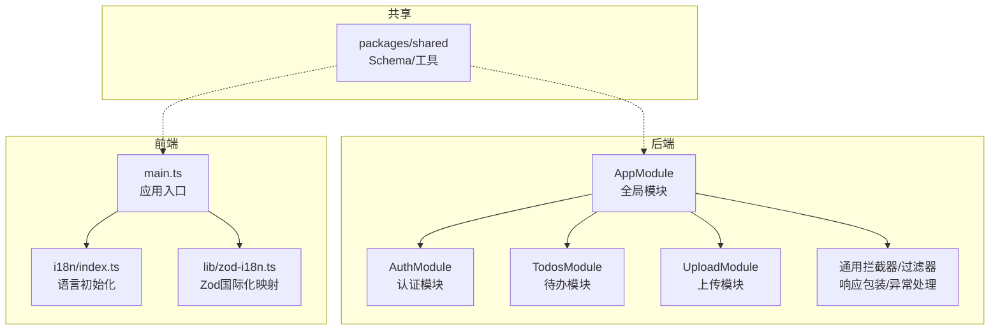
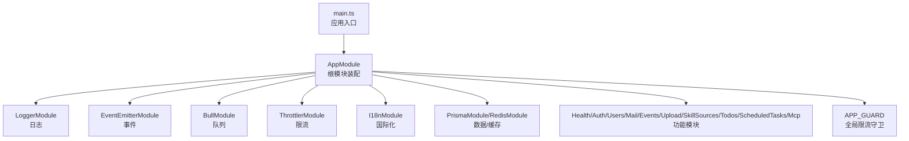
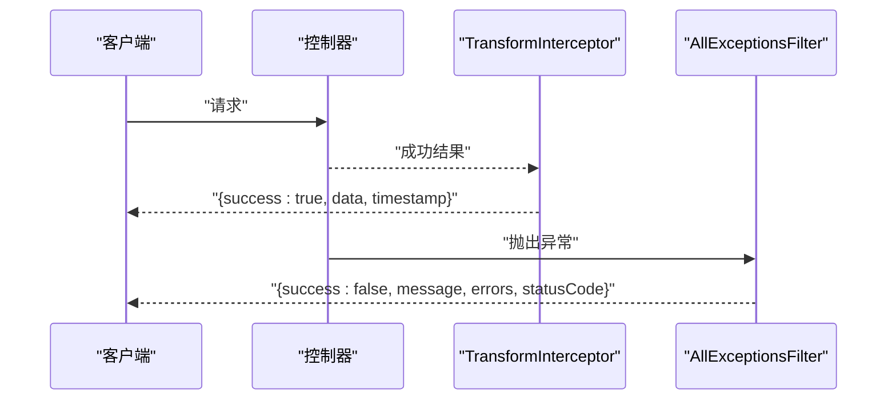
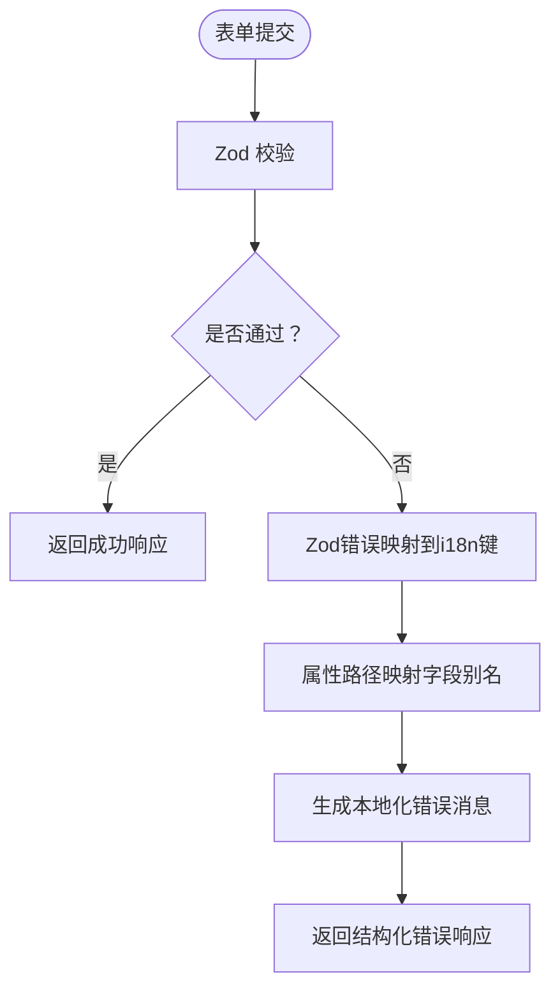
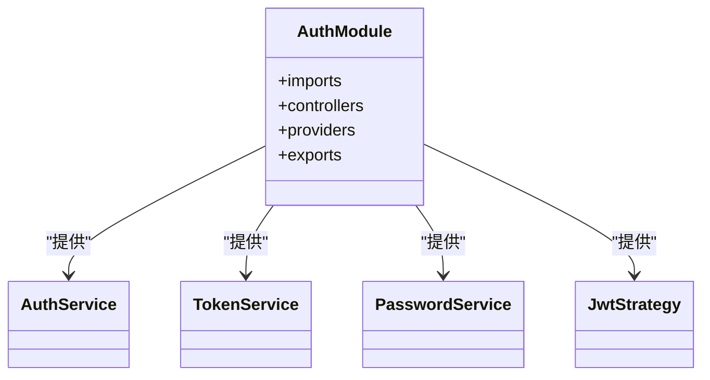
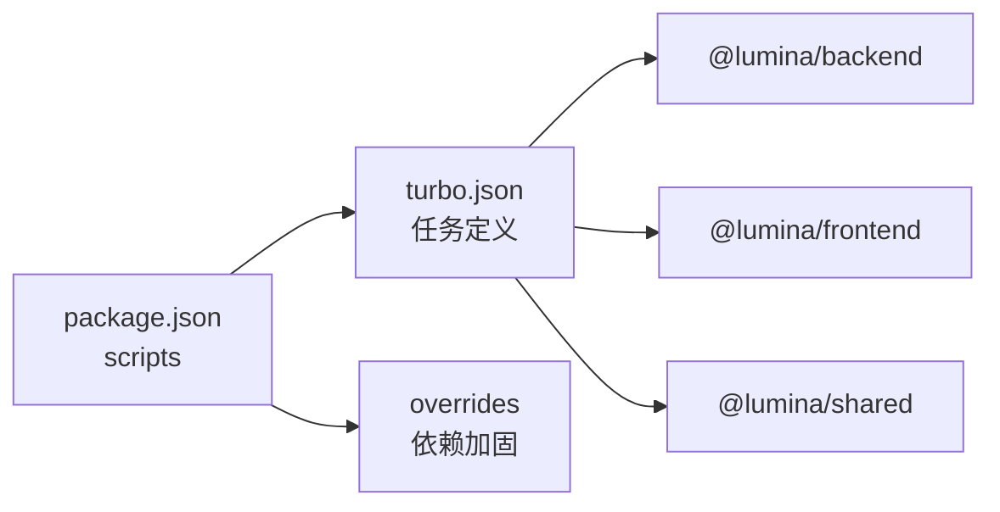

# 最佳实践

<cite>
**本文引用的文件**
- [apps/backend/src/app.module.ts](file://apps/backend/src/app.module.ts)
- [apps/backend/src/auth/auth.module.ts](file://apps/backend/src/auth/auth.module.ts)
- [apps/backend/src/todos/todos.module.ts](file://apps/backend/src/todos/todos.module.ts)
- [apps/backend/src/upload/upload.module.ts](file://apps/backend/src/upload/upload.module.ts)
- [apps/backend/src/common/filters/all-exceptions.filter.ts](file://apps/backend/src/common/filters/all-exceptions.filter.ts)
- [apps/backend/src/common/interceptors/transform.interceptor.ts](file://apps/backend/src/common/interceptors/transform.interceptor.ts)
- [apps/frontend/src/main.ts](file://apps/frontend/src/main.ts)
- [apps/frontend/src/i18n/index.ts](file://apps/frontend/src/i18n/index.ts)
- [apps/frontend/src/lib/zod-i18n.ts](file://apps/frontend/src/lib/zod-i18n.ts)
- [package.json](file://package.json)
- [turbo.json](file://turbo.json)
- [CONTRIBUTING.md](file://CONTRIBUTING.md)
- [SECURITY.md](file://SECURITY.md)
- [CODE_OF_CONDUCT.md](file://CODE_OF_CONDUCT.md)
</cite>

## 目录
1. [简介](#简介)
2. [项目结构](#项目结构)
3. [核心组件](#核心组件)
4. [架构总览](#架构总览)
5. [详细组件分析](#详细组件分析)
6. [依赖关系分析](#依赖关系分析)
7. [性能考量](#性能考量)
8. [故障排查指南](#故障排查指南)
9. [结论](#结论)
10. [附录](#附录)

## 简介
本最佳实践指南面向开发者与团队领导者，系统总结 Lumina Todo 在开发过程中的经验与教训，覆盖代码组织、架构设计、性能优化、安全编码、数据与隐私保护、团队协作与知识分享、持续集成与部署、质量保证以及用户体验与国际化等维度。文档以仓库现有实现为依据，结合可操作的建议与可视化图示，帮助团队在保持工程严谨性的同时提升交付效率与产品体验。

## 项目结构
Lumina Todo 采用多包工作区（monorepo）组织方式，核心由以下部分组成：
- 后端应用（NestJS）：负责业务逻辑、认证授权、定时任务、队列、邮件、文件上传、AI/MCP 能力等。
- 前端应用（Vue 3 + Vite）：提供 Web 与移动端（Capacitor）界面，内置国际化与类型化校验。
- 共享包（packages/shared）：共享的 Zod Schema 与工具函数，确保前后端一致的数据契约。
- Wails 桌面壳层：基于 Go 的桌面应用封装。
- CI/CD 与脚手架：通过 Turbo、Docker Compose、PM2、脚本等实现构建、测试、部署与运维。

图表来源
- [apps/backend/src/app.module.ts:28-156](file://apps/backend/src/app.module.ts#L28-L156)
- [apps/backend/src/auth/auth.module.ts:19-40](file://apps/backend/src/auth/auth.module.ts#L19-L40)
- [apps/backend/src/todos/todos.module.ts:8-14](file://apps/backend/src/todos/todos.module.ts#L8-L14)
- [apps/backend/src/upload/upload.module.ts:10-15](file://apps/backend/src/upload/upload.module.ts#L10-L15)
- [apps/frontend/src/main.ts:54-137](file://apps/frontend/src/main.ts#L54-L137)
- [apps/frontend/src/i18n/index.ts:24-36](file://apps/frontend/src/i18n/index.ts#L24-L36)
- [apps/frontend/src/lib/zod-i18n.ts:92-95](file://apps/frontend/src/lib/zod-i18n.ts#L92-L95)

章节来源
- [package.json:31-76](file://package.json#L31-L76)
- [turbo.json:1-202](file://turbo.json#L1-L202)

## 核心组件
- 全局响应包装与异常处理：统一的成功/失败响应结构与标准化错误输出，便于前端消费与调试。
- 国际化与类型校验：前端 i18n 与 Zod 错误映射联动，后端 I18n 与 Zod 错误聚合，确保错误信息本地化且结构化。
- 认证模块：基于 JWT 的认证体系，配合守卫与策略，保障接口安全。
- 模块化领域服务：如待办、上传、定时任务等按功能域拆分，职责清晰、边界明确。
- 工作区与脚手架：Turbo 管理构建与测试流水线，脚本统一 Docker、数据库迁移与安全审计。

章节来源
- [apps/backend/src/common/interceptors/transform.interceptor.ts:18-29](file://apps/backend/src/common/interceptors/transform.interceptor.ts#L18-L29)
- [apps/backend/src/common/filters/all-exceptions.filter.ts:16-136](file://apps/backend/src/common/filters/all-exceptions.filter.ts#L16-L136)
- [apps/backend/src/auth/auth.module.ts:19-40](file://apps/backend/src/auth/auth.module.ts#L19-L40)
- [apps/backend/src/todos/todos.module.ts:8-14](file://apps/backend/src/todos/todos.module.ts#L8-L14)
- [apps/backend/src/upload/upload.module.ts:10-15](file://apps/backend/src/upload/upload.module.ts#L10-L15)
- [apps/frontend/src/i18n/index.ts:24-36](file://apps/frontend/src/i18n/index.ts#L24-L36)
- [apps/frontend/src/lib/zod-i18n.ts:18-87](file://apps/frontend/src/lib/zod-i18n.ts#L18-L87)

## 架构总览
下图展示后端应用启动与模块装配的关键路径，体现模块解耦、全局守卫与中间件扩展点的关系。

图表来源
- [apps/backend/src/app.module.ts:28-156](file://apps/backend/src/app.module.ts#L28-L156)

章节来源
- [apps/backend/src/app.module.ts:28-156](file://apps/backend/src/app.module.ts#L28-L156)

## 详细组件分析

### 响应包装与异常处理（后端）
- 响应包装：统一将成功响应包裹为包含 success、data、timestamp 的结构，简化前端消费与状态管理。
- 异常处理：全局过滤器捕获未处理异常，支持 Zod 验证错误结构化映射、业务异常字段映射与国际化消息回传；同时记录结构化日志，便于定位问题。
- 实施要点：
  - 保持错误响应结构稳定，避免破坏前端解析。
  - 对敏感字段与堆栈信息进行脱敏，仅在受控环境下输出详细日志。
  - 结合限流与健康检查，确保异常不会放大为级联故障。

图表来源
- [apps/backend/src/common/interceptors/transform.interceptor.ts:18-29](file://apps/backend/src/common/interceptors/transform.interceptor.ts#L18-L29)
- [apps/backend/src/common/filters/all-exceptions.filter.ts:16-136](file://apps/backend/src/common/filters/all-exceptions.filter.ts#L16-L136)

章节来源
- [apps/backend/src/common/interceptors/transform.interceptor.ts:18-29](file://apps/backend/src/common/interceptors/transform.interceptor.ts#L18-L29)
- [apps/backend/src/common/filters/all-exceptions.filter.ts:16-136](file://apps/backend/src/common/filters/all-exceptions.filter.ts#L16-L136)

### 国际化与类型校验（前端）
- 语言初始化：根据本地存储或浏览器语言选择默认语言，支持 zh-CN 与 en-US。
- Zod 国际化：自定义错误映射，优先使用 i18n 键，其次按类型与范围生成默认提示，并将属性路径映射到字段别名，提升可读性。
- 实施要点：
  - 保持字段键命名规范（common.fields.*），确保属性翻译可用。
  - 在共享包中沉淀常用验证键，避免重复与不一致。
  - 对用户可见的错误消息进行统一文案与可访问性优化。

图表来源
- [apps/frontend/src/lib/zod-i18n.ts:18-87](file://apps/frontend/src/lib/zod-i18n.ts#L18-L87)
- [apps/frontend/src/i18n/index.ts:24-36](file://apps/frontend/src/i18n/index.ts#L24-L36)

章节来源
- [apps/frontend/src/i18n/index.ts:24-36](file://apps/frontend/src/i18n/index.ts#L24-L36)
- [apps/frontend/src/lib/zod-i18n.ts:18-87](file://apps/frontend/src/lib/zod-i18n.ts#L18-L87)

### 认证模块（后端）
- 模块装配：整合 Prisma、Redis、Mail、Users 与 Passport/JWT，形成认证闭环。
- 关键点：JWT 密钥与过期时间从配置注入；导出 JwtModule 与 PassportModule 供其他模块复用。
- 实施要点：
  - 严格管理 JWT 密钥与轮换策略。
  - 对高风险接口启用更严格的限流与审计。
  - 使用装饰器与守卫统一获取当前用户上下文。

图表来源
- [apps/backend/src/auth/auth.module.ts:19-40](file://apps/backend/src/auth/auth.module.ts#L19-L40)

章节来源
- [apps/backend/src/auth/auth.module.ts:19-40](file://apps/backend/src/auth/auth.module.ts#L19-L40)

### 待办模块（后端）
- 功能边界：围绕待办事项的增删改查、同步与事件推送，依赖 Prisma 与事件网关。
- 实施要点：
  - 对批量操作与长耗时任务使用队列或后台处理器。
  - 事件推送需考虑幂等与去重，避免重复消息。

章节来源
- [apps/backend/src/todos/todos.module.ts:8-14](file://apps/backend/src/todos/todos.module.ts#L8-L14)

### 文件上传模块（后端）
- 职责：封装存储与文件解析能力，支持本地与 S3 等多种后端。
- 实施要点：
  - 对上传文件大小、类型与鉴权进行严格控制。
  - 解析与转存流程中加入超时与失败回滚策略。

章节来源
- [apps/backend/src/upload/upload.module.ts:10-15](file://apps/backend/src/upload/upload.module.ts#L10-L15)

### 前端应用入口与错误处理
- 入口初始化：注册 Pinia、Vue Query、ECharts、i18n 与路由；全局注册图表组件。
- 错误处理：对动态导入失败（Chunk Error）进行自动刷新防护；忽略 ResizeObserver 的良性错误；统一记录全局错误与未处理拒绝。
- 实施要点：
  - 在生产环境限制刷新频率，避免雪崩。
  - 对网络错误与资源加载失败提供用户提示与重试机制。

章节来源
- [apps/frontend/src/main.ts:54-137](file://apps/frontend/src/main.ts#L54-L137)

## 依赖关系分析
- 工作区与任务编排：Turbo 管理各包的构建、测试、类型检查与缓存，定义输入/输出以加速增量构建。
- 依赖覆盖：通过 overrides 统一关键依赖版本，降低供应链风险。
- 开发脚本：集中管理开发、构建、测试、数据库迁移与 Docker 操作，减少环境差异。

图表来源
- [package.json:31-76](file://package.json#L31-L76)
- [turbo.json:1-202](file://turbo.json#L1-L202)

章节来源
- [package.json:31-76](file://package.json#L31-L76)
- [turbo.json:1-202](file://turbo.json#L1-L202)

## 性能考量
- 前端性能
  - 图表渲染：按需引入 ECharts 组件，避免全量打包。
  - 查询缓存：Vue Query 默认缓存与重试策略需结合业务场景调优，避免过度请求。
  - 资源加载：处理动态导入失败的刷新保护，减少白屏与重复刷新。
- 后端性能
  - 日志与可观测：Pino 在生产环境使用 JSON 输出，开发环境使用友好格式，兼顾性能与可读性。
  - 限流与队列：全局限流守卫与 BullMQ 队列降低峰值压力，指数退避与完成清理策略提升稳定性。
  - 数据访问：Prisma 与 Redis 的合理使用，避免 N+1 与热点键。

章节来源
- [apps/frontend/src/main.ts:119-127](file://apps/frontend/src/main.ts#L119-L127)
- [apps/backend/src/app.module.ts:35-89](file://apps/backend/src/app.module.ts#L35-L89)
- [apps/backend/src/app.module.ts:97-116](file://apps/backend/src/app.module.ts#L97-L116)

## 故障排查指南
- 统一错误响应
  - 成功响应：包含 success、data、timestamp，便于前端统一处理。
  - 失败响应：包含 message、errors（结构化）、statusCode、timestamp，支持前端错误面板与上报。
- 异常过滤器
  - Zod 验证错误：将每个字段的问题映射为结构化对象，支持属性别名与参数替换。
  - 业务异常：对特定业务键进行字段映射，提升错误可读性。
  - 国际化：优先使用 i18n 键，否则回退到默认文本。
- 前端错误处理
  - 动态导入失败：检测特征字符串，限制刷新频率，必要时提示手动刷新。
  - ResizeObserver 错误：忽略已知良性错误，避免干扰日志。
- 安全与合规
  - 依赖审计：定期执行安全审计脚本，修复高危漏洞。
  - 供应链加固：通过 overrides 固定关键依赖版本，减少漂移风险。

章节来源
- [apps/backend/src/common/interceptors/transform.interceptor.ts:18-29](file://apps/backend/src/common/interceptors/transform.interceptor.ts#L18-L29)
- [apps/backend/src/common/filters/all-exceptions.filter.ts:16-136](file://apps/backend/src/common/filters/all-exceptions.filter.ts#L16-L136)
- [apps/frontend/src/main.ts:59-113](file://apps/frontend/src/main.ts#L59-L113)
- [package.json:51](file://package.json#L51)

## 结论
本指南基于 Lumina Todo 的实际实现，提炼了从架构、模块、安全、国际化到工程化的最佳实践。建议团队在日常开发中坚持：
- 以模块化与契约（共享 Schema）驱动开发，确保前后端一致性；
- 以统一的响应与异常处理提升可观测性与可维护性；
- 以限流、队列与缓存应对流量与性能挑战；
- 以安全审计与依赖加固保障供应链安全；
- 以 CI/CD 与脚本化运维降低发布风险与运维成本。

## 附录

### 安全编码规范与数据/隐私保护
- 认证与授权
  - 使用强密钥与合理的过期策略；对敏感接口启用更严格限流与审计。
- 输入校验与输出编码
  - 前端使用 Zod 进行类型与范围校验；后端统一异常过滤与结构化错误输出。
- 日志与隐私
  - 生产环境日志结构化输出，避免泄露敏感字段；错误堆栈仅在受控环境输出。
- 供应链安全
  - 通过 overrides 固定关键依赖版本；定期执行安全审计脚本。

章节来源
- [apps/backend/src/auth/auth.module.ts:26-34](file://apps/backend/src/auth/auth.module.ts#L26-L34)
- [apps/backend/src/common/filters/all-exceptions.filter.ts:40-45](file://apps/backend/src/common/filters/all-exceptions.filter.ts#L40-L45)
- [package.json:111-136](file://package.json#L111-L136)
- [package.json:51](file://package.json#L51)

### 团队协作、代码审查与知识分享
- 行为准则与安全披露
  - 参与者需遵守行为准则；安全漏洞通过私有渠道报告。
- 贡献流程
  - 使用约定式提交；PR 需通过 Lint、测试与类型检查；在 main 分支上评审与合并。
- 知识沉淀
  - 文档与最佳实践定期回顾与更新，确保团队共识。

章节来源
- [CODE_OF_CONDUCT.md:1-79](file://CODE_OF_CONDUCT.md#L1-L79)
- [SECURITY.md:1-40](file://SECURITY.md#L1-L40)
- [CONTRIBUTING.md:72-87](file://CONTRIBUTING.md#L72-L87)

### 持续集成、持续部署与质量保证
- 质量门禁
  - 严格模式 Lint、类型检查与测试作为 CI 门禁。
- 构建与测试
  - Turbo 并行与缓存加速构建；测试覆盖率输出与报告。
- 部署与运维
  - Docker Compose 管理基础设施；PM2 管理后端进程；脚本化安装与重启。

章节来源
- [package.json:44-46](file://package.json#L44-L46)
- [package.json:37-42](file://package.json#L37-L42)
- [turbo.json:1-202](file://turbo.json#L1-L202)
- [package.json:76](file://package.json#L76)

### 用户体验设计、无障碍访问与国际化
- 语言与文案
  - 前端 i18n 初始化与键命名规范；Zod 错误映射到字段别名，提升可读性。
- 无障碍与兼容
  - 忽略已知良性错误，避免干扰可访问性；对动态导入失败提供刷新保护。
- 国际化最佳实践
  - 统一键前缀（common.fields.*）；在共享包沉淀常用键；避免硬编码文案。

章节来源
- [apps/frontend/src/i18n/index.ts:24-36](file://apps/frontend/src/i18n/index.ts#L24-L36)
- [apps/frontend/src/lib/zod-i18n.ts:18-87](file://apps/frontend/src/lib/zod-i18n.ts#L18-L87)
- [apps/frontend/src/main.ts:82-108](file://apps/frontend/src/main.ts#L82-L108)