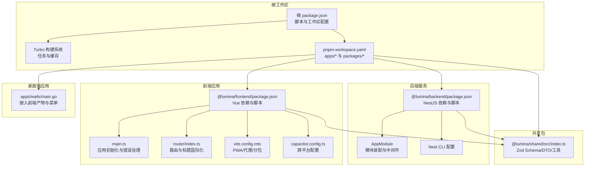
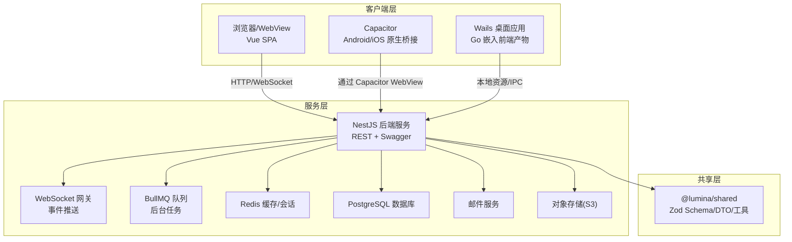
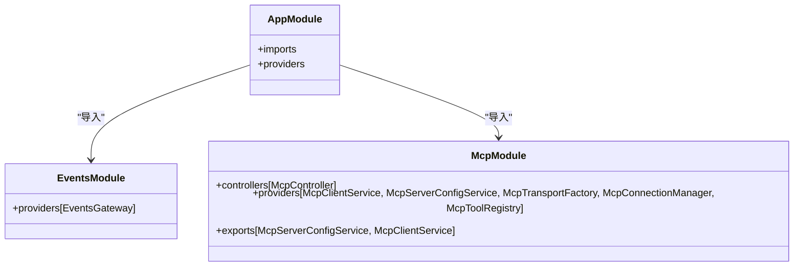
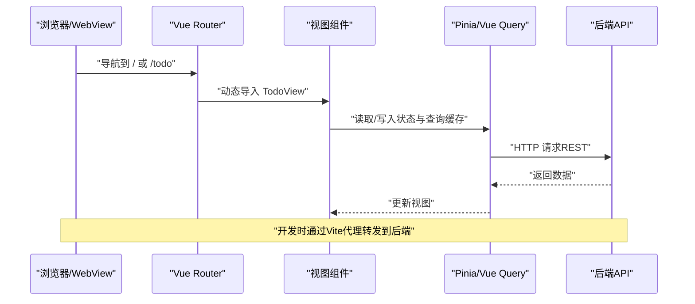
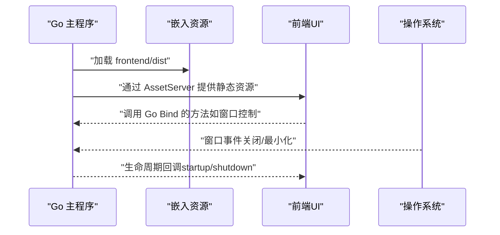
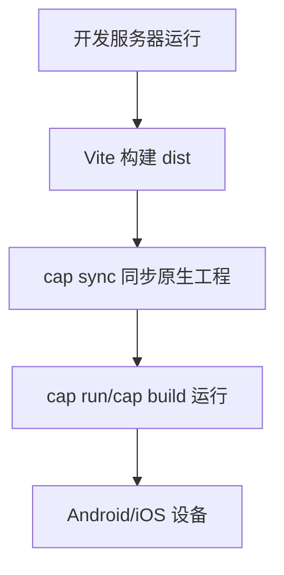
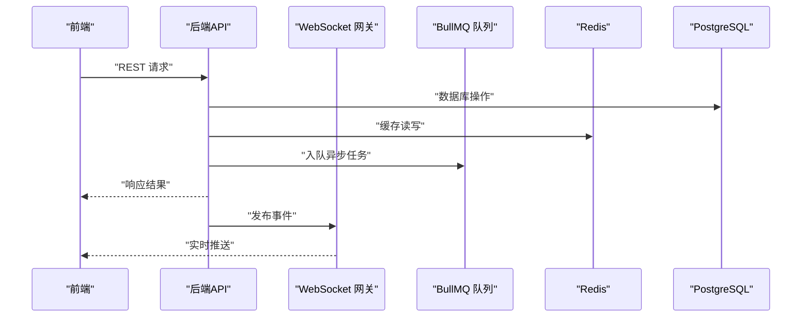
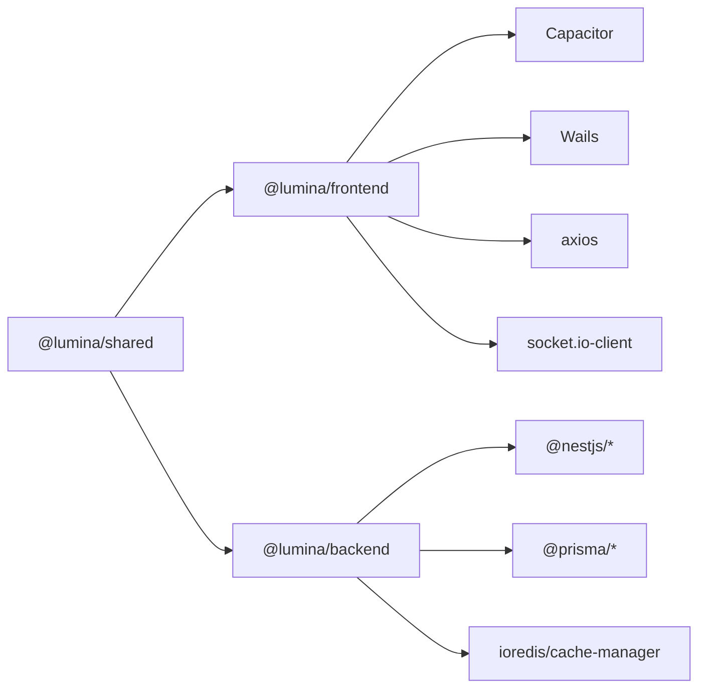

# 架构概览

<cite>
**本文引用的文件**
- [package.json](file://package.json)
- [pnpm-workspace.yaml](file://pnpm-workspace.yaml)
- [turbo.json](file://turbo.json)
- [apps/backend/package.json](file://apps/backend/package.json)
- [apps/backend/src/app.module.ts](file://apps/backend/src/app.module.ts)
- [apps/backend/nest-cli.json](file://apps/backend/nest-cli.json)
- [apps/backend/src/mcp/mcp.module.ts](file://apps/backend/src/mcp/mcp.module.ts)
- [apps/backend/src/events/events.module.ts](file://apps/backend/src/events/events.module.ts)
- [apps/frontend/package.json](file://apps/frontend/package.json)
- [apps/frontend/src/main.ts](file://apps/frontend/src/main.ts)
- [apps/frontend/src/router/index.ts](file://apps/frontend/src/router/index.ts)
- [apps/frontend/capacitor.config.ts](file://apps/frontend/capacitor.config.ts)
- [apps/frontend/vite.config.mts](file://apps/frontend/vite.config.mts)
- [apps/wails/main.go](file://apps/wails/main.go)
- [packages/shared/src/index.ts](file://packages/shared/src/index.ts)
- [docker-compose.yml](file://docker-compose.yml)
</cite>

## 目录
1. [引言](#引言)
2. [项目结构](#项目结构)
3. [核心组件](#核心组件)
4. [架构总览](#架构总览)
5. [详细组件分析](#详细组件分析)
6. [依赖分析](#依赖分析)
7. [性能考量](#性能考量)
8. [故障排查指南](#故障排查指南)
9. [结论](#结论)
10. [附录](#附录)

## 引言
本文件面向Lumina Todo项目的整体架构文档，聚焦三层架构设计：后端NestJS服务层、前端Vue单页应用、桌面端Wails应用；并系统阐述Capacitor跨平台集成方案、微前端思想在多入口中的体现、服务间通信机制（REST、WebSocket、队列、缓存）。文档同时覆盖Monorepo工作区组织结构、模块依赖关系、构建系统配置，以及技术选型决策、架构约束与设计原则，并提供系统边界定义、数据流向图、组件交互时序图、可扩展性与性能优化策略、安全架构设计等。

## 项目结构
Lumina采用Monorepo组织方式，通过pnpm工作区与Turbo构建系统实现统一管理与增量构建。根目录脚本统一调度各子包的开发、构建、测试与发布；apps目录承载三大运行体：后端(NestJS)、前端(Vue)、桌面端(Wails)，packages目录承载共享包(@lumina/shared)。

- 工作区与构建
  - 工作区定义：apps/* 与 packages/*
  - 构建系统：Turbo按任务粒度缓存与并行执行，支持全局依赖与输出目录管理
  - 根脚本：统一dev/build/lint/test/type-check等命令，支持过滤与并发控制
- 包依赖
  - 后端依赖共享包@lumina/shared，确保DTO与Schema一致性
  - 前端同样依赖@lumina/shared，实现跨平台共享校验与类型
  - 桌面端Wails通过Go嵌入前端产物，形成独立可执行应用

**图表来源**
- [package.json:1-133](file://package.json#L1-L133)
- [pnpm-workspace.yaml:1-4](file://pnpm-workspace.yaml#L1-L4)
- [turbo.json:1-186](file://turbo.json#L1-L186)
- [apps/backend/package.json:1-108](file://apps/backend/package.json#L1-L108)
- [apps/backend/src/app.module.ts:1-175](file://apps/backend/src/app.module.ts#L1-L175)
- [apps/backend/nest-cli.json:1-11](file://apps/backend/nest-cli.json#L1-L11)
- [apps/frontend/package.json:1-104](file://apps/frontend/package.json#L1-L104)
- [apps/frontend/src/main.ts:1-138](file://apps/frontend/src/main.ts#L1-L138)
- [apps/frontend/src/router/index.ts:1-73](file://apps/frontend/src/router/index.ts#L1-L73)
- [apps/frontend/vite.config.mts:1-185](file://apps/frontend/vite.config.mts#L1-L185)
- [apps/frontend/capacitor.config.ts:1-23](file://apps/frontend/capacitor.config.ts#L1-L23)
- [apps/wails/main.go:1-95](file://apps/wails/main.go#L1-L95)
- [packages/shared/src/index.ts:1-22](file://packages/shared/src/index.ts#L1-L22)

**章节来源**
- [package.json:1-133](file://package.json#L1-L133)
- [pnpm-workspace.yaml:1-4](file://pnpm-workspace.yaml#L1-L4)
- [turbo.json:1-186](file://turbo.json#L1-L186)

## 核心组件
- 后端NestJS服务层
  - 根模块AppModule集中装配配置、日志、事件、队列、速率限制、国际化、Prisma、Redis、健康检查、认证、用户、邮件、文件上传、定时任务、MCP、技能源等模块
  - Nest CLI配置指定编译器选项与资源拷贝
- 前端Vue单页应用
  - 应用初始化：Pinia、Vue Query、ECharts、国际化、全局错误处理、持久化插件
  - 路由：基于history/hash的路由切换，动态懒加载视图，路由守卫更新标题
  - 构建：Vite配置PWA、Gzip/Brotli压缩、手动分包策略、代理到后端API与WebSocket
  - 跨平台：Capacitor配置webDir与开发服务器，支持Android/iOS
- 桌面端Wails应用
  - Go主程序嵌入前端dist资源，配置菜单、窗口、透明背景、平台特性
- 共享包@lumina/shared
  - 导出Zod Schema、通用DTO、工具函数，作为全栈单一真相来源

**章节来源**
- [apps/backend/src/app.module.ts:1-175](file://apps/backend/src/app.module.ts#L1-L175)
- [apps/backend/nest-cli.json:1-11](file://apps/backend/nest-cli.json#L1-L11)
- [apps/frontend/src/main.ts:1-138](file://apps/frontend/src/main.ts#L1-L138)
- [apps/frontend/src/router/index.ts:1-73](file://apps/frontend/src/router/index.ts#L1-L73)
- [apps/frontend/vite.config.mts:1-185](file://apps/frontend/vite.config.mts#L1-L185)
- [apps/frontend/capacitor.config.ts:1-23](file://apps/frontend/capacitor.config.ts#L1-L23)
- [apps/wails/main.go:1-95](file://apps/wails/main.go#L1-L95)
- [packages/shared/src/index.ts:1-22](file://packages/shared/src/index.ts#L1-L22)

## 架构总览
Lumina采用“后端服务 + 前端单页应用 + 桌面端应用”的三层架构，辅以Capacitor实现移动端原生体验，结合Wails将Web前端打包为桌面原生应用。服务间通信包括REST API、WebSocket（事件网关）、队列（BullMQ）与缓存（Redis），并通过共享Schema保证前后端一致性。

**图表来源**
- [apps/backend/src/app.module.ts:1-175](file://apps/backend/src/app.module.ts#L1-L175)
- [apps/frontend/src/main.ts:1-138](file://apps/frontend/src/main.ts#L1-L138)
- [apps/frontend/capacitor.config.ts:1-23](file://apps/frontend/capacitor.config.ts#L1-L23)
- [apps/wails/main.go:1-95](file://apps/wails/main.go#L1-L95)
- [packages/shared/src/index.ts:1-22](file://packages/shared/src/index.ts#L1-L22)

## 详细组件分析

### 后端服务层（NestJS）
- 模块化架构
  - 配置与日志：ConfigModule + Pino日志
  - 事件与实时：EventEmitterModule、WebSocket EventsGateway
  - 队列与任务：BullMQ（Redis连接、重试与退避）
  - 安全与限流：ThrottlerModule（短/中/长窗口）
  - 国际化：nestjs-i18n + I18nTsLoader
  - 数据与缓存：PrismaModule、RedisModule
  - 功能模块：Health、Auth、Users、Mail、Upload、Todos、ScheduledTasks、Mcp、SkillSources
- 关键职责
  - 统一鉴权与会话（JWT）
  - 实时事件推送（WebSocket）
  - 异步任务编排（队列）
  - 文件上传与对象存储集成
  - MCP外部服务代理与工具注册

**图表来源**
- [apps/backend/src/app.module.ts:1-175](file://apps/backend/src/app.module.ts#L1-L175)
- [apps/backend/src/events/events.module.ts:1-15](file://apps/backend/src/events/events.module.ts#L1-L15)
- [apps/backend/src/mcp/mcp.module.ts:1-25](file://apps/backend/src/mcp/mcp.module.ts#L1-L25)

**章节来源**
- [apps/backend/src/app.module.ts:1-175](file://apps/backend/src/app.module.ts#L1-L175)
- [apps/backend/src/mcp/mcp.module.ts:1-25](file://apps/backend/src/mcp/mcp.module.ts#L1-L25)
- [apps/backend/src/events/events.module.ts:1-15](file://apps/backend/src/events/events.module.ts#L1-L15)

### 前端单页应用（Vue）
- 应用初始化
  - Pinia + 持久化插件
  - Vue Query（查询客户端与缓存策略）
  - ECharts注册必要渲染器与组件
  - 国际化与Zod i18n初始化
  - 全局错误处理（动态Chunk加载失败、ResizeObserver噪声）
- 路由与导航
  - 基于history或hash的历史模式（Wails场景）
  - 动态导入视图组件
  - 路由守卫更新页面标题
- 构建与跨平台
  - Vite配置PWA、Gzip/Brotli压缩、手动分包策略
  - 代理到后端API与WebSocket
  - Capacitor配置webDir与开发服务器

**图表来源**
- [apps/frontend/src/router/index.ts:1-73](file://apps/frontend/src/router/index.ts#L1-L73)
- [apps/frontend/src/main.ts:1-138](file://apps/frontend/src/main.ts#L1-L138)
- [apps/frontend/vite.config.mts:154-174](file://apps/frontend/vite.config.mts#L154-L174)

**章节来源**
- [apps/frontend/src/main.ts:1-138](file://apps/frontend/src/main.ts#L1-L138)
- [apps/frontend/src/router/index.ts:1-73](file://apps/frontend/src/router/index.ts#L1-L73)
- [apps/frontend/vite.config.mts:1-185](file://apps/frontend/vite.config.mts#L1-L185)

### 桌面端应用（Wails）
- 资源嵌入
  - Go通过embed将前端dist目录嵌入二进制
  - AssetServer指向嵌入资源，实现离线运行
- 菜单与窗口
  - 平台化菜单（macOS标准菜单、编辑菜单）
  - 窗口透明与半透明效果（Windows Mica、macOS隐藏标题栏）
- 生命周期
  - OnStartup/OnShutdown钩子绑定应用逻辑

**图表来源**
- [apps/wails/main.go:17-89](file://apps/wails/main.go#L17-L89)

**章节来源**
- [apps/wails/main.go:1-95](file://apps/wails/main.go#L1-L95)

### 跨平台集成（Capacitor）
- 配置要点
  - webDir指向构建产物dist
  - 开发服务器可配置为https（Android）
  - 插件：启动屏等
- 运行流程
  - 构建后通过cap sync同步原生工程
  - 使用cap run/build命令在设备或模拟器上运行

**图表来源**
- [apps/frontend/capacitor.config.ts:1-23](file://apps/frontend/capacitor.config.ts#L1-L23)
- [apps/frontend/vite.config.mts:26-28](file://apps/frontend/vite.config.mts#L26-L28)

**章节来源**
- [apps/frontend/capacitor.config.ts:1-23](file://apps/frontend/capacitor.config.ts#L1-L23)

### 服务间通信机制
- REST API
  - 前端通过Axios调用后端接口，开发时经Vite代理转发
- WebSocket
  - 事件网关提供实时通信，前端使用socket.io-client接入
- 队列与缓存
  - BullMQ负责后台任务（重试、退避、完成清理）
  - Redis提供缓存与会话存储
- 对象存储
  - S3集成文件上传与预签名URL

**图表来源**
- [apps/backend/src/app.module.ts:1-175](file://apps/backend/src/app.module.ts#L1-L175)
- [apps/frontend/vite.config.mts:157-169](file://apps/frontend/vite.config.mts#L157-L169)

**章节来源**
- [apps/backend/src/app.module.ts:1-175](file://apps/backend/src/app.module.ts#L1-L175)
- [apps/frontend/vite.config.mts:157-169](file://apps/frontend/vite.config.mts#L157-L169)

## 依赖分析
- Monorepo组织
  - 工作区apps/*与packages/*，通过workspace:*依赖共享包
- 构建与缓存
  - Turbo任务定义与输入/输出管理，支持并行与增量
- 依赖关系
  - 前端依赖@lumina/shared，后端同样依赖，确保Schema一致性
  - 前端依赖Socket.IO客户端，后端依赖Socket.IO服务端与事件发射器

**图表来源**
- [apps/frontend/package.json:30-69](file://apps/frontend/package.json#L30-L69)
- [apps/backend/package.json:30-85](file://apps/backend/package.json#L30-L85)
- [packages/shared/src/index.ts:1-22](file://packages/shared/src/index.ts#L1-L22)

**章节来源**
- [apps/frontend/package.json:1-104](file://apps/frontend/package.json#L1-L104)
- [apps/backend/package.json:1-108](file://apps/backend/package.json#L1-L108)
- [packages/shared/src/index.ts:1-22](file://packages/shared/src/index.ts#L1-L22)

## 性能考量
- 构建优化
  - Vite Gzip/Brotli压缩、手动分包策略，减少首包体积
  - 动态导入与路由懒加载，降低初始加载压力
- 缓存与网络
  - Redis缓存热点数据，BullMQ队列异步处理耗时任务
  - Vue Query缓存策略与重试，提升弱网体验
- 运行时优化
  - Nest日志按状态码分级，生产环境JSON日志，便于可观测性
  - 限流策略（短/中/长窗口）防止滥用
- 跨平台与桌面
  - Capacitor与Wails均采用嵌入式资源，减少网络请求与CDN依赖

[本节为通用指导，无需具体文件分析]

## 故障排查指南
- 前端动态Chunk加载失败
  - 通过全局错误处理器检测并自动刷新，限制刷新频率避免死循环
  - 忽略ResizeObserver相关噪声错误
- WebSocket连接问题
  - 检查代理配置与超时设置，确认后端事件网关已启用
- Docker部署健康检查
  - 后端健康端点需可达，前端Nginx需正确映射健康页
- 依赖冲突与安全审计
  - 根脚本提供安全审计与格式化检查，建议CI中开启

**章节来源**
- [apps/frontend/src/main.ts:59-113](file://apps/frontend/src/main.ts#L59-L113)
- [apps/frontend/vite.config.mts:157-174](file://apps/frontend/vite.config.mts#L157-L174)
- [docker-compose.yml:126-135](file://docker-compose.yml#L126-L135)

## 结论
Lumina Todo通过清晰的三层架构与Monorepo组织，实现了后端服务、前端单页应用与桌面端应用的统一工程化管理。借助Capacitor与Wails，项目在多平台上提供一致的用户体验；通过REST、WebSocket、队列与缓存的组合，满足实时性与可扩展性需求。共享Schema确保前后端一致性，Turbo与Vite构建体系保障开发效率与交付质量。建议在后续迭代中持续完善监控告警、灰度发布与自动化测试，进一步提升系统的稳定性与可维护性。

[本节为总结性内容，无需具体文件分析]

## 附录
- 系统边界
  - 客户端边界：浏览器/WebView、Capacitor WebView、Wails窗口
  - 服务边界：NestJS后端服务、数据库、缓存、对象存储、邮件服务
- 数据流向
  - 前端通过REST与WebSocket与后端交互，后端通过队列与缓存协同，最终落库
- 安全架构
  - JWT鉴权、速率限制、Helmet/CORS、日志分级、容器安全加固（capabilities drop、只读文件系统）

[本节为概念性内容，无需具体文件分析]