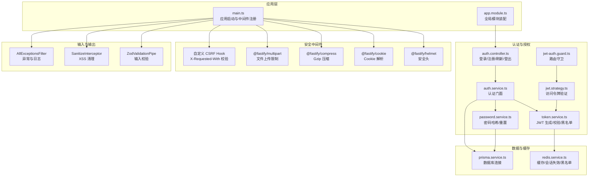
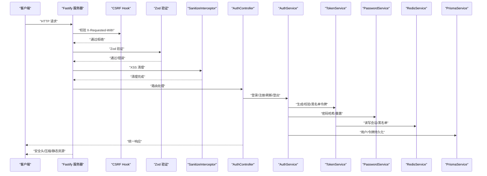
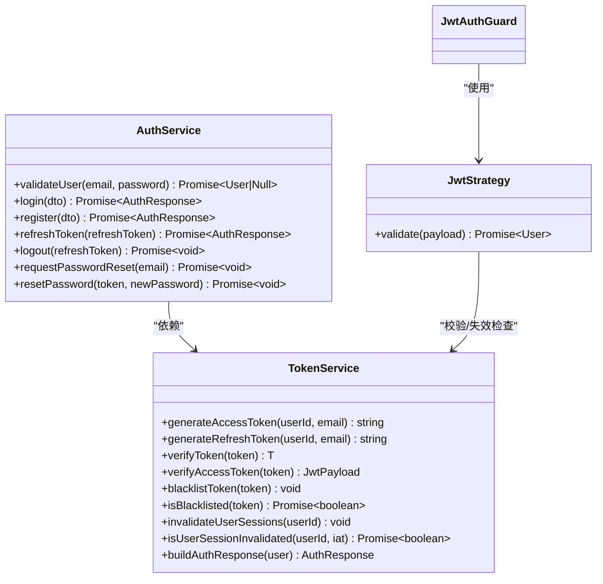
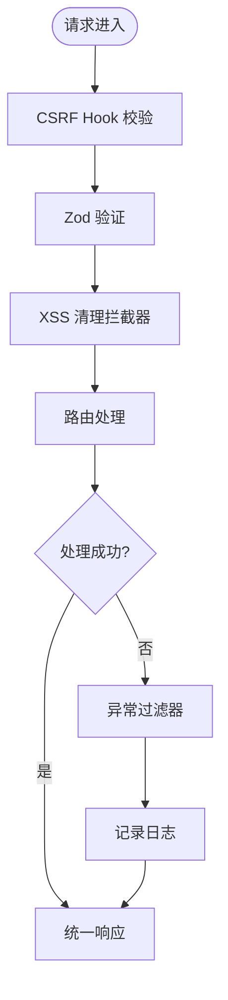
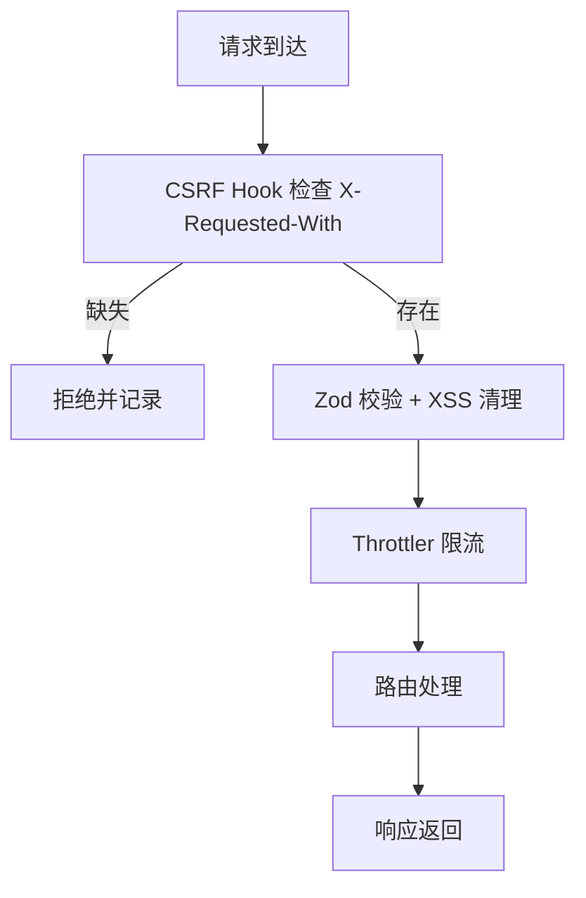
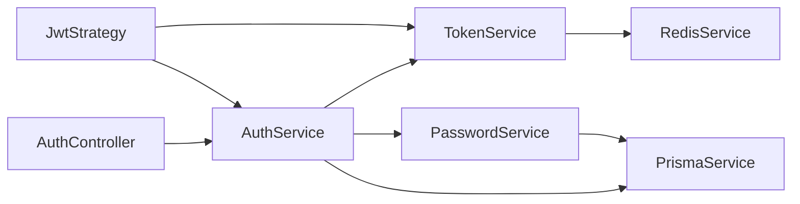

# 安全架构设计

<cite>
**本文引用的文件**
- [apps/backend/src/main.ts](file://apps/backend/src/main.ts)
- [apps/backend/src/app.module.ts](file://apps/backend/src/app.module.ts)
- [apps/backend/src/auth/auth.controller.ts](file://apps/backend/src/auth/auth.controller.ts)
- [apps/backend/src/auth/auth.service.ts](file://apps/backend/src/auth/auth.service.ts)
- [apps/backend/src/auth/token.service.ts](file://apps/backend/src/auth/token.service.ts)
- [apps/backend/src/auth/jwt.strategy.ts](file://apps/backend/src/auth/jwt.strategy.ts)
- [apps/backend/src/auth/jwt-auth.guard.ts](file://apps/backend/src/auth/jwt-auth.guard.ts)
- [apps/backend/src/auth/password.service.ts](file://apps/backend/src/auth/password.service.ts)
- [apps/backend/src/common/interceptors/sanitize.interceptor.ts](file://apps/backend/src/common/interceptors/sanitize.interceptor.ts)
- [apps/backend/src/common/filters/all-exceptions.filter.ts](file://apps/backend/src/common/filters/all-exceptions.filter.ts)
- [apps/backend/src/redis/redis.service.ts](file://apps/backend/src/redis/redis.service.ts)
- [apps/backend/src/prisma/prisma.service.ts](file://apps/backend/src/prisma/prisma.service.ts)
- [packages/shared/src/schemas/auth.schema.ts](file://packages/shared/src/schemas/auth.schema.ts)
- [scripts/security-audit.js](file://scripts/security-audit.js)
- [SECURITY.md](file://SECURITY.md)
</cite>

## 目录
1. [引言](#引言)
2. [项目结构](#项目结构)
3. [核心组件](#核心组件)
4. [架构总览](#架构总览)
5. [详细组件分析](#详细组件分析)
6. [依赖关系分析](#依赖关系分析)
7. [性能考量](#性能考量)
8. [故障排查指南](#故障排查指南)
9. [结论](#结论)
10. [附录](#附录)

## 引言
本文件面向 Lumina Todo 项目的后端系统，构建一套多层次安全防护体系的设计说明。重点覆盖认证授权、输入验证与输出编码、数据传输与存储安全、常见 Web 攻击防护（XSS、CSRF、SQL 注入）、安全审计与日志记录、API 安全设计与速率限制、以及安全漏洞评估与修复流程。目标是帮助开发者与运维人员理解并实施一致、可落地的安全实践。

## 项目结构
后端采用 NestJS + Fastify 架构，通过模块化组织认证、用户、邮件、上传、定时任务、MCP 等功能模块；全局启用 Helmet、CSRF 校验、XSS 清理、压缩、速率限制、日志与异常过滤等安全能力，并通过共享 DTO 与 Zod Schema 统一输入校验。

**图表来源**
- [apps/backend/src/main.ts:34-201](file://apps/backend/src/main.ts#L34-L201)
- [apps/backend/src/app.module.ts:27-175](file://apps/backend/src/app.module.ts#L27-L175)
- [apps/backend/src/auth/auth.controller.ts:14-82](file://apps/backend/src/auth/auth.controller.ts#L14-L82)
- [apps/backend/src/auth/auth.service.ts:12-127](file://apps/backend/src/auth/auth.service.ts#L12-L127)
- [apps/backend/src/auth/token.service.ts:15-187](file://apps/backend/src/auth/token.service.ts#L15-L187)
- [apps/backend/src/auth/jwt.strategy.ts:19-68](file://apps/backend/src/auth/jwt.strategy.ts#L19-L68)
- [apps/backend/src/auth/jwt-auth.guard.ts:8-10](file://apps/backend/src/auth/jwt-auth.guard.ts#L8-L10)
- [apps/backend/src/auth/password.service.ts:9-100](file://apps/backend/src/auth/password.service.ts#L9-L100)
- [apps/backend/src/common/interceptors/sanitize.interceptor.ts:9-64](file://apps/backend/src/common/interceptors/sanitize.interceptor.ts#L9-L64)
- [apps/backend/src/common/filters/all-exceptions.filter.ts:16-137](file://apps/backend/src/common/filters/all-exceptions.filter.ts#L16-L137)
- [apps/backend/src/redis/redis.service.ts:51-233](file://apps/backend/src/redis/redis.service.ts#L51-L233)
- [apps/backend/src/prisma/prisma.service.ts:6-34](file://apps/backend/src/prisma/prisma.service.ts#L6-L34)

**章节来源**
- [apps/backend/src/main.ts:34-201](file://apps/backend/src/main.ts#L34-L201)
- [apps/backend/src/app.module.ts:27-175](file://apps/backend/src/app.module.ts#L27-L175)

## 核心组件
- 安全中间件与全局配置：Helmet、Cookie、Gzip、Multipart、CSRF Hook、Zod 验证、XSS 清理、异常过滤、日志。
- 认证授权：JWT 访问令牌 + 刷新令牌双令牌模型，基于 Passport 的策略与守卫，Redis 黑名单与会话失效控制。
- 输入验证与输出编码：Zod Schema + SanitizeInterceptor，统一校验与清理。
- 数据与缓存：Prisma + PostgreSQL，Redis 缓存与会话管理。
- 安全审计与策略：脚本化安全审计、安全政策文档。

**章节来源**
- [apps/backend/src/main.ts:48-170](file://apps/backend/src/main.ts#L48-L170)
- [apps/backend/src/auth/auth.controller.ts:14-82](file://apps/backend/src/auth/auth.controller.ts#L14-L82)
- [apps/backend/src/auth/auth.service.ts:12-127](file://apps/backend/src/auth/auth.service.ts#L12-L127)
- [apps/backend/src/auth/token.service.ts:15-187](file://apps/backend/src/auth/token.service.ts#L15-L187)
- [apps/backend/src/auth/jwt.strategy.ts:19-68](file://apps/backend/src/auth/jwt.strategy.ts#L19-L68)
- [apps/backend/src/common/interceptors/sanitize.interceptor.ts:9-64](file://apps/backend/src/common/interceptors/sanitize.interceptor.ts#L9-L64)
- [apps/backend/src/common/filters/all-exceptions.filter.ts:16-137](file://apps/backend/src/common/filters/all-exceptions.filter.ts#L16-L137)
- [apps/backend/src/redis/redis.service.ts:51-233](file://apps/backend/src/redis/redis.service.ts#L51-L233)
- [apps/backend/src/prisma/prisma.service.ts:6-34](file://apps/backend/src/prisma/prisma.service.ts#L6-L34)
- [packages/shared/src/schemas/auth.schema.ts:1-121](file://packages/shared/src/schemas/auth.schema.ts#L1-L121)
- [scripts/security-audit.js:1-53](file://scripts/security-audit.js#L1-L53)
- [SECURITY.md:1-40](file://SECURITY.md#L1-L40)

## 架构总览
下图展示从客户端到后端服务的关键交互路径与安全控制点，包括认证、CSRF 防护、输入清理、速率限制、异常与日志等。

**图表来源**
- [apps/backend/src/main.ts:115-170](file://apps/backend/src/main.ts#L115-L170)
- [apps/backend/src/auth/auth.controller.ts:14-82](file://apps/backend/src/auth/auth.controller.ts#L14-L82)
- [apps/backend/src/auth/auth.service.ts:12-127](file://apps/backend/src/auth/auth.service.ts#L12-L127)
- [apps/backend/src/auth/token.service.ts:15-187](file://apps/backend/src/auth/token.service.ts#L15-L187)
- [apps/backend/src/auth/password.service.ts:9-100](file://apps/backend/src/auth/password.service.ts#L9-L100)
- [apps/backend/src/redis/redis.service.ts:51-233](file://apps/backend/src/redis/redis.service.ts#L51-L233)
- [apps/backend/src/prisma/prisma.service.ts:6-34](file://apps/backend/src/prisma/prisma.service.ts#L6-L34)

## 详细组件分析

### 认证授权机制（JWT 双令牌模型）
- 双令牌设计：短期访问令牌（Access Token）与长期刷新令牌（Refresh Token）。访问令牌由独立密钥签名，刷新令牌在生产环境需单独密钥，降低泄露风险。
- 令牌生命周期：访问令牌短期有效，刷新令牌较长；刷新时对令牌类型与签发时间进行严格校验，并结合 Redis 会话失效标记。
- 令牌黑名单：登出与刷新失败场景将令牌加入黑名单，按剩余有效期 TTL 存储，确保已注销令牌无法复用。
- 路由保护：JwtAuthGuard 结合 JwtStrategy，仅允许携带有效访问令牌的请求通过；策略中校验令牌类型、用户 ID 类型与会话有效性。
- 会话失效：通过 Redis 记录用户最近失效时间戳，若令牌签发时间早于该时间戳则视为无效。

**图表来源**
- [apps/backend/src/auth/token.service.ts:15-187](file://apps/backend/src/auth/token.service.ts#L15-L187)
- [apps/backend/src/auth/jwt.strategy.ts:19-68](file://apps/backend/src/auth/jwt.strategy.ts#L19-L68)
- [apps/backend/src/auth/jwt-auth.guard.ts:8-10](file://apps/backend/src/auth/jwt-auth.guard.ts#L8-L10)
- [apps/backend/src/auth/auth.service.ts:12-127](file://apps/backend/src/auth/auth.service.ts#L12-L127)

**章节来源**
- [apps/backend/src/auth/auth.controller.ts:14-82](file://apps/backend/src/auth/auth.controller.ts#L14-L82)
- [apps/backend/src/auth/auth.service.ts:12-127](file://apps/backend/src/auth/auth.service.ts#L12-L127)
- [apps/backend/src/auth/token.service.ts:15-187](file://apps/backend/src/auth/token.service.ts#L15-L187)
- [apps/backend/src/auth/jwt.strategy.ts:19-68](file://apps/backend/src/auth/jwt.strategy.ts#L19-L68)
- [apps/backend/src/auth/jwt-auth.guard.ts:8-10](file://apps/backend/src/auth/jwt-auth.guard.ts#L8-L10)

### 输入验证与输出编码
- 输入验证：全局 ZodValidationPipe 对请求体、查询与路径参数进行强类型校验，结合共享 Schema（如邮箱、密码、登录/注册等）保证前后端一致的约束。
- 输出编码与清理：SanitizeInterceptor 对请求体、查询与路径参数中的字符串值进行递归清理，禁用所有 HTML 标签，防止 XSS；同时配合 Helmet 设置 CSP 等安全头。
- 错误处理：AllExceptionsFilter 统一捕获异常，记录日志，返回结构化错误响应，避免敏感堆栈信息泄露。

**图表来源**
- [apps/backend/src/main.ts:115-170](file://apps/backend/src/main.ts#L115-L170)
- [apps/backend/src/common/interceptors/sanitize.interceptor.ts:9-64](file://apps/backend/src/common/interceptors/sanitize.interceptor.ts#L9-L64)
- [apps/backend/src/common/filters/all-exceptions.filter.ts:16-137](file://apps/backend/src/common/filters/all-exceptions.filter.ts#L16-L137)

**章节来源**
- [apps/backend/src/main.ts:159-170](file://apps/backend/src/main.ts#L159-L170)
- [apps/backend/src/common/interceptors/sanitize.interceptor.ts:9-64](file://apps/backend/src/common/interceptors/sanitize.interceptor.ts#L9-L64)
- [apps/backend/src/common/filters/all-exceptions.filter.ts:16-137](file://apps/backend/src/common/filters/all-exceptions.filter.ts#L16-L137)
- [packages/shared/src/schemas/auth.schema.ts:1-121](file://packages/shared/src/schemas/auth.schema.ts#L1-L121)

### 数据传输加密与存储安全
- 传输加密：生产环境通过 HTTPS（由反向代理或平台提供）保障传输链路安全；后端通过 Helmet 设置安全头，增强浏览器侧防护。
- 存储安全：数据库连接通过环境变量注入；密码使用 bcrypt 哈希存储；敏感配置（如 JWT 密钥）通过环境变量管理，避免硬编码。
- 缓存与会话：Redis 用于令牌黑名单、会话失效标记与速率限制等，键带命名空间，便于隔离与维护。

**章节来源**
- [apps/backend/src/main.ts:84-98](file://apps/backend/src/main.ts#L84-L98)
- [apps/backend/src/auth/password.service.ts:24-34](file://apps/backend/src/auth/password.service.ts#L24-L34)
- [apps/backend/src/prisma/prisma.service.ts:10-21](file://apps/backend/src/prisma/prisma.service.ts#L10-L21)
- [apps/backend/src/redis/redis.service.ts:8-15](file://apps/backend/src/redis/redis.service.ts#L8-L15)

### 常见攻击防护
- XSS：SanitizeInterceptor 禁用 HTML 标签；Helmet 设置 CSP，限制脚本与图片来源。
- CSRF：自定义 onRequest Hook 强制要求 X-Requested-With 头，拦截非浏览器来源的潜在 CSRF 请求。
- SQL 注入：使用 Prisma ORM，参数化查询，避免原生 SQL 拼接；Zod Schema 与后端校验共同减少异常输入。
- 速率限制：全局 ThrottlerGuard 配置多级节流窗口，结合控制器上的 @Throttle 覆盖高风险端点（如登录/注册）。

**图表来源**
- [apps/backend/src/main.ts:123-157](file://apps/backend/src/main.ts#L123-L157)
- [apps/backend/src/app.module.ts:117-138](file://apps/backend/src/app.module.ts#L117-L138)
- [apps/backend/src/auth/auth.controller.ts:22-48](file://apps/backend/src/auth/auth.controller.ts#L22-L48)

**章节来源**
- [apps/backend/src/main.ts:84-105](file://apps/backend/src/main.ts#L84-L105)
- [apps/backend/src/app.module.ts:117-138](file://apps/backend/src/app.module.ts#L117-L138)
- [apps/backend/src/auth/auth.controller.ts:22-48](file://apps/backend/src/auth/auth.controller.ts#L22-L48)

### API 安全设计与速率限制
- 统一响应与错误：AllExceptionsFilter 返回统一结构，包含状态码、时间戳与结构化错误对象，便于前端与监控系统处理。
- 速率限制：全局短/中/长窗口组合，登录/注册等高风险端点额外限流；控制器级 @Throttle 可覆盖默认策略。
- 认证与授权：受保护路由均需携带有效访问令牌；刷新令牌仅允许特定类型且需通过会话失效检查。

**章节来源**
- [apps/backend/src/common/filters/all-exceptions.filter.ts:127-135](file://apps/backend/src/common/filters/all-exceptions.filter.ts#L127-L135)
- [apps/backend/src/app.module.ts:117-138](file://apps/backend/src/app.module.ts#L117-L138)
- [apps/backend/src/auth/auth.controller.ts:22-79](file://apps/backend/src/auth/auth.controller.ts#L22-L79)

### 安全审计与日志记录
- 安全审计：脚本化 pnpm audit，支持忽略列表与严重级别过滤，CI 中可作为安全门禁。
- 日志策略：Pino 作为全局日志器，区分不同状态码的日志级别；请求序列化包含方法、URL、参数与状态码；异常过滤器记录堆栈与上下文。
- 安全策略：安全政策文档明确漏洞上报渠道、适用范围与最佳实践，指导用户与贡献者正确报告问题。

**章节来源**
- [scripts/security-audit.js:1-53](file://scripts/security-audit.js#L1-53)
- [apps/backend/src/app.module.ts:34-88](file://apps/backend/src/app.module.ts#L34-L88)
- [apps/backend/src/common/filters/all-exceptions.filter.ts:37-45](file://apps/backend/src/common/filters/all-exceptions.filter.ts#L37-L45)
- [SECURITY.md:12-40](file://SECURITY.md#L12-L40)

## 依赖关系分析
- 组件耦合：AuthController 依赖 AuthService；AuthService 依赖 TokenService 与 PasswordService；JwtStrategy 依赖 TokenService 与 AuthService；TokenService 依赖 RedisService 与 ConfigService；PasswordService 依赖 UsersService、MailService 与 TokenService；PrismaService 提供数据库访问。
- 外部依赖：Fastify 插件（Helmet、Cookie、Compress、Multipart、Static）、BullMQ（队列）、NestJS 模块（Config、Throttler、I18n、Logger）。

**图表来源**
- [apps/backend/src/auth/auth.controller.ts:14-82](file://apps/backend/src/auth/auth.controller.ts#L14-L82)
- [apps/backend/src/auth/auth.service.ts:12-127](file://apps/backend/src/auth/auth.service.ts#L12-L127)
- [apps/backend/src/auth/token.service.ts:15-187](file://apps/backend/src/auth/token.service.ts#L15-L187)
- [apps/backend/src/auth/jwt.strategy.ts:19-68](file://apps/backend/src/auth/jwt.strategy.ts#L19-L68)
- [apps/backend/src/auth/password.service.ts:9-100](file://apps/backend/src/auth/password.service.ts#L9-L100)
- [apps/backend/src/redis/redis.service.ts:51-233](file://apps/backend/src/redis/redis.service.ts#L51-L233)
- [apps/backend/src/prisma/prisma.service.ts:6-34](file://apps/backend/src/prisma/prisma.service.ts#L6-L34)

**章节来源**
- [apps/backend/src/auth/auth.controller.ts:14-82](file://apps/backend/src/auth/auth.controller.ts#L14-L82)
- [apps/backend/src/auth/auth.service.ts:12-127](file://apps/backend/src/auth/auth.service.ts#L12-L127)
- [apps/backend/src/auth/token.service.ts:15-187](file://apps/backend/src/auth/token.service.ts#L15-L187)
- [apps/backend/src/auth/jwt.strategy.ts:19-68](file://apps/backend/src/auth/jwt.strategy.ts#L19-L68)
- [apps/backend/src/auth/password.service.ts:9-100](file://apps/backend/src/auth/password.service.ts#L9-L100)
- [apps/backend/src/redis/redis.service.ts:51-233](file://apps/backend/src/redis/redis.service.ts#L51-L233)
- [apps/backend/src/prisma/prisma.service.ts:6-34](file://apps/backend/src/prisma/prisma.service.ts#L6-L34)

## 性能考量
- 传输优化：Gzip 压缩阈值与 zlib 级别配置，平衡 CPU 与带宽。
- 缓存策略：Redis 命名空间与 TTL 管理，避免缓存穿透与雪崩；会话失效与黑名单使用短 TTL，降低内存占用。
- 速率限制：多窗口组合与控制器级覆盖，兼顾安全与用户体验。
- 数据库：Prisma 适配器连接池配置，注意并发与超时设置。

[本节为通用建议，不直接分析具体文件]

## 故障排查指南
- 认证失败：检查 JWT 密钥配置、令牌类型与过期时间、会话失效标记与黑名单状态。
- CSRF 拦截：确认客户端是否携带 X-Requested-With 头，或是否通过浏览器以外来源发起请求。
- 输入校验失败：核对 Zod Schema 与请求载荷字段，查看异常过滤器返回的结构化错误对象定位问题。
- 日志定位：利用 Pino 日志器输出的请求序列化与异常堆栈快速定位问题。

**章节来源**
- [apps/backend/src/auth/token.service.ts:103-125](file://apps/backend/src/auth/token.service.ts#L103-L125)
- [apps/backend/src/main.ts:142-156](file://apps/backend/src/main.ts#L142-L156)
- [apps/backend/src/common/filters/all-exceptions.filter.ts:127-135](file://apps/backend/src/common/filters/all-exceptions.filter.ts#L127-L135)

## 结论
Lumina Todo 后端通过“传输加密 + 双令牌认证 + 输入校验 + 输出清理 + CSRF 与速率限制 + 安全审计”的综合体系，构建了可落地、可扩展的安全基线。建议持续完善密钥轮换、审计与告警联动、渗透测试与代码扫描，以应对不断演进的威胁环境。

## 附录
- 安全策略与漏洞上报：参见安全政策文档，明确适用范围与报告流程。
- 安全审计脚本：在 CI 中集成 pnpm audit，结合忽略列表与严重级别过滤，形成自动化安全门禁。

**章节来源**
- [SECURITY.md:12-40](file://SECURITY.md#L12-L40)
- [scripts/security-audit.js:1-53](file://scripts/security-audit.js#L1-53)