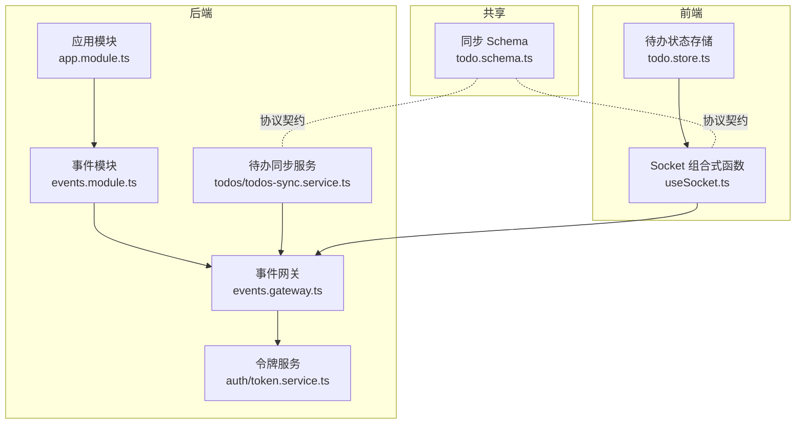
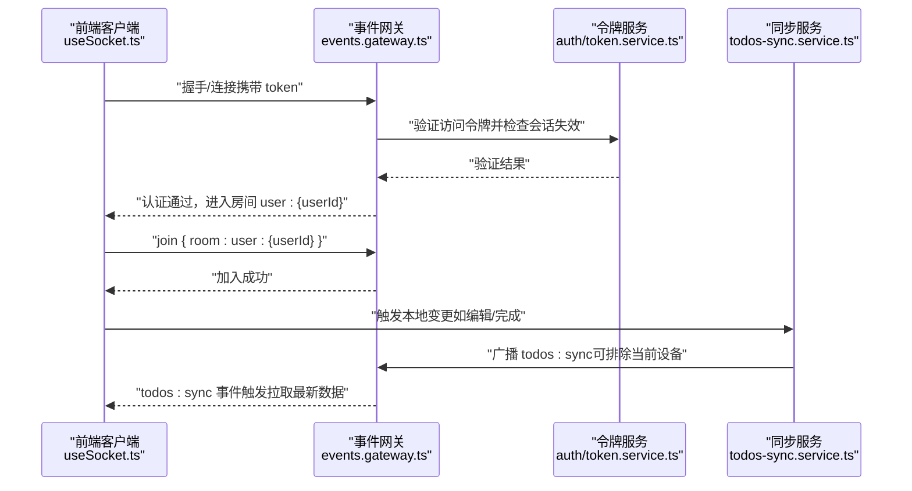
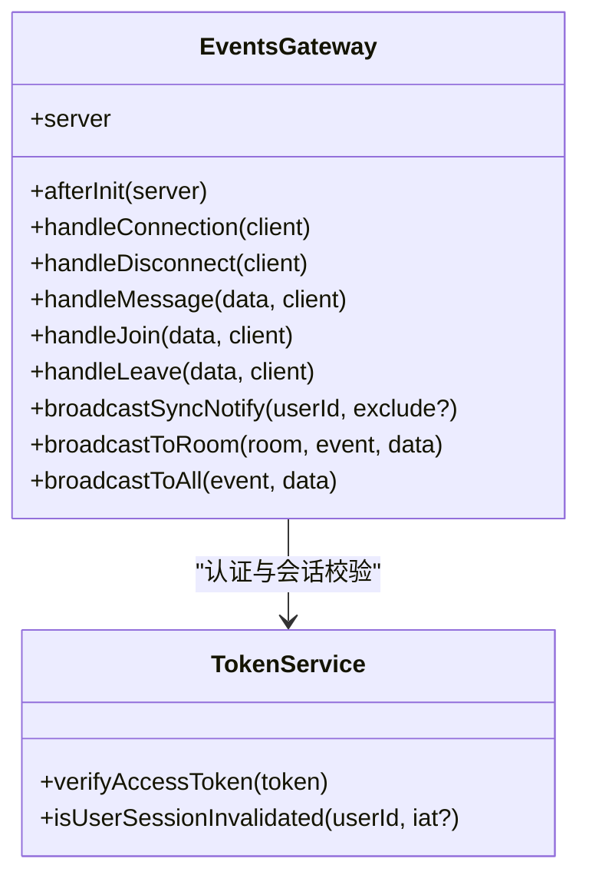
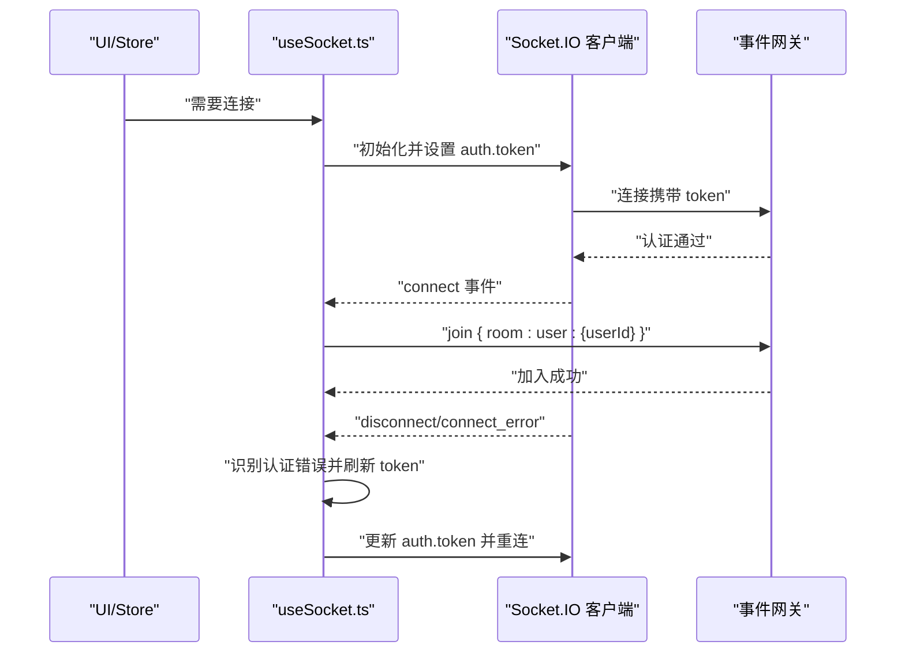
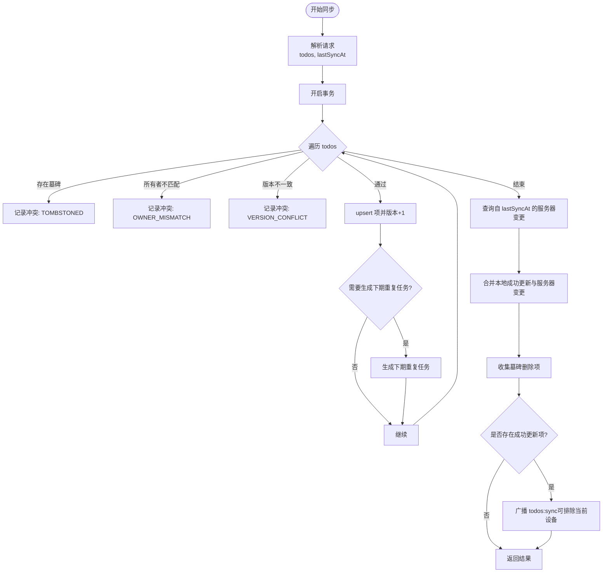
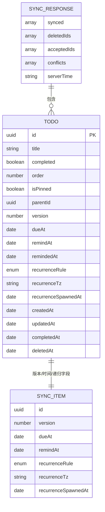
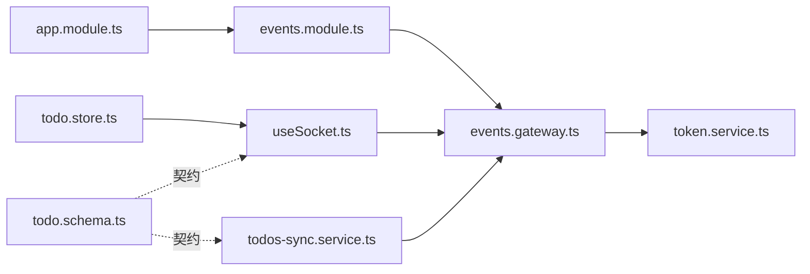

# 实时通信架构

<cite>
**本文引用的文件**
- [apps/backend/src/events/events.gateway.ts](file://apps/backend/src/events/events.gateway.ts)
- [apps/backend/src/events/events.module.ts](file://apps/backend/src/events/events.module.ts)
- [apps/backend/src/app.module.ts](file://apps/backend/src/app.module.ts)
- [apps/backend/src/auth/token.service.ts](file://apps/backend/src/auth/token.service.ts)
- [apps/backend/src/todos/todos-sync.service.ts](file://apps/backend/src/todos/todos-sync.service.ts)
- [apps/frontend/src/composables/useSocket.ts](file://apps/frontend/src/composables/useSocket.ts)
- [apps/frontend/src/features/todo/stores/todo.store.ts](file://apps/frontend/src/features/todo/stores/todo.store.ts)
- [packages/shared/src/schemas/todo.schema.ts](file://packages/shared/src/schemas/todo.schema.ts)
</cite>

## 目录
1. [引言](#引言)
2. [项目结构](#项目结构)
3. [核心组件](#核心组件)
4. [架构总览](#架构总览)
5. [详细组件分析](#详细组件分析)
6. [依赖关系分析](#依赖关系分析)
7. [性能考量](#性能考量)
8. [故障排查指南](#故障排查指南)
9. [结论](#结论)
10. [附录](#附录)

## 引言
本文件面向 Lumina Todo 项目的实时通信架构，围绕基于 WebSocket 的 Socket.IO 集成与配置展开，系统性说明事件网关的实现原理、消息路由机制、客户端连接管理与断线重连策略、实时数据同步的冲突解决与一致性保障、通信协议与消息格式规范，并给出性能优化与扩展性建议，以及安全与可靠性保障措施。

## 项目结构
实时通信相关代码主要分布在后端的事件网关模块与前端的 Socket 组合式函数中，同时通过共享包中的 Schema 规范统一前后端消息契约。整体采用“后端网关 + 前端连接管理 + 业务服务协同”的分层设计。

**图示来源**
- [apps/backend/src/events/events.gateway.ts:1-266](file://apps/backend/src/events/events.gateway.ts#L1-L266)
- [apps/backend/src/events/events.module.ts:1-15](file://apps/backend/src/events/events.module.ts#L1-L15)
- [apps/backend/src/app.module.ts:1-175](file://apps/backend/src/app.module.ts#L1-L175)
- [apps/backend/src/auth/token.service.ts:1-187](file://apps/backend/src/auth/token.service.ts#L1-L187)
- [apps/backend/src/todos/todos-sync.service.ts:1-221](file://apps/backend/src/todos/todos-sync.service.ts#L1-L221)
- [apps/frontend/src/composables/useSocket.ts:1-176](file://apps/frontend/src/composables/useSocket.ts#L1-L176)
- [apps/frontend/src/features/todo/stores/todo.store.ts:1-335](file://apps/frontend/src/features/todo/stores/todo.store.ts#L1-L335)
- [packages/shared/src/schemas/todo.schema.ts:1-75](file://packages/shared/src/schemas/todo.schema.ts#L1-L75)

**章节来源**
- [apps/backend/src/events/events.gateway.ts:1-266](file://apps/backend/src/events/events.gateway.ts#L1-L266)
- [apps/backend/src/events/events.module.ts:1-15](file://apps/backend/src/events/events.module.ts#L1-L15)
- [apps/backend/src/app.module.ts:1-175](file://apps/backend/src/app.module.ts#L1-L175)
- [apps/frontend/src/composables/useSocket.ts:1-176](file://apps/frontend/src/composables/useSocket.ts#L1-L176)
- [apps/frontend/src/features/todo/stores/todo.store.ts:1-335](file://apps/frontend/src/features/todo/stores/todo.store.ts#L1-L335)
- [packages/shared/src/schemas/todo.schema.ts:1-75](file://packages/shared/src/schemas/todo.schema.ts#L1-L75)

## 核心组件
- 事件网关（Socket.IO）：负责 WebSocket 连接、CORS 与认证中间件、房间管理、事件订阅与广播。
- Socket 客户端组合式函数：封装连接、断线重连、认证参数注入、房间加入、事件监听与超时等待。
- 待办同步服务：实现增量同步、冲突检测与合并、递归任务状态解析、向网关发起同步通知。
- 令牌服务：JWT 验证与失效控制，结合 Redis 保障会话失效即时生效。
- 共享 Schema：统一 Todo 结构、同步请求/响应与冲突类型，确保前后端契约一致。

**章节来源**
- [apps/backend/src/events/events.gateway.ts:1-266](file://apps/backend/src/events/events.gateway.ts#L1-L266)
- [apps/frontend/src/composables/useSocket.ts:1-176](file://apps/frontend/src/composables/useSocket.ts#L1-L176)
- [apps/backend/src/todos/todos-sync.service.ts:1-221](file://apps/backend/src/todos/todos-sync.service.ts#L1-L221)
- [apps/backend/src/auth/token.service.ts:1-187](file://apps/backend/src/auth/token.service.ts#L1-L187)
- [packages/shared/src/schemas/todo.schema.ts:1-75](file://packages/shared/src/schemas/todo.schema.ts#L1-L75)

## 架构总览
系统采用“单网关多房间”模型，每个用户拥有独立私有房间（user:{userId}）。后端通过认证中间件与房间权限校验，确保消息仅投递给授权用户；前端在连接建立后自动加入自身房间，并在登录态变化时动态连接/断开。

**图示来源**
- [apps/backend/src/events/events.gateway.ts:86-145](file://apps/backend/src/events/events.gateway.ts#L86-L145)
- [apps/backend/src/auth/token.service.ts:55-76](file://apps/backend/src/auth/token.service.ts#L55-L76)
- [apps/backend/src/todos/todos-sync.service.ts:207-210](file://apps/backend/src/todos/todos-sync.service.ts#L207-L210)
- [apps/frontend/src/composables/useSocket.ts:46-58](file://apps/frontend/src/composables/useSocket.ts#L46-L58)

## 详细组件分析

### 事件网关（Socket.IO）实现
- 网关配置
  - 命名空间：/events
  - 传输方式：轮询与 WebSocket（优先 WebSocket）
  - CORS：支持多源白名单、开发调试源、凭证传递
- 认证中间件
  - 从握手参数或头部提取 token，验证访问令牌有效性与会话未失效
  - 将用户载荷写入 socket.data，供后续路由使用
- 房间与权限
  - 自动加入 user:{userId} 私有房间
  - 所有房间操作均校验房间名与用户身份一致性
- 事件订阅
  - message：支持指定房间广播或全站广播
  - join/leave：加入/离开房间并广播成员变更
  - 广播防抖：针对 todos:sync 事件，按用户维度 500ms 防抖，避免风暴
- 广播接口
  - 对外暴露 broadcastToRoom/broadcastToAll，供其他服务调用

**图示来源**
- [apps/backend/src/events/events.gateway.ts:1-266](file://apps/backend/src/events/events.gateway.ts#L1-L266)
- [apps/backend/src/auth/token.service.ts:1-187](file://apps/backend/src/auth/token.service.ts#L1-L187)

**章节来源**
- [apps/backend/src/events/events.gateway.ts:20-56](file://apps/backend/src/events/events.gateway.ts#L20-L56)
- [apps/backend/src/events/events.gateway.ts:86-145](file://apps/backend/src/events/events.gateway.ts#L86-L145)
- [apps/backend/src/events/events.gateway.ts:150-202](file://apps/backend/src/events/events.gateway.ts#L150-L202)
- [apps/backend/src/events/events.gateway.ts:207-264](file://apps/backend/src/events/events.gateway.ts#L207-L264)

### 客户端连接管理与断线重连
- 连接初始化
  - 使用 io 创建 Socket 实例，设置命名空间与路径、凭证、传输优先级
  - 默认不自动连接，由 useSocket 控制
- 认证与房间
  - 连接成功后注入 auth.token，并自动加入 user:{userId} 房间
- 断线重连
  - 指数退避重连，最大重连间隔与随机抖动
  - connect_error 事件中识别认证类错误并触发 token 刷新与重连
- 连接等待
  - waitForConnection 提供超时等待，避免阻塞 UI 初始化

**图示来源**
- [apps/frontend/src/composables/useSocket.ts:25-96](file://apps/frontend/src/composables/useSocket.ts#L25-L96)
- [apps/frontend/src/composables/useSocket.ts:98-146](file://apps/frontend/src/composables/useSocket.ts#L98-L146)

**章节来源**
- [apps/frontend/src/composables/useSocket.ts:25-96](file://apps/frontend/src/composables/useSocket.ts#L25-L96)
- [apps/frontend/src/composables/useSocket.ts:98-146](file://apps/frontend/src/composables/useSocket.ts#L98-L146)

### 实时数据同步与冲突解决
- 同步流程
  - 增量合并：事务内逐条处理客户端推送变更，执行 upsert 并维护版本号
  - 冲突检测：严格按版本号比对，不接受版本不一致的变更
  - 服务器变更拉取：基于 lastSyncAt 查询自上次同步以来的变更
  - 递归任务：根据规则与时区计算衍生项，必要时生成下一次重复任务
  - 通知广播：当存在成功更新项时，向用户房间广播 todos:sync（可排除当前设备）
- 冲突类型
  - 被软删除（墓碑）：目标项已被标记删除
  - 所有者不匹配：非本人数据
  - 版本冲突：客户端与服务端版本不一致
- 一致性保障
  - 事务保证：单次同步内的变更原子性
  - 版本号递增：每次成功 upsert 后版本+1
  - 防抖广播：避免高频变更导致的风暴

**图示来源**
- [apps/backend/src/todos/todos-sync.service.ts:51-219](file://apps/backend/src/todos/todos-sync.service.ts#L51-L219)

**章节来源**
- [apps/backend/src/todos/todos-sync.service.ts:48-219](file://apps/backend/src/todos/todos-sync.service.ts#L48-L219)

### 通信协议与消息格式规范
- 通用事件
  - message：发送文本消息，支持指定房间或全站广播
  - join/leave：加入/离开房间
  - user:joined/user:left：房间成员变更通知
  - todos:sync：同步通知（无负载，接收方拉取增量）
- 同步请求/响应（共享 Schema）
  - 请求：todos 数组（含版本号等）、lastSyncAt
  - 响应：synced（合并后的 Todo 列表）、deletedIds、acceptedIds、conflicts、serverTime
- 冲突类型
  - TOMBSTONED、OWNER_MISMATCH、VERSION_CONFLICT

**图示来源**
- [packages/shared/src/schemas/todo.schema.ts:8-75](file://packages/shared/src/schemas/todo.schema.ts#L8-L75)

**章节来源**
- [apps/backend/src/events/events.gateway.ts:150-175](file://apps/backend/src/events/events.gateway.ts#L150-L175)
- [apps/backend/src/events/events.gateway.ts:207-250](file://apps/backend/src/events/events.gateway.ts#L207-L250)
- [apps/backend/src/todos/todos-sync.service.ts:207-219](file://apps/backend/src/todos/todos-sync.service.ts#L207-L219)
- [packages/shared/src/schemas/todo.schema.ts:32-75](file://packages/shared/src/schemas/todo.schema.ts#L32-L75)

### 客户端状态同步策略
- 登录态联动
  - useSocket 监听认证状态变化，自动连接/断开
  - todo.store 在登录时切换到远程源并触发合并
- 本地预览与冲突处理
  - 提供“拟议变更集”机制，允许用户在冲突前预览与撤销
  - 支持接受/重试/清除冲突，保证用户体验与数据安全
- 通知与拉取
  - 接收 todos:sync 事件后，触发拉取最新数据，避免竞态

**章节来源**
- [apps/frontend/src/composables/useSocket.ts:149-165](file://apps/frontend/src/composables/useSocket.ts#L149-L165)
- [apps/frontend/src/features/todo/stores/todo.store.ts:205-238](file://apps/frontend/src/features/todo/stores/todo.store.ts#L205-L238)
- [apps/frontend/src/features/todo/stores/todo.store.ts:162-184](file://apps/frontend/src/features/todo/stores/todo.store.ts#L162-L184)

## 依赖关系分析
- 事件网关依赖认证模块提供的 JWT 验证与会话失效检查
- 待办同步服务依赖事件网关进行广播通知
- 前端 Socket 组合式函数依赖认证状态与后端网关
- 共享 Schema 为前后端契约，贯穿同步流程

**图示来源**
- [apps/backend/src/app.module.ts:1-175](file://apps/backend/src/app.module.ts#L1-L175)
- [apps/backend/src/events/events.module.ts:1-15](file://apps/backend/src/events/events.module.ts#L1-L15)
- [apps/backend/src/events/events.gateway.ts:1-266](file://apps/backend/src/events/events.gateway.ts#L1-L266)
- [apps/backend/src/auth/token.service.ts:1-187](file://apps/backend/src/auth/token.service.ts#L1-L187)
- [apps/backend/src/todos/todos-sync.service.ts:1-221](file://apps/backend/src/todos/todos-sync.service.ts#L1-L221)
- [apps/frontend/src/composables/useSocket.ts:1-176](file://apps/frontend/src/composables/useSocket.ts#L1-L176)
- [apps/frontend/src/features/todo/stores/todo.store.ts:1-335](file://apps/frontend/src/features/todo/stores/todo.store.ts#L1-L335)
- [packages/shared/src/schemas/todo.schema.ts:1-75](file://packages/shared/src/schemas/todo.schema.ts#L1-L75)

**章节来源**
- [apps/backend/src/app.module.ts:1-175](file://apps/backend/src/app.module.ts#L1-L175)
- [apps/backend/src/events/events.module.ts:1-15](file://apps/backend/src/events/events.module.ts#L1-L15)
- [apps/backend/src/events/events.gateway.ts:1-266](file://apps/backend/src/events/events.gateway.ts#L1-L266)
- [apps/backend/src/auth/token.service.ts:1-187](file://apps/backend/src/auth/token.service.ts#L1-L187)
- [apps/backend/src/todos/todos-sync.service.ts:1-221](file://apps/backend/src/todos/todos-sync.service.ts#L1-L221)
- [apps/frontend/src/composables/useSocket.ts:1-176](file://apps/frontend/src/composables/useSocket.ts#L1-L176)
- [apps/frontend/src/features/todo/stores/todo.store.ts:1-335](file://apps/frontend/src/features/todo/stores/todo.store.ts#L1-L335)
- [packages/shared/src/schemas/todo.schema.ts:1-75](file://packages/shared/src/schemas/todo.schema.ts#L1-L75)

## 性能考量
- 传输优化
  - 优先 WebSocket，降低轮询带来的额外开销与 400 错误概率
  - 合理设置重连参数，避免频繁重连造成压力
- 广播防抖
  - 用户维度 500ms 防抖，减少高频变更引发的风暴
- 事务与批量
  - 同步过程使用事务，减少锁竞争与回滚成本
- 选择性拉取
  - 基于 lastSyncAt 拉取增量，避免全量同步
- 会话失效快速生效
  - 通过 Redis 记录失效时间戳，验证阶段直接拒绝旧令牌

[本节为通用性能建议，无需具体文件引用]

## 故障排查指南
- 认证失败
  - 检查 CORS 配置与凭证传递
  - 确认 token 是否过期或被加入黑名单
  - 核对会话失效时间戳是否晚于 token 签发时间
- 连接异常
  - 关注 connect_error 事件，区分网络抖动与认证错误
  - 若为认证错误，确认 token 刷新流程是否成功并重新注入
- 房间权限
  - 确保房间名为 user:{userId} 且与当前用户一致
  - 检查 join/leave 流程是否正确广播成员变更
- 同步冲突
  - 版本冲突：提示用户重试或接受服务端版本
  - 墓碑冲突：目标项已被删除，需从本地清理
  - 所有者冲突：跨用户数据，需检查权限与房间归属

**章节来源**
- [apps/backend/src/events/events.gateway.ts:20-56](file://apps/backend/src/events/events.gateway.ts#L20-L56)
- [apps/backend/src/events/events.gateway.ts:86-116](file://apps/backend/src/events/events.gateway.ts#L86-L116)
- [apps/backend/src/auth/token.service.ts:55-76](file://apps/backend/src/auth/token.service.ts#L55-L76)
- [apps/frontend/src/composables/useSocket.ts:60-93](file://apps/frontend/src/composables/useSocket.ts#L60-L93)
- [apps/backend/src/todos/todos-sync.service.ts:112-122](file://apps/backend/src/todos/todos-sync.service.ts#L112-L122)

## 结论
本架构以 Socket.IO 为核心，结合严格的认证与房间权限控制、事务化的增量同步与冲突检测、以及广播防抖与指数退避重连策略，实现了高可用、低耦合、可扩展的实时通信体系。通过共享 Schema 统一契约，前后端协作清晰，具备良好的可维护性与扩展性。

[本节为总结性内容，无需具体文件引用]

## 附录
- 安全与可靠性
  - CORS 白名单与凭证控制，避免跨域滥用
  - JWT 访问令牌与会话失效机制，结合 Redis 快速生效
  - 事件广播范围限定在用户房间，避免越权
  - 重连策略与错误分类，提升鲁棒性
- 扩展性建议
  - 引入集群与粘性会话或共享状态，支撑水平扩展
  - 对热点用户房间增加本地缓存与批量推送
  - 引入消息去重与幂等处理，进一步增强一致性

[本节为通用建议，无需具体文件引用]