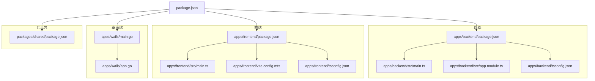
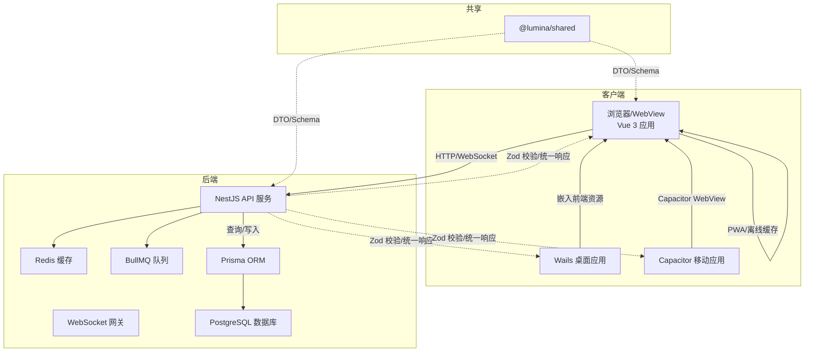
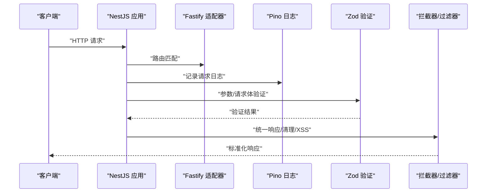
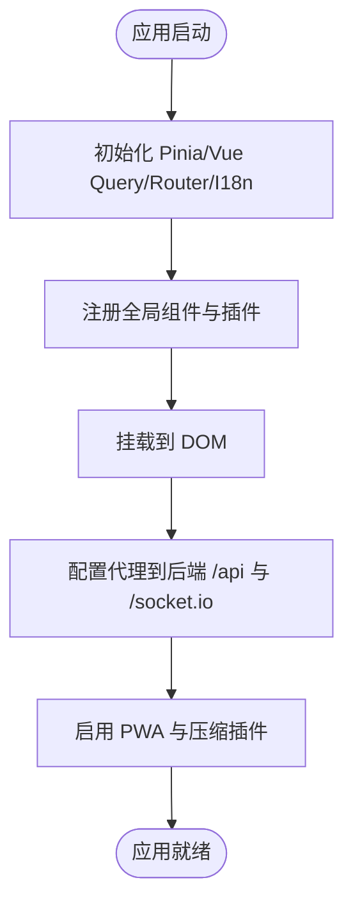
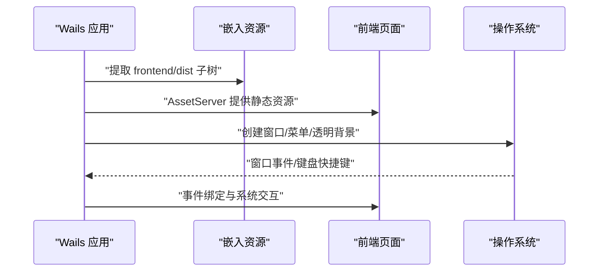
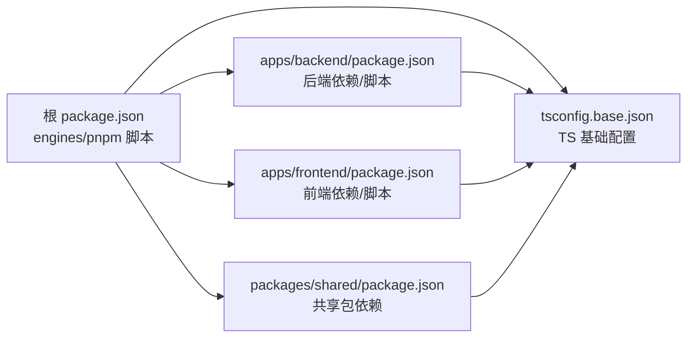

# 技术栈详解

<cite>
**本文引用的文件**
- [package.json](file://package.json)
- [apps/backend/package.json](file://apps/backend/package.json)
- [apps/frontend/package.json](file://apps/frontend/package.json)
- [packages/shared/package.json](file://packages/shared/package.json)
- [tsconfig.base.json](file://tsconfig.base.json)
- [apps/backend/tsconfig.json](file://apps/backend/tsconfig.json)
- [apps/frontend/tsconfig.json](file://apps/frontend/tsconfig.json)
- [apps/backend/nest-cli.json](file://apps/backend/nest-cli.json)
- [apps/backend/src/main.ts](file://apps/backend/src/main.ts)
- [apps/backend/src/app.module.ts](file://apps/backend/src/app.module.ts)
- [apps/frontend/src/main.ts](file://apps/frontend/src/main.ts)
- [apps/frontend/vite.config.mts](file://apps/frontend/vite.config.mts)
- [apps/wails/main.go](file://apps/wails/main.go)
- [apps/wails/app.go](file://apps/wails/app.go)
</cite>

## 目录
1. [引言](#引言)
2. [项目结构](#项目结构)
3. [核心组件](#核心组件)
4. [架构总览](#架构总览)
5. [详细组件分析](#详细组件分析)
6. [依赖分析](#依赖分析)
7. [性能考量](#性能考量)
8. [故障排查指南](#故障排查指南)
9. [结论](#结论)
10. [附录](#附录)

## 引言
本文件面向 Lumina Todo 项目的工程团队与维护者，系统梳理并解析项目的技术栈选择、组件协作与数据流，重点覆盖：
- 后端：NestJS 作为统一后端框架，结合 Fastify 适配器、Zod 验证、Swagger 文档、Pino 日志、Redis/BullMQ 队列、Prisma ORM、国际化与安全中间件等。
- 前端：Vue 3 单页应用，配合 Vite 构建、Pinia 状态管理、Vue Query 数据缓存、PWA 能力、TailwindCSS、以及 Capacitor 的跨平台移动能力。
- 桌面端：Wails 将前端资源嵌入 Go 应用，提供原生窗口、菜单、通知与系统交互能力。
- 移动端：Capacitor 提供 iOS/Android 平台的 WebView 宿主与原生能力桥接。
- 共享层：TypeScript 统一的共享包，支撑前后端一致的数据模型与校验。
- 统一语言：TypeScript 在后端、前端、共享包与桌面端均作为主要开发语言，确保类型安全与可维护性。

## 项目结构
Lumina 采用 Monorepo 结构，通过 Turbo 管理多包并行构建与测试；核心目录如下：
- apps/backend：NestJS 后端服务，包含认证、用户、待办、邮件、定时任务、MCP、技能源等模块。
- apps/frontend：Vue 3 前端应用，包含路由、Pinia、Vue Query、国际化、UI 组件库、AI 功能等。
- apps/wails：Go + Wails 桌面端应用，嵌入前端 dist 资源，提供原生窗口与系统交互。
- packages/shared：共享 TypeScript 包，导出公共 DTO、Schema 与工具，供后端与前端复用。
- 根目录：工作区配置、脚本、Docker Compose、依赖覆盖与引擎约束。

**图表来源**
- [package.json:31-76](file://package.json#L31-L76)
- [apps/backend/package.json:1-108](file://apps/backend/package.json#L1-L108)
- [apps/frontend/package.json:1-104](file://apps/frontend/package.json#L1-L104)
- [packages/shared/package.json:1-51](file://packages/shared/package.json#L1-L51)
- [apps/backend/src/main.ts:1-201](file://apps/backend/src/main.ts#L1-L201)
- [apps/backend/src/app.module.ts:1-175](file://apps/backend/src/app.module.ts#L1-L175)
- [apps/frontend/src/main.ts:1-138](file://apps/frontend/src/main.ts#L1-L138)
- [apps/frontend/vite.config.mts:1-185](file://apps/frontend/vite.config.mts#L1-L185)
- [apps/wails/main.go:1-95](file://apps/wails/main.go#L1-L95)
- [apps/wails/app.go:1-168](file://apps/wails/app.go#L1-L168)

**章节来源**
- [package.json:1-133](file://package.json#L1-L133)
- [apps/backend/package.json:1-108](file://apps/backend/package.json#L1-L108)
- [apps/frontend/package.json:1-104](file://apps/frontend/package.json#L1-L104)
- [packages/shared/package.json:1-51](file://packages/shared/package.json#L1-L51)

## 核心组件
- 后端框架与运行时
  - NestJS + Fastify 适配器：高性能 HTTP/WebSocket 服务，支持装饰器驱动的模块化架构与中间件生态。
  - Swagger 文档：自动生成 API 文档，并对 Zod Schema 进行清理以提升可读性。
  - 全局管道与拦截器：Zod 验证、统一响应格式、XSS 清理与异常过滤。
  - 安全中间件：Helmet、CORS、CSRF 校验、压缩与静态资源托管。
- 数据与缓存
  - Prisma ORM：数据库抽象与迁移工具链，PostgreSQL 适配器。
  - Redis + BullMQ：队列与后台任务处理，带指数退避与重试策略。
- 业务模块
  - 认证授权、用户管理、待办同步、邮件、定时任务、MCP 协议对接、技能源代理。
- 前端框架与构建
  - Vue 3 + Vite：快速热更新与按需打包；Pinia + Vue Query 实现状态与数据缓存；PWA 插件提供离线与更新能力。
  - 国际化：基于 i18n 的语言切换与键值加载。
  - UI 组件库：Reka UI、TailwindCSS 与大量第三方库（图表、Markdown、动画等）。
- 桌面端
  - Wails：Go 应用嵌入前端资源，提供原生窗口、菜单、通知与浏览器打开等系统能力。
- 移动端
  - Capacitor：iOS/Android WebView 宿主，支持 Cordova 插件生态与原生能力桥接。
- 共享层
  - TypeScript 共享包：统一 DTO 与 Schema，减少重复与不一致。

**章节来源**
- [apps/backend/src/main.ts:34-195](file://apps/backend/src/main.ts#L34-L195)
- [apps/backend/src/app.module.ts:27-175](file://apps/backend/src/app.module.ts#L27-L175)
- [apps/frontend/src/main.ts:54-138](file://apps/frontend/src/main.ts#L54-L138)
- [apps/frontend/vite.config.mts:80-185](file://apps/frontend/vite.config.mts#L80-L185)
- [apps/wails/main.go:51-94](file://apps/wails/main.go#L51-L94)
- [apps/wails/app.go:12-168](file://apps/wails/app.go#L12-L168)
- [packages/shared/package.json:1-51](file://packages/shared/package.json#L1-L51)

## 架构总览
Lumina 的整体架构围绕“统一 TypeScript 类型 + 多端交付”展开：后端提供 REST/WebSocket API，前端负责交互与数据缓存，桌面端与移动端通过嵌入或 WebView 方式复用前端资源，共享包保证数据契约一致。

**图表来源**
- [apps/backend/src/main.ts:15-195](file://apps/backend/src/main.ts#L15-L195)
- [apps/backend/src/app.module.ts:27-175](file://apps/backend/src/app.module.ts#L27-L175)
- [apps/frontend/src/main.ts:10-138](file://apps/frontend/src/main.ts#L10-L138)
- [apps/frontend/vite.config.mts:104-147](file://apps/frontend/vite.config.mts#L104-L147)
- [apps/wails/main.go:17-94](file://apps/wails/main.go#L17-L94)
- [packages/shared/package.json:1-51](file://packages/shared/package.json#L1-L51)

## 详细组件分析

### 后端：NestJS 与 Fastify 适配器
- 选择理由
  - 装饰器驱动的模块化架构，便于组织认证、业务、事件、上传、定时任务等模块。
  - Fastify 适配器提供更高吞吐与更低延迟，适合高并发场景。
  - Zod 验证替代 class-validator，类型安全且更易维护。
  - Swagger 自动生成文档并结合清理工具提升可读性。
  - Pino 日志模块支持生产 JSON 与开发友好输出。
  - Redis + BullMQ 提供可靠的后台任务与队列能力。
- 关键特性
  - 全局 CORS、Helmet、CSRF 校验、Gzip 压缩、静态资源托管。
  - 全局 Zod 验证、统一响应与 XSS 清理拦截器。
  - Swagger 文档与健康检查端点。
  - 优雅关闭钩子与 Docker 监听地址配置。
- 代码定位
  - 启动与中间件：[apps/backend/src/main.ts:34-195](file://apps/backend/src/main.ts#L34-L195)
  - 根模块与全局配置：[apps/backend/src/app.module.ts:27-175](file://apps/backend/src/app.module.ts#L27-L175)
  - TypeScript 配置与路径映射：[apps/backend/tsconfig.json:1-30](file://apps/backend/tsconfig.json#L1-L30)
  - Nest CLI 配置：[apps/backend/nest-cli.json:1-11](file://apps/backend/nest-cli.json#L1-L11)

**图表来源**
- [apps/backend/src/main.ts:159-170](file://apps/backend/src/main.ts#L159-L170)
- [apps/backend/src/app.module.ts:34-88](file://apps/backend/src/app.module.ts#L34-L88)

**章节来源**
- [apps/backend/src/main.ts:34-195](file://apps/backend/src/main.ts#L34-L195)
- [apps/backend/src/app.module.ts:27-175](file://apps/backend/src/app.module.ts#L27-L175)
- [apps/backend/tsconfig.json:1-30](file://apps/backend/tsconfig.json#L1-L30)
- [apps/backend/nest-cli.json:1-11](file://apps/backend/nest-cli.json#L1-L11)

### 前端：Vue 3 与 Vite 构建
- 选择理由
  - Vue 3 Composition API 与响应式系统，适合复杂交互与 AI 辅助功能。
  - Vite 提供极快的冷启动与热更新，利于开发体验。
  - Pinia + Vue Query 实现状态与数据缓存，降低网络压力。
  - PWA 插件提供离线能力与自动更新。
  - TailwindCSS 与 Reka UI 等组件库提升 UI 开发效率。
- 关键特性
  - 路由懒加载、动态导入错误处理、全局错误捕获。
  - PWA 清单与图标生成、Gzip/Brotli 压缩。
  - 代理到后端 API 与 Socket.IO，支持长连接。
  - 国际化与 Markdown 渲染生态。
- 代码定位
  - 应用初始化与错误处理：[apps/frontend/src/main.ts:54-138](file://apps/frontend/src/main.ts#L54-L138)
  - 构建与 PWA 配置：[apps/frontend/vite.config.mts:80-185](file://apps/frontend/vite.config.mts#L80-L185)
  - TypeScript 配置与路径映射：[apps/frontend/tsconfig.json:1-28](file://apps/frontend/tsconfig.json#L1-L28)

**图表来源**
- [apps/frontend/src/main.ts:115-138](file://apps/frontend/src/main.ts#L115-L138)
- [apps/frontend/vite.config.mts:154-182](file://apps/frontend/vite.config.mts#L154-L182)

**章节来源**
- [apps/frontend/src/main.ts:54-138](file://apps/frontend/src/main.ts#L54-L138)
- [apps/frontend/vite.config.mts:80-185](file://apps/frontend/vite.config.mts#L80-L185)
- [apps/frontend/tsconfig.json:1-28](file://apps/frontend/tsconfig.json#L1-L28)

### 桌面端：Wails 嵌入前端资源
- 选择理由
  - Go 语言提供跨平台原生能力，Wails 将前端资源嵌入，实现“前端即桌面”的开发模式。
  - 支持原生窗口、菜单、通知、浏览器打开、屏幕检测与迷你模式等。
- 关键特性
  - 嵌入前端 dist 资源并通过 AssetServer 提供服务。
  - 平台特定选项（Windows Mica、macOS 标题栏隐藏等）。
  - 生命周期回调（startup/shutdown）与系统交互 API。
- 代码定位
  - 应用入口与菜单配置：[apps/wails/main.go:51-94](file://apps/wails/main.go#L51-L94)
  - 系统交互与窗口控制：[apps/wails/app.go:12-168](file://apps/wails/app.go#L12-L168)

**图表来源**
- [apps/wails/main.go:17-94](file://apps/wails/main.go#L17-L94)
- [apps/wails/app.go:12-168](file://apps/wails/app.go#L12-L168)

**章节来源**
- [apps/wails/main.go:1-95](file://apps/wails/main.go#L1-L95)
- [apps/wails/app.go:1-168](file://apps/wails/app.go#L1-L168)

### 移动端：Capacitor WebView 宿主
- 选择理由
  - Capacitor 提供稳定的 iOS/Android WebView 宿主，支持 Cordova 插件生态。
  - 与前端代码复用度高，开发成本低。
- 关键特性
  - Android/iOS 工程与 Gradle/CocoaPods 配置。
  - 与前端构建产物同步（cap sync），支持本地运行与构建。
- 代码定位
  - 前端脚本与 Capacitor 集成：[apps/frontend/package.json:21-28](file://apps/frontend/package.json#L21-L28)
  - Android 工程配置：[apps/frontend/android/build.gradle](file://apps/frontend/android/build.gradle)
  - iOS 工程配置：[apps/frontend/ios/App/App.xcodeproj/project.pbxproj](file://apps/frontend/ios/App/App.xcodeproj/project.pbxproj)

**章节来源**
- [apps/frontend/package.json:21-28](file://apps/frontend/package.json#L21-L28)

### 共享包：TypeScript 统一数据契约
- 选择理由
  - 将 DTO 与 Schema 抽象为独立包，避免前后端重复定义，降低耦合与不一致风险。
- 关键特性
  - 通过 exports 字段与 typesVersions 提供多入口与类型声明。
  - 与后端、前端路径别名映射一致，确保编译期类型检查。
- 代码定位
  - 共享包导出与类型声明：[packages/shared/package.json:10-24](file://packages/shared/package.json#L10-L24)

**章节来源**
- [packages/shared/package.json:1-51](file://packages/shared/package.json#L1-L51)

## 依赖分析
- 版本与兼容性
  - Node.js 与包管理器：根目录 engines 指定 Node >= 20.19.0，pnpm >= 9.15.0。
  - TypeScript：统一使用 5.9.3，严格模式与 ESNext 模块解析。
  - 后端 NestJS 11.x、Fastify 5.x、Prisma 7.x、Redis/ioredis、BullMQ、Pino 等。
  - 前端 Vue 3.5、Vite 8、Pinia、Vue Query、TailwindCSS、Capacitor 8.x、Wails Go 应用。
- 依赖覆盖
  - 根 package.json 中通过 overrides 对关键依赖进行版本收敛，减少安全与兼容性问题。
- 代码定位
  - 引擎与脚本：[package.json:27-76](file://package.json#L27-L76)
  - TypeScript 基础配置：[tsconfig.base.json:1-17](file://tsconfig.base.json#L1-L17)
  - 后端依赖与脚本：[apps/backend/package.json:30-108](file://apps/backend/package.json#L30-L108)
  - 前端依赖与脚本：[apps/frontend/package.json:30-104](file://apps/frontend/package.json#L30-L104)
  - 共享包依赖：[packages/shared/package.json:40-51](file://packages/shared/package.json#L40-L51)

**图表来源**
- [package.json:27-76](file://package.json#L27-L76)
- [tsconfig.base.json:1-17](file://tsconfig.base.json#L1-L17)
- [apps/backend/package.json:30-108](file://apps/backend/package.json#L30-L108)
- [apps/frontend/package.json:30-104](file://apps/frontend/package.json#L30-L104)
- [packages/shared/package.json:40-51](file://packages/shared/package.json#L40-L51)

**章节来源**
- [package.json:27-76](file://package.json#L27-L76)
- [tsconfig.base.json:1-17](file://tsconfig.base.json#L1-L17)
- [apps/backend/package.json:30-108](file://apps/backend/package.json#L30-L108)
- [apps/frontend/package.json:30-104](file://apps/frontend/package.json#L30-L104)
- [packages/shared/package.json:40-51](file://packages/shared/package.json#L40-L51)

## 性能考量
- 后端
  - Fastify 适配器与装饰器元数据开启，减少反射开销。
  - Gzip/Brotli 压缩与静态资源托管，降低传输体积。
  - BullMQ 默认移除完成任务与指数退避策略，降低失败重试压力。
- 前端
  - Vite 构建按需拆分 vendor chunk，提升缓存命中率。
  - PWA 与压缩插件减少首屏与增量加载时间。
  - Vue Query 查询缓存与重试策略，减少重复请求。
- 桌面端
  - 嵌入前端资源避免二次下载，AssetServer 提供本地服务。
- 移动端
  - Capacitor WebView 与前端缓存策略协同，减少网络请求。

[本节为通用性能建议，无需具体文件引用]

## 故障排查指南
- 启动与日志
  - 后端使用 Pino 记录请求日志与错误日志，区分不同状态码等级；可通过环境变量调整日志级别与输出格式。
  - 前端全局错误处理器捕获动态导入失败与未处理 Promise 拒绝，必要时触发刷新。
- 安全与中间件
  - 后端对非健康与非 WebSocket 路径进行 CSRF 校验，缺失 X-Requested-With 头将返回 403。
  - Helmet 提供内容安全策略与跨源策略，静态资源托管与压缩按阈值生效。
- 构建与部署
  - 前端构建产物复制至 Wails 前端目录，确保桌面端资源一致。
  - Docker 环境下监听 0.0.0.0 并暴露端口，注意代理与健康检查端点。
- 代码定位
  - 后端安全与日志：[apps/backend/src/main.ts:40-157](file://apps/backend/src/main.ts#L40-L157)
  - 前端错误处理：[apps/frontend/src/main.ts:58-113](file://apps/frontend/src/main.ts#L58-L113)
  - 前端代理与 PWA：[apps/frontend/vite.config.mts:154-182](file://apps/frontend/vite.config.mts#L154-L182)

**章节来源**
- [apps/backend/src/main.ts:40-157](file://apps/backend/src/main.ts#L40-L157)
- [apps/frontend/src/main.ts:58-113](file://apps/frontend/src/main.ts#L58-L113)
- [apps/frontend/vite.config.mts:154-182](file://apps/frontend/vite.config.mts#L154-L182)

## 结论
Lumina 的技术栈以“统一 TypeScript 类型 + 多端交付”为核心设计思想：后端采用 NestJS + Fastify 提供高性能与可维护性，前端以 Vue 3 + Vite 构建现代化交互体验，桌面端通过 Wails 嵌入前端资源实现原生能力，移动端依托 Capacitor 提供跨平台 WebView 宿主，共享包确保数据契约一致性。该组合在工程化、安全性、性能与可扩展性之间取得良好平衡，适合长期演进与团队协作。

[本节为总结性内容，无需具体文件引用]

## 附录
- 版本兼容性与升级策略
  - Node.js 与 pnpm：遵循根目录 engines 约束，升级前先在 CI 中验证。
  - TypeScript：保持 5.9.3，升级时逐包进行类型检查与修复。
  - NestJS/Fastify：关注官方变更日志，优先在测试环境验证。
  - Vue 3/Vite：关注生态插件兼容性，逐步升级并回归测试。
  - Wails/Go：随桌面端需求迭代，注意与前端构建产物的同步。
  - Capacitor：关注 iOS/Android 平台更新，及时同步 Gradle/CocoaPods 配置。
- 替代方案考虑
  - 后端：Express/Koa 可选，但会失去 NestJS 的模块化与装饰器生态；Fastify 适配器可替换为 Express，但需重新实现中间件与拦截器。
  - 前端：React+Suspense 或 SvelteKit 可选，但需要重新设计状态与缓存策略。
  - 桌面端：Electron 可选，但体积与内存占用通常高于 Wails。
  - 移动端：Flutter/Dart 或 React Native 可选，但需要重构 UI 与交互逻辑。
- 代码定位
  - 引擎与脚本：[package.json:27-76](file://package.json#L27-L76)
  - TypeScript 基础配置：[tsconfig.base.json:1-17](file://tsconfig.base.json#L1-L17)
  - 后端依赖与脚本：[apps/backend/package.json:30-108](file://apps/backend/package.json#L30-L108)
  - 前端依赖与脚本：[apps/frontend/package.json:30-104](file://apps/frontend/package.json#L30-L104)
  - 共享包依赖：[packages/shared/package.json:40-51](file://packages/shared/package.json#L40-L51)

**章节来源**
- [package.json:27-76](file://package.json#L27-L76)
- [tsconfig.base.json:1-17](file://tsconfig.base.json#L1-L17)
- [apps/backend/package.json:30-108](file://apps/backend/package.json#L30-L108)
- [apps/frontend/package.json:30-104](file://apps/frontend/package.json#L30-L104)
- [packages/shared/package.json:40-51](file://packages/shared/package.json#L40-L51)