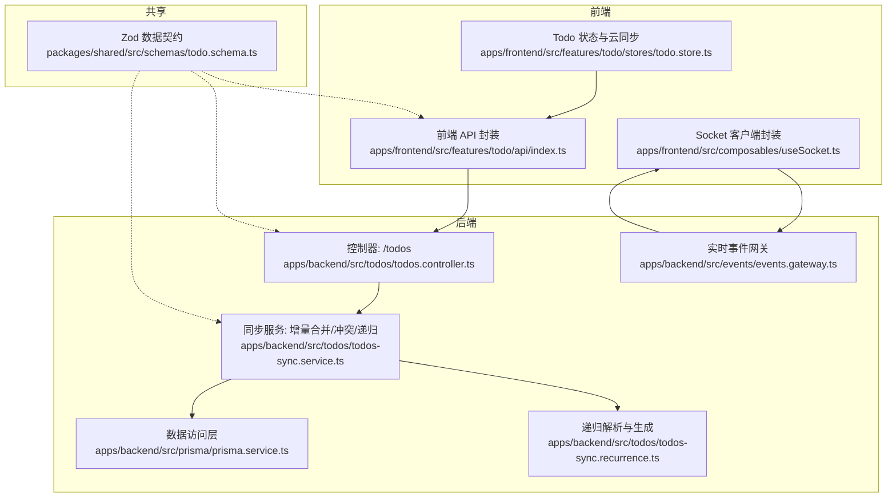
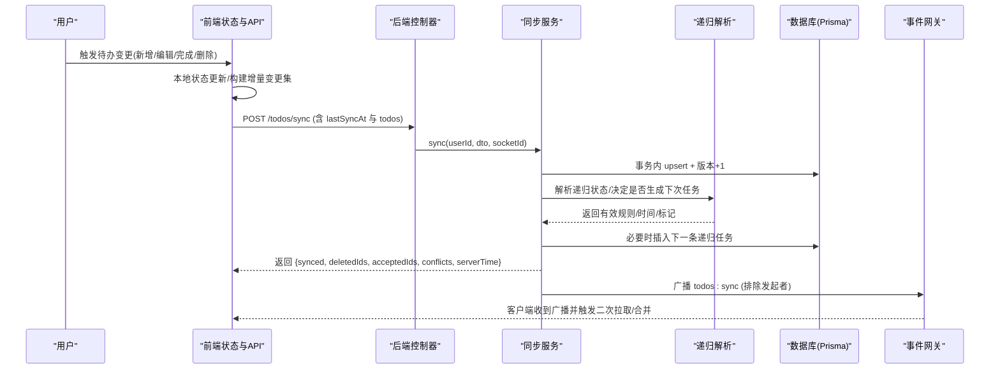
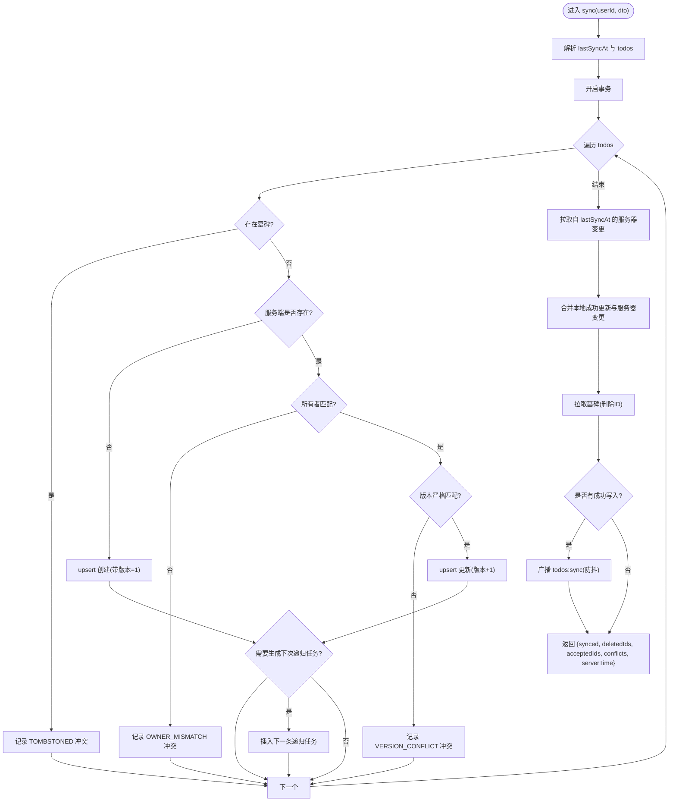
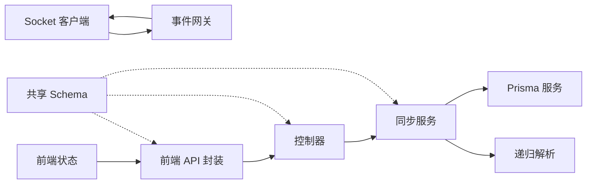
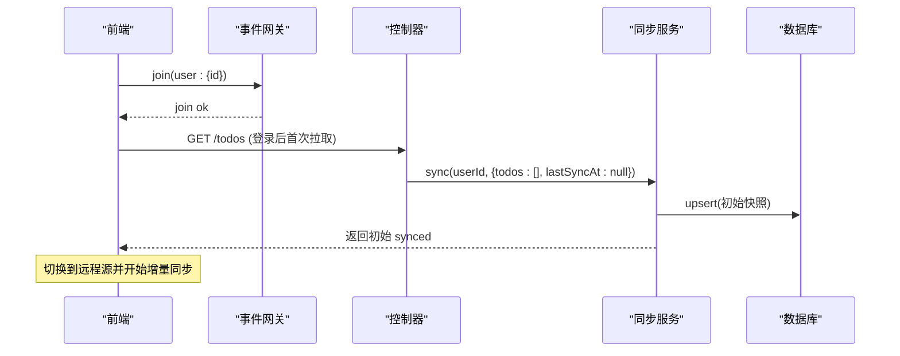

# 数据流设计

<cite>
**本文引用的文件**
- [apps/backend/src/todos/todos-sync.service.ts](file://apps/backend/src/todos/todos-sync.service.ts)
- [apps/backend/src/todos/todos.controller.ts](file://apps/backend/src/todos/todos.controller.ts)
- [apps/backend/src/todos/todos.service.ts](file://apps/backend/src/todos/todos.service.ts)
- [apps/backend/src/todos/todos-sync.recurrence.ts](file://apps/backend/src/todos/todos-sync.recurrence.ts)
- [apps/backend/src/prisma/prisma.service.ts](file://apps/backend/src/prisma/prisma.service.ts)
- [apps/backend/src/events/events.gateway.ts](file://apps/backend/src/events/events.gateway.ts)
- [apps/frontend/src/features/todo/api/index.ts](file://apps/frontend/src/features/todo/api/index.ts)
- [apps/frontend/src/features/todo/stores/todo.store.ts](file://apps/frontend/src/features/todo/stores/todo.store.ts)
- [apps/frontend/src/composables/useSocket.ts](file://apps/frontend/src/composables/useSocket.ts)
- [packages/shared/src/schemas/todo.schema.ts](file://packages/shared/src/schemas/todo.schema.ts)
</cite>

## 目录
1. [引言](#引言)
2. [项目结构](#项目结构)
3. [核心组件](#核心组件)
4. [架构总览](#架构总览)
5. [详细组件分析](#详细组件分析)
6. [依赖关系分析](#依赖关系分析)
7. [性能考量](#性能考量)
8. [故障排查指南](#故障排查指南)
9. [结论](#结论)
10. [附录](#附录)

## 引言
本设计文档聚焦 Lumina Todo 的数据流设计，覆盖从前端用户操作到后端数据库的完整数据流转路径，解释状态管理模式与数据同步机制（本地状态、远程状态、冲突与回退策略）、实时同步与冲突解决算法、数据校验与序列化、一致性与事务策略，以及数据迁移与版本兼容方案。目标是帮助开发者与产品人员快速理解系统如何在多端之间保持数据一致、可追溯且可扩展。

## 项目结构
Lumina Todo 采用前后端分离与模块化组织：
- 前端（Vue + Pinia + Socket.IO 客户端）负责 UI、本地状态管理、离线优先的增量同步、实时事件监听与冲突提示。
- 后端（NestJS + Prisma + PostgreSQL）负责业务规则、事务一致性、增量合并、递归任务生成、实时事件广播。
- 共享层（Zod Schema）定义跨边界的数据契约，确保前后端对数据结构与约束的一致理解。

图表来源
- [apps/frontend/src/features/todo/api/index.ts:1-62](file://apps/frontend/src/features/todo/api/index.ts#L1-L62)
- [apps/frontend/src/features/todo/stores/todo.store.ts:1-335](file://apps/frontend/src/features/todo/stores/todo.store.ts#L1-L335)
- [apps/frontend/src/composables/useSocket.ts:1-176](file://apps/frontend/src/composables/useSocket.ts#L1-L176)
- [apps/backend/src/todos/todos.controller.ts:1-70](file://apps/backend/src/todos/todos.controller.ts#L1-L70)
- [apps/backend/src/todos/todos-sync.service.ts:1-221](file://apps/backend/src/todos/todos-sync.service.ts#L1-L221)
- [apps/backend/src/todos/todos-sync.recurrence.ts:1-208](file://apps/backend/src/todos/todos-sync.recurrence.ts#L1-L208)
- [apps/backend/src/prisma/prisma.service.ts:1-34](file://apps/backend/src/prisma/prisma.service.ts#L1-L34)
- [apps/backend/src/events/events.gateway.ts:1-266](file://apps/backend/src/events/events.gateway.ts#L1-L266)
- [packages/shared/src/schemas/todo.schema.ts:1-75](file://packages/shared/src/schemas/todo.schema.ts#L1-L75)

章节来源
- [apps/frontend/src/features/todo/api/index.ts:1-62](file://apps/frontend/src/features/todo/api/index.ts#L1-L62)
- [apps/frontend/src/features/todo/stores/todo.store.ts:1-335](file://apps/frontend/src/features/todo/stores/todo.store.ts#L1-L335)
- [apps/frontend/src/composables/useSocket.ts:1-176](file://apps/frontend/src/composables/useSocket.ts#L1-L176)
- [apps/backend/src/todos/todos.controller.ts:1-70](file://apps/backend/src/todos/todos.controller.ts#L1-L70)
- [apps/backend/src/todos/todos-sync.service.ts:1-221](file://apps/backend/src/todos/todos-sync.service.ts#L1-L221)
- [apps/backend/src/todos/todos-sync.recurrence.ts:1-208](file://apps/backend/src/todos/todos-sync.recurrence.ts#L1-L208)
- [apps/backend/src/prisma/prisma.service.ts:1-34](file://apps/backend/src/prisma/prisma.service.ts#L1-L34)
- [apps/backend/src/events/events.gateway.ts:1-266](file://apps/backend/src/events/events.gateway.ts#L1-L266)
- [packages/shared/src/schemas/todo.schema.ts:1-75](file://packages/shared/src/schemas/todo.schema.ts#L1-L75)

## 核心组件
- 前端 Todo 状态与云同步
  - 维护本地/远程双源视图，支持过滤、排序、预览变更、持久化。
  - 提供“增量同步”入口，携带 lastSyncAt 与变更集，发送至后端。
  - 实时监听后端广播，触发本地状态合并与冲突提示。
- 后端 Todos 控制器与同步服务
  - 接收前端同步请求，执行事务内的增量合并、冲突检测与递归任务生成。
  - 拉取自上次同步以来的服务器变更，合并后返回给前端。
  - 通过事件网关广播“需要同步”的通知，驱动多端实时更新。
- 共享 Schema
  - 定义 Todo、同步项、同步请求/响应、冲突类型与日期字段的严格校验规则。
- Prisma 与数据库
  - 通过适配器连接 PostgreSQL，提供强类型查询与事务能力。

章节来源
- [apps/frontend/src/features/todo/stores/todo.store.ts:1-335](file://apps/frontend/src/features/todo/stores/todo.store.ts#L1-L335)
- [apps/frontend/src/features/todo/api/index.ts:1-62](file://apps/frontend/src/features/todo/api/index.ts#L1-L62)
- [apps/backend/src/todos/todos.controller.ts:1-70](file://apps/backend/src/todos/todos.controller.ts#L1-L70)
- [apps/backend/src/todos/todos-sync.service.ts:1-221](file://apps/backend/src/todos/todos-sync.service.ts#L1-L221)
- [apps/backend/src/todos/todos-sync.recurrence.ts:1-208](file://apps/backend/src/todos/todos-sync.recurrence.ts#L1-L208)
- [packages/shared/src/schemas/todo.schema.ts:1-75](file://packages/shared/src/schemas/todo.schema.ts#L1-L75)
- [apps/backend/src/prisma/prisma.service.ts:1-34](file://apps/backend/src/prisma/prisma.service.ts#L1-L34)

## 架构总览
下图展示从用户操作到数据库写入与实时广播的关键路径，以及回放与冲突处理的闭环。

图表来源
- [apps/frontend/src/features/todo/api/index.ts:1-62](file://apps/frontend/src/features/todo/api/index.ts#L1-L62)
- [apps/backend/src/todos/todos.controller.ts:1-70](file://apps/backend/src/todos/todos.controller.ts#L1-L70)
- [apps/backend/src/todos/todos-sync.service.ts:1-221](file://apps/backend/src/todos/todos-sync.service.ts#L1-L221)
- [apps/backend/src/todos/todos-sync.recurrence.ts:1-208](file://apps/backend/src/todos/todos-sync.recurrence.ts#L1-L208)
- [apps/backend/src/events/events.gateway.ts:1-266](file://apps/backend/src/events/events.gateway.ts#L1-L266)

## 详细组件分析

### 前端：状态管理模式与本地/远程双源
- 双源视图
  - localTodos 与 remoteTodos 分别承载本地与远端快照；通过 todoSource 切换。
  - 应用启动与登录时，根据认证状态与来源选择，决定是否合并远端数据。
- 变更预览与提议
  - 使用 proposed change 机制在本地模拟变更，支持撤销与应用。
- 持久化与恢复
  - Pinia 持久化 pick 关键字段，保障切换来源与重启后状态可恢复。
- 同步入口
  - 通过 API 封装调用 /todos/sync，携带 lastSyncAt 与 todos 变更集，并透传 X-Socket-ID 以避免自播。

章节来源
- [apps/frontend/src/features/todo/stores/todo.store.ts:1-335](file://apps/frontend/src/features/todo/stores/todo.store.ts#L1-L335)
- [apps/frontend/src/features/todo/api/index.ts:1-62](file://apps/frontend/src/features/todo/api/index.ts#L1-L62)

### 前端：实时事件与多端同步
- Socket 客户端封装
  - 自动鉴权、重连、加入用户房间 user:{id}，在连接建立后主动 join。
  - 连接错误中识别认证类错误并触发 token 刷新与重连。
- 事件监听
  - 监听 todos:sync 广播，触发二次拉取与合并，确保多端一致。
- 与后端协作
  - 在同步请求中附带 X-Socket-ID，后端据此排除广播目标，避免风暴。

章节来源
- [apps/frontend/src/composables/useSocket.ts:1-176](file://apps/frontend/src/composables/useSocket.ts#L1-L176)
- [apps/backend/src/events/events.gateway.ts:1-266](file://apps/backend/src/events/events.gateway.ts#L1-L266)

### 后端：控制器与路由
- /todos/sync 接口
  - JWT 鉴权，接收 SyncMergeDto，转发给同步服务，并透传 X-Socket-ID。
- 其他接口
  - 获取全部/回收站、恢复/永久删除、清空回收站，均触发事件广播。

章节来源
- [apps/backend/src/todos/todos.controller.ts:1-70](file://apps/backend/src/todos/todos.controller.ts#L1-L70)

### 后端：同步服务（增量合并、冲突检测、递归）
- 增量合并与事务
  - 对每个客户端推送项，在单事务内执行 upsert，版本号自增，确保原子性。
- 冲突检测
  - TOMBSTONED：目标已被标记删除（墓碑表存在）。
  - OWNER_MISMATCH：目标不属于当前用户。
  - VERSION_CONFLICT：客户端版本与服务端不一致（严格匹配，避免时钟漂移影响）。
- 服务器端变更拉取
  - 基于 lastSyncAt 拉取自上次以来的变更，初次同步排除回收站条目。
- 递归任务生成
  - 当满足“完成且无父级且有有效规则且未生成过下次任务”时，基于规则与时区生成下一条任务。
- 广播通知
  - 成功写入后向用户房间广播 todos:sync，后端做 500ms 防抖，避免风暴。

图表来源
- [apps/backend/src/todos/todos-sync.service.ts:1-221](file://apps/backend/src/todos/todos-sync.service.ts#L1-L221)
- [apps/backend/src/todos/todos-sync.recurrence.ts:1-208](file://apps/backend/src/todos/todos-sync.recurrence.ts#L1-L208)

章节来源
- [apps/backend/src/todos/todos-sync.service.ts:1-221](file://apps/backend/src/todos/todos-sync.service.ts#L1-L221)
- [apps/backend/src/todos/todos-sync.recurrence.ts:1-208](file://apps/backend/src/todos/todos-sync.recurrence.ts#L1-L208)

### 后端：递归解析与生成
- 规则与时区规范化
  - 校验并标准化递归规则与时区，无效值置空。
- 下次到期与提醒时间计算
  - 基于规则与时区推导下次 dueAt，再按原时差推导下次 remindAt。
- 生成条件
  - 存在有效规则、当前未完成但本次完成、无父级、尚未生成过下次任务。

章节来源
- [apps/backend/src/todos/todos-sync.recurrence.ts:1-208](file://apps/backend/src/todos/todos-sync.recurrence.ts#L1-L208)

### 后端：事件网关与实时广播
- 认证与房间
  - 中间件校验 JWT，加入 user:{id} 房间，限制房间访问。
- 广播策略
  - todos:sync 事件，支持排除特定 socketId，后端 500ms 防抖。
- 其他事件
  - message/join/leave 等通用事件，便于扩展。

章节来源
- [apps/backend/src/events/events.gateway.ts:1-266](file://apps/backend/src/events/events.gateway.ts#L1-L266)

### 共享层：数据契约与序列化
- Zod Schema
  - Todo、SyncItem、SyncMergeRequest、SyncResponse、SyncConflict 的字段与约束定义。
  - 日期字段支持 Date 或字符串，便于跨边界传输与反序列化。
- 前后端一致性
  - 前端 API 层与后端 DTO/Service 均基于相同 Schema，确保校验与序列化一致。

章节来源
- [packages/shared/src/schemas/todo.schema.ts:1-75](file://packages/shared/src/schemas/todo.schema.ts#L1-L75)
- [apps/frontend/src/features/todo/api/index.ts:1-62](file://apps/frontend/src/features/todo/api/index.ts#L1-L62)
- [apps/backend/src/todos/todos.controller.ts:1-70](file://apps/backend/src/todos/todos.controller.ts#L1-L70)

## 依赖关系分析
- 前端依赖
  - API 封装依赖共享 Schema 类型；状态存储依赖 Socket 客户端与事件网关。
- 后端依赖
  - 控制器依赖同步服务；同步服务依赖 Prisma 与事件网关；递归模块独立但被同步服务调用。
- 数据库
  - Prisma 通过适配器连接 PostgreSQL，提供事务与强类型查询。

图表来源
- [apps/frontend/src/features/todo/api/index.ts:1-62](file://apps/frontend/src/features/todo/api/index.ts#L1-L62)
- [apps/frontend/src/features/todo/stores/todo.store.ts:1-335](file://apps/frontend/src/features/todo/stores/todo.store.ts#L1-L335)
- [apps/frontend/src/composables/useSocket.ts:1-176](file://apps/frontend/src/composables/useSocket.ts#L1-L176)
- [apps/backend/src/todos/todos.controller.ts:1-70](file://apps/backend/src/todos/todos.controller.ts#L1-L70)
- [apps/backend/src/todos/todos-sync.service.ts:1-221](file://apps/backend/src/todos/todos-sync.service.ts#L1-L221)
- [apps/backend/src/todos/todos-sync.recurrence.ts:1-208](file://apps/backend/src/todos/todos-sync.recurrence.ts#L1-L208)
- [apps/backend/src/prisma/prisma.service.ts:1-34](file://apps/backend/src/prisma/prisma.service.ts#L1-L34)
- [apps/backend/src/events/events.gateway.ts:1-266](file://apps/backend/src/events/events.gateway.ts#L1-L266)
- [packages/shared/src/schemas/todo.schema.ts:1-75](file://packages/shared/src/schemas/todo.schema.ts#L1-L75)

章节来源
- [apps/frontend/src/features/todo/api/index.ts:1-62](file://apps/frontend/src/features/todo/api/index.ts#L1-L62)
- [apps/backend/src/todos/todos.controller.ts:1-70](file://apps/backend/src/todos/todos.controller.ts#L1-L70)
- [apps/backend/src/todos/todos-sync.service.ts:1-221](file://apps/backend/src/todos/todos-sync.service.ts#L1-L221)
- [apps/backend/src/todos/todos-sync.recurrence.ts:1-208](file://apps/backend/src/todos/todos-sync.recurrence.ts#L1-L208)
- [apps/backend/src/prisma/prisma.service.ts:1-34](file://apps/backend/src/prisma/prisma.service.ts#L1-L34)
- [apps/backend/src/events/events.gateway.ts:1-266](file://apps/backend/src/events/events.gateway.ts#L1-L266)
- [packages/shared/src/schemas/todo.schema.ts:1-75](file://packages/shared/src/schemas/todo.schema.ts#L1-L75)

## 性能考量
- 事务与批量
  - 同步阶段在单事务内批量 upsert，降低锁竞争与回滚成本。
- 防抖广播
  - 后端对同一用户的广播做 500ms 防抖，避免风暴与抖动。
- 查询优化
  - 仅选择必要字段，基于 updatedAt >= since 拉取增量，减少网络与解析开销。
- 递归生成
  - 仅在满足条件时生成下一条任务，避免无谓插入。
- Socket 传输
  - 优先 websocket，结合重连与指数退避，提升稳定性。

[本节为通用性能建议，无需列出章节来源]

## 故障排查指南
- 同步冲突
  - TOMBSTONED：确认是否已在其他设备删除目标；若需要恢复，走恢复流程。
  - OWNER_MISMATCH：检查用户上下文是否正确；避免跨用户误操作。
  - VERSION_CONFLICT：通常由并发修改导致；前端应提示用户重试或手动合并。
- 实时不同步
  - 检查 Socket 是否连接、是否加入 user:{id} 房间；确认后端广播是否触发。
  - 若存在 X-Socket-ID，确认后端是否正确排除发起者。
- 递归任务未生成
  - 检查 dueAt/remindAt/recurrenceRule/recurrenceTz 是否有效；确认已完成且无父级。
- 数据库问题
  - 确认 DATABASE_URL 配置；Prisma 初始化与销毁钩子是否正常。

章节来源
- [apps/backend/src/todos/todos-sync.service.ts:1-221](file://apps/backend/src/todos/todos-sync.service.ts#L1-L221)
- [apps/backend/src/events/events.gateway.ts:1-266](file://apps/backend/src/events/events.gateway.ts#L1-L266)
- [apps/frontend/src/composables/useSocket.ts:1-176](file://apps/frontend/src/composables/useSocket.ts#L1-L176)

## 结论
Lumina Todo 的数据流以“离线优先、严格版本控制、事务一致性、实时广播”为核心设计原则。前端通过本地/远程双源与提议变更机制实现高效体验，后端通过事务与冲突检测保障数据安全，事件网关实现多端实时同步。共享 Schema 确保契约一致，递归模块完善周期性任务场景。整体方案兼顾可用性与一致性，适合多端协同与复杂业务演进。

[本节为总结性内容，无需列出章节来源]

## 附录

### 数据验证、转换与序列化流程
- 前端
  - 使用共享 Schema 校验请求/响应；日期字段统一为 Date 或 ISO 字符串；发送前进行序列化。
- 后端
  - 控制器接收 DTO，内部再次基于 Schema 校验；服务层执行业务转换与落库。
- 一致性
  - 前后端共享 Schema，避免字段差异与类型不一致导致的异常。

章节来源
- [packages/shared/src/schemas/todo.schema.ts:1-75](file://packages/shared/src/schemas/todo.schema.ts#L1-L75)
- [apps/frontend/src/features/todo/api/index.ts:1-62](file://apps/frontend/src/features/todo/api/index.ts#L1-L62)
- [apps/backend/src/todos/todos.controller.ts:1-70](file://apps/backend/src/todos/todos.controller.ts#L1-L70)

### 数据一致性与事务策略
- 事务
  - 同步阶段在单事务内 upsert，版本+1，确保原子性。
  - 永久删除与墓碑写入在同一事务内完成，避免状态不一致。
- 版本控制
  - 严格版本匹配，避免客户端时钟漂移引发的并发冲突。
- 广播与幂等
  - 广播防抖；前端对重复事件幂等处理（基于 lastSyncAt 与去重集合）。

章节来源
- [apps/backend/src/todos/todos-sync.service.ts:1-221](file://apps/backend/src/todos/todos-sync.service.ts#L1-L221)
- [apps/backend/src/todos/todos.service.ts:1-146](file://apps/backend/src/todos/todos.service.ts#L1-L146)
- [apps/backend/src/events/events.gateway.ts:1-266](file://apps/backend/src/events/events.gateway.ts#L1-L266)

### 实时数据同步时序图（登录后首次合并）

图表来源
- [apps/frontend/src/composables/useSocket.ts:1-176](file://apps/frontend/src/composables/useSocket.ts#L1-L176)
- [apps/backend/src/todos/todos.controller.ts:1-70](file://apps/backend/src/todos/todos.controller.ts#L1-L70)
- [apps/backend/src/todos/todos-sync.service.ts:1-221](file://apps/backend/src/todos/todos-sync.service.ts#L1-L221)

### 数据迁移与版本兼容
- 字段演进
  - 新增可选字段时，后端默认值与前端空值处理需保持一致；共享 Schema 明确可空与默认值。
- 递归规则与时区
  - 规则枚举与时区校验在服务端集中处理，避免历史数据不一致。
- 版本号策略
  - 版本号仅在服务端自增，客户端仅作为冲突判定依据，避免客户端篡改。
- 墓碑与回收站
  - 删除采用墓碑表 + 软删除，支持跨端一致的删除可见性与恢复能力。

章节来源
- [apps/backend/src/todos/todos.service.ts:1-146](file://apps/backend/src/todos/todos.service.ts#L1-L146)
- [apps/backend/src/todos/todos-sync.service.ts:1-221](file://apps/backend/src/todos/todos-sync.service.ts#L1-L221)
- [apps/backend/src/todos/todos-sync.recurrence.ts:1-208](file://apps/backend/src/todos/todos-sync.recurrence.ts#L1-L208)