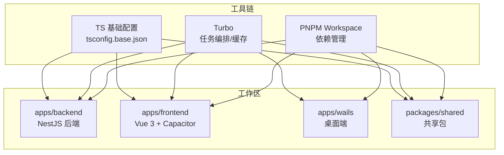
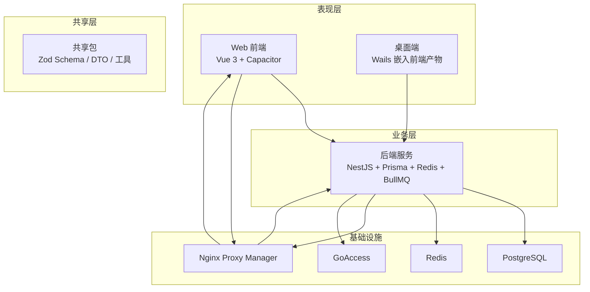
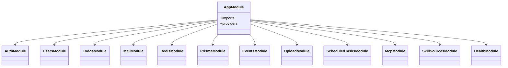
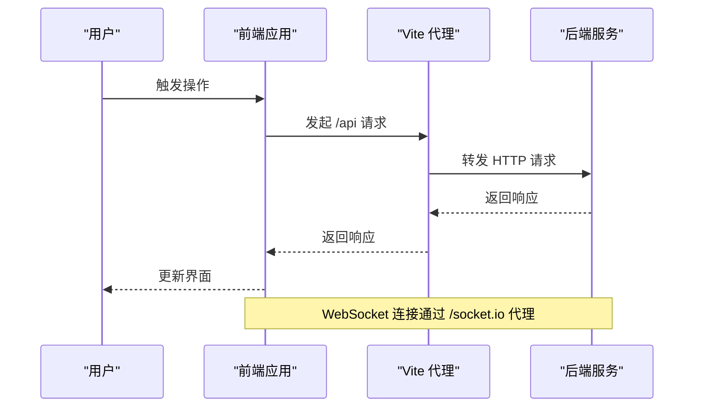
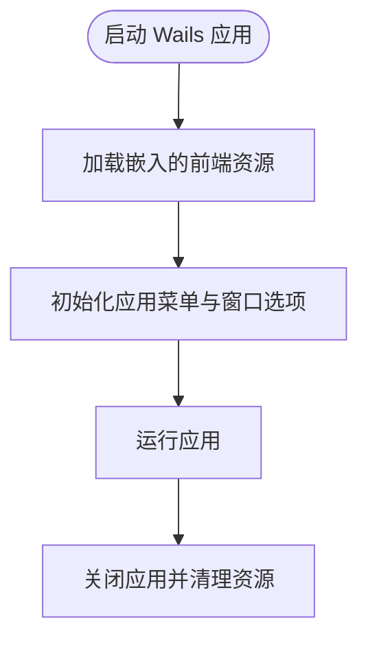
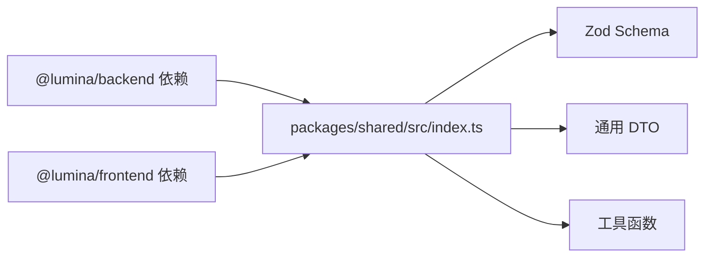
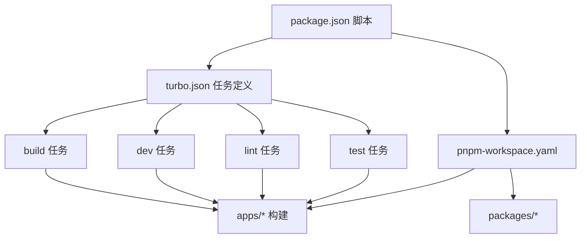

# 整体架构

<cite>
**本文引用的文件**
- [turbo.json](file://turbo.json)
- [pnpm-workspace.yaml](file://pnpm-workspace.yaml)
- [package.json](file://package.json)
- [tsconfig.base.json](file://tsconfig.base.json)
- [apps/backend/package.json](file://apps/backend/package.json)
- [apps/backend/src/app.module.ts](file://apps/backend/src/app.module.ts)
- [apps/backend/nest-cli.json](file://apps/backend/nest-cli.json)
- [apps/backend/prisma/schema/todo.prisma](file://apps/backend/prisma/schema/todo.prisma)
- [apps/frontend/package.json](file://apps/frontend/package.json)
- [apps/frontend/src/main.ts](file://apps/frontend/src/main.ts)
- [apps/frontend/vite.config.mts](file://apps/frontend/vite.config.mts)
- [apps/frontend/capacitor.config.ts](file://apps/frontend/capacitor.config.ts)
- [apps/wails/main.go](file://apps/wails/main.go)
- [packages/shared/package.json](file://packages/shared/package.json)
- [packages/shared/src/index.ts](file://packages/shared/src/index.ts)
- [packages/shared/tsup.config.ts](file://packages/shared/tsup.config.ts)
- [docker-compose.yml](file://docker-compose.yml)
</cite>

## 目录
1. [引言](#引言)
2. [项目结构](#项目结构)
3. [核心组件](#核心组件)
4. [架构总览](#架构总览)
5. [详细组件分析](#详细组件分析)
6. [依赖分析](#依赖分析)
7. [性能考虑](#性能考虑)
8. [故障排除指南](#故障排除指南)
9. [结论](#结论)
10. [附录](#附录)

## 引言
本文件面向 Lumina Todo 项目，系统性阐述其 monorepo 架构设计理念与组织方式，解析 Turbo 与 PNPM workspace 的协同机制，说明四类应用模块（backend、frontend、wails、shared）的职责与交互模式，并给出跨平台统一策略（Web、移动端、桌面端）。文档同时提供架构图、组件依赖图与流程图，帮助读者快速理解系统的数据流、控制流与扩展点。

## 项目结构
Lumina Todo 采用 monorepo 结构，通过 PNPM workspace 管理多包，Turbo 提供统一的任务编排与缓存加速。顶层目录组织如下：
- apps：四大应用模块
  - backend：基于 NestJS 的后端服务，包含认证、用户、待办、邮件、定时任务、MCP 等子域模块
  - frontend：基于 Vue 3 的 Web 前端，集成 Capacitor 实现移动端能力，支持 PWA
  - wails：桌面端应用，嵌入前端产物作为 UI 层
  - shared：共享包，提供 Zod Schema、DTO、工具函数等
- packages：共享库与跨平台复用逻辑
- scripts、docs、.github 等：工程化与文档资源

图表来源
- [pnpm-workspace.yaml:1-4](file://pnpm-workspace.yaml#L1-L4)
- [turbo.json:1-186](file://turbo.json#L1-L186)
- [tsconfig.base.json:1-17](file://tsconfig.base.json#L1-L17)

章节来源
- [pnpm-workspace.yaml:1-4](file://pnpm-workspace.yaml#L1-L4)
- [turbo.json:1-186](file://turbo.json#L1-L186)
- [tsconfig.base.json:1-17](file://tsconfig.base.json#L1-L17)

## 核心组件
- shared 包：集中定义 Zod Schema、通用 DTO、工具函数，作为全站“单一可信源”，被 backend 与 frontend 广泛复用，确保前后端数据契约一致。
- backend：以 NestJS 为核心，模块化拆分认证、用户、待办、邮件、定时任务、MCP、事件网关等；集成 Prisma、Redis、BullMQ、国际化、健康检查等基础设施。
- frontend：Vue 3 应用，使用 Pinia、Vue Query、Tailwind、Mermaid、ECharts 等技术栈；通过 Capacitor 提供移动端能力；通过 Vite 构建并生成 PWA。
- wails：桌面端应用，嵌入前端构建产物作为 UI，提供原生窗口菜单、透明背景、跨平台外观适配等特性。

章节来源
- [packages/shared/src/index.ts:1-22](file://packages/shared/src/index.ts#L1-L22)
- [apps/backend/src/app.module.ts:1-175](file://apps/backend/src/app.module.ts#L1-L175)
- [apps/frontend/src/main.ts:1-138](file://apps/frontend/src/main.ts#L1-L138)
- [apps/wails/main.go:1-95](file://apps/wails/main.go#L1-L95)

## 架构总览
Lumina Todo 采用“共享层 + 多终端”的统一架构：
- 共享层（shared）：提供数据模型与校验层，保证跨端一致性
- 业务层（backend）：提供 REST/WebSocket/队列等能力，支撑多终端消费
- 表现层（frontend、wails、Capacitor）：分别面向 Web、桌面与移动端，统一调用后端 API
- 基础设施（PostgreSQL、Redis、Nginx Proxy Manager、GoAccess）：生产环境容器化编排

图表来源
- [docker-compose.yml:1-237](file://docker-compose.yml#L1-L237)
- [apps/frontend/vite.config.mts:1-185](file://apps/frontend/vite.config.mts#L1-L185)
- [apps/backend/src/app.module.ts:1-175](file://apps/backend/src/app.module.ts#L1-L175)

## 详细组件分析

### 后端（backend）模块化架构
- 核心模块
  - AppModule：装配全局模块（配置、日志、事件、队列、速率限制、国际化、Prisma、Redis、健康检查、认证、用户、邮件、事件、上传、技能源、待办、定时任务、MCP 等），并注入全局守卫
  - 认证与安全：JWT、Passport、策略与守卫、密码服务、令牌服务
  - 数据与缓存：Prisma（PostgreSQL）、Redis（缓存/会话/队列）
  - 异步任务：BullMQ（队列）+ ScheduledTasks（定时任务）
  - 通信：WebSocket（Socket.IO）+ 事件发射器
  - 外部集成：邮件、对象存储、MCP 协议
- 关键配置
  - nest-cli.json：编译器选项与静态资源
  - prisma/schema：数据库模型与索引
- 依赖关系

图表来源
- [apps/backend/src/app.module.ts:1-175](file://apps/backend/src/app.module.ts#L1-L175)

章节来源
- [apps/backend/src/app.module.ts:1-175](file://apps/backend/src/app.module.ts#L1-L175)
- [apps/backend/nest-cli.json:1-11](file://apps/backend/nest-cli.json#L1-L11)
- [apps/backend/prisma/schema/todo.prisma:1-39](file://apps/backend/prisma/schema/todo.prisma#L1-L39)

### 前端（frontend）架构与跨平台策略
- 技术栈与特性
  - Vue 3 + TypeScript + Vite：开发体验与构建效率
  - Pinia + Vue Query：状态与数据获取
  - Tailwind + 主题系统：UI 一致性
  - Mermaid/ECharts：可视化
  - Capacitor：移动端能力（Android/iOS）
  - PWA：离线与安装体验
- 关键配置
  - vite.config.mts：别名、代理、PWA、压缩、分包策略、Wails 模式开关
  - capacitor.config.ts：应用 ID、名称、Web 目录、服务器配置
  - src/main.ts：全局错误处理、持久化状态、Vue Query 默认配置、图表注册
- 与后端交互
  - 通过 /api 前缀代理到后端服务，WebSocket 通过 /socket.io 代理
  - 在 Wails 模式下，前端构建输出相对路径，便于桌面端加载

图表来源
- [apps/frontend/vite.config.mts:154-174](file://apps/frontend/vite.config.mts#L154-L174)
- [apps/frontend/src/main.ts:115-132](file://apps/frontend/src/main.ts#L115-L132)

章节来源
- [apps/frontend/src/main.ts:1-138](file://apps/frontend/src/main.ts#L1-L138)
- [apps/frontend/vite.config.mts:1-185](file://apps/frontend/vite.config.mts#L1-L185)
- [apps/frontend/capacitor.config.ts:1-23](file://apps/frontend/capacitor.config.ts#L1-L23)

### 桌面端（wails）架构
- 设计要点
  - 嵌入前端构建产物（frontend/dist）作为 UI
  - 跨平台窗口菜单、透明背景、平台特定外观（Windows Mica、macOS 标题栏隐藏）
  - 启动/关闭回调绑定应用逻辑
- 构建与运行
  - 通过脚本触发 wails dev/build，或在 CI 中进行打包与安装

图表来源
- [apps/wails/main.go:20-94](file://apps/wails/main.go#L20-L94)

章节来源
- [apps/wails/main.go:1-95](file://apps/wails/main.go#L1-L95)

### 共享包（shared）设计
- 目标
  - 将数据模型与校验规则集中管理，避免前后端重复定义
  - 通过单一入口导出 Zod Schema、DTO、工具函数
- 构建与发布
  - 使用 tsup 输出 CommonJS 与 ES Modules，生成声明文件与 Source Map
  - 在 workspace 中以本地依赖形式被 backend 与 frontend 引用

图表来源
- [packages/shared/src/index.ts:10-22](file://packages/shared/src/index.ts#L10-L22)
- [packages/shared/tsup.config.ts:1-11](file://packages/shared/tsup.config.ts#L1-11)
- [apps/backend/package.json:39](file://apps/backend/package.json#L39)
- [apps/frontend/package.json:36](file://apps/frontend/package.json#L36)

章节来源
- [packages/shared/src/index.ts:1-22](file://packages/shared/src/index.ts#L1-L22)
- [packages/shared/tsup.config.ts:1-11](file://packages/shared/tsup.config.ts#L1-L11)
- [apps/backend/package.json:39](file://apps/backend/package.json#L39)
- [apps/frontend/package.json:36](file://apps/frontend/package.json#L36)

## 依赖分析
- 依赖管理
  - PNPM workspace：统一管理 apps 与 packages 下的包，实现去重与符号链接
  - 顶层 package.json：定义脚本与工作流，如开发、构建、测试、数据库迁移等
- 任务编排
  - Turbo：定义任务依赖（如 dev 依赖上游 build）、输入输出、缓存与持久化任务
  - 顶层脚本通过过滤器选择性执行任务（如仅 backend 或 frontend）
- 类型与编译
  - tsconfig.base.json：统一编译选项（严格模式、ESNext 模块解析、声明映射等）

图表来源
- [package.json:31-76](file://package.json#L31-L76)
- [turbo.json:5-184](file://turbo.json#L5-L184)
- [pnpm-workspace.yaml:1-4](file://pnpm-workspace.yaml#L1-L4)
- [tsconfig.base.json:1-17](file://tsconfig.base.json#L1-L17)

章节来源
- [package.json:1-133](file://package.json#L1-L133)
- [turbo.json:1-186](file://turbo.json#L1-L186)
- [pnpm-workspace.yaml:1-4](file://pnpm-workspace.yaml#L1-L4)
- [tsconfig.base.json:1-17](file://tsconfig.base.json#L1-L17)

## 性能考虑
- 构建与缓存
  - Turbo：按任务粒度缓存，依赖拓扑自动决定增量构建；持久化任务（如 dev）常驻，提升迭代速度
  - Vite：分包策略（manualChunks）将常用库拆分为独立 chunk，减少重复加载
  - tsup：多格式输出与 Source Map，兼顾调试与运行时性能
- 运行时优化
  - 前端：PWA 与压缩插件降低首屏与传输成本；Vue Query 默认缓存与重试策略平衡可靠性与性能
  - 后端：BullMQ 指数退避与完成/失败任务清理策略，Redis 缓存与队列分离
- 容器化
  - docker-compose：PostgreSQL 参数调优、Redis 内存策略、Nginx 只读与临时目录、NPM 反向代理与 HTTPS

章节来源
- [turbo.json:67-101](file://turbo.json#L67-L101)
- [apps/frontend/vite.config.mts:175-182](file://apps/frontend/vite.config.mts#L175-L182)
- [packages/shared/tsup.config.ts:1-11](file://packages/shared/tsup.config.ts#L1-L11)
- [apps/frontend/src/main.ts:120-127](file://apps/frontend/src/main.ts#L120-L127)
- [apps/backend/src/app.module.ts:96-115](file://apps/backend/src/app.module.ts#L96-L115)
- [docker-compose.yml:23-49](file://docker-compose.yml#L23-L49)
- [docker-compose.yml:55-68](file://docker-compose.yml#L55-L68)

## 故障排除指南
- 前端动态导入失败（Chunk 加载错误）
  - 现象：新部署后出现动态导入失败，页面白屏或功能异常
  - 处理：全局错误处理器检测并限制 10 秒内仅刷新一次，避免无限循环
- ResizeObserver 相关错误
  - 现象：控制台出现“ResizeObserver loop limit exceeded”等警告
  - 处理：忽略这些良性错误，不影响功能
- 开发代理与跨端联调
  - 前端代理：确认 /api 与 /socket.io 代理指向正确后端地址
  - Wails 模式：构建时设置 WAILS=true，确保前端输出相对路径
- 数据库与缓存
  - Prisma：通过脚本生成/推送/迁移，确保 schema 与数据库一致
  - Redis：确认密码与连接参数，必要时调整内存策略

章节来源
- [apps/frontend/src/main.ts:59-113](file://apps/frontend/src/main.ts#L59-L113)
- [apps/frontend/vite.config.mts:12-21](file://apps/frontend/vite.config.mts#L12-L21)
- [package.json:52-55](file://package.json#L52-L55)

## 结论
Lumina Todo 通过 Turbo + PNPM workspace 的组合，实现了高效、可维护的 monorepo 工作流；以 shared 为“单一可信源”，在 backend 与 frontend 之间建立强一致的数据契约；通过 frontend（Web/Capacitor）与 wails（桌面端）覆盖多终端场景，形成统一的用户体验。生产环境采用容器化编排，结合 NPM 反代与日志可视化，保障稳定性与可观测性。该架构在工程化、可扩展性与跨平台一致性方面取得良好平衡。

## 附录
- 关键文件索引
  - 顶层与工具链：turbo.json、pnpm-workspace.yaml、package.json、tsconfig.base.json
  - backend：apps/backend/src/app.module.ts、apps/backend/nest-cli.json、apps/backend/prisma/schema/todo.prisma
  - frontend：apps/frontend/src/main.ts、apps/frontend/vite.config.mts、apps/frontend/capacitor.config.ts
  - wails：apps/wails/main.go
  - shared：packages/shared/src/index.ts、packages/shared/tsup.config.ts
  - 生产环境：docker-compose.yml