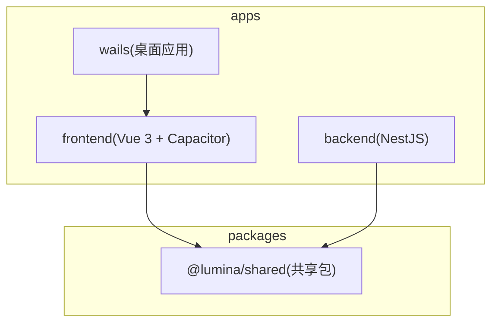
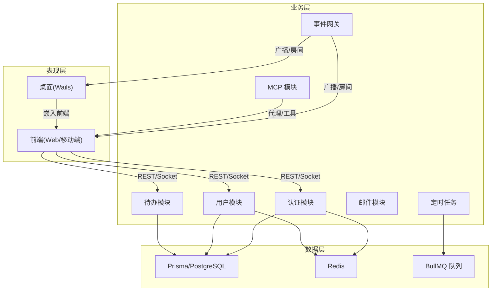
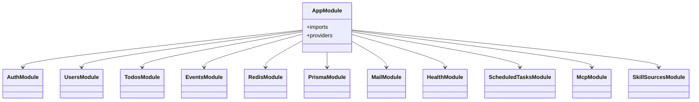
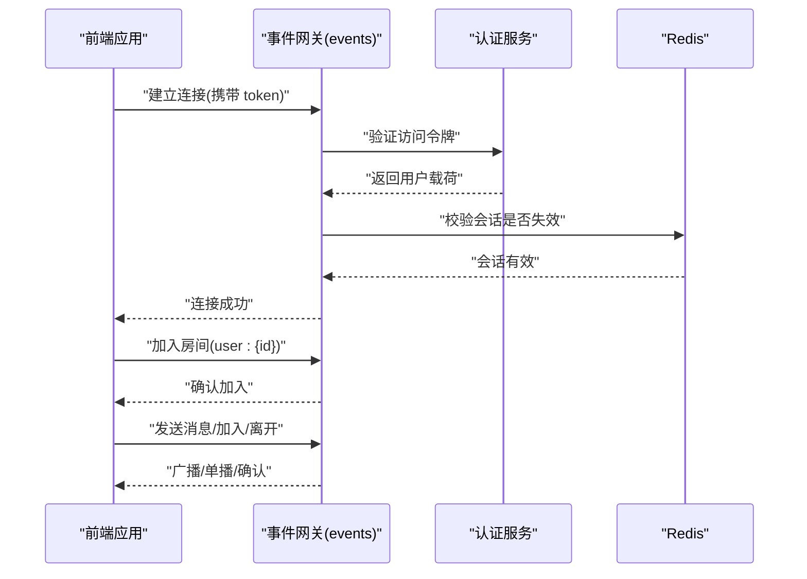
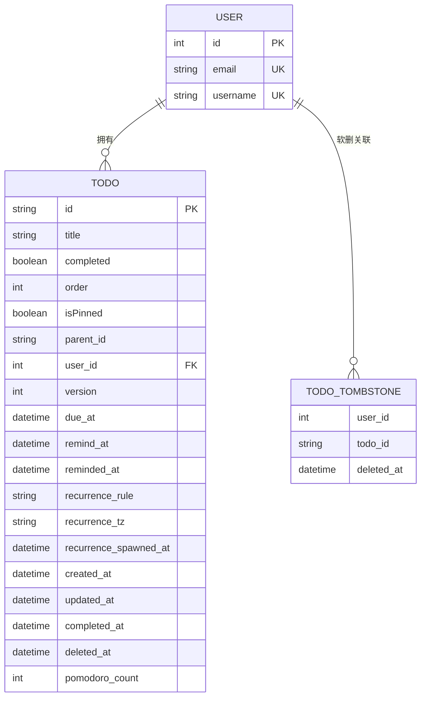
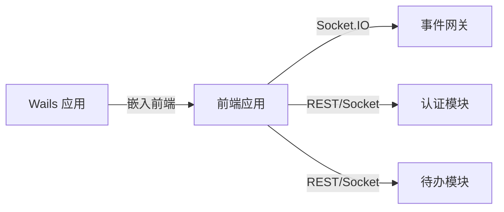
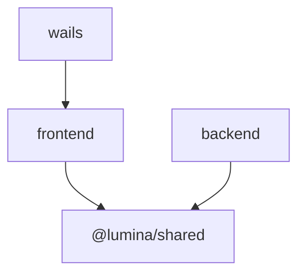

# 架构设计

<cite>
**本文引用的文件**
- [apps/backend/src/app.module.ts](file://apps/backend/src/app.module.ts)
- [apps/backend/nest-cli.json](file://apps/backend/nest-cli.json)
- [apps/backend/src/events/events.gateway.ts](file://apps/backend/src/events/events.gateway.ts)
- [apps/backend/src/auth/auth.module.ts](file://apps/backend/src/auth/auth.module.ts)
- [apps/backend/src/todos/todos.module.ts](file://apps/backend/src/todos/todos.module.ts)
- [apps/backend/prisma/schema/todo.prisma](file://apps/backend/prisma/schema/todo.prisma)
- [apps/backend/src/redis/redis.module.ts](file://apps/backend/src/redis/redis.module.ts)
- [apps/frontend/src/main.ts](file://apps/frontend/src/main.ts)
- [apps/frontend/src/composables/useSocket.ts](file://apps/frontend/src/composables/useSocket.ts)
- [apps/frontend/package.json](file://apps/frontend/package.json)
- [apps/wails/main.go](file://apps/wails/main.go)
- [apps/wails/go.mod](file://apps/wails/go.mod)
- [packages/shared/src/index.ts](file://packages/shared/src/index.ts)
- [packages/shared/package.json](file://packages/shared/package.json)
- [turbo.json](file://turbo.json)
- [pnpm-workspace.yaml](file://pnpm-workspace.yaml)
</cite>

## 目录
1. [引言](#引言)
2. [项目结构](#项目结构)
3. [核心组件](#核心组件)
4. [架构总览](#架构总览)
5. [详细组件分析](#详细组件分析)
6. [依赖分析](#依赖分析)
7. [性能考量](#性能考量)
8. [故障排查指南](#故障排查指南)
9. [结论](#结论)
10. [附录](#附录)

## 引言
本文件为 Lumina Todo 项目的架构设计文档，面向技术与非技术读者，系统阐述 monorepo 架构、技术栈选型、分层设计、模块化与依赖注入、实时通信、系统边界与组件交互、可扩展性与微服务化考虑、性能与安全设计等。项目采用多应用与共享包的组织方式：apps/ 下包含后端（NestJS）、前端（Vue 3 + Capacitor + Wails）、桌面应用（Wails）；packages/ 下包含共享包（@lumina/shared），统一数据模型与工具。

## 项目结构
项目采用 pnpm workspace + Turbo 的 monorepo 结构，通过工作区声明与任务编排实现跨应用的构建、测试与缓存复用。核心目录与职责如下：
- apps/backend：基于 NestJS 的后端服务，提供认证、用户、待办、事件网关、定时任务、邮件、缓存、健康检查等模块。
- apps/frontend：基于 Vue 3 的 Web/移动端应用，集成 Capacitor、Pinia、Vue Query、Socket.IO 客户端，支持 PWA 与原生能力。
- apps/wails：基于 Wails 的桌面应用，嵌入前端产物并提供原生菜单与窗口控制。
- packages/shared：共享包，导出 Zod Schema、通用 DTO、国际化键与工具函数，作为前后端与桌面端的“单一可信源”。

图表来源
- [pnpm-workspace.yaml:1-4](file://pnpm-workspace.yaml#L1-L4)
- [turbo.json:1-186](file://turbo.json#L1-L186)

章节来源
- [pnpm-workspace.yaml:1-4](file://pnpm-workspace.yaml#L1-L4)
- [turbo.json:1-186](file://turbo.json#L1-L186)

## 核心组件
- 应用入口与模块装配
  - 后端根模块集中装配配置、日志、事件发射、队列、速率限制、国际化、数据库、缓存、健康检查、认证、用户、邮件、事件网关、文件上传、技能来源、待办、定时任务、MCP 等模块，并提供全局守卫。
  - 前端应用入口初始化 Pinia、Vue Query、国际化、图表库、全局错误处理与持久化策略。
  - Wails 应用入口负责菜单、窗口、透明背景、平台特性以及嵌入前端静态资源。
- 实时通信
  - 后端通过 WebSocket 网关提供事件通道，支持房间、鉴权、广播与去抖广播；前端通过 Socket.IO 客户端建立连接、自动重连、认证失败时刷新令牌并重连。
- 数据与缓存
  - 数据库使用 Prisma，模型覆盖待办与墓碑表；缓存使用 Redis，提供全局缓存模块与可配置 TTL、键前缀与重试策略。
- 共享契约
  - 共享包导出 Zod Schema、通用 DTO、国际化键与工具函数，保证前后端一致性。

章节来源
- [apps/backend/src/app.module.ts:1-175](file://apps/backend/src/app.module.ts#L1-L175)
- [apps/frontend/src/main.ts:1-138](file://apps/frontend/src/main.ts#L1-L138)
- [apps/wails/main.go:1-95](file://apps/wails/main.go#L1-L95)
- [apps/backend/src/events/events.gateway.ts:1-266](file://apps/backend/src/events/events.gateway.ts#L1-L266)
- [apps/backend/src/redis/redis.module.ts:1-84](file://apps/backend/src/redis/redis.module.ts#L1-L84)
- [packages/shared/src/index.ts:1-22](file://packages/shared/src/index.ts#L1-L22)

## 架构总览
Lumina Todo 采用“表现层-业务层-数据层”的分层架构：
- 表现层：前端（Web/移动端）与桌面端（Wails）。前端通过 Socket.IO 与后端事件网关交互，通过 Pinia/Vue Query 管理状态与缓存；桌面端嵌入前端产物并暴露原生能力。
- 业务层：后端 NestJS 模块化服务，围绕认证、用户、待办、定时任务、邮件、缓存、事件网关等模块协作。
- 数据层：Prisma ORM + PostgreSQL（由 Prisma schema 定义），Redis 缓存与队列（BullMQ）支撑异步任务与会话/令牌管理。

图表来源
- [apps/backend/src/app.module.ts:1-175](file://apps/backend/src/app.module.ts#L1-L175)
- [apps/backend/src/events/events.gateway.ts:1-266](file://apps/backend/src/events/events.gateway.ts#L1-L266)
- [apps/backend/src/redis/redis.module.ts:1-84](file://apps/backend/src/redis/redis.module.ts#L1-L84)
- [apps/frontend/src/composables/useSocket.ts:1-176](file://apps/frontend/src/composables/useSocket.ts#L1-L176)

## 详细组件分析

### 后端根模块与模块化设计
- 模块装配：根模块集中引入配置、日志、事件发射、队列、速率限制、国际化、数据库、缓存、健康检查、认证、用户、邮件、事件网关、文件上传、技能来源、待办、定时任务、MCP 等模块，并提供全局守卫。
- 依赖注入：通过 @Module、providers、exports 形成清晰的依赖注入边界；部分模块使用 forwardRef 解决循环依赖。
- 配置与运行：Nest CLI 指定源码目录与国际化资源资产。

图表来源
- [apps/backend/src/app.module.ts:1-175](file://apps/backend/src/app.module.ts#L1-L175)
- [apps/backend/src/auth/auth.module.ts:1-41](file://apps/backend/src/auth/auth.module.ts#L1-L41)
- [apps/backend/src/todos/todos.module.ts:1-15](file://apps/backend/src/todos/todos.module.ts#L1-L15)

章节来源
- [apps/backend/src/app.module.ts:1-175](file://apps/backend/src/app.module.ts#L1-L175)
- [apps/backend/nest-cli.json:1-11](file://apps/backend/nest-cli.json#L1-L11)

### 实时通信架构（WebSocket 事件系统）
- 服务端
  - 使用 @WebSocketGateway 提供命名空间 /events，支持 WebSocket 与轮询传输，启用 CORS 白名单与凭证，显式允许的头部列表避免通配符警告。
  - 中间件校验访问令牌，校验会话是否失效；连接后自动加入用户房间 user:{userId}。
  - 提供消息、加入房间、离开房间等事件；内部提供广播同步通知方法，对同一用户的广播进行去抖（500ms）以降低风暴。
- 客户端
  - 前端通过 useSocket 封装 Socket.IO 客户端，设置 withCredentials、优先 WebSocket、自动重连与指数退避；在认证错误时尝试刷新访问令牌并重连；连接成功后加入用户房间。
  - 客户端提供 waitForConnection 等辅助方法，便于上层等待连接稳定。

图表来源
- [apps/backend/src/events/events.gateway.ts:1-266](file://apps/backend/src/events/events.gateway.ts#L1-L266)
- [apps/frontend/src/composables/useSocket.ts:1-176](file://apps/frontend/src/composables/useSocket.ts#L1-L176)

章节来源
- [apps/backend/src/events/events.gateway.ts:1-266](file://apps/backend/src/events/events.gateway.ts#L1-L266)
- [apps/frontend/src/composables/useSocket.ts:1-176](file://apps/frontend/src/composables/useSocket.ts#L1-L176)

### 数据模型与缓存策略
- 数据模型
  - 待办模型包含标题、完成状态、排序、置顶、父节点、版本、到期/提醒时间、重复规则与时区、番茄钟计数、软删除标记等字段，并建立复合索引以优化查询。
  - 墓碑模型记录软删除的用户与待办 ID，便于增量同步与审计。
- 缓存模块
  - 全局 Redis 缓存模块，支持可配置主机、端口、密码、DB、键前缀、TTL；连接失败自动重试最多 10 次，指数退避；提供 TTL 与 ready 检查。

图表来源
- [apps/backend/prisma/schema/todo.prisma:1-39](file://apps/backend/prisma/schema/todo.prisma#L1-L39)

章节来源
- [apps/backend/prisma/schema/todo.prisma:1-39](file://apps/backend/prisma/schema/todo.prisma#L1-L39)
- [apps/backend/src/redis/redis.module.ts:1-84](file://apps/backend/src/redis/redis.module.ts#L1-L84)

### 前端与桌面端集成
- 前端
  - 初始化 Pinia（含持久化插件）、Vue Query（默认过期时间与重试）、国际化、图表库、全局错误处理与动态 Chunk 加载容错。
  - 通过 useSocket 管理 Socket.IO 连接生命周期与认证错误处理。
- 桌面端（Wails）
  - 嵌入前端构建产物，提供菜单、窗口、透明背景、平台特性（Windows/macOS），启动时绑定应用实例并注入菜单与窗口行为。

图表来源
- [apps/frontend/src/main.ts:1-138](file://apps/frontend/src/main.ts#L1-L138)
- [apps/frontend/src/composables/useSocket.ts:1-176](file://apps/frontend/src/composables/useSocket.ts#L1-L176)
- [apps/wails/main.go:1-95](file://apps/wails/main.go#L1-L95)

章节来源
- [apps/frontend/src/main.ts:1-138](file://apps/frontend/src/main.ts#L1-L138)
- [apps/frontend/package.json:1-104](file://apps/frontend/package.json#L1-L104)
- [apps/wails/main.go:1-95](file://apps/wails/main.go#L1-L95)
- [apps/wails/go.mod:1-38](file://apps/wails/go.mod#L1-L38)

### 共享包（@lumina/shared）
- 导出 Zod Schema、通用 DTO、国际化键与工具函数，作为“单一可信源”，在后端 Prisma、前端与桌面端之间保持数据契约一致。
- 构建产物通过 tsup 输出 ESM/UMD 类型文件，支持类型检查与测试。

章节来源
- [packages/shared/src/index.ts:1-22](file://packages/shared/src/index.ts#L1-L22)
- [packages/shared/package.json:1-51](file://packages/shared/package.json#L1-L51)

## 依赖分析
- 工作区与任务编排
  - pnpm workspace 声明 apps 与 packages 子包；Turbo 任务定义了各应用的输入输出、依赖顺序、缓存策略与持久任务。
- 应用间依赖
  - 前端依赖共享包 @lumina/shared；后端通过 Prisma 与 Redis 模块访问数据与缓存；事件网关为前后端提供实时通道。
- 第三方依赖
  - 前端使用 Socket.IO 客户端、Vue Query、Pinia、TailwindCSS、Mermaid、KaTeX 等；Wails 依赖 Go 生态与 WebView2；共享包依赖 Zod。

图表来源
- [pnpm-workspace.yaml:1-4](file://pnpm-workspace.yaml#L1-L4)
- [turbo.json:1-186](file://turbo.json#L1-L186)
- [apps/frontend/package.json:1-104](file://apps/frontend/package.json#L1-L104)

章节来源
- [pnpm-workspace.yaml:1-4](file://pnpm-workspace.yaml#L1-L4)
- [turbo.json:1-186](file://turbo.json#L1-L186)
- [apps/frontend/package.json:1-104](file://apps/frontend/package.json#L1-L104)

## 性能考量
- 前端
  - 动态导入失败容错与页面刷新策略，避免部署后 Chunk 404 导致的无限循环；Vue Query 默认过期时间与重试策略平衡实时性与网络压力。
  - 图表库按需注册渲染器与组件，减少初始体积。
- 后端
  - Redis 连接具备重试与 ready 检查，避免瞬时故障影响；队列默认保留完成任务、失败任务便于排查；日志模块按状态码自定义日志级别，降低噪音。
  - 事件网关对同一用户的广播进行去抖，减少风暴。
- 构建与缓存
  - Turbo 为各应用定义输入输出与全局依赖，提升增量构建效率与缓存命中率。

章节来源
- [apps/frontend/src/main.ts:1-138](file://apps/frontend/src/main.ts#L1-L138)
- [apps/backend/src/redis/redis.module.ts:1-84](file://apps/backend/src/redis/redis.module.ts#L1-L84)
- [apps/backend/src/events/events.gateway.ts:1-266](file://apps/backend/src/events/events.gateway.ts#L1-L266)
- [turbo.json:1-186](file://turbo.json#L1-L186)

## 故障排查指南
- Socket 连接问题
  - 前端在认证错误时尝试刷新令牌并重连；若仍失败，检查后端事件网关的 CORS 配置与令牌有效性；确认用户房间加入逻辑与会话失效校验。
- 前端动态 Chunk 加载失败
  - 观察全局错误处理器对动态导入错误的检测与刷新策略；必要时手动刷新或等待 10 秒冷却。
- Redis 连接异常
  - 查看重试日志与最大重试次数；确认主机、端口、密码、DB、键前缀与 TTL 配置；检查网络连通性。
- 任务队列与定时任务
  - 关注队列默认选项（完成清理、失败保留、重试次数与指数退避）；核对定时任务处理器的执行上下文与依赖注入。

章节来源
- [apps/frontend/src/composables/useSocket.ts:1-176](file://apps/frontend/src/composables/useSocket.ts#L1-L176)
- [apps/frontend/src/main.ts:1-138](file://apps/frontend/src/main.ts#L1-L138)
- [apps/backend/src/redis/redis.module.ts:1-84](file://apps/backend/src/redis/redis.module.ts#L1-L84)
- [apps/backend/src/events/events.gateway.ts:1-266](file://apps/backend/src/events/events.gateway.ts#L1-L266)

## 结论
Lumina Todo 通过 monorepo 与模块化设计实现了清晰的分层与职责分离：表现层专注用户体验与实时交互，业务层提供稳定的领域服务，数据层以 Prisma 与 Redis 保障一致性与性能。共享包统一数据契约，Wails 与 Capacitor 扩展了部署形态。实时通信、缓存与队列策略共同提升了系统的可用性与可维护性。未来可在微服务化、可观测性与安全加固方面持续演进。

## 附录
- 技术栈选型说明
  - NestJS：模块化、依赖注入、装饰器与生态完善，适合复杂后端服务。
  - Vue 3 + Pinia + Vue Query：组合式 API、状态持久化与缓存，适合现代前端体验。
  - Wails：将前端嵌入原生窗口，兼顾跨平台与原生能力。
  - Capacitor：移动端能力桥接，配合 PWA 与原生插件生态。
  - Prisma：强类型 ORM，Schema 驱动，提升开发效率与一致性。
  - Redis/BullMQ：缓存与异步任务，支撑高并发与解耦。
  - Socket.IO：跨平台实时通信，兼容轮询与 WebSocket。